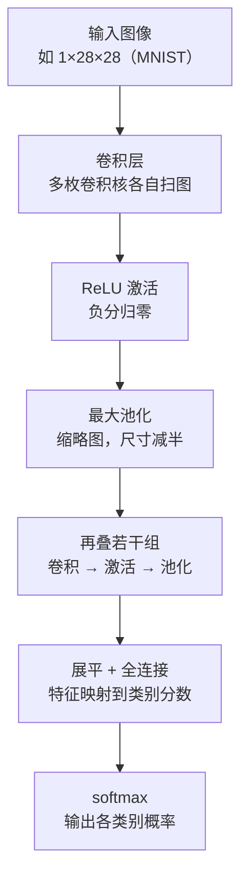
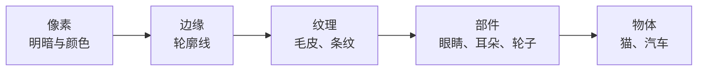
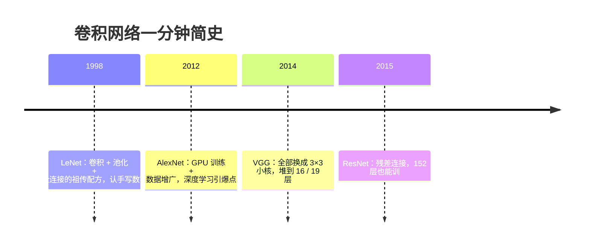

# CNN 卷积神经网络

> **一句话理解**：CNN 用一摞"小模板"在图上滑动比对——先找边缘、再拼纹理、最后认物体，用极少的参数学会看图。

[⬆️ 返回总目录](../../../README.md) · [⬆️ 返回本篇](../README.md) · [⬅️ 返回本章目录](./README.md)

| 属性 | 说明 |
|------|------|
| 难度 | ⭐⭐⭐（较难） |
| 所属分支 | 视觉 |
| 前置知识 | [01-神经网络是怎么炼成的](../../3-深度学习/04-深度学习基础/01-神经网络是怎么炼成的.md)、[02-训练一个模型的完整流程](../../3-深度学习/04-深度学习基础/02-训练一个模型的完整流程.md) |

---

## 📌 这一节解决什么问题

把一张 224×224 的彩色图喂给第 4 章的全连接网络，输入是 224×224×3 ≈ 15 万个数。哪怕第一层只要 1000 个神经元，这一层的参数就是 15 万 × 1000 = **1.5 亿**——图片稍大一点参数直接爆炸，既训不动，也极易过拟合。

更糟的是，全连接"一视同仁"地把每个像素与每个神经元相连，完全没有利用图像的特点：**一只猫不管出现在图的左上角还是右下角，都是猫**。全连接网络却要把"左上角的猫"和"右下角的猫"当成两件毫不相干的事，重新学一遍。

卷积神经网络（Convolutional Neural Network, CNN）用两个直击图像本质的假设解决了这两个问题：

- **局部相关**：相邻像素才是一伙的，识别"边缘"只需看一小块邻域，不必整图全连；
- **平移不变**：猫的耳朵在哪个位置，"耳朵模板"长得都一样——一枚模板可以全图复用。

这两个假设让参数量从"亿"级掉到"百"级，还顺带长出了"先找边缘、再拼物体"的层级结构。自 2012 年 AlexNet 在 ImageNet 大规模视觉识别竞赛中大胜以来，CNN 统治视觉领域十余年，直到下一页的 ViT 出现才有了真正的对手。

## 🌱 通俗理解

把卷积核（kernel）想象成一枚**小印章**，上面刻着一种图案，比如"竖着的明暗交界线"。看图时，你拿着这枚印章在照片上从左到右、从上到下逐格滑动，每个位置比对一次："这里和印章上的图案像不像？"像就打高分，不像打低分。全部滑完，得到一张"打分图"——哪里亮，说明哪里有竖边缘。这张打分图就叫**特征图（Feature Map）**。

一枚印章只认一种图案，所以 CNN 会同时用很多枚印章（比如 64 个卷积核），得到 64 张打分图，分别记录"哪里有竖边缘""哪里有横边缘""哪里有大块绿色"……

**权值共享**说的是：同一枚印章全图复用——猫在左上还是右下，都用同一枚"耳朵印章"去盖。印章本身只有 3×3 = 9 个参数，全图滑一遍也还是这 9 个参数，这就是参数不爆炸的秘密。

**池化（Pooling）**则是给打分图做**缩略图**：把图切成 2×2 的小块，每块只保留最大值（最大池化）。分辨率降了，但"哪里有边缘"这个信息还在——就像你看缩略图也认得出照片里是猫。

一层层叠起来，就出现了本章最核心的直觉：**浅层看像素，中层认纹理，深层识部件，最后认出物体**。

## 📋 举个例子

拿一个最小的例子手算一次卷积。输入是一张 5×5 灰度图（0 表示暗、1 表示亮），左边两列暗、右边三列亮——中间有一条**竖直边缘**。

输入图 I（5×5）：

```text
0 0 1 1 1
0 0 1 1 1
0 0 1 1 1
0 0 1 1 1
0 0 1 1 1
```

卷积核 K（3×3，专找"左暗右亮"的竖边缘）：

```text
-1 0 1
-1 0 1
-1 0 1
```

把核的左上角对齐输入图左上角，覆盖第 1~3 行、第 1~3 列的小窗口，对应相乘再求和：

```text
窗口            核
0 0 1         -1 0 1
0 0 1    ⊙    -1 0 1     每行：0×(-1) + 0×0 + 1×1 = 1
0 0 1         -1 0 1     三行合计：1 + 1 + 1 = 3
```

所以输出图第 1 行第 1 列 = **3**：这个窗口里有竖边缘，打高分！

<details>
<summary>📊 展开完整滑动过程（9 个窗口全算一遍）</summary>

5×5 的图、3×3 的核、每次滑 1 格（步幅 stride = 1）、不补零，输出大小 = 5 − 3 + 1 = **3×3**。

每个窗口的算法与上面完全相同：三行各自算"左列×(−1) + 中列×0 + 右列×1"，再求和。输入每行都是 [0, 0, 1, 1, 1]，所以三种列组合决定一切：

| 窗口覆盖的列 | 每行的乘加 | 行得分 | 窗口得分（3 行合计） |
|---|---|---|---|
| 列 1~3：[0, 0, 1] | 0×(−1) + 0×0 + 1×1 | 1 | 3 |
| 列 2~4：[0, 1, 1] | 0×(−1) + 1×0 + 1×1 | 1 | 3 |
| 列 3~5：[1, 1, 1] | 1×(−1) + 1×0 + 1×1 | 0 | 0 |

行位置（第 1、2、3 行起始）不影响结果，因为输入每行相同。于是输出特征图（3×3）：

```text
3 3 0
3 3 0
3 3 0
```

读一遍结果：窗口里**包含明暗交界**（既有 0 又有 1）就得 3，**全亮**（全是 1）得 0——这枚核像手电筒，只照亮"左暗右亮"的交界处，输出图亮起来的位置正好标出了边缘在哪。

</details>

## 🧠 核心原理

### 整体流程



而层层堆叠之后，网络学到的东西长这样（**本章核心直觉图**）：



没有人规定它必须这样学——这是从训练好的网络里"看"出来的现象：浅层卷积核确实长得像边缘、颜色检测器；层数越深，响应的图案越复杂、越接近语义。

### 逐步拆解

**① 卷积：模板滑动比对**

$$
O(i, j) = \sum_{m=0}^{k-1} \sum_{n=0}^{k-1} I(i+m,\; j+n) \cdot K(m, n)
$$

> 👉 **人话**：输出图的第 (i, j) 格 = 把模板 K 盖在以 (i, j) 为左上角的窗口上，对应相乘再求和——就是"这个窗口跟模板有多像"的打分。

输出尺寸也有公式可算：

$$
O_{size} = \frac{I_{size} - K + 2P}{S} + 1
$$

> 👉 **人话**：图越大、补零（padding，P）越多，输出越大；核越大、步幅（stride，S）越大，输出越小。本页例子 I=5、K=3、P=0、S=1，得 5−3+1=3；下面代码里 28 的图配 padding=1 的 3×3 核，尺寸不变还是 28。

**② 权值共享：一枚模板全图复用**

一枚 3×3 的印章只有 9 个权重（彩色图上是 3×3×3 = 27 个），不管图有多大、滑动多少次，参数还是这么多。对比一下：

- 全连接第一层：224×224×3 输入 × 1000 神经元 ≈ **1.5 亿**参数；
- 一枚 3×3×3 卷积核：**27** 个参数；64 枚核一起上也才 1 千多参数，却能扫遍全图。

**③ 多卷积核 → 多张特征图**

64 枚印章 = 64 张打分图 = 64 个通道。下一层卷积核在"64 通道的打分图"上继续滑——它能组合出"边缘 + 边缘 = 纹理"这类更复杂的图案，层级抽象就这样一节节长出来。

**④ 池化：缩略图**

最常见的最大池化（Max Pooling）：2×2 窗口只留最大值，尺寸减半。作用有三个：降计算量、扩大**感受野（Receptive Field）**、带来小幅平移不变性（猫挪半格，窗口最大值常常不变）。

**⑤ 感受野：一眼能看多宽**

某一层的一个输出值，能"看到"输入图中多大范围，就叫它的感受野。单枚 3×3 核一次只看 3×3；但堆 3 层 3×3 卷积后，一个输出值回溯到原图已是 7×7 的范围——**层数越深，感受野越大**，深层的"物体神经元"因此看得见整只猫，而不只是猫的一根毛。顺带一算：两层 3×3（共 18 个权重）的感受野等于一层 5×5（25 个权重）——"小核深堆"更省参数，这就是 VGG 的算盘。

### 经典架构一分钟简史



ResNet 的残差（Residual）连接值得记一辈子：

$$
y = F(x) + x
$$

> 👉 **人话**：每一层不再硬学"从输入到输出的整段路"，只学"要抄的近道" F(x)，再原样加上输入 x。最不济时网络把 F(x) 学成 0，信号也能沿原路通过（恒等映射），深网络因此不"走丢"——梯度消失大幅缓解，网络深度从二十几层一举跨进上百层。

### 迁移学习：用人家练好的眼力

在 ImageNet（百万量级图片、上千类别）上练好的 CNN，浅层卷积核已经是现成的"边缘、纹理检测器"，通用性极强。**迁移学习（Transfer Learning）**的做法：拿一个预训练网络，砍掉最后的分类头，接上自己的头，再用自己（可能很小）的数据集微调（fine-tune）。几百张图也能做出不错的分类器——下一页的代码会直接调用预训练 ResNet 做推理，亲身体验"人家练好的眼力"。

## 💻 动手试试

```python
import torch
import torch.nn as nn
import torch.optim as optim
from torchvision import datasets, transforms
from torch.utils.data import DataLoader

torch.manual_seed(0)  # 固定随机种子，结果可复现

# 1. 数据：MNIST 手写数字（28×28 灰度、10 类；首次运行自动下载，需联网）
transform = transforms.Compose([
    transforms.ToTensor(),                       # 像素缩放到 [0, 1]
    transforms.Normalize((0.1307,), (0.3081,)),  # 用 MNIST 的均值/标准差做标准化
])
train_set = datasets.MNIST("./data", train=True, download=True, transform=transform)
train_loader = DataLoader(train_set, batch_size=128, shuffle=True)

# 2. 小 CNN：两组「卷积 → ReLU → 最大池化」，再接全连接分类
class SmallCNN(nn.Module):
    def __init__(self):
        super().__init__()
        self.net = nn.Sequential(
            nn.Conv2d(1, 16, kernel_size=3, padding=1),   # 16 枚 3×3 印章 → [16, 28, 28]
            nn.ReLU(),
            nn.MaxPool2d(2),                              # 缩略图 → [16, 14, 14]
            nn.Conv2d(16, 32, kernel_size=3, padding=1),  # 32 枚印章 → [32, 14, 14]
            nn.ReLU(),
            nn.MaxPool2d(2),                              # → [32, 7, 7]
            nn.Flatten(),                                 # 32×7×7 = 1568 → 一维
            nn.Linear(32 * 7 * 7, 10),                    # 映射到 10 个数字类别
        )

    def forward(self, x):
        return self.net(x)

device = "cuda" if torch.cuda.is_available() else "cpu"
model = SmallCNN().to(device)
print("参数总量：", sum(p.numel() for p in model.parameters()))  # 两万出头；全连接方案要上百万

optimizer = optim.Adam(model.parameters(), lr=1e-3)
loss_fn = nn.CrossEntropyLoss()

# 3. 训练循环：复用第 4 章「训练一个模型的完整流程」的四步模板
for epoch in range(1, 3):                     # 教学演示跑 2 轮即可
    model.train()
    for x, y in train_loader:
        x, y = x.to(device), y.to(device)
        loss = loss_fn(model(x), y)   # ① 前向算损失
        optimizer.zero_grad()         # ② 清空上一步梯度
        loss.backward()               # ③ 反向传播算梯度
        optimizer.step()              # ④ 更新参数
    print(f"epoch {epoch}  最后一批 loss = {loss.item():.4f}")

# 预期输出：
# 参数总量： 20490
# epoch 1  最后一批 loss ≈ 0.1 上下
# epoch 2  最后一批 loss ≈ 0.05 上下
# 只训 2 轮，测试集准确率通常已在 98% 左右（经验参考；CPU 数分钟、GPU 几十秒）
```

## 🔥 炼丹小灶

> 🔥 **炼丹小灶**：工业界常用起点配方与玄学——
> - 配方：Adam lr=1e-3、batch=128、10~50 epoch 起步；**数据增广（Data Augmentation）是视觉项目的第一杠杆**——随机裁剪、水平翻转、轻微旋转与色彩抖动先上（程度要贴任务：医学影像别乱翻转，文字图片别上下颠倒）。
> - 玄学：loss 不降先可视化一批数据（图读对了吗？归一化配对了吗？），再怀疑人生；小数据集上"冻结预训练骨干、只训新接的头"常常是第二根杠杆。
> - ⚠️ 以上是经验参考值，不是圣旨；换数据集请重新炼。

## 🖱️ 动手玩

> 🕹️ **延伸玩一玩**：[CNN Explainer](https://poloclub.github.io/cnn-explainer/)——在浏览器里逐层看卷积核扫过图片、特征图怎么一层层抽象出来，和本页"印章→缩略图"的直觉一一对应。

## 🔗 在知识树中的位置

- **上游**：建立在[神经网络是怎么炼成的](../../3-深度学习/04-深度学习基础/01-神经网络是怎么炼成的.md)与[训练一个模型的完整流程](../../3-深度学习/04-深度学习基础/02-训练一个模型的完整流程.md)之上，本页代码就复用了那套训练循环模板。
- **下游**：[视觉三大任务](./02-视觉三大任务.md)（检测、分割的骨干网络基本都是 CNN）、[ViT 视觉 Transformer](./03-ViT视觉Transformer.md)（CNN 的挑战者）；"图像变成可计算的表示"这条线，一路通往第 12 章[多模态模型](../../5-前沿与融合/12-生成模型与多模态/04-多模态模型.md)。
- **横向对比**：CNN 靠"局部 + 共享"的归纳偏置吃遍小数据；ViT 靠注意力吃大数据——对比表见下一页。

## ⚠️ 常见误区

- **误区一**："卷积核是专家手工设计好的" → 本页的边缘核只是教学道具；真实 CNN 的核**随机初始化、由训练学出**，最终长成什么样由数据说了算。
- **误区二**："池化是为了防过拟合" → 主作用是降维、扩大感受野、带来平移不变性；防过拟合主要靠增广、正则和数据量。
- **误区三**："网络越深越好" → 深到一定程度梯度传不动、性能不升反降，ResNet 的残差连接就是为解决"深了训不动"而来。

## 📝 小结与自测

**要点回顾**

- 卷积 = 小模板滑动比对，参数极少，且天然匹配图像的局部性与平移不变性；
- 多核多通道逐层堆叠：像素 → 边缘 → 纹理 → 部件 → 物体；
- 池化做缩略图；感受野随层数变大；残差连接让深网络可训；迁移学习让小数据也能借大眼力。

**自测一下**（点击展开答案）

<details>
<summary>问题 1：7×7 的输入、3×3 的核、步幅 1、不补零，输出是多大？</summary>

输出 = 7 − 3 + 1 = **5×5**。若步幅改为 2，则 (7−3)/2 + 1 = 3，输出 3×3。

</details>

<details>
<summary>问题 2：为什么一枚 3×3 卷积核扫一张 4K 大图，参数也只有 9 个？</summary>

因为**权值共享**：同一枚核在所有位置复用同一组权重，滑动改变的只是位置，不增加参数。这正是 CNN 的参数量与图像大小解耦、小模板也能看大图的原因。

</details>

## 📚 延伸阅读

- 论文：LeCun et al., *Gradient-Based Learning Applied to Document Recognition*（LeNet, 1998）；He et al., *Deep Residual Learning for Image Recognition*（ResNet, 2015）
- 课程：Stanford CS231n（计算机视觉经典课）
- 交互：[CNN Explainer](https://poloclub.github.io/cnn-explainer/)（同上文，值得反复玩）

---

[⬅️ 上一页：本章目录](./README.md) · [返回本章目录](./README.md) · [下一页：视觉三大任务 ➡️](./02-视觉三大任务.md)
