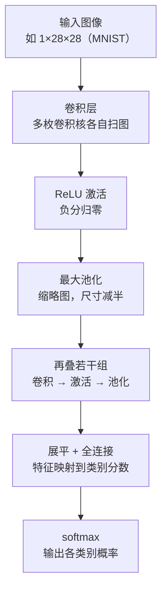
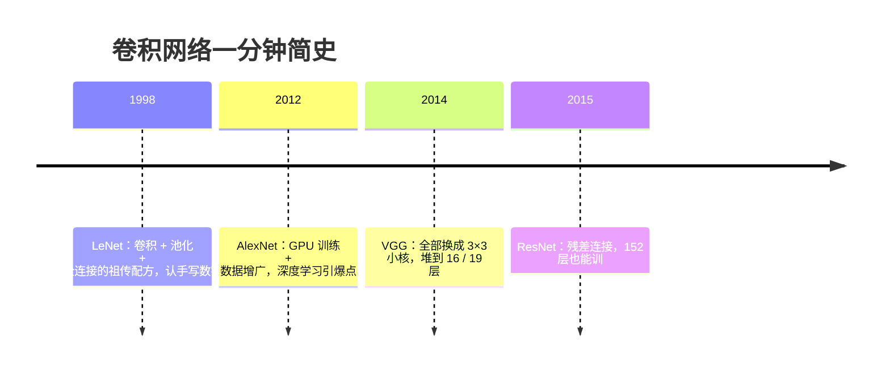

# CNN 卷积神经网络

> **一句话理解**：CNN 用一摞"小模板"在图上滑动比对——先找边缘、再拼纹理、最后认物体，用极少的参数学会看图。

[⬆️ 返回总目录](../../../README.md) · [⬆️ 返回本篇](../README.md) · [⬅️ 返回本章目录](./README.md)

| 属性 | 说明 |
|------|------|
| 难度 | ⭐⭐⭐（较难） |
| 所属分支 | 视觉 |
| 前置知识 | [01-神经网络是怎么炼成的](../../3-深度学习/04-深度学习基础/01-神经网络是怎么炼成的.md)、[02-训练一个模型的完整流程](../../3-深度学习/04-深度学习基础/02-训练一个模型的完整流程.md) |

---

## 📌 这一节解决什么问题

把一张 224×224 的彩色图喂给第 4 章的全连接网络，输入是 224×224×3 ≈ 15 万个数。哪怕第一层只要 1000 个神经元，这一层的参数就是 15 万 × 1000 = **1.5 亿**——图片稍大一点参数直接爆炸，既训不动，也极易过拟合。

更糟的是，全连接"一视同仁"地把每个像素与每个神经元相连，完全没有利用图像的特点：**一只猫不管出现在图的左上角还是右下角，都是猫**。全连接网络却要把"左上角的猫"和"右下角的猫"当成两件毫不相干的事，重新学一遍。

卷积神经网络（Convolutional Neural Network, CNN）用两个直击图像本质的假设解决了这两个问题：

- **局部相关**：相邻像素才是一伙的，识别"边缘"只需看一小块邻域，不必整图全连；
- **平移不变**：猫的耳朵在哪个位置，"耳朵模板"长得都一样——一枚模板可以全图复用。

这两个假设让参数量从"亿"级掉到"百"级，还顺带长出了"先找边缘、再拼物体"的层级结构。自 2012 年 AlexNet 在 ImageNet 大规模视觉识别竞赛中大胜以来，CNN 统治视觉领域十余年，直到下一页的 ViT 出现才有了真正的对手。

## 🌱 通俗理解

把卷积核（kernel）想象成一枚**小印章**，上面刻着一种图案，比如"竖着的明暗交界线"。看图时，你拿着这枚印章在照片上从左到右、从上到下逐格滑动，每个位置比对一次："这里和印章上的图案像不像？"像就打高分，不像打低分。全部滑完，得到一张"打分图"——哪里亮，说明哪里有竖边缘。这张打分图就叫**特征图（Feature Map）**。

一枚印章只认一种图案，所以 CNN 会同时用很多枚印章（比如 64 个卷积核），得到 64 张打分图，分别记录"哪里有竖边缘""哪里有横边缘""哪里有大块绿色"……

**权值共享**说的是：同一枚印章全图复用——猫在左上还是右下，都用同一枚"耳朵印章"去盖。印章本身只有 3×3 = 9 个参数，全图滑一遍也还是这 9 个参数，这就是参数不爆炸的秘密。

**池化（Pooling）**则是给打分图做**缩略图**：把图切成 2×2 的小块，每块只保留最大值（最大池化）。分辨率降了，但"哪里有边缘"这个信息还在——就像你看缩略图也认得出照片里是猫。

一层层叠起来，就出现了本章最核心的直觉：**浅层看像素，中层认纹理，深层识部件，最后认出物体**。

## 📋 举个例子

拿一个最小的例子手算一次卷积。输入是一张 5×5 灰度图（0 表示暗、1 表示亮），左边两列暗、右边三列亮——中间有一条**竖直边缘**。

输入图 I（5×5）：

```text
0 0 1 1 1
0 0 1 1 1
0 0 1 1 1
0 0 1 1 1
0 0 1 1 1
```

卷积核 K（3×3，专找"左暗右亮"的竖边缘）：

```text
-1 0 1
-1 0 1
-1 0 1
```

把核的左上角对齐输入图左上角，覆盖第 1~3 行、第 1~3 列的小窗口，对应相乘再求和：

```text
窗口            核
0 0 1         -1 0 1
0 0 1    ⊙    -1 0 1     每行：0×(-1) + 0×0 + 1×1 = 1
0 0 1         -1 0 1     三行合计：1 + 1 + 1 = 3
```

所以输出图第 1 行第 1 列 = **3**：这个窗口里有竖边缘，打高分！

<details>
<summary>📊 展开完整滑动过程（9 个窗口全算一遍）</summary>

5×5 的图、3×3 的核、每次滑 1 格（步幅 stride = 1）、不补零，输出大小 = 5 − 3 + 1 = **3×3**。

每个窗口的算法与上面完全相同：三行各自算"左列×(−1) + 中列×0 + 右列×1"，再求和。输入每行都是 [0, 0, 1, 1, 1]，所以三种列组合决定一切：

| 窗口覆盖的列 | 每行的乘加 | 行得分 | 窗口得分（3 行合计） |
|---|---|---|---|
| 列 1~3：[0, 0, 1] | 0×(−1) + 0×0 + 1×1 | 1 | 3 |
| 列 2~4：[0, 1, 1] | 0×(−1) + 1×0 + 1×1 | 1 | 3 |
| 列 3~5：[1, 1, 1] | 1×(−1) + 1×0 + 1×1 | 0 | 0 |

行位置（第 1、2、3 行起始）不影响结果，因为输入每行相同。于是输出特征图（3×3）：

```text
3 3 0
3 3 0
3 3 0
```

读一遍结果：窗口里**包含明暗交界**（既有 0 又有 1）就得 3，**全亮**（全是 1）得 0——这枚核像手电筒，只照亮"左暗右亮"的交界处，输出图亮起来的位置正好标出了边缘在哪。

</details>

**换三种输入再盖一次章，看卷积的"正常 / 极端 / 失败"三张脸**（都用上面那枚竖边缘核）：

| 输入 | 输出 | 这说明了什么 |
|---|---|---|
| 全亮图（全是 1） | 全 0 | 正常特性：没有明暗交界就没有响应——这枚核只关心"变化"，不关心"亮不亮" |
| 横条纹（前 3 行全亮、后 2 行全暗） | 全 0 | 极端情况暴露方向选择性：竖边缘核对横边缘完全"失明"——所以每层必须同时配多方向的核 |
| 5×5 输入、步幅 S=3 | 公式 (5−3)/3+1 = 1.67 → 取整得 1 | 失败现场：除不尽时右、下方向的窗口被直接丢弃，边角信息悄悄蒸发——工程救法是补零凑整或改步幅（见下文 padding 一节） |

## 🧠 核心原理

### 整体流程



而层层堆叠之后，网络学到的东西长这样（**本章核心直觉图**）：


没有人规定它必须这样学——这是从训练好的网络里"看"出来的现象：浅层卷积核确实长得像边缘、颜色检测器；层数越深，响应的图案越复杂、越接近语义。

### 逐步拆解

**① 卷积：模板滑动比对（它其实是"互相关"）**

$$
O(i, j) = \sum_{m=0}^{k-1} \sum_{n=0}^{k-1} I(i+m,\; j+n) \cdot K(m, n)
$$

> 👉 **人话**：输出图的第 (i, j) 格 = 把模板 K 盖在以 (i, j) 为左上角的窗口上，对应相乘再求和——就是"这个窗口跟模板有多像"的打分。

一个常被忽略的细节：严格的数学卷积要求先把核**旋转 180°** 再滑动，而所有深度学习框架实现的其实是**互相关（Cross-Correlation）**——不翻转、直接对位乘加。这不算"作弊"：核是随机初始化、由训练学出来的，"旋转后的核"和"未旋转的核"只是参数排列不同，训练会自己学出正确的朝向，于是工程上干脆省掉翻转，依然沿用"卷积"这个名字。

**② 输出尺寸与参数量：两个公式实算**

$$
O_{size} = \left\lfloor \frac{I_{size} - K + 2P}{S} \right\rfloor + 1
$$

> 👉 **人话**：图越大、补零（padding，P）越多，输出越大；核越大、步幅（stride，S）越大，输出越小。本页例子 I=5、K=3、P=0、S=1，得 5−3+1=3；下面代码里 28 的图配 padding=1 的 3×3 核，(28−3+2)/1+1 = 28，尺寸不变。

$$
\text{参数量} = (K \times K \times C_{in} + 1) \times C_{out}
$$

> 👉 **人话**：一枚核要"盖住"输入的全部 C_in 个通道（所以是 K×K×C_in 这么大一枚），每个输出通道发一枚核（×C_out），再给每个输出通道一个偏置（+1×C_out）。

<details>
<summary>🧮 展开实算：下面代码 SmallCNN 的 20490 个参数怎么来的</summary>

逐层套参数量公式：

- `Conv2d(1, 16, 3)`：(3×3×1 + 1) × 16 = 10 × 16 = **160**
- `Conv2d(16, 32, 3)`：(3×3×16 + 1) × 32 = 145 × 32 = **4640**
- `Linear(1568, 10)`：1568 × 10 + 10 = **15690**

合计 160 + 4640 + 15690 = **20490**——正是代码里打印的数字。两个值得咂摸的现象：

1. **通道数对参数量的影响是平方的**：16→32 通道（×2）让第二层卷积参数 4640，而若 16→64（×4）则是 (288+1)×64 ≈ 18496——通道翻倍、参数翻四倍（因为 K×K×C_in 和 C_out 同时变大）；
2. **大头往往在全连接层**：本例 76% 的参数躺在最后的 Linear 里——这就是现代网络用全局平均池化替代"展平 + 大全连接"（GoogLeNet、ResNet 的做法）的动机：把 32×7×7 先做全局平均变成 32，Linear 就只剩 32×10 = 330 个参数。

</details>

**③ 多通道卷积：C_in → C_out 的完整形状流**

彩色图（3 通道）进、64 张打分图出，中间到底怎么"乘"出来的？关键认知：**卷积核从来不是 3×3 的薄片，而是 3×3×C_in 的"小方块"**。一次前向的形状流：

```text
输入          [B, C_in=3, 224, 224]
卷积核        [C_out=64, C_in=3, 3, 3]      ← 64 个小方块，每个 3×3×3=27 个权重
输出          [B, C_out=64, 224, 224]
```

每个输出通道 c 的打分图 = **把第 c 个小方块分别在 R、G、B 三个通道上各滑一遍（得到 3 张中间打分图），再逐位置相加，加一个偏置 b_c**。也就是说输出在通道维上"混合"了输入的全部通道——下一层卷积因此能组合"边缘 + 颜色"这类跨通道特征，64 通道的纹理就是这么拼出来的。

**④ 权值共享：一枚模板全图复用**

一枚 3×3 的印章只有 9 个权重（彩色图上是 3×3×3 = 27 个），不管图有多大、滑动多少次，参数还是这么多。对比一下：

- 全连接第一层：224×224×3 输入 × 1000 神经元 ≈ **1.5 亿**参数；
- 一枚 3×3×3 卷积核：**27** 个参数；64 枚核一起上也才 1 千多参数，却能扫遍全图。

**⑤ 池化与 padding：same / valid 两种语义，以及边界吃了什么亏**

最常见的最大池化（Max Pooling）：2×2 窗口只留最大值，尺寸减半。作用有三个：降计算量、扩大**感受野（Receptive Field）**、带来小幅平移不变性（猫挪半格，窗口最大值常常不变）。

padding 的两种常用语义：

- **valid**（P=0）：不补零，输出缩小（(W−F+1)）。暗坑在**边界信息不公**：中心像素会被 9 个 3×3 窗口看到（9 次参与打分），而角落像素只被 1 个窗口看到——边界的特征"证据不足"，叠几层后边界特征系统性偏弱；
- **same**（S=1 时取 P=(F−1)/2，如 3×3 配 P=1）：补一圈零，输出尺寸不变。代价是补进来的"0"与图像值的交界本身会制造假边缘——网络通常能学会忽略，但极端小图上要心里有数。

> 👉 **人话**：valid 是"不垫垫子、图越卷越小、边界吃点亏"；same 是"垫一圈零保住尺寸、但垫子接缝处可能骗到边缘核"。工程默认 3×3 卷积配 padding=1，两头的亏都最小。

**⑥ 感受野：一眼能看多宽**

某一层的一个输出值，能"看到"输入图中多大范围，就叫它的感受野。单枚 3×3 核一次只看 3×3；但堆 3 层 3×3 卷积后，一个输出值回溯到原图已是 7×7 的范围——**层数越深，感受野越大**，深层的"物体神经元"因此看得见整只猫，而不只是猫的一根毛。

<details>
<summary>🧮 展开感受野增长公式与逐层推导</summary>

设第 l 层核大小 $k_l$、步幅 $s_l$，定义两个量：

- **感受野** $r_l$：第 l 层一个值对应输入的边长，$r_0 = 1$；
- **跳距（jump）** $j_l = \prod_{i \le l} s_i$：第 l 层移动一格，对应输入移动几格，$j_0 = 1$。

递推公式：

$$
r_l = r_{l-1} + (k_l - 1) \cdot j_{l-1}
$$

**为什么**：第 l 层的一个值由第 l−1 层上连续 $k_l$ 个位置加权而来。这串位置里，最左位置的"管辖范围"是 $r_{l-1}$；每往右多占一个位置，就在输入里多"迈"一步 $j_{l-1}$，共多占 $k_l − 1$ 个位置。归纳即得。

拿本页代码的 SmallCNN 实算一遍（卷积→池化→卷积→池化）：

| 层 | k, s | 计算 | 感受野 r | 跳距 j |
|---|---|---|---|---|
| conv1 | 3, 1 | 1 + 2×1 | 3 | 1 |
| pool | 2, 2 | 3 + 1×1 | 4 | 2 |
| conv2 | 3, 1 | 4 + 2×2 | 8 | 2 |
| pool | 2, 2 | 8 + 1×2 | **10** | 4 |

两个直接推论：

- 全用 stride=1 的 3×3 卷积时，$r = 1 + \sum 2 = 2L+1$：每叠一层感受野 +2。三层 3×3（共 18 个权重/通道）感受野 7，等于一层 5×5（25 个权重）——**"小核深堆"更省参数还多两次非线性**，这就是 VGG 的算盘；
- 池化/大步幅是感受野的"加速器"（跳距变大），但也正是小目标信息被"稀释"的元凶——这个矛盾在下一页[视觉三大任务](./02-视觉三大任务.md)的小目标问题里正面爆发。

</details>

**⑦ 批归一化：CNN 的标配，训练/推理两副面孔**

现代 CNN 的卷积块几乎都长成"卷积 → 批归一化（Batch Normalization, BN）→ ReLU"。BN 在 batch 维上把每个通道的响应拉回标准分布，再交给可学习的缩放平移：

$$
\hat{x} = \frac{x - \mu_B}{\sqrt{\sigma_B^2 + \epsilon}}, \qquad y = \gamma\, \hat{x} + \beta
$$

> 👉 **人话**：不管前面那层卷积把数搞得多大或多小，BN 先拉回"均值 0、方差 1"，再让网络自己决定要摆到哪（γ、β）。效果是损失面更平滑、可用学习率更大、收敛更快。

必须记住的**两副面孔**：训练时用**当前 batch** 的均值方差（同时用动量更新一份滑动平均的 running 统计）；推理时不用 batch，改用这份 running 统计。由此埋着两个经典坑：

- batch 太小（如 2~4）时，batch 统计噪声巨大，训练不稳定——小 batch 场景考虑 GroupNorm；
- **微调冻结骨干时，BN 的 running 统计仍在随每个 batch 漂移**——冻结请连 BN 一起冻（设为 eval），否则线上结果会漂（见文末失败模式表）。

**⑧ 经典架构一分钟简史**



ResNet 的残差（Residual）连接值得记一辈子：

$$
y = F(x) + x
$$

> 👉 **人话**：每一层不再硬学"从输入到输出的整段路"，只学"要抄的近道" F(x)，再原样加上输入 x。最不济时网络把 F(x) 学成 0，信号也能沿原路通过（恒等映射），深网络因此不"走丢"。

<details>
<summary>🧮 展开残差连接的梯度数学：那个"+1"就是高速公路</summary>

对 $y = F(x) + x$ 两边关于 x 求导（链式法则，逐项相加）：

$$
\frac{\partial L}{\partial x} = \frac{\partial L}{\partial y} \cdot \frac{\partial y}{\partial x} = \frac{\partial L}{\partial y} \left( \frac{\partial F}{\partial x} + 1 \right)
$$

**逐项读**：回传到 x 的梯度 = 上游梯度 ×（近道分支的雅可比 $\partial F / \partial x$ **+ 恒等分支的 1**）。关键在加号右边的 **+1**：

- 没有残差时，梯度全靠 $\partial F / \partial x$ 这一项连乘传递——普通深网络这一串连乘容易整体 < 1，梯度指数衰减（第 6 章 RNN 的梯度消失是同一种病）；
- 有了残差，梯度里永远有一条"+1 × 上游梯度"的**直通车道**：哪怕 F 分支的梯度为 0，误差信号也原样无损地流回浅层。叠 N 个残差块，梯度至少有 $1^N = 1$ 的底——这就是"高速公路"的数学本体。

它与 LSTM 的记忆单元、下一页 U-Net 的跳跃连接，本质是同一招：**给信息与梯度修一条不衰减的旁路**。三个发明在三个领域各自独立长出来，也侧面说明这条原理多根本。

</details>

**⑨ 迁移学习：用人家练好的眼力（冻结策略的阶梯）**

在 ImageNet（百万量级图片、上千类别）上练好的 CNN，浅层卷积核已经是现成的"边缘、纹理检测器"，通用性极强。**迁移学习（Transfer Learning）**的做法：拿一个预训练网络，砍掉最后的分类头，接上自己的头，再用自己（可能很小）的数据集微调（fine-tune）。几百张图也能做出不错的分类器——下一页的代码会直接调用预训练 ResNet 做推理，亲身体验"人家练好的眼力"。

微调不是一刀切，按数据量沿**冻结阶梯**往上爬：

| 阶梯 | 做法 | 适用 | 学习率经验（参考） |
|---|---|---|---|
| 1. 只训头 | 骨干全部 `requires_grad=False`，只训新分类头 | 数据几百~一两千张，且与 ImageNet 域接近（自然照片） | 1e-3 量级，SGD/Adam 均可 |
| 2. 解冻后段 | 解冻骨干最后一个 stage（如 ResNet 的 layer4），其余仍冻 | 数据几千张，或域有差距（航拍、监控视角） | 1e-4 量级 |
| 3. 全网微调 | 全部解冻端到端 | 数据上万，或域差距大（医学影像、显微图） | 1e-5~1e-4；可分层设 lr：浅层小、深层大 |

**域差距大时怎么办**：ImageNet 学到的高层语义（狗、汽车）在医学影像里基本用不上，但浅层的边缘、纹理、斑点检测器仍然通用——所以策略是**更早解冻（直接从阶梯 2/3 起步）+ 更强增广**；若同域有自监督预训练权重（MAE 类方法）或同域数据集的权重，优先换。经验上，即便域差距大，ImageNet 初始化也几乎总是优于随机初始化——"借来的眼力"哪怕不合适，也比没有眼力强。

**⑩ 数据增广的适配性：同一招不是万能药**

数据增广是视觉项目的第一杠杆，但增广可能**破坏标签语义**——图像变了，标签没变，等于喂脏数据。适配表：

| 增广 | 自然图片分类 | 目标检测 | 手写数字/OCR | 医学影像 |
|---|---|---|---|---|
| 水平翻转 | 通常有益 | 有益（框坐标同步翻） | 有害（镜像后字符常不再是合法字符） | 常有害（左右器官不对称，如心脏） |
| 小角度旋转（±10°） | 有益 | 有益 | 尚可 | 小角度尚可（胸片可 ±10°） |
| 大角度旋转（±90°+） | 视任务 | 谨慎 | **有害（6 旋转变 9）** | 有害（方向本身是诊断信息） |
| 色彩抖动 | 有益 | 有益 | 无意义（灰度图） | 有害（染色深浅即诊断依据，如病理切片） |
| 随机裁剪 | 有益（配合缩放） | 有益（注意框裁出界） | 谨慎（别把笔画裁掉） | 谨慎（病灶别裁掉） |

> 👉 **人话**：判断一条增广是否该用，就问一句——**"增广后的图，人还认得出原标签吗？标签描述的关系还成立吗？"** 不成立就是有害增广。上表之外的特殊任务各有各的雷：文字图片别上下颠倒、工业件别翻转"合格朝向"、卫星图随意转（方向无语义）。

## 💻 动手试试

```python
import torch
import torch.nn as nn
import torch.optim as optim
from torchvision import datasets, transforms
from torch.utils.data import DataLoader

torch.manual_seed(0)  # 固定随机种子，结果可复现

# 1. 数据：MNIST 手写数字（28×28 灰度、10 类；首次运行自动下载，需联网）
transform = transforms.Compose([
    transforms.ToTensor(),                       # 像素缩放到 [0, 1]
    transforms.Normalize((0.1307,), (0.3081,)),  # 用 MNIST 的均值/标准差做标准化
])
train_set = datasets.MNIST("./data", train=True, download=True, transform=transform)
train_loader = DataLoader(train_set, batch_size=128, shuffle=True)

# 2. 小 CNN：两组「卷积 → ReLU → 最大池化」，再接全连接分类
class SmallCNN(nn.Module):
    def __init__(self):
        super().__init__()
        self.net = nn.Sequential(
            nn.Conv2d(1, 16, kernel_size=3, padding=1),   # 16 枚 3×3 印章 → [16, 28, 28]
            nn.ReLU(),
            nn.MaxPool2d(2),                              # 缩略图 → [16, 14, 14]
            nn.Conv2d(16, 32, kernel_size=3, padding=1),  # 32 枚印章 → [32, 14, 14]
            nn.ReLU(),
            nn.MaxPool2d(2),                              # → [32, 7, 7]
            nn.Flatten(),                                 # 32×7×7 = 1568 → 一维
            nn.Linear(32 * 7 * 7, 10),                    # 映射到 10 个数字类别
        )

    def forward(self, x):
        return self.net(x)

device = "cuda" if torch.cuda.is_available() else "cpu"
model = SmallCNN().to(device)
print("参数总量：", sum(p.numel() for p in model.parameters()))  # 20490，分解见上方折叠推导

optimizer = optim.Adam(model.parameters(), lr=1e-3)
loss_fn = nn.CrossEntropyLoss()

# 3. 训练循环：复用第 4 章「训练一个模型的完整流程」的四步模板
for epoch in range(1, 3):                     # 教学演示跑 2 轮即可
    model.train()
    for x, y in train_loader:
        x, y = x.to(device), y.to(device)
        loss = loss_fn(model(x), y)   # ① 前向算损失
        optimizer.zero_grad()         # ② 清空上一步梯度
        loss.backward()               # ③ 反向传播算梯度
        optimizer.step()              # ④ 更新参数
    print(f"epoch {epoch}  最后一批 loss = {loss.item():.4f}")

# 预期输出：
# 参数总量： 20490
# epoch 1  最后一批 loss ≈ 0.1 上下
# epoch 2  最后一批 loss ≈ 0.05 上下
# 只训 2 轮，测试集准确率通常已在 98% 左右（经验参考；CPU 数分钟、GPU 几十秒）

# 4. 形状流验证：喂一张假图逐层打印形状，亲眼看到 C_in→C_out 怎么变
model.eval()
with torch.no_grad():
    x = torch.zeros(1, 1, 28, 28)             # 一张假图：批 1 × 通道 1 × 28×28
    for layer in model.net:
        x = layer(x)
        print(f"{layer.__class__.__name__:<12s} → {tuple(x.shape)}")
# 预期输出（与代码注释里的形状逐一对应）：
# Conv2d        → (1, 16, 28, 28)   # 1 通道进、16 通道出；padding=1 保住 28×28
# ReLU          → (1, 16, 28, 28)
# MaxPool2d     → (1, 16, 14, 14)   # 减半
# Conv2d        → (1, 32, 14, 14)   # 16 通道进、32 通道出
# ReLU          → (1, 32, 14, 14)
# MaxPool2d     → (1, 32, 7, 7)
# Flatten       → (1, 1568)
# Linear        → (1, 10)
```

**改什么参数，看什么变化**（都在 SmallCNN 上改，跑一遍就有感觉）：

- `kernel_size` 3→5（padding 同步改 2）：输出尺寸仍 28，但参数量 20490 → 28938（Conv1 变 416、Conv2 变 12832）——核大小对参数的影响是平方级的；
- 第一个卷积 `padding` 1→0：输出 26→池化 13→第二个卷积（padding=1）13→池化 6，Flatten 变 32×6×6 = 1152 ≠ 1568，**Linear 报维度错误**——这就是输出尺寸公式的工程意义：改结构必须同步核对每一层的形状；
- `MaxPool2d(2)` 改 `(1)`：尺寸不再减半、Flatten 变 32×28×28 = 25088，Linear 参数暴涨——感受野增长变慢（少了两次跳距翻倍），计算量却翻了几倍，体会"缩略图"的性价比；
- 通道 16/32 改 64/128：参数约 ×4。在本例你会看到准确率几乎不变——MNIST 太简单，撑不起大模型。这本身就是"小数据别上大模型"的现场证据。

## 🩺 失败模式速查（何时不 work）

| 症状 | 病因 | 诊断 | 补救 |
|---|---|---|---|
| 几百张图从零训大网络：训练准确率很快 99%+，验证准确率 60% 上下趴着不动 | 小数据 × 大模型 = 过拟合 | 画 train/val 曲线，gap 大即坐实 | 换小模型，或预训练 + 冻结阶梯第 1 档；上增广（先核对适配表） |
| 微调预训练模型：第 1 个 epoch 验证准确率先"跳水"再慢慢爬，最终还不如只训头 | 学习率过大，预训练权重被"冲掉"（灾难性遗忘） | 把首层卷积核可视化：从整齐的边缘检测器变成噪声花样 = 权重已毁 | lr 降到 1e-4 以下；加 warmup；或前几个 epoch 冻结骨干，再解冻 |
| 离线评估分数不错，一导出/上线推理结果就漂 | 忘了 `model.eval()`，或冻结骨干时 BN 的 running 统计仍在更新 | 同一张图在 train 模式与 eval 模式各推理一次，结果不同即 BN 问题 | 推理一律 `eval()`；冻结时把 BN 层一起设为 eval |
| 上了增广，准确率不升反降 | 增广破坏了任务语义（如大角度旋转把数字 6 变 9） | 打印增广后的图片人眼看一遍——最便宜也最有效的检查 | 删掉有害增广；角度限制在 ±10°；按任务查适配表 |

## 🔥 炼丹小灶

> 🔥 **炼丹小灶**：工业界常用起点配方与玄学——
> - 配方：Adam lr=1e-3、batch=128、10~50 epoch 起步；**数据增广（Data Augmentation）是视觉项目的第一杠杆**——随机裁剪、水平翻转、轻微旋转与色彩抖动先上（程度要贴任务：医学影像别乱翻转，文字图片别上下颠倒）。
> - 玄学：loss 不降先可视化一批数据（图读对了吗？归一化配对了吗？），再怀疑人生；小数据集上"冻结预训练骨干、只训新接的头"常常是第二根杠杆。
> - ⚠️ 以上是经验参考值，不是圣旨；换数据集请重新炼。

## 🖱️ 动手玩

> 🕹️ **延伸玩一玩**：[CNN Explainer](https://poloclub.github.io/cnn-explainer/)——在浏览器里逐层看卷积核扫过图片、特征图怎么一层层抽象出来，和本页"印章→缩略图"的直觉一一对应。

## 🔗 在知识树中的位置

- **上游**：建立在[神经网络是怎么炼成的](../../3-深度学习/04-深度学习基础/01-神经网络是怎么炼成的.md)与[训练一个模型的完整流程](../../3-深度学习/04-深度学习基础/02-训练一个模型的完整流程.md)之上，本页代码就复用了那套训练循环模板。
- **下游**：[视觉三大任务](./02-视觉三大任务.md)（检测、分割的骨干网络基本都是 CNN）、[ViT 视觉 Transformer](./03-ViT视觉Transformer.md)（CNN 的挑战者）；"图像变成可计算的表示"这条线，一路通往第 12 章[多模态模型](../../5-前沿与融合/12-生成模型与多模态/04-多模态模型.md)。
- **横向对比**：CNN 靠"局部 + 共享"的归纳偏置吃遍小数据；ViT 靠注意力吃大数据——对比表见下一页。残差的"+1 高速公路"与第 6 章 LSTM 的记忆单元是同一数学招式，可对照着记。

## ⚠️ 常见误区

- **误区一**："卷积核是专家手工设计好的" → 本页的边缘核只是教学道具；真实 CNN 的核**随机初始化、由训练学出**，最终长成什么样由数据说了算。
- **误区二**："池化是为了防过拟合" → 主作用是降维、扩大感受野、带来平移不变性；防过拟合主要靠增广、正则和数据量。
- **误区三**："网络越深越好" → 深到一定程度梯度传不动、性能不升反降，ResNet 的残差连接就是为解决"深了训不动"而来。
- **误区四**："预训练权重拿来就能直接微调" → 微调有三道暗坑：学习率过大毁权重、BN 统计漂移、增广破坏语义——冻结阶梯与失败模式表各对应一剂解药。

## 📝 小结与自测

**要点回顾**

- 卷积 = 小模板滑动比对（严格说是互相关，核不翻转），参数极少，且天然匹配图像的局部性与平移不变性；
- 输出尺寸 $\lfloor (I-K+2P)/S \rfloor + 1$、参数量 $(K \cdot K \cdot C_{in}+1) \cdot C_{out}$；核是 K×K×C_in 的小方块，输出通道 = 全输入通道打分再求和；
- padding 的 same/valid 两种语义与边界证据不均；感受野按 $r_l = r_{l-1} + (k_l-1) j_{l-1}$ 逐层增长；
- BN 用 batch 统计（训练）与 running 统计（推理）两副面孔；残差给梯度留了一条 "+1" 高速公路；
- 迁移学习沿"只训头→解冻后段→全网"的阶梯爬；增广先过"标签语义还成立吗"这一关；
- 多核多通道逐层堆叠：像素 → 边缘 → 纹理 → 部件 → 物体。

**自测一下**（点击展开答案）

<details>
<summary>问题 1：7×7 的输入、3×3 的核、步幅 1、不补零，输出是多大？</summary>

输出 = 7 − 3 + 1 = **5×5**。若步幅改为 2，则 (7−3)/2 + 1 = 3，输出 3×3。

</details>

<details>
<summary>问题 2：为什么一枚 3×3 卷积核扫一张 4K 大图，参数也只有 9 个？</summary>

因为**权值共享**：同一枚核在所有位置复用同一组权重，滑动改变的只是位置，不增加参数。这正是 CNN 的参数量与图像大小解耦、小模板也能看大图的原因。

</details>

<details>
<summary>问题 3：`Conv2d(16, 32, kernel_size=3)` 带偏置一共多少参数？</summary>

套参数量公式：(3×3×16 + 1) × 32 = 145 × 32 = **4640**。直觉：32 个"3×3×16 的小方块"，每个再配一个偏置。

</details>

<details>
<summary>问题 4：残差连接为什么能救深网络？用梯度的话说一句。</summary>

对 y = F(x) + x 求导得 ∂L/∂x = ∂L/∂y·(∂F/∂x + **1**)：括号里恒有一个 +1，梯度永远有一条不衰减的直通车道，浅层因此始终收得到学习信号。

</details>

## 📚 延伸阅读

- 论文：LeCun et al., *Gradient-Based Learning Applied to Document Recognition*（LeNet, 1998）；He et al., *Deep Residual Learning for Image Recognition*（ResNet, 2015）；Ioffe & Szegedy, *Batch Normalization*（2015）
- 课程：Stanford CS231n（计算机视觉经典课，卷积/BN/微调的深入讲义）
- 交互：[CNN Explainer](https://poloclub.github.io/cnn-explainer/)（同上文，值得反复玩）

---

[⬅️ 上一页：本章目录](./README.md) · [返回本章目录](./README.md) · [下一页：视觉三大任务 ➡️](./02-视觉三大任务.md)
