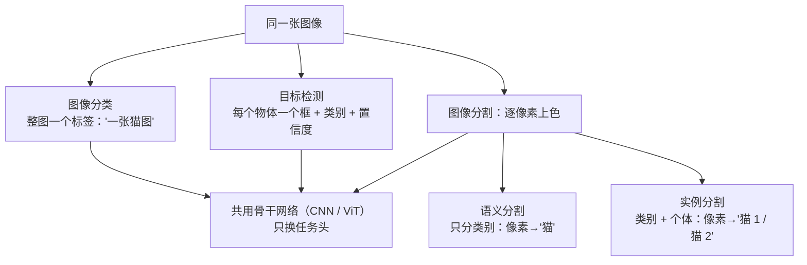
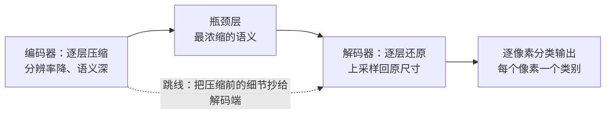

# 视觉三大任务：分类、检测、分割

> **一句话理解**：分类给整图一个标签，检测框出每个物体，分割给每个像素上色——回答的问题越细，输出的"颗粒度"越细。

[⬆️ 返回总目录](../../../README.md) · [⬆️ 返回本篇](../README.md) · [⬅️ 返回本章目录](./README.md)

| 属性 | 说明 |
|------|------|
| 难度 | ⭐⭐⭐（较难） |
| 所属分支 | 视觉 |
| 前置知识 | [CNN 卷积神经网络](./01-CNN卷积神经网络.md) |

---

## 📌 这一节解决什么问题

学会了 CNN，你已经能回答"这张图是什么"。但真实世界很快抛来三个追问：

- 图里有**几只**动物？——一个标签答不了，需要**目标检测（Object Detection）**：给每个物体画一个框，标上类别。
- 病灶在图上**具体哪一块**？逐个框也不够精细，需要**图像分割（Image Segmentation）**：给每个像素贴标签。
- 检测模型说"我找到了"，怎么判断它找得**准不准、全不全**？——需要指标：IoU、mAP。

本页把三大任务的思路和指标一次讲清。你会发现：它们的骨干仍然是上一页的 CNN（或下一页的 ViT），变化的只是"头"——任务不同，头的形态不同。

## 🌱 通俗理解

三兄弟看同一张合影：**分类**只说"这是一张班级合影"；**检测**当导游，把每个人框出来"这是老师、这是班长"；**分割**最较真，把照片里每个像素都涂上颜色——头发、校服、背景一一分开，连老师举的手和背后横幅都不许混淆。

检测的笨办法叫**滑窗（Sliding Window）**：拿一个框在图上从左到右、从上到下，各种大小都试一遍，每个位置都问一次分类器"这里面是猫吗？"——像用放大镜一寸一寸扫报纸，慢得没法用。

**YOLO 的思路**（You Only Look Once，一眼看全图）：整张图只做一次前向计算，把图划成网格，每个格子直接负责预测"我这里有没有物体中心、框多大、是什么类"——一眼扫完全图直接报出所有框，快到能实时。从滑窗的"逐个位置问"，到 YOLO 的"一次全图答"，是检测历史上最重要的一次思路转变。

分割里的**语义分割**（Semantic Segmentation）只问"这个像素属于什么类别"，两只猫的像素都涂"猫"色；**实例分割**（Instance Segmentation）还要区分个体——"猫 1"和"猫 2"涂不同颜色。

## 📋 举个例子

框画得准不准，用**交并比（Intersection over Union, IoU）**衡量。手算一遍（坐标格式为"左上角 (x, y)、宽 w、高 h"）：

- 预测框：(10, 10, 50, 50) → 覆盖区域从 (10, 10) 到 (60, 60)，面积 = 50 × 50 = **2500**
- 真实框：(10, 10, 40, 40) → 覆盖区域从 (10, 10) 到 (50, 50)，面积 = 40 × 40 = **1600**

第一步，求交集：两个框的重叠区域是从 (10, 10) 到 (50, 50)，边长 40，面积 = 40 × 40 = **1600**。

第二步，求并集：2500 + 1600 − 1600 = **2500**。

第三步，相除：IoU = 1600 / 2500 = **0.64**。

也就是说，预测框把真实物**完整罩住了**（真实框完全在预测框里），但因为多画了一圈，只得 0.64 分——IoU 同时惩罚"没罩全"和"画多了"，一般 0.5 以上算"找到"，0.75 以上算"画得准"。

<details>
<summary>⚖️ 展开：漏检与误检怎么权衡</summary>

检测里有两个对称的错法：

- **漏检**（该找的没找出来，拉低召回率）；
- **误检**（把不是目标的框了，拉低精确率）。

模型对每个框输出一个**置信度**，最终给你一个阈值旋钮：

- 阈值调高（比如 0.9）：几乎不误检，但漏检变多——适合"报出来就必须对"的场景（如辅助诊断初筛报告）；
- 阈值调低（比如 0.3）：几乎不漏检，但误检变多——适合"漏一个损失巨大"的场景（如产线缺陷检测宁可错杀）。

所以"模型准不准"从来不是一句话，先问业务：**漏一个贵，还是错一个贵？** 再决定旋钮拧到哪。评估时按缺陷类型分别看召回，别只看总分（下一节 mAP 与 99 页会反复用到这个观念）。

</details>

## 🧠 核心原理

### 整体流程



### 逐步拆解

**① 检测：从滑窗到"一眼看全图"**

滑窗的复杂度随位置数 × 尺寸数爆炸；YOLO 类一步检测把"找物体"变成**一次回归**：整图一次前向，每个网格格子直接输出若干组 (框位置, 框大小, 置信度, 类别)。代价是早期版本对小物体、密集物体偏弱——后来通过多尺度特征层等改进逐步补齐。同一张图上多个格子都说"这里有猫"，再靠**非极大值抑制（Non-Maximum Suppression, NMS）**去重：保留分数最高的框，把与它 IoU 过高的邻居压掉。

**② IoU：框的相似度**

$$
\mathrm{IoU} = \frac{\text{预测框与真实框的交集面积}}{\text{预测框与真实框的并集面积}}
$$

> 👉 **人话**：两框重合部分占两框合起来范围的比例。1 = 完美重合，0 = 完全不相干；例子里的 0.64 = "罩住了，但多圈了一圈地"。

**③ mAP：检测的综合分**

**mAP（mean Average Precision，平均精度均值）**：对每个类别，把框按置信度排序，画出"查准率—查全率"曲线，曲线下面积是该类的 AP；所有类别的 AP 取平均就是 mAP。评测时还会规定"IoU 至少多少才算找对"（如 IoU ≥ 0.5 记一次命中，更严的评测在 0.5~0.95 间取多档平均）。

> 👉 **人话**：mAP 回答"在框得够准的前提下，该找的找全了没有、报出来的框可信不可信"的综合水平。看检测论文或排行榜，认准它；看自己的业务，还要拆到每类召回——总分会骗人（见 99 页"高分假象"）。

**④ 分割：U-Net 的"压缩—还原—抄细节"**

分割要求输出与输入同尺寸，可 CNN 一路池化把图压小了怎么办？**U-Net 思想**：编码器逐层压缩（分辨率降、语义深），解码器逐层还原分辨率；关键是**跳跃连接（Skip Connection）**——把压缩前的细节直接抄送给解码端，还原时既知道"这是什么"（深层语义），又不丢"边界在哪"（浅层细节）。它在医学影像起家，小数据也能训好，至今仍是分割的常用骨架。



## 💻 动手试试

```python
import urllib.request
import torch
from PIL import Image
from torchvision import models, transforms

# 1. 下载一张测试图（需联网）
urllib.request.urlretrieve(
    "https://github.com/pytorch/hub/raw/master/images/dog.jpg", "dog.jpg")

# 2. 载入在 ImageNet（百万图、千类别）上预训练的 ResNet-50
#    首次运行会下载约 100MB 权重，需联网；这就是「迁移学习」的现成眼力
weights = models.ResNet50_Weights.IMAGENET1K_V2
model = models.resnet50(weights=weights)
model.eval()

# 3. 预处理：缩放 → 中心裁剪 224×224 → 转张量 → 按 ImageNet 统计归一化
preprocess = transforms.Compose([
    transforms.Resize(256),
    transforms.CenterCrop(224),
    transforms.ToTensor(),
    transforms.Normalize(mean=[0.485, 0.456, 0.406], std=[0.229, 0.224, 0.225]),
])
img = Image.open("dog.jpg").convert("RGB")
x = preprocess(img).unsqueeze(0)          # 增加批维度 → 形状 [1, 3, 224, 224]

with torch.no_grad():                     # 只推理不训练，关掉梯度省内存
    probs = torch.softmax(model(x), dim=1)[0]

# 4. 输出概率前 5 的类别
labels = weights.meta["categories"]
top5 = torch.topk(probs, 5)
for p, i in zip(top5.values, top5.indices):
    print(f"{labels[i]:<25s} {p.item():.2%}")

# 预期输出：前五名都是狗的品种（如 Siberian husky、Eskimo dog、malamute 等），
# 具体概率随权重版本略有差异。几行代码就有这样的眼力——全是 ImageNet 预训练的功劳。
```

## 🔥 炼丹小灶

> 🔥 **炼丹小灶**：工业界常用起点配方与玄学——
> - 配方：检测别从零造轮子，用 YOLO 系开源实现的预训练权重 + 自己的数据微调：输入 640、batch 16、100~300 epoch 起步；分割小数据先用 U-Net 形状 + ImageNet 预训练编码器。
> - 玄学：小目标漏检 → 提输入分辨率或加多尺度特征；类别不均衡 → 损失加权或难例挖掘；增广首选 Albumentations（翻转、色调，注意框要跟着变换）。
> - ⚠️ 以上是经验参考值，不是圣旨；换数据集请重新炼。

## 🖱️ 动手玩

> 🕹️ **延伸玩一玩**：[CNN Explainer](https://poloclub.github.io/cnn-explainer/)——看看检测、分割模型共用的 CNN 骨干在逐层学什么特征，理解"换任务只换头"。

## 🔗 在知识树中的位置

- **上游**：[CNN 卷积神经网络](./01-CNN卷积神经网络.md)提供骨干网络与迁移学习起点。
- **下游**：[ViT 视觉 Transformer](./03-ViT视觉Transformer.md)（骨干换人，任务不变）；本章[生产实战](./99-生产实战.md)整章的落地主角就是检测。
- **横向对比**：分类 / 检测 / 分割不是"难度递增"而是"输出颗粒度递增"，骨干共用、按需换头。

## ⚠️ 常见误区

- **误区一**："mAP 高 = 线上一定好" → mAP 是总分；业务要看单类召回、误报代价和推理速度，弱类缺陷可能被总分完全掩盖。
- **误区二**："语义分割和实例分割是一回事" → 语义分割不分个体（两只猫都是"猫"），实例分割要分开（猫 1、猫 2）；"数个数"的需求必须用实例级方案。
- **误区三**："IoU 低就是模型差" → 先看是"没罩全"还是"多圈了"：定位漂移、框大小系统性偏大，原因和修法完全不同。

## 📝 小结与自测

**要点回顾**

- 分类一个标签、检测一框一物、分割一像素一标签，骨干共用、任务头不同；
- 滑窗"逐位置问"慢，YOLO"一眼看全图"快；NMS 负责去重；
- IoU = 交集 / 并集，0.64 的例子说明"罩住了但画大了"；mAP 是检测综合分，业务要拆到每类召回；
- U-Net = 压缩再还原 + 跳线保细节。

**自测一下**（点击展开答案）

<details>
<summary>问题 1：预测框与真实框完全相同，IoU 是多少？预测框面积是真实框的 4 倍且完全罩住它，IoU 又是多少？</summary>

完全相同：交集 = 并集，IoU = 1。完全罩住时，交集 = 真实框面积 A，并集 = 预测框面积 4A，IoU = A / 4A = **0.25**——画太大也扣分。

</details>

<details>
<summary>问题 2：数一张图里有几只羊，语义分割够用吗？</summary>

不够。语义分割只能告诉你"哪些像素是羊"，分不清个体；要"数个数"需要实例分割（或检测）。反过来，只要"草场占图比例"的话，语义分割就够了。

</details>

## 📚 延伸阅读

- 论文：Redmon et al., *You Only Look Once*（YOLO, 2016）；Ronneberger et al., *U-Net*（2015）
- 数据集：COCO（检测分割的标准考场，mAP 的多档 IoU 评测即出自这里）
- 工具：Albumentations（视觉增广库，99 页还会见到它）

---

[⬅️ 上一页：CNN 卷积神经网络](./01-CNN卷积神经网络.md) · [返回本章目录](./README.md) · [下一页：ViT 视觉 Transformer ➡️](./03-ViT视觉Transformer.md)
