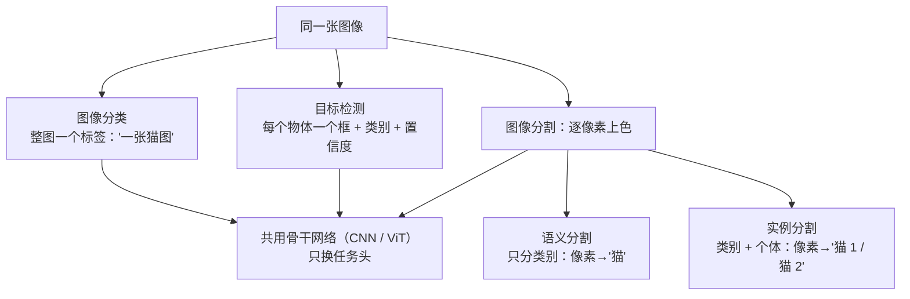
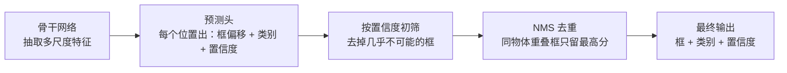
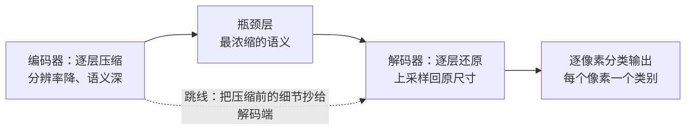

# 视觉三大任务：分类、检测、分割

> **一句话理解**：分类给整图一个标签，检测框出每个物体，分割给每个像素上色——回答的问题越细，输出的"颗粒度"越细。

[⬆️ 返回总目录](../../../README.md) · [⬆️ 返回本篇](../README.md) · [⬅️ 返回本章目录](./README.md)

| 属性 | 说明 |
|------|------|
| 难度 | ⭐⭐⭐（较难） |
| 所属分支 | 视觉 |
| 前置知识 | [CNN 卷积神经网络](./01-CNN卷积神经网络.md) |

---

## 📌 这一节解决什么问题

学会了 CNN，你已经能回答"这张图是什么"。但真实世界很快抛来三个追问：

- 图里有**几只**动物？——一个标签答不了，需要**目标检测（Object Detection）**：给每个物体画一个框，标上类别。
- 病灶在图上**具体哪一块**？逐个框也不够精细，需要**图像分割（Image Segmentation）**：给每个像素贴标签。
- 检测模型说"我找到了"，怎么判断它找得**准不准、全不全**？——需要指标：IoU、mAP。

本页把三大任务的思路和指标一次讲清。你会发现：它们的骨干仍然是上一页的 CNN（或下一页的 ViT），变化的只是"头"——任务不同，头的形态不同。同时也要看清检测的几个深水区：**NMS 去重会在密集场景漏检、小目标天生吃亏、mAP 这个总分藏着很多猫腻**——它们都是"骨干换更强的网络"解决不了的问题。

## 🌱 通俗理解

三兄弟看同一张合影：**分类**只说"这是一张班级合影"；**检测**当导游，把每个人框出来"这是老师、这是班长"；**分割**最较真，把照片里每个像素都涂上颜色——头发、校服、背景一一分开，连老师举的手和背后横幅都不许混淆。

检测的笨办法叫**滑窗（Sliding Window）**：拿一个框在图上从左到右、从上到下，各种大小都试一遍，每个位置都问一次分类器"这里面是猫吗？"——像用放大镜一寸一寸扫报纸，慢得没法用。

**YOLO 的思路**（You Only Look Once，一眼看全图）：整张图只做一次前向计算，把图划成网格，每个格子直接负责预测"我这里有没有物体中心、框多大、是什么类"——一眼扫完全图直接报出所有框，快到能实时。从滑窗的"逐个位置问"，到 YOLO 的"一次全图答"，是检测历史上最重要的一次思路转变。

分割里的**语义分割**（Semantic Segmentation）只问"这个像素属于什么类别"，两只猫的像素都涂"猫"色；**实例分割**（Instance Segmentation）还要区分个体——"猫 1"和"猫 2"涂不同颜色。

去重这一步也有个生活版：一群人抢着报告"我在人群里看到一个红包"，**NMS（非极大值抑制）**就是让声音最大的人先说，其余"看到的其实是同一个红包"的人闭嘴——但两个人**挨得极近、各看到不同红包**时，这个机制会把第二个也误关成"重复报告"，这就是后面要展开的密集漏检现场。

## 📋 举个例子

框画得准不准，用**交并比（Intersection over Union, IoU）**衡量。手算一遍（坐标格式为"左上角 (x, y)、宽 w、高 h"）：

- 预测框：(10, 10, 50, 50) → 覆盖区域从 (10, 10) 到 (60, 60)，面积 = 50 × 50 = **2500**
- 真实框：(10, 10, 40, 40) → 覆盖区域从 (10, 10) 到 (50, 50)，面积 = 40 × 40 = **1600**

第一步，求交集：两个框的重叠区域是从 (10, 10) 到 (50, 50)，边长 40，面积 = 40 × 40 = **1600**。

第二步，求并集：2500 + 1600 − 1600 = **2500**。

第三步，相除：IoU = 1600 / 2500 = **0.64**。

也就是说，预测框把真实物**完整罩住了**（真实框完全在预测框里），但因为多画了一圈，只得 0.64 分——IoU 同时惩罚"没罩全"和"画多了"，一般 0.5 以上算"找到"，0.75 以上算"画得准"。

<details>
<summary>⚖️ 展开：漏检与误检怎么权衡</summary>

检测里有两个对称的错法：

- **漏检**（该找的没找出来，拉低召回率）；
- **误检**（把不是目标的框了，拉低精确率）。

模型对每个框输出一个**置信度**，最终给你一个阈值旋钮：

- 阈值调高（比如 0.9）：几乎不误检，但漏检变多——适合"报出来就必须对"的场景（如辅助诊断初筛报告）；
- 阈值调低（比如 0.3）：几乎不漏检，但误检变多——适合"漏一个损失巨大"的场景（如产线缺陷检测宁可错杀）。

所以"模型准不准"从来不是一句话，先问业务：**漏一个贵，还是错一个贵？** 再决定旋钮拧到哪。评估时按缺陷类型分别看召回，别只看总分（下一节 mAP 与 99 页会反复用到这个观念）。

</details>

## 🧠 核心原理

### 整体流程



检测头内部的流水线（一步检测器视角）：



### 逐步拆解

**① 检测：从滑窗到"一眼看全图"**

滑窗的复杂度随位置数 × 尺寸数爆炸；YOLO 类一步检测把"找物体"变成**一次回归**：整图一次前向，每个网格格子直接输出若干组 (框位置, 框大小, 置信度, 类别)。代价是早期版本对小物体、密集物体偏弱——后来通过多尺度特征层等改进逐步补齐。同一张图上多个格子都说"这里有猫"，再靠**非极大值抑制（Non-Maximum Suppression, NMS）**去重：保留分数最高的框，把与它 IoU 过高的邻居压掉。

**② anchor：给预测发"参考框"，以及 anchor-free 的演进**

直接回归"框的 4 个数"很难学好（框大小跨度从 20 像素到 800 像素）。经典两代方案是**先验框（anchor）**：在特征图每个位置预先铺好 k 个不同大小、不同长宽比的参考框，模型只学"相对参考框的微小偏移和缩放"——把"从零猜框"变成"在参考框上修修剪剪"，回归任务立刻变容易。这是 Faster R-CNN 到早期 YOLO 系的通用做法。

anchor 的痛点也很实在：尺度组合、长宽比组合、每位置几个——全是超参，换一个数据集（比如从行人换到细长焊缝）就要重调；小目标还常常匹配不上合适的 anchor，导致正样本寥寥。**anchor-free**（FCOS、CenterNet 一代）干脆扔掉参考框：直接预测"物体的中心点在哪 + 到边界的距离"，一个词总结——**解决了 anchor 超参之痛**，而精度不掉。如今主流检测器已基本是 anchor-free 或弱 anchor 设计；读旧论文时认识 anchor 这一层历史即可。

**③ NMS：去重的原理与失败现场**

$$
\text{按置信度排序} \to \text{取最高分框} \to \text{压掉与它 IoU} > \tau \text{ 的所有框} \to \text{重复直到取完}
$$

> 👉 **人话**：分数最高的先"占座"，跟它重叠超过阈值 τ 的邻居全部视为"同一物体的重复报告"，压掉；然后下一高分占座……直到处理完。τ（NMS 阈值）是"什么算重复"的判定线。

<details>
<summary>📊 展开：三个框的 NMS 手算 + 密集漏检翻车现场</summary>

**正常情况**——同一只猫的三个重复框：A（置信度 0.92）、B（0.85，与 A 的 IoU = 0.70）、C（0.80，与 A 的 IoU = 0.62）。取 τ = 0.5：

1. 按 Confidence 排序：A > B > C；
2. 取 A 保留；B 与 A 的 IoU 0.70 > 0.5 → 压掉；C 与 A 的 IoU 0.62 > 0.5 → 压掉；
3. 结果只剩 A——干净利落，这正是 NMS 的本职工作。

**失败情况**——两只紧挨的羊：框 P（0.9，罩住羊 1）、框 Q（0.7，罩住羊 2），两框因为羊贴得太近，IoU = 0.55 > 0.5：

1. 取 P 保留；Q 与 P 的 IoU 0.55 > 0.5 → **被当成重复框压掉**；
2. 结果只报 1 只羊——**实际有 2 只**。

症状：密集场景（成堆的零件、密集人群、成串的果实）计数系统性偏少。这不是模型没看见（Q 框确实预测出来了），而是**后处理把正确的框误杀了**。

补救阶梯：τ 调高（0.6~0.7，重复框可能残留，但漏检少了）；Soft-NMS（不直接删，把重叠框的分数乘个衰减系数——温和版去重）；按类别分别做 NMS（不同类互不误杀）；真正的根治是训练时就用对重叠目标更友好的标签分配（现代 anchor-free 检测器普遍更稳）。

</details>

NMS 阈值 τ 的两难（IoU 阈值敏感表）：

| NMS 阈值 τ | 0.3（激进） | 0.5（默认起点） | 0.7（保守） |
|---|---|---|---|
| 去重力度 | 过猛 | 适中 | 温和 |
| 密集重叠物体 | **大量漏检** | 有漏检风险 | 基本安全 |
| 重复框残留 | 几乎没有 | 少量 | 可能重复报同一物体 |
| 适用场景 | 物体天然稀疏 | 通用默认 | 密集场景、要数个数 |

> 👉 **人话**：τ 调小 = "重叠一点就算重复"，密集场景疯狂漏检；τ 调大 = "叠得很深才算重复"，稀疏场景可能一个物体报两次。**没有万能值，按你的场景密度选，并在验收时专门放一批密集样本测试。**

**④ IoU：框的相似度**

$$
\mathrm{IoU} = \frac{\text{预测框与真实框的交集面积}}{\text{预测框与真实框的并集面积}}
$$

> 👉 **人话**：两框重合部分占两框合起来范围的比例。1 = 完美重合，0 = 完全不相干；例子里的 0.64 = "罩住了，但多圈了一圈地"。

**⑤ mAP：检测的综合分（完整算一遍）**

**mAP（mean Average Precision，平均精度均值）**的计算全流程：

1. **置信度排序**：把测试集上模型输出的所有框（跨整张图、所有图片）按置信度从高到低排成一列；
2. **逐框判 TP/FP**：每个预测框，若与某个**尚未被匹配**的真实框 IoU ≥ 阈值（如 0.5），记一次 TP（True Positive，真阳性）并占用该真实框；否则记 FP（False Positive，假阳性）。没被任何预测框匹配的真实框，就是漏检（FN）；
3. **画 PR 曲线**：沿排好的序列累计 TP/FP，每个位置算一对（精确率 P = TP/(TP+FP)，召回率 R = TP/全部真实框数），连成曲线；
4. **曲线下面积 = AP**：对该类别的 PR 曲线做插值求积；对所有类别的 AP 取平均，即 **mAP**。更严的评测（COCO）在 IoU 0.5~0.95 间取 10 档分别算再平均，专治"框得歪但勉强过 0.5 线"的模型。

> 👉 **人话**：mAP 回答"在框得够准的前提下，该找的找全了没有、报出来的框可信不可信"的综合水平。置信度排序这步是精髓：它意味着 mAP **不依赖任何置信度阈值**——模型"把真正确的框排在前面"的能力本身就是被考的核心。

<details>
<summary>📊 展开：5 个框的玩具算例，手算一遍 AP</summary>

类别"猫"，测试集共 3 个真实框（GT1、GT2、GT3），模型输出 5 个框，按置信度降序与判读（IoU 判定线 0.5，一个真实框只能被匹配一次）：

| 序 | 框 | 置信度 | 判读 | 原因 |
|---|---|---|---|---|
| 1 | B1 | 0.9 | TP | 与 GT1 的 IoU = 0.8 ≥ 0.5 |
| 2 | B2 | 0.8 | TP | 与 GT2 的 IoU = 0.85 |
| 3 | B3 | 0.7 | FP | 与 GT1 的 IoU = 0.6，但 GT1 已被 B1 占用（重复报同一只猫） |
| 4 | B4 | 0.6 | FP | 与所有真实框 IoU 最大只有 0.2（没罩住目标） |
| 5 | B5 | 0.5 | TP | 与 GT3 的 IoU = 0.55 |

逐行累计出 PR 点（P = 累计 TP / 已报框数，R = 累计 TP / 3）：

| 序 | 累计 TP | 累计 FP | 精确率 P | 召回率 R |
|---|---|---|---|---|
| B1 | 1 | 0 | 1/1 = 1.00 | 1/3 ≈ 0.33 |
| B2 | 2 | 0 | 2/2 = 1.00 | 2/3 ≈ 0.67 |
| B3 | 2 | 1 | 2/3 ≈ 0.67 | 0.67 |
| B4 | 2 | 2 | 2/4 = 0.50 | 0.67 |
| B5 | 3 | 2 | 3/5 = 0.60 | 3/3 = 1.00 |

按"各召回率水平取其后方最大精确率"插值（R = 0.33 → P 取 1.0；R = 0.67 → P 取 1.0；R = 1.0 → P 取 0.6），AP ≈ (1/3−0)×1.0 + (2/3−1/3)×1.0 + (1−2/3)×0.6 = 1/3 + 1/3 + 0.2 ≈ **0.87**。

若还有"狗"类 AP = 0.60，则 mAP = (0.87 + 0.60)/2 ≈ **0.735**。这个小算例把 mAP 的两条性质演得明明白白：**重复框（B3）和空框（B4）都在精确率上扣分；排在前面的错框（置信度高却是 FP）惩罚更狠**——所以"把对的排前面"比"多报几个"更重要。

</details>

**⑥ mIoU：分割的综合分**

$$
\mathrm{mIoU} = \frac{1}{K}\sum_{k=1}^{K} \frac{|P_k \cap G_k|}{|P_k \cup G_k|}
$$

> 👉 **人话**：对每个类别 k，把"预测是该类的像素集合 $P_k$"与"真实是该类的像素集合 $G_k$"算一次像素版 IoU（交集像素数 ÷ 并集像素数），再对 K 个类别取平均。框的 IoU 换成像素掩码的 IoU，其余思路照搬。

手算一个 10 像素的小例子：类别"道路"真实占 6 个像素，模型预测了 6 个像素，其中 5 个猜对、1 个猜错（其实是背景）。交集 = 5，并集 = 6 + 6 − 5 = 7，该类 IoU = 5/7 ≈ **0.71**。注意**小物体/小类的悲歌**：一个只占 10 像素的类别，错 3 个像素 IoU 就掉到 7/13 ≈ 0.54——mIoU 对小面积类别天然严苛，看分割论文分数时要想到这一点。

**⑦ 小目标问题：根源在"像素证据不足"**

上一页埋的线在这里爆发：骨干网络下采样 32 倍后（ImageNet 骨干的常规设计），一个 32×32 像素的小目标在最后特征图上只剩 **1×1**——整只鸟的全部证据被压缩成一个向量，还要据此回归出框、判断类别。再加上 anchor 尺度没覆盖到小框，训练时几乎没有正样本，小目标自然漏检最多。

| 对策 | 一句话原理 | 代价 |
|------|-----------|------|
| 提高输入分辨率 | 640 → 1280，小目标在特征图上从 1×1 变 2×2，证据翻倍 | 计算量约 ×4，推理变慢 |
| anchor 密化 / 小尺度 anchor | 让参考框覆盖小目标的尺寸范围 | 超参更多、正负样本更不平衡 |
| 多尺度特征金字塔（FPN 一句话） | 深层语义强但分辨率低、浅层分辨率高但语义弱——上下融合，小目标在浅层高分辨率特征上预测 | 模型与工程复杂度上升 |
| 在更高分辨率层（如 stride=4）加检测头 | 直接回到小目标证据还丰富的层去预测 | 显存与速度开销显著 |

> 👉 **人话**：小目标的第一救星常常不是换模型，是**改图**（提分辨率）——把"证据不足"这个根源直接解决。改图比改架构便宜且见效，99 页的实战里这也是首选动作。

**⑧ 分割：U-Net 的"压缩—还原—抄细节"**

分割要求输出与输入同尺寸，可 CNN 一路池化把图压小了怎么办？**U-Net 思想**：编码器逐层压缩（分辨率降、语义深），解码器逐层还原分辨率；关键是**跳跃连接（Skip Connection）**——把压缩前的细节直接抄送给解码端，还原时既知道"这是什么"（深层语义），又不丢"边界在哪"（浅层细节）。它在医学影像起家，小数据也能训好，至今仍是分割的常用骨架。跳跃连接的梯度价值与上一页残差的"+1 高速公路"同源。



**⑨ 类别不平衡在检测里的两种形态**

分类里的不平衡是"猫 1000 张、狗 10 张"；检测里更狠，有两层：

- **前景 vs 背景**：一张图几十万个候选位置，真正压着物体的（正样本）只有几十个——绝大多数预测任务是"这里是背景"。经典对策是 focal loss 一类难例加权：easy negative（一眼就是背景）的贡献压低，难例（像物体的背景）权重放大；
- **类别间长尾**："安全帽"几万个框、"明火"三十个框。对策：损失按类加权、稀有类过采样、或者按上一页的思路先做异常检测兜底。

> 👉 **人话**：检测的不平衡是"大海捞针"式的不平衡——不仅针少，海还特别大。总分 mAP 会被常见类主导，长尾类单独看召回（99 页"高分假象"坑的根源之一）。

### 📐 数学深潜：AP 的数学定义——PR 曲线积分、离散化与插值的来龙去脉

⑤ 把 AP 的计算走成了流程（排序 → TP/FP → PR 曲线 → 面积），这一节回答三个"为什么"：积分怎么离散化、插值到底在插什么、为什么置信度的绝对值从头到尾没出场。

**严格陈述。** 设某类共有 $n^+$ 个真实框。把模型输出的全部预测（跨图合并）按置信度从高到低排成序列，第 k 个预测之后的累计精确率、召回率记 $P(k), R(k)$（$R(0)=0$）。把阈值从 +∞ 连续降到 −∞，得到一条**阶梯状 PR 曲线**，则

$$
\mathrm{AP} \;=\; \int_0^1 p(r)\,\mathrm{d}r \;=\; \sum_{k=1}^{N} \big(R(k) - R(k-1)\big)\, P(k) \;=\; \frac{1}{n^+}\sum_{k:\, \text{第 } k \text{ 个预测是 TP}} P(k)
$$

> 👉 **人话**：AP = **每次命中真实框那一刻的精确率的平均**——把"恰好找到第 i 个目标时的命中率"逐次记下、求均值。最右边那个等式还顺便说明：AP 只吃"TP/FP 的排列顺序"，置信度的数值本身从不入场。

**完整推导：从积分到"命中时精确率平均"。**

<details>
<summary>🧮 展开推导：阶梯积分 → 离散和 → 插值 → 排序不变性，一步不跳</summary>

**第一步：PR 曲线是阶梯函数。** 沿排好的序列把阈值下移，每放进一个预测：若是 FP，R 不动（分子不加、分母 $n^+$ 不变）、P 略降（分母 +1、分子不动）；若是 TP，R 增加 $1/n^+$、P 的分子分母同 +1。所以 R 只在"命中"处跳变、每跳 $1/n^+$，两次命中之间 P 是常数——曲线是阶梯状的。

**第二步：阶梯函数的积分 = 矩形面积和。** 阶梯只在跳变点 $R(k-1) \to R(k)$ 换档，宽 $\Delta R_k$、高 $P(k)$ 的矩形逐块累加：

$$
\int_0^1 p\,\mathrm{d}r = \sum_k \Delta R_k\, P(k)
$$

（这是阶梯函数黎曼和的**精确值**，不是近似。）

**第三步：FP 的项自动消失。** FP 处 $\Delta R_k = 0$，对应的矩形面积为 0；TP 处 $\Delta R_k = 1/n^+$。于是

$$
\mathrm{AP} = \sum_{k \text{ 是 TP}} \frac{1}{n^+}\, P(k) = \frac{1}{n^+}\sum_{k \text{ 是 TP}} P(k) ∎
$$

**第四步：插值在插什么。** 评测代码常见的"取右端最大"插值 $p̂(r) = \max_{r' \ge r} p(r')$ 把 P 换成**右端包络**（从右往左的累积最大值）再积分。两个理由：

1. **操作性**：包络上的每一点都是"可承诺"的——召回率达到 r 时，你总可以只保留排得更靠前的预测、截断后面的，拿到包络上的精确率；原曲线在 r 处的 p 是"全都要"的结果，未必代表这台模型的能力上限；
2. **抗噪**：末尾一串 FP 把 P 拖下坠（R 已到顶、不再有信息量），包络把这段坑填平，AP 不被"后面还有多少废话"绑架。

**第五步：排序不变性。** 置信度做任何严格单调变换 $c \mapsto f(c)$（全体 ×2、过 sigmoid 等），TP/FP 的**顺序**不变 ⇒ 三个离散量 $\Delta R_k$、$P(k)$ 逐项不变 ⇒ AP 不变。反过来，把序列中一个 TP 与它前面的一个 FP 交换：那个 TP 的 $P(k)$ 变小（它的"之前"多了一个 FP、分子不变），AP **严格下降**——错框排得越靠前罚越重（⑤ 玩具算例里 B3 的现场，这里给了它的代数形式）。

</details>

**小算例：同一序列，两种口径。** 某类 $n^+ = 3$，排好的判读为 **TP, FP, TP, TP**（置信度 0.9 / 0.8 / 0.7 / 0.6）：

| k | 判读 | P(k) | R(k) | 离散口径的贡献 |
|---|---|---|---|---|
| 1 | TP | 1/1 = 1.00 | 1/3 | (1/3)×1.00 ≈ 0.333 |
| 2 | FP | 1/2 = 0.50 | 1/3 | 0 |
| 3 | TP | 2/3 ≈ 0.667 | 2/3 | (1/3)×0.667 ≈ 0.222 |
| 4 | TP | 3/4 = 0.75 | 3/3 | (1/3)×0.75 = 0.250 |

- **离散 AP** = 0.333 + 0.222 + 0.250 ≈ **0.806**；
- **插值 AP**（包络：R=1/3 处取 1.00；R=2/3 处取 max(0.667, 0.75) = 0.75；R=1 处取 0.75）= (1/3)×1.00 + (1/3)×0.75 + (1/3)×0.75 ≈ **0.833**。

同一组预测、两个口径差 0.03——**跨论文、跨榜比较 AP 之前先对齐口径**（⑤ 正文里 COCO 与 VOC 评测的差异同理）。

```
 P（精确率）
 1.00 ┤ ●────────╮ ← 包络 P̂（插值口径：右端最大，单调不增）
      │          ╰─╮
 0.75 ┤            ╰────●────●        ← R=2/3 的实测点 0.667 被包络
      │       ╭──●╌╌╌╌╌╌╌╌╌╌⌒             抬到 max(0.667, 0.75)=0.75
 0.67 ┤     ●╌╯
 0.50 ┤  ●（FP 把 P 拖到 0.5，R 原地不动）
    0 └───┬───────┬────────┬───────► R（召回率）
          1/3     2/3      1
 离散 AP = 实测阶梯下的面积（坑照算）；插值 AP = 包络下的面积（坑被填平）
```

**反例与边界。**

1. **插值抬高分数**：包络 ≥ 原曲线，插值 AP ≥ 离散 AP（算例 0.833 > 0.806）——不同评测口径的 AP 直接相比是常见事故；
2. **n⁺ 小则 AP 粗**：某类只有 1 个真实框时，AP 只能在 {1, 1/2, 1/3, …} 这类离散值里取——长尾小类的 AP 天生高方差（深度视角"平均即掩盖"的定量注脚）；
3. **AP 只考排序，不考框准**：IoU 阈值是外生参数，同一模型在 0.5 档与 0.75 档的 AP 可以差一大截——COCO 的 10 档平均正是治"框得歪但勉强过线"（⑤ 已述）；
4. **排序不变性是双刃剑**：AP 对分数校准（乘常数、过 sigmoid）无感——排序指标可以放心只优化相对序；但下游需要**绝对概率**的场景（如广告按 pCTR 计费）AP 帮不上忙，那要靠校准指标（第 8 章[排序模型](../08-推荐系统/04-排序模型.md)展开）。

> 👉 **人话总结**：AP = "每次找到目标那一刻命中率的平均"——它只看 TP/FP 的出场顺序，所以排序决定一切；插值是把曲线抹成"可承诺的上包络"，统一了口径也抬高了分数。

## 💻 动手试试

```python
import urllib.request
import torch
from PIL import Image
from torchvision import models, transforms

# 1. 下载一张测试图（需联网）
urllib.request.urlretrieve(
    "https://github.com/pytorch/hub/raw/master/images/dog.jpg", "dog.jpg")

# 2. 载入在 ImageNet（百万图、千类别）上预训练的 ResNet-50
#    首次运行会下载约 100MB 权重，需联网；这就是「迁移学习」的现成眼力
weights = models.ResNet50_Weights.IMAGENET1K_V2
model = models.resnet50(weights=weights)
model.eval()

# 3. 预处理：缩放 → 中心裁剪 224×224 → 转张量 → 按 ImageNet 统计归一化
preprocess = transforms.Compose([
    transforms.Resize(256),
    transforms.CenterCrop(224),
    transforms.ToTensor(),
    transforms.Normalize(mean=[0.485, 0.456, 0.406], std=[0.229, 0.224, 0.225]),
])
img = Image.open("dog.jpg").convert("RGB")
x = preprocess(img).unsqueeze(0)          # 增加批维度 → 形状 [1, 3, 224, 224]

with torch.no_grad():                     # 只推理不训练，关掉梯度省内存
    probs = torch.softmax(model(x), dim=1)[0]

# 4. 输出概率前 5 的类别
labels = weights.meta["categories"]
top5 = torch.topk(probs, 5)
for p, i in zip(top5.values, top5.indices):
    print(f"{labels[i]:<25s} {p.item():.2%}")

# 预期输出：前五名都是狗的品种（如 Siberian husky、Eskimo dog、malamute 等），
# 具体概率随权重版本略有差异。几行代码就有这样的眼力——全是 ImageNet 预训练的功劳。
```

**改什么，看什么变化**（体会"置信度排序决定一切"）：

- 换 `weights=ResNet50_Weights.IMAGENET1K_V1`（旧版权重）再看 top5：分数与排名都会变——同一架构、不同训练配方，眼力不同；
- 把图旋转 90° 再推理：分类可能仍对（ImageNet 训练里有增广），但置信度常下降——亲手感受"分布偏移"的苗头；
- 换成 `models.resnet18(weights=...)`：类别大概率不变，吞吐显著变快——骨干深度换速度的第一笔交易。

## 🩺 失败模式速查（何时不 work）

| 症状 | 病因 | 诊断 | 补救 |
|---|---|---|---|
| 密集场景"数数"偏少 | NMS 把紧挨的不同物体误判为重复框 | 可视化 NMS **之前**的框：被压掉的框其实罩着不同目标 | τ 调高 / Soft-NMS / 按类 NMS / 换现代标签分配的检测器 |
| 小目标（< 32×32）大量漏检，大目标都好 | 下采样后像素证据不足 + anchor 不匹配 | 把漏检目标按尺寸分桶统计召回 | 先提输入分辨率；再考虑 FPN/小 anchor/浅层检测头 |
| mAP 很高，业务却说不好用 | 总分被常见类、大目标主导；长尾弱类被平均掉 | 分类别、分尺寸拆开看 AP/召回 | 按业务单独定弱类目标；损失加权/过采样补长尾 |
| 分割边缘毛糙、细结构断裂 | 深层特征分辨率低，边界细节在压缩中丢失 | 放大局部看边界与 GT 的差集分布 | 加强跳跃连接/浅层特征；边界损失加权；提输入分辨率 |

## 🔥 炼丹小灶

> 🔥 **炼丹小灶**：工业界常用起点配方与玄学——
> - 配方：检测别从零造轮子，用 YOLO 系开源实现的预训练权重 + 自己的数据微调：输入 640、batch 16、100~300 epoch 起步；分割小数据先用 U-Net 形状 + ImageNet 预训练编码器。
> - 玄学：小目标漏检 → 先提输入分辨率或加多尺度特征，再谈换模型；类别不均衡 → 损失加权或难例挖掘；密集场景数不准 → 先查 NMS 阈值再怀疑网络；增广首选 Albumentations（翻转、色调，注意框要跟着变换）。
> - ⚠️ 以上是经验参考值，不是圣旨；换数据集请重新炼。

## 🖱️ 动手玩

> 🕹️ **延伸玩一玩**：[CNN Explainer](https://poloclub.github.io/cnn-explainer/)——看看检测、分割模型共用的 CNN 骨干在逐层学什么特征，理解"换任务只换头"。

## 🔗 在知识树中的位置

- **上游**：[CNN 卷积神经网络](./01-CNN卷积神经网络.md)提供骨干网络与迁移学习起点；其感受野与下采样的伏笔在本页"小目标问题"兑现。
- **下游**：[ViT 视觉 Transformer](./03-ViT视觉Transformer.md)（骨干换人，任务不变）；本章[生产实战](./99-生产实战.md)整章的落地主角就是检测。
- **横向对比**：分类 / 检测 / 分割不是"难度递增"而是"输出颗粒度递增"，骨干共用、按需换头。

## 🎓 深度视角

**标签分配（Label Assignment）才是检测的隐形主战场**。回看本页的演进：anchor → anchor-free 表面上换的是"框的参数化"，真正被重写的是**"哪个位置负责哪个物体"的分配规则**——从手工铺 anchor，到"中心点 + 到边界距离"，规则越来越简单、超参越来越少。沿这条线走到头，就是把分配问题整体交给一个**全局最优匹配**在线求解：DETR 的二分匹配损失正是这条演进线的终点（机制展开见本章[进阶专题：视觉前沿](./04-进阶专题-视觉前沿.md)）。

**训练目标与验收指标的脱节**：IoU 不可微，训练时只能优化它的代理（框偏移的 smooth L1 等），验收却按 IoU 阈值族打分——"平时练的"与"考的"从来不是同一个数。可微的 IoU 族损失（GIoU 一系）在弥合这道缝，但"代理损失 ↔ 评测指标"的错位是检测领域长期的结构性张力：读任何检测论文的消融表，都要带着这层意识。

**NMS 的本质：集合决策的手工近似**。检测的正确输出是一个**物体集合**（互不重复、数量不定），而"逐框独立打分 + 贪心去重"把这个集合决策拆成了一串局部决策——密集漏检正是"用局部近似全局"的结构性代价，不是哪个模型的手艺问题。这解释了为什么 NMS 的各种改良（Soft-NMS、按类 NMS）都只是缓解：只要决策还逐框做，密集场景的两难就在。

**mAP 的批判性读法**：mAP 是"排序质量 + 定位质量"在"多类别 × 多 IoU 档"上的平均——**平均即掩盖**。类别长尾、尺寸长尾（小目标 AP 单列通常显著低于总分）都被总分抹平；置信度排序考"把对的排前面"，与业务"漏一个贵还是错一个贵"的代价结构并不对齐。评估科学落后于模型科学，是检测落地比检测刷榜难的原因之一。

## 🔬 SOTA 演进

| 方向 | 一句话 |
|---|---|
| **DETR：检测 = 集合预测（Set Prediction）** | N 个可学习 query 直接"认领"图中物体，用二分匹配损失端到端训练，把 anchor 与 NMS 两个手工件一并拿掉——代价是收敛极慢；机制与代价的展开见[进阶专题：视觉前沿](./04-进阶专题-视觉前沿.md)。 |
| **开放词汇检测（Open-Vocabulary Detection）** | 用文本编码器的语义嵌入充当"分类头权重"，类别表从固定的 N 类变成"可写任意自然词的字典"，检测器由此能认训练集里没见过的类——检测正在被拉进语言的多模态世界。 |

## ❓ 开放问题

- **检测的下一个范式是什么**：集合预测、开放词汇、基础模型骨干三条线正在汇拢——会不会收敛成一个"提示驱动的通用感知器"？本章专题页展开讨论。
- **评估如何跟上业务**：mAP 与业务代价结构（漏检/误检不对称、长尾类）的系统性错位如何修复——按类按尺寸拆解是止血，不是答案。
- **密集与遮挡的终极解法**：继续改良 NMS 与标签分配，还是等集合预测范式彻底成熟后这个问题自动消失——尚无共识。

## ⚠️ 常见误区

- **误区一**："mAP 高 = 线上一定好" → mAP 是总分；业务要看单类召回、误报代价和推理速度，弱类缺陷可能被总分完全掩盖。
- **误区二**："语义分割和实例分割是一回事" → 语义分割不分个体（两只猫都是"猫"），实例分割要分开（猫 1、猫 2）；"数个数"的需求必须用实例级方案。
- **误区三**："IoU 低就是模型差" → 先看是"没罩全"还是"多圈了"：定位漂移、框大小系统性偏大，原因和修法完全不同。
- **误区四**："漏检就是网络没看见" → 未必：NMS 误杀（密集）、置信度阈值过高、IoU 判定线过严都会"看见了却没报出来"——先查后处理链路，再怪骨干。

## 📝 小结与自测

**要点回顾**

- 分类一个标签、检测一框一物、分割一像素一标签，骨干共用、任务头不同；
- 滑窗"逐位置问"慢，YOLO"一眼看全图"快；anchor 把"猜框"变"修框"，anchor-free 解决了超参之痛；NMS 负责去重但会在密集场景误杀；
- IoU = 交集 / 并集；mAP = 置信度排序 → PR 曲线 → 曲线下面积，按类平均；mIoU 是像素版，对小类严苛；
- 小目标的根源是下采样后像素证据不足，第一对策常是提分辨率；
- 检测的类别不平衡有"前景 vs 背景"与"类别长尾"两层；U-Net = 压缩再还原 + 跳线保细节。

**自测一下**（点击展开答案）

<details>
<summary>问题 1：预测框与真实框完全相同，IoU 是多少？预测框面积是真实框的 4 倍且完全罩住它，IoU 又是多少？</summary>

完全相同：交集 = 并集，IoU = 1。完全罩住时，交集 = 真实框面积 A，并集 = 预测框面积 4A，IoU = A / 4A = **0.25**——画太大也扣分。

</details>

<details>
<summary>问题 2：数一张图里有几只羊，语义分割够用吗？</summary>

不够。语义分割只能告诉你"哪些像素是羊"，分不清个体；要"数个数"需要实例分割（或检测）。反过来，只要"草场占图比例"的话，语义分割就够了。

</details>

<details>
<summary>问题 3：mAP 计算为什么第一步要按置信度排序，而不是先卡一个 0.5 的阈值？</summary>

排序让 mAP 与阈值解耦：沿排好的框逐个累计，得到一整条"从只报最有把握的框（高精确率）到全报（高召回率）"的 PR 曲线——它考的是"模型能否把正确的框排在前面"，这正是阈值无论拧到哪都需要的底层能力。先卡阈值就只剩一个点，丢掉整条权衡曲线。

</details>

<details>
<summary>问题 4：32 倍下采样的骨干上，一个 24×24 像素的目标在最终特征图上占多大？这说明什么？</summary>

24 ÷ 32 < 1，不足一个格子——整只目标的证据被压进不到 1×1 的特征里。这说明小目标漏检的根源是**结构性的证据不足**，不是"网络不够深"；加大网络帮助有限，提分辨率/浅层预测才是对症药。

</details>

## 📚 延伸阅读

- 论文：Redmon et al., *You Only Look Once*（YOLO, 2016）；Ren et al., *Faster R-CNN*（2015，anchor 机制源头）；Tian et al., *FCOS*（2019，anchor-free 代表）；Ronneberger et al., *U-Net*（2015）
- 数据集：COCO（检测分割的标准考场，mAP 的多档 IoU 评测即出自这里）
- 工具：Albumentations（视觉增广库，99 页还会见到它）

---

[⬅️ 上一页：CNN 卷积神经网络](./01-CNN卷积神经网络.md) · [返回本章目录](./README.md) · [下一页：ViT 视觉 Transformer ➡️](./03-ViT视觉Transformer.md)
