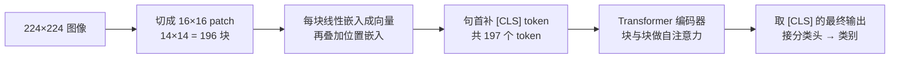
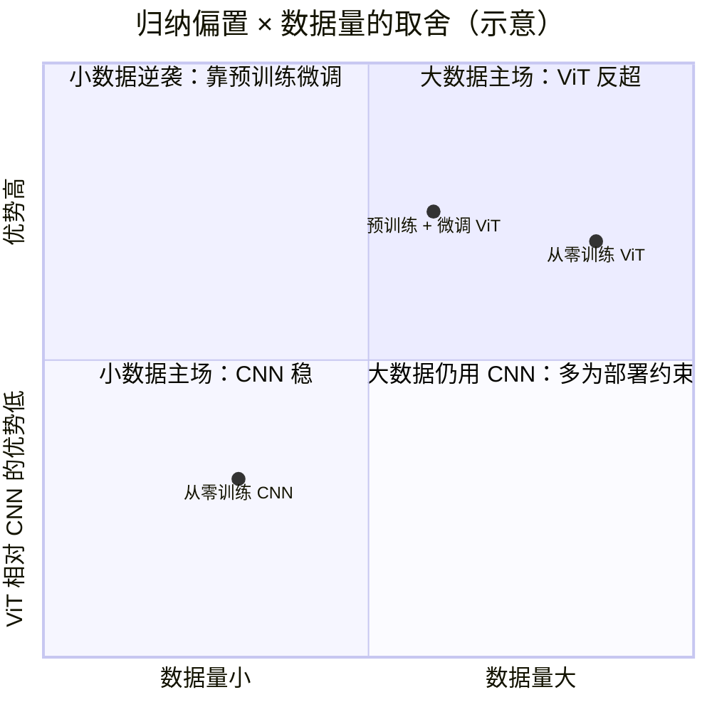

# ViT 视觉 Transformer

> **一句话理解**：ViT 把图切成 16×16 的小块当"单词"，用 Transformer 读图——让视觉和语言从此说同一种架构语言。

[⬆️ 返回总目录](../../../README.md) · [⬆️ 返回本篇](../README.md) · [⬅️ 返回本章目录](./README.md)

| 属性 | 说明 |
|------|------|
| 难度 | ⭐⭐⭐⭐（高阶） |
| 所属分支 | 视觉 |
| 前置知识 | [视觉三大任务](./02-视觉三大任务.md)；建议同时了解[02-Transformer与注意力机制](../07-自然语言处理与LLM/02-Transformer与注意力机制.md) |

---

## 📌 这一节解决什么问题

Transformer 在 NLP 大获全胜（第 7 章的主角），视觉这边 CNN 已统治十年。一个自然的问题：**同一套 Transformer 能不能直接看图？** 卡在一个表面上很小的差别上：Transformer 吃的是**序列**（一排 token），图像却是**二维网格**——不是天生的"句子"。

ViT（Vision Transformer，2020）的答案简单粗暴却极其有效：**切**。把 224×224 的图切成 16×16 的小块（patch），每块拉直、用一个线性层变成向量——它就是图像世界的"单词"。剩下的交给标准 Transformer：块与块之间做注意力，谁和谁有关系自己学。

这个方案当时被质疑"丢了图像的先验"，ViT 用实验回敬了一个重要结论：**没有先验没关系，用数据补**——大数据下 ViT 反超 CNN，并顺手打开了 CV 与 NLP 大一统的大门。

## 🌱 通俗理解

把一张大图想成一幅**拼图**。CNN 的做法是拿小放大镜一块块看局部；ViT 的做法是先把拼图拆成 196 块小片，**每块当成一个词，把整幅图读成一句话**："左上角这片（很暗）+ 它右边这片（有竖条纹）+ ……（共 196 片）"。然后像读句子一样读图：注意力让"猫耳朵那片"和"猫脸那片"互相勾连，和"背景墙那片"少来往——关系自己学出来。

**[CLS] token** 是句首加的一个特殊"单词"，它不代表任何图像内容，而是充当**汇总发言人**：每一层注意力里它都把全场信息收集一遍，最后一层的 [CLS] 输出直接接分类头——相当于开完会由它做总结发言，总结稿就是"这是只猫"。

代价也明摆着：CNN 生来就懂"相邻才有关系"（局部性）和"模板全图通用"（平移不变），ViT 把这些常识全忘了，一切从头学——所以它**饿**：小数据喂不饱，大数据才管够。这就是有名的"ViT 数据饥饿"，下面用对比表细说。

## 📋 举个例子

数一数 ViT-B/16 的 token，感受"图变句子"：

1. 输入图 224×224 像素，每块 patch 边长 16 → 每行切 224 ÷ 16 = **14** 块；
2. 每列同样 14 块 → 全图共 14 × 14 = **196** 块 patch；
3. 句首再补 1 个 [CLS] 汇总 token → 196 + 1 = **197** 个 token。

$$
N = \frac{H \times W}{P^2} = \frac{224 \times 224}{16 \times 16} = 196
$$

> 👉 **人话**：token 数 = 图的像素"面积"除以每块的像素面积，224×224 的图除以 16×16 的块，正好 196 个"视觉单词"。

和文本对照着看：

| | 文本 Transformer | ViT |
|---|---|---|
| 原始输入 | 一句话 | 一张 224×224 图 |
| 切分方式 | 分词器切成词 / 子词 | 切成 16×16 图块 |
| token 数量 | 句长而定，如 20 个 | 固定 196 个 + 1 个 [CLS] = 197 个 |
| 每个 token 是什么 | 一个词的向量 | 一块 16×16 小图的向量 |
| 位置信息 | 位置嵌入（第几个词） | 位置嵌入（第几块 patch） |
| 汇总方式 | [CLS] 或均值池化 | [CLS] token |

也就是说：**"小明 昨天 去 超市"** 和 **"左上块 暗块 条纹块 …（196 块）"** 在模型眼里是同一种东西——一排 token 序列。

<details>
<summary>📊 展开：3 个 patch 手算一次注意力打分</summary>

三个 patch，各用一个 2 维向量示意（真实是 768 维；真实模型的 Q/K/V 还要过三个可学习投影，这里直接拿原向量当 Q=K=V，只为看清"打分 → 归一化 → 加权"这一趟流水线）：

```text
猫耳块 e1 = [2, 1]    猫脸块 e2 = [1, 2]    背景墙块 e3 = [0, 1]
```

**第一步：打分**。以"猫耳块"为提问者，算它与三者的缩放点积（除以 √d = √2 ≈ 1.41）：

- s(耳→耳) = (2×2 + 1×1) / 1.41 = 5/1.41 ≈ **3.54**
- s(耳→脸) = (2×1 + 1×2) / 1.41 = 4/1.41 ≈ **2.83**
- s(耳→背景) = (2×0 + 1×1) / 1.41 = 1/1.41 ≈ **0.71**

**第二步：softmax 归一化**（e^3.54 ≈ 34.5，e^2.83 ≈ 16.9，e^0.71 ≈ 2.0，和 ≈ 53.4）：

- 猫耳→猫耳 **0.65**；猫耳→猫脸 **0.32**；猫耳→背景 **0.04**（三数和为 1，一场预算分配）

**第三步：加权取材**。猫耳块的新向量 = 0.65×e1 + 0.32×e2 + 0.04×e3 = **[1.62, 1.33]**——它 65% 保留自己、32% 吸收了猫脸的信息、只分 4% 给背景。**"猫耳朵多看猫脸、少看背景墙"**，这三个数字就是那句话的算术本体。

</details>

## 🧠 核心原理

### 整体流程



### 逐步拆解

**① Patch Embedding：图块变词（完整形状流）**

每个 16×16×3 的 patch 拉平成 768 维向量（16×16×3=768），再过一层线性投影到模型宽度 d=768——相当于给每个图块发一张"身份证"。工程上这一步几乎都用一个 **kernel=16、stride=16 的卷积**一次性完成，形状流全程可数：

```text
输入图             [1, 3, 224, 224]
Conv2d(3→768, k=16, s=16)   # 步幅 16 = 块与块不重叠
特征图             [1, 768, 14, 14]      # 224/16 = 14
flatten + 转置     [1, 196, 768]         # 14×14 = 196 个 token，每个 768 维
拼接 [CLS]         [1, 197, 768]
加位置嵌入         [1, 197, 768]         # 逐 token 加，形状不变
```

> 👉 **人话**：这个"大步幅卷积"就是 01 页卷积公式的直接套用——输出尺寸 (224−16)/16+1 = 14，和手算完全一致。**卷积在这里只当"切块机"用**，后面的重活全交给注意力。ViT-B/16 的巧合同样值得一看：16×16×3 = 768 恰好等于 d_model = 768，所以"拉直不投影"在数学上都行得通（实现上仍会过一层可学习投影）。

**② [CLS] token vs 全局平均池化：汇总方式的取舍**

[CLS] 不是唯一的汇总法：另一派（如早期的 Transformer 检测器）对 196 个 patch 的最终向量做**全局平均池化（GAP）**当整图表示。取舍：

- **[CLS]**：一个可学习的"探测器"，训练中被梯度塑造得最贴合分类目标；灵活性高，但也**占一个 token 的注意力名额**、且缺少 01 页 CNN 那种平移不变性——图平移几个像素，[CLS] 的输入分布会变；
- **GAP**：所有 patch 一视同仁取平均，天然带一点平移鲁棒性、实现零参数；缺点是"一锅端"会把不重要的背景 patch 也平均进来，显著性差一些。

> 👉 **人话**：[CLS] 像请了个专职会议主席，GAP 像全场举手表决。分类任务两者差距不大（ViT 原文实验里 [CLS] 略优）；但**检测、分割这类需要每个位置输出结果的任务，本来就不靠汇总 token**——每个 patch 自己的向量就是输出，这也是 ViT 做密集预测任务时的基本姿势。

**③ 位置编码：ViT 比任何模型都更需要它**

卷积网络"天生知道"空间：核在相邻像素上滑动，"谁挨着谁"直接写在计算图里。ViT 的注意力对 token 的排列**完全无感**——把 196 个 patch 像洗牌一样打乱再输入，输出（除了顺序对应关系）没有任何变化，这叫**置换等变（Permutation Equivariance）**。"左上角那片"和"右下角那片"若不加任何标记，在模型眼里毫无区别。

位置嵌入（Position Embedding）就是补上的标记：给每个 patch 加一个"我是第几块"的可学习向量。原版 ViT 用一维顺序编码（把 14×14 的网格按行拉平编号 0~195），靠注意力自己把一维编号背后的二维结构学回来；后续工作也有直接用二维坐标编码的。一个常被低估的工程约束：**位置编码与 patch 数量绑定**——预训练时 197 个位置，推理时若输入 384×384（577 个 token），旧位置编码不够用，必须做插值扩展，这正是"输入尺寸必须匹配训练配置"报错的来源之一。

> 👉 **人话**：CNN 的空间感刻在骨子里，ViT 的空间感全靠"工牌"（位置嵌入）。工牌丢了，196 片拼图就是 196 个无名氏——这就是位置编码对 ViT 是命门、对 CNN 只是锦上添花的原因。

**④ 注意力：块与块自己建立关系**

注意力公式与第 7 章完全相同：

$$
\mathrm{Attention}(Q, K, V) = \mathrm{softmax}\!\left(\frac{QK^\top}{\sqrt{d}}\right)V
$$

> 👉 **人话**：每块 patch 都问一遍其他所有块"你和我相关吗"（打分），按分数加权取材——"猫耳朵块"多看几眼"猫脸块"，少看"背景墙块"。卷积的"只看邻域"被换成了"全图自己挑着看"。

<details>
<summary>🧮 展开推导：为什么打分要除以 √d</summary>

设 q、k 的各分量独立、均值 0、方差 1，则点积 $q \cdot k = \sum_{i=1}^{d} q_i k_i$ 中每一项均值 0、方差 1，于是：

$$
\mathrm{Var}(q \cdot k) = \sum_{i=1}^{d} \mathrm{Var}(q_i k_i) = d
$$

即点积的标准差随维度 $\sqrt{d}$ 增长。ViT 里 d 至少 64、多头拼接后更大，不做缩放的话 logits 动辄 ±几十——softmax 在大 logits 下输出接近 one-hot（最大者拿走 99.9%），**梯度几乎为零**，注意力"焊死"在某一两个块上训不动。除以 $\sqrt{d}$ 恰好把方差拉回 1，softmax 工作在它最敏感、可训练的区间。

用数字感受一下（d = 768，√d ≈ 27.7）：原始点积 25 与 20 的差距，未缩放时 softmax 权重比 ≈ e⁵ ≈ 148 : 1（一边倒）；缩放后 logits 变 0.90 与 0.72，权重比 ≈ 1.2 : 1（尚有余地）。缩放的本质是**给 softmax 留出"犹豫的空间"**——注意力需要的是分配，不是独裁。

</details>

**⑤ 感受野在 ViT 里的对应物：从第一层起就是全局，代价是平方**

CNN 的感受野要一层层长大（01 页的公式），ViT 的注意力**第 1 层就让任意两块直接建立联系**——"感受野"这个概念在 ViT 里变成了"注意力的跳数（hop）"：1 层注意力 = 任意两个 token 一跳可达；2 层 = 信息可以经一个中转 token 二跳组合。所以 ViT 浅层就能组织全局关系（层 5~6 的注意力已经常跨越半个图），而 CNN 要堆到很深才看得见整只猫。

代价同样清楚：每层注意力是 token 数 N 的**平方**级计算——197 个 token 是 197² ≈ 3.9 万对打分尚且轻松，换成 448×448（785 token）就是 61.6 万对，高清图（几千 token）直接爆内存。缓解思路与第 6 章时序注意力同源：窗口化（Swin 把全局注意力限制在局部窗口、窗口间再传递）、稀疏化、降分辨率。

> 👉 **人话**：全局视野不是免费的——CNN 用"慢慢长大"换便宜，ViT 用"生来全知"换 O(N²) 的账单。这也解释了为什么层次化的 Swin 在检测/分割这类高分辨率任务上更流行。

**⑥ 归纳偏置的账：数据饥饿与"交叉现象"**

<details>
<summary>🧮 展开：ViT 为什么"数据饥饿"——交叉现象的定量账</summary>

**归纳偏置（Inductive Bias）**= 模型生来自带的"常识假设"。CNN 自带两条：局部性（相邻像素相关）与平移等变（模板全图通用）。ViT 的注意力对 token 一视同仁，这两条常识都得靠数据学回来。

原论文的实验结论（量级供参考）：

- 只在 ImageNet-100 万张量级上**从零训练**：ViT 打不过同规模的 ResNet——数据不够，它还没学会"看局部"；
- 先在约 3 亿张的私有大数据集上**预训练**、再回 ImageNet 微调：ViT 反超，规模越大领先越多。

把两个结论画在一张"数据量—准确率"图上，就是著名的**交叉现象**：两条曲线在小数据区（CNN 高）与大数据区（ViT 高）各占半场，中间存在一个交叉点。解释只有一句话：**归纳偏置在小数据时代是免费的外挂，在大数据时代是封顶的天花板**——CNN 的先验帮它起步快，但也限制了它能学到的关系种类（先验规定"只看邻域"，远处的关系就得叠很多层才能表达）；ViT 没有先验，起步慢，但容量上限不受人为约束，数据管够时一路吃到规模定律。

实践推论：数据只有几千几万张时，别硬上 ViT 从零训练；要么用别人预训练好的 ViT 微调（等价于借题库），要么老实 CNN。

把交叉现象画成一张取舍图（示意，坐标为相对位置非实测值）：



</details>

**⑦ ViT 训练的关键配方**

ViT 原文能跑出好成绩，靠的不只是架构，还有一套**高吞吐、强正则**的训练配方（后续 DeiT 工作把这套配方补齐到中等数据量也能驯好 ViT）：

- **强增广**：mixup、cutmix、rand-augment 级别的组合拳——数据饥饿的模型尤其需要"一份数据掰成十份用"，且强增广能替代一部分缺失的归纳偏置（迫使模型学平移/色彩不变性）；
- **大 batch + 高学习率 + warmup/weight decay**：预训练 batch 数千、AdamW、前几千步学习率从 0 线性爬升——Transformer 类模型对这套调度比 CNN 敏感得多，直接套 CNN 配方常训崩；
- **蒸馏 token（一句话级）**：DeiT 在 [CLS] 之外再加一个向"教师 CNN"学习的蒸馏 token，让无先验的 ViT 把教师的位置先验"抄"过来——中等数据量下显著提效，等价于"归纳偏置可以后天注射"。

> 👉 **人话**：ViT 是"架构 + 配方"的合体产物——很多人复现不出来的差距，一半在架构之外。微调别人的预训练 ViT 时，至少把增广和 AdamW+warmup 抄对，等于白捡几个点。

**⑧ CNN vs ViT 对比**

| 维度 | CNN | ViT |
|---|---|
| 看图方式 | 局部滑窗，逐层扩大视野 | 全局注意力，任意两 patch 直接建立联系 |
| 感受野 | 随层数慢慢长大 | 第 1 层即全局（O(N²) 计费） |
| 归纳偏置 | 强（局部 + 平移等变），天生适合图 | 弱，位置编码补空间感，靠大数据/蒸馏补先验 |
| 小数据 | 从零训练也稳 | 从零训练易欠拟合，需预训练 |
| 大数据上限 | 增长放缓 | 越大越吃香，规模定律明显 |
| 计算与部署 | 成熟高效，边缘端友好 | 注意力开销大，压缩部署更费劲（改善中） |
| 典型场景 | 边缘设备、中小数据、实时检测 | 大规模预训练、多模态、前沿研究 |

**⑨ 大一统伏笔**

图像变成 token 序列后，文本是 token 序列、音频也能变 token 序列——**三种模态说了同一种语言**，融合只需在序列层面做注意力。第 12 章[多模态模型](../../5-前沿与融合/12-生成模型与多模态/04-多模态模型.md)（图文对话、文生图）正建立在这块地基上；本章的 ViT 就是那场融合的第一块砖。

### 📐 数学深潜：patch 嵌入 ≡ 16×16、步幅 16 的卷积——一次严格等价

① 顺口说了一句"patch 嵌入几乎都用 k=16、s=16 的卷积实现"。"几乎都用"背后其实是一个**严格等价**：两条路线算出的 token 逐个相等、参数量分毫不差。把它证清楚，"切块机"就不再是比喻。

**严格陈述。** 设输入 $X \in \mathbb{R}^{3 \times 224 \times 224}$。

- **路线 A（论文文字描述）**：把 X 切成互不重叠的 16×16 patch，每块按固定顺序（通道 → 行 → 列）拉直成 768 维向量 $x_{i,j}$（$i, j = 0, \dots, 13$），过线性层：$t_{i,j} = W\, x_{i,j} + b$，$W \in \mathbb{R}^{768 \times 768}$；
- **路线 B（工程实现）**：`Conv2d(3 → 768, kernel_size=16, stride=16)`，权重 $K \in \mathbb{R}^{768 \times 3 \times 16 \times 16}$，再把输出特征图空间维展平。

则当 $K_{o,\,c,\,m,\,n} = W_{o,\,(c,m,n)}$（同一袋数字的两种摆法）时，对每个 patch 位置 (i, j) 与每个输出维 o，两路线输出**逐项相等**；参数量同为 $768 \times 768 + 768$。

> 👉 **人话**：Conv2d 不是"模拟"切块，它**就是**切块——"拉直 + 矩阵乘"与"大步幅卷积"是同一个函数的两种写法，权重只是同一组参数的两种装箱方式。

**完整推导：同一个求和的两次重排。**

<details>
<summary>🧮 展开推导：写开两条路线的和，逐项对上（含 1×4 迷你验证）</summary>

**第一步：路线 B 的单个输出。** 按卷积定义（01 页公式的直接套用）：

$$
F(o,\,i,\,j) \;=\; \sum_{c=0}^{2}\ \sum_{m=0}^{15}\ \sum_{n=0}^{15} K(o,\,c,\,m,\,n)\; X\big(c,\;16i + m,\;16j + n\big) \;+\; b_o
$$

（步幅 16 ⇒ 窗口 (i, j) 恰好盖住行 16i…16i+15、列 16j…16j+15——正是 patch (i, j) 的定义域。）

**第二步：路线 A 的单个输出。** patch (i, j) 拉直后的第 (c, m, n) 个分量恰是 $X(c,\, 16i+m,\, 16j+n)$（拉直序 = (c,m,n) 字典序），于是

$$
t_{i,j}(o) \;=\; \sum_{(c,m,n)} W\big(o,\,(c,m,n)\big)\; X\big(c,\;16i+m,\;16j+n\big) \;+\; b_o
$$

**第三步：对上。** 两个和式的**指标集相同**（都遍历 3×16×16 = 768 个 (c,m,n)）、**被加项相同**（系数对同一像素取同一个数）、加同一偏置——有限和与求和顺序无关，故逐项相等。∎

**第四步：token 数与参数量。** 输出尺寸套 01 页公式：$(224-16)/16+1 = 14$，即 14×14 = 196 个位置，行优先展平正好 $[1, 196, 768]$。参数：路线 A 是 $W$（768×768）+ b（768）；路线 B 是 $K$（768×3×16×16 = 768×768）+ b（768）——**完全相同**（3×16×16 = 768，两个 768 相乘谁也不多谁；B/16 里"拉直不投影也行得通"正是这个数字巧合）。

**迷你验证（小到能手算）**：1 通道 1×4 图 $X = [x_1, x_2, x_3, x_4]$，patch 长 2、步幅 2，输出 2 维。路线 A：patch₁ = [x₁,x₂]、patch₂ = [x₃,x₄]，取 $W = \begin{pmatrix}1 & 0\\ 0 & 1\end{pmatrix}$，得 t₁ = [x₁, x₂]、t₂ = [x₃, x₄]。路线 B：核 $K_0 = [1, 0]$、$K_1 = [0, 1]$（长 2），位置 p 的窗口是 $[x_{2p+1}, x_{2p+2}]$，得 $F(0,p) = x_{2p+1}$、$F(1,p) = x_{2p+2}$——逐项相等 ✓。

</details>

**几何图景：窗口网格与 patch 网格是同一张网。**

```
 224×224 输入（示意画成 6×6，patch=2、stride=2 → 3×3 个 token）：

   ┌──────┬──────┬──────┐      路线 A："切 9 块、逐块拉直、各乘 W"
   │ p₀₀  │ p₀₁  │ p₀₂  │
   ├──────┼──────┼──────┤      路线 B："窗口 2×2、步幅 2 的卷积"
   │ p₁₀  │ p₁₁  │ p₁₂  │      窗口落点 = patch 边界，一个不多一个不少
   ├──────┼──────┼──────┤
   │ p₂₀  │ p₂₁  │ p₂₂  │      stride = patch ⇒ 每个像素恰好被用 1 次
   └──────┴──────┴──────┘      （无重叠、无缝隙 = "切块"语义的全部含义）
```

**附：位置编码正交性的一句话直觉。** 正弦式位置编码（第 7 章的主角之一）里，不同频率的基 $\sin(\omega_i t)$ 与 $\sin(\omega_j t)$ 在整数周期上近似正交（频率不同时 $\sum_t \sin(\omega_i t)\sin(\omega_j t) \approx 0$）——所以各位置领到的"指纹坐标"互不干扰，加法叠加不打架，注意力才分得清"谁是谁"。

**反例与边界。**

1. **stride < patch 时"卷积 = 线性提取"仍成立，但"切块"语义没了**：窗口重叠 ⇒ 相邻 token 共享像素，token 数变多（如 s=8 时 (224−16)/8+1 = 27 → 27² = 729 个）——这是"滑窗式重叠嵌入"，不是原版互不重叠的 patch；
2. **padding > 0 会造"假 patch"**：补零区也被拿去嵌入，边界 token 混入了不存在的零内容——ViT 原版不用 padding 正是为此；
3. **只对"单层线性嵌入"成立**：把 stem 换成多层卷积（ConvNet stem）就不再是等价关系，而是**推广**——多层 stem 引入 patch 内的非线性与局部性先验，"与拉直 + 线性逐项相等"随之失效；
4. **展平顺序必须一致**：等式的前提是拉直采用 (c,m,n) 字典序、与 reshape 的内存序对齐；自己手写时若一处用 (m,n,c) 序，权重就要按同样规则重排——同一袋数字，摆错位置就不等价了。

> 👉 **人话总结**："切块 + 线性嵌入"与"k=s=16 的卷积"是同一个数学对象的两个名字——只是求和顺序不同的同一个和；ViT 没有发明新的"看图算子"，它把卷积用在最朴素的一层，然后把全部表达力押给后面的注意力。

## 💻 动手试试

```python
import urllib.request
import torch
from PIL import Image
from torchvision import models, transforms

# 1. 测试图（需联网下载）
urllib.request.urlretrieve(
    "https://github.com/pytorch/hub/raw/master/images/dog.jpg", "dog.jpg")

# 2. 预训练 ViT-B/16：把 224×224 图切成 16×16 patch
#    首次运行会下载约 330MB 权重，需联网
weights = models.ViT_B_16_Weights.IMAGENET1K_V1
model = models.vit_b_16(weights=weights)
model.eval()

# 3. 预处理与 ResNet 同款：缩放 → 裁剪 224×224 → 归一化
preprocess = transforms.Compose([
    transforms.Resize(256),
    transforms.CenterCrop(224),
    transforms.ToTensor(),
    transforms.Normalize(mean=[0.485, 0.456, 0.406], std=[0.229, 0.224, 0.225]),
])
x = preprocess(Image.open("dog.jpg").convert("RGB")).unsqueeze(0)  # [1, 3, 224, 224]

# 4. 先自己数一遍 token，再推理
n_patch = (224 // 16) ** 2
print(f"patch 数：{n_patch}（14×14），加 1 个 [CLS]，共 {n_patch + 1} 个 token")

# 5. 验证 patch embedding 的形状流（对应核心原理 ① 的账单）
pe = model.conv_proj                      # 切块机：Conv2d(3→768, k=16, s=16)
with torch.no_grad():
    fmap = pe(x)                          # [1, 768, 14, 14]
    toks = fmap.flatten(2).transpose(1, 2)  # → [1, 196, 768]
print(f"切块机输出：{tuple(fmap.shape)} → 拉 成 token：{tuple(toks.shape)}")
# 预期输出：切块机输出：(1, 768, 14, 14) → 拉成 token：(1, 196, 768)

with torch.no_grad():
    probs = torch.softmax(model(x), dim=1)[0]

labels = weights.meta["categories"]
top5 = torch.topk(probs, 5)
for p, i in zip(top5.values, top5.indices):
    print(f"{labels[i]:<25s} {p.item():.2%}")

# 预期输出：
# patch 数：196（14×14），加 1 个 [CLS]，共 197 个 token
# 切块机输出：(1, 768, 14, 14) → 拉成 token：(1, 196, 768)
# 前五名同样是狗的品种（具体类别与概率与 ResNet 略有不同——两种"看图思路"的分歧）
```

**改什么，看什么变化**：

- 用 `transforms.CenterCrop(448)` 替换 224 再直接推理：直接报错——位置嵌入只有 197 个，577 个 token 无处安放。要支持新尺寸必须对位置嵌入插值（torchvision 通过 `model.interpolate_antialias` / 重置头部权重的方式支持重训练），亲手体验"位置编码绑定 token 数"这条铁律；
- 换成 `models.vit_b_32`：patch 边长 32，token 数 49+1 = 50，速度快一大截、精度降一截——块大小就是"序列长度与细节"的旋钮；
- 把归一化的 mean/std 换成 0.5：top5 概率整体塌缩、类别可能漂移——ViT 对输入分布（归一化统计）的敏感度肉眼可见。

## 🩺 失败模式速查（何时不 work）

| 症状 | 病因 | 诊断 | 补救 |
|---|---|---|---|
| 输入新尺寸直接 shape 报错 | 位置嵌入与训练时的 token 数绑定 | 看报错里的序列长度是否 = (尺寸/patch)² + 1 | 按训练配置 resize；确需新尺寸则对位置嵌入插值 + 微调 |
| 几千张图从零训 ViT：loss 几乎不动，连训练集都拟合不了 | 缺归纳偏置 + 无预训练 = 双重先天不足 | 对比同数据从零训 CNN：CNN 能涨、ViT 趴着，即坐实 | 改用预训练权重微调，或换 CNN；从零训练是大数据专属玩法 |
| 微调后置信度整体偏低、top1 常错但 top5 常对 | 预处理统计与预训练不一致（归一化参数、resize 方式） | 打印训练与推理两端的输入张量统计（均值/方差）逐项比对 | 严格复刻预训练的 transforms；别自己发明预处理 |
| 微调发散 / 精度始终差一截 | 用了 CNN 的训练习惯：SGD、无 warmup、增广太弱 | 检查优化器是不是 AdamW、有无 warmup、增广是否含 mixup/cutmix | 换 AdamW + warmup + 强增广（配方见核心原理 ⑦） |

## 🔥 炼丹小灶

> 🔥 **炼丹小灶**：工业界常用起点配方与玄学——
> - 配方：从零训练别想，直接拿预训练 ViT 微调：AdamW lr=5e-5~1e-4、warmup、batch 32~128；数据几千张以内先冻结骨干只训头；增广上 mixup/cutmix 帮助明显。
> - 玄学：微调发散先降学习率再查预处理（ViT 对归一化统计很敏感）；输入尺寸必须匹配 patch 划分（224 对 16），不然 token 数对不上；用 LayerNorm 的 ViT 对 batch 大小不挑（这点比 BN 省心）。
> - ⚠️ 以上是经验参考值，不是圣旨；换数据集请重新炼。

## 🖱️ 动手玩

> 🎮 **本库实验场**：[注意力热力图](../../../playground/attention.html)——换一句话看词与词的注意力权重怎么变；ViT 把同样的机制用在 patch 与 patch 之间。
> 🕹️ **延伸玩一玩**：[Transformer Explainer](https://poloclub.github.io/transformer-explainer/)——交互式拆解 Transformer 编码器内部，ViT 的"发动机"就是它。

## 🔗 在知识树中的位置

- **上游**：[视觉三大任务](./02-视觉三大任务.md)（任务不变，骨干换人）；架构内核来自[02-Transformer与注意力机制](../07-自然语言处理与LLM/02-Transformer与注意力机制.md)。
- **下游**：第 12 章[多模态模型](../../5-前沿与融合/12-生成模型与多模态/04-多模态模型.md)——"图变 token"是图文对齐、文生图的地基；时序方向的 patch 思想（把连续时间点打包）也源于此（见第 6 章[现代时间序列模型](../06-时间序列/03-现代时间序列模型.md)）。
- **横向对比**：与 CNN 的取舍见上方对比表——小数据、边缘端偏 CNN；大数据、多模态、可扩展偏 ViT；高分辨率密集预测任务里"窗口化注意力"（Swin 一系）是折中主流。

## 🎓 深度视角

**归纳偏置的"从结构到数据"大迁移**。CNN 把空间常识写进结构（局部性、平移等变），ViT 把它们全部交给数据去学——本页的"数据饥饿""强增广""蒸馏 token"其实都是同一次迁移的三种代价补偿：**用数据买先验，用增广造先验，用教师搬先验**。读懂这条主线，ViT 的训练配方就不再是玄学清单，而是同一笔账的三种付法。

**形状偏置 vs 纹理偏置**：01 页的批判视角在此反转——多项研究观察到，大规模训练的 ViT 在风格扰动实验中比 CNN 表现出更强的**形状偏置（Shape Bias）**（更看整体轮廓、少依赖局部纹理），更接近人类识别习惯。一种流行的解读是：CNN 的局部感受野天然鼓励"纹理捷径"，而注意力的全局信息通路让"整体形状"成为更容易到达的解。这是"架构影响认知方式"的一个具体案例——但离定论尚远。

**通用 token 接口：ViT 的历史意义超出"又一个骨干"**。图像一旦变成 patch token 序列，"图-文-音"三模态在接口层就说了同一种话：多模态模型（第 12 章）的图像塔几乎清一色是 ViT 形状；本章专题页的 SAM 可提示分割，同样建立在"视觉任务也可提示化"之上。ViT 真正的贡献是把视觉接入了一个更大的架构宇宙——与其说它是更好的发动机，不如说它是视觉世界的"通用协议"。

**批判视角**：①注意力权重作为"解释"的限度——权重高≠因果依赖，注意力分布是个多义的综合量（第 7 章会再次遇到这个警告）；② O(N²) 的账单在高分辨率密集预测（检测/分割）下仍是主要工程约束，窗口化、稀疏化都是修补贴；③ patch 化丢掉"细于 patch 的细节"，这根刺在文档图像、小目标场景会扎手——02 页小目标问题的 ViT 版。

## 🔬 SOTA 演进

| 方向 | 一句话 |
|---|---|
| **SAM：可提示分割（Promptable Segmentation）** | 分割被改写成"给提示、出掩码"的通用接口，配合 11 亿掩码规模的数据引擎，一个模型零样本服务多种分割任务——分割从"任务专用"跨入"基础模型"，展开见[进阶专题：视觉前沿](./04-进阶专题-视觉前沿.md)。 |
| **自监督：MAE 与 DINO** | MAE（掩码重建，视觉版 BERT）与 DINO（自蒸馏）两条路线让 ViT 摆脱对人工标注的依赖，"预训练-微调 / 冻结特征"范式由此完整落地视觉——两路线对比表见[进阶专题](./04-进阶专题-视觉前沿.md)。 |

## ❓ 开放问题

- **视觉的 Scaling Law 是否存在**：语言模型"参数-数据-算力"的幂律在视觉分类上衰减得更早（ImageNet 量级后收益递减明显），但自监督与多模态目标似乎重新拉长了这条曲线——是否存在干净的视觉规模定律，仍是开放问题（专题页展开）。
- **位置编码是不是补空间感的正确姿势**：一维可学习嵌入是最粗糙的方案，二维坐标、相对位置编码各有所长——"网格先验"如何与注意力优雅共存，没有定论。
- **卷积与注意力的混合是否是终局**："卷积 stem + 注意力主体""下采样用卷积、深段用窗口注意力"的混血已成工程主流——混合比例由谁决定（数据量？分辨率？硬件？），尚无原则性答案。

## ⚠️ 常见误区

- **误区一**："ViT 已彻底取代 CNN" → 边缘端与中小数据场景，卷积网络在速度、数据效率、成熟度上仍是主流；两者长期共存。
- **误区二**："切成 patch 就丢了空间关系" → 位置嵌入把每块的位置信息补了回来；且任意两块可直接注意力相连，全局关系反而比 CNN 早期层更"直连"。
- **误区三**："ViT 小数据也能打赢 CNN" → 从零训练时恰恰相反（缺归纳偏置）；小数据要么借预训练权重，要么选 CNN。
- **误区四**："ViT 微调就是把 CNN 那套搬过来" → 优化器、warmup、强增广这套配方差一样都常训不出效果；架构与配方是一体的。

## 📝 小结与自测

**要点回顾**

- ViT = 图切 patch + 线性嵌入 + 位置嵌入 + [CLS] + 标准 Transformer；224/16 = 14，14² = 196，+1 = 197 个 token；切块机就是一个 k=16、s=16 的卷积，形状流全程可手算；
- [CLS] 是被任务驯出来的汇总发言人；GAP 是另一条汇总路线，取舍在灵活性与平移鲁棒性之间；
- 位置编码是 ViT 的命门：注意力本身对 patch 顺序无感（置换等变），空间感全靠"工牌"；位置数与 token 数绑定，换输入尺寸必须插值；
- 归纳偏置的账：小数据 CNN 胜、大数据 ViT 胜的**交叉现象**——先验既是外挂也是天花板；
- 感受野在 ViT = 注意力跳数，第 1 层即全局，账单是 O(N²)；训练配方（AdamW + warmup + 强增广 + 蒸馏 token）是架构的一半灵魂。

**自测一下**（点击展开答案）

<details>
<summary>问题 1：把 384×384 的图用 16×16 的 patch 切，一共多少个 token（含 [CLS]）？</summary>

384 ÷ 16 = 24，24 × 24 = 576 个 patch，加 1 个 [CLS]，共 **577** 个 token。序列更长、注意力开销（与 token 数平方相关）也更大。

</details>

<details>
<summary>问题 2：为什么 [CLS] 一个 token 能代表整张图？</summary>

它每一层都通过注意力从所有 patch 收集信息，逐层"汇总全场"；训练目标是它的输出能完成分类，梯度会逼它学会抓重点。它不是天生会总结，是被任务驯出来的汇总发言人。

</details>

<details>
<summary>问题 3：为什么位置编码对 ViT 是命门，对 CNN 只是锦上添花？</summary>

CNN 的卷积在相邻像素上滑动，空间结构天然刻在计算图里；ViT 的注意力对 token 顺序完全无感（置换等变），不加位置编码，"左上块"与"右下块"在模型眼里毫无区别——空间信息必须由位置嵌入显式补回。

</details>

<details>
<summary>问题 4：CNN 堆 10 层才勉强"看见"整只猫，ViT 第 1 层就全局连通，那 CNN 为什么还没被淘汰？</summary>

全局连通按 token 数平方计费，且缺归纳偏置导致小数据学不动；CNN 的"慢慢长大"换来的是局部计算的线性开销与强大的先验——小数据、边缘算力、实时任务下这笔账 CNN 依然占优。架构没有全面赢家，只有场景下的赢家。

</details>

## 📚 延伸阅读

- 论文：Dosovitskiy et al., *An Image is Worth 16x16 Words*（ViT, 2020）；Touvron et al., *Training data-efficient image transformers*（DeiT, 2021，蒸馏 token 与训练配方）；Liu et al., *Swin Transformer*（2021，层次化视觉 Transformer 的代表）
- 综述可搜"Vision Transformer survey"；掩码自监督预训练（如 MAE 一类工作）是 ViT 降数据门槛的重要后续
- 交互：[Transformer Explainer](https://poloclub.github.io/transformer-explainer/)

---

[⬅️ 上一页：视觉三大任务](./02-视觉三大任务.md) · [返回本章目录](./README.md) · [下一页：进阶专题：视觉前沿 ➡️](./04-进阶专题-视觉前沿.md)
