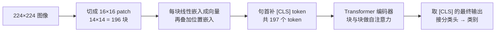

# ViT 视觉 Transformer

> **一句话理解**：ViT 把图切成 16×16 的小块当"单词"，用 Transformer 读图——让视觉和语言从此说同一种架构语言。

[⬆️ 返回总目录](../../../README.md) · [⬆️ 返回本篇](../README.md) · [⬅️ 返回本章目录](./README.md)

| 属性 | 说明 |
|------|------|
| 难度 | ⭐⭐⭐⭐（高阶） |
| 所属分支 | 视觉 |
| 前置知识 | [视觉三大任务](./02-视觉三大任务.md)；建议同时了解[02-Transformer与注意力机制](../07-自然语言处理与LLM/02-Transformer与注意力机制.md) |

---

## 📌 这一节解决什么问题

Transformer 在 NLP 大获全胜（第 7 章的主角），视觉这边 CNN 已统治十年。一个自然的问题：**同一套 Transformer 能不能直接看图？** 卡在一个表面上很小的差别上：Transformer 吃的是**序列**（一排 token），图像却是**二维网格**——不是天生的"句子"。

ViT（Vision Transformer，2020）的答案简单粗暴却极其有效：**切**。把 224×224 的图切成 16×16 的小块（patch），每块拉直、用一个线性层变成向量——它就是图像世界的"单词"。剩下的交给标准 Transformer：块与块之间做注意力，谁和谁有关系自己学。

这个方案当时被质疑"丢了图像的先验"，ViT 用实验回敬了一个重要结论：**没有先验没关系，用数据补**——大数据下 ViT 反超 CNN，并顺手打开了 CV 与 NLP 大一统的大门。

## 🌱 通俗理解

把一张大图想成一幅**拼图**。CNN 的做法是拿小放大镜一块块看局部；ViT 的做法是先把拼图拆成 196 块小片，**每块当成一个词，把整幅图读成一句话**："左上角这片（很暗）+ 它右边这片（有竖条纹）+ ……（共 196 片）"。然后像读句子一样读图：注意力让"猫耳朵那片"和"猫脸那片"互相勾连，和"背景墙那片"少来往——关系自己学出来。

**[CLS] token** 是句首加的一个特殊"单词"，它不代表任何图像内容，而是充当**汇总发言人**：每一层注意力里它都把全场信息收集一遍，最后一层的 [CLS] 输出直接接分类头——相当于开完会由它做总结发言，总结稿就是"这是只猫"。

代价也明摆着：CNN 生来就懂"相邻才有关系"（局部性）和"模板全图通用"（平移不变），ViT 把这些常识全忘了，一切从头学——所以它**饿**：小数据喂不饱，大数据才管够。这就是有名的"ViT 数据饥饿"，下面用对比表细说。

## 📋 举个例子

数一数 ViT-B/16 的 token，感受"图变句子"：

1. 输入图 224×224 像素，每块 patch 边长 16 → 每行切 224 ÷ 16 = **14** 块；
2. 每列同样 14 块 → 全图共 14 × 14 = **196** 块 patch；
3. 句首再补 1 个 [CLS] 汇总 token → 196 + 1 = **197** 个 token。

$$
N = \frac{H \times W}{P^2} = \frac{224 \times 224}{16 \times 16} = 196
$$

> 👉 **人话**：token 数 = 图的像素"面积"除以每块的像素面积，224×224 的图除以 16×16 的块，正好 196 个"视觉单词"。

和文本对照着看：

| | 文本 Transformer | ViT |
|---|---|---|
| 原始输入 | 一句话 | 一张 224×224 图 |
| 切分方式 | 分词器切成词 / 子词 | 切成 16×16 图块 |
| token 数量 | 句长而定，如 20 个 | 固定 196 个 + 1 个 [CLS] = 197 个 |
| 每个 token 是什么 | 一个词的向量 | 一块 16×16 小图的向量 |
| 位置信息 | 位置嵌入（第几个词） | 位置嵌入（第几块 patch） |
| 汇总方式 | [CLS] 或均值池化 | [CLS] token |

也就是说：**"小明 昨天 去 超市"** 和 **"左上块 暗块 条纹块 …（196 块）"** 在模型眼里是同一种东西——一排 token 序列。

## 🧠 核心原理

### 整体流程



### 逐步拆解

**① Patch Embedding：图块变词**

每个 16×16×3 的 patch 拉平成 768 维向量（16×16×3=768），再过一层线性投影——相当于给每个图块发一张"身份证"。再叠加**位置嵌入（Position Embedding）**：patch 本身没有顺序信息，加上位置向量，模型才知道"这片在左上、那片在右下"。

**② [CLS]：汇总发言人**

[CLS] 的向量随机初始化，随训练学会"开会收料"。每层注意力里它都扫一遍全部 patch，最后一层输出即整图表示。分类只看它——单个位置扛起整图语义。

**③ 注意力：块与块自己建立关系**

注意力公式与第 7 章完全相同：

$$
\mathrm{Attention}(Q, K, V) = \mathrm{softmax}\!\left(\frac{QK^\top}{\sqrt{d}}\right)V
$$

> 👉 **人话**：每块 patch 都问一遍其他所有块"你和我相关吗"（打分），按分数加权取材——"猫耳朵块"多看几眼"猫脸块"，少看"背景墙块"。卷积的"只看邻域"被换成了"全图自己挑着看"。

<details>
<summary>🧮 展开：ViT 为什么"数据饥饿"——归纳偏置的账</summary>

**归纳偏置（Inductive Bias）**= 模型生来自带的"常识假设"。CNN 自带两条：局部性（相邻像素相关）与平移等变（模板全图通用）。ViT 的注意力对 token 一视同仁，这两条常识都得靠数据学回来。

原论文的实验结论（量级供参考）：

- 只在 ImageNet-100 万张量级上**从零训练**：ViT 打不过同规模的 ResNet——数据不够，它还没学会"看局部"；
- 先在约 3 亿张的私有大数据集上**预训练**、再回 ImageNet 微调：ViT 反超，规模越大领先越多。

一句话：**CNN 是"有天赋的选手"，ViT 是"题海战术选手"**——题少时天赋占优，题多时题海封神。实践推论：数据只有几千几万张时，别硬上 ViT 从零训练；要么用别人预训练好的 ViT 微调（等价于借题库），要么老实 CNN。

</details>

**④ CNN vs ViT 对比**

| 维度 | CNN | ViT |
|---|---|
| 看图方式 | 局部滑窗，逐层扩大视野 | 全局注意力，任意两 patch 直接建立联系 |
| 归纳偏置 | 强（局部 + 平移等变），天生适合图 | 弱，靠大数据学 |
| 小数据 | 从零训练也稳 | 从零训练易欠拟合，需预训练 |
| 大数据上限 | 增长放缓 | 越大越吃香，规模定律明显 |
| 计算与部署 | 成熟高效，边缘端友好 | 注意力开销大，压缩部署更费劲（改善中） |
| 典型场景 | 边缘设备、中小数据、实时检测 | 大规模预训练、多模态、前沿研究 |

**⑤ 大一统伏笔**

图像变成 token 序列后，文本是 token 序列、音频也能变 token 序列——**三种模态说了同一种语言**，融合只需在序列层面做注意力。第 12 章[多模态模型](../../5-前沿与融合/12-生成模型与多模态/04-多模态模型.md)（图文对话、文生图）正建立在这块地基上；本章的 ViT 就是那场融合的第一块砖。

## 💻 动手试试

```python
import urllib.request
import torch
from PIL import Image
from torchvision import models, transforms

# 1. 测试图（需联网下载）
urllib.request.urlretrieve(
    "https://github.com/pytorch/hub/raw/master/images/dog.jpg", "dog.jpg")

# 2. 预训练 ViT-B/16：把 224×224 图切成 16×16 patch
#    首次运行会下载约 330MB 权重，需联网
weights = models.ViT_B_16_Weights.IMAGENET1K_V1
model = models.vit_b_16(weights=weights)
model.eval()

# 3. 预处理与 ResNet 同款：缩放 → 裁剪 224×224 → 归一化
preprocess = transforms.Compose([
    transforms.Resize(256),
    transforms.CenterCrop(224),
    transforms.ToTensor(),
    transforms.Normalize(mean=[0.485, 0.456, 0.406], std=[0.229, 0.224, 0.225]),
])
x = preprocess(Image.open("dog.jpg").convert("RGB")).unsqueeze(0)  # [1, 3, 224, 224]

# 4. 先自己数一遍 token，再推理
n_patch = (224 // 16) ** 2
print(f"patch 数：{n_patch}（14×14），加 1 个 [CLS]，共 {n_patch + 1} 个 token")

with torch.no_grad():
    probs = torch.softmax(model(x), dim=1)[0]

labels = weights.meta["categories"]
top5 = torch.topk(probs, 5)
for p, i in zip(top5.values, top5.indices):
    print(f"{labels[i]:<25s} {p.item():.2%}")

# 预期输出：
# patch 数：196（14×14），加 1 个 [CLS]，共 197 个 token
# 前五名同样是狗的品种（具体类别与概率与 ResNet 略有不同——两种"看图思路"的分歧）
```

## 🔥 炼丹小灶

> 🔥 **炼丹小灶**：工业界常用起点配方与玄学——
> - 配方：从零训练别想，直接拿预训练 ViT 微调：AdamW lr=5e-5~1e-4、warmup、batch 32~128；数据几千张以内先冻结骨干只训头；增广上 mixup/cutmix 帮助明显。
> - 玄学：微调发散先降学习率再查预处理（ViT 对归一化统计很敏感）；输入尺寸必须匹配 patch 划分（224 对 16），不然 token 数对不上。
> - ⚠️ 以上是经验参考值，不是圣旨；换数据集请重新炼。

## 🖱️ 动手玩

> 🎮 **本库实验场**：[注意力热力图](../../../playground/attention.html)——换一句话看词与词的注意力权重怎么变；ViT 把同样的机制用在 patch 与 patch 之间。
> 🕹️ **延伸玩一玩**：[Transformer Explainer](https://poloclub.github.io/transformer-explainer/)——交互式拆解 Transformer 编码器内部，ViT 的"发动机"就是它。

## 🔗 在知识树中的位置

- **上游**：[视觉三大任务](./02-视觉三大任务.md)（任务不变，骨干换人）；架构内核来自[02-Transformer与注意力机制](../07-自然语言处理与LLM/02-Transformer与注意力机制.md)。
- **下游**：第 12 章[多模态模型](../../5-前沿与融合/12-生成模型与多模态/04-多模态模型.md)——"图变 token"是图文对齐、文生图的地基；时序方向的 patch 思想（把连续时间点打包）也源于此（见第 6 章[现代时间序列模型](../06-时间序列/03-现代时间序列模型.md)）。
- **横向对比**：与 CNN 的取舍见上方对比表——小数据、边缘端偏 CNN；大数据、多模态、可扩展偏 ViT。

## ⚠️ 常见误区

- **误区一**："ViT 已彻底取代 CNN" → 边缘端与中小数据场景，卷积网络在速度、数据效率、成熟度上仍是主流；两者长期共存。
- **误区二**："切成 patch 就丢了空间关系" → 位置嵌入把每块的位置信息补了回来；且任意两块可直接注意力相连，全局关系反而比 CNN 早期层更"直连"。
- **误区三**："ViT 小数据也能打赢 CNN" → 从零训练时恰恰相反（缺归纳偏置）；小数据要么借预训练权重，要么选 CNN。

## 📝 小结与自测

**要点回顾**

- ViT = 图切 patch + 线性嵌入 + 位置嵌入 + [CLS] + 标准 Transformer；224/16 = 14，14² = 196，+1 = 197 个 token；
- [CLS] 是汇总发言人，最后一层的它接分类头；
- 数据饥饿的根源是缺归纳偏置：小数据输 CNN、大数据反超；
- 图像 token 化打开了 CV 与 NLP 的大一统，直通第 12 章多模态。

**自测一下**（点击展开答案）

<details>
<summary>问题 1：把 384×384 的图用 16×16 的 patch 切，一共多少个 token（含 [CLS]）？</summary>

384 ÷ 16 = 24，24 × 24 = 576 个 patch，加 1 个 [CLS]，共 **577** 个 token。序列更长、注意力开销（与 token 数平方相关）也更大。

</details>

<details>
<summary>问题 2：为什么 [CLS] 一个 token 能代表整张图？</summary>

它每一层都通过注意力从所有 patch 收集信息，逐层"汇总全场"；训练目标是它的输出能完成分类，梯度会逼它学会抓重点。它不是天生会总结，是被任务驯出来的汇总发言人。

</details>

## 📚 延伸阅读

- 论文：Dosovitskiy et al., *An Image is Worth 16x16 Words*（ViT, 2020）；Liu et al., *Swin Transformer*（2021，层次化视觉 Transformer 的代表）
- 综述可搜"Vision Transformer survey"；掩码自监督预训练（如 MAE 一类工作）是 ViT 降数据门槛的重要后续
- 交互：[Transformer Explainer](https://poloclub.github.io/transformer-explainer/)

---

[⬅️ 上一页：视觉三大任务](./02-视觉三大任务.md) · [返回本章目录](./README.md) · [下一页：生产实战 ➡️](./99-生产实战.md)
