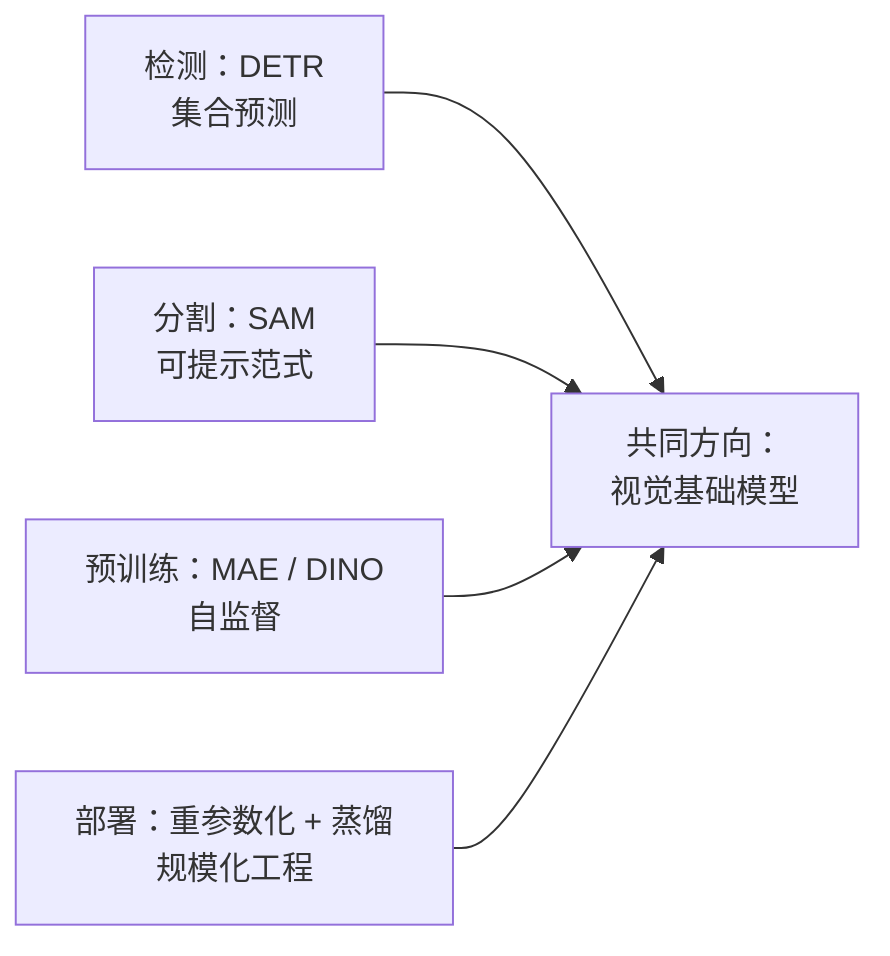
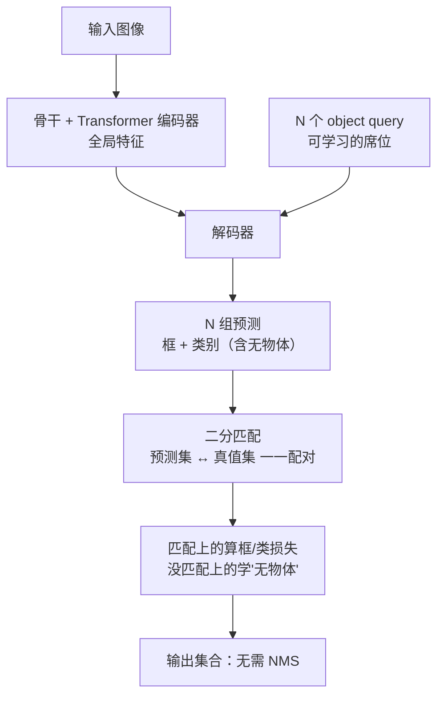
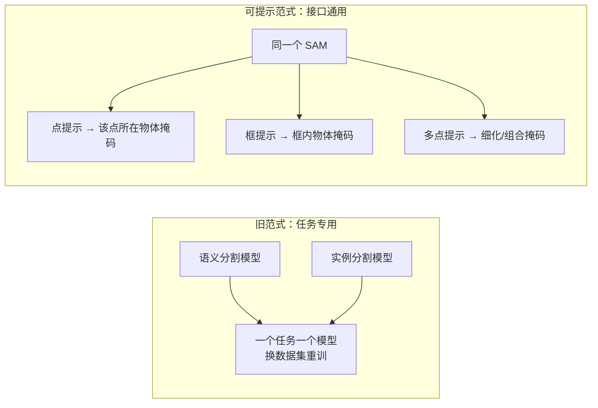
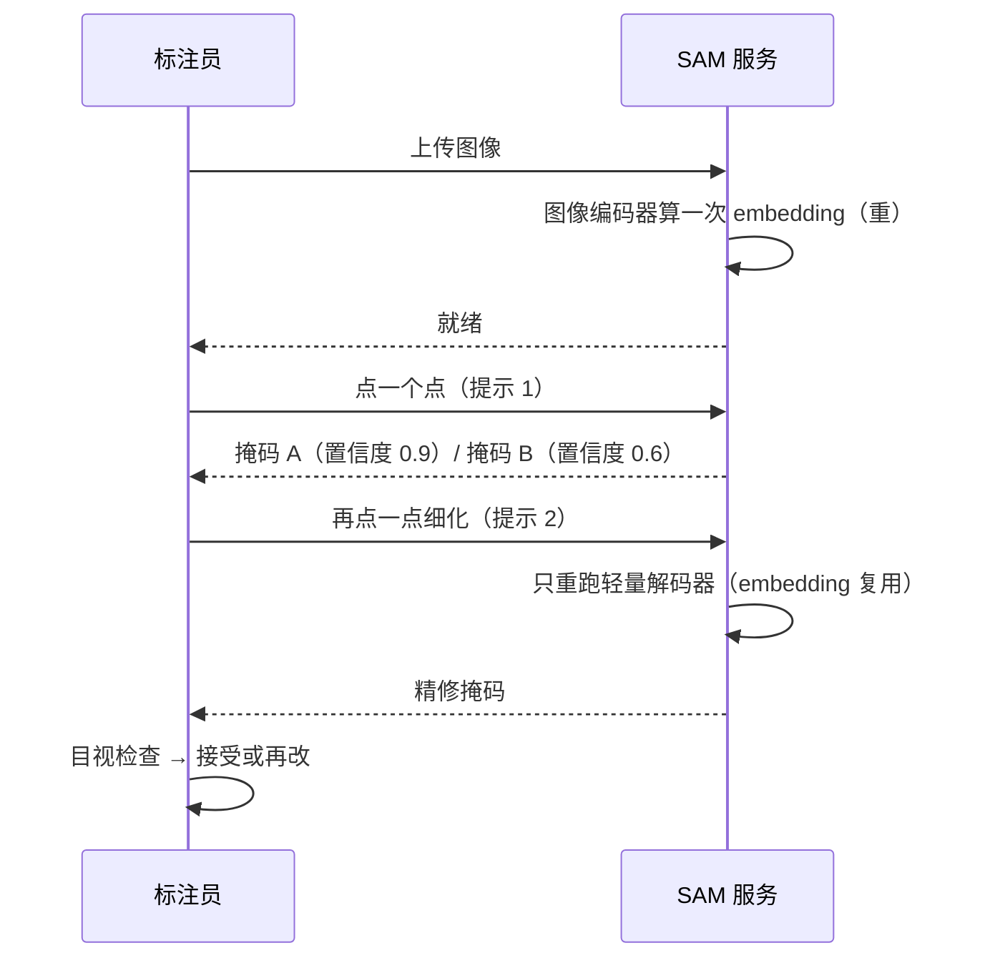
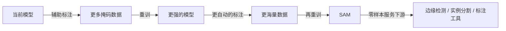
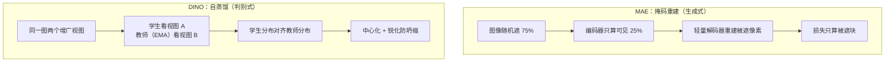
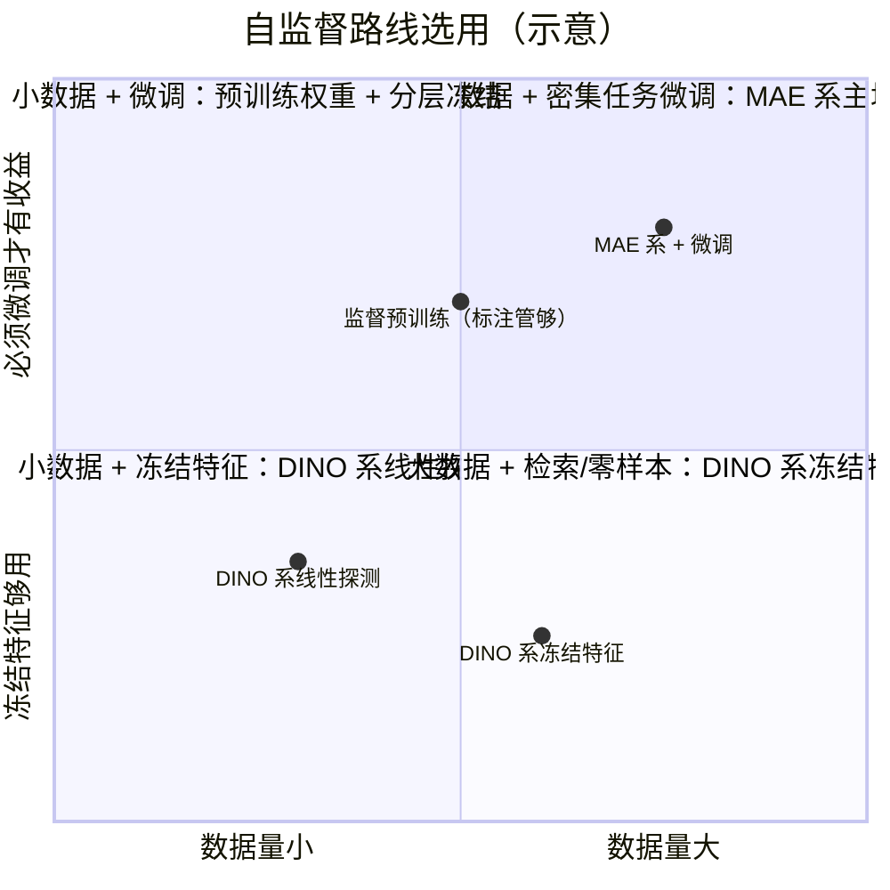
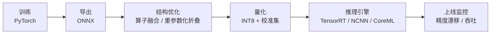

# 进阶专题：视觉前沿

> **一句话理解**：视觉正在从"每个任务一套手工流水线"走向"一套可提示的基础模型"——检测变成集合预测、分割变成听提示办事、预训练不再等人标注、部署时训练与推理各换一张脸。

[⬆️ 返回总目录](../../../README.md) · [⬆️ 返回本篇](../README.md) · [⬅️ 返回本章目录](./README.md)

| 属性 | 说明 |
|------|------|
| 难度 | ⭐⭐⭐⭐（高阶） |
| 所属分支 | 视觉 |
| 前置知识 | [CNN 卷积神经网络](./01-CNN卷积神经网络.md)、[视觉三大任务](./02-视觉三大任务.md)、[ViT 视觉 Transformer](./03-ViT视觉Transformer.md) |

---

## 📌 这一节解决什么问题

前三页走完了"CNN 学会看图 → 三大任务定型 → ViT 换骨干"的主线。站在 2026 年往回看，真正改变视觉工业面貌的是四条平行推进的暗线，它们共同回答一个问题：**视觉能不能像 NLP 那样，走向"一个基础模型 + 轻量适配"的范式？**

1. **检测**：anchor、NMS 这些手工件能不能从链路里彻底消失？——DETR 的**集合预测（Set Prediction）**；
2. **分割**：每个任务训一个专用模型的模式能不能终结？——SAM 的**可提示分割（Promptable Segmentation）**；
3. **预训练**：不靠人工标注，视觉能不能自己喂饱自己？——MAE / DINO 两条**自监督（Self-Supervised Learning）**路线；
4. **部署**：训练时的精度优势如何无损搬进推理？——**结构重参数化（Structural Re-parameterization）**与**知识蒸馏（Knowledge Distillation）**。

四条线各自独立生长，却指向同一个词——视觉的**基础模型化**。本页逐条拆开：每条线解决什么、核心机制的直觉、真实的代价与边界。读完你应当能把这四个"新名词"各自放回第 02 页那条"手工链路"的对应位置上——它们不是凭空出现的第四种魔法，而是对旧链路某一环的定点替换。每一环的替换都遵循同一个追问：**这一环的"手工性"到底能不能被学出来？**

## 🌱 通俗理解

四句话先行：

- **DETR 像"席位制招聘"**：公司只开 N 个席位（query），每个候选人（物体）自动对号入座，配对用"全局最优的二分匹配"——不再需要 NMS 这个"保安查重"，因为一个萝卜一个坑，重复占座在制度上就不成立。
- **SAM 像"听提示的万能剪刀"**：你说"剪这里"（点一下）或"剪这个"（框一下），它就沿着边界剪出掩码——剪刀不问你剪的是什么类别，只管剪得准。
- **自监督像"自己做题不等人出题"**：把图遮住一大半让模型补全（MAE），或者让模型的"现在"与"过去"对答案（DINO）——答案就藏在图里，不需要人来标。
- **部署演化像"训练穿铠甲、上场穿单衣"**：训练时多分支结构学得稳（RepVGG），上场前把铠甲熔进身体只留单分支；或让小模型拜大模型为师（蒸馏），只学老师的本事不付老师的工资。

## 🗺️ 本页地图



## 📋 举个例子

DETR 的二分匹配是全页第一块硬骨头，先用最小的代价矩阵手算一遍。设图里有 2 个真值物体（GT1 猫、GT2 狗），模型出了 3 个 query 预测。每对（预测， 真值）算一个**匹配代价** = 类别代价 + 框代价（数字为示意）：

| 代价 | GT1（猫） | GT2（狗） |
|---|---|---|
| query 1 | **0.3** | 2.0 |
| query 2 | **0.5** | **0.4** |
| query 3 | 1.8 | 0.6 |

问：怎么配对总代价最小（每个 GT 恰好配一个 query、每个 query 最多配一个 GT）？

- **贪心**（每个 GT 各挑眼前最像的）：GT1 挑 query 1（0.3），GT2 挑 query 2（0.4），总代价 0.7；
- **换一种**：GT1 配 query 2（0.5）、GT2 配 query 3（0.6），总代价 1.1——更差；
- 所以本例最优就是 0.7，query 3 无人认领，配给"无物体（no-object）"，学习"此处无物"。

<details>
<summary>📊 展开：为什么贪心会翻车（换一组数字）</summary>

把代价矩阵换成：

| 代价 | GT1 | GT2 |
|---|---|---|
| query 1 | **0.1** | **0.3** |
| query 2 | 0.2 | 0.9 |

贪心：两个 GT 都看中了 query 1（它对谁都是最优）——冲突；常规裁决是"先到先得"，GT2 被挤去配 query 2，总代价 0.1 + 0.9 = **1.0**。

全局最优：GT1 配 query 2（0.2）、GT2 配 query 1（0.3），总代价 **0.5**——让 GT1 吃点亏（0.1→0.2），换全局省一半。这正是"先配对、再算分"的集合思维赢过"逐个挑"的地方，也是 DETR 必须用**匈牙利算法（Hungarian Algorithm）**求全局最优匹配、而不是逐对贪心的原因。代价矩阵变大后（100 个 query × 几十个 GT），枚举所有配对是天文数字，匈牙利算法用多项式时间解掉它—— DETR 训练时每一步都解一次。

</details>

## 🧠 核心原理

### 板块一：DETR 系——把检测变成集合预测

#### 1.1 从流水线到集合预测

第 02 页的检测链路是"骨干 → 密集预测头 → 置信度筛选 → NMS 去重"，其中 **anchor（参考框）与 NMS（去重）是两大手工件**：anchor 是人为设定的先验，NMS 是人为设定的后处理。DETR（DEtection TRansformer，2020）的野心是：**把检测定义为"预测一个物体集合"的直接预测问题，让手工件全部消失**。

机制三件套：

- **编码器**：CNN/ViT 骨干提特征，展平成 token 序列，Transformer 编码器做全局注意力；
- **object query（目标查询）**：N 个可学习的嵌入向量（原版 N=100），像 N 个"席位"参加解码——每个 query 通过**交叉注意力（Cross-Attention）**到图像特征里"认领"一个物体：它该在哪、多大、是什么类；
- **二分匹配损失（Bipartite Matching Loss）**：预测集与真值集做一一配对，配上的才算损失。



#### 1.2 二分匹配损失：直觉与公式

集合预测的训练有个先有鸡还是先有蛋的问题：预测框有 N 个、真值框有 M 个（N 远大于 M），**损失必须先知道"谁对谁负责"才能算**。DETR 的答案是每步训练先解一个最优配对：

$$
\hat{\sigma} = \arg\min_{\sigma} \sum_{i=1}^{M} \Big[\, c_{\text{类}}\big(y_i,\, \hat{y}_{\sigma(i)}\big) + \lambda_1\, \big\| b_i - \hat{b}_{\sigma(i)} \big\|_1 + \lambda_2\, \mathcal{L}_{\text{IoU}}\big(b_i,\, \hat{b}_{\sigma(i)}\big) \Big]
$$

> 👉 **人话**：在所有"一一配对"的方案里，挑总代价最小的那个——每对代价 = "类别像不像 + 框离得近不近"（λ 是两部分的汇率）。配对定了，训练信号才有了收件人：匹配上的 query 学"把框画准、把类报对"，没匹配上的 query 学"此处无物"。

为什么这能取代 NMS？看重复预测的下场：两个 query 都想报同一只猫，但匹配是**一对一**的——只有一个是"正牌"，另一个必然被划为"无物体"而受罚。**去重不再是后处理的保安，而是损失内置的制度**：制度上不允许两个席位卖同一张票。

DETR 每个席位最终输出什么？拿本页例子（2 物体 + 3 query）看输出结构（数字为示意）：

| 席位 | 类别概率（猫/狗/无物体） | 框 (x, y, w, h) | 推理时怎么处理 |
|---|---|---|---|
| query 1 | 0.88 / 0.05 / 0.07 | (34, 42, 210, 160) | "无物体"概率足够低 → 保留 |
| query 2 | 0.03 / 0.91 / 0.06 | (255, 60, 180, 320) | 保留 |
| query 3 | 0.02 / 0.04 / 0.94 | (300, 200, 90, 70) | "无物体"概率高 → 滤掉 |

注意最后一列：DETR **没有 NMS，但不是没有后处理**——它把"NMS 去重 + 阈值过滤"这两件事压缩成一件"按无物体概率过滤"。去重确实消失了（一对一匹配的制度保证），阈值这一环还留在链路上（工程细节，读 DETR 代码时会看到 top-k 按目标分数筛选）。

#### 1.3 为什么收敛慢：新范式的学费

DETR 最著名的代价是**训练极慢**：原版在 COCO 上要约 500 个 epoch 才完全收敛（后续论文普遍引用的数字），而 Faster R-CNN 惯常的 1× 训练只有 12 个 epoch——慢一到两个数量级（论文数字，经验参考）。三个病因：

| 病因 | 机制 | 直觉 |
|---|---|---|
| **匹配的离散跳变** | 每轮配对由代价矩阵在线解出，训练早期预测乱飘 → 最优配对频繁换人 | 优化目标像"追兔子"：梯度刚朝一个配对使劲，配对又换了，信号互相打架 |
| **全局注意力的冷启动** | query 要从零学会"去图的哪里取特征"，没有任何空间先验 | 旧检测器的 anchor/ROI 至少规定了"看这一带"；DETR 什么都不规定，自由换来的学费 |
| **小目标证据不足** | 全局特征里小目标的像素证据本来就少（02 页老问题） | DETR 早期的小目标 AP 尤其弱，收敛也最慢 |

**Deformable DETR（可变形 DETR，2021）一句话级**：每个 query 不再做全图注意力，只学"在参考点附近采样一小撮位置取特征"（可变形注意力）——相当于给"去哪取"装上空间先验，训练收敛的 epoch 降了一个数量级。后续 DETR 系（包括去噪训练等改良）基本解决了收敛问题，DETR 系检测头如今已是生产候选。

收敛慢的三个病因里，①②是"新范式的学费"（后来的改进已大幅摊薄），③是"问题本身的物理"（谁都得付）——读 DETR 系改进论文时分清这两类，才不会把物理当成可修复的缺陷。

#### 1.4 一套查询机制通吃多任务：统一检测与分割

DETR 真正深远的影响不在检测精度，而在**任务接口的统一**：query 机制输出的本来就是"每个物体一条记录"，那把每条记录的输出从"框"换成"掩码"，检测器就变成了分割器——MaskFormer/Mask2Former（2021/2022）用**同一套 query 骨架**统一了语义、实例、全景三类分割（区别只剩训练标签与输出的解码）。对 02 页"三大任务 = 换头"的框架，这是一次升维：**任务差异被压缩到"query 输出什么 + 用什么损失配对"**，骨干与查询机制全部复用。

| 维度 | 传统链路（02 页） | DETR 式集合预测 |
|---|---|---|
| 人工组件 | anchor 尺度/长宽比、NMS 阈值 | query 数 N（一个数字） |
| 去重 | 后处理 NMS（密集场景误杀） | 损失内置的一对一匹配 |
| 多任务复用 | 检测、分割各一套头与工艺 | 一套 query 机制 + 换输出/损失 |
| 训练代价 | 成熟、快 | 新范式学费（已被后续工作大幅摊薄） |
| 适配新任务 | 重写头与后处理 | 定义新匹配代价即可（如姿态的关键点匹配） |

**失效边界**：① query 数 N 是硬上限——重叠目标多于 N 时必然漏（N 通常远大于常见目标数，但极端密集场景要留意）；② 量化部署时动态长度输出与自定义算子需要额外工程（经验参考）；③ 小目标仍要靠高分辨率特征与多尺度设计，集合预测不豁免 02 页的物理定律。

#### 1.5 DETR 系的失败模式速查（何时不 work）

| 症状 | 病因 | 诊断 | 补救 |
|---|---|---|---|
| 小数据集微调 DETR 系不涨甚至掉点 | 匹配跳变 + 数据少 = query 训不稳 | 对比同数据 YOLO 系基线：DETR 明显落后即坐实 | 从 COCO 预训练权重起步；加长训练预算；不行就回 YOLO 系（小数据是它的主场） |
| 推理输出"幽灵框"多（低置信度重复框） | 一对一匹配抑制的是训练期重复，推理仍靠分数过滤 | 按"无物体"概率排序看重复框的分数分布 | 提高目标分数阈值；检视训练的正则（重复框常伴随过拟合） |
| 训练 loss 剧烈震荡、AP 长期趴底 | 匹配的离散跳变在早期主导优化（1.3 病因一） | 打印每步匹配结果：同一 GT 的配对对象频繁更换 | 用带去噪训练/稳定配对的改进版 DETR；调大 batch 平滑匹配 |
| 密集小目标场景 AP 远低于 YOLO 系 | 全局特征里小目标证据不足 + 收敛最慢 | 按目标尺寸分桶看 AP：小目标桶独低 | 高分辨率输入 + 多尺度特征（deformable 系的强项）；或该场景换回卷积检测器 |


### 板块二：SAM 与可提示分割

#### 2.1 可提示范式：从"任务专用"到"基础模型"

第 02 页的分割是"任务专用"世界：语义分割一个模型、实例分割一个模型、换一个数据集重训一个。SAM（Segment Anything Model，2023）把问题改写成一个**接口**问题：**可提示分割（Promptable Segmentation）**——输入（图像， 提示），输出"提示所指对象的掩码"。提示可以是点（点一下物体内部）、框（框住物体）、粗掩码，甚至文本（能力相对有限）。

这一改写的意义与 LLM 的 prompt 同构：**把"任务说明"从训练时（训练什么模型就干什么活）搬到推理时（同一模型，提示说了算）**。下游不再"训练模型"，而是"写提示"——这就是"基础模型（Foundation Model）"一词的落点：一次预训练，处处提示。



#### 2.2 架构与推理成本：一次重计算 + N 次轻解码

SAM 的三件套与成本结构（架构组成为论文设计）：

| 组件 | 是什么 | 计算量级 |
|---|---|---|
| 图像编码器 | MAE 预训练的 ViT-H——把图压成一张"全局底片"（图像 embedding） | **重**：一次前向占绝大部分算力 |
| 提示编码器 | 点/框 → 位置编码；（有限的）文本走文本编码器 | 轻 |
| 掩码解码器 | 轻量 Transformer：提示 embedding 与图像 embedding 做交叉注意力，吐出掩码 + 置信度 | 轻 |

这个"重底片 + 轻解码"的拆分是交互式产品的成本答案：**同一张图的 embedding 只算一次，用户点多少次提示就跑多少次轻解码**——提示再多，秒回（交互式标注工具的体验基础）。歧义处理也内置：一个点落在两个物体重叠处时，SAM 输出**多个候选掩码 + 各自的 IoU 置信度**，让上层应用挑——不硬猜，是把歧义如实上报。一次交互式标注会话的完整链路：



> 👉 **人话**：重活（编码）摊销在整张图上，轻活（解码）按提示次数计费——这套成本结构与"人机协同标注"的工作流互为设计：人的每一次点击都立刻有反馈，标注速度由此起飞（数据引擎阶段①②的体验底座）。

#### 2.3 数据引擎：辅助标注与模型迭代的飞轮

可提示范式需要海量的（图像， 提示， 掩码）三元组——没有人标过这种数据。SAM 的真正杠杆是一个**数据引擎（Data Engine）**：模型与标注互相抬轿的三阶段飞轮（阶段划分与规模为论文数字）：

| 阶段 | 做法 | 产出 |
|---|---|---|
| ① 辅助人工 | 模型预生成掩码，人工修正/补充 | 高质量种子掩码 → 训出更好的模型 |
| ② 半自动 | 模型把"已有把握"的物体掩掉，人只标**还没标过**的物体 | 数据更全面 → 模型再见多识广 |
| ③ 全自动 | 每图撒几十个点提示（论文为 32 点量级），模型自己出掩码、自动筛选 | 规模引爆：占总掩码量约 99% |

最终数据集 **SA-1B**：约 1100 万张图、**11 亿个掩码**——比此前所有分割数据集加起来大几个数量级，且绝大部分由全自动阶段生成。



**这套方法论比模型本身更可迁移**："模型生成数据 → 训更好的模型"的飞轮，正在成为视觉乃至其他模态数据工程的标准姿势（第 12 章生成模型会再次见到它的近亲）。**批判**：自动生成的掩码无人审核，模型偏置会复利进数据；提示分布决定掩码分布——"点提示下的掩码质量"不等于"任意提示下都好"；图像来源与隐私也伴随公开讨论——工程红利与数据治理问题同生。

#### 2.4 零样本转移与边界

SAM 在二十余个下游数据集上做了零样本评测（论文实验设置），姿态是"通用分割工具"。但边界要认清：

- **它给"提示处的掩码"，不保证知道"那是什么"**——语义类别、场景理解不在保票内，开放词汇的"认类别"要靠检测/分类侧配合；
- **域差距真实存在**：医学影像、遥感、显微等域上直接用常掉点，生产上多作**交互式标注前端**（人点、模型剪、人微调）或作初始化权重再微调（经验参考）；
- **输出粒度由提示决定**：提示含糊，掩码就含糊（点在两个物体重叠处，给谁的掩码？SAM 用"多掩码输出 + 置信度"来应对歧义）；
- **生产定位**：把 SAM 当"数据引擎的引擎"（标注加速器）通常比当"端上成品"更划算——又回到飞轮。三种用法按投入从低到高排：

| 用法梯度 | 做法 | 适合 |
|---|---|---|
| ① 直接推理 | API/权重直接用，业务侧只写提示 | 与自然图域接近、能容忍边缘误差的场景 |
| ② 当标注前端 | 人点选 + SAM 出掩码 + 人工微调 → 攒同域数据 | 数据资产建设期（性价比最高的姿势） |
| ③ 教师或初始化 | 以 SAM 为教师蒸馏专用小模型；或用其权重微调 | 域差距大、要小模型部署的正式生产 |

### 板块三：自监督视觉——MAE 与 DINO 两条路

#### 3.1 为什么自监督在视觉比 NLP 晚熟

NLP 的自监督（预测下一词/完形填空）在 2018 年就引爆了；视觉等了约三年才等来自己的"BERT 时刻"。晚熟的根源是**信息结构差异**：

| | 语言 | 图像 |
|---|---|---|
| 离散性 | 天然离散 token，有现成词表 | 连续像素，没有天然"词" |
| 信息密度 | 一个词就是高度语义化的单元 | 一个 patch 的语义密度低得多 |
| 冗余度 | 删一个词信息真丢了（要靠上下文猜） | 相邻像素高度冗余，遮一块可以"抄邻居"补上 |

第三行是关键：给视觉设计"完形填空"，最大的敌人是**图像冗余**——模型不必理解语义，靠插值抄邻居就能把遮住的块补得差不多，预训练目标瞬间失去含金量。两条自监督路线分别给出自己的解法。

#### 3.2 MAE：掩码重建 = 视觉版 BERT

MAE（Masked Autoencoder，掩码自编码器，2022）的策略简单粗暴：**掩得狠一点**。随机遮掉 **75%** 的 patch（BERT 只遮 15% 的词），只把剩下的 25% 喂给编码器，再由一个轻量解码器重建被遮住的像素：

$$
\mathcal{L}_{\text{MAE}} = \frac{1}{|\Omega_{\text{mask}}|} \sum_{p \in \Omega_{\text{mask}}} \big\| \hat{x}_p - x_p \big\|_2^2
$$

> 👉 **人话**：只在被遮住的块上算"重建得像不像"（均方误差）——可见块本来就给模型看了，不参加计分。掩掉四分之三，抄邻居也抄不出一只猫——逼模型从剩余碎块推断"这里应该有只猫"的语义结构。

**为什么 75% 不是玄学**：它是"图像冗余度"的直接推论——冗余越高，需要遮得越狠才能让"抄近路"失效（类比：完形填空挖 3 个词可以靠语感蒙，挖掉半篇就必须真读懂文章）。推论也成立：换到低冗余域（医学、遥感这类纹理信息密集的图），最优掩码率要重估（经验参考）。两个工程甜点：①编码器只算 25% 的块——预训练直接省 3/4 计算量；②微调时解码器整个丢掉——预训练与下游使用解耦。收益（论文结论）：MAE 预训练的 ViT 微调到检测/分割，反超同预算的监督预训练——**大规模标注不再是视觉预训练的入场券**。

#### 3.3 DINO 系：自蒸馏

DINO（self-**di**stillation with **no** labels，2021）换一条路：不重建像素，而是让模型的两份视图输出**互相一致**。机制四件套：

- 同一图像做两个增广视图，学生看一个、教师看另一个；
- 损失 = 学生的输出分布对齐教师的输出分布（交叉熵）——**没有标签，目标来自教师**；
- 教师不是另一个人，是学生参数的指数滑动平均（EMA）：

$$
\theta_{\text{teacher}} \leftarrow m\, \theta_{\text{teacher}} + (1 - m)\, \theta_{\text{student}}
$$

> 👉 **人话**：教师是学生"过去若干步的平均影子"——比学生更稳、更少噪声。目标不来自外部标签，来自"更稳的自己"，这就是"自蒸馏"。

- 防坍缩：若无约束，师生会一起摆烂到"所有图输出同一答案"。DINO 用**中心化 + 锐化**（把教师的输出分布平移去均值、再降低温度使其尖锐）阻止这场合谋。

**涌现现象**：DINO 的注意力图自发地"把物体抠出来了"——没有任何分割标签，学"两个视图一致"竟学出了物体级结构。这类**涌现性质（Emergent Property）**是判别式路线的招牌，也是它常被用作冻结特征（不微调直接抽特征用）的原因。**DINOv2（2023）一句话级**：算法大体延续，重心移到**数据工程**——自动筛选与去重的亿级图像库，证明自监督的第二战场是"数据策展（Data Curation）"而非单纯堆模型。

两条路线的流水线并排看一眼（生成式造"补全器"，判别式造"一致器"）：



**易混淆提示**：检测方向另有一个同名 **DINO**（DETR with Improved deNoising anchOr boxes，2022），与自监督的 DINO 撞名，是完全不同的两件事——读文献时认准全称。

#### 3.4 两条路线对比与选用

| 维度 | MAE（生成式：掩码重建） | DINO（判别式：自蒸馏） |
|---|---|---|
| 预训练目标 | 重建被遮 patch 的像素 | 两视图的输出分布一致 |
| 对图像冗余的回应 | 高掩码率（75%）让"抄邻居"失效 | 靠增广制造"同一物体的两个样子" |
| 表示特点 | 偏底层结构与纹理，微调后劲足 | 偏语义与物体级结构，冻结特征强 |
| 下游偏好 | 检测/分割等密集任务**微调** | 检索、线性探测、零样本等**冻结特征** |
| 计算特点 | 编码器只算可见 patch，预训练便宜 | 全图两视图，增广管线是隐藏大头 |
| 风险点 | 低冗余域的掩码率要重估 | 对增广组合敏感；坍缩调参有门槛 |

<details>
<summary>🧮 展开：掩码率扫一遍的三种失败形态（直觉示意）</summary>

把掩码率当旋钮从左拧到右，三种典型形态（定性示意，帮助建立体感，非论文数字）：

| 掩码率 | 重建任务的难度 | 模型的"省力解" | 学到的表示 | 下游表现 |
|---|---|---|---|---|
| 低（30%~50%） | 太容易 | 抄邻居插值——不必理解语义 | 局部纹理补全器 | 分类微调增益有限 |
| 高（75% 上下） | 逼出语义推断 | 从碎块推断"这里该是什么" | 语义结构感知 | 微调收益最大化（MAE 的甜点） |
| 极高（>90%） | 几乎无信息可依 | 任务不可解，学不动 | 表示退化、细节丢失 | 微调也难救 |

> 👉 **人话**：掩码率是"考试难度"旋钮——太容易考不出水平，太难全班交白卷，甜点在"必须真懂才能做出来"的位置。甜点位置由数据冗余度决定：自然图像冗余高，甜点在 75%；换成低冗余的医学影像，甜点左移（遮少一点就够难了）——所以"MAE 掩码率 75%"抄的是逻辑，不是数字。

</details>

选用口诀（经验参考）：**要微调做密集任务 → MAE 系；要冻结特征当"通用视觉编码器"→ DINO 系；都要 → 用别人预训练好的权重起步，别自己从零炼。**把三条选用画成一张取舍图（示意，坐标为相对位置非实测值）：



### 板块四：部署演进——重参数化与蒸馏

#### 4.1 结构重参数化：RepVGG 一句话级

**RepVGG（2021）**：训练时每个块是"3×3 卷积 + 1×1 卷积 + 恒等映射"三分支并联（像 ResNet 的温和版）；部署前把三分支**等价折叠成单个 3×3 卷积**——训练多分支、推理单分支，两边的好处全拿。

为什么两边都赚？**多分支帮训练**：并联结构相当于层内小集成，梯度通路多、训练动力学更稳（ResNet 同款逻辑）；**单分支帮部署**：卷积是所有加速器优化最深的算子，无分支=无额外访存与 kernel 启动。折叠的数学核心是"卷积是线性运算"：

$$
y = W_{3\times3} * x + W_{1\times1} * x + x = \big(\, W_{3\times3} + \mathrm{pad}(W_{1\times1}) + \mathrm{center}(I) \,\big) * x = W_{\text{fuse}} * x
$$

> 👉 **人话**：卷积、1×1 卷积、恒等映射都可以写成"某个 3×3 核的卷积"（小核补零、恒等则是中心为 1 其余为 0 的核）——三个 3×3 线性算子的输出相加，等于**先把三枚核逐位置相加、再用一枚核卷一次**。BN 也可先做同样的仿射合并融进核里。推理时多分支彻底消失，一个卷积走天下。

<details>
<summary>🧮 展开：BN 怎么融进卷积（折叠的第一步）</summary>

推理态的 BN 只是一个逐通道仿射：$y = \gamma \hat{x} + \beta$，其中 $\hat{x} = (x - \mu)/\sqrt{\sigma^2 + \epsilon}$（μ、σ 用训练攒下的 running 统计）。代入合并：

$$
y = \frac{\gamma}{\sqrt{\sigma^2 + \epsilon}}\, x + \Big( \beta - \frac{\gamma \mu}{\sqrt{\sigma^2 + \epsilon}} \Big)
$$

> 👉 **人话**：BN 在推理时就是"给每个通道乘一个系数、加一个偏置"——乘的系数可以直接并进上一层卷积的权重，加的偏置并进卷积的偏置。折叠之后 BN 层消失，少一次访存、少一个算子。

**工程暗坑（经验参考）**：折叠在 FP32 下数值等价，但**量化（INT8）要在折叠之后做**——若在折叠前分别量化各分支再相加，等价性被量化误差打破，精度常掉。01 页 BN 的"训练/推理两副面孔"在此又添一层面具：部署态的 BN 是"融进权重里的 BN"。

</details>

<details>
<summary>🧮 展开：分支折叠的 1×1 最小算例——三枚核加成一枚</summary>

忽略通道维，取输入的局部窗口 x = [1, 0, 2]。三个分支：

- **3×3 分支**（示意取核 [1, 0, -1]）：输出 = 1×1 + 0×0 + 2×(−1) = **−1**；
- **1×1 分支**（核 = [2]）：输出 = 2×1 = **2**（1×1 核补零成 [2, 0, 0] 后卷积，仍只看中心）；
- **恒等分支**：输出 = 中心值 = **1**（核 = [0, 1, 0]）。

多分支并联相加：−1 + 2 + 1 = **2**。折叠：三枚核逐位置相加 [1, 0, −1] + [2, 0, 0] + [0, 1, 0] = **[3, 1, −1]**，单分支一次卷积：3×1 + 1×0 + (−1)×2 = **2**——与三分支结果一字不差。

> 👉 **人话**：加法结合律的工程版——"分别卷再相加"与"先加核再卷"在数学上恒等，但后者只要**一次**卷积调用。真实的 RepVGG 折叠还会先把 BN 的仿射并进各分支核与偏置（见上一个折叠框），再做三核相加——推理图里从此只剩一枚 3×3 卷积。

</details>

**适用与边界**：重参数化是"推理延迟敏感"场景的免费午餐（训练不增加推理成本），但它解决的是"结构内耗"，不解决"模型太大"——模型太大要靠下一条：蒸馏。

#### 4.2 蒸馏体系：检测头的蒸馏难点

知识蒸馏（Knowledge Distillation）让小模型（学生）模仿大模型（教师）的输出，把"教师的直觉"当额外监督。按模仿对象分三层：

| 层次 | 模仿什么 | 一句话点评 |
|---|---|---|
| logit 层 | 教师的类别概率分布（软标签） | 最通用；"教师觉得 0.3 像猫"比"这是狗"信息多 |
| 特征层 | 教师中间特征图 | 信息最富，但要处理师生维度不匹配（投影对齐） |
| 关系层 | 样本间/区域间的关系结构 | 对检测这种输出结构化任务常有效 |

<details>
<summary>🧮 展开：软标签的信息量——算一遍"蒸馏温度"的账</summary>

教师对某个 ROI 输出 logits [5, 3, 1]（猫/狗/兔）。**温度 T** 控制分布的软硬（logits 除以 T 再 softmax）：

- **T = 1（硬）**：softmax ≈ **[0.87, 0.12, 0.02]**——教师几乎只说"是猫"；
- **T = 4（软）**：softmax ≈ **[0.51, 0.31, 0.19]**——教师说"一半像猫，三成像狗，两成像兔"。

> 👉 **人话**：温度越低分布越硬（接近"只报答案"），温度越高越软（接近"和盘托出内心的相似度排序"）。软标签的额外信息量就在第二行里：**"狗比兔更像"这个次序与距离**，是硬标签"猫"一个字里没有的——学生不仅学到"这是猫"，还学到"猫和狗比和兔更像"，这正是小模型从大模型白拿的暗知识。T 是超参（常用 1~10，经验参考）：太软信息被摊平、太硬退回普通标签。

</details>

**检测头的蒸馏难点**（生产经验，非玄学）：检测输出**稀疏**——一张图几十万个位置里只有几十个压着物体，直接对全图蒸检测头，损失被海量背景位置淹没，学生学到的是"处处报无物体"这门手艺；且检测头是**分类 + 定位双分支**，两者目标不同，一张蒸馏处方难两全。常用解法（经验参考）：

- **只蒸前景**：在真值框邻域/教师高置信区域做特征模仿——把宝贵的监督信号花在刀刃上；
- **分而治之**：分类分支用软标签，定位分支用细粒度的 IoU 类损失对齐；
- **先对齐分配再蒸**：师生若用不同 anchor/标签分配规则，"对齐"本身就没定义好——蒸馏前先统一坐标系。

#### 4.3 部署链全景

四条暗线中这条最"工程"，串起来看一遍视觉模型从实验室到产线的完整旅程（与 99 页的踩坑实录互相印证）：



每个箭头都有坑：导出的算子兼容、折叠与量化的先后顺序、校准集的分布代表性（99 页的小目标量化损失就是最后一环的典型翻车）——**部署演进的全部主题是"在不掉点的前提下，把训练态的自由换成推理态的快"**。常见优化的量级体感（行业常见范围，经验参考，具体随硬件/模型/精度目标浮动）：结构重参数化拿掉分支开销（收益随原分支数而定）、INT8 量化常见数倍吞吐提升（精度损失靠校准集压住）、蒸馏能在可观程度上追回师生差距（幅度高度依赖任务与师生搭配）——**每个数字都别当承诺，当起点预期**。而这条链的"训练态/部署态两张脸"，与 01 页 BN 的"训练/推理两副面孔"一脉相承：现代视觉工程的默认姿势，就是允许训练结构和部署结构合法地不是同一个东西。

## 🩺 失败模式速查（何时不 work）

| 症状 | 病因 | 诊断 | 补救 |
|---|---|---|---|
| SAM 在你的域上掩码边缘糊/漏小结构 | 域差距（医学/遥感/显微纹理分布不同）+ 提示位置欠佳 | 换框提示/加点对比：提示改善能救一部分即偏提示问题，救不动即偏域差距 | 改提示形态；攒同域数据微调 decoder 或整机微调；当交互式标注前端用 |
| MAE 预训练权重微调发散/不涨 | 沿用了监督训练的老配方（lr 过大、无 warmup、增广不对齐） | 对比监督预训练同款微调：MAE 起点更"通用"也更吃配方 | AdamW + warmup + 分层 lr；对齐预训练的预处理统计 |
| DINO 冻结特征在你的分类任务上不如微调 CNN | 任务与"实例级语义"表示错位（如细粒度纹理分类） | 线性探测 vs 微调各跑一版：差距大说明需要任务适配 | 加轻量适配层微调后段；或换 MAE 系做全量微调 |
| 蒸馏后学生精度不升反降 | 检测头全图蒸、背景淹没监督；或师生分配不一致 | 看蒸馏损失与最终指标的曲线：损失降、指标不降 → 蒸错了对象 | 只蒸前景/真值邻域；统一标签分配后再蒸 |
| 重参数化部署后精度掉点 | 量化在折叠前做、或折叠实现了数值误差 | FP32 下对拍折叠前后输出：一致则罪在量化流程 | 严格"先折叠、后量化"；校准集覆盖代表性输入 |

## 🧭 开放问题（批判视角）

- **视觉的 Scaling Law 是否存在**：语言模型有相对干净的"参数-数据-算力"幂律；视觉分类在 ImageNet 量级之后收益递减明显，似乎没有同款曲线。但两件事可能改写答案：自监督（MAE/DINO）把"可用的无标注数据"扩了几个数量级，多模态对比学习让"数据翻倍"重新有回报。目前的诚实回答：**在生成与多模态目标下，规模收益真实存在；在判别式分类目标下，规模红利薄得多**——完整定律未定。
- **检测的下一个范式**：开放词汇（语言当类别表）+ 集合预测（去手工件）+ 基础骨干（自监督预训练）三条线正在汇拢，终点也许是一个"提示驱动的通用感知器"（框一下 + 说个词 → 得到框/掩码）；但工程上的量化部署、长尾安全案例仍在拖后腿——范式更替比论文慢。
- **数据引擎的偏置复利**：模型自动产数据训练自己，错误的掩码/标注会像复利一样滚进下一代模型——"规模飞轮"与"偏置飞轮"是同一个轮子，治理机制（人审抽样、分布审计）落后于生成速度。
- **通才与专才的张力**：基础模型微调与专用小模型之争没有普适答案——精度、延迟、算力、可维护四本账每个团队不一样；"用基础模型当教师蒸出专用小模型"（板块二 × 板块四）是当前流行的折中。

## 💻 动手试试

```python
import numpy as np
from scipy.optimize import linear_sum_assignment

# ============ DETR 二分匹配的最小可运行演示 ============
# 代价 = 类别代价 + 框代价（数字为示意；真实 DETR 中由模型输出算出）
cost = np.array([
    # GT1    GT2
    [0.1,    0.3],   # query 1：跟两个 GT 都挺像
    [0.2,    0.9],   # query 2：明显更像 GT1
])

# ① 贪心的做法：每个 GT 各自挑当前最像的 query —— 冲突！两个 GT 都看中 query 1
print("每列最优（贪心会冲突）：", cost.argmin(axis=0))   # [0 0]：GT1、GT2 都想配 query 1
# 常规裁决把 GT2 让给 query 2：
greedy_total = cost[0, 0] + cost[1, 1]
print(f"贪心匹配总代价：{greedy_total:.2f}")            # 0.1 + 0.9 = 1.00

# ② 匈牙利算法：全局最优的一一配对（DETR 每步训练都在做的事）
rows, cols = linear_sum_assignment(cost)
for r, c in zip(rows, cols):
    print(f"GT{c + 1} ← query{r + 1}   代价 {cost[r, c]:.2f}")
print(f"全局最优总代价：{cost[rows, cols].sum():.2f}")

# 预期输出：
# 每列最优（贪心会冲突）： [0 0]
# 贪心匹配总代价：1.00
# GT1 ← query2   代价 0.20
# GT2 ← query1   代价 0.30
# 全局最优总代价：0.50
# 读法：全局最优愿意让 GT1 接受"次像"的 query 2（0.2），
# 换 GT2 拿到更合适的 query 1（0.3），总代价 0.5 < 贪心的 1.0——
# "先配对、再算分"的集合思维赢在全局，这就是 DETR 必须解二分匹配的原因。
# 真实 DETR 中 query 数远多于物体数（如 100 个 query 对几个物体），
# 未匹配的 query 一律配给"无物体"，学习"此处无物"。

# ============ 改什么，看什么变化 ============
# - 把 cost[1, 1] 从 0.9 改成 0.1：最优配对翻转（GT2 该配 query 2 了），
#   观察线性规划如何"改一次数字换一次方案"——训练早期匹配剧烈跳变的微观原因；
# - 把矩阵扩成 3 行（多一个 query）：多余 query 自动留在"无物体"侧，
#   对应"席位制"里落选的席位。
```

## 🔥 炼丹小灶

> 🔥 **炼丹小灶**：工业界常用起点配方与玄学——
> - 配方：微调自监督骨干（MAE/DINO 系）从 lr=1e-4、AdamW、warmup 起步，检测分割微调通常比线性探测高一个量级的收益；DETR 系微调的 epoch 预算要给足（比 YOLO 系惯例多），收敛慢是范式属性不是你炼坏了。
> - 玄学：SAM 用在你的域上不灵 → 先试"点提示改框提示/加点"，再考虑微调；蒸馏小模型不涨 → 检查是不是把背景也蒸了（只蒸前景）；重参数化部署掉点 → 查量化和折叠的先后顺序。
> - ⚠️ 以上是经验参考值，不是圣旨；换数据集请重新炼。

## 🖱️ 动手玩

> 🎮 **本库实验场**：[注意力热力图](../../../playground/attention.html)——DETR 的 query 与图像特征之间就是这套注意力机制，换一句话看权重怎么变；[卷积核滑动可视化](../../../playground/conv.html)——重参数化折叠前后"卷积本体"没变，变的只是核怎么来的。
> 🕹️ **延伸玩一玩**：[Transformer Explainer](https://poloclub.github.io/transformer-explainer/)——编码器/解码器与交叉注意力的交互拆解，正是 DETR 的发动机舱。

## 🔗 在知识树中的位置

- **上游**：[CNN 卷积神经网络](./01-CNN卷积神经网络.md)（骨干与 BN 两副面孔——折叠的伏笔）、[视觉三大任务](./02-视觉三大任务.md)（被替换的手工链路本体）、[ViT 视觉 Transformer](./03-ViT视觉Transformer.md)（query 与全局注意力的架构来源）。
- **下游**：本章[生产实战](./99-生产实战.md)（部署链的翻车现场）；第 12 章[多模态模型](../../5-前沿与融合/12-生成模型与多模态/04-多模态模型.md)——"可提示 + 数据引擎 + 自监督"三件套是多模态基础模型的标准前史。
- **横向对比**：第 6 章[进阶专题：序列建模前沿](../06-时间序列/04-进阶专题-序列建模前沿.md)——"基础模型范式"在视觉与时序两个模态的平行展开：一个靠 SAM 的提示接口，一个靠 tokenize 路线；对照着读，能看到同一范式迁移在不同模态上的不同学费。

## ⚠️ 常见误区

- **误区一**："DETR 干掉了 NMS，所以更快" → 它去掉的是后处理的**手工性**，不是成本：收敛前训练更贵、推理的交叉注意力也不便宜；换到的是链路的简洁与多任务复用。
- **误区二**："SAM 什么都能分割 = 它认识万物" → 它输出"提示所指对象的掩码"，语义类别与场景理解不在保票内；域差距与提示歧义都有边界。
- **误区三**："MAE 的 75% 掩码率是超参玄学" → 它是图像冗余度的直接推论；换到低冗余域要重估，抄数字不如抄逻辑。
- **误区四**："重参数化后精度必然不变" → FP32 下数值等价，量化/低精度下与折叠顺序耦合，部署掉点先查这条（见板块四折叠暗坑）。
- **误区五**："自监督 = 不需要数据" → 它不需要**标注**，但仍需要**大规模数据**（DINOv2 的重心干脆就是数据策展）；小数据场景预训练权重微调仍是正解。

## 📝 小结与自测

**要点回顾**

- DETR 把检测改写为集合预测：N 个 object query 认领 N 个席位，二分匹配损失（匈牙利算法求全局最优配对）把"去重"从 NMS 后处理内化进损失；代价是收敛慢（匹配跳变 + 无空间先验 + 小目标证据少），Deformable DETR 用"参考点附近采样"付掉了学费；一套 query 机制经 Mask2Former 系通吃三类分割——任务差异被压缩为"输出什么 + 怎么配对"。
- SAM 用可提示分割统一了任务接口，用三阶段数据引擎（辅助人工 → 半自动 → 全自动）攒出 11 亿掩码的 SA-1B——"模型生成数据 → 训更好的模型"的飞轮比模型本身更可迁移；边界在语义盲区、域差距与提示歧义。
- 自监督两条路：MAE（掩码重建，75% 高掩码率是对图像冗余的回应，微调后劲足）与 DINO（自蒸馏，EMA 教师 + 中心化/锐化防坍缩，冻结特征强、注意力涌现物体结构）；视觉自监督晚熟于 NLP 的根源是连续、低信息密度、高冗余。
- 部署两板斧：结构重参数化（训练多分支、推理折叠成单 3×3——线性运算可合并，量化要在折叠后做）与蒸馏（logit/特征/关系三层；检测头蒸馏难在输出稀疏与双分支目标不一致，常用"只蒸前景"）。
- 开放问题：视觉 Scaling Law 在判别目标下红利薄、在生成/多模态目标下真实；检测下一范式可能是"开放词汇 × 集合预测 × 基础骨干"的汇流；数据引擎的偏置复利是规模飞轮的暗面。

**自测一下**（点击展开答案）

<details>
<summary>问题 1：DETR 的二分匹配为什么能取代 NMS？用"重复预测的下场"说一句。</summary>

匹配是一对一的：两个 query 都报同一只猫时，只有一个能匹配上真值，另一个必然被划为"无物体"而受罚——重复预测在损失里就是负资产，去重从后处理的保安变成了训练内的制度。

</details>

<details>
<summary>问题 2：为什么 MAE 要遮 75%，而 BERT 只遮 15% 的词？</summary>

图像相邻像素高度冗余：遮少了，模型靠插值抄邻居就能补全，不必理解语义；遮掉四分之三，抄近路失效，只能靠剩余碎块推断语义结构。语言的信息密度高，遮 15% 已经构成真正的"填空"。

</details>

<details>
<summary>问题 3：DINO 的"教师"是谁？它靠什么防止师生一起摆烂到坍缩？</summary>

教师是学生参数的指数滑动平均（学生"过去若干步的平均影子"），损失让学生对齐教师的输出分布；防坍缩靠对教师输出做中心化 + 锐化——中心化防止所有图挤向同一答案，锐化保持分布有区分度。

</details>

<details>
<summary>问题 4：RepVGG 的"多分支训练、单分支推理"为什么两边都赚？</summary>

多分支相当于层内小集成，给训练更稳的梯度动力学（ResNet 同款逻辑）；推理前三分支可等价折叠为单个 3×3 卷积（线性运算可合并、BN 融进权重），单分支吃满加速器对卷积算子的极致优化——训练的收益以零推理成本兑现。

</details>

<details>
<summary>问题 5：给一个医学影像项目设计分割方案，SAM 怎么用最稳妥？</summary>

不指望零样本直接交付：①当交互式标注前端——医生点/框、SAM 出掩码、人工微调，攒同域数据（数据引擎姿势）；②用攒下的数据微调（或以 SAM 为教师蒸馏专用小模型），并按 02 页的 mIoU 分类拆解验收；域差距大时这是比"直接用"更稳的路线（经验参考）。

</details>

<details>
<summary>问题 6：SAM 数据引擎的三个阶段，各自解决什么瓶颈？</summary>

① 辅助人工：模型太弱时全自动不可靠，用"模型预标 + 人改"先把冷启动的种子数据攒起来；② 半自动：掩码逐渐够多但覆盖不全，模型把已标物体掩掉、人只补新物体——提升**覆盖度**（每图物体数）；③ 全自动：模型已足够强，点提示 + 歧义处理 + 自动筛选替代人工，规模从"百万级人日"的瓶颈里解放——提升**规模**。三阶段是"模型能力"与"标注成本"之间持续换挡的过程。

</details>

<details>
<summary>问题 7：SAM 的图像编码器为什么选 MAE 预训练的 ViT？联系两条自监督路线的特长说一句。</summary>

掩码重建的训练目标（"从被遮区域推断缺失内容"）与"给提示补掩码"的任务结构同构——都是**条件补全**；且 MAE 不需要标注，撑得起十亿级掩码背后的图像规模。对照 DINO：它的强项是冻结特征的语义级表示（检索、线性探测），而 SAM 要的是逐 patch 的稠密重建功底。选路线看任务结构，不是看名气。

</details>

## 📚 延伸阅读

- 论文：Carion et al., *End-to-End Object Detection with Transformers*（DETR, 2020）；Zhu et al., *Deformable DETR*（2021）；Cheng et al., *MaskFormer / Mask2Former*（2021/2022）；Kirillov et al., *Segment Anything*（SAM, 2023）；He et al., *Masked Autoencoders Are Scalable Vision Learners*（MAE, 2022）；Caron et al., *Emerging Properties in Self-Supervised Vision Transformers*（DINO, 2021）；Oquab et al., *DINOv2*（2023）；Ding et al., *RepVGG*（2021）；Hinton et al., *Distilling the Knowledge in a Neural Network*（2015）
- 综述可搜 "DETR survey" / "vision self-supervised learning survey"；SAM 官方在线演示可直接体验可提示分割
- 实践：DETR 系与 SAM 的官方开源仓库都提供预训练权重——亲手跑一次 query 可视化或点提示分割，胜过把本页再读三遍
- 交互：[Transformer Explainer](https://poloclub.github.io/transformer-explainer/)（编码器-解码器内部）

---

[⬅️ 上一页：ViT 视觉 Transformer](./03-ViT视觉Transformer.md) · [返回本章目录](./README.md) · [下一页：生产实战 ➡️](./99-生产实战.md)
