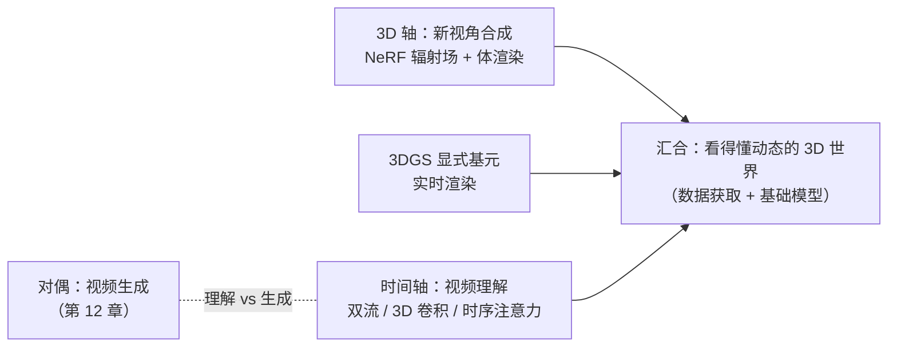
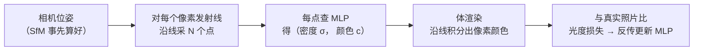
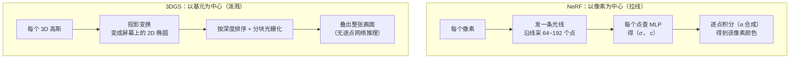
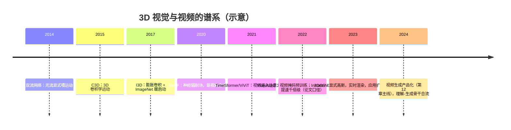

# 进阶专题：3D 视觉与视频

> **一句话理解**：给视觉加上"深度"和"时间"两根轴——NeRF 用一个 MLP 把整个场景的"辐射场"背下来（沿光线积分成像），3DGS 用显式高斯基元把实时渲染拿下，视频理解回答"画面在时间轴上讲了什么故事"——它们与第 12 章的视频生成互为对偶：一边是**看懂世界**，一边是**画出世界**。

[⬆️ 返回总目录](../../../README.md) · [⬆️ 返回本篇](../README.md) · [⬅️ 返回本章目录](./README.md)

| 属性 | 说明 |
|------|------|
| 难度 | ⭐⭐⭐⭐（高阶） |
| 所属分支 | 视觉 |
| 前置知识 | [CNN 卷积神经网络](./01-CNN卷积神经网络.md)、[ViT 视觉 Transformer](./03-ViT视觉Transformer.md)、[进阶专题：视觉前沿](./04-进阶专题-视觉前沿.md)；3D 部分只需高中几何，视频部分建议回顾[注意力机制](../07-自然语言处理与LLM/02-Transformer与注意力机制.md) |

---

## 📌 这一节解决什么问题

前四页的视觉世界是**平面**的：输入是一张图（H×W×3 的像素格），任务是给图打标签、画框、抠掩码。但真实世界多两个轴：**深度**（同一物体换个视角看，像素全变但世界没变）与**时间**（动作、事件、故事都活在帧与帧之间）。本页沿两根轴各走一条主线：

1. **3D 轴：新视角合成（Novel View Synthesis）**——只给你几十张某个场景的照片，要求渲染出**任意新视角**的画面。NeRF（2020）的答案优雅得惊人：不建几何、不贴纹理，用一个 MLP 学下"空间中每个点的颜色与密度"，渲染 = 沿视线积分；3D 高斯泼溅（3DGS，2023）把"隐式网络"换成"几百万个显式小椭球"，把渲染从秒级拉到实时，两年内扩散到仿真、数字人、测绘。本页把两者的数学都讲透（体渲染公式的来龙去脉、位置编码为什么是命门）。
2. **时间轴：视频理解（Video Understanding）**——从"看一张图"到"看一段片子"，多出来的不只是帧数：**动作发生在帧与帧之间**（挥手、投篮、碰撞），逐帧分类再投票会把时序信息全部丢掉。本页捋清"时序维度怎么进网络"的三代方案（双流 / 3D 卷积 / 时序注意力），一句话带过视频检索与时刻定位，并与第 12 章视频生成对上暗号：**理解与生成共享同一批骨干技术，方向相反**。

两根轴在末端汇合：3D 数据从哪来（深度相机 / 多视角 / 单图重建）、视频基础模型走到哪了——为一个"能看懂动态三维世界的机器"补上最后几块图。

## 🌱 通俗理解

四句话先行：

- **NeRF 像"把场景背下来的替身演员"**：给它空间任意一点 (x, y, z) 和一个看的方向，它能答"这个点有多'实在'（密度）、往这个方向看是什么颜色"——把空间中每一点的"实在程度 + 颜色"全背下来，整个场景就装进了一个网络。**渲染 = 沿视线积分**：隔着雾看灯，近处浓雾挡得多、远处透得少，一路的光加起来就是你眼里那个像素的颜色。
- **位置编码像"给坐标装高频脉冲"**：直接喂 (x, y, z) 三个小数，网络天生"先学平滑的、后学抖的"（低频偏置）——场景的大轮廓学得快，纹理、毛发、栅栏这些**高频细节**永远学不动。把坐标先过一遍正弦余弦"变频器"，高频细节才进得了网络的眼。
- **3DGS 像"用几百万个彩色小雾球拼场景"**：每个小椭球有位置、形状、颜色、浓度；"泼溅"（Splatting）= 把这些 3D 小球**拍扁投影到屏幕**上叠出画面——不用像 NeRF 那样每个像素沿光线采几百个点过网络，渲染自然快一个数量级。
- **视频理解像"看戏不看剧照"**：一张剧照看不出"他在挥手还是在遮挡"；动作活在**帧间差异**里。双流网络显式喂"光流"（帧间运动场），3D 卷积让卷积核在时间上也滑动，时序注意力让每一帧直接"回看"前几帧——三条路都是为了让"帧与帧之间"的信息进网络。

## 🗺️ 本页地图



## 📋 举个例子

**沿一条光线手算一次"体渲染"。** 设相机朝某像素发出一条光线，沿途有三个采样点（由近到远），每点的体密度 σ 与颜色 c 如下（密度大 = 这段"雾"浓 = 挡光多）：

| 采样点 | 密度 σ | 颜色 c | 段长 δ |
|---|---|---|---|
| 近处 | 0.1 | 红 (1, 0, 0) | 1 |
| 中段 | **2.0** | 绿 (0, 1, 0) | 1 |
| 远处 | 0.1 | 蓝 (0, 0, 1) | 1 |

三步算出这个像素的最终颜色（公式与推导见板块一深潜）：

1. **每段的不透明度** $\alpha = 1 - e^{-\sigma\delta}$：近处 1−e^(−0.1) ≈ **0.095**，中段 1−e^(−2) ≈ **0.865**，远处 ≈ **0.095**——中段浓雾，光基本被它拦下；
2. **抵达每段时的透射率** T（光还剩多少）：到近处 T=1；穿过近处剩 1×(1−0.095)=**0.905**；再穿过中段只剩 0.905×(1−0.865)=**0.122**——远处那点蓝光再亮，也只能贡献 12% 的存在感；
3. **渲染权重与合成色**：权重 w = T·α = [**0.095, 0.782, 0.012**]，最终颜色 = 0.095×红 + 0.782×绿 + 0.012×蓝 ≈ **(0.10, 0.78, 0.01)**——画面被中段绿雾主导。

> 👉 **人话**：体渲染就是**"隔着几层浓度不同的彩色玻璃看世界"**——每层玻璃按浓度截留一部分光、放行一部分光；你眼里那个像素的颜色，是所有层"截留量 × 颜色"的累加。**前面的浓雾会"吃掉"后面的景色**：这就是为什么渲染要沿光线从近到远算透射率，而不是简单平均。

## 🧠 核心原理

### 板块一：NeRF——把场景学成一个函数

#### 1.1 场景即函数：辐射场的表示

NeRF（Neural Radiance Fields，神经辐射场，Mildenhall 等，2020）的核心一句话：**用一个 MLP 把连续的 5D 坐标映射到颜色与密度**——

$$
(\mathbf{x}, \mathbf{d}) = (x, y, z, \theta, \varphi) \;\longmapsto\; \big(\,\mathbf{c},\ \sigma\,\big)
$$

> 👉 **人话**：输入"空间哪一点 (x,y,z) + 朝哪个方向看 (θ, φ)"，输出"这个点的颜色 c（RGB）和体密度 σ（这点有多'实在'——密度为零就是空，光线穿行无阻；密度大就是实体，光线到此被挡）"。原版用 8 层、256 维的 MLP（论文配置），**一个网络只学一个场景**——几十到几百张带相机位姿的照片，训练到"背下"为止。密度只看位置（一点是否"实在"与你怎么看无关），颜色才看方向（同一面墙正视发亮、斜视发暗——视角效应）。

训练循环四步（自监督，不需要人工标注——"标准答案"就是照片本身）：



#### 1.2 体渲染：连续积分与它的离散化

连续形式的渲染方程（光线 $\mathbf{r}(t) = \mathbf{o} + t\mathbf{d}$）：

$$
C(\mathbf{r}) = \int_{t_n}^{t_f} T(t)\,\sigma\big(\mathbf{r}(t)\big)\,\mathbf{c}\big(\mathbf{r}(t), \mathbf{d}\big)\,dt,
\qquad T(t) = \exp\Big(-\int_{t_n}^{t} \sigma(\mathbf{r}(s))\,ds\Big)
$$

> 👉 **人话**：像素颜色 = 沿光线**积分**"这一段的浓度 × 颜色"，而每段的权重还要乘上 T——**光抵达这里之前已经被前面挡掉了多少**（透射率）。$T(t)$ 里的负指数积分读作："从起点到 t 一路的密度累积越厚，透过的光越少"。这就是"沿光线积分"的人话版：一路走、一路被浓雾吃光，每段按"剩余的光 × 这段的浓度"给像素上色。

<details>
<summary>📐 数学深潜：体渲染的离散化——从定积分到 α 合成的完整推导</summary>

**严格陈述。** 把光线均分成 N 段（$t_n = t_1 < t_2 < \cdots < t_{N+1} = t_f$），第 i 段长 $\delta_i = t_{i+1} - t_i$。在"每段内密度恒为 $\sigma_i$"的近似下，连续积分精确等于离散的 **α 合成（Alpha Compositing）**：

$$
\hat{C} = \sum_{i=1}^{N} T_i\, \alpha_i\, \mathbf{c}_i, \qquad
T_i = \prod_{j=1}^{i-1} (1 - \alpha_j), \qquad
\alpha_i = 1 - \exp(-\sigma_i \delta_i)
$$

**推导（三步）。**

**第一步：段内解出 α。** 段内密度恒为 σ_i，该段对光的"截留比例"由 Beer–Lambert 定律给出：穿过厚度 δ 的介质，透射率是 $e^{-\sigma_i\delta_i}$，被截留的比例因此是 $\alpha_i = 1 - e^{-\sigma_i\delta_i}$——这就是"不透明度"的来历，它把"密度 × 厚度"（连续量）换算成"这段拦下多少光"（概率）。

**第二步：透射率的望远镜积。** 到达第 i 段时的透射率 = 之前所有段放行比例的连乘：$T(t_{i+1}) = \prod_{j \le i} e^{-\sigma_j\delta_j} = \prod_{j\le i}(1-\alpha_j)$——连续形式里 $T$ 的指数积分 $\exp(-\int\sigma)$ 正是乘积 $e^{-\sum\sigma_j\delta_j}$ 的极限（指数把求和变乘积，01 页 CNN 里指数移动平均的老朋友）。

**第三步：黎曼和收敛。** 把权重函数 $T(t)\sigma(t)$ 在每段内看作常数 $T_i \cdot \frac{\alpha_i}{\delta_i}$（由 $\sigma_i = -\ln(1-\alpha_i)/\delta_i$ 段内取主项），定积分变成 $\sum_i T_i \alpha_i$——段越细越接近连续积分。∎

**三个性质（公式自带的行为）。**

1. **权重是一个"分布"**：$\sum_i T_i\alpha_i \le 1$，且沿光线逐段递推时 $T_{i+1} = T_i(1-\alpha_i)$——它是"光子停在每段的概率"，渲染色 = 各段颜色的**期望**。这解释了 NeRF 的一个免费红利：**沿光线的权重分布就是"物体表面在哪"的软估计**（权重最集中的段≈表面），很多后续工作直接拿它做深度图；
2. **不透明极限**：某段 $\sigma \to \infty$ 时 $\alpha \to 1$、其后所有段 $T \to 0$——实体表面后面的一切被"吃光"，硬表面自动遮挡，无需显式求交；
3. **稀疏极限**：$\sigma \to 0$ 时 $\alpha \to 0$，段不存在——空旷区域不贡献，密度为零即可穿过。

**反例与边界。** ① **采样太稀漏薄结构**：一根电线占的立体角极小，64 点/线可能一格都采不到它——原版 NeRF 分层采样（粗网络先估权重分布、细网络按分布加密）就是在治这个病；② **"每段密度恒定"近似**在密度突变处（毛发边缘、半透明边界）引入偏差，段越粗偏差越大——渲染质量与采样数是一对明码标价的矛盾；③ 透射率连乘在长序列上有数值下溢风险，实现里用对数域累加（工程细节，读代码时会看到）。

> 👉 **一句人话总结**：体渲染的离散版 = **"按到达顺序做概率加权平均"**：每段先算拦光概率 α（由密度×厚度），透射率 T 是前面所有段放行的连乘，权重 T·α 构成沿光线的分布——渲染色是这个分布下各段颜色的期望；不透明体自动遮挡、空旷区自动跳过，全部行为都从这三行公式里长出来。

</details>

#### 1.3 位置编码：为什么是命门

直接把 (x, y, z) 三个小数喂进 MLP，NeRF 几乎学不出高频细节。原版的药方：先把坐标"变频"再喂——

$$
\gamma(p) = \big(p,\; \sin(2^0\pi p), \cos(2^0\pi p), \dots, \sin(2^{L-1}\pi p), \cos(2^{L-1}\pi p)\big)
$$

> 👉 **人话**：把一个坐标 p 变成一串**不同频率的波形**（原版 L=10：从波长 2 的慢波到波长极细的快波，论文配置）——相当于把"门牌号"改写成"一组谐波信号"，网络在不同频率的通道里分别找"这一片地区的缓变底色"和"这道栅栏的细条纹"。**为什么不直接喂坐标**是本页最重要的"为什么"之一，值得一次深潜。

<details>
<summary>📐 数学深潜：MLP 的低频偏置——不编码，学不出高频细节</summary>

**严格陈述（谱偏置，Spectral Bias）。** ReLU MLP 拟合目标函数时，**低频成分先学、易学，高频成分后学、难学甚至学不会**（Rahaman 等，2019 的实证规律）。在神经正切核（NTK）视角下可以精确化：训练早期的 MLP 行为近似一个**核回归器**，其核 $k_{\text{NTK}}(x, x')$ 随 $|x - x'|$ 平滑衰减——**一个带宽有限的平滑核，天然是一个低通滤波器**：目标里的高频成分落在核的"通带"之外，回归器的解里几乎不含它们（Tancik 等，2020 的 Fourier Features 论文给出这一论证）。

**推导（核回归为什么是低通——两行）。** 核回归的解是 $f(x) = \sum_i k(x, x_i)\, w_i$：解被限制在"核函数的平移叠加"张成的函数空间里。RBF 核 $\exp(-\frac{(x-x')^2}{2\beta^2})$ 的傅里叶变换仍是高斯 $\propto \exp(-\beta^2\omega^2/2)$——**频率 ω 高于 1/β 量级的成分在基函数里的幅度指数级衰减**，解无论权重怎么学都拼不出高频。带宽 β 就是低通的截止频率。∎

**Fourier 特征为什么治好了它。** 把输入换成 $\gamma(p)$（一组不同频率的正弦余弦）：核在 γ 空间中成为**平移不变核**，其频谱是一组离散的峰（在编码进来的那些频率上）——**通带由编码频率表决定，而不再是网络天生的窄带**。两个后果：① 高频细节进了通带（治好了学不出）；② 通带可控（编码到多高，就能学多高）——这既是能力也是风险。

**小算例（动手试试第 2 段的可跑版本）**：目标函数 $\sin(4x) + 0.4\sin(32x)$（低频底色 + 高频细节）。用固定带宽 0.25 的 RBF 核回归（模拟 MLP 的平滑先验）：对完整目标的误差 0.225，对"只剩低频"的目标误差仅 0.060——**它几乎完美学了低频、彻底丢了高频**。同样的数据换成"位置编码 + 线性回归"（频率表 1~32）：误差降到 0.0000——**线性模型 + 对的频率通道，吊打平滑先验的核回归**。高频不是学不动，是"裸坐标 + 平滑先验"的组合学不动。

**反例与边界。** ① **编码过高频会翻车**：频率表超过数据能支撑的精细度时，网络开始**用高频通道拟合噪声与锯齿**（走样/过拟合的时序版）——L 不是越大越好，原版 L=10 是配合场景尺度选的；② 谱偏置不是纯缺点：第 04 页 SAM 的图像编码器、DINO 的冻结特征受益于"先学低频语义"的归纳偏置——**同一个先验，在分类任务是美德，在逐点回归任务是枷锁**；③ 后续演化：mip-NeRF 用"区间化的多频编码"抗走样、Instant-NGP 用**多分辨率哈希编码**替代手工频率表（可学习的频率查找表，把逐场景训练从小时级压到秒~分钟量级——论文口径），思想都是"给高频开可控的通道"。

> 👉 **一句人话总结**：MLP 天生带"先学平滑"的偏置（核视角下是一个带宽有限的低通滤波器），裸坐标喂进去，栅栏、毛发这类高频细节永远在通带外；位置编码 = 把坐标搬到一组**频率明确的波形通道**上，通带由频率表说了算——NeRF 没有位置编码就只剩"一团糊"，这不是工程 trick，是表示论层面的必需品。

</details>

### 板块二：3D 高斯泼溅——显式基元的实时反击

#### 2.1 从"隐式网络"到"显式基元"

3DGS（3D Gaussian Splatting，Kerbl 等，2023）的表示彻底换了路线：**不用网络表示场景，直接用一组可优化的 3D 高斯基元（椭球状"彩色小雾球"）**。每个高斯自带五件属性：

| 属性 | 含义 | 类比 |
|------|------|------|
| 位置 μ（3 个数） | 椭球中心在哪 | 小球挂哪 |
| 协方差 Σ（形状参数） | 椭球三根轴的长短与朝向 | 小球拍扁拉长的方向 |
| 不透明度 α | 浓度 | 雾球多浓 |
| 球谐系数（SH） | 颜色（随视角变化，与 NeRF 的方向依赖颜色同源） | 正面看红、侧面看紫的珠光漆 |

训练与 NeRF 同款自监督（渲染 vs 照片），但渲染算子换了：**泼溅（Splatting）**——把每个 3D 高斯用投影变换**拍扁成屏幕上的 2D 椭圆**（透视投影的仿射近似），再按深度排序做 α 合成（板块一深潜的同一套公式，只是从"沿光线积分"换成"把基元投影过来叠"）。加上**自适应密度控制**（哪里误差大就分裂/克隆高斯、哪里透明就剪枝），从 SfM 稀疏点云出发长出百万级高斯。

#### 2.2 为什么快：两条路线的物理账

NeRF 渲染一帧，每个像素要沿光线采几十到上百个点、**每个点过一遍 MLP**——原版在单卡上渲染一帧是秒到几十秒量级（原论文报告口径），离实时很远（后续 Instant-NGP 等把训练与渲染都提速了一到两个数量级，论文口径）。3DGS 把每个高斯**一次性投影**到屏幕：没有逐点 MLP 推理、没有逐点体积积分，只有"投影 + 排序 + 合成"的规则计算，配合分块（tile）并行光栅化——论文报告在 1080p 分辨率下达到实时帧率（百帧级）、单场景训练分钟到几十分钟量级（论文口径），**训练与渲染同时快了一个数量级上下**。

| | NeRF（隐式） | 3DGS（显式） |
|---|---|---|
| 场景表示 | 一个 MLP：连续函数，任意点可查 | 百万级高斯基元：离散列表 |
| 渲染方式 | 逐像素光线采样 + 逐点 MLP + 积分 | 基元投影（splatting）+ 排序 α 合成 |
| 渲染速度 | 慢（原版秒级/帧；改进版可实时预览，均论文口径） | **实时**（1080p 百帧级，论文口径） |
| 训练 | 逐场景数小时（原版）；Instant-NGP 类压到秒~分钟 | 分钟到几十分钟 |
| 可编辑性 | 差（隐在权重里，删一个物体要重训或蒸馏） | **好**（高斯是显式对象：删、搬、复制都是列表操作——数字人/场景编辑的工程红利） |
| 存储 | 网络权重（MB 级） | 百万高斯参数（大场景到百 MB~GB 级，需压缩） |
| 擅长 | 光滑反射、雾、复杂半透明（连续函数的天然强项） | 硬表面、锐利边缘、实时交互 |
| 典型坑 | 稀疏视角下"浮雾"（训练不充分区域的伪密度） | 高斯数爆炸（不剪枝）、镜头外高斯飞出、反光/透明物 |

两条渲染管线并排画一张图，"逐点查询"与"逐基元投影"的差别一目了然：



<details>
<summary>🧮 展开：泼溅的投影数学——3D 高斯怎么变成屏幕上的 2D 椭圆</summary>

透视投影是非线性的（除以深度），但**对一个足够小的区域做一阶近似**（局部仿射近似）后，"3D 高斯 → 2D 高斯"有闭式解：设相机的投影函数在均值 μ 处的雅可比为 J、视变换矩阵为 W，则屏幕上那个 2D 椭圆的中心是 μ 的投影，协方差为

$$
\Sigma' = J\,W\,\Sigma\,W^{\!\top} J^{\!\top}
$$

> 👉 **人话**：**高斯经过线性变换还是高斯**（正态分布的封闭性，概率课的老朋友在这里上班）——把"椭球的形状"Σ 左乘右乘投影的线性部分，直接得到"屏幕上椭圆的形状"Σ'，一次矩阵乘法搞定，不用逐点采样。这就是泼溅快得动的数学根基：**隐式方法要"问空间每一点"，显式方法只需"把每个基元搬上屏幕"**；代价是这个一阶近似在广角/近处会失真（椭球投影成"香蕉"时仿射近似不再贴），超广角镜头是泼溅的已知弱区。

**顺带一句可微性**：J、W、Σ 都对高斯参数可导，渲染误差的梯度能一路流回"椭球挂哪、长什么样、多浓"——3DGS 的训练正是靠这个可微渲染闭环（与 NeRF 的可微积分同宗，与第 12 章可微采样器是同一思想家族）。

</details>

> 👉 **人话**：NeRF 把场景**背进网络**（隐式、连续、慢而优雅），3DGS 把场景**摆成乐高**（显式、离散、快而直接）——"隐式换质量的上限、显式换速度与可控性"，这不是谁取代谁，而是**表示的光谱两端**；2026 年的工程现实是：要实时交互（数字人、仿真、数字孪生）默认 3DGS 起步，要特殊观感（复杂半透明、光滑反射）NeRF 系仍有主场。

#### 2.3 共同的地基与共同的软肋

两条路线都站在同一块地基上：**SfM 相机位姿**（多视角照片先过 COLMAP 一类软件解出每张照片的相机位置与朝向——板块四展开），以及**可微渲染**（渲染对参数可求导，梯度才能从"渲染误差"流回场景参数——与第 12 章扩散模型"从损失回传到噪声"同属"可微生成管线"思想）。软肋也共享：**稀疏视角**（照片少、角度窄）下都容易长伪影；**反光、透明、薄结构**是两条路线共同的难例；**动态场景**（东西在动）需要各自的 4D 扩展（时空高斯、动态 NeRF），是活跃前线。

<details>
<summary>🧮 展开：SfM 到底算了什么——"光束法平差"的一句话版</summary>

NeRF/3DGS 的输入照片要配"每张照片从哪拍的"（相机位姿），这组位姿由**运动恢复结构（Structure from Motion, SfM）**从照片堆里解出来。流程四步（COLMAP 的骨架）：

1. **特征点**：每张照片提局部特征并配描述子（03 页 ViT 之前时代的经典手工/学习特征）；
2. **特征匹配**：不同照片里的描述子互相匹配，得到"这个点在照片 A 的 (x₁,y₁)、在照片 B 的 (x₂,y₂)"——一对**二维对应**；
3. **增量重建**：从两张照片的对应点解出相对位姿（对极几何），逐张加入新照片、三角化出特征点的**三维坐标**（两条视线求交点）；
4. **光束法平差（Bundle Adjustment）**：把"所有相机位姿 + 所有点坐标"当联合变量，最小化"投影回去与照片观测的总体重投影误差"——一个大稀疏非线性最小二乘。

> 👉 **人话**：SfM = **"从'同一个点在不同照片的落点'反推'每张照片从哪拍'与'每个点在空间哪'"**——鸡生蛋问题的解法是"先粗猜、再整体最小二乘拧到最贴合"。它决定了新视角合成的原料上限：位姿解不准，NeRF 的光线发射方向就是歪的——"浮雾"类失败的第一排查项永远是 SfM 重投影误差。

</details>

### 板块三：视频理解——让时序进网络

#### 3.1 时序维度怎么进网络：三代方案

逐帧分类再投票是"看剧照猜剧情"——动作信息活在帧间。三代方案各给出"时序怎么进网络"的一种答案：

| 代际 | 代表 | 时序怎么进网络 | 代价 |
|------|------|---------------|------|
| **双流网络**（Two-Stream，2014） | Simonyan & Zisserman | 显式运动信号：空间流看单帧（RGB），时间流看**光流**（连续帧间每个像素的运动向量场，堆叠若干帧当多通道输入），两流各算各的最后融合 | 光流要预先逐帧计算，昂贵；光流本身在慢动作、镜头切换处失效 |
| **3D 卷积**（C3D 2015 / I3D 2017） | 3D 卷积核 | 卷积核从 H×W 扩成 **T×H×W**，在时间与空间一起滑动——运动特征端到端学，不再依赖手工光流 | 参数与计算量按时间维暴涨；I3D 的"膨胀 2D 卷积"（把预训练 2D 核inflate 成 3D）用 ImageNet 权重暖启动，是当时的工程巧招 |
| **时序注意力**（TimeSformer / ViViT / Video Swin，2021 前后） | Transformer 系 | 视频切成**时空 patch**（帧 × 空间块），任意两 patch 直接注意力——"哪两帧相关"由数据学，长程依赖一步直达；分工策略（空间注意力帧内做、时间注意力帧间做）把 O((THW)²) 的账单拆小 | 数据与算力饥渴；但它是**视频基础模型**的骨干形态（与 03 页 ViT 同构：图变 token，视频=更长的 token 序列） |

> 👉 **人话**：双流把"运动"手工算好喂给网络（省事但死板）；3D 卷积让网络自己学运动（灵活但贵）；时序注意力干脆宣布"没有固定的时序配方，哪两帧该看彼此，注意力权重现学"——与 NLP 里 RNN → Transformer 的换代逻辑一模一样（第 6 章 03 页同一出戏的视频版）。

<details>
<summary>🧮 展开：光流是什么——双流网络的"时间流"吃的是什么</summary>

光流（Optical Flow）= **每个像素在相邻两帧之间的运动向量场**：第 t 帧的像素 (x, y) 在第 t+1 帧跑到了 (x+u, y+v)，全体像素的 (u, v) 就是光流。它由"亮度恒常假设"解出：假设同一点亮度不变，则 $I(x, y, t) = I(x+u, y+v, t+1)$，一阶泰勒展开得经典的**光流约束方程** $I_x u + I_y v + I_t = 0$——一个方程两个未知数（病态），经典算法（Lucas–Kanade 一类）靠"邻域内运动相似"的附加假设补齐。

> 👉 **人话**：光流 = 给每个像素装一个"刚才往哪动了"的箭头。挥手时手部区域一大片箭头同向摆动，镜头平移时全图箭头齐刷刷——**动作的指纹就刻在这些箭头场的形态里**，这正是双流网络"时间流"输入的形态。它的两个死穴也由此而来：亮度恒常假设在光照突变处崩（阴影扫过 = 箭头乱指）；"邻域运动相似"在镜头切换处崩（两段无关画面的箭头场是噪声）——双流网络的失败模式速查里那两条，病根都在光流的假设上。

</details>

三代方案的时间线并排看（含 3D 侧的参照）：



#### 3.2 视频检索与时刻定位：一句话各定位

- **视频检索（Text-Video Retrieval）一句话**：把视频与文本嵌入同一向量空间按相似度排序（CLIP 式对比训练的视频版，CLIP4Clip 一类）——本质是第 8 章"双塔 + 向量召回"在视频侧的投影，检索的是"整段视频"；
- **时刻定位（Moment Retrieval / Temporal Grounding）一句话**：给一段长视频和一句自然语言（"他投篮命中的那一刻"），定位出匹配的时间段——检索的粒度从"整段"细化到"哪几秒"，难点是候选时间段的数量随视频长度平方级增长（起点 × 终点）。

一个 30 秒的短视频就能看清这个平方账：把时间轴切成 1 秒的格子，候选时间段（起点， 终点）有 $30 \times 31 / 2 = 465$ 个；换成 10 分钟的视频（600 格），候选涨到 $600 \times 601/2 \approx 18$ 万——**对每个候选都算一次"与 query 匹配度"的暴力法，复杂度随时长平方爆炸**。主流解法因此转向"先定位再回归"（模型直接输出起止点）或"锚点 + 偏移"（只在少数锚点上展开），思路与第 2 页检测任务里"从滑动窗到 anchor 再到直接回归"的演进完全同构——**检测的教科书在时间轴上重演了一遍**。


#### 3.3 与第 12 章视频生成的对偶关系

本页与[第 12 章视频生成](../../5-前沿与融合/12-生成模型与多模态/06-进阶专题-生成模型前沿.md)是一枚硬币的两面：

| | 视频理解（本页） | 视频生成（第 12 章） |
|---|---|---|
| 方向 | 视频 → 表示/标签/文本（**编码**） | 文本/噪声 → 视频（**解码**） |
| 骨干 | 时空 patch + 注意力（TimeSformer 一类） | 时空 patch + 注意力（DiT 一类）——**同款** |
| 预训练配方 | 掩码重建（VideoMAE 一类：遮住大部分时空块学着补） | 扩散去噪 / 自回归下一 token——**同族**（都是"自监督补全"） |
| 评估 | 检索召回、动作识别精度 | 生成质量与一致性（人评为主） |

> 👉 **人话**：**理解与生成正在共用同一副骨架**（视频 token 化 + 注意力 + 补全式预训练），差别只在"往哪个方向补"——理解是"看着残缺的视频补语义"，生成是"看着文本补像素"。这也是"世界模型"叙事（第 12 章[前沿地图](../../5-前沿与融合/12-生成模型与多模态/05-前沿技术地图.md)）的支点：能生成"物理上讲得通"的视频，被论证为"看懂了世界动力学"的证据——反方观点（画得像 ≠ 懂规律）那边也记了一笔，两页对着读。

### 板块四：3D 数据从哪来

三条主流来路，一句话各定位（新视角合成的"原料关"）：

| 来路 | 一句话 | 适用与坑 |
|------|--------|---------|
| **深度相机（RGB-D）** | 结构光/ToF 直接量每像素深度（手机人脸识别、扫地机器人同款传感器） | 室内近距为主；户外强光下结构光失效；深度噪声随距离涨 |
| **多视角照片（SfM/MVS）** | 从一堆无标注照片解出相机位姿并重建稀疏/稠密几何（COLMAP 是标准工具）——NeRF/3DGS 的标准前置 | 要"绕着拍"（视角覆盖不足 = 稀疏视角伪影）；大场景重建算得慢 |
| **单图重建** | 单张图估深度/几何——病态问题（一张图对应无限多个 3D 世界），靠**学出来的先验**兜底（单目深度估计模型，MiDaS 一类是代表） | 精度与可信度天然低于多视角；但只需一张图，成本低到可以批量化 |

> 👉 **人话**：深度相机是"用尺子量"（准但够不着远处）、多视角是"绕着看算出来的"（NeRF 的家常饭）、单图是"凭经验猜的"（快但靠先验）——三条路的价格与可信度严格同向，生产里常常混着用：单图先估个粗的、多视角精修、深度相机对关键区域钉死。

采集的工程实务三条经验（经验参考）：

- **视角覆盖比张数重要**——同一角度拍一百张不如绕场三圈拍六十张（SfM 要的是"同一批点出现在尽量多的视角里"，覆盖不足直接导致稀疏视角伪影）；
- **曝光与白平衡锁定**——自动曝光会让同一面墙在不同照片里颜色漂移，光度损失被相机设置绑架；
- **先小样后全量**——先拍十分之一的照片跑通全流程（SfM → 训练 → 渲染检查），确认覆盖与质量再投入全量采集，比"拍完两周才发现相机漂了"便宜太多。

## 🩺 失败模式速查（何时不 work）

| 症状 | 病因 | 诊断 | 补救 |
|------|------|------|------|
| NeRF 渲染出"浮雾"与糊面 | 视角稀疏/位姿不准，训练不充分区域长伪密度 | 看 SfM 重投影误差与照片覆盖图（哪里没被拍到） | 补拍覆盖；位姿联合优化（bundle adjustment 类）；上 mip-NeRF 类抗走样改进 |
| 3DGS 高斯数爆到训练不动 | 密度控制阈值太松，误差靠"到处分裂"硬吃 | 监控高斯数量曲线：异常单调暴涨即失控 | 收紧分裂/克隆阈值；周期性剪枝；限制每屏最大高斯数 |
| 3DGS 从新视角看出现"飞出的碎片" | 深度歧义区域（反光/纯色墙面）高斯漂移到镜头外空间 | 从训练视角之外的视角渲染检查 | 正则化（深度先验、不透明度退火）；这些区域补拍几张照片往往最有效 |
| 双流模型在慢动作/镜头切换处崩 | 光流假设"帧间小位移、同一场景"，两条都被违反 | 查时间流输入的光流可视化：切换处是噪声场 | 换 3D 卷积/时序注意力路线；或镜头切分预处理 |
| 视频分类模型换数据集掉点严重 | 竞技体育/网图类目占比过高，时序先验偏科 | 用错误样本的类目分布做透视：集中即偏科 | 用 VideoMAE 类预训练权重微调；补目标域数据；评估按类目分层 |
| 时刻定位输出时间段乱跳 | 候选段之间独立打分，无时序一致性约束 | 可视化分数随时间的曲线：锯齿状即缺平滑 | 加时序平滑/非极大抑制；改为直接回归起止点的模型 |

## 🧭 开放问题（批判视角）

- **隐式与显式之争没有终点**：隐式表示（连续、压缩、可微性好）与显式基元（快、可编辑、可规模化）的取舍在图形学里打了几十年，NeRF vs 3DGS 只是最新一轮——混合表示（哈希网格 + 高斯、显式基元 + 神经特征）正在把两端缝起来，"哪个赢"可能本身是错的问题。
- **长视频理解的结构缺口**：注意力按 token 数平方收费，一小时视频的 token 数远超任何上下文窗口——"分层的记忆与检索"（先检索相关片段再细看）正在成为共识方案，但分层怎么学、记忆怎么更新，没有定论；这一缺口与第 7 章 RAG 的"外挂知识库"思路惊人同构（视频理解也需要自己的检索增强）。
- **"画得像 = 看得懂"的边界**：视频生成模型能产出流畅画面，是否等于理解了物理与因果——第 12 章前沿地图的"世界模型"之争直接牵动本页：**生成侧的基准分数不能替代理解侧的评估**，两个方向的模型能力不对等是常态（能画马的不一定能数清几条腿）。

## 🔬 SOTA 演进（2023–2026）

- **3DGS 的应用扩散（一句话级）**：从新视角合成的"算法题"迅速扩散为工程标准件——仿真与数字孪生的实景重建、数字人/虚拟主播的实时渲染、测绘与实景三维（reality capture）、自动驾驶场景重放（把路测数据重建成可复现的 3D 场景）都出现了 3DGS 方案（公开论文与工程报告层面扩散明显）；压缩与动态（4D）扩展是 2024–2026 的主线演化。
- **视频理解基础模型（一句话级）**：VideoMAE 一类"掩码重建预训练 + 下游微调"成为视频侧的标配配方，视频-文本对比与视频 LLM（把视频 token 喂进多模态大模型问答）是两条并行的能力主线——视频正在重演图像走过的"预训练 + 基础模型化"剧本（第 04 页 SAM/MAE 的视频版）。

## 💻 动手试试

```python
import numpy as np

# ============ 1) 体渲染离散版：沿光线做 alpha 合成（本页例子的可跑版） ============
sigma = np.array([0.1, 2.0, 0.1])                    # 三个采样点的体密度（中段浓雾）
colors = np.array([[1, 0, 0], [0, 1, 0], [0, 0, 1]], dtype=float)  # 红/绿/蓝
delta = 1.0                                          # 每段长度

alpha = 1.0 - np.exp(-sigma * delta)                 # 每段拦下光的概率
T = np.cumprod(np.concatenate([[1.0], 1.0 - alpha[:-1]]))  # 抵达各段时的透射率
w = T * alpha                                        # 各段渲染权重（和 <= 1，是个分布）
C = w @ colors                                       # 渲染色 = 期望颜色

print("各段不透明度 alpha:", np.round(alpha, 3))
print("抵达各段透射率 T:", np.round(T, 3))
print("渲染权重 w:", np.round(w, 3), "（和 = %.3f）" % w.sum())
print("像素颜色 RGB:", np.round(C, 3))

# 预期输出：
# alpha: [0.095 0.865 0.095]
# T:     [1.    0.905 0.122]   —— 中段浓雾后，光只剩 12%
# w:     [0.095 0.782 0.012]（和 = 0.889）
# RGB:   [0.095 0.782 0.012]   —— 中段绿雾主导
# 读法：三行代码就是 NeRF 渲染一个像素的全部数学——
# 网络学的是 sigma 和 c，渲染算子（这三行）把"场"变成"图像"。

# ============ 2) 位置编码为什么必需：低频偏置的最小演示 ============
def target(x):                                       # 低频底色 + 高频细节（= 纹理/边缘）
    return np.sin(4 * x) + 0.4 * np.sin(32 * x)

X = np.linspace(-1, 1, 200)[:, None]; y = target(X).ravel()
Xte = np.linspace(-1, 1, 500)[:, None]; yte = target(Xte).ravel()
low_only = np.sin(4 * Xte).ravel()

# A：固定核宽的 RBF 核岭回归 —— 当"MLP 一阶近似"（NTK 视角：平滑先验 = 低通）
def kernel_pred(band):
    K = np.exp(-((X.ravel()[:, None] - X.ravel()[None, :]) ** 2) / (2 * band ** 2))
    Kte = np.exp(-((Xte.ravel()[:, None] - X.ravel()[None, :]) ** 2) / (2 * band ** 2))
    return Kte @ np.linalg.solve(K + 1e-6 * np.eye(len(y)), y)

pA = kernel_pred(0.25)
print("\nA 核回归（≈MLP 低频偏置）：拟完整目标 MAE = %.3f | 拟『只剩低频』MAE = %.3f"
      % (np.abs(pA - yte).mean(), np.abs(pA - low_only).mean()))

# B：位置编码 + 线性回归 —— 频率表 1~32，高频进了"通带"
def pos_enc(x, Kmax=5):
    return np.concatenate([np.sin((2.0 ** k) * x) for k in range(Kmax + 1)]
                          + [np.cos((2.0 ** k) * x) for k in range(Kmax + 1)], axis=1)

F, Fte = pos_enc(X), pos_enc(Xte)
w = np.linalg.solve(F.T @ F + 1e-4 * np.eye(F.shape[1]), F.T @ y)
print("B 位置编码 + 线性回归：拟完整目标 MAE = %.4f（高频 32x 也拟住了）"
      % np.abs(Fte @ w - yte).mean())

# 预期输出：
# A 核回归（≈MLP 低频偏置）：拟完整目标 MAE = 0.225 | 拟『只剩低频』MAE = 0.060
# B 位置编码 + 线性回归：拟完整目标 MAE = 0.0000（高频 32x 也拟住了）
# 读法：A 对"只剩低频"的目标几乎完美（0.060），对完整目标差 0.225 ——
# 它不是学得慢，是"平滑先验"这个低通滤波器根本不允许高频进解；
# B 只换了输入表示（同样的数据、更简单的模型），误差归零 ——
# NeRF 的位置编码不是 trick，是把"通带"从网络先验手里交还给频率表。

# ============ 改什么，看什么变化 ============
# - 把 sigma 中段从 2.0 改成 10.0：alpha -> 1，第三段权重 -> 0 —— 不透明体的"自动遮挡"；
# - 把 kernel_pred 的 band 从 0.25 改成 0.02：A 也能拟住高频——
#   "足够窄的核"就是"足够高频的编码"，两种解法在极限下殊途同归
#   （但 band 太窄 = 每个 training 点自扫门前雪 = 过拟合噪声，打印 A 对 yte 的 MAE 看它先降后升）；
# - 把 pos_enc 的 Kmax 从 5 降到 2（频率表只到 8）：B 的 MAE 回升到 0.2 上下——
#   频率表没覆盖的频段，编码了也白编（通带由频率表决定）。
```

## 🔥 炼丹小灶

> 🔥 **炼丹小灶**：工业界常用起点配方与玄学——
> - 配方：3DGS 用官方实现起步（SfM 用 COLMAP，先跑通一个中等场景再谈定制）；NeRF 系直接上 Instant-NGP 类实现（哈希编码是默认选项，原版 NeRF 只作教学）。视频理解微调从 VideoMAE 类预训练权重起步（8~16 帧输入、ImageNet/视频双预训练权重对比着选）；动作识别小数据先冻结骨干只训头。
> - 玄学：3DGS 高斯数暴涨 → 先收紧克隆/分裂阈值再怀疑实现；NeRF 训练糊 → 九成是位姿或视角覆盖问题，不是网络；视频模型不涨 → 检查帧采样策略（均匀抽 8 帧会跳过动作关键帧，密集采样或时序增广常有奇效）。
> - ⚠️ 以上是经验参考值，不是圣旨；换数据集请重新炼。

## 🖱️ 动手玩

> 🎮 **本库实验场**：[卷积核滑动可视化](../../../playground/conv.html)——3D 卷积只是把"核滑动"从平面加了一根时间轴，先看懂 2D 的滑动，再想象同样的核扫过一叠帧；[注意力热力图](../../../playground/attention.html)——时序注意力的"哪两帧在互相看"，权重矩阵直接可视化。
> 🕹️ **延伸玩一玩**：[Transformer Explainer](https://poloclub.github.io/transformer-explainer/)——视频时空 patch + 注意力与 NLP 的注意力同构，交互拆一遍编码器，"视频 = 更长的 token 序列"这句话会落地。

## 🔗 在知识树中的位置

- **上游**：[CNN 卷积神经网络](./01-CNN卷积神经网络.md)（3D 卷积是卷积的时间扩展；卷积核滑行的直觉在本页回收）、[ViT 视觉 Transformer](./03-ViT视觉Transformer.md)（patch 化 + 位置编码——视频时空 patch 与 NeRF 位置编码是同一招的两次出手）、[进阶专题：视觉前沿](./04-进阶专题-视觉前沿.md)（自监督与基础模型——视频基础模型是同一剧本的重演）。
- **下游**：本章[生产实战](./99-生产实战.md)（视觉项目从 0 到 1 的工程纪律——3D/视频项目同样适用）。
- **横向对比**：[第 12 章视频生成](../../5-前沿与融合/12-生成模型与多模态/06-进阶专题-生成模型前沿.md)——理解 vs 生成的对偶（共享骨干、方向相反）；[第 12 章前沿地图](../../5-前沿与融合/12-生成模型与多模态/05-前沿技术地图.md)——"世界模型"之争的两侧论据；[第 6 章序列建模](../06-时间序列/03-现代时间序列模型.md)——"时序进网络"从 RNN 到注意力的同构进化。

## ⚠️ 常见误区

- **误区一**："3DGS 全面取代了 NeRF" → 两端各有主场：实时交互与可编辑是显式基元的地盘，复杂半透明、光滑反射、压缩表示里隐式函数仍在；谱系是光谱不是淘汰赛（Instant-NGP 类把隐式也提速了）。
- **误区二**："位置编码是实现细节" → 它是表示层面的必需品：MLP 的平滑先验（核视角下的低通滤波器）把高频挡在通带外，不换表示、换再大的网络也只能学到"一团糊"——动手试试第 2 段 0.225 → 0.0000 的对比就是证据。
- **误区三**："视频理解 = 逐帧分类再投票" → 动作信息活在帧间，逐帧模型结构性地看不见它；三代方案（双流/3D 卷积/时序注意力）解决的都是"帧间信息怎么进网络"。
- **误区四**："体渲染就是加权平均" → 权重不是拍的，是**沿光线按"透射率连乘 × 段不透明度"算出来的概率分布**——前面的浓雾吃掉后面的景色（自动遮挡），空旷区自动跳过；简单平均做不到这两点。
- **误区五**："能生成视频 = 能理解视频" → 生成与理解共享骨干但能力不对等（能画马的不一定数得清腿）；世界模型叙事的证据之争（第 12 章前沿地图）提醒：两个方向的评估不能互相冒充。
- **误区六**："3D 数据就是要买深度相机" → 多视角照片 + SfM 是新视角合成的标准来路（一部手机绕着拍即可），深度相机只在"室内近距 + 要绝对深度"时不可替代；单图重建则把门槛降到"一张图"——按任务选来路，不是按设备档次。

## 📝 小结与自测

**要点回顾**

- NeRF：场景 = 函数，MLP 学 (x,y,z,θ,φ)→(c,σ)；渲染 = 沿光线积分，离散化为 α 合成 $\hat{C}=\sum_i T_i\alpha_i c_i$（$T_i=\prod_{j<i}(1-\alpha_j)$ 是透射率连乘）——权重是沿光线的概率分布，不透明体自动遮挡、空旷区自动跳过；逐场景训练、自监督（渲染 vs 照片）。
- 位置编码是命门：ReLU MLP 有低频偏置（核视角：带宽有限的低通滤波器），裸坐标学不出高频细节；γ(p) 的多频正弦余弦把"通带"交给频率表——编码不足一团糊、编码过频拟合噪（L 要配场景尺度）。
- 3DGS：显式高斯基元（位置/协方差/不透明度/球谐颜色）+ 泼溅光栅化（投影成 2D 椭圆 + 排序合成）+ 自适应密度控制；比 NeRF 快一个数量级上下（1080p 实时、训练分钟级，论文口径）且可编辑；存储更大、反光透明仍是难例——隐式与显式是光谱两端，不是淘汰赛。
- 视频理解：时序进网络的三代——双流（手工光流，快但死板）、3D 卷积（端到端学运动，贵）、时序注意力（时空 patch，配方现学，视频基础模型的骨干）；检索 = 整段嵌入排序（双塔的视频版），时刻定位 = 找"哪几秒"（候选段平方增长）；与第 12 章视频生成共享骨干、方向相反（编码 vs 解码）。
- 3D 数据三条路：深度相机（准但近）、多视角 SfM（NeRF/3DGS 标配前置，要"绕着拍"）、单图重建（便宜但靠学出来的先验）——价格与可信度同向，生产常混用；采集实务铁律：视角覆盖优先于张数、曝光锁定、先小样跑通再全量。
- 失效边界速记：稀疏视角长浮雾（先查 SfM 与覆盖）、3DGS 高斯数失控（收紧分裂阈值）、反光/透明/薄结构是两条路线共同难例、光流在慢动作与镜头切换处失效——先诊断"物理与数据"，再怀疑模型。

**自测一下**（点击展开答案）

<details>
<summary>问题 1：写出体渲染的离散公式，并解释为什么"前面的浓雾吃掉后面的景色"。</summary>

$\hat{C}=\sum_{i=1}^{N} T_i\alpha_i\mathbf{c}_i$，其中 $\alpha_i=1-e^{-\sigma_i\delta_i}$（段不透明度）、$T_i=\prod_{j<i}(1-\alpha_j)$（透射率连乘）。第 i 段的权重是"光抵达这里还剩多少 × 这段拦下多少"——前面任何一段的 α 都按乘法进入后面所有段的 T：中段 α=0.865 意味着其后所有段的权重先被乘以 0.135。遮挡不是后处理规则，是连乘结构的自然结果。

</details>

<details>
<summary>问题 2：不给位置编码，NeRF 会怎样？为什么？给一个能跑的证据。</summary>

只能学出模糊的大轮廓，高频细节（纹理、栅栏、毛发）系统性缺失。原因：ReLU MLP 的低频偏置——核视角下训练近似一个带宽有限的核回归（低通滤波器），高频成分在"基函数"里幅度指数衰减，解里拼不出来。证据（动手试试第 2 段）：固定核宽 0.25 的核回归拟 sin(4x)+0.4sin(32x)，对"只剩低频"的目标误差 0.060、对完整目标 0.225——高频被通带整体滤掉；同样数据换位置编码 + 线性回归，误差 0.0000。

</details>

<details>
<summary>问题 3：3DGS 为什么比 NeRF 快一个数量级？代价是什么？</summary>

NeRF 渲染要逐像素沿光线采样几十上百点、每点过一遍 MLP 再积分；3DGS 把每个高斯一次性投影成屏幕上的 2D 椭圆（泼溅），只剩"投影 + 排序 + α 合成"的规则计算，可分块并行——没有逐点网络推理。代价：显式列表的存储大（百万高斯，大场景百 MB~GB 级），需要压缩；密度控制不稳时高斯数爆炸；反光/透明物仍是难例。换来的还有可编辑性（高斯是显式对象，可删可搬）。

</details>

<details>
<summary>问题 4：双流、3D 卷积、时序注意力各自怎么让"帧间信息"进网络？各自的账单？</summary>

双流：把帧间运动手工算成光流场当额外输入通道——省了学习但光流贵且在慢动作/镜头切换处失效；3D 卷积：卷积核扩成 T×H×W，时空一起滑——运动端到端学，但参数与计算按时间维暴涨（I3D 用膨胀卷积 + 图像预训练暖启动省一笔）；时序注意力：视频切时空 patch，任意两 patch 直接打分——"看哪两帧"由数据学、长程依赖一步直达，但要吃数据和算力，是视频基础模型的骨干。

</details>

<details>
<summary>问题 5：视频理解与第 12 章视频生成"互为对偶"体现在哪两点？哪里不对偶？</summary>

对偶一：方向——理解是视频→表示/文本（编码），生成是文本/噪声→视频（解码）；对偶二：骨干——两边都收敛到"时空 patch + 注意力 + 补全式预训练"（理解侧 VideoMAE 掩码重建，生成侧扩散去噪/自回归下一 token），是同一副骨架往两个方向用。不对偶：能力不互通——生成的流畅不等于理解的准确（"画得像 ≠ 懂规律"，世界模型之争的反方论据），评估体系也完全不同（检索/识别指标 vs 生成质量人评）。

</details>

<details>
<summary>问题 6：给一个"手边只有手机"的采集任务，三条 3D 数据来路怎么选？</summary>

要重建一个小物体/房间且能绕着拍：多视角照片 + SfM（COLMAP）——NeRF/3DGS 的标准路线，成本是"认真绕拍一圈"；要深度准、室内近距、有 RGB-D 设备：深度相机直接量（户外强光注意结构光失效）；只能拿到单张/少量照片（老照片、网上素材）：单图重建——靠学出来的深度先验估几何，快但可信度最低，只当粗坯。生产常混用：单图出粗坯、多视角精修、深度相机对关键区域钉死。

</details>

## 📚 延伸阅读

- 论文：Mildenhall et al., *NeRF: Representing Scenes as Neural Radiance Fields for View Synthesis*（2020）；Müller et al., *Instant Neural Graphics Primitives with a Multi-resolution Hash Encoding*（Instant-NGP, 2022）
- 论文：Kerbl, Kopanas, Leimkühler & Drettakis, *3D Gaussian Splatting for Real-Time Radiance Field Rendering*（2023）
- 论文：Rahaman et al., *On the Spectral Bias of Neural Networks*（2019，低频偏置）；Tancik et al., *Fourier Features Let Networks Learn High Frequency Functions in Low Dimensional Domains*（2020，位置编码的核视角）
- 论文：Simonyan & Zisserman, *Two-Stream Convolutional Networks for Action Recognition*（2014）；Carreira & Zisserman, *Quo Vadis, Action Recognition?*（I3D, 2017）；Bertasius et al., *Is Space-Time Attention All You Need for Video Understanding?*（TimeSformer, 2021）；Tong et al., *VideoMAE*（2022）
- 工具：COLMAP（SfM/MVS 标准工具）、3DGS 与 Instant-NGP 官方开源仓库（均有预置场景，克隆即可渲染）；综述可搜 "3D gaussian splatting survey" / "video understanding survey"
- 交互： Nerfstudios（社区维护的 NeRF/3DGS 训练框架，文档带可视化教程）与 3DGS 官方仓库的预渲染结果视频——亲眼看一次"照片变 3D"的效果，胜过把本页再读三遍

---

[⬅️ 上一页：进阶专题：视觉前沿](./04-进阶专题-视觉前沿.md) · [返回本章目录](./README.md) · [下一页：生产实战 ➡️](./99-生产实战.md)
