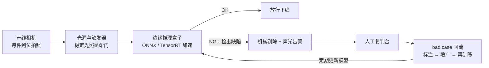
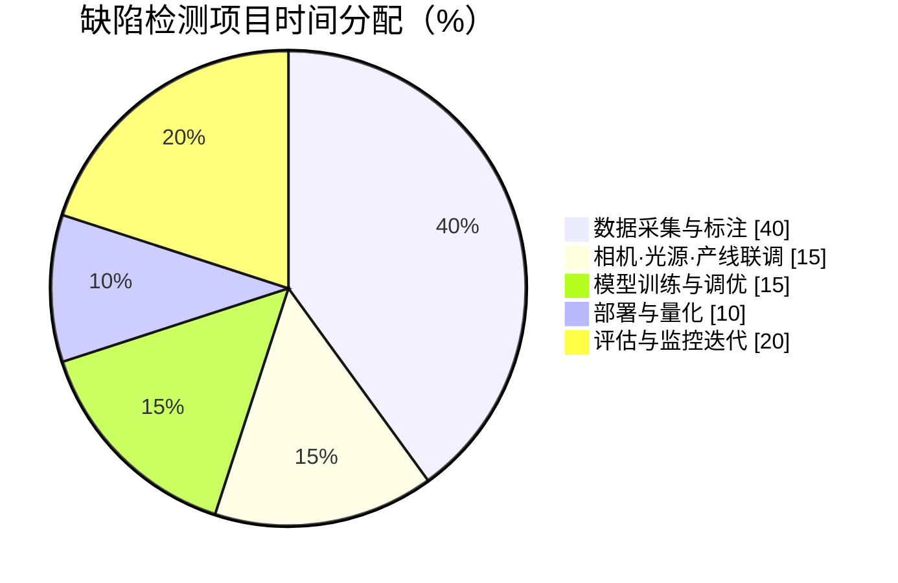

# 生产实战：工厂缺陷检测项目从 0 到 1

> **一句话理解**：课本上的 CV 是"拿公开数据集刷指标"，产线上的 CV 是"和光照、节拍、标注口径、坏样本稀缺搏斗"——模型只是这条链上的一环。

[⬆️ 返回总目录](../../../README.md) · [⬆️ 返回本篇](../README.md) · [⬅️ 返回本章目录](./README.md)

| 属性 | 说明 |
|------|------|
| 难度 | ⭐⭐ |
| 所属分支 | 视觉 |
| 前置知识 | 本章全部正文 |

---

## 🏭 一个真实项目从 0 到 1

场景设定：某零件厂要做**表面缺陷检测**——划痕、凹坑、异物，替代人工目检。产线节拍每件约 2 秒，缺陷件占比千分之几。

先看项目画像（经验参考量级，不同工厂差异很大）：

| 维度 | 量级 |
|------|------|
| 团队 | 1 名算法 + 1 名工程 + 产线/质量各一名对接人 |
| 工期 | 首版上线 2~3 个月，此后长期迭代 |
| 数据 | 数万张好品 + 数千张缺陷（分 3 类），持续回流 |
| 预算大头 | 相机/光源/支架与边缘盒子，常超过算力开销 |

时间都花在哪（经验参考，每个厂都差不多）：

分阶段拆解（做什么、花多久、常见卡点）：

- **需求定义**：先和产线谈指标，不是和算法谈。典型口径：关键缺陷**漏检率 < 0.5%**、**误报率**控制在人工可承受范围（每千件复判几件）、单件推理延迟 < 数百毫秒（节拍的 1/4 留余量）。经验参考：漏检和误检是跷跷板，先让业务方定价——"漏一件损失多少、错杀一件损失多少"，再定置信度阈值。
- **数据**：产线相机实测采集（不要用手机补拍，成像完全两回事）。最大难题是**缺陷样本稀少**：占比千分之几，攒几千张缺陷图要连续采集数周。标注用 Label Studio 自建，或外包边界框标注（经验量级：每框几毛到几元，缺陷类型越难辨越贵）。清洗与口径统一约占项目总时间的三到四成——这是常态，不是意外。
  - 采集三件事：关掉自动白平衡与自动曝光（每张图成像条件一致）；拍下"停产空转"背景帧（排查反光干扰）；坏品下线前多角度补拍（缺陷样本来之不易，一张当三张用）。
  - 数据集划分要**按批次切**：同一批次既进训练又进测试 = 变相抄答案。
- **设备与算力**：训练阶段租 1~2 张云 GPU 或用工作站几天即可（检测模型不大）；部署侧买**边缘推理盒子**（工业级 NPU 盒子，千元到万元量级），不依赖车间网络。相机 + 光源 + 支架的选型开销常被低估，且和算法无关的人决定成败。
- **算法选型**：第一问——**分类够不够**？只判 OK/NG、不报位置，小图裁剪 + 二分类可能就够，便宜又快。要位置与类型 → 检测：YOLO 系开源实现 + 预训练权重起步是行业默认动作。缺陷类别长尾、样本极少 → 叠加两条思路：**数据增广**（几何变换要谨慎，翻转可能把"合格方向"翻成"不合格"；Albumentations 细粒度控制）与**异常检测思路**（只用好品训练"正常长什么样"，偏离即报警，天然对付见没见过的缺陷）。
- **训练炼丹**：预训练骨干微调为主；长尾类别用**损失加权**或 focal 类损失拉高权重；实验记录用 W&B 或 MLflow，每次改动可追溯。经验参考：首批可训 100~300 epoch，看验证集单类召回而非总分。
- **评估**：**按缺陷类型分桶看召回**——划痕召回 98%、异物 97%、但"微小凹坑"可能只有 60%，总分完全掩盖它。小目标单独测。再按置信度阈值画漏检—误检曲线，交业务方选工作点。
- **部署**：模型导出 ONNX，再用 TensorRT（NVIDIA 盒子）或 NCNN（ARM 盒子）加速。做**精度—延迟权衡**：FP16 量化通常掉点在 0.5% 以内（经验参考），换 2~3 倍提速，一般值得；INT8 再快但要校准与回归测试。上线前在盒子上跑完整回归集。
  - 上线节奏：影子模式（只记录不剔除）跑一两周对齐人工结论 → 小比例分流 → 全量，每一步都有回退开关。
- **监控与迭代**：盯线上误报率与复判台结论。**换型号产品 = 域偏移（Domain Shift）**高发时刻：新表面纹理、新反光，旧模型当场"水土不服"，需采集新数据微调。bad case 定期回流标注、每月或每季度滚动更新模型。

📋 展开：相机与光源选型清单（决定成败的非模型环节）

- **光源**：优先碗状/条形 LED 平光，宁可贵一点也别用车间顶灯；光源角度决定缺陷"显不显形"——划痕类缺陷对打光角度极其敏感，45° 侧打光常让浅划痕现形；
- **相机**：分辨率按"最小缺陷至少覆盖 8~10 个像素"倒推；固定焦距定焦镜头，别用变焦；快门与产线触发同步（编码器触发），防拖影；
- **机构**：工件到位定位（同一位置同一姿态），遮挡治具能加就加——把"变量"锁死在机械层面，比让模型学着适应便宜一百倍；
- **验收**：装机后连拍 24 小时空转，看图像亮度漂移曲线——漂移超过几个灰度级，先解决稳定性再谈模型。

📋 展开一个真实的迭代故事

上线两个月，一切平稳。某天车间换了一批新供应商的清洗剂，零件表面反光特性变了，误报率从每千件 3 件飙到 40 件——模型本身一行没改，"世界的光照变了"。排查发现新批次零件反光更强，训练时没见过这种高光斑。处理：追加采集两天新批次数据（好品为主，无需等缺陷），重训 + 提高高光增广比例，误报回落。教训写进流程：**每次来料/工艺变更都触发一次小规模数据采集与回归测试**，而不是等报警。

## 🧭 场景选型表

| 场景 | 推荐 | 理由 | 不推荐 |
|------|------|------|--------|
| 只判 OK/NG、不报位置 | 小分类模型（预训练骨干微调） | 便宜、快、易维护 | 大检测模型（杀鸡用牛刀） |
| 要位置与类型、样本尚可 | YOLO 系检测 + 微调 | 开源成熟、边缘友好 | 从零训练自研架构 |
| 缺陷极其稀少、类型开放 | 异常检测思路 + 好品建模 | 只需好品样本，能报"没见过的异常" | 长尾监督检测（正样本攒不齐） |
| 需要精细区域（划痕走向、面积） | 分割（U-Net 形状） | 逐像素输出，量化面积长度 | 检测框（只能给矩形范围） |
| 云端算力充足、非实时 | 云端大模型精算（离线复核） | 精度上限高、迭代快 | 边缘实时方案用在这里（浪费节拍） |
| 产线实时、断网可用 | 边缘小模型（ONNX/TensorRT） | 低延迟、不依赖网络 | 云端推理（网络抖动即停产风险） |
| 缺陷以微小目标为主 | 提输入分辨率 + 多尺度检测 | 小目标吃分辨率；改图比改模型见效 | 一味加深网络（对小目标帮助有限） |
| 缺陷类型繁多且还会新增 | 异常检测打底 + 少量监督补充 | 新类型零样本也能报警，新样本攒够再转监督 | 一次性收集全部类型再开工（永远等不齐） |

## 🧰 真实工具链

| 环节 | 常用工具 | 一句话点评 |
|------|----------|-----------|
| 标注 | Label Studio | 开源自建，支持检测/分割；外包要另配口径文档与抽检 |
| 检测框架 | YOLO 系开源实现 | 预训练权重 + 微调，工业界默认起点 |
| 数据增广 | Albumentations | 增广种类全、可细粒度控制目标框同步变换 |
| 模型导出与部署 | ONNX Runtime | 统一中间格式，跨硬件的通用底座 |
| 边缘加速 | TensorRT / NCNN | NVIDIA 用前者、ARM 用后者；量化后必须回归测试 |
| 实验跟踪 | W&B / MLflow | 每次 baseline 可追溯，别用文件夹命名管理实验 |
| 数据集检视 | FiftyOne | bad case 浏览、去重、找标注错，救眼睛的工程神器 |

## 💣 踩坑实录

- **坑 1：光照一变就翻车** → 白天黑夜、灯管老化、新批次反光都会造成域偏移。发现方式是误报率突增；救法是固定光源 + 触发曝光、增广覆盖光照变化、来料变更触发重采集。
- **坑 2：标注口径不一致** → "多深的印子算凹坑"两个标注员两种答案，模型学成两套标准。救法：写口径文档、双标抽检、争议样本仲裁例会——纯管理活，但比调参更影响上限。
- **坑 3：负样本太多造成"高分假象"** → 缺陷占比千分之几时，一个"全部预测正常"的模型准确率 99.9%，分数极好看、价值为零。救法：永远看**分缺陷类型的召回**与漏检率，准确率在这种任务上几乎无意义。
- **坑 4：测试集是"摆拍"的** → 实验室摆好角度拍的测试图太干净，分数虚高，一上产线原形毕露。救法：测试集必须来自产线相机真实抓拍、覆盖不同班次与批次，且封存不动。

📋 展开：上线前检查清单（逐项打勾再上）

- [ ] 按缺陷类型分桶的召回达标（不是只看 mAP 总分）；
- [ ] 漏检—误检曲线已交产线，置信度阈值由业务确认签字；
- [ ] 推理延迟在目标硬件实测达标（含前处理与传图，不只模型本身）；
- [ ] 量化后模型在完整回归集上重跑，掉点在可接受范围；
- [ ] 影子模式跑满两周，与人工复判结论对齐；
- [ ] 回退开关与旧流程可用，值班与告警联系人明确；
- [ ] bad case 回流管道（复判台 → 标注池）已打通，不是靠 U 盘拷贝。

📋 展开：怎么向产线解释"模型又快又准但仍会漏"

演示漏检—误检曲线而不是报一个分数：把阈值从 0.9 滑到 0.3，当场看"每千件漏检件数 vs 复判人工件数"此消彼长，让产线自己选工作点。经验参考：与其承诺"永不漏检"，不如承诺"漏检率低于人工目检的平均水平"——人工目检本身也有漏检率（疲劳、注意力波动），这个对比最能建立信任。

## 📈 上线后盯什么（监控指标）

| 指标 | 看什么 | 告警参考 |
|------|--------|---------|
| 误报率 | 每千件误剔/复判件数 | 突增即查域偏移（光照/来料） |
| 复判台结论 | 人工判定 NG 中模型漏掉的比例 | 漏检率逼近目标线即降阈值 |
| 分缺陷召回 | 三类缺陷各自的线上召回 | 弱类连续走低触发重训 |
| 推理延迟 | 盒子端到端耗时（含传图） | 超过节拍预算的 1/2 即扩容 |
| 图像质量 | 亮度漂移、模糊帧占比 | 漂移超标先查相机与光源 |

## 🗣️ 炼丹师大实话

> "CV 项目一半难度在相机和光照，不在模型——把光打匀、把触发对齐、把口径写清，模型那点事反而是最简单的部分。"

---

[⬅️ 上一页：ViT 视觉 Transformer](./03-ViT视觉Transformer.md) · [返回本章目录](./README.md) · [下一页：第 6 章：时间序列 ➡️](../06-时间序列/README.md)
