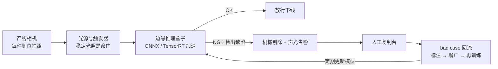
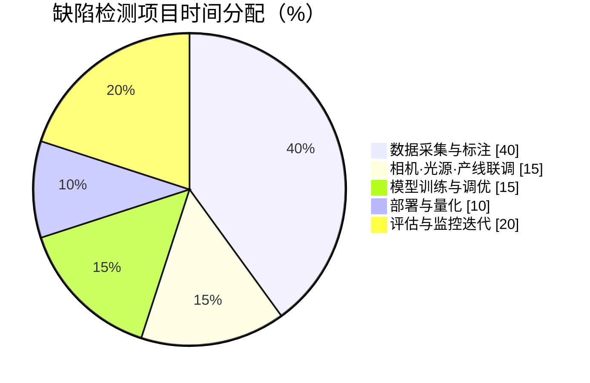
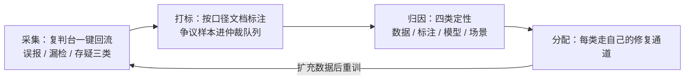

# 生产实战：工厂缺陷检测项目从 0 到 1

> **一句话理解**：课本上的 CV 是"拿公开数据集刷指标"，产线上的 CV 是"和光照、节拍、标注口径、坏样本稀缺搏斗"——模型只是这条链上的一环。

[⬆️ 返回总目录](../../../README.md) · [⬆️ 返回本篇](../README.md) · [⬅️ 返回本章目录](./README.md)

| 属性 | 说明 |
|------|------|
| 难度 | ⭐⭐ |
| 所属分支 | 视觉 |
| 前置知识 | 本章全部正文 |

---

## 🏭 一个真实项目从 0 到 1

场景设定：某零件厂要做**表面缺陷检测**——划痕、凹坑、异物，替代人工目检。产线节拍每件约 2 秒，缺陷件占比千分之几。

先看项目画像（经验参考量级，不同工厂差异很大）：

| 维度 | 量级 |
|------|------|
| 团队 | 1 名算法 + 1 名工程 + 产线/质量各一名对接人 |
| 工期 | 首版上线 2~3 个月，此后长期迭代 |
| 数据 | 数万张好品 + 数千张缺陷（分 3 类），持续回流 |
| 预算大头 | 相机/光源/支架与边缘盒子，常超过算力开销 |

时间都花在哪（经验参考，每个厂都差不多）：

分阶段拆解（做什么、花多久、常见卡点）：

- **需求定义**：先和产线谈指标，不是和算法谈。典型口径：关键缺陷**漏检率 < 0.5%**、**误报率**控制在人工可承受范围（每千件复判几件）、单件推理延迟 < 数百毫秒（节拍的 1/4 留余量）。经验参考：漏检和误检是跷跷板，先让业务方定价——"漏一件损失多少、错杀一件损失多少"，再定置信度阈值。
- **数据**：产线相机实测采集（不要用手机补拍，成像完全两回事）。最大难题是**缺陷样本稀少**：占比千分之几，攒几千张缺陷图要连续采集数周。标注用 Label Studio 自建，或外包边界框标注（经验量级：每框几毛到几元，缺陷类型越难辨越贵）。清洗与口径统一约占项目总时间的三到四成——这是常态，不是意外。
  - 采集三件事：关掉自动白平衡与自动曝光（每张图成像条件一致）；拍下"停产空转"背景帧（排查反光干扰）；坏品下线前多角度补拍（缺陷样本来之不易，一张当三张用）。
  - 数据集划分要**按批次切**：同一批次既进训练又进测试 = 变相抄答案。
- **设备与算力**：训练阶段租 1~2 张云 GPU 或用工作站几天即可（检测模型不大）；部署侧买**边缘推理盒子**（工业级 NPU 盒子，千元到万元量级），不依赖车间网络。相机 + 光源 + 支架的选型开销常被低估，且和算法无关的人决定成败。
- **算法选型**：第一问——**分类够不够**？只判 OK/NG、不报位置，小图裁剪 + 二分类可能就够，便宜又快。要位置与类型 → 检测：YOLO 系开源实现 + 预训练权重起步是行业默认动作。缺陷类别长尾、样本极少 → 叠加两条思路：**数据增广**（几何变换要谨慎，翻转可能把"合格方向"翻成"不合格"；Albumentations 细粒度控制）与**异常检测思路**（只用好品训练"正常长什么样"，偏离即报警，天然对付见没见过的缺陷）。
- **训练炼丹**：预训练骨干微调为主；长尾类别用**损失加权**或 focal 类损失拉高权重；实验记录用 W&B 或 MLflow，每次改动可追溯。经验参考：首批可训 100~300 epoch，看验证集单类召回而非总分。
- **评估**：**按缺陷类型分桶看召回**——划痕召回 98%、异物 97%、但"微小凹坑"可能只有 60%，总分完全掩盖它。小目标单独测。再按置信度阈值画漏检—误检曲线，交业务方选工作点。评估用什么测试集不是小事，规范见下文「验收测试集」。
- **部署**：模型导出 ONNX，再用 TensorRT（NVIDIA 盒子）或 NCNN（ARM 盒子）加速。做**精度—延迟权衡**：FP16 量化通常掉点在 0.5% 以内（经验参考），换 2~3 倍提速，一般值得；INT8 再快但要校准与回归测试（深水区见下文「边缘部署」）。上线前在盒子上跑完整回归集。
  - 上线节奏：影子模式（只记录不剔除）跑一两周对齐人工结论 → 小比例分流 → 全量，每一步都有回退开关。
- **监控与迭代**：盯线上误报率与复判台结论。**换型号产品 = 域偏移（Domain Shift）**高发时刻：新表面纹理、新反光，旧模型当场"水土不服"，需采集新数据微调。bad case 定期回流标注、每月或每季度滚动更新模型（回流闭环见下文）。

📋 展开：相机与光源选型清单（决定成败的非模型环节）

- **光源**：优先碗状/条形 LED 平光，宁可贵一点也别用车间顶灯；光源角度决定缺陷"显不显形"——划痕类缺陷对打光角度极其敏感，45° 侧打光常让浅划痕现形；
- **相机**：分辨率按"最小缺陷至少覆盖 8~10 个像素"倒推；固定焦距定焦镜头，别用变焦；快门与产线触发同步（编码器触发），防拖影；
- **机构**：工件到位定位（同一位置同一姿态），遮挡治具能加就加——把"变量"锁死在机械层面，比让模型学着适应便宜一百倍；
- **验收**：装机后连拍 24 小时空转，看图像亮度漂移曲线——漂移超过几个灰度级，先解决稳定性再谈模型。

📋 展开一个真实的迭代故事

上线两个月，一切平稳。某天车间换了一批新供应商的清洗剂，零件表面反光特性变了，误报率从每千件 3 件飙到 40 件——模型本身一行没改，"世界的光照变了"。排查发现新批次零件反光更强，训练时没见过这种高光斑。处理：追加采集两天新批次数据（好品为主，无需等缺陷），重训 + 提高高光增广比例，误报回落。教训写进流程：**每次来料/工艺变更都触发一次小规模数据采集与回归测试**，而不是等报警。

## 🔧 边缘部署的深水区

导出 ONNX 只是入门票，真正的时间花在三件事上：

**① 算子兼容性排查**。训练框架里能跑的层，推理引擎未必认识。标准动作：导出时升到较新的 opset 版本 → 用 ONNX Runtime 在电脑上先试跑（比对与 PyTorch 的输出差异，最大绝对误差应在 1e-4 量级）→ 哪个算子报"unsupported"，就查该引擎的支持列表，常用救法是**换成等价算子组合**（如把自定义激活拆成 mul/add、把近期的动态卷积改静态）。经验参考：检测模型的坑多在解码层（NMS/坐标变换）——先用框架自带的标准头、少自定义，能省一大半兼容时间。

**② 量化的精度损失不均匀——检测头的小目标最疼**。INT8 量化把权重与激活从 32 位浮点压到 8 位整数，速度再涨一截，但损失不是均匀分布的：分类骨干对量化相当皮实（掉点常在 0.5% 内），而**检测头的回归分支对微小偏移敏感**——框坐标量化误差 1~2 个像素，对大目标无感，对 20 像素的小目标就是"框歪了、IoU 掉线"，直接表现为**小目标召回明显下滑而总分几乎不动**。诊断动作：量化前后各跑一遍回归集，**按目标尺寸分桶对比召回**，别只看 mAP。补救阶梯：per-channel 量化（对权重逐通道量化，几乎白捡）→ 混合精度（检测头保 FP16、骨干 INT8）→ QAT 量化感知训练（有时间预算再上）。

**③ INT8 校准集怎么选**。PTQ（训练后量化）需要几百到两千张"校准图"让引擎统计激活分布。铁律是**校准集必须来自部署端真实分布**：产线相机实拍、覆盖不同批次/班次/光照角度、好品为主但**必须掺入缺陷样本与难例**（高反光、低对比度边界件）——校准集全是"标准好图"，线上遇到反光件时激活分布溢出，精度当场跳水。经验参考：500~2000 张、按产线实际类别比例分层抽取；换相机或改光源后校准集要重新采集。

## 🔄 bad case 回流闭环的完整设计

模型上线只是 v1，**系统值钱的地方是"越用越准"的回流闭环**。完整设计四段：

**归因四类与分配去向**（这是闭环的大脑）：

| 归因 | 判定特征（怎么区分） | 修复通道 |
|------|---------------------|---------|
| 数据问题 | 训练集里找不到同类成像（新反光、新纹理）——模型"没见过"，不是"学不会" | 进采集计划，补样本后随下版训练 |
| 标注问题 | 同类样本在训练集里的标注互相矛盾、边界口径不一 | 进口径修订：写清判定标准 → 重标冲突样本 → 双标抽检 |
| 模型问题 | 数据里明明有类似样本，仍然判错（容量/结构不够，小目标漏检典型） | 进模型迭代：损失加权、提分辨率、多尺度头 |
| 场景问题 | 光照/来料/机构变动超出部署边界（相机被碰歪、灯管老化） | 先修物理世界（光源/机构/触发），**别急着加数据**——脏数据只会掩盖硬件问题 |

> 👉 **人话**：回流样本不是一股脑扔进训练集了事——先问"这口锅谁背"。场景问题补再多数据都是扬汤止沸；标注问题加再多 epoch 只会让模型学得更拧巴。归因分对了，修复才不白花。

## 📷 多相机场景的模型管理

一条产线常有 2~6 个工位相机（不同面、不同工种）。管理策略从简到繁：

| 方案 | 做法 | 适用 | 坑 |
|------|------|------|-----|
| 每相机一模型 | 各自训练、各自版本 | 相机视角/工种差异大 | 模型数量翻倍，回流数据分散，长尾更缺样本 |
| 共享模型 + 相机分组特征 | 一个模型，把"工位号"当特征/分支 | 相机布置统一、工种接近 | 需要记录并传入相机 ID，漏传就静默劣化 |
| 共享骨干 + 各相机轻量头 | 骨干吃全部数据，头按相机分 | 数据量普遍偏小 | 工程复杂度最高，但数据利用率最好 |

经验默认：**先试共享模型，误差分层监控暴露某台相机独有不准时，再给它拆独立模型**。配套纪律：版本矩阵要记录"模型版本 × 相机 ID"，灰度按相机分组放量；一台相机更换或重装后，必须重跑该机位的回归子集——**A 相机的数据永远不能证明 B 相机没问题**（视角、镜头脏污、光照全是相机私有变量）。

## 🧾 验收测试集的构建规范

评估是否可信取决于测试集是否可信，规范五条：

1. **来源**：全部来自产线相机真实抓拍，覆盖不同班次、批次、季节光照；实验室摆拍图一律不进（坑 4 的教训）；
2. **分层配额**：按缺陷类型 × 尺寸（大/中/小）× 难度分层，**每层至少几十个正样本**——"微小凹坑只有 5 个样本"的层，召回数字没有统计意义；
3. **封存**：验收集打哈希封存、绝不参与任何训练与调参；谁把验收集图混进训练集，分数当场作废；
4. **双集制**：冻结验收集（长期不变，跨版本可比）+ 滚动集（每季度补充新工况，防"老测试集代表不了新产线"）；
5. **带元数据**：每张图记录批次、工位、时间——出问题时能反查"是哪批料、哪个班次"的系统性偏差。

## 🧭 场景选型表

| 场景 | 推荐 | 理由 | 不推荐 |
|------|------|------|--------|
| 只判 OK/NG、不报位置 | 小分类模型（预训练骨干微调） | 便宜、快、易维护 | 大检测模型（杀鸡用牛刀） |
| 要位置与类型、样本尚可 | YOLO 系检测 + 微调 | 开源成熟、边缘友好 | 从零训练自研架构 |
| 缺陷极其稀少、类型开放 | 异常检测思路 + 好品建模 | 只需好品样本，能报"没见过的异常" | 长尾监督检测（正样本攒不齐） |
| 需要精细区域（划痕走向、面积） | 分割（U-Net 形状） | 逐像素输出，量化面积长度 | 检测框（只能给矩形范围） |
| 云端算力充足、非实时 | 云端大模型精算（离线复核） | 精度上限高、迭代快 | 边缘实时方案用在这里（浪费节拍） |
| 产线实时、断网可用 | 边缘小模型（ONNX/TensorRT） | 低延迟、不依赖网络 | 云端推理（网络抖动即停产风险） |
| 缺陷以微小目标为主 | 提输入分辨率 + 多尺度检测 | 小目标吃分辨率；改图比改模型见效 | 一味加深网络（对小目标帮助有限） |
| 缺陷类型繁多且还会新增 | 异常检测打底 + 少量监督补充 | 新类型零样本也能报警，新样本攒够再转监督 | 一次性收集全部类型再开工（永远等不齐） |

## 🧰 真实工具链

| 环节 | 常用工具 | 一句话点评 |
|------|----------|-----------|
| 标注 | Label Studio | 开源自建，支持检测/分割；外包要另配口径文档与抽检 |
| 检测框架 | YOLO 系开源实现 | 预训练权重 + 微调，工业界默认起点 |
| 数据增广 | Albumentations | 增广种类全、可细粒度控制目标框同步变换 |
| 模型导出与部署 | ONNX Runtime | 统一中间格式，跨硬件的通用底座 |
| 边缘加速 | TensorRT / NCNN | NVIDIA 用前者、ARM 用后者；量化后必须回归测试 |
| 实验跟踪 | W&B / MLflow | 每次 baseline 可追溯，别用文件夹命名管理实验 |
| 数据集检视 | FiftyOne | bad case 浏览、去重、找标注错，救眼睛的工程神器 |

## 💣 踩坑实录

- **坑 1：光照一变就翻车** → 白天黑夜、灯管老化、新批次反光都会造成域偏移。发现方式是误报率突增；救法是固定光源 + 触发曝光、增广覆盖光照变化、来料变更触发重采集。
- **坑 2：标注口径不一致** → "多深的印子算凹坑"两个标注员两种答案，模型学成两套标准。救法：写口径文档、双标抽检、争议样本仲裁例会——纯管理活，但比调参更影响上限。
- **坑 3：负样本太多造成"高分假象"** → 缺陷占比千分之几时，一个"全部预测正常"的模型准确率 99.9%，分数极好看、价值为零。救法：永远看**分缺陷类型的召回**与漏检率，准确率在这种任务上几乎无意义。
- **坑 4：测试集是"摆拍"的** → 实验室摆好角度拍的测试图太干净，分数虚高，一上产线原形毕露。救法：测试集必须来自产线相机真实抓拍、覆盖不同班次与批次，且封存不动。
- **坑 5：INT8 量化后总分没掉、小目标悄悄没了** → 量化损失藏在检测头的坐标回归里，mAP 几乎不动、小目标召回掉一截。救法：量化前后按目标尺寸分桶回归，检测头必要时保 FP16（见「边缘部署」②）。

📋 展开：上线前检查清单（逐项打勾再上）

- [ ] 按缺陷类型分桶的召回达标（不是只看 mAP 总分）；
- [ ] 量化后模型在完整回归集上重跑，**按尺寸分桶**对比过召回；
- [ ] 漏检—误检曲线已交产线，置信度阈值由业务确认签字；
- [ ] 推理延迟在目标硬件实测达标（含前处理与传图，不只模型本身）；
- [ ] 影子模式跑满两周，与人工复判结论对齐；
- [ ] 回退开关与旧流程可用，值班与告警联系人明确；
- [ ] bad case 回流管道（复判台 → 标注池 → 归因分配）已打通，不是靠 U 盘拷贝；
- [ ] 多相机场景：版本矩阵（模型 × 相机）已记录，换装相机重跑该机位回归。

📋 展开：怎么向产线解释"模型又快又准但仍会漏"

演示漏检—误检曲线而不是报一个分数：把阈值从 0.9 滑到 0.3，当场看"每千件漏检件数 vs 复判人工件数"此消彼长，让产线自己选工作点。经验参考：与其承诺"永不漏检"，不如承诺"漏检率低于人工目检的平均水平"——人工目检本身也有漏检率（疲劳、注意力波动），这个对比最能建立信任。

## 📈 上线后盯什么（监控指标）

| 指标 | 看什么 | 告警参考 |
|------|--------|---------|
| 误报率 | 每千件误剔/复判件数 | 突增即查域偏移（光照/来料） |
| 复判台结论 | 人工判定 NG 中模型漏掉的比例 | 漏检率逼近目标线即降阈值 |
| 分缺陷召回 | 三类缺陷各自的线上召回 | 弱类连续走低触发重训 |
| 分机位误差 | 每台相机的误报/漏检分层 | 单机位漂移先查硬件（镜头/光源） |
| 推理延迟 | 盒子端到端耗时（含传图） | 超过节拍预算的 1/2 即扩容 |
| 图像质量 | 亮度漂移、模糊帧占比 | 漂移超标先查相机与光源 |

## 🗣️ 炼丹师大实话

> "CV 项目一半难度在相机和光照，不在模型——把光打匀、把触发对齐、把口径写清，模型那点事反而是最简单的部分。"

---

[⬅️ 上一页：进阶专题：视觉前沿](./04-进阶专题-视觉前沿.md) · [返回本章目录](./README.md) · [下一页：第 6 章：时间序列 ➡️](../06-时间序列/README.md)
