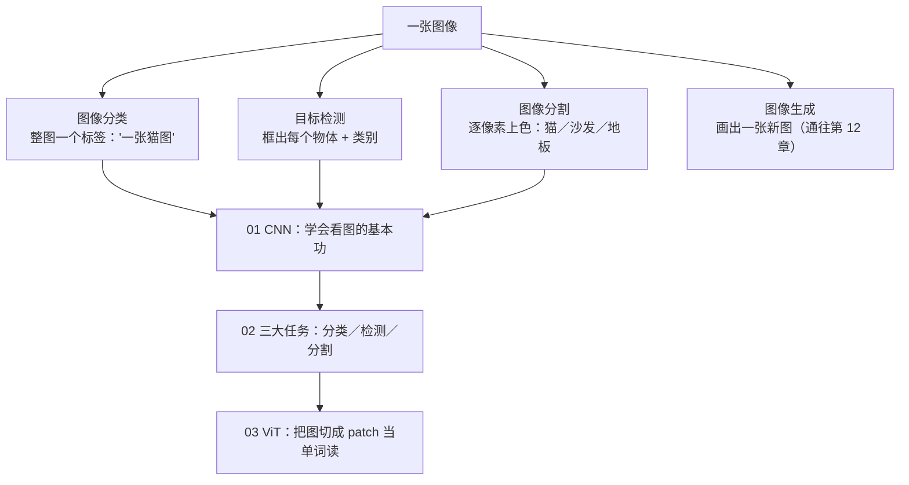

# 第 5 章：计算机视觉 👁️（看见）

> 你一眼就能认出的猫，在机器眼里只是一张数字表格：一张 224×224 的彩色图，就是约 15 万个 0~255 的数字。**计算机视觉（Computer Vision, CV）要跨过的，正是这道"像素到语义"的鸿沟**——把数字矩阵变成"这是一只猫，蹲在沙发左边"。这一章从 CNN 的"小模板滑动比对"直觉出发，走过分类、检测、分割三大任务，最后看 ViT 如何把图当句子读、让视觉与语言说同一种语言。每个主题都走满四层：直觉 → 数学（含可折叠的完整推导）→ 成立条件 → 失效边界（失败模式速查表）。

[⬆️ 返回总目录](../../../README.md) · [⬆️ 返回本篇](../README.md)

## 🗺️ 本章知识树：CV 任务全景

同一张图，不同任务问的问题完全不同：

视觉为什么难？三句话：

- **同一只猫，换个角度、光照、姿势，15 万个数字几乎全变**，但"猫"这个标签不变——模型必须学会"变中找不变"；
- **像素里没有"猫"这个概念**，只有明暗和颜色的小块；"猫"是从像素一层层抽象出来的语义，没有人告诉机器抽象的路径；
- **背景、遮挡、尺寸**都在捣乱——远处的一只猫可能只占十几个像素，被沙发挡住半张脸的狗依然要认出来。

## 🌍 计算机视觉都在哪用

| 场景 | 用到的能力 | 一句话 |
|------|-----------|--------|
| 人脸识别 / 解锁 | 检测 + 分类 | 手机抬起就亮屏的背后 |
| 工业质检 | 检测 / 分割 | 本章 99 页主角：比人眼稳定，不会疲劳 |
| 自动驾驶感知 | 检测 + 分割 + 跟踪 | 实时看清车道、行人、标识 |
| 医学影像辅助诊断 | 分类 / 分割 | 病灶检出与勾画，医生的第二双眼 |
| 内容审核 / 以图搜图 | 分类 / 相似检索 | 海量图像的自动分拣与召回 |

## 🧭 怎么读本章

- **按序读**（01 → 02 → 03 → 99）：卷积直觉是后面所有内容的地基，跳过它直接读 ViT 会很吃力；01 页的感受野公式在 02 页"小目标问题"兑现，02 页的骨干又在 03 页被 ViT 换岗——前后是埋线与回收的关系；
- **代码跟着跑**：01 页手写小 CNN 并逐层打印形状流、02/03 页调用预训练大模型并验证 patch 形状账单，CPU 可承受（部分需联网下载权重）；
- **折叠框别跳过**：输出尺寸/参数量实算、mAP 玩具算例、NMS 翻车现场、残差梯度推导、归纳偏置交叉现象——每页的"硬菜"多在折叠里；
- **带着一个问题读**：如果你手头有一批图片要处理，它属于哪类任务、该用什么模型？读到 99 页时你应该能自己回答。

## 📖 推荐阅读顺序

| 顺序 | 页面 | 难度 | 一句话说明 |
|------|------|------|-----------|
| 1 | [CNN 卷积神经网络](./01-CNN卷积神经网络.md) | ⭐⭐⭐ | 用"小模板滑动比对"代替参数爆炸的全连接；输出尺寸/参数量公式实算、多通道形状流、感受野推导、BN 两副面孔、残差梯度高速公路、迁移学习冻结阶梯与增广适配表 |
| 2 | [视觉三大任务](./02-视觉三大任务.md) | ⭐⭐⭐ | 分类／检测／分割各回答什么问题；anchor → anchor-free 演进、NMS 失败现场与阈值敏感表、mAP 五框手算、mIoU、小目标根源与对策、类别不平衡两层形态 |
| 3 | [ViT 视觉 Transformer](./03-ViT视觉Transformer.md) | ⭐⭐⭐⭐ | 把图切成 patch 当"单词"：224×224×3 → 196×768 完整形状流、[CLS] vs GAP、位置编码为何是命门、归纳偏置交叉现象、训练配方与 O(N²) 账单 |
| 4 | [进阶专题：视觉前沿](./04-进阶专题-视觉前沿.md) | ⭐⭐⭐⭐ | DETR 集合预测与二分匹配手算、SAM 可提示分割与数据引擎飞轮、MAE/DINO 自监督两路线对比、RepVGG 重参数化与检测头蒸馏难点、视觉 Scaling Law 之问 |
| 收官 | [生产实战](./99-生产实战.md) | ⭐⭐ | 工厂缺陷检测项目从 0 到 1：算子兼容排查、INT8 校准集与小目标量化损失、bad case 归因四类回流闭环、多相机模型管理、验收测试集规范 |

## 🎯 读完本章你应该能

- 说清**卷积**与**权值共享**为什么天然适合图像，手算一次 3×3 卷积输出，并用 $\lfloor (W-F+2P)/S \rfloor + 1$ 与参数量公式核算任意一层的形状与参数；
- 区分分类、检测、分割三大任务的输出形态；读懂 IoU／mAP（含完整计算过程）／mIoU，理解 NMS 的密集漏检两难与小目标"证据不足"的根源，不迷信单一分数；
- 讲清 ViT 如何把 224×224 的图变成 196 个 patch、加 1 个 [CLS] 共 197 个 token，解释位置编码为何是命门、小数据 CNN 胜大数据 ViT 胜的交叉现象，以及各自适用场景；
- 拿着每页的**失败模式速查表**对号入座：小数据大模型、学习率毁预训练权重、增广破坏语义、密集 NMS 误杀、量化偷走小目标——先诊断，再补救；
- 对一个真实视觉项目（需求 → 采集 → 标注 → 训练 → 边缘部署 → 回流迭代）建立从 0 到 1 的整体认知。

## 🔗 与其他章节的关系

- **前置章节**：[第 4 章：深度学习基础](../../3-深度学习/04-深度学习基础/README.md)——本章所有网络都建立在"神经网络 + 训练循环 + PyTorch"之上，尤其是[训练一个模型的完整流程](../../3-深度学习/04-深度学习基础/02-训练一个模型的完整流程.md)（本章代码直接复用那套循环模板）。
- **横向呼应**：[第 7 章：自然语言处理与大语言模型](../07-自然语言处理与LLM/README.md)——ViT 把 NLP 的 Transformer 搬进视觉，从这一章起，两个方向共享同一套架构语言。
- **后续章节**：[第 6 章：时间序列](../06-时间序列/README.md)是下一章（patch 思想与时序共享、残差高速公路与 LSTM 记忆单元同源）；"图像变 token"的尽头是第 12 章[多模态模型](../../5-前沿与融合/12-生成模型与多模态/04-多模态模型.md)——图文对话、文生图的地基，都埋在本章 ViT 这一页。

---

[⬅️ 上一章：第 4 章：深度学习基础](../../3-深度学习/04-深度学习基础/README.md) · [返回总目录](../../../README.md) · [下一章：第 6 章：时间序列 ➡️](../06-时间序列/README.md)
