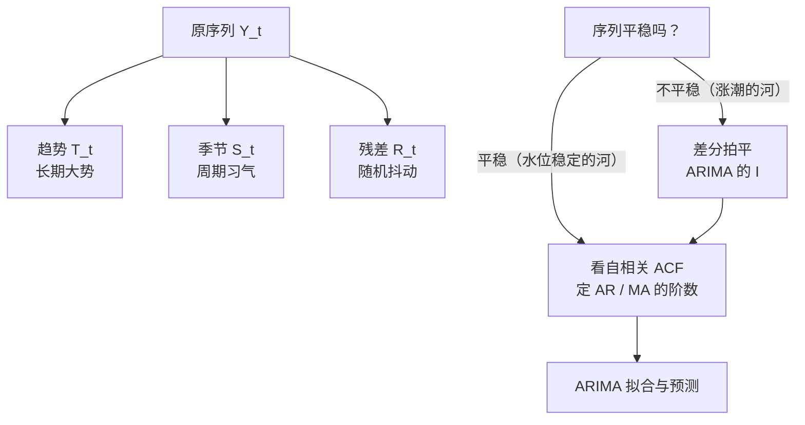

# 时间序列分析入门

> **一句话理解**：先把序列拆成"大势 + 习气 + 抖动"三部分看清楚，再用 ARIMA 这类统计模型预测——动手之前，先学会"望闻问切"。

[⬆️ 返回总目录](../../../README.md) · [⬆️ 返回本篇](../README.md) · [⬅️ 返回本章目录](./README.md)

| 属性 | 说明 |
|------|------|
| 难度 | ⭐⭐（进阶） |
| 所属分支 | 时序 |
| 前置知识 | [04-概率与统计](../../1-起步准备/02-数学基础/04-概率与统计.md) |

---

## 📌 这一节解决什么问题

拿到一条销量曲线，直接上深度学习？老练的分析师会先做三件事：**看结构、验平稳、查自相关**。这就像医生看病先望闻问切，而不是直接开药——很多序列的规律（年年夏天销量高）用最朴素的统计描述就能看清，没必要养一条神经网络。

这一节解决两个问题：

- **理解**：这条序列由什么构成？长期在涨还是跌？有没有周期性的"习气"？剩下的随机抖动有多大？
- **预测**：ARIMA——统治时序预测几十年的统计模型——怎么用"惯性 + 拍平 + 纠偏"三件套做预测？它至今仍是数据量不大时的强力基线（Baseline），也是 99 页生产系统的第一块砖。

## 🌱 通俗理解

一条月销量曲线，其实是三股力量叠加的结果，这叫**时序分解（Time Series Decomposition）**：

- **趋势（Trend）**：长期大势——门店名气渐响，销量两三年里稳步上行；
- **季节（Season）**：周期习气——每年夏天冰淇淋旺、冬天淡，年年如此；
- **残差（Residual）**：剩下的随机抖动——某天路过一个旅游团，纯粹运气。

预测的力气应该花在前两项上：大势用趋势外推，习气用季节修正；残差基本不可预测，承认它、留出容错即可。

**平稳性（Stationarity）**是统计模型的入场券：序列的统计性质（均值、波动幅度）不随时间漂——像一条**水位稳定的河**，任何时候去看，水面高低和波动都差不多。而"每年都在涨"的序列像**涨潮的河**，水位一路抬升：去年的规律（均值 100）今年就失灵（均值 150）。ARIMA 里的字母 I 就负责"拍平"：**差分（Differencing）**——用"今天减昨天"代替原值，水位抬升被减掉，剩下的波动就稳了。

**自相关（Autocorrelation）**：序列和它自己的过去有多像——今天的销量和昨天的销量、和去年同月的销量，相关性各是多少。惯性强的序列（今天高，明天大概率也高）自相关高，这正是可以预测的本钱。

## 📋 举个例子

一个小序列手动做一次一阶差分。原序列（8 个点，肉眼可见在爬坡）：

```text
y  = [3, 5, 4, 6, 5, 7, 6, 8]
```

一阶差分 = 每个点减前一个点，得到 7 个新值：

```text
Δy = [5−3, 4−5, 6−4, 5−6, 7−5, 6−7, 8−6]
   = [ 2,   −1,  2,   −1,   2,   −1,   2 ]
```

对比前后：

- 原序列：前半段均值 (3+5+4+6)/4 = 4.5，后半段均值 (5+7+6+8)/4 = 6.5——**水位在抬**，不平稳；
- 差分后：均值 = (2−1+2−1+2−1+2)/7 ≈ **0.71**，在 ±1.5 的小范围内绕常数波动——**像水位稳定的河了**。

趋势（每步约 +0.7 的爬坡）被差分"减"掉了，剩下的正是那条序列真正稳定的"习性"：涨两步、退一步。

<details>
<summary>📊 展开：12 个月销量数据的趋势与季节读法</summary>

某饮品店两年里的第一年月销量（杯）：

```text
月份：  1    2    3    4    5    6    7    8    9    10   11   12
销量： 90   95  120  150  180  210  230  220  170  130  100   95
```

**读趋势（长期大势）**：前 3 个月均值 = (90+95+120)/3 = 101.7；后 3 个月均值 = (130+100+95)/3 = 108.3。只差不到 7%——去掉季节起伏后，这条曲线的"底座"几乎是平的，没有明显增长或衰退。

**读季节（周期习气）**：全年均值 = 1790/12 ≈ 149.2，看每个月相对它的位置：6~8 月为 +61 ~ +81（旺季），11~12 月为 −49 ~ −54（淡季），一年一个完整周期。

**读残差（还剩什么）**：用"均值 + 旺淡修正"预测每个月，剩下的偏差就是随机抖动——比如 4 月 150 几乎正落在全年均值 149.2 上（淡旺过渡月），说明这条序列被"底座 + 习气"解释得相当干净，可预测性不错。

这套"先看大势、再看习气、最后看抖动"的读法，就是下一节 STL 分解要自动化的事。

</details>

## 🧠 核心原理

### 整体流程



### 逐步拆解

**① 分解：加法与乘法**

$$
Y_t = T_t + S_t + R_t
$$

> 👉 **人话**：加法分解——观测值 = 大势 + 习气 + 抖动，适合季节波动的**幅度**大致不变的情形。

$$
Y_t = T_t \times S_t \times R_t
$$

> 👉 **人话**：乘法分解——观测值 = 大势 × 习气 × 抖动，适合波动幅度随水平放大的情形（销量越高，旺季淡季差得越多）。经典实现有 STL（以鲁棒著称的分解算法）与 `seasonal_decompose`。

**② 平稳性与差分**

一阶差分就是 $Y'_t = Y_t - Y_{t-1}$；还不平就再差一次（二阶）。ARIMA 的中间字母 **I（Integrated）** 指的就是"差分几次"。

**③ 自相关 ACF：今天的值与过去多像**

$$
\rho_k = \frac{\mathrm{Cov}(y_t,\, y_{t-k})}{\mathrm{Var}(y_t)}
$$

> 👉 **人话**：把序列与"整体错开 k 步的自己"算相关系数。k=1 高，说明今天强昨天多半也强（惯性）；按 k=1,2,3… 画成图就是 ACF 图，拖尾拖多长，惯性就有多长——这是给 ARIMA 定阶的主要依据。

**④ ARIMA 三件套：AR 惯性、I 拍平、MA 纠偏**

$$
y_t = c + \phi_1 y_{t-1} + \dots + \phi_p y_{t-p} + \theta_1 \varepsilon_{t-1} + \dots + \theta_q \varepsilon_{t-q} + \varepsilon_t
$$

> 👉 **人话**：预测今天的值 = 常数 + **AR（自回归）**：最近 p 天的值按惯性拉着它 + **MA（滑动平均）**：最近 q 天"预测偏差"的纠偏 + 当天新噪声。三个字母各管一件事——AR 看**历史值**（惯性），I 先**差分拍平**（差分 d 次），MA 看**历史误差**（上次报高了这次往回收）。记法：ARIMA(p, d, q)。

**⑤ Prophet 一句话**

Prophet（Meta 开源）：把"趋势 + 季节 + 节假日效应"拆成几个可直接配置的组件自动拟合——**好上手、对节假日友好**，业务同学自己就能调，常被当作快速基线。

## 💻 动手试试

```python
import numpy as np
import pandas as pd
from statsmodels.datasets import get_rdataset
from statsmodels.tsa.arima.model import ARIMA
from statsmodels.tsa.seasonal import seasonal_decompose

# 1. 经典航空公司月度客流数据（1949-1960，144 个月；需联网从 Rdatasets 下载）
air = get_rdataset("AirPassengers", "datasets").data
s = pd.Series(air["value"].values,
              index=pd.date_range("1949-01", periods=len(air), freq="MS"))

# 2. 乘法分解：客流越大、季节波动幅度越大，乘法更贴切
res = seasonal_decompose(s, model="multiplicative", period=12)
i = 18  # 1950 年 7 月（旺季）
print("1950-07：原值 %d = 趋势 %.1f × 季节 %.2f × 残差 %.2f"
      % (s.iloc[i], res.trend.iloc[i], res.seasonal.iloc[i], res.resid.iloc[i]))
# 预期输出：原值 170 ≈ 趋势 139 上下 × 季节 1.2 上下 × 残差 1.0 上下（数值随版本略有出入）
# 趋势项逐月缓升（约 120 → 470），季节项稳定在 0.85~1.2 间 yearly 波动——分解抓住了"大势+习气"

# 3. ARIMA(1,1,1)：前 132 个月训练，最后 12 个月做检验
train, test = s.iloc[:132], s.iloc[132:]
fit = ARIMA(train, order=(1, 1, 1)).fit()
pred = fit.forecast(12)

# 4. MAPE：平均绝对百分比误差——预测值与真实值平均差了多少个百分点
mape = np.mean(np.abs((test - pred) / test)) * 100
print("ARIMA(1,1,1) 未来 12 个月 MAPE ≈ %.1f%%" % mape)
# 预期输出：MAPE 在 10% 量级（经验参考，随版本浮动）
# 不带季节项的 ARIMA 学得会"涨势"却学不会"旺淡"——换成 SARIMA(1,1,1)×(1,1,1,12)
# （ARIMA(train, order=(1,1,1), seasonal_order=(1,1,1,12))）通常能降到 5% 以内
```

> 👉 **人话（MAPE）**：为什么时序爱用 MAPE 而不是绝对误差？因为"错 10 台"对日销 100 和日销 1 万的店意义完全不同，百分比误差才可比。

## 🔥 炼丹小灶

> 🔥 **炼丹小灶**：工业界常用起点配方与玄学——
> - 配方：先画 ACF/PACF 定阶，或直接用 pmdarima 的 auto_arima 网格搜索；d 取 1~2（差到平稳就停）；样本超过两三个周期再谈季节项。
> - 玄学：残差还带规律（ACF 显著非零）说明模型没吃干净，回去加阶； Prophet 调不过统计模型时，先查节假日表和突变点设置，别急着换模型。
> - ⚠️ 以上是经验参考值，不是圣旨；换数据集请重新炼。

## 🔗 在知识树中的位置

- **上游**：[04-概率与统计](../../1-起步准备/02-数学基础/04-概率与统计.md)——均值、方差、相关系数是本页的全部数学底料。
- **下游**：[RNN 与 LSTM](./02-RNN与LSTM.md)（统计模型学不动复杂非线性时的下一步）、[现代时间序列模型](./03-现代时间序列模型.md)（把分解思想内建进网络）、本章[生产实战](./99-生产实战.md)（统计基线是落地的第一块砖）。
- **横向对比**：统计方法（本页）要求数据少也能稳、可解释强；神经网络（下一页）吃数据、能学多变量非线性——不是替代关系，是工具箱分层。

## ⚠️ 常见误区

- **误区一**："未来的规律一定和过去一样" → ARIMA 的全部前提是"规律可延续"；政策、疫情、爆款发布这类**结构突变**会让历史规律瞬间失效——模型不会报警，要靠监控兜底（99 页）。
- **误区二**："差分次数越多越稳" → 差分过度会人为制造波动（把噪声放大），差到平稳就停，一般不超过 2 次。
- **误区三**："自相关高 = 模型一定好" → ACF 高只说明有惯性可利用；"明天的值 ≈ 今天的值"这种朴素重复也能拿高自相关，预测价值有限——评估要交给留出集，不是 ACF。

## 📝 小结与自测

**要点回顾**

- 分解：趋势（大势）+ 季节（习气）+ 残差（抖动）；波动幅度随水平放大用乘法分解；
- 平稳性是统计模型的入场券；差分用来"拍平"，对应 ARIMA 的 I；
- ACF 度量"今天与 k 天前多像"；ARIMA(p, d, q) = AR 惯性 + I 拍平 + MA 纠偏；
- Prophet 好上手、节假日友好；时序评估常用 MAPE。

**自测一下**（点击展开答案）

<details>
<summary>问题 1：一条逐年上涨、夏季高冬季低的销量序列，该用加法还是乘法分解？</summary>

看季节波动的**幅度**：若旺季淡季的绝对差逐年变大（销量 100 时差 20、销量 500 时差 100），用**乘法**（季节是百分比）；若绝对差基本不变，用加法。现实中业务序列多为乘法。

</details>

<details>
<summary>问题 2：ARIMA(1,1,1) 的三个数字各对应三件套里的哪件事？</summary>

p=1：AR 项看 **1** 期历史值（惯性长度）；d=1：**差分 1 次**把序列拍平（I）；q=1：MA 项看 **1** 期历史误差（纠偏长度）。

</details>

## 📚 延伸阅读

- 书：Box & Jenkins, *Time Series Analysis*（ARIMA 的源头，工具书性质）；Hyndman & Athanasopoulos, *Forecasting: Principles and Practice*（免费在线，强烈推荐）
- 论文：Cleveland et al., *STL: A Seasonal-Trend Decomposition*（1990）；Taylor & Letham, *Forecasting at Scale*（Prophet, 2018）
- 文档：statsmodels 时序模块、Prophet 官方文档

---

[⬅️ 上一页：本章目录](./README.md) · [返回本章目录](./README.md) · [下一页：RNN 与 LSTM ➡️](./02-RNN与LSTM.md)
