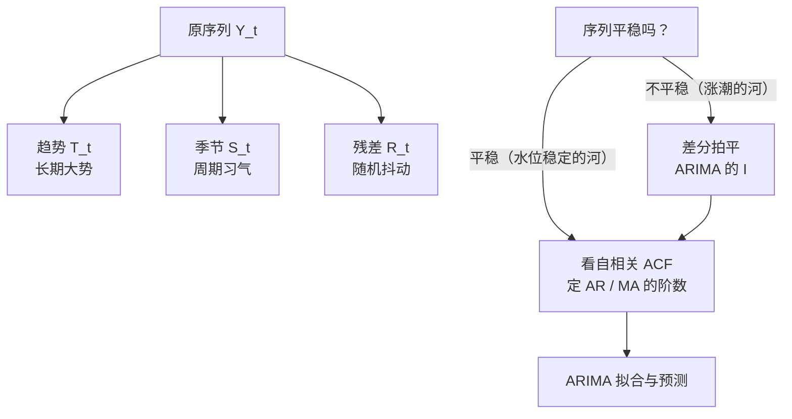
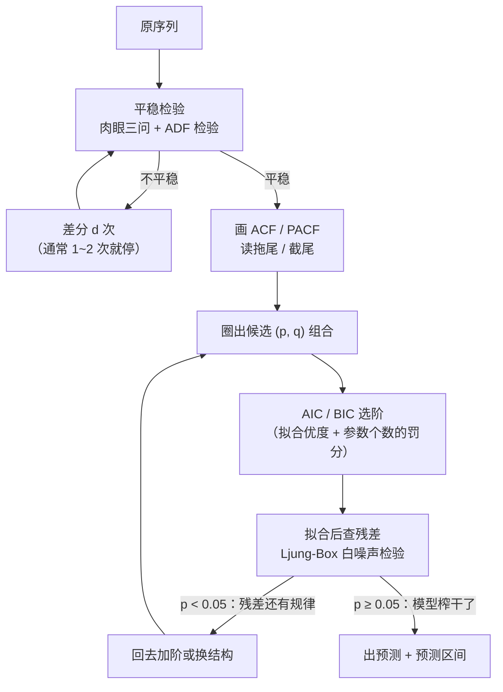

# 时间序列分析入门

> **一句话理解**：先把序列拆成"大势 + 习气 + 抖动"三部分看清楚，再用 ARIMA 这类统计模型预测——动手之前，先学会"望闻问切"。

[⬆️ 返回总目录](../../../README.md) · [⬆️ 返回本篇](../README.md) · [⬅️ 返回本章目录](./README.md)

| 属性 | 说明 |
|------|------|
| 难度 | ⭐⭐（进阶） |
| 所属分支 | 时序 |
| 前置知识 | [04-概率与统计](../../1-起步准备/02-数学基础/04-概率与统计.md) |

---

## 📌 这一节解决什么问题

拿到一条销量曲线，直接上深度学习？老练的分析师会先做三件事：**看结构、验平稳、查自相关**。这就像医生看病先望闻问切，而不是直接开药——很多序列的规律（年年夏天销量高）用最朴素的统计描述就能看清，没必要养一条神经网络。

这一节解决两个问题：

- **理解**：这条序列由什么构成？长期在涨还是跌？有没有周期性的"习气"？剩下的随机抖动有多大？
- **预测**：ARIMA——统治时序预测几十年的统计模型——怎么用"惯性 + 拍平 + 纠偏"三件套做预测？它至今仍是数据量不大时的强力基线（Baseline），也是 99 页生产系统的第一块砖。

学完本页你要达到的状态：给一条陌生序列，能走完"**判平稳（差分几次）→ 读 ACF/PACF（候选阶数）→ AIC/BIC 定阶 → 拟合 → 查残差是不是白噪声**"的完整定阶流程，而不是把 order=(1,1,1) 当万能钥匙。

## 🌱 通俗理解

一条月销量曲线，其实是三股力量叠加的结果，这叫**时序分解（Time Series Decomposition）**：

- **趋势（Trend）**：长期大势——门店名气渐响，销量两三年里稳步上行；
- **季节（Season）**：周期习气——每年夏天冰淇淋旺、冬天淡，年年如此；
- **残差（Residual）**：剩下的随机抖动——某天路过一个旅游团，纯粹运气。

预测的力气应该花在前两项上：大势用趋势外推，习气用季节修正；残差基本不可预测，承认它、留出容错即可。

**平稳性（Stationarity）**是统计模型的入场券：序列的统计性质（均值、波动幅度）不随时间漂——像一条**水位稳定的河**，任何时候去看，水面高低和波动都差不多。而"每年都在涨"的序列像**涨潮的河**，水位一路抬升：去年的规律（均值 100）今年就失灵（均值 150）。ARIMA 里的字母 I 就负责"拍平"：**差分（Differencing）**——用"今天减昨天"代替原值，水位抬升被减掉，剩下的波动就稳了。

**自相关（Autocorrelation）**：序列和它自己的过去有多像——今天的销量和昨天的销量、和去年同月的销量，相关性各是多少。惯性强的序列（今天高，明天大概率也高）自相关高，这正是可以预测的本钱。

**预测区间（Prediction Interval）**：模型给你的不该只是一个数，而是一个"有把握的范围"——"下月销量最可能是 1200，95% 的把握落在 1000~1400"。点预测回答"大概是多少"，区间回答"偏到哪里算正常"；备货看上限、排产看中位、考核看区间盖没盖住真实值——**区间往往比点预测更有用**，后文细说。

## 📋 举个例子

一个小序列手动做一次一阶差分。原序列（8 个点，肉眼可见在爬坡）：

```text
y  = [3, 5, 4, 6, 5, 7, 6, 8]
```

一阶差分 = 每个点减前一个点，得到 7 个新值：

```text
Δy = [5−3, 4−5, 6−4, 5−6, 7−5, 6−7, 8−6]
   = [ 2,   −1,  2,   −1,  2,   −1,  2 ]
```

对比前后：

- 原序列：前半段均值 (3+5+4+6)/4 = 4.5，后半段均值 (5+7+6+8)/4 = 6.5——**水位在抬**，不平稳；
- 差分后：均值 = (2−1+2−1+2−1+2)/7 ≈ **0.71**，在 ±1.5 的小范围内绕常数波动——**像水位稳定的河了**。

趋势（每步约 +0.7 的爬坡）被差分"减"掉了，剩下的正是那条序列真正稳定的"习性"：涨两步、退一步。

再看一个**差分失败的例子**（差到"过头"）：把上面已经平稳的 Δy 再差一次，得 [−3, 3, −3, 3, −3, 3]——原本 ±1.5 的温和波动被人为放大成 ±3 的剧烈震荡。这叫**过度差分**：它不制造信息，只放大噪声（诊断信号见失败模式表）。

<details>
<summary>📊 展开：12 个月销量数据的趋势与季节读法</summary>

某饮品店两年里的第一年月销量（杯）：

```text
月份：  1    2    3    4    5    6    7    8    9    10   11   12
销量： 90   95  120  150  180  210  230  220  170  130  100   95
```

**读趋势（长期大势）**：前 3 个月均值 = (90+95+120)/3 = 101.7；后 3 个月均值 = (130+100+95)/3 = 108.3。只差不到 7%——去掉季节起伏后，这条曲线的"底座"几乎是平的，没有明显增长或衰退。

**读季节（周期习气）**：全年均值 = 1790/12 ≈ 149.2，看每个月相对它的位置：6~8 月为 +61 ~ +81（旺季），11~12 月为 −49 ~ −54（淡季），一年一个完整周期。

**读残差（还剩什么）**：用"均值 + 旺淡修正"预测每个月，剩下的偏差就是随机抖动——比如 4 月 150 几乎正落在全年均值 149.2 上（淡旺过渡月），说明这条序列被"底座 + 习气"解释得相当干净，可预测性不错。

这套"先看大势、再看习气、最后看抖动"的读法，就是下一节 STL 分解要自动化的事。

</details>

## 🧠 核心原理

### 整体流程

分解的直觉：



ARIMA 的**完整定阶流程**（本页主线，照着走就能定出 (p, d, q)）：



### 逐步拆解

**① 分解：加法与乘法**

$$
Y_t = T_t + S_t + R_t
$$

> 👉 **人话**：加法分解——观测值 = 大势 + 习气 + 抖动，适合季节波动的**幅度**大致不变的情形。

$$
Y_t = T_t \times S_t \times R_t
$$

> 👉 **人话**：乘法分解——观测值 = 大势 × 习气 × 抖动，适合波动幅度随水平放大的情形（销量越高，旺季淡季差得越多）。经典实现有 STL（以鲁棒著称的分解算法）与 `seasonal_decompose`。

**② 平稳性与差分：实用检验方法**

一阶差分就是 $Y'_t = Y_t - Y_{t-1}$；还不平就再差一次（二阶）。ARIMA 的中间字母 **I（Integrated）** 指的就是"差分几次"。

怎么判断平不平稳？先过**肉眼三问**（对着图问自己）：

1. 均值恒定吗？——曲线有没有明显的爬坡/下坠（趋势）？
2. 波动幅度恒定吗？——越到后面振幅越大（方差随水平涨）= 不平稳，先取对数再差分；
3. 周期形态稳定吗？——季节波动的形状年年在变位置/幅度，说明季节性也在漂。

三问拿不准时用 **ADF 检验（Augmented Dickey-Fuller）**一句话：它检验"序列里是否存在单位根（随机游走成分）"，原假设是"不平稳"——**p < 0.05 才敢说平稳**。注意它是统计检验不是神谕：一条缓慢趋稳的序列它可能误判，肉眼与检验打架时，把两种判断都当作"证据"，用差分后的 ACF 再复核。

**③ ACF 与 PACF：给 ARIMA 定阶的读图法**

ACF（自相关函数）把"今天与 k 天前多像"按 k = 1, 2, 3… 排成一张柱状图。**PACF（偏自相关函数，Partial Autocorrelation Function）**再进一步：它算的是**扣除中间各期的"传话"效应后**，$y_t$ 与 $y_{t-k}$ 的净相关——好比"今天影响昨天、昨天影响前天"这条传导链被剪断，只量两点之间的直接影响。

$$
\rho_k = \frac{\mathrm{Cov}(y_t,\, y_{t-k})}{\mathrm{Var}(y_t)}
$$

> 👉 **人话**：把序列与"整体错开 k 步的自己"算相关系数。k=1 高，说明今天强昨天多半也强（惯性）；拖尾拖多长，惯性就有多长。

**读图规则表**（定阶的核心口诀）：

| 模型形态 | ACF 的样子 | PACF 的样子 | 例子 |
|---|---|---|---|
| **AR(p)**（看历史值的惯性） | 拖尾（指数或正弦式缓慢衰减） | **p 步后截尾**（断崖式归零） | PACF 只有 lag 1、2 显著 → AR(2) |
| **MA(q)**（看历史误差的纠偏） | **q 步后截尾** | 拖尾 | ACF 只有 lag 1 显著 → MA(1) |
| ARMA(p, q) | 拖尾 | 拖尾 | 两个都拖 → 用 AIC/BIC 网格搜 |

> 👉 **人话**：**AR 看 PACF 截尾，MA 看 ACF 截尾**——因为 AR 的惯性是"一环传一环"（相关传得远、净相关只在 p 步内有），MA 的纠偏只持续 q 步（历史误差的影响用完即止）。两条都拖尾时口诀失灵，交给 AIC/BIC 全家桶。

**④ AIC/BIC：拟合与简洁的罚分权衡**

$$
\mathrm{AIC} = 2k - 2\ln \hat{L}, \qquad \mathrm{BIC} = k \ln n - 2\ln \hat{L}
$$

> 👉 **人话**：k 是参数个数，$\hat{L}$ 是似然（拟合得有多好）。**加一个参数必须换来足够的拟合提升，否则分数变差**——这就是"别把模型养肥"的数学表达。BIC 对参数的罚更重（多了个 ln n 倍），更偏爱小模型。实操：拿候选 (p, q) 网格逐个拟合，选 AIC 或 BIC 最小的那个；两者打架时数据少听 AIC、要稳健听 BIC。

**⑤ ARIMA 三件套：AR 惯性、I 拍平、MA 纠偏**

$$
y_t = c + \phi_1 y_{t-1} + \dots + \phi_p y_{t-p} + \theta_1 \varepsilon_{t-1} + \dots + \theta_q \varepsilon_{t-q} + \varepsilon_t
$$

> 👉 **人话**：预测今天的值 = 常数 + **AR（自回归）**：最近 p 天的值按惯性拉着它 + **MA（滑动平均）**：最近 q 天"预测偏差"的纠偏 + 当天新噪声。三个字母各管一件事——AR 看**历史值**（惯性），I 先**差分拍平**（差分 d 次），MA 看**历史误差**（上次报高了这次往回收）。记法：ARIMA(p, d, q)。

**⑥ 残差白噪声检验：模型榨干了吗**

$$
Q = n(n+2)\sum_{k=1}^{h} \frac{\hat{\rho}_k^2}{n-k} \;\sim\; \chi^2(h)
$$

> 👉 **人话**：这就是 **Ljung-Box 检验**——把残差的前 h 阶自相关平方加总，问一句"残差里还剩规律吗"。**p ≥ 0.05**：剩下的只是白噪声（随机抖动），模型把可提取的都榨干了，可以收工；**p < 0.05**：残差里还有结构（比如季节没建模完），回炉加阶或换 SARIMA。一句话：**残差里还有信息，就说明模型没榨干。**

**⑦ SARIMA：给 ARIMA 装上季节项**

带强季节的序列（客流、冷饮、用电），普通 ARIMA 只差分一次不够——季节本身也在随年份漂移。**SARIMA(p, d, q)×(P, D, Q)_s** 在三件套外再加一套**季节版**：季节自回归 P、季节差分 D、季节滑动平均 Q，s 是周期长度（月度数据 s=12）。季节差分就是"今年 1 月减去年 1 月"：

$$
Y''_t = Y_t - Y_{t-s}
$$

> 👉 **人话**：普通差分拍平"水位抬升"，季节差分拍平"旺季一年比一年旺"。下面代码里 `seasonal_order=(1,1,1,12)` 的四个数依次是：季节 AR 1 阶、季节差分 1 次、季节 MA 1 阶、周期 12 个月。经验参考：航空客流这类"趋势 + 乘法季节"的序列，SARIMA(1,1,1)×(1,1,1)₁₂ 常是漂亮又简洁的起点。

**⑧ 预测区间：点预测之外的那条"安全带"**

$$
\hat{Y}_{T+h} \pm z_{\alpha/2}\, \hat{\sigma}_h
$$

> 👉 **人话**：点预测 ±（置信系数 × 未来 h 步的估计波动）。波动 $\hat{\sigma}_h$ 随步数 h 增大——**预测越远，区间越宽**，这是统计模型在诚实地说"越远我越没底"。

为什么区间常常比点值更重要：备货按 P90 上限备才不缺货，报计划按 P50 中位数报才不虚高；区间宽度还是**模型可信度的仪表盘**——区间宽到没有业务价值，说明这个序列对你现有的信息而言基本不可预测，该去补变量（促销、天气）而不是换模型。注意默认区间假设残差近似正态，遇到促销尖峰这类**厚尾**，实际落在外面的概率比标称的高——深度模型那边的分位数损失（03 页）不依赖正态假设，是替代方案。

**⑨ Prophet 一句话**

Prophet（Meta 开源）：把"趋势 + 季节 + 节假日效应"拆成几个可直接配置的组件自动拟合——**好上手、对节假日友好**，业务同学自己就能调，常被当作快速基线。

## 💻 动手试试

```python
import numpy as np
import pandas as pd
from statsmodels.datasets import get_rdataset
from statsmodels.tsa.arima.model import ARIMA
from statsmodels.tsa.seasonal import seasonal_decompose
from statsmodels.stats.diagnostic import acorr_ljungbox

# 1. 经典航空公司月度客流数据（1949-1960，144 个月；需联网从 Rdatasets 下载）
air = get_rdataset("AirPassengers", "datasets").data
s = pd.Series(air["value"].values,
              index=pd.date_range("1949-01", periods=len(air), freq="MS"))

# 2. 乘法分解：客流越大、季节波动幅度越大，乘法更贴切
res = seasonal_decompose(s, model="multiplicative", period=12)
i = 18  # 1950 年 7 月（旺季）
print("1950-07：原值 %d = 趋势 %.1f × 季节 %.2f × 残差 %.2f"
      % (s.iloc[i], res.trend.iloc[i], res.seasonal.iloc[i], res.resid.iloc[i]))
# 预期输出：原值 170 ≈ 趋势 139 上下 × 季节 1.2 上下 × 残差 1.0 上下（数值随版本略有出入）
# 趋势项逐月缓升（约 120 → 470），季节项稳定在 0.85~1.2 间 yearly 波动——分解抓住了"大势+习气"

# 3. ARIMA(1,1,1)：前 132 个月训练，最后 12 个月做检验
train, test = s.iloc[:132], s.iloc[132:]
fit = ARIMA(train, order=(1, 1, 1)).fit()
pred = fit.forecast(12)

# 4. 残差白噪声检验（Ljung-Box）：残差里还有没有可提取的规律？
lb = acorr_ljungbox(fit.resid, lags=[12], return_df=True)
print("ARIMA(1,1,1)   Ljung-Box(12) p 值 = %.4f" % lb["lb_pvalue"].iloc[0])
# 预期输出：p < 0.05 —— 残差不是白噪声：年度季节没建模，"模型没榨干"，与下面的 10% 误差互相印证

# 5. 换 SARIMA(1,1,1)×(1,1,1,12)：补上季节三件套再检验
fit_s = ARIMA(train, order=(1, 1, 1), seasonal_order=(1, 1, 1, 12)).fit()
pred_s = fit_s.forecast(12)
lb_s = acorr_ljungbox(fit_s.resid, lags=[12], return_df=True)
print("SARIMA(1,1,1)×(1,1,1,12)  Ljung-Box(12) p 值 = %.4f" % lb_s["lb_pvalue"].iloc[0])
# 预期输出：p 通常 > 0.05 —— 残差近白噪声，季节信息被榨干；AIC 也明显低于普通 ARIMA

# 6. MAPE：平均绝对百分比误差——预测值与真实值平均差了多少个百分点
mape = np.mean(np.abs((test - pred) / test)) * 100
mape_s = np.mean(np.abs((test - pred_s) / test)) * 100
print("ARIMA 未来 12 个月 MAPE ≈ %.1f%%；SARIMA ≈ %.1f%%" % (mape, mape_s))
# 预期输出：ARIMA 在 10% 量级，SARIMA 通常降到 5% 以内（经验参考，随版本浮动）
# 注意 AIC、Ljung-Box、MAPE 三个证据指向同一个结论——好模型的证据是相互印证的
```

> 👉 **人话（MAPE）**：为什么时序爱用 MAPE 而不是绝对误差？因为"错 10 台"对日销 100 和日销 1 万的店意义完全不同，百分比误差才可比。

**改什么参数，看什么变化**：

- `order=(1,1,1)` 的 d 改 2：残差震荡变大（过度差分现场），AIC 通常变差；
- `seasonal_order` 里的 D 改 0（去掉季节差分）：Ljung-Box 的 p 值掉回显著——亲眼看"季节差分"这一步榨出了多少规律；
- `lags=[12]` 改 `[24]`：检验窗口更长，季节残留更容易暴露；
- 想看 AIC/BIC 选阶，把 order 换成 (2,1,1)、(1,1,2)、(0,1,1) 各拟一次，打印 `fit.aic` 排序——手工网格搜索的最小版本。

## 🩺 失败模式速查（何时不 work）

| 症状 | 病因 | 诊断 | 补救 |
|---|---|---|---|
| 差分后 ACF 的 lag 1 出现 ≈ −0.5 的强负值 | 过度差分：把平稳序列又差了一遍，噪声被人为放大 | 对比差分前后的 ACF——震荡变"锯齿"即坐实 | 退回少差一次；d 宁少勿多 |
| 残差 Ljung-Box 始终显著，怎么加阶都压不下去 | 结构没建对：季节项缺失、或存在结构突变 | 画残差图找规律在哪——每 12 个点一浪 = 季节；某月后整体跳变 = 突变 | 补 SARIMA 季节项；突变点前后分段建模 |
| 离线 MAPE 不错，上线越预测越偏 | 结构突变（政策、疫情、爆款）让"历史规律可延续"的前提失效 | 残差从某时点起系统性同向 | 加干预变量/分段；上线监控兜底（99 页） |
| 预测区间窄得漂亮，真实值频繁落在区间外 | 残差厚尾（促销尖峰），正态假设低估极端波动 | 残差分布的峰度/尾部频率检查 | 跳出正态假设，用分位数预测（03 页）；或对尖峰单独建模 |
| AIC 最小的模型业务方看不懂也不信 | 参数堆出来的边际改善，解释性差 | 对比 AIC 相近的更简模型，误差差异常在噪声内 | 选简洁的那档；统计模型的卖点就是可解释 |

## 🔥 炼丹小灶

> 🔥 **炼丹小灶**：工业界常用起点配方与玄学——
> - 配方：先画 ACF/PACF 定阶，或直接用 pmdarima 的 auto_arima 网格搜索；d 取 1~2（差到平稳就停）；样本超过两三个周期再谈季节项；SARIMA 起手式 (1,1,1)×(1,1,1)ₛ。
> - 玄学：残差还带规律（ACF 显著非零 / Ljung-Box 拒绝）说明模型没吃干净，回去加阶；Prophet 调不过统计模型时，先查节假日表和突变点设置，别急着换模型。
> - ⚠️ 以上是经验参考值，不是圣旨；换数据集请重新炼。

## 🔗 在知识树中的位置

- **上游**：[04-概率与统计](../../1-起步准备/02-数学基础/04-概率与统计.md)——均值、方差、相关系数是本页的全部数学底料。
- **下游**：[RNN 与 LSTM](./02-RNN与LSTM.md)（统计模型学不动复杂非线性时的下一步）、[现代时间序列模型](./03-现代时间序列模型.md)（把分解思想内建进网络、用分位数损失绕开正态假设）、本章[生产实战](./99-生产实战.md)（统计基线是落地的第一块砖）。
- **横向对比**：统计方法（本页）要求数据少也能稳、可解释强；神经网络（下一页）吃数据、能学多变量非线性——不是替代关系，是工具箱分层。

## ⚠️ 常见误区

- **误区一**："未来的规律一定和过去一样" → ARIMA 的全部前提是"规律可延续"；政策、疫情、爆款发布这类**结构突变**会让历史规律瞬间失效——模型不会报警，要靠监控兜底（99 页）。
- **误区二**："差分次数越多越稳" → 差分过度会人为制造波动（把噪声放大），差到平稳就停，一般不超过 2 次。
- **误区三**："自相关高 = 模型一定好" → ACF 高只说明有惯性可利用；"明天的值 ≈ 今天的值"这种朴素重复也能拿高自相关，预测价值有限——评估要交给留出集，不是 ACF。
- **误区四**："点预测是模型最重要的输出" → 业务消费的常常是区间（备货看上限）；区间宽度同时是"这条序列可不可测"的诚实信号，比一个点值信息量大得多。

## 📝 小结与自测

**要点回顾**

- 分解：趋势（大势）+ 季节（习气）+ 残差（抖动）；波动幅度随水平放大用乘法分解；
- 平稳性是统计模型的入场券：肉眼三问 + ADF；差分用来"拍平"，对应 ARIMA 的 I，差到平稳就停；
- 定阶口诀：**AR 看 PACF 截尾、MA 看 ACF 截尾**，都拖尾交给 AIC/BIC；流程闭环的最后一环是 Ljung-Box 残差检验——残差里还有信息 = 模型没榨干；
- SARIMA(p,d,q)×(P,D,Q)ₛ：在趋势三件套外再加一套季节三件套，季节差分是"今年减去年同月"；
- 预测区间比点预测更有业务价值，区间随步数变宽是模型在诚实；Prophet 好上手、节假日友好；时序评估常用 MAPE。

**自测一下**（点击展开答案）

<details>
<summary>问题 1：一条逐年上涨、夏季高冬季低的销量序列，该用加法还是乘法分解？</summary>

看季节波动的**幅度**：若旺季淡季的绝对差逐年变大（销量 100 时差 20、销量 500 时差 100），用**乘法**（季节是百分比）；若绝对差基本不变，用加法。现实中业务序列多为乘法。

</details>

<details>
<summary>问题 2：ARIMA(1,1,1) 的三个数字各对应三件套里的哪件事？</summary>

p=1：AR 项看 **1** 期历史值（惯性长度）；d=1：**差分 1 次**把序列拍平（I）；q=1：MA 项看 **1** 期历史误差（纠偏长度）。

</details>

<details>
<summary>问题 3：ACF 三步后截尾、PACF 缓慢拖尾，候选模型是什么？</summary>

**MA(3)**。口诀反过来用：MA 看截尾在哪张图——ACF 截尾即 MA，截在第 3 阶即 q=3；PACF 拖尾与 MA 的"误差影响短期传导完"特性相符。

</details>

<details>
<summary>问题 4：拟合完 ARIMA 后 Ljung-Box 的 p = 0.02，下一步做什么？</summary>

p < 0.05 说明**残差还不是白噪声**——里面残留可提取的规律（常见是季节没建模）。回去检查残差 ACF 的形态：每隔 12 显著 → 上 SARIMA；低阶显著 → 加 p 或 q，重新拟合后再检验，直到 p ≥ 0.05。

</details>

## 📚 延伸阅读

- 书：Box & Jenkins, *Time Series Analysis*（ARIMA 的源头，工具书性质）；Hyndman & Athanasopoulos, *Forecasting: Principles and Practice*（免费在线，强烈推荐，定阶与回测章节极系统）
- 论文：Cleveland et al., *STL: A Seasonal-Trend Decomposition*（1990）；Ljung & Box, *On a Measure of Lack of Fit in Time Series Models*（1978）；Taylor & Letham, *Forecasting at Scale*（Prophet, 2018）
- 文档：statsmodels 时序模块（`plot_acf`/`plot_pacf`/`acorr_ljungbox`）、Prophet 官方文档、pmdarima 的 auto_arima

---

[⬅️ 上一页：本章目录](./README.md) · [返回本章目录](./README.md) · [下一页：RNN 与 LSTM ➡️](./02-RNN与LSTM.md)
