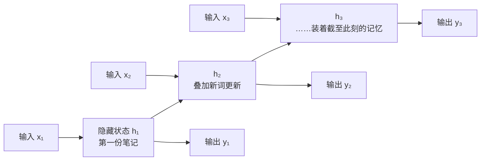
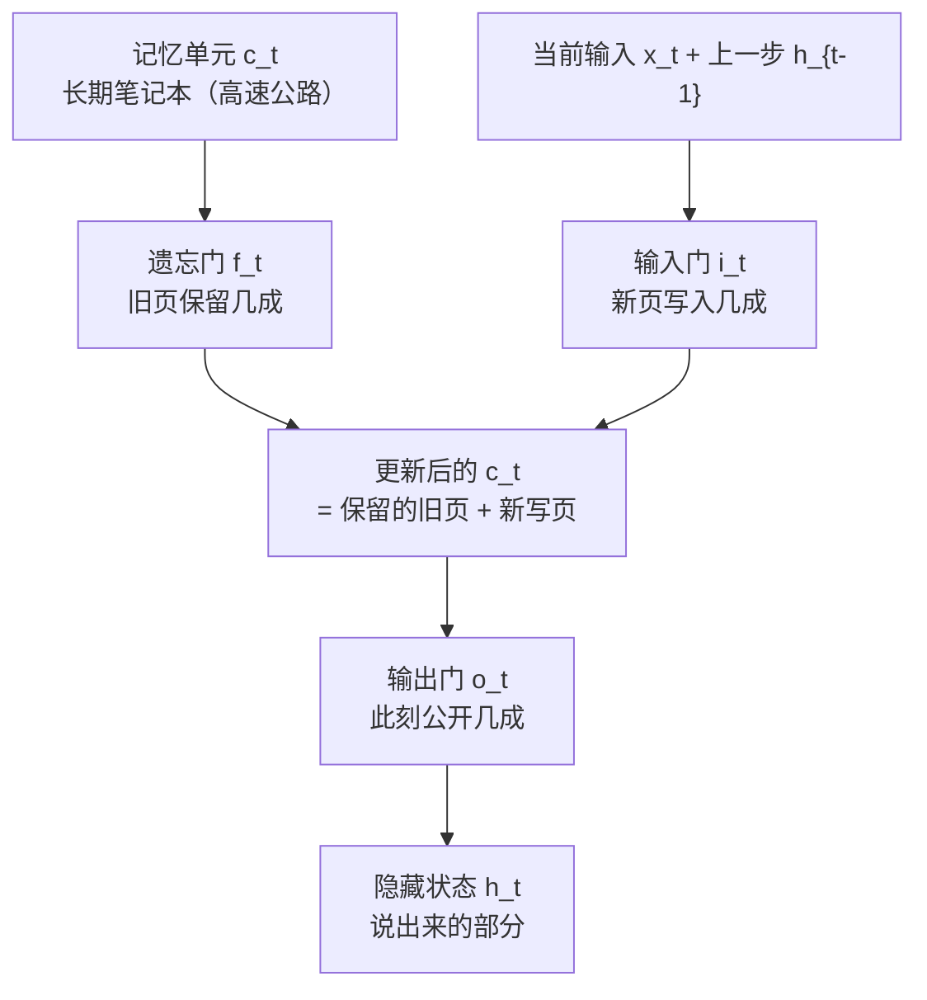

# RNN 与 LSTM：给网络装上记忆

> **一句话理解**：RNN 是"边读边记笔记"的网络——隐藏状态逐时刻传递；LSTM 给笔记加了三道门（忘掉过期、写入新要点、决定此刻说什么），治好了"读完忘开头"。

[⬆️ 返回总目录](../../../README.md) · [⬆️ 返回本篇](../README.md) · [⬅️ 返回本章目录](./README.md)

| 属性 | 说明 |
|------|------|
| 难度 | ⭐⭐⭐（较难） |
| 所属分支 | 时序 |
| 前置知识 | [时间序列分析入门](./01-时间序列分析入门.md)、[01-神经网络是怎么炼成的](../../3-深度学习/04-深度学习基础/01-神经网络是怎么炼成的.md) |

---

## 📌 这一节解决什么问题

上一页的 ARIMA 很稳，但它天生只认**一条序列自身的线性惯性**。现实中要预测的东西常常是"多线并进"的：销量同时被价格、天气、促销节奏牵着走，而且影响可能隔很久——上个月的促销把备货掏空，这个月才显出缺口。这需要能吃**多变量**、记**长依赖**、学**非线性**的模型。

全连接网络（第 4 章）接不了这个活：它把一整段输入"一把抓"进网络，**位置换一换它毫无察觉**——而时序里"顺序"就是信息。循环神经网络（Recurrent Neural Network, RNN）为此而生：**逐时刻读入，边读边把"到目前为止的要点"写进隐藏状态，传给下一时刻**。序列再长，它也是一步一步读、一步一步记。

但朴素 RNN 有个致命短板：读长了会忘——**梯度消失（Vanishing Gradient）**让"第 1 个词的信息"传到第 100 步时已稀释殆尽。LSTM（Long Short-Term Memory，长短期记忆网络）用"门控"解决它，此后二十年，序列建模的默认答案几乎都写着它（直到 Transformer 出现，但那是 03 页的故事）。

## 🌱 通俗理解

把 RNN 想成一个**边读边记笔记的读者**。读一篇文章时，他每读一个词就在笔记本（隐藏状态）上更新一句摘要；读到下一个词，是在"上一句摘要 + 新词"的基础上继续写。所以隐藏状态不是对某个词的记忆，而是**截至此刻全部上下文的浓缩**。

朴素 RNN 的笔记有个毛病：**新词一律覆盖式地改写整本笔记**——读到后面，开头的主语早被冲刷得只剩模糊痕迹，这就是"读完忘开头"（梯度消失的直观表现：往回传梯度时，每步乘一个小于 1 的数，连乘百步趋于 0，开头学不到东西）。

LSTM 把笔记本升级成带**三道门**的活页夹：

- **遗忘门**：划掉过期内容——上一段话题结束了，划掉；
- **输入门**：写入新要点——出现关键信息（人名、数字），记下；
- **输出门**：决定此刻公开说什么——笔记可以很厚，但当前只挑相关的说。

每道门都是 sigmoid 开关，输出 0~1 之间的数：0 = 关死，1 = 全开，0.3 = 留三成。**门控=可学习的阀门**，网络自己训练出"何时记、何时忘、何时说"。

GRU（Gated Recurrent Unit，门控循环单元）是 LSTM 的**两门简化版**：把遗忘门与输入门合并成"更新门"，另加"重置门"，参数少约四分之一，效果常常打平——小数据、要轻量的场合很受欢迎。

## 📋 举个例子

用 LSTM 的门控语言，描述"阅读一句话时记住主语、扔掉修饰"的过程。句子：

> **小明**在图书馆待了一个下午，出门时**他**把书还了。

逐词过一遍"三道门"（下表的门开度与笔记内容为**示意**，真实数值由训练学出）：

| 步 | 读到的词 | 遗忘门（划旧） | 输入门（写新） | 笔记本（记忆单元）内容 | 输出门（此刻说什么） |
|---|---|---|---|---|---|
| 1 | 小明 | — | 开：写入"主语=小明" | 主语=小明 | （开读） |
| 2 | 在 | 关 | 关：不写 | 主语=小明 | 不必出声 |
| 3 | 图书馆 | 关 | 开：写入"地点=图书馆" | 主语、地点 | — |
| 4 | 待了 | 关 | 关 | 原样 | — |
| 5 | 一个 | 关 | 关：修饰词不记 | 原样 | — |
| 6 | 下午 | 半开 | 半开：轻写"时长=一下午" | 主语、地点、时长 | — |
| 7 | 出门时 | 开：划掉"图书馆"（场景已结束） | 开：写入"事件=离开" | 主语、离开 | — |
| 8 | 他 | 关（保住主语！） | 关 | 主语=小明 | **开：回答"他=小明"** |
| 9 | 把书还了 | 关 | 开：写入"动作=还书" | 主语、还书 | — |

第 8 步是全场关键：读到代词"他"时，**遗忘门死死守住"主语=小明"不许划掉，输出门把它公开出来**——长短期记忆的名字就是这样落地的。第 5 步的"一个"、第 6 步的"下午"只配得到半开的门：修饰成分，记个大概就够。

<details>
<summary>📊 展开：4 时刻 RNN 前向的数字简化算例</summary>

设输入序列 x = [1, 0.5, −0.5, 1]，权重 W_x = 0.5、W_h = 0.8、偏置 b = 0，初始隐藏状态 h₀ = 0。更新规则 h_t = tanh(W_x·x_t + W_h·h_{t−1} + b)，逐步算：

| 时刻 | 输入 x_t | 线性求和 W_x·x_t + W_h·h_{t−1} | h_t = tanh(求和) |
|---|---|---|---|
| t=1 | 1.0 | 0.5×1.0 + 0.8×0 = 0.500 | tanh(0.500) ≈ 0.462 |
| t=2 | 0.5 | 0.5×0.5 + 0.8×0.462 = 0.25 + 0.370 = 0.620 | tanh(0.620) ≈ 0.551 |
| t=3 | −0.5 | 0.5×(−0.5) + 0.8×0.551 = −0.25 + 0.441 = 0.191 | tanh(0.191) ≈ 0.189 |
| t=4 | 1.0 | 0.5×1.0 + 0.8×0.189 = 0.5 + 0.151 = 0.651 | tanh(0.651) ≈ 0.572 |

看两个现象：

- **记忆的痕迹**：t=3 的输入是负的，但 h₃ 仍是正的 0.189——前两步的"正记忆"（h₂ = 0.551）还在抵消新来的负输入，隐藏状态确实"带着历史"；
- **记忆的稀释**：t=1 的输入 1.0 原本贡献了 0.5，到 t=4 的求和里只剩 0.8×0.8×0.8×0.462 ≈ 0.236 的间接影响——连乘几步就淡成这样，一百步后趋近于零，这正是梯度消失/记忆变短的代数根源，也是 LSTM 要发明门控的原因。

</details>

## 🧠 核心原理

### 整体流程

RNN 按时刻展开（同一组权重反复复用，权值共享的序列版）：



### 逐步拆解

**① RNN：一步更新**

$$
h_t = \tanh(W_x x_t + W_h h_{t-1} + b)
$$

> 👉 **人话**：新笔记 = 压缩（tanh）后的"新词 x_t 的要点 + 上一句摘要 h_{t−1} 的延续"。同一个 W 反复使用——序列多长都共享一套参数。

**② 梯度消失：记性差的病因**

训练要沿时间回传梯度，路径上每步都乘一次 W_h 并过一次 tanh（导数 ≤ 1）。连乘下来，远处信息的梯度指数级衰减——**不是模型不想记，是"学习信号"传不回去**。LSTM 的解法：给记忆修一条**高速公路（记忆单元）**，信息沿它近似原样流动，梯度不衰减。

**③ LSTM 三道门**

$$
f_t = \sigma(W_f \cdot [h_{t-1}, x_t] + b_f), \qquad i_t = \sigma(W_i \cdot [h_{t-1}, x_t] + b_i)
$$

> 👉 **人话**：遗忘门 f_t 和输入门 i_t 各是一个 0~1 的开关——分别决定"旧笔记保留几成""新要点写入几成"。开关开度由"上一句摘要 + 新词"算出，是学出来的。

$$
c_t = f_t \odot c_{t-1} + i_t \odot \tilde{c}_t
$$

> 👉 **人话**：新笔记本 = 按比例保留的旧页 + 按比例写入的新页。⊙ 表示逐项相乘——"划掉一半"就是乘 0.5。这一条加法通道就是记忆高速公路：f_t 接近 1 时旧信息原样通过，梯度也原样回传。

$$
h_t = o_t \odot \tanh(c_t)
$$

> 👉 **人话**：说话前先看笔记本——输出门 o_t 决定此刻从记忆里公开几成（记忆可以很厚，当前只说相关的）。



**④ GRU：两门简化版**

更新门一身兼二职（决定"忘多少旧 + 记多少新"，且两者互补），重置门决定写新页时参考多少旧笔记；没有独立的记忆单元，直接用隐藏状态承担。参数更少、训练更快，效果与 LSTM 常在毫厘之间——**默认选哪个都行，小数据/要轻量偏 GRU，要精细控制长记忆偏 LSTM**。

**⑤ 何时仍然选 LSTM/GRU**

Transformer 时代（03 页），循环网络并未退休：数据只有几百上千条时，缺归纳偏置的 Transformer 常打不过循环网络；边缘设备上，LSTM 参数少、逐点计算、内存 footprint 小，仍是对算力最友好的选择；流式场景（传感器逐点到达）天然契合"读一个点更新一次"的计算方式。

## 💻 动手试试

```python
import numpy as np
import torch
import torch.nn as nn

torch.manual_seed(0)
np.random.seed(0)

# 1. 构造正弦序列：前 140 个点训练，其后留作外推检验
t = np.linspace(0, 12 * np.pi, 200)
y = np.sin(t).astype(np.float32)

SEQ = 20  # 每次读连续 20 个点，预测第 21 个
X = torch.tensor(np.stack([y[i:i + SEQ] for i in range(140 - SEQ)])).unsqueeze(-1)
Y = torch.tensor(y[SEQ:140]).unsqueeze(-1)   # X[i] 的答案是第 i+20 个点
print("训练样本形状：", X.shape)               # torch.Size([120, 20, 1])：120 个样本×20 步×1 维

# 2. LSTM：序列进，取最后一步的隐藏状态接全连接，输出下一个值
class LSTMRegressor(nn.Module):
    def __init__(self):
        super().__init__()
        self.lstm = nn.LSTM(input_size=1, hidden_size=32, batch_first=True)
        self.head = nn.Linear(32, 1)

    def forward(self, x):
        out, _ = self.lstm(x)        # out 形状 [批, 20, 32]：每步都有隐藏状态
        return self.head(out[:, -1]) # 只用最后一步：它浓缩了整段 20 点的记忆

model = LSTMRegressor()
optimizer = torch.optim.Adam(model.parameters(), lr=1e-2)
loss_fn = nn.MSELoss()

# 3. 全批量训练 300 轮（CPU 约半分钟）
for epoch in range(301):
    loss = loss_fn(model(X), Y)
    optimizer.zero_grad()
    loss.backward()
    optimizer.step()
    if epoch % 100 == 0:
        print(f"epoch {epoch:3d}  loss = {loss.item():.6f}")
# 预期输出：loss 从 ~0.5 量级降到 1e-4~1e-3 量级（随种子浮动）

# 4. 自回归外推：从训练段最后 20 点出发，预测一步、把预测值塞回去继续预测
model.eval()
window, preds = list(y[140 - SEQ:140]), []
with torch.no_grad():
    for _ in range(60):                       # 一口气外推 60 步 ≈ 1.8 个周期
        x = torch.tensor(window[-SEQ:]).view(1, SEQ, 1)
        nxt = model(x).item()
        preds.append(nxt)
        window.append(nxt)

err = np.abs(np.array(preds) - np.sin(t[140:]))
print(f"外推 60 步的平均绝对误差：{err.mean():.3f}")
# 预期输出：平均绝对误差多在 0.1~0.2 之间（随种子略有差异）。
# 模型从没见过第 140 步之后的点，却能接上周期规律——这就是"学到了周期记忆"。
```

## 🔥 炼丹小灶

> 🔥 **炼丹小灶**：工业界常用起点配方与玄学——
> - 配方：hidden_size 32~128、层数 1~2 起步；Adam lr=1e-3；序列输入先做归一化（时序对尺度极其敏感）；训练用梯度裁剪（clip norm=1~5）防梯度爆炸。
> - 玄学：多步预测发散（越推越飞）→ 降学习率、加梯度裁剪、或改用"预测残差"的写法；先保证单步拟合好，再谈长程外推。
> - ⚠️ 以上是经验参考值，不是圣旨；换数据集请重新炼。

## 🔗 在知识树中的位置

- **上游**：[01-神经网络是怎么炼成的](../../3-深度学习/04-深度学习基础/01-神经网络是怎么炼成的.md)（权重、激活、反向传播）+ [时间序列分析入门](./01-时间序列分析入门.md)（序列的结构与平稳性直觉）。
- **下游**：[现代时间序列模型](./03-现代时间序列模型.md)——注意力模型正是冲着"隐藏状态压缩全部历史"这个瓶颈来的；序列建模的另一半世界（文本）在[第 7 章](../07-自然语言处理与LLM/README.md)。
- **横向对比**：与 ARIMA——循环网络吃多变量与非线性，统计模型小数据更稳更可解释；与 Transformer 的系统对比见 03 页的表格。

## ⚠️ 常见误区

- **误区一**："LSTM 彻底解决了长依赖" → 只是大幅缓解；几百步以上的依赖对 LSTM 依旧吃力，超长上下文正是注意力的主场。
- **误区二**："隐藏状态越大记性越好" → 状态过大更难训、更易过拟合，且"记不住"的根源在结构不在容量。
- **误区三**："RNN 已死" → 小数据、边缘设备、流式逐点计算三类场景，LSTM/GRU 仍是性价比之选（见上文"何时仍然选"）。

## 📝 小结与自测

**要点回顾**

- RNN 逐时刻更新隐藏状态，等价于"边读边记笔记"，权重沿时间共享；
- 梯度连乘衰减 = 读完忘开头；LSTM 用记忆单元修高速公路，三道 sigmoid 门管"忘、记、说"；
- GRU 两门简化，常与 LSTM 打平；
- 自回归外推是"预测值塞回去继续预测"，是检验模型是否真学到规律的硬测试。

**自测一下**（点击展开答案）

<details>
<summary>问题 1：读长句时朴素 RNN 忘掉开头，病根在哪个环节？</summary>

在梯度回传：训练信号沿时间步连乘 W_h 并过 tanh（导数 ≤ 1），乘上百步指数级趋零——开头几乎得不到更新。LSTM 的记忆单元以近似恒等的加法通道传信息，梯度得以存活。

</details>

<details>
<summary>问题 2：LSTM 三道门都输出 0~1，为什么遗忘门输出 1 是"全保留"而输出门输出 1 是"全公开"？</summary>

门的取值是乘性系数：遗忘门乘在旧记忆 c_{t−1} 上（×1 = 一点不删），输入门乘在新内容上（×1 = 全写入），输出门乘在压缩后的记忆上（×1 = 全部对外说出）。同一个 0~1，乘在不同对象上，含义就不同。

</details>

## 📚 延伸阅读

- 论文：Hochreiter & Schmidhuber, *Long Short-Term Memory*（1997）；Cho et al., *Learning Phrase Representations using RNN Encoder-Decoder*（GRU, 2014）
- 博客：colah's blog, *Understanding LSTM Networks*（配图经典，强烈推荐）
- 代码：Karpathy 的 min-char-rnn（百行代码写 RNN，理解前向反向的最佳练习）

---

[⬅️ 上一页：时间序列分析入门](./01-时间序列分析入门.md) · [返回本章目录](./README.md) · [下一页：现代时间序列模型 ➡️](./03-现代时间序列模型.md)
