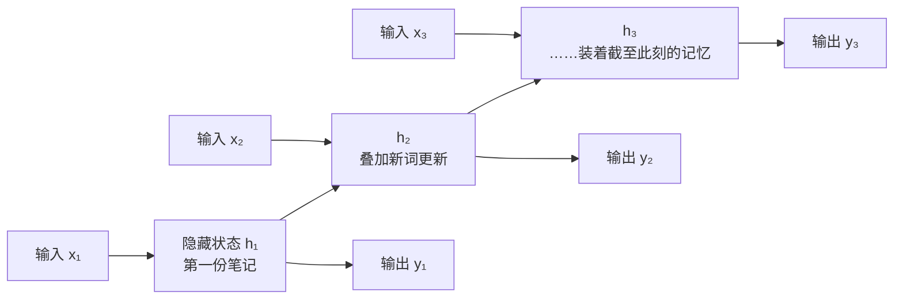
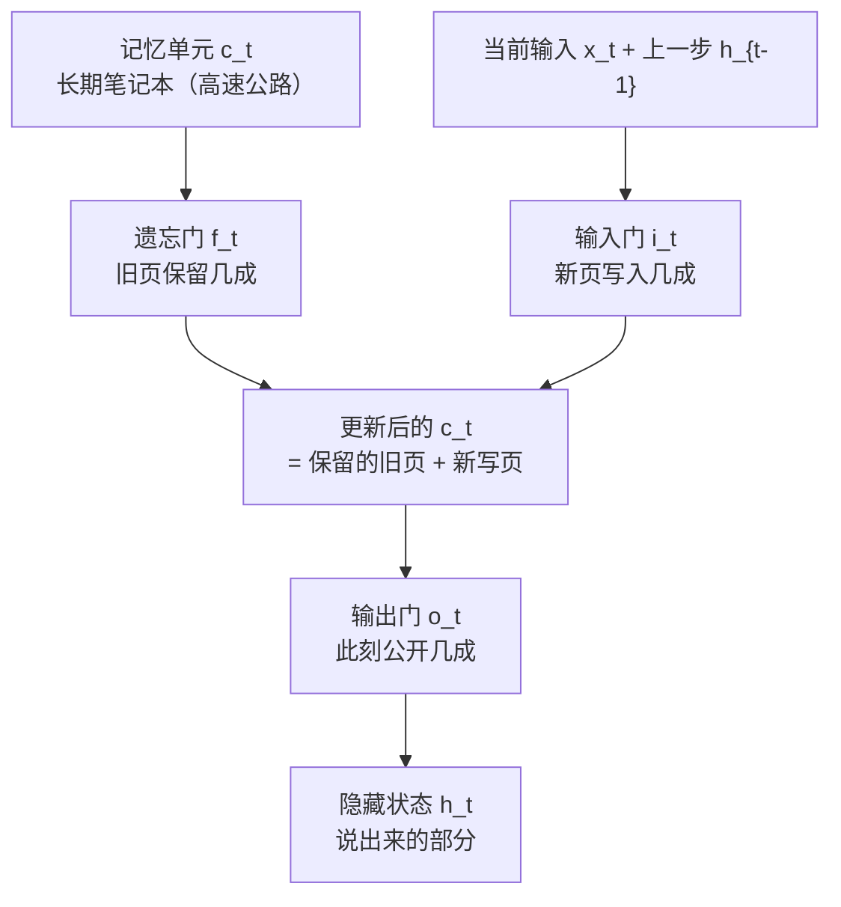

# RNN 与 LSTM：给网络装上记忆

> **一句话理解**：RNN 是"边读边记笔记"的网络——隐藏状态逐时刻传递；LSTM 给笔记加了三道门（忘掉过期、写入新要点、决定此刻说什么），治好了"读完忘开头"。

[⬆️ 返回总目录](../../../README.md) · [⬆️ 返回本篇](../README.md) · [⬅️ 返回本章目录](./README.md)

| 属性 | 说明 |
|------|------|
| 难度 | ⭐⭐⭐（较难） |
| 所属分支 | 时序 |
| 前置知识 | [时间序列分析入门](./01-时间序列分析入门.md)、[01-神经网络是怎么炼成的](../../3-深度学习/04-深度学习基础/01-神经网络是怎么炼成的.md) |

---

## 📌 这一节解决什么问题

上一页的 ARIMA 很稳，但它天生只认**一条序列自身的线性惯性**。现实中要预测的东西常常是"多线并进"的：销量同时被价格、天气、促销节奏牵着走，而且影响可能隔很久——上个月的促销把备货掏空，这个月才显出缺口。这需要能吃**多变量**、记**长依赖**、学**非线性**的模型。

全连接网络（第 4 章）接不了这个活：它把一整段输入"一把抓"进网络，**位置换一换它毫无察觉**——而时序里"顺序"就是信息。循环神经网络（Recurrent Neural Network, RNN）为此而生：**逐时刻读入，边读边把"到目前为止的要点"写进隐藏状态，传给下一时刻**。序列再长，它也是一步一步读、一步一步记。

但朴素 RNN 有个致命短板：读长了会忘——**梯度消失（Vanishing Gradient）**让"第 1 个词的信息"传到第 100 步时已稀释殆尽。LSTM（Long Short-Term Memory，长短期记忆网络）用"门控"解决它，此后二十年，序列建模的默认答案几乎都写着它（直到 Transformer 出现，但那是 03 页的故事）。

本页比 01 页多付一层代价：要顺着时间轴把**训练本身**看清楚——梯度怎么沿时间回传（BPTT）、为什么会连乘出"消失"与"爆炸"两种病、梯度裁剪救得了哪个救不了哪个。

## 🌱 通俗理解

把 RNN 想成一个**边读边记笔记的读者**。读一篇文章时，他每读一个词就在笔记本（隐藏状态）上更新一句摘要；读到下一个词，是在"上一句摘要 + 新词"的基础上继续写。所以隐藏状态不是对某个词的记忆，而是**截至此刻全部上下文的浓缩**。

朴素 RNN 的笔记有个毛病：**新词一律覆盖式地改写整本笔记**——读到后面，开头的主语早被冲刷得只剩模糊痕迹，这就是"读完忘开头"（梯度消失的直观表现：往回传梯度时，每步乘一个小于 1 的数，连乘百步趋于 0，开头学不到东西）。

LSTM 把笔记本升级成带**三道门**的活页夹：

- **遗忘门**：划掉过期内容——上一段话题结束了，划掉；
- **输入门**：写入新要点——出现关键信息（人名、数字），记下；
- **输出门**：决定此刻公开说什么——笔记可以很厚，但当前只挑相关的说。

每道门都是 sigmoid 开关，输出 0~1 之间的数：0 = 关死，1 = 全开，0.3 = 留三成。**门控=可学习的阀门**，网络自己训练出"何时记、何时忘、何时说"。

GRU（Gated Recurrent Unit，门控循环单元）是 LSTM 的**两门简化版**：把遗忘门与输入门合并成"更新门"，另加"重置门"，参数少约四分之一，效果常常打平——小数据、要轻量的场合很受欢迎。

## 📋 举个例子

用 LSTM 的门控语言，描述"阅读一句话时记住主语、扔掉修饰"的过程。句子：

> **小明**在图书馆待了一个下午，出门时**他**把书还了。

逐词过一遍"三道门"（下表的门开度与笔记内容为**示意**，真实数值由训练学出）：

| 步 | 读到的词 | 遗忘门（划旧） | 输入门（写新） | 笔记本（记忆单元）内容 | 输出门（此刻说什么） |
|---|---|---|---|---|---|
| 1 | 小明 | — | 开：写入"主语=小明" | 主语=小明 | （开读） |
| 2 | 在 | 关 | 关：不写 | 主语=小明 | 不必出声 |
| 3 | 图书馆 | 关 | 开：写入"地点=图书馆" | 主语、地点 | — |
| 4 | 待了 | 关 | 关 | 原样 | — |
| 5 | 一个 | 关 | 关：修饰词不记 | 原样 | — |
| 6 | 下午 | 半开 | 半开：轻写"时长=一下午" | 主语、地点、时长 | — |
| 7 | 出门时 | 开：划掉"图书馆"（场景已结束） | 开：写入"事件=离开" | 主语、离开 | — |
| 8 | 他 | 关（保住主语！） | 关 | 主语=小明 | **开：回答"他=小明"** |
| 9 | 把书还了 | 关 | 开：写入"动作=还书" | 主语、还书 | — |

第 8 步是全场关键：读到代词"他"时，**遗忘门死死守住"主语=小明"不许划掉，输出门把它公开出来**——长短期记忆的名字就是这样落地的。第 5 步的"一个"、第 6 步的"下午"只配得到半开的门：修饰成分，记个大概就够。

<details>
<summary>📊 展开：4 时刻 RNN 前向的数字简化算例</summary>

设输入序列 x = [1, 0.5, −0.5, 1]，权重 W_x = 0.5、W_h = 0.8、偏置 b = 0，初始隐藏状态 h₀ = 0。更新规则 h_t = tanh(W_x·x_t + W_h·h_{t−1} + b)，逐步算：

| 时刻 | 输入 x_t | 线性求和 W_x·x_t + W_h·h_{t−1} | h_t = tanh(求和) |
|---|---|---|---|
| t=1 | 1.0 | 0.5×1.0 + 0.8×0 = 0.500 | tanh(0.500) ≈ 0.462 |
| t=2 | 0.5 | 0.5×0.5 + 0.8×0.462 = 0.25 + 0.370 = 0.620 | tanh(0.620) ≈ 0.551 |
| t=3 | −0.5 | 0.5×(−0.5) + 0.8×0.551 = −0.25 + 0.441 = 0.191 | tanh(0.191) ≈ 0.189 |
| t=4 | 1.0 | 0.5×1.0 + 0.8×0.189 = 0.5 + 0.151 = 0.651 | tanh(0.651) ≈ 0.572 |

看两个现象：

- **记忆的痕迹**：t=3 的输入是负的，但 h₃ 仍是正的 0.189——前两步的"正记忆"（h₂ = 0.551）还在抵消新来的负输入，隐藏状态确实"带着历史"；
- **记忆的稀释**：t=1 的输入 1.0 原本贡献了 0.5，到 t=4 的求和里只剩 0.8×0.8×0.8×0.462 ≈ 0.236 的间接影响——连乘几步就淡成这样，一百步后趋近于零，这正是梯度消失/记忆变短的代数根源，也是 LSTM 要发明门控的原因。

</details>

## 🧠 核心原理

### 整体流程

RNN 按时刻展开（同一组权重反复复用，权值共享的序列版）：



### 逐步拆解

**① RNN：一步更新**

$$
h_t = \tanh(W_x x_t + W_h h_{t-1} + b)
$$

> 👉 **人话**：新笔记 = 压缩（tanh）后的"新词 x_t 的要点 + 上一句摘要 h_{t−1} 的延续"。同一个 W 反复使用——序列多长都共享一套参数。

**② BPTT：训练为什么要沿时间回传，以及连乘的两种病**

RNN 的损失通常在序列末端（或各时刻累加）。要更新 t=1 时刻就用到的权重，梯度必须**穿过中间每一步**——把循环沿时间展开成深层前馈网络再做反向传播，这就是**沿时间反向传播（Backpropagation Through Time, BPTT）**。

$$
\frac{\partial L_T}{\partial h_t} = \frac{\partial L_T}{\partial h_T} \cdot \prod_{k=t}^{T-1} \frac{\partial h_{k+1}}{\partial h_k}
$$

> 👉 **人话**：想问"第 t 步的笔记对最终损失有多大责任"，梯度要一路乘回（T−t）个"相邻两步的传导系数"。这一串连乘就是病灶所在。

<details>
<summary>🧮 展开推导：连乘因子长什么样，为什么会"消失"或"爆炸"</summary>

对更新式 $h_{k+1} = \tanh(W_x x_{k+1} + W_h h_k + b)$ 求 $h_k$ 的雅可比矩阵（链式法则逐元素展开）：

$$
\frac{\partial h_{k+1}}{\partial h_k} = \mathrm{diag}\big(1 - h_{k+1}^2\big) \cdot W_h^\top
$$

**推导两步**：记 $a_{k+1} = W_x x_{k+1} + W_h h_k + b$（线性求和），则 $h_{k+1} = \tanh(a_{k+1})$。

1. $\partial a_{k+1} / \partial h_k = W_h^\top$（h_k 乘的矩阵是 W_h，转置来自求导的链式方向）；
2. $\partial h_{k+1} / \partial a_{k+1} = \mathrm{diag}(1 - h_{k+1}^2)$——tanh 逐元素求导，是对角阵；tanh 导数最大 1（在 0 点），h 越接近 ±1 导数越小（最右最左的"饱和区"导数趋 0）。

两个因子相乘，连乘 T−t 步后：

$$
\left\| \prod_{k=t}^{T-1} \frac{\partial h_{k+1}}{\partial h_k} \right\| \;\lesssim\; \big(\sigma_{\max}(W_h)\big)^{T-t} \cdot 1^{T-t}
$$

于是分出**两种病**（对角阵的范数 ≤ 1，关键看 $W_h$ 的最大奇异值 $\sigma_{\max}$）：

- **$\sigma_{\max}(W_h) < 1$：梯度消失**。连乘按指数衰减，回到 t=1 时梯度约等于 0——开头的信息"学不到"，网络实际只对最近几步有反应。**无声无息**：训练照常跑、loss 照常降，只是长依赖从来没学会，非常隐蔽；
- **$\sigma_{\max}(W_h) > 1$：梯度爆炸**。连乘指数增长，梯度冲成天文数字，参数一步被推出十万八千里，loss 变 NaN、曲线直接"上天"。**症状响亮**：一眼就能看见。

注意 tanh 的导数只可能把连乘进一步压小（≤1），**只会加重消失、不会自发制造爆炸**；爆炸的来源是 W_h 本身的谱半径。这也预示了两条修路的分工：**爆炸可以事后裁剪（梯度裁剪），消失必须改结构（门控高速公路）**。

</details>

**③ 梯度裁剪：治"爆炸"的特效药（对"消失"无效）**

$$
g \leftarrow g \cdot \min\!\left(1,\; \frac{\tau}{\|g\|}\right)
$$

> 👉 **人话**：梯度模长超过阈值 τ 就等比例缩到 τ——**方向不动，只压长度**。为什么有效：爆炸通常是少数方向上偶发的异常大梯度，裁掉超模长部分不影响正常方向的更新；而消失是梯度整体趋零，裁剪（只上限不限下限）帮不上忙。阈值经验：τ = 1~5 起步（PyTorch 的 `clip_grad_norm_`），配合监控梯度范数——**范数持续飙高就是爆炸前兆**。现代实践里训练循环网络几乎默认开裁剪，费用近零、保险巨大。

**④ LSTM 三道门（完整六公式版）**

前文用"三道门"讲了直觉，这里把账本补全——LSTM 每步其实是六个公式：

$$
f_t = \sigma(W_f \cdot [h_{t-1}, x_t] + b_f), \qquad
i_t = \sigma(W_i \cdot [h_{t-1}, x_t] + b_i)
$$

> 👉 **人话**：遗忘门 f_t 和输入门 i_t 各是一个 0~1 的开关——分别决定"旧笔记保留几成""新要点写入几成"。开关开度由"上一句摘要 + 新词"算出，是学出来的。

$$
\tilde{c}_t = \tanh(W_c \cdot [h_{t-1}, x_t] + b_c)
$$

> 👉 **人话**：候选记忆 $\tilde{c}_t$——"如果要写新页，这页的内容草稿长这样"，tanh 把它压在 −1~1。

$$
c_t = f_t \odot c_{t-1} + i_t \odot \tilde{c}_t
$$

> 👉 **人话**：新笔记本 = 按比例保留的旧页 + 按比例写入的新页。⊙ 表示逐项相乘——"划掉一半"就是乘 0.5。**这一条加法通道就是记忆高速公路**：f_t 接近 1 时旧信息原样通过，梯度也原样回传——它正是"普通 RNN 消失病"的对症结构（下有折叠推导）。

$$
o_t = \sigma(W_o \cdot [h_{t-1}, x_t] + b_o)
$$

> 👉 **人话**：输出门 o_t——此刻从记忆里公开几成的开关。

$$
h_t = o_t \odot \tanh(c_t)
$$

> 👉 **人话**：说话前先看笔记本——输出门乘在压缩后的记忆上（记忆可以很厚，当前只说相关的）。

六股力量在一步内的流转全貌：



<details>
<summary>🧮 展开：各张量的维度流 + 高速公路的梯度视角</summary>

设输入维度 x（如 8 个特征）、隐藏维度 h（如 32），一个 LSTM 层的参数与张量：

| 张量 / 参数 | 形状 | 说明 |
|---|---|---|
| x_t | [x] = [8] | 当前输入 |
| h_{t−1}, c_{t−1} | [h] = [32] | 上一步隐藏状态 / 记忆单元 |
| W_f, W_i, W_o, W_c | [h, h+x] = [32, 40] | 四套权重，都作用在拼接向量 [h_{t−1}, x_t]（40 维）上 |
| b_f, b_i, b_o, b_c | [h] = [32] | 四套偏置 |
| f_t, i_t, o_t | [h] = [32] | 三道门，逐维 0~1——**32 维就是 32 个独立阀门，不是一刀切** |
| c_t, h_t | [h] = [32] | 更新后的记忆与隐藏状态 |

参数量核对：4 × (32×40 + 32) = 4 × 1312 = 5248 个参数（PyTorch `nn.LSTM(8, 32)` 打印的数字一致——**"LSTM 有四个门/变换"就体现在这个 4 上**）。

**高速公路的梯度视角**：对 $c_t = f_t \odot c_{t-1} + i_t \odot \tilde{c}_t$ 关于 $c_{t-1}$ 求导（f_t 视为系数）：

$$
\frac{\partial c_t}{\partial c_{t-1}} = \mathrm{diag}(f_t) + (\text{经 } h_{t-1} \text{ 的间接项})
$$

当遗忘门 $f_t \approx 1$ 时，主项是近似单位阵——梯度**原样、不衰减**地传过这一步。连乘 T 步是 $1^T = 1$，对比普通 RNN 的 $\sigma_{\max}(W_h)^T$（<1 则消亡），这就是"修了一条高速公路"的数学本体。它与第 5 章残差连接的"+1 项"是同一招式：**给梯度留一条不衰减的旁路**。

</details>

**⑤ 门信号的可视化读法：什么时候全开、什么时候全关**

把训练好的 LSTM 的门值（0~1）沿时间画成热力图，能直接"看见"它在想什么：

| 门 | 全开（≈1）的典型时刻 | 全关（≈0）的典型时刻 | 学到的模式 |
|---|---|---|---|
| 遗忘门 f | 长期稳定的信息要贯穿（主语、序列的周期相位） | 段落切换、事件结束（"图书馆"剧情落幕即划掉） | "什么是可以带很久的" |
| 输入门 i | 稀有但关键的信息（人名、数字、尖峰事件） | 平淡的填充词、重复出现的已知模式 | "什么值得第一次记下" |
| 输出门 o | 需要给出答案/预测的时刻 | 信息只需存着备用的中间时刻 | "什么时候把记忆用出来" |

> 👉 **人话**：三个门不是全局旋钮，是**逐维、逐步**的 32×T 个小阀门。诊断模型时打印门均值很有信息量：遗忘门长期均值偏低 ≈ 模型学会"健忘"（长依赖学不出来的一种表现）；输入门常年高开 ≈ 记忆被频繁覆写，可能过拟合噪声。

**⑥ GRU：两门简化版与"省参数账"**

更新门一身兼二职（决定"忘多少旧 + 记多少新"，且两者互补），重置门决定写新页时参考多少旧笔记；没有独立的记忆单元，直接用隐藏状态承担。**省参数账**：LSTM 有 4 组 [h, h+x] 权重（4h(h+x)+4h），GRU 只有 3 组（3h(h+x)+3h）——隐藏维 32、输入 8 时，5248 → 3936，省 25%；维度越大省得越多。效果常在毫厘之间——**默认选哪个都行，小数据/要轻量偏 GRU，要精细控制长记忆偏 LSTM**。

**⑦ 双向 RNN：好用，但严禁用于预测任务**

双向（Bidirectional）RNN/LSTM 让第二个循环网络**从后往前**再读一遍序列，每个时刻的输出同时含"上文 + 下文"摘要——对**离线整段已知**的任务（情感分类、命名实体识别、语音转写后处理）是免费提分项。但对**预测未来**的任务是灾难：t 时刻的双向输出里混进了 t+1…T 的信息——**未来信息泄漏**。离线评估分数好得可疑，上线时"未来的输入"根本不存在，模型无从运行。一句话纪律：**只要你的输出会被用于预测未来，就禁止双向结构**——这是时序项目最常见、也最隐蔽的错误之一（03 页与 99 页还会见到泄漏家族的别的成员：随机切分、特征里藏未来）。

**⑧ 何时仍然选 LSTM/GRU**

Transformer 时代（03 页），循环网络并未退休：数据只有几百上千条时，缺归纳偏置的 Transformer 常打不过循环网络；边缘设备上，LSTM 参数少、逐点计算、内存 footprint 小，仍是对算力最友好的选择；流式场景（传感器逐点到达）天然契合"读一个点更新一次"的计算方式。

## 💻 动手试试

```python
import numpy as np
import torch
import torch.nn as nn

torch.manual_seed(0)
np.random.seed(0)

# 1. 构造正弦序列：前 140 个点训练，其后留作外推检验
t = np.linspace(0, 12 * np.pi, 200)
y = np.sin(t).astype(np.float32)

SEQ = 20  # 每次读连续 20 个点，预测第 21 个
X = torch.tensor(np.stack([y[i:i + SEQ] for i in range(140 - SEQ)])).unsqueeze(-1)
Y = torch.tensor(y[SEQ:140]).unsqueeze(-1)   # X[i] 的答案是第 i+20 个点
print("训练样本形状：", X.shape)               # torch.Size([120, 20, 1])：120 个样本×20 步×1 维

# 2. LSTM：序列进，取最后一步的隐藏状态接全连接，输出下一个值
class LSTMRegressor(nn.Module):
    def __init__(self):
        super().__init__()
        self.lstm = nn.LSTM(input_size=1, hidden_size=32, batch_first=True)
        self.head = nn.Linear(32, 1)

    def forward(self, x):
        out, _ = self.lstm(x)        # out 形状 [批, 20, 32]：每步都有隐藏状态
        return self.head(out[:, -1]) # 只用最后一步：它浓缩了整段 20 点的记忆

model = LSTMRegressor()
optimizer = torch.optim.Adam(model.parameters(), lr=1e-2)
loss_fn = nn.MSELoss()

# 3. 全批量训练 300 轮（CPU 约半分钟）；加梯度裁剪——循环网络的标配保险
for epoch in range(301):
    loss = loss_fn(model(X), Y)
    optimizer.zero_grad()
    loss.backward()
    torch.nn.utils.clip_grad_norm_(model.parameters(), max_norm=5.0)  # 爆炸特效药
    optimizer.step()
    if epoch % 100 == 0:
        print(f"epoch {epoch:3d}  loss = {loss.item():.6f}")
# 预期输出：loss 从 ~0.5 量级降到 1e-4~1e-3 量级（随种子浮动）

# 3b. 看一眼梯度范数与门的统计（诊断两种病的仪表盘）
loss = loss_fn(model(X), Y)
optimizer.zero_grad()
loss.backward()
total_norm = torch.nn.utils.clip_grad_norm_(model.parameters(), max_norm=5.0)
print(f"本轮梯度范数：{total_norm:.2f}（持续飙高 = 爆炸前兆；长期 <1e-4 = 接近消失）")
# 预期输出：范数在个位数（本任务温和；换长序列/大学习率能看到它起飞）

# 4. 自回归外推：从训练段最后 20 点出发，预测一步、把预测值塞回去继续预测
model.eval()
window, preds = list(y[140 - SEQ:140]), []
with torch.no_grad():
    for _ in range(60):                       # 一口气外推 60 步 ≈ 1.8 个周期
        x = torch.tensor(window[-SEQ:]).view(1, SEQ, 1)
        nxt = model(x).item()
        preds.append(nxt)
        window.append(nxt)

err = np.abs(np.array(preds) - np.sin(t[140:]))
print(f"外推 60 步的平均绝对误差：{err.mean():.3f}")
# 预期输出：平均绝对误差多在 0.1~0.2 之间（随种子略有差异）。
# 模型从没见过第 140 步之后的点，却能接上周期规律——这就是"学到了周期记忆"。
```

**改什么参数，看什么变化**：

- 学习率 1e-2 → 1e-1：观察 loss 发散或 NaN——**梯度爆炸的现场**，把 `clip_grad_norm_` 的注释去掉/调小 τ 再试，看特效药怎么救；
- SEQ 20 → 60：单步更难学（要跨更长的记忆），训练变慢、loss 底更高——亲手摸到长依赖的难度台阶；
- hidden_size 32 → 8：参数骤减、容量变小，外推误差变大；128 → 容量变大但本任务收益趋零——容量与数据量要配平；
- `nn.LSTM` 换 `nn.GRU`：参数从 4 组门变 3 组（打印 `sum(p.numel() ...)` 对比），本任务效果接近——GRU 省参数账的现场验证。

## 🩺 失败模式速查（何时不 work）

| 症状 | 病因 | 诊断 | 补救 |
|---|---|---|---|
| loss 变 NaN、训练曲线"上天" | 梯度爆炸（连乘 >1） | 打印梯度范数：某步突然放大几个量级 | 开梯度裁剪 τ=1~5；降学习率 |
| 训练正常但长依赖任务分数差，序列开头的信息像没学过 | 梯度消失（连乘 <1，无声病） | 门统计：遗忘门均值异常低；或人为把序列开头改错看输出是否变化 | 换 LSTM/GRU（若还是朴素 RNN）；缩短依赖长度；加跳接/注意力（03 页） |
| 单步预测很准，自回归外推越推越飞 | 误差在"预测值塞回去"里滚雪球 | 画外推曲线：相位漂移/振幅发散 | 缩短外推步数；改预测残差；多步直接预测 |
| 离线分数奇好，上线一用就崩 | 用了双向结构做预测（未来泄漏） | 检查模型是否含 `bidirectional=True` 或特征里混入未来值 | 换单向；按时间切分重估（99 页铁律） |
| loss 居高不下、曲线"死水一潭" | 输入未归一化（时序对尺度敏感），或 tanh 长期饱和 | 打印 h_t 的分布：挤在 ±1 附近即饱和 | 逐序列标准化输入；检查初始化与学习率 |

## 🔥 炼丹小灶

> 🔥 **炼丹小灶**：工业界常用起点配方与玄学——
> - 配方：hidden_size 32~128、层数 1~2 起步；Adam lr=1e-3；序列输入先做归一化（时序对尺度极其敏感）；训练用梯度裁剪（clip norm=1~5）防梯度爆炸。
> - 玄学：多步预测发散（越推越飞）→ 降学习率、加梯度裁剪、或改用"预测残差"的写法；先保证单步拟合好，再谈长程外推。
> - ⚠️ 以上是经验参考值，不是圣旨；换数据集请重新炼。

## 🔗 在知识树中的位置

- **上游**：[01-神经网络是怎么炼成的](../../3-深度学习/04-深度学习基础/01-神经网络是怎么炼成的.md)（权重、激活、反向传播）+ [时间序列分析入门](./01-时间序列分析入门.md)（序列的结构与平稳性直觉）。
- **下游**：[现代时间序列模型](./03-现代时间序列模型.md)——注意力模型正是冲着"隐藏状态压缩全部历史"这个瓶颈来的；序列建模的另一半世界（文本）在[第 7 章](../07-自然语言处理与LLM/README.md)。
- **横向对比**：与 ARIMA——循环网络吃多变量与非线性，统计模型小数据更稳更可解释；与 Transformer 的系统对比见 03 页的表格。LSTM 的记忆高速公路与第 5 章[ CNN 的残差连接](../05-计算机视觉/01-CNN卷积神经网络.md)是同一数学招式，可对照记忆。

## ⚠️ 常见误区

- **误区一**："LSTM 彻底解决了长依赖" → 只是大幅缓解；几百步以上的依赖对 LSTM 依旧吃力，超长上下文正是注意力的主场。
- **误区二**："隐藏状态越大记性越好" → 状态过大更难训、更易过拟合，且"记不住"的根源在结构不在容量。
- **误区三**："RNN 已死" → 小数据、边缘设备、流式逐点计算三类场景，LSTM/GRU 仍是性价比之选（见上文"何时仍然选"）。
- **误区四**："梯度裁剪能让网络记住更久" → 裁剪只治爆炸（上限裁剪），对消失无能为力；长依赖要靠门控结构、跳接与注意力。
- **误区五**："双向 RNN 效果更好就都用它" → 只能用于整段已知的离线任务；预测未来时它是泄漏制造机。

## 📝 小结与自测

**要点回顾**

- RNN 逐时刻更新隐藏状态，等价于"边读边记笔记"，权重沿时间共享；
- BPTT 沿时间回传梯度，传导系数连乘：谱半径 <1 消失（无声）、>1 爆炸（NaN）；梯度裁剪救爆炸、不救消失；
- LSTM 六公式 = 三道门（f/i/o，逐维 0~1 阀门）+ 候选记忆 + 记忆更新（加法高速公路，$\partial c_t/\partial c_{t-1} \approx f_t$）+ 隐藏输出；四组权重构成参数账；
- 门信号可视化 = 模型的"思维方式"读法：忘什么、记什么、何时说；
- GRU 三组门省 25% 参数常打平；双向结构严禁用于预测（未来泄漏）；
- 自回归外推是"预测值塞回去继续预测"，是检验模型是否真学到规律的硬测试。

**自测一下**（点击展开答案）

<details>
<summary>问题 1：读长句时朴素 RNN 忘掉开头，病根在哪个环节？</summary>

在梯度回传：训练信号沿时间步连乘 $W_h^\top \mathrm{diag}(1-h^2)$（模长 ≤ σ_max(W_h)），乘上百步指数级趋零——开头几乎得不到更新。LSTM 的记忆单元以近似恒等的加法通道传信息，梯度得以存活。

</details>

<details>
<summary>问题 2：LSTM 三道门都输出 0~1，为什么遗忘门输出 1 是"全保留"而输出门输出 1 是"全公开"？</summary>

门的取值是乘性系数：遗忘门乘在旧记忆 c_{t−1} 上（×1 = 一点不删），输入门乘在新内容上（×1 = 全写入），输出门乘在压缩后的记忆上（×1 = 全部对外说出）。同一个 0~1，乘在不同对象上，含义就不同。

</details>

<details>
<summary>问题 3：梯度消失和梯度爆炸，哪一个能靠梯度裁剪解决？为什么另一个不行？</summary>

裁剪只能解决**爆炸**：它是把异常大的梯度范数等比例压回阈值（保方向、压模长），而爆炸恰是少数方向的偶发大梯度。**消失**是梯度整体趋零，裁剪只设上限不设下限，无从"放大"零梯度——消失要改结构（门控/跳接/注意力）或缩短依赖。

</details>

<details>
<summary>问题 4：为什么预测任务里禁止双向 RNN？举一个允许使用它的任务。</summary>

双向 RNN 在 t 时刻的输出包含 t+1 及以后的信息——预测未来时"未来的输入"不存在，离线高分是泄漏假象。允许使用：**整段输入已知的离线任务**，如情感分类、命名实体识别（预测时拿到的也是完整句子）。

</details>

## 📚 延伸阅读

- 论文：Hochreiter & Schmidhuber, *Long Short-Term Memory*（1997）；Cho et al., *Learning Phrase Representations using RNN Encoder-Decoder*（GRU, 2014）；Pascanu et al., *On the difficulty of training Recurrent Neural Networks*（2013，梯度裁剪的出处）
- 博客：colah's blog, *Understanding LSTM Networks*（配图经典，强烈推荐）
- 代码：Karpathy 的 min-char-rnn（百行代码写 RNN，理解前向反向的最佳练习）

---

[⬅️ 上一页：时间序列分析入门](./01-时间序列分析入门.md) · [返回本章目录](./README.md) · [下一页：现代时间序列模型 ➡️](./03-现代时间序列模型.md)
