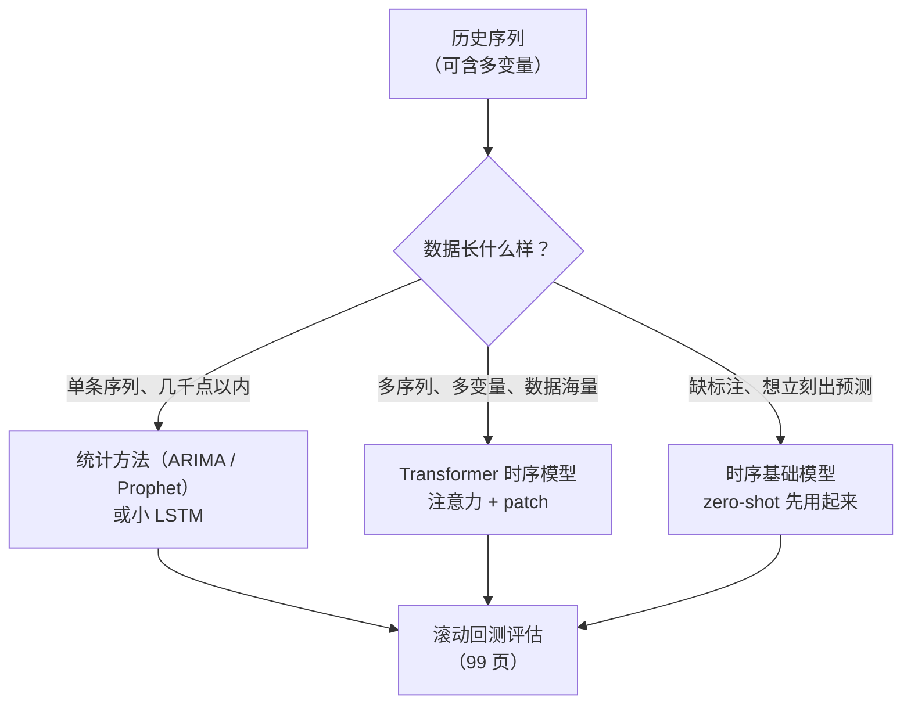
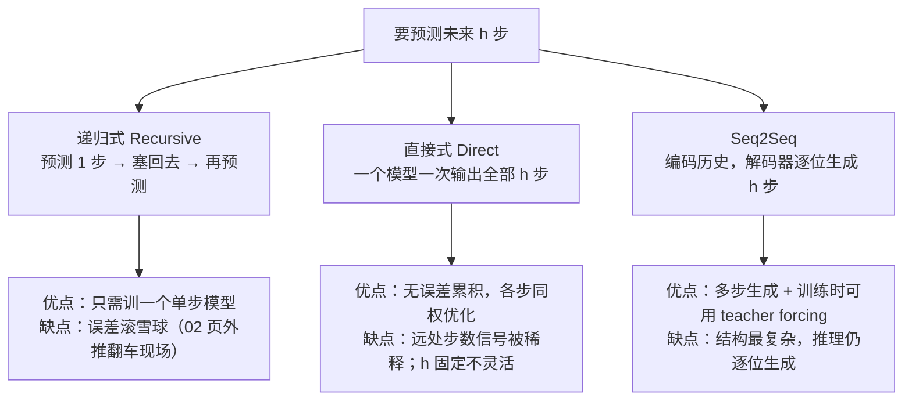

# 现代时间序列模型

> **一句话理解**：把 NLP 的成功配方——注意力、patch、预训练-微调——搬进时间轴：预测时自动回看最相关的历史，甚至"零样本"直接预测没见过的序列。

[⬆️ 返回总目录](../../../README.md) · [⬆️ 返回本篇](../README.md) · [⬅️ 返回本章目录](./README.md)

| 属性 | 说明 |
|------|------|
| 难度 | ⭐⭐⭐⭐（高阶） |
| 所属分支 | 时序 |
| 前置知识 | [02-RNN与LSTM](./02-RNN与LSTM.md)、[02-Transformer与注意力机制](../07-自然语言处理与LLM/02-Transformer与注意力机制.md) |

---

## 📌 这一节解决什么问题

LSTM 的瓶颈藏在它的结构里：**全部历史被压缩进一个固定大小的隐藏状态**。序列越长，压缩越狠——预测下月销量时，模型其实"记得"去年同月，只是那份记忆已经在几十次"重写笔记"中被磨平了。另外三个痛点：隐藏状态逐步递推，**无法并行训练**，数据一大训练就慢；多变量之间谁影响谁，模型说不清；长序列上注意力该看哪段，全靠隐式学习，难以检查。

NLP 那边早已给出答案（第 7 章）：**注意力让模型在预测时直接"回头翻"任意远的历史，翻哪页按相关性打分**。本页讲这套配方进时序后的三次升级：

1. **注意力进时序**：回看最相关历史，取代"压缩式记忆"；
2. **Patch 思想**：把连续时间点打包成"时间短语"（token），远房亲戚正是第 5 章的 ViT；
3. **时序基础模型**：在海量时序上预训练的大模型，对你的新序列可以**零样本（Zero-shot）**预测——预训练革命来到了时序世界。

同时要看清这套装备的**边界**：注意力有 O(L²) 的账单（Informer 用稀疏化来付）、zero-shot 在分布偏移面前没有魔法、协变量喂错类型会泄漏——本页的失败模式表就是为这些准备的。

## 🌱 通俗理解

LSTM 像**记性有限的老会计**：所有账目记在一本固定大小的本子里，越记越糊。注意力模型改成**开会查旧账**：要预测下个月，直接把近几年的账本全摊开，逐页问"这页和当下像不像"——去年同月（季节相同）、最近促销周（事件相同）这两页被翻得最多，权重最高；无关的月份少看。**记多少不再受本子厚度限制，看什么由相关性当场决定**，而且全场账目可以并行摊开（训练快）。

**Patch 思想**：逐点做注意力像逐字读书，太碎太慢；把连续十几个点**打包成"时间短语"**再处理——一天 24 个点变成"上午、下午、深夜"几个短语，序列长度骤减，短语内部自带局部形状，注意力在短语之间做全局调度。这正是 ViT 把图切成 patch 的时序版（第 5 章伏笔回收）。

**时序基础模型**像**见过百万条曲线的老师傅**：电力、交通、零售、网页流量……各行各业的曲线见得太多，你的新序列摆上来，它看一眼形状就能接着往下画——不用训练、不用标注，给历史就能出预测，这就是 zero-shot。类比 LLM 的"预训练一次、处处可用"，时序世界终于也走到了这一步。

## 📋 举个例子

预测下月（12 月）销量时，注意力可能这样分配（**示意**：真实权重由模型在数据上学出）：

| 历史时段 | 注意力权重（示意） | 为什么被看 |
|---|---|---|
| 去年 12 月 | 0.42 | 季节完全对齐：去年旺季的样子最能参考 |
| 最近促销周（11 月末） | 0.31 | 事件对齐：促销余温直接影响下月 |
| 上月（11 月） | 0.10 | 惯性：近期的水平基线 |
| 去年 11 月 | 0.09 | 季节对齐的次选参照 |
| 三个月前（9 月） | 0.08 | 淡季参考，权重最低 |

读表两个要点：**权重和为 1**（softmax 归一化，是一场"预算分配"）；权重不是按时间距离均匀衰减，而是**按"相似度"跳跃**——去年同月隔着 12 个月却拿走最大头，这在 LSTM 里几乎不可能（早被压缩磨平），正是注意力"翻旧账"的威力。

## 🧠 核心原理

### 整体流程



### 逐步拆解

**① 注意力进时序：打分—归一化—加权取材**

$$
\mathrm{Attention}(Q, K, V) = \mathrm{softmax}\!\left(\frac{QK^\top}{\sqrt{d}}\right)V
$$

> 👉 **人话**：拿"当前要预测的 query"给每段历史打相关分，softmax 把分数变成和为 1 的预算，再按预算加权混合各段历史的信息——上面那张权重表就是这个公式的输出。机制与文本注意力完全相同（详见[02-Transformer与注意力机制](../07-自然语言处理与LLM/02-Transformer与注意力机制.md)），只是"词与词"换成了"时刻与时刻"。

代价：任意两时刻都要打分，序列长 L 就是 L² 级的计算量——512 个点要算 26 万次两两打分，再长就爆了。

**② 代表模型：三个模型各付了一张账单**

- **Informer——稀疏注意力付"算力账"**。它的 **ProbSparse（概率稀疏）注意力**基于一个观察：长序列里**大多数 query 是"平凡"的**——它们对所有 key 的打分分布接近均匀（没有哪段历史特别值得看）；只有**少数 query 的分布是"尖锐"的**（确实有几个关键历史时刻）。Informer 用每个 query 的打分分布与均匀分布的差异（KL 散度）当"稀疏度"，挑出最活跃的 top-u 个 query 精算完整注意力，其余用一次乘积近似。**为什么成立**：时序里大部分时刻是"普通日子"，与谁都不特别相关；促销、尖峰、换季这类"事件时刻"才是值得细看的少数派——少数关键历史 × 少数活跃 query，O(L²) 就压到了 O(L log L)。一句话：**别让每个平凡的日子都去翻整本账**。

<details>
<summary>📊 展开：用两组打分分布感受"平凡 query"与"活跃 query"</summary>

把某个 query 对 4 个 key 的原始打分做 softmax，看两个极端（数字为示意）：

| query 类型 | 对 4 段历史的 softmax 权重 | 与均匀分布的差异 |
|---|---|---|
| 平凡日子（4 月里的一个普通周三） | [0.26, 0.24, 0.25, 0.25] | 几乎为零——翻谁都一样，精算是浪费 |
| 活跃时刻（大促前夜） | [0.62, 0.11, 0.05, 0.22] | 很大——明显在盯着"去年双 11 那段"看 |

KL 散度度量的正是第二列与均匀分布 [0.25, 0.25, 0.25, 0.25] 的差距：分布越尖，KL 越大，这个 query 越"值得细算"。ProbSparse 的流程于是很自然：先花小代价（对 key 随机采样）给每个 query 估一个"尖度"，只让 top-u 个尖 query 走完整注意力，平 query 共享一份近似结果。注意它稀疏的是 **query 侧**（哪些时刻需要细看），与稀疏 key（哪些历史值得被看）是互补的两种省法——后者更像"跳着翻账本"，前者是"只让关键页码进场"。

</details>
- **Autoformer——把统计直觉装进网络**：把 01 页的"趋势 + 季节分解"**内建进网络**，让注意力专注季节部分、卷积专注趋势部分——统计直觉与深度架构合体。
- **TFT（Temporal Fusion Transformer）——用可解释性付"信任账"**：变量选择 + 注意力权重**可解释**，多变量、已知未来输入（如已排期的促销）处理得干净——业务方"要说法"时的常客。

TFT 的可解释注意力怎么读——两级权重各回答一个问题：

| 权重层级 | 回答的问题 | 怎么用 |
|---|---|---|
| **变量级**（Variable Selection Weights） | "哪些输入变量此刻重要？"——价格 > 节假日 > 温度？ | 找出被浪费的采集成本（权重常年垫底的变量）；发现意外依赖（某变量突然变重要 = 数据或场景变了） |
| **时间级**（Temporal Attention Weights） | "预测主要参考了哪些历史时刻？"——去年同月还是最近一周？ | 验证模型有没有学到"业务常识"（零售该重季节、流量该重近期）；权重突变 = 模型行为漂移的早期信号 |

> 👉 **人话**：变量级权重是"**听谁的**"，时间级权重是"**翻哪页**"。注意二者都是**模型视角的相关性参考，不是因果证据**——要回答"促销到底涨了多少销量"，得去[第 11 章因果推断](../11-因果推断/README.md)。

**③ Patch 思想：时间点打包成"时间短语"**

$$
N = \frac{L - P}{S} + 1
$$

> 👉 **人话**：序列长 L、每包连续 P 个点、隔 S 取一包，共 N 个 patch token。512 个点按 P=16、S=8 打包，得到 63 个 token——两两打分从 512² ≈ 26 万次降到 63² ≈ 4 千次，开销直降六十多倍；且每个 token 自带局部形状，注意力做的是"短语之间"的调度。

Patch 化的信息打包直觉（与 ViT 逐条对照）：

| | ViT（图像） | 时序 patch |
|---|---|---|
| 打包对象 | 16×16 像素块 | 连续 16 个时间点 |
| token 自带什么 | 局部纹理（边、角、色块） | 局部形状（一周的走势、一个尖峰的轮廓） |
| 换来什么 | 196 个 token 替代 50176 个像素 | 63 个 token 替代 512 个点 |
| 找回了什么 | 局部性先验（相邻像素一起看） | 局部形状先验（相邻点一起看）——深度模型最缺的归纳偏置被"手动打包"了回来 |
| 副作用 | 细于 patch 的细节（细缝）丢失 | 短于 patch 的微事件可能被平均掉 |

一句话：**patch 是把 CNN 的局部归纳偏置，以"预处理"的方式还给 Transformer**——这也是 PatchTST 一代模型比逐点 Transformer 显著提分的核心原因之一。

**④ 时序基础模型（Foundation Model）**

TimesFM、Chronos、Moirai 等：在**海量多元的时序语料**（百万级曲线）上预训练一个 decoder，输入任意新序列的历史，直接输出未来——**不用在你的数据上训练（zero-shot）**，或少量的微调即可更上一层。类比 LLM：预训练吃下全世界的曲线规律，推理时"接着画"。

**zero-shot 的边界**（什么时候没有魔法）：

| 情形 | zero-shot 表现 | 应对 |
|---|---|---|
| 常见形状：趋势 + 周期 + 节假日模式 | 通常不错，常直接打赢从零训练的小模型 | 放心先用，但照旧回测 |
| 分布偏移：新政策、新市场、突发事件 | **退化**——预训练语料里没有这段规律 | 回到自训/微调 + 人工判断与监控 |
| 新变量：预训练没见过的协变量（如你的独有特征） | 用不上（多数基础模型只吃目标序列历史） | 需要变量融合时自训（TFT/GBRT），或选支持协变量的模型微调 |
| 特殊领域：电网高频波形、医疗生理信号 | 域差距大，泛化打折 | 领域内自训常仍是更优解 |
| 频率/粒度不匹配（月度 vs 分钟） | 部分模型多粒度支持，仍建议按文档对齐 | 上下文长度、频率按模型要求喂 |

> 👉 **人话**：zero-shot 的本钱是"见多识广"——见过的形状会画，没见过的形状不会无中生有。**何时仍需自训**：领域特殊性强、需要融合自家协变量、对延迟/边缘部署有硬要求、或合规不允许数据出域。务实路线是"zero-shot 起步当基线 → 回测 → 不达标再自训"，而不是二选一站队。

**⑤ 分位数损失：产出预测区间的新引擎**

01 页说过正态假设下的预测区间在厚尾面前会失真，深度模型的解法是直接**优化分位数**：

$$
L_q(y, \hat{y}) = \max\big(q \cdot (y - \hat{y}),\;\; (q - 1) \cdot (y - \hat{y})\big), \qquad q \in (0, 1)
$$

> 👉 **人话**：预测偏低（y > ŷ）罚 q 份，预测偏高（y < ŷ）罚 (1−q) 份。q = 0.9 时，低报 10 件的代价是高报 10 件的 9 倍——训练出来的模型会系统性地"宁可多报"，于是 P90 分位预测天然成了备货线。三个分位（P10/P50/P90）各训一个头，就有了不依赖任何分布假设的预测区间。这正是 99 页"补货看分位数"的模型侧实现。

<details>
<summary>📊 展开：一条 SKU 的三分位预测怎么读</summary>

模型对某 SKU 下周输出三个数：

| 分位 | 预测值 | 业务含义 |
|---|---|---|
| P10 | 62 件 | 悲观线：只有 10% 的概率卖得比这更差——清库存/促销决策的参考 |
| P50 | 85 件 | 中位数：最"稳"的那个数——报表、排产的默认口径 |
| P90 | 128 件 | 乐观线：90% 的概率卖不到这以上——备货按它订才把缺货率压到 10% |

三件事可以从这三个数读出来：

1. **点预测选哪个看用途**：备货看 P90、报计划看 P50——同一个模型，不同业务口各取所需；
2. **区间宽度 = 不确定性仪表盘**：(P90 − P10) / P50 = (128−62)/85 ≈ 78%，这条 SKU 的波动很大，安全库存该多留；对比另一条区间比仅 15% 的成熟品，补货策略应完全不同；
3. **覆盖率是质检指标**：长期统计"真实值落在 P10~P90 之间的比例"，理论上应接近 80%——实测只有 65% 说明模型过度自信（区间画窄了），回头调分位头的训练（99 页监控表里有这一行）。

</details>

**⑥ 协变量类型表：喂模型前先给变量"验明正身"**

| 类型 | 定义 | 例子 | 使用要点 |
|---|---|---|---|
| **已知未来** | 未来值现在就能确定 | 节假日日历、已排期促销、计划价格 | 可以放心喂给模型参与预测未来 |
| **需预测** | 未来值本身未知 | 未来天气、竞争对手未来销量 | 直接把"未来真值"喂进训练 = 泄漏；要么用预报值并标注不确定性，要么让模型自己预测 |
| **静态** | 不随时间变 | 门店城市、SKU 类目、仓库容量 | 当作每条序列的"身份证"，供模型跨序列共享规律（TFT 有专门静态输入口） |

> 👉 **人话**：这张表防的是泄漏家族的头号惯犯——把"需预测"变量未来的真实值混进特征（离线分数好得离谱，上线寸步难行）。喂变量前问一句：**"这个值在预测那天，我真的知道吗？"**

**⑦ 多步预测的三种策略：模型怎么"走"到第 h 步**

预测未来 28 天，不是"预测 1 天"的简单放大。三种走法各有病根：



> 👉 **人话**：递归式是"走一步看一步"，容易越走越歪（02 页自回归外推就是它，误差滚雪球）；直接式是"一口报出 28 天"，步数固定、一步到位但远期学得吃力；Seq2Seq 是"先读懂历史再逐位往下写"，现代 Transformer 时序模型（Informer、PatchTST 一代）的主流姿势——**训练时用真实历史当"参考答案"扶着写（teacher forcing），推理时才真正自己写**。选型提示：horizon 短（1~7 步）递归式简单够用；horizon 长（周/月级）优先直接式或 Seq2Seq，并直接用分位数损失出各步区间。

**⑧ LSTM vs Transformer 时序对比**

| 维度 | LSTM / GRU | Transformer 时序 |
|---|---|---|
| 看历史的方式 | 压缩进隐藏状态，逐点递推 | 注意力直接回看任意远的历史 |
| 数据量 | 几百~几千条也能训 | 数据充足才发力，小数据易过拟合 |
| 多变量关系 | 能吃但说不清 | 可解释权重（TFT 类）看得见 |
| 长依赖 | 数百步后稀释 | 理论上任意远（稀疏/patch 压开销） |
| 训练并行 | 不行（必须逐步递推） | 行，GPU 吃满 |
| 算力与部署 | 轻量，边缘友好 | 重，需压缩部署 |
| 典型场景 | 小数据、流式、边缘 | 海量多变量、长序列、要可解释 |

## 💻 动手试试

```python
import numpy as np

# 1. 24 个月销量：明显的年度季节（冬季旺、夏季淡）
sales = np.array([82, 75, 68, 60, 55, 58, 62, 66, 70, 76, 88, 105,
                  85, 78, 70, 63, 57, 60, 65, 69, 74, 80, 92, 110], dtype=float)

# 2. 用最近 3 个月构成「当前状态」（query）；历史上每个点用它前面 3 个月做「记忆」（key），
#    该记忆的 value = 它的下一个月销量 → 注意力加权平均就是对第 25 个月的预测
def embed(x, i, L=3):
    return x[i - L + 1: i + 1]          # 以 i 结尾、长度 L 的窗口

q = embed(sales, 23)                     # 当前状态 = [80, 92, 110]
K = np.array([embed(sales, i) for i in range(3, 23)])
V = np.array([sales[i + 1] for i in range(3, 23)])        # 每条记忆的「答案」
names = [f"第{i + 1}月" for i in range(3, 23)]

# 3. 余弦相似度打分，除以温度 0.002 放大差距，softmax 归一化
cos = (K @ q) / (np.linalg.norm(K, axis=1) * np.linalg.norm(q))
logits = cos / 0.002
weights = np.exp(logits - logits.max())
weights /= weights.sum()                                  # 权重和为 1
pred = weights @ V                                        # 加权平均出预测

top = weights.argsort()[::-1][:3]
print("注意力最重的三段历史：")
for j in top:
    print(f"  {names[j]:<6s} 权重 {weights[j]:.2f}   该月的下月销量 {V[j]:.0f}")
print(f"第 25 个月销量预测：{pred:.1f}")

# 预期输出：权重最大的记忆集中在「第 12 月」附近（去年年底——形状与当前最像），
# 预测值约 85~95：模型"翻回去年同月"，知道 1 月该从 110 回落。
# 注：这里直接用原始窗口算相似度，只为看清「注意力回看历史」这一件事；
# 真实 Transformer 的 Q/K/V 由可学习投影生成，权重分布更丰富。

# 4. 分位数损失：不同 q 下"高报/低报"的代价不对称，模型学会偏向一侧
def quantile_loss(q, y, yhat):
    e = y - yhat
    return max(q * e, (q - 1) * e)

for yhat in (90, 110):
    print(f"真实 100，预测 {yhat}：q=0.5 损失 {quantile_loss(0.5, 100, yhat):.0f}"
          f" | q=0.9 损失 {quantile_loss(0.9, 100, yhat):.0f}"
          f" | q=0.1 损失 {quantile_loss(0.1, 100, yhat):.0f}")
# 预期输出：
# 真实 100，预测 90： q=0.9 损失 9，q=0.1 损失 1
# 真实 100，预测 110：q=0.9 损失 1，q=0.1 损失 9
# 读法：q=0.9 时低报的罚是高报的 9 倍 → 训出来的 P90 预测系统性偏高——正是"备货线"要的偏法；
#       q=0.1 反过来，P10 就是"清仓线"；q=0.5 退化为绝对值误差（MAE），对应中位数预测。
```

**改什么参数，看什么变化**：

- 温度 0.002 → 0.02：softmax 变"软"，权重趋近均匀，预测滑向全历史平均——温度就是"注意力有多挑剔"的旋钮；
- 窗口 L=3 → 6：query 与 key 的"形状指纹"更长，匹配更严格（更挑季节）但也更难遇到完全像的；
- `sales` 里第 12 月改成 60（抹掉去年旺季）：注意力失去"去年同月"可翻，预测明显回落——亲手验证"模型的本事全在历史里"。

## 🩺 失败模式速查（何时不 work）

| 症状 | 病因 | 诊断 | 补救 |
|---|---|---|---|
| zero-shot 上线后误差远超回测 | 分布偏移：新政策/新市场形状没见过 | 把目标序列与模型文档里的训练域对比（频率、量级、季节形态） | 微调或自训；加监控与人工兜底 |
| 离线分数好到离谱，上线崩 | 协变量泄漏：把"需预测"变量的未来真值喂进了特征 | 逐特征问"预测当天我真的知道这个值吗"；按时间切分重估 | 泄漏变量改为预报值或让模型自预测 |
| patch 模型对短促尖峰（闪购一小时）不敏感 | 尖峰短于 patch 长度，被"打包"平均掉 | 对比 patch 前后尖峰时刻的输入表示 | 缩短 patch/加密采样；尖峰单独建事件特征 |
| Transformer 小数据上不如 LSTM | 数据量撑不起缺归纳偏置的架构 | 对比同样本量下 LSTM 基线 | 回 LSTM/统计；或借用预训练权重（基础模型微调） |
| 多变量模型精度反而低于单变量 | 噪声变量稀释了注意力、变量选择没做 | 查 TFT 变量级权重：垫底变量一堆 | 做变量选择/剔除；单独训练对照排查 |

## 🔥 炼丹小灶

> 🔥 **炼丹小灶**：工业界常用起点配方与玄学——
> - 配方：Transformer 时序先归一化（逐序列标准化几乎必做）；patch 长 16、步幅 8、d_model 64~128 起步；AdamW + 学习率 warmup + 早停；数据点不足一万别硬上，先 LSTM/统计。
> - 玄学：多变量"全喂进去"常不如"先做变量选择"；基础模型 zero-shot 不达预期时，先查输入格式（频率、上下文长度），再考虑微调；要预测区间就上分位数损失，别在正态假设里硬撑。
> - ⚠️ 以上是经验参考值，不是圣旨；换数据集请重新炼。

## 🖱️ 动手玩

> 🎮 **本库实验场**：[注意力热力图](../../../playground/attention.html)——同样的注意力机制，文本里看"词关注词"，时序里就是"月关注月"。
> 🕹️ **延伸玩一玩**：[Transformer Explainer](https://poloclub.github.io/transformer-explainer/)——逐层拆解注意力计算，本页所有模型的"发动机"都是它。

## 🔗 在知识树中的位置

- **上游**：[02-Transformer与注意力机制](../07-自然语言处理与LLM/02-Transformer与注意力机制.md)（架构内核）；[02-RNN与LSTM](./02-RNN与LSTM.md)（被挑战的前任，也是理解升级动机的参照）。
- **下游**：本章[生产实战](./99-生产实战.md)——本页的选型决策图在 99 页变成真实选型表；时序基础模型是"预训练-微调"范式在时序的落地，与 LLM 的范式同源（第 7 章）。
- **横向呼应**：Patch 思想来自 [03-ViT视觉Transformer](../05-计算机视觉/03-ViT视觉Transformer.md)——"图切块"与"时序打包"是同一招；分位数损失回应 01 页"正态区间失真"的坑。

## ⚠️ 常见误区

- **误区一**："Transformer 时序全面碾压 LSTM" → 小数据场景常被 LSTM/GRU 反杀；Transformer 的优势要在数据量、变量数、序列长度上来之后才兑现。
- **误区二**："基础模型 zero-shot = 万能预测" → 训练分布外的突变（新品类、新政策）没有魔法；拿不到历史的新品依旧冷启动（99 页的坑清单）。
- **误区三**："注意力权重就是因果解释" → 权重说明"模型在看谁"，是相关性参考，不是因果证据——要回答"促销到底有没有用"，得去[第 11 章因果推断](../11-因果推断/README.md)。
- **误区四**："多变量喂得越多越好" → 噪声变量稀释注意力、泄漏变量污染评估；先过协变量类型表，再做变量选择。

## 📝 小结与自测

**要点回顾**

- 注意力把"压缩式记忆"换成"预测时回看最相关历史"，权重和为 1、按相似度跳跃分配；
- Informer 的 ProbSparse 付算力账（少数活跃 query × 少数关键历史，O(L²) → O(L log L)）；Autoformer 把分解内建进网络；TFT 付信任账（变量级=听谁的、时间级=翻哪页，皆为相关性非因果）；
- Patch 把连续点打包成 token：L² 开销骤降、局部形状先验"手动打包"回来（ViT 的时序方言）；
- 时序基础模型 zero-shot 的边界：见过的形状会画、没见的不会无中生有；特殊领域、独有协变量、硬延迟要求下仍需自训；
- 分位数损失：低报罚 q 份、高报罚 (1−q) 份，产出不依赖正态假设的预测区间；协变量先分三类（已知未来/需预测/静态）再喂；
- 选型看数据量与变量数，小数据仍是统计/LSTM 的天下。

**自测一下**（点击展开答案）

<details>
<summary>问题 1：512 点的序列按 patch 长 16、步幅 8 打包，得到几个 token？比逐点注意力省多少？</summary>

(512−16)/8 + 1 = **63** 个 token。逐点两两打分 512² ≈ 26 万次，打包后 63² ≈ 4 千次——约六十分之一。

</details>

<details>
<summary>问题 2：什么信号出现时，你该从统计/LSTM 切到 Transformer 时序模型？</summary>

至少两条同时成立：多条序列、多变量规模大（成百上千条 SKU/传感器）；序列长或依赖远（季度级周期要跨一年回看）；算力允许且需要并行训练；业务需要可解释的变量/时段权重。只满足"想显得先进"不算。

</details>

<details>
<summary>问题 3：q = 0.9 的分位数损失下，真实 100、预测 90 与预测 110 的损失各是多少？说明什么？</summary>

预测 90（低报）：损失 = 0.9×10 = 9；预测 110（高报）：损失 = 0.1×10 = 1。低报的罚是高报的 9 倍，训练会把 P90 预测推向系统性偏高——这正是备货线要的"宁可多备"。

</details>

<details>
<summary>问题 4：TFT 的变量级权重显示"价格"常年重要，能得出"降价能提销量"的结论吗？</summary>

不能。权重只说明"模型预测时参考了价格"，是相关性参考；"降价 → 提销量"是因果命题，需要[第 11 章因果推断](../11-因果推断/README.md)的方法（控制混杂、反事实估计）才能回答。

</details>

## 📚 延伸阅读

- 论文：Zhou et al., *Informer*（2021，ProbSparse）；Wu et al., *Autoformer*（2021）；Lim et al., *Temporal Fusion Transformers*（2020）；Nie et al., *A Time Series is Worth 64 Words*（PatchTST, 2023）
- 基础模型：TimesFM、Chronos、Moirai 的技术报告（预训练数据、zero-shot 评测）
- 综述可搜"time series foundation models survey"（2024 年起多份）

---

[⬅️ 上一页：RNN 与 LSTM](./02-RNN与LSTM.md) · [返回本章目录](./README.md) · [下一页：生产实战 ➡️](./99-生产实战.md)
