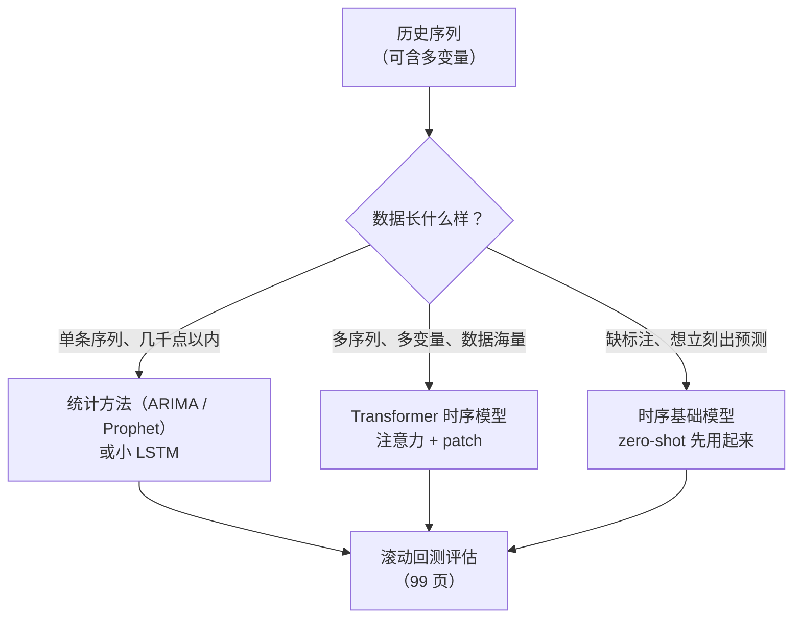

# 现代时间序列模型

> **一句话理解**：把 NLP 的成功配方——注意力、patch、预训练-微调——搬进时间轴：预测时自动回看最相关的历史，甚至"零样本"直接预测没见过的序列。

[⬆️ 返回总目录](../../../README.md) · [⬆️ 返回本篇](../README.md) · [⬅️ 返回本章目录](./README.md)

| 属性 | 说明 |
|------|------|
| 难度 | ⭐⭐⭐⭐（高阶） |
| 所属分支 | 时序 |
| 前置知识 | [02-RNN与LSTM](./02-RNN与LSTM.md)、[02-Transformer与注意力机制](../07-自然语言处理与LLM/02-Transformer与注意力机制.md) |

---

## 📌 这一节解决什么问题

LSTM 的瓶颈藏在它的结构里：**全部历史被压缩进一个固定大小的隐藏状态**。序列越长，压缩越狠——预测下月销量时，模型其实"记得"去年同月，只是那份记忆已经在几十次"重写笔记"中被磨平了。另外三个痛点：隐藏状态逐步递推，**无法并行训练**，数据一大训练就慢；多变量之间谁影响谁，模型说不清；长序列上注意力该看哪段，全靠隐式学习，难以检查。

NLP 那边早已给出答案（第 7 章）：**注意力让模型在预测时直接"回头翻"任意远的历史，翻哪页按相关性打分**。本页讲这套配方进时序后的三次升级：

1. **注意力进时序**：回看最相关历史，取代"压缩式记忆"；
2. **Patch 思想**：把连续时间点打包成"时间短语"（token），远房亲戚正是第 5 章的 ViT；
3. **时序基础模型**：在海量时序上预训练的大模型，对你的新序列可以**零样本（Zero-shot）**预测——预训练革命来到了时序世界。

## 🌱 通俗理解

LSTM 像**记性有限的老会计**：所有账目记在一本固定大小的本子里，越记越糊。注意力模型改成**开会查旧账**：要预测下个月，直接把近几年的账本全摊开，逐页问"这页和当下像不像"——去年同月（季节相同）、最近促销周（事件相同）这两页被翻得最多，权重最高；无关的月份少看。**记多少不再受本子厚度限制，看什么由相关性当场决定**，而且全场账目可以并行摊开（训练快）。

**Patch 思念**：逐点做注意力像逐字读书，太碎太慢；把连续十几个点**打包成"时间短语"**再处理——一天 24 个点变成"上午、下午、深夜"几个短语，序列长度骤减，短语内部自带局部形状，注意力在短语之间做全局调度。这正是 ViT 把图切成 patch 的时序版（第 5 章伏笔回收）。

**时序基础模型**像**见过百万条曲线的老师傅**：电力、交通、零售、网页流量……各行各业的曲线见得太多，你的新序列摆上来，它看一眼形状就能接着往下画——不用训练、不用标注，给历史就能出预测，这就是 zero-shot。类比 LLM 的"预训练一次、处处可用"，时序世界终于也走到了这一步。

## 📋 举个例子

预测下月（12 月）销量时，注意力可能这样分配（**示意**：真实权重由模型在数据上学出）：

| 历史时段 | 注意力权重（示意） | 为什么被看 |
|---|---|---|
| 去年 12 月 | 0.42 | 季节完全对齐：去年旺季的样子最能参考 |
| 最近促销周（11 月末） | 0.31 | 事件对齐：促销余温直接影响下月 |
| 上月（11 月） | 0.10 | 惯性：近期的水平基线 |
| 去年 11 月 | 0.09 | 季节对齐的次选参照 |
| 三个月前（9 月） | 0.08 | 淡季参考，权重最低 |

读表两个要点：**权重和为 1**（softmax 归一化，是一场"预算分配"）；权重不是按时间距离均匀衰减，而是**按"相似度"跳跃**——去年同月隔着 12 个月却拿走最大头，这在 LSTM 里几乎不可能（早被压缩磨平），正是注意力"翻旧账"的威力。

## 🧠 核心原理

### 整体流程



### 逐步拆解

**① 注意力进时序：打分—归一化—加权取材**

$$
\mathrm{Attention}(Q, K, V) = \mathrm{softmax}\!\left(\frac{QK^\top}{\sqrt{d}}\right)V
$$

> 👉 **人话**：拿"当前要预测的query"给每段历史打相关分，softmax 把分数变成和为 1 的预算，再按预算加权混合各段历史的信息——上面那张权重表就是这个公式的输出。机制与文本注意力完全相同（详见[02-Transformer与注意力机制](../07-自然语言处理与LLM/02-Transformer与注意力机制.md)），只是"词与词"换成了"时刻与时刻"。

代价：任意两时刻都要打分，序列长 L 就是 L² 级的计算量——512 个点要算 26 万次两两打分，再长就爆了。

**② 代表模型一句话级**

- **Informer**：稀疏注意力——只挑得分最高的少数时刻细看，近似提速，长序列（几百上千点）可训可推；
- **Autoformer**：把 01 页的"趋势 + 季节分解"**内建进网络**，让注意力专注季节部分、卷积专注趋势部分——统计直觉与深度架构合体；
- **TFT（Temporal Fusion Transformer）**：变量选择 + 注意力权重**可解释**，多变量、已知未来输入（如已排期的促销）处理得干净——业务方"要说法"时的常客。

**③ Patch 思想：时间点打包成"时间短语"**

$$
N = \frac{L - P}{S} + 1
$$

> 👉 **人话**：序列长 L、每包连续 P 个点、隔 S 取一包，共 N 个 patch token。512 个点按 P=16、S=8 打包，得到 63 个 token——两两打分从 512² ≈ 26 万次降到 63² ≈ 4 千次，开销直降六十多倍；且每个 token 自带局部形状，注意力做的是"短语之间"的调度。与 ViT 把 224×224 图切成 196 块 patch（[03-ViT视觉Transformer](../05-计算机视觉/03-ViT视觉Transformer.md)）是同一个思想的两种方言。

**④ 时序基础模型（Foundation Model）**

TimesFM、Chronos、Moirai 等：在**海量多元的时序语料**（百万级曲线）上预训练一个decoder，输入任意新序列的历史，直接输出未来——**不用在你的数据上训练（zero-shot）**，或少量的微调即可更上一层。类比 LLM：预训练吃下全世界的曲线规律，推理时"接着画"。适用判断见下方对比与决策图；注意事项：对**训练分布外**的突变（新政策、新物种产品）没有魔法，仍需人工判断与监控。

**⑤ LSTM vs Transformer 时序对比**

| 维度 | LSTM / GRU | Transformer 时序 |
|---|---|---|
| 看历史的方式 | 压缩进隐藏状态，逐点递推 | 注意力直接回看任意远的历史 |
| 数据量 | 几百~几千条也能训 | 数据充足才发力，小数据易过拟合 |
| 多变量关系 | 能吃但说不清 | 可解释权重（TFT 类）看得见 |
| 长依赖 | 数百步后稀释 | 理论上任意远（稀疏/patch 压开销） |
| 训练并行 | 不行（必须逐步递推） | 行，GPU 吃满 |
| 算力与部署 | 轻量，边缘友好 | 重，需压缩部署 |
| 典型场景 | 小数据、流式、边缘 | 海量多变量、长序列、要可解释 |

## 💻 动手试试

```python
import numpy as np

# 1. 24 个月销量：明显的年度季节（冬季旺、夏季淡）
sales = np.array([82, 75, 68, 60, 55, 58, 62, 66, 70, 76, 88, 105,
                  85, 78, 70, 63, 57, 60, 65, 69, 74, 80, 92, 110], dtype=float)

# 2. 用最近 3 个月构成「当前状态」（query）；历史上每个点用它前面 3 个月做「记忆」（key），
#    该记忆的 value = 它的下一个月销量 → 注意力加权平均就是对第 25 个月的预测
def embed(x, i, L=3):
    return x[i - L + 1: i + 1]          # 以 i 结尾、长度 L 的窗口

q = embed(sales, 23)                     # 当前状态 = [80, 92, 110]
K = np.array([embed(sales, i) for i in range(3, 23)])
V = np.array([sales[i + 1] for i in range(3, 23)])        # 每条记忆的「答案」
names = [f"第{i + 1}月" for i in range(3, 23)]

# 3. 余弦相似度打分，除以温度 0.002 放大差距，softmax 归一化
cos = (K @ q) / (np.linalg.norm(K, axis=1) * np.linalg.norm(q))
logits = cos / 0.002
weights = np.exp(logits - logits.max())
weights /= weights.sum()                                  # 权重和为 1
pred = weights @ V                                        # 加权平均出预测

top = weights.argsort()[::-1][:3]
print("注意力最重的三段历史：")
for j in top:
    print(f"  {names[j]:<6s} 权重 {weights[j]:.2f}   该月的下月销量 {V[j]:.0f}")
print(f"第 25 个月销量预测：{pred:.1f}")

# 预期输出：权重最大的记忆集中在「第 12 月」附近（去年年底——形状与当前最像），
# 预测值约 85~95：模型"翻回去年同月"，知道 1 月该从 110 回落。
# 注：这里直接用原始窗口算相似度，只为看清「注意力回看历史」这一件事；
# 真实 Transformer 的 Q/K/V 由可学习投影生成，权重分布更丰富。
```

## 🔥 炼丹小灶

> 🔥 **炼丹小灶**：工业界常用起点配方与玄学——
> - 配方：Transformer 时序先归一化（逐序列标准化几乎必做）；patch 长 16、步幅 8、d_model 64~128 起步；AdamW + 学习率 warmup + 早停；数据点不足一万别硬上，先 LSTM/统计。
> - 玄学：多变量"全喂进去"常不如"先做变量选择"；基础模型 zero-shot 不达预期时，先查输入格式（频率、上下文长度），再考虑微调。
> - ⚠️ 以上是经验参考值，不是圣旨；换数据集请重新炼。

## 🖱️ 动手玩

> 🎮 **本库实验场**：[注意力热力图](../../../playground/attention.html)——同样的注意力机制，文本里看"词关注词"，时序里就是"月关注月"。
> 🕹️ **延伸玩一玩**：[Transformer Explainer](https://poloclub.github.io/transformer-explainer/)——逐层拆解注意力计算，本页所有模型的"发动机"都是它。

## 🔗 在知识树中的位置

- **上游**：[02-Transformer与注意力机制](../07-自然语言处理与LLM/02-Transformer与注意力机制.md)（架构内核）；[02-RNN与LSTM](./02-RNN与LSTM.md)（被挑战的前任，也是理解升级动机的参照）。
- **下游**：本章[生产实战](./99-生产实战.md)——本页的选型决策图在 99 页变成真实选型表；时序基础模型是"预训练-微调"范式在时序的落地，与 LLM 的范式同源（第 7 章）。
- **横向呼应**：Patch 思想来自 [03-ViT视觉Transformer](../05-计算机视觉/03-ViT视觉Transformer.md)——"图切块"与"时序打包"是同一招。

## ⚠️ 常见误区

- **误区一**："Transformer 时序全面碾压 LSTM" → 小数据场景常被 LSTM/GRU 反杀；Transformer 的优势要在数据量、变量数、序列长度上来之后才兑现。
- **误区二**："基础模型 zero-shot = 万能预测" → 训练分布外的突变（新品类、新政策）没有魔法；拿不到历史的新品依旧冷启动（99 页的坑清单）。
- **误区三**："注意力权重就是因果解释" → 权重说明"模型在看谁"，是相关性参考，不是因果证据——要回答"促销到底有没有用"，得去[第 11 章因果推断](../11-因果推断/README.md)。

## 📝 小结与自测

**要点回顾**

- 注意力把"压缩式记忆"换成"预测时回看最相关历史"，权重和为 1、按相似度跳跃分配；
- Informer 稀疏注意力提速；Autoformer 把趋势季节分解内建进网络；TFT 可解释多变量；
- Patch 把连续点打包成 token：L² 开销骤降、局部形状自带（ViT 的时序方言）；
- 时序基础模型海量预训练、zero-shot 预测；选型看数据量与变量数，小数据仍是统计/LSTM 的天下。

**自测一下**（点击展开答案）

<details>
<summary>问题 1：512 点的序列按 patch 长 16、步幅 8 打包，得到几个 token？比逐点注意力省多少？</summary>

(512−16)/8 + 1 = **63** 个 token。逐点两两打分 512² ≈ 26 万次，打包后 63² ≈ 4 千次——约六十分之一。

</details>

<details>
<summary>问题 2：什么信号出现时，你该从统计/LSTM 切到 Transformer 时序模型？</summary>

至少两条同时成立：多条序列、多变量规模大（成百上千条 SKU/传感器）；序列长或依赖远（季度级周期要跨一年回看）；算力允许且需要并行训练；业务需要可解释的变量/时段权重。只满足"想显得先进"不算。

</details>

## 📚 延伸阅读

- 论文：Zhou et al., *Informer*（2021）；Wu et al., *Autoformer*（2021）；Lim et al., *Temporal Fusion Transformers*（2020）；Nie et al., *A Time Series is Worth 64 Words*（PatchTST, 2023）
- 基础模型：TimesFM、Chronos、Moirai 的技术报告（预训练数据、zero-shot 评测）
- 综述可搜"time series foundation models survey"（2024 年起多份）

---

[⬅️ 上一页：RNN 与 LSTM](./02-RNN与LSTM.md) · [返回本章目录](./README.md) · [下一页：生产实战 ➡️](./99-生产实战.md)
