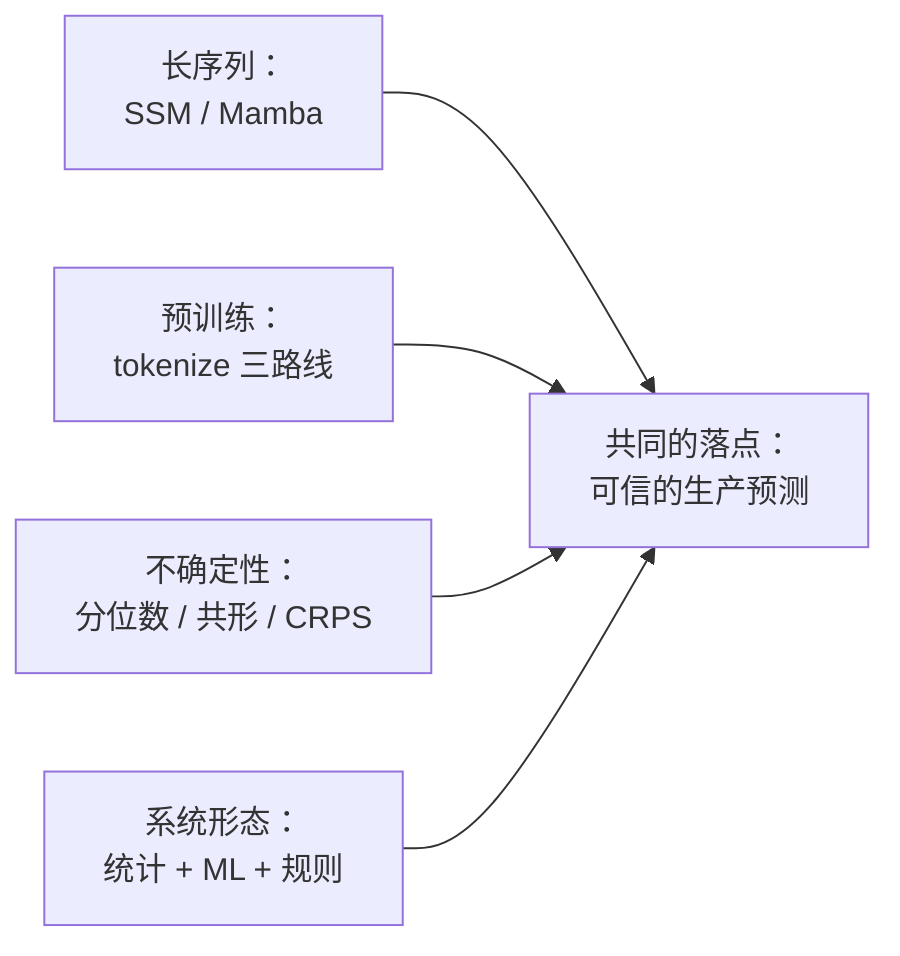
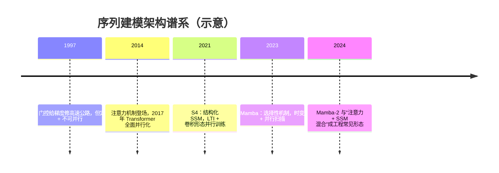
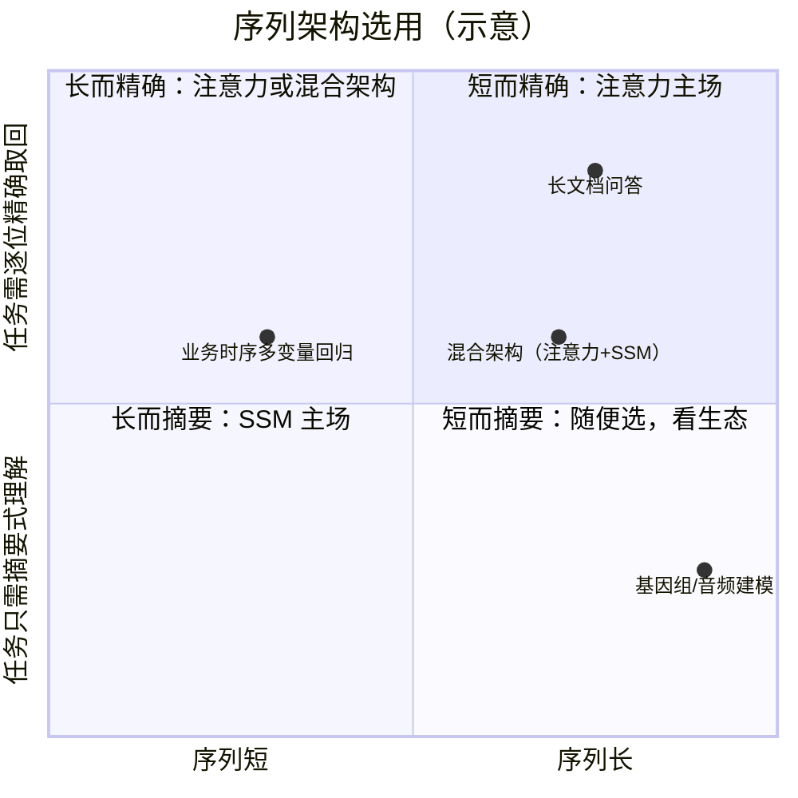
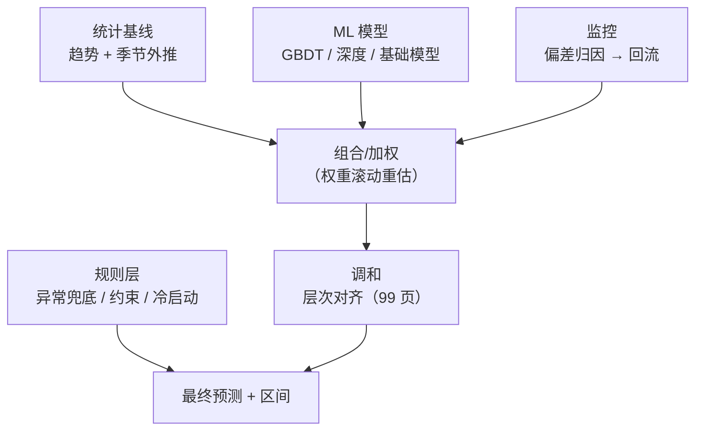

# 进阶专题：序列建模前沿

> **一句话理解**：序列建模的四条前沿线——用状态空间模型给长序列"装聪明的记忆"、把"下一词预测"的配方搬进时序、把预测从"一个数"升级成"一条分布"、承认顶级预测系统常是统计 + ML + 规则的合奏。

[⬆️ 返回总目录](../../../README.md) · [⬆️ 返回本篇](../README.md) · [⬅️ 返回本章目录](./README.md)

| 属性 | 说明 |
|------|------|
| 难度 | ⭐⭐⭐⭐（高阶） |
| 所属分支 | 时序 |
| 前置知识 | [时间序列分析入门](./01-时间序列分析入门.md)、[RNN 与 LSTM](./02-RNN与LSTM.md)、[现代时间序列模型](./03-现代时间序列模型.md) |

---

## 📌 这一节解决什么问题

前三页走完了"统计方法 → 循环网络 → Transformer"的主线，每一代都在为同两个问题打工：**长序列怎么办**（历史越长、依赖越远，注意力账单越大、循环状态丢得越多）与**范式怎么迁移**（NLP 的预训练革命在时序到底走到哪一步了）。本页收拢四条前沿线：

1. **SSM/Mamba 谱系**：在"注意力 O(n²) 太贵"与"RNN 压缩丢信息"的两难之间，状态空间模型（State Space Model, SSM）给出第三条路——它的核心一句话：**线性时不变系统打底 + 选择性机制让记忆可取舍**；
2. **时序基础模型的训练方式**：把"下一词预测"搬进时序，第一道关卡居然是"值怎么变 token"——缩放、量化、patch 三条 tokenize 路线各有账单；
3. **概率预测**：分位数回归再深一层（与第 3 章评估思想的呼应：区间预测有"学形状"与"保覆盖"两条路线），概率预测怎么打分（CRPS）；
4. **生产混合系统**：为什么顶级预测系统常是"统计 + ML + 规则"的 ensemble，而不是某一个单一深度模型——这不是保守，是概率与工程的双重正确。

## 🌱 通俗理解

四句话先行：

- **SSM 像"带阀门的水箱系统"**：水位（状态）一边渗漏一边进水，进来多少、漏掉多少由阀门决定；Mamba 的进步是**阀门开度看输入脸色**——重要的输入把阀门开大猛记，无关的输入把阀门关小让它流走，这就是"选择性"。
- **tokenize 像"把曲线翻译成方言"**：时序基础模型都得先把连续曲线变成模型爱吃的"词"——有人逐值念数字（量化成词表）、有人报小数（连续回归）、有人念短语（patch 打包）。
- **概率预测像"从报一个数到报一条分布"**：好预报员不说"明天 25 度"，而说"七成 23~27 度，一成冲上 30 度"——分布里同时装着判断（中心）与底气（宽窄）。
- **混合系统像"专家会诊"**：统计模型是老中医（外推稳、懂季节）、机器学习是检验科（吃得起高维交互）、规则是主刀医生（拍板兜底、守住合规）——会诊常胜过任何单科名医。

## 🗺️ 本页地图



## 📋 举个例子

用一个 3 步递推感受"水箱"（线性时不变系统的离散形态）。设状态（水位）$x$，输入（进水）$u$，更新规则 $x_k = 0.5\,x_{k-1} + u_k$（每步漏掉一半），观察 $y_k = x_k$（水箱全透明）：

| 步 | 输入 u | 计算 | 状态 x（水位） |
|---|---|---|---|
| 1 | 2 | 0.5×0 + 2 | 2.0 |
| 2 | 1 | 0.5×2 + 1 | 2.0 |
| 3 | 0 | 0.5×2 + 0 | 1.0 |

读两个现象：**记忆在衰减**——第 1 步注入的 2，到第 3 步只剩 0.5 的间接影响（0.5×0.5×2），这正是 SSM 里矩阵 A 的"遗忘速度"角色；**新输入立即生效**——u_k 不衰减直接进入状态。**选择性机制（Selective Mechanism）的直觉版本**：把 0.5 换成"看输入脸色"的系数——这一步输入重要（比如促销尖峰）就取 0.1（几乎不遗忘，死记）、无关（平淡日子）就取 0.9（迅速清空腾地方）。Mamba 做的事，就是把"这个系数取多少"从超参变成**由当前输入经一个小网络实时算出**——02 页 LSTM 用三道门做的事，这里用"输入依赖的步长"一步做成。

## 🧠 核心原理

### 板块一：SSM/Mamba 谱系——长序列的第三条路

#### 1.1 长序列的两难

第 03 页结尾留的账，在这里正面清算：

| | 注意力（Transformer） | 循环网络（RNN/LSTM） |
|---|---|---|
| 看历史的方式 | 全部历史摊开，任意两位置直接打分 | 历史压进定长状态，逐步递推 |
| 精确性 | 高——要看哪段直接取 | 有损——压缩必然丢信息（02 页信息论天花板） |
| 计算复杂度 | O(n²)：长度翻倍、账单翻四倍 | O(n)：便宜 |
| 训练并行 | 可并行（GPU 吃满） | 不可并行（必须逐步递推） |

两难的本质：**要么为精确付平方账单，要么为线性成本接受压缩**。SSM 谱系的历史，就是在这个两难里凿第三条通道的三步。而在进三步之前，先把两难的"账面"读准：平方账单在**训练**与**推理**两端都收（训练算力、推理内存），线性成本则在**精度**端收（丢信息）——三个货币之间没有汇率表，只有场景。SSM/Mamba 谱系的努力，本质是给这张三角账重新定价。

#### 1.2 状态空间模型的核心：线性时不变系统

SSM 的出发点不是神经网络，而是控制论里的老朋友——**线性时不变系统（Linear Time-Invariant system, LTI）**：

$$
x'(t) = A\,x(t) + B\,u(t), \qquad y(t) = C\,x(t)
$$

> 👉 **人话**：水箱系统——水位 x 的变化率 = 阀门 A 决定的"渗漏/留存" + 进水口 B 的注入；你观察到的 y 只是经观察窗 C 读到的水位。**A、B、C 全是固定矩阵（不随时间/输入变）**，这就是"时不变"。

离散化（把连续时间切成步长 Δ 的格子）后，递推形式与 RNN 一模一样：

$$
x_k = \bar{A}\, x_{k-1} + \bar{B}\, u_k, \qquad \bar{A} = \exp(\Delta A)
$$

> 👉 **人话**：每步更新 = 上一步状态 × 记忆矩阵 + 新输入。所以 SSM 与 RNN 在数学上是近亲——区别在于矩阵的结构（SSM 给 A 装上特殊结构）与训练方式。

**S4（2021）一句话级**：给 A 配上特殊的结构化矩阵（配合能高效表示长程记忆的初始化——源自"如何最优压缩长程历史"的理论刻画，即 HiPPO 框架），让序列既可以用**递推形式**推理（O(n)），又可以用**卷积形式**训练（LTI 系统的输入输出等价于一次卷积——可并行）——"两难"的第一版答案：训练用卷积形态吃满 GPU，推理切回递推形态省钱。但 LTI 有个死穴：**矩阵对所有输入一视同仁**——平淡日子与促销尖峰被同一套阀门处理，"什么都记一点、什么都记不深"。

<details>
<summary>🧮 展开：为什么 LTI 系统等价于"一次卷积"？</summary>

对递推式 $x_k = \bar{A} x_{k-1} + \bar{B} u_k$ 反复代入展开（$\bar A$、$\bar B$ 固定不变是关键前提）：

$$
y_k = C x_k = \sum_{j=0}^{k} \big(C\, \bar{A}^{\,j} \bar{B}\big)\, u_{k-j}
$$

> 👉 **人话**：今天的输出 = 全部历史输入的加权和，而权重（$C\bar A^j \bar B$）只看"隔了 j 步"，不看"是哪一天"——这正是**卷积核**的定义：一串固定权重沿时间轴滑动。所以 LTI 系统的训练可以用卷积一次算完（GPU 的最爱）；而 Mamba 让参数随输入变之后，权重不再是固定的卷积核，这条路就断了——这才需要并行扫描来救。

</details>

#### 1.3 选择性机制：Mamba 的关键一步

Mamba（2023）把死穴拆了：**让 Δ（步长）、B、C 依赖当前输入**——参数随时间、随内容变，系统从"时不变"变"时变"：

$$
(\Delta_k,\ B_k,\ C_k) = g(u_k)\ \text{（输入经小型线性层+激活生成）}, \qquad x_k = \exp(\Delta_k A)\, x_{k-1} + \Delta_k B_k\, u_k
$$

> 👉 **人话**：阀门开度看输入脸色——步长 Δ 小，记忆矩阵 exp(ΔA) 接近单位阵，这步"原样保留"（记久）；Δ 大，接近清零，这步"清空重写"（遗忘）。**记什么、忘什么，由输入内容实时决定**——这就是"选择性"，02 页 LSTM 三道门想达成的目标在这里被一步输入依赖实现。

<details>
<summary>🧮 展开：exp(ΔA) 为什么是"记忆旋钮"——两个极端</summary>

记忆矩阵 $\bar{A} = \exp(\Delta A)$ 随步长 Δ 走两个极端（设 A 的特征值均为负——"水箱天然漏水"）：

- **Δ → 0（这步几乎不前进）**：$\exp(\Delta A) \approx I + \Delta A \approx I$——状态原样保留，历史"冻结"在这一步，记性最久；
- **Δ → ∞（这步大步流星）**：$\exp(\Delta A) \to 0$（负特征值被指数压死）——状态清零，历史一笔勾销，最快遗忘。

> 👉 **人话**：Δ 就是"这一步打算记多久"的旋钮：拧到小，遗忘门全关（LSTM 里 f≈1）；拧到大，遗忘门全开（f≈0）。选择性的本质是**把旋钮交给输入自己拧**——促销尖峰自动拧小（死记）、平淡噪声自动拧大（放掉）。这也解释了为什么选择性必须以牺牲"LTI=卷积"为代价：旋钮每步都变，固定卷积核的等价性自然失效。

</details>

代价与工程答案：时变系统**不再等价于一次卷积**，可并行训练的门票眼看要作废——Mamba 用**并行扫描（Parallel Scan）算法 + 硬件感知实现**（融合算子、中间量重计算而非存储）把递推也能并行训练，且推理时逐 token 递推只需**恒定内存**。一句话总结 Mamba 为什么引发关注：**线性复杂度 + 恒定推理内存 + 可并行训练**——注意力与 RNN 各自的优点被同时拿下（在它的设计目标内）。

把 SSM 与它的两位"亲戚"逐项对齐（这张表能把三页内容串成一条线）：

| 对应物 | RNN/LSTM（02 页） | SSM/Mamba（本板块） | Transformer（03 页） |
|---|---|---|---|
| 历史的载体 | 定长隐藏状态 h_t | 定长状态 x_t，但 A 有长程记忆结构 | KV 缓存里的全部历史（不压缩） |
| 取舍机制 | 门控（f/i/o 三道门） | 选择性（Δ/B/C 输入依赖） | 注意力权重（每步现算） |
| 状态更新 | 非线性（tanh/sigmoid） | 线性系统 + 门控式调制 | 无状态（每次重算注意力） |
| 训练形态 | BPTT 逐步回传（不可并行） | 并行扫描（可并行） | 矩阵乘（可并行） |
| 推理成本 | O(1)/步，恒定内存 | O(1)/步，恒定内存 | 随上下文线性增长的 KV 缓存 |
| 长程精度 | 压缩丢失（信息论天花板） | 结构化压缩，选择性取舍 | 精确直连（无压缩丢失） |



#### 1.4 Transformer vs SSM：适用边界表

没有全面赢家，只有场景赢家（综合公开研究与实践，经验参考）：

| 场景 | 倾向 | 原因 |
|---|---|---|
| 超长序列、摘要式理解（基因、音频、日志） | SSM | 线性开销 + 恒定内存，长度翻十倍成本近似线性涨 |
| 需要精确逐位检索/复制（查表、键值关联、代码跳转） | 注意力 | 任意两位置直连是"精确取回"的结构保证；已有研究显示 SSM 在这类关联召回任务上明显吃亏 |
| 流式低延迟（逐点到达、边到边算） | SSM / 递归网络 | 递推形态天然流式，注意力要么重算要么维护 KV 缓存 |
| 短序列、多变量回归（多数业务时序） | 两者皆可 | 长度不是瓶颈时，生态成熟度与基线丰富度更重要（Transformer 系占优） |
| 大规模预训练基础设施与工具链 | 注意力 | 十年生态积累：算子、蒸馏、量化、推理引擎全面成熟 |

把这张边界表画成一张取舍图（示意，坐标为相对位置非实测值）：



**边界与风险**：选择性 SSM 的并行扫描依赖定制算子，工程栈门槛与成熟度仍不及注意力；小数据上它相对 LSTM/GRU 无优势（02 页的三个主场不变）；"注意力 + SSM 混搭"（关键层用注意力、其余用 SSM）是当前常见的工程折中。落到工程师的日常，SSM 的三条门槛常以这些症状出现（经验参考）：

- **算子门槛**：并行扫描依赖定制 kernel，通用推理引擎支持不全——导出部署前先确认目标平台；
- **训练栈年轻**：调试工具、蒸馏配方、量化经验都比注意力生态薄——出了问题能搜到的先例少；
- **超参不透明**：状态维度、Δ 的初始化对效果影响大而直觉弱——从论文默认起步，别凭感觉改。

### 板块二：时序基础模型的训练方式

#### 2.1 "下一词预测"怎么搬进时序：tokenize 三条路线

第 03 页介绍了基础模型是什么；这里补上它**怎么训**——第一道关卡是把连续数值序列变成可训练的目标。三条路线（代表模型与机制均为公开技术报告内容）：

| 路线 | 做法 | 代表 | 优点 | 代价 |
|---|---|---|---|---|
| ① 数值缩放 + 连续输出 | 逐序列标准化，模型直接回归连续值（patch 级输出） | TimesFM 式 | 无量化误差；回归目标自然 | 损失对尺度敏感，缩放与反缩放链路要严丝合缝 |
| ② 量化 tokenize | 把值离散化进千级档位的"词表"，按语言模型配方做分类 | Chronos 式 | 白嫖 LLM 全套：采样、温度、软输出，分位数可从词表分布直接读出 | 量化误差；词表外推能力受限（没见过的量级/形态） |
| ③ patch 连续 token | 连续点打包成 patch 当一个 token（不同频率配不同 patch 长） | Moirai 式 | 保留局部形状；token 数少；多粒度统一 | 协变量融入要多做设计；patch 边界效应 |

三条路线共享一个硬前提：**实例标准化（逐序列归一化）**——量纲是时序的"头号异方差"来源（销售额 10⁶ 与温度 10¹ 不能进同一个模型），先各自归一再谈共享规律。

选路线的第一直觉：要**区间与采样**（画情景曲线、读分位）→ 量化/采样式顺手；要**精确点值与异方差形状**→ 连续回归干净；要**多频率混吃一碗锅**（分钟 + 日级同一个模型）→ 多 patch 长度是为它生的。

<details>
<summary>🧮 展开：量化路线的信息账——词表档距怎么算</summary>

量化 tokenize（Chronos 式）在逐序列缩放后，把值域切成 V 档（V 为词表大小，量级为几千）。以 V ≈ 4000、缩放后的有效值域约 ±2.5 个标准差（覆盖 98%+ 的点）估算：

$$
\text{档距} \approx \frac{2 \times 2.5\sigma}{4000} \approx 0.00125\,\sigma
$$

> 👉 **人话**：词表四千档时，每个"词"大约覆盖 0.001σ 宽的数值带——序列越"规矩"（集中在几个标准差内），量化误差越小；一旦出现远超常规的尖峰（缩放后被拉到分布边缘），它落进的档变得极宽，**误差在大事件处被放大**。这就是量化路线"平常很准、尖峰含糊"的代数根源，也是连续输出路线（无量化误差）存在的理由。反过来，量化换来的甜头同样具体：输出天然是一个**分布**（对词表的 softmax）——分位数、采样、温度全是语言模型现成机制，一行不用自己写。

</details>

**输出侧的分岔**与 03 页分位数呼应：直接回归点值、多头分位数（P10/P50/P90 各一个头）、参数分布头（输出分布的参数）或**自回归采样**（像 LLM 采样一样画多条未来曲线，天然得到区间）——zero-shot 场景下采样/分位数路线尤其受青睐，因为下游业务要的常是区间不是点。

**上下文窗口的换算账**：模型文档写"上下文 512 点"到底是多久的历史？纯算术（经验参考换算）：

| 采样粒度 | 512 点的窗口 | 4096 点（patch 化后的长窗口） |
|---|---|---|
| 每分钟 | ≈ 8.5 小时 | ≈ 2.8 天 |
| 每小时 | ≈ 21 天 | ≈ 5.7 个月 |
| 每天 | ≈ 1.4 年 | ≈ 11 年 |

> 👉 **人话**：同样是"512 上下文"，分钟级数据只看半天、日级数据能看一年半——**谈窗口先谈粒度**。年度周期的学习要求窗口至少盖满一个整周期（最好两个），这张表就是"你的任务够不够喂"的速查。窗口换算的另一头是"上下文给什么"：喂历史前按模型文档核对一次窗口长度与粒度约定，别默认全量硬塞（经验参考）。

#### 2.2 zero-shot 的能力边界：能力从哪来，就在哪止步

03 页给了边界表；这里给**机制解释**。基础模型的泛化本钱是预训练攒下的"形状库"（趋势 × 季节 × 事件冲击的组合），由此推出三条边界：

- **上下文窗口 = 工作记忆**：再长的历史，模型只看最近 L 个点——超出窗口的规律（十年一遇的周期）对它不存在；
- **覆盖之外 = 退化到通用形状**：你的序列若由库里没有的机制生成（新政策、新硬件、新消费习惯），模型只能拿最像的通用模板硬套——表现"好像也对，但总差口气"；
- **协变量大多进不来**：多数基础模型只吃目标序列自身的历史（03 页边界表第三行），你的独有特征（门店位置、会员体系）用不上——这是"预训练通用性"与"业务特异性"的结构性矛盾。

**批判**：zero-shot 评测存在**乐观偏差**——公开基准的形态分布与预训练语料高度重叠，榜上分数天然好看；你的业务序列大概率在分布的边缘。务实路线不变：zero-shot 起步当基线 → 滚动回测 → 不达标再自训/微调。

补两件工程实事：

- **预训练语料的量级**（论文数字，供体感）：TimesFM 报告的预训练规模在**千亿级时间点**、Moirai 的语料（LOTSA）在**百亿级观测**——"见多识广"是字面意义的，但语料的**构成**（哪些行业、哪些频率、各占多少）比总量更决定你的序列有没有被覆盖；
- **适配的三个档位**：zero-shot（零适配）→ 上下文给示例（把相似序列的历史放进提示里，模型"照葫芦画瓢"）→ 微调（轻量参数适配或全参）。三档成本逐级升、域贴合逐级涨；多数生产案例停在第一二档就够，第三档留给高价值场景（经验参考）。

上线前把三道边界问三遍（自检清单）：

| 问题 | 怎么查 | 不过关怎么办 |
|---|---|---|
| 我的序列在训练分布里吗？ | 对照模型卡片的领域/频率/形态描述 | 换自训或微调 |
| 上下文窗口盖得住周期吗？ | 按粒度换算（上文换算表），至少一个完整周期 | 补长窗口模型；或先做经典分解喂协变量 |
| 我的独有协变量用得上吗？ | 查模型是否支持外生变量 | 协变量留给下游回归层/规则层融合 |

### 板块三：概率预测——把"一个数"变成"一条分布"

#### 3.1 分位数回归的深化：两个遗留问题

03 页讲了分位数损失（pinball）怎么逼模型偏向一侧；深化一层，有两个生产必踩的坑：

- **分位数交叉（Quantile Crossing）**：各分位数独立预测，完全可能出现 P50 > P90 的荒唐输出（中位数比九分位还高）。病根：多头之间无约束。药方：给输出加单调性约束（把分位数参数化为逐层非负增量），或事后对交叉做排序修正——前者干净，后者便宜（经验参考）。

<details>
<summary>📊 展开：分位数交叉的数字现场与两种修法</summary>

某 SKU 下周，模型多头输出：P10 = 62、P50 = 100、P90 = **95**。检查单调性：P90（95）< P50（100）——**交叉了**。业务后果很具体：备货线（P90）反而低于报表线（P50），按 95 备货、按 100 报计划，两条线自相打架，一上生产就是事故工单。

两种修法：

- **事后排序（便宜）**：输出后做逐点单调化（isotonic 式修正）：P90' = max(P90, P50) = 100。缺点：修的是症状，分布形状的"账"没平（为什么模型会给出这种输出？训练数据或损失权重有偏）；
- **结构约束（干净）**：让模型输出"基准分位 + 一串非负增量"（P10 = z₀，P50 = z₀ + d₁，P90 = z₀ + d₁ + d₂，d ≥ 0），结构上不可能交叉。缺点：梯度路径变长、极端分位的学习变难。

> 👉 **人话**：交叉是"多头各念各的经"的必然副产品——要么开会前把话捋顺（结构约束），要么开完会统一口径（事后排序）。生产上监控表应加一行"交叉率"，它是分位数头健康度的廉价仪表。

</details>

- **覆盖率 vs 形状的两难**：分位数头能学出区间的**形状**（随波动放大而变宽），但没有任何机制保证标称 90% 的区间实测真盖住 90%——训练数据与线上分布的任何错位都直接变成校准误差。这就引出第二条路线。

#### 3.2 区间预测两条路线：分位数 vs 共形

第 3 章[模型评估与调优](../../2-经典机器学习/03-机器学习/07-模型评估与调优.md)强调过"分数可信"的评估哲学；区间预测也有对应的**事后校准**路线——**共形预测（Conformal Prediction）**。以最简的对称版为例：留一小撮校准集（不参与训练），算每个点的残差绝对值，取其经验分位数当半径：

$$
\hat{C}(x) = \big[\hat{y}(x) - \hat{q},\ \hat{y}(x) + \hat{q}\big], \qquad \hat{q} = \text{校准集残差绝对值的 } (1-\alpha) \text{ 分位数}
$$

> 👉 **人话**：拿一批模型"没见过的旧考卷"量一量它平时错多少，把这个典型误差当半径包住每个新预测——**有限样本覆盖率有数学保证**（标称 95% 的区间，大约真能盖住 95% 的真值），且不关心模型内部是什么、误差服从什么分布。

两条路线的分工与互补：

| | 分位数回归（03 页） | 共形预测 |
|---|---|---|
| 定位 | 端到端**学分布形状** | 事后**保覆盖率** |
| 假设 | 无分布假设，但校准无保证 | 换数据可交换的温和假设，覆盖有保证 |
| 区间形状 | 可随输入变化（异方差友好） | 基础版形状单一（均匀半径），条件覆盖弱 |
| 生产姿势 | 主力输出（P10/P50/P90） | 套在主力输出上做校准兜底 |

**组合拳（常见生产姿势，经验参考）**：分位数头负责形状，共形校准负责覆盖——"学形状，保覆盖"。非对称场景（备货只怕低估）用非对称分数的共形变体。

**一个诚实的警示：时间序列会破坏共形的理想假设**。共形的覆盖率保证依赖"校准数据与测试数据可交换（Exchangeable）"，而时序恰恰天生不可交换——分布随时间漂移时，用上季度的残差校准本季度的区间，保证会打折。工程对策是**滚动校准**（只用最近的窗口算分位数，随漂移更新）与漂移监控兜底——把它当"覆盖率锚"，别当"覆盖率神谕"。

#### 3.3 概率预测怎么打分：CRPS 一句话与一屏

点预测打分用 MAE/RMSE；**分布预测**需要一个同时惩罚"偏"与"散"的分数——**CRPS（Continuous Ranked Probability Score，连续概率得分）**：

$$
\mathrm{CRPS}(F, y) = \int_{-\infty}^{\infty} \big(F(x) - \mathbf{1}[x \ge y]\big)^2\, dx
$$

> 👉 **人话**：把"预测的累积分布 F"与"真实值那个从 0 跳到 1 的阶跃"在整个数轴上比距离。预测分布又准（中心对）又果断（不松散）时分数才低；**只准不果断（区间画得极宽）也拿不了高分**。当预测退化成一个点，CRPS 恰好等于 MAE——所以它被称作"MAE 的分布版"。

它是**严格正确评分规则（Strictly Proper Scoring Rule）**：如实报出你真实的信念分布是唯一的最优策略——虚张声势（假装确定）与过度保守（假装没底）都被扣分。采样实现的估计与覆盖率自检见下方代码。

<details>
<summary>🧮 展开：CRPS 与分位数损失是一家——一个积分恒等式</summary>

CRPS 可以精确分解为全部分位数上的 pinball 损失的积分（经典恒等式）：

$$
\mathrm{CRPS}(F, y) = 2 \int_0^1 \mathrm{QL}_q\big(F^{-1}(q),\, y\big)\, dq
$$

> 👉 **人话**：CRPS = 把 0 到 1 每一个分位数的分位数损失都算一遍再加权平均。所以 03 页的分位数多头训练，本质是在**离散地逼近 CRPS**——你只训了 P10/P50/P90 三个头，等于用三个采样点近似这条积分曲线；采样式输出（画 400 条未来曲线再算 CRPS）则是另一端的实现——**连续、可微、一次考全部分位数**。工程含义：要端到端训练分布模型，直接优化采样版 CRPS；要部署可解释的分位线，用多头 pinball——两者优化的是同一个目标的两种离散化。

</details>

至此，预测的评估凑齐了三层，各答一个问题：

| 评估层 | 常用指标 | 回答的问题 |
|---|---|---|
| 点预测 | MAE / RMSE / MAPE | "中心猜得准不准？" |
| 区间预测 | 覆盖率 / 平均区间宽度 | "不确定性说得对不对、够不够果断？"（覆盖率达标的前提下，区间越窄越好） |
| 分布预测 | CRPS / 交叉检验得分 | "整条分布画得好不好？"（同时考中心与形状） |

> 👉 **人话**：只做点预测的团队永远停在第一层；上了分位数就看第二层（覆盖率实测）；真要训练"会表达不确定性的模型"（采样式基础模型、分布头），第三层的 CRPS 才是统一的优化与验收口径。

顺带把"输出分布的三种参数化"并排（都在生产中真实使用，取舍不同）：

| 参数化 | 做法 | 形状自由度 | 主要风险 |
|---|---|---|---|
| 分位数多头 | P10/P50/P90… 各一个头 | 中（几个离散分位点） | 分位数交叉；分位点之间无定义 |
| 参数分布头 | 输出分布族的参数（如 μ、σ） | 低（被分布族框死，如对称、单峰） | 真实分布厚尾/多峰时失真 |
| 采样式 | 自回归/扩散式画一批未来曲线 | 高（经验分布，形状任意） | 计算贵；采样方差需要控制（画够多条） |

#### 3.4 不确定性从哪来（轻量版）

分位数头/采样捕捉的主要是**数据固有噪声（Aleatoric Uncertainty，偶然不确定性）**——需求本身的抖动，数据再多也消不掉；而**模型/认知不确定性（Epistemic Uncertainty）**——"这条新序列我没见过所以没底"——要靠集成、MC Dropout、贝叶斯方法另抓。两者混在一个区间里报告，业务就没法区分"市场真波动"与"模型心虚"——高价值场景值得分开报（经验参考）：

| | 偶然不确定性（数据噪声） | 认知不确定性（模型没底） |
|---|---|---|
| 来源 | 需求本身的随机抖动 | 训练没覆盖的状态（新品、新市场） |
| 数据变多会怎样 | 区间不窄（噪声还在） | 区间收窄（模型变有底） |
| 对应手段 | 分位数头/采样（学分布形状） | 集成、MC Dropout、贝叶斯层 |
| 业务读法 | "市场就这样，备安全库存" | "这块没把握，先小流量试" |

### 板块四：生产混合系统——为什么冠军常是 ensemble

#### 4.1 证据：竞赛与生产的双重投票

预测竞赛的历史结论出奇一致（竞赛总结报告，经验参考）：M4（2018）冠军是**指数平滑 + RNN 的混合体**，总结报告明确指出**组合方法占据前排**；M5 前排方案多为 **GBDT 与深度模型的组合**。生产侧同构：99 页的销量系统同样是"统计基线 + 树模型 + 深度模型 + 规则"的层次结构。单一深度模型拿冠军的故事，在这门学科的历史上极少上演。

从竞赛翻译到生产，注意一处失配：竞赛优化**单一指标**（如加权误差），生产优化**一组约束**（缺货率、库存周转、人力上限）——组合的思想照搬，但"权重往哪边压"要换成你自己的业务损失函数（99 页的偏差归因与层次调和正是这套翻译器）。

#### 4.2 原理：失效模式互补 + 误差弱相关降方差

为什么？两层原因，一层概率、一层工程：

**概率层**：不同模型对不同形态各有盲区——若误差弱相关，组合的方差小于成员方差的平均（第 3 章集成的老逻辑在时序里格外成立，因为"形态盲区"是真实存在的结构性差异）：

<details>
<summary>🧮 展开：组合降方差的最小算例——三个弱相关模型能省多少</summary>

设三个模型的误差方差都是 $\sigma^2 = 100$（标准差 10），两两相关系数 ρ = 0.2（弱相关——各自盲区不同）。等权平均组合的方差为：

$$
\mathrm{Var}(\bar{e}) = \frac{\sigma^2}{N}\big[1 + (N-1)\rho\big] = \frac{100}{3}\times(1 + 2\times 0.2) \approx 46.7
$$

> 👉 **人话**：N 个模型等权平均，方差 = 单模型方差 ×（1 + 与其他成员的平均相关 × (N−1)）÷ N。代入得方差 46.7，标准差 ≈ **6.8**——比单模型的 10 降了约三分之一。两个极端读一遍公式：完全无关（ρ=0）时方差降到 100/3 ≈ 33（降 42%）；完全同涨同跌（ρ=1）时公式还原成 100——**白组合**。所以组合的全部红利来自"成员错得不一样"——选成员时追求多样（统计 + ML + 规则），而不是三个换了种子的同一个模型。

</details>

| 成员 | 强项 | 盲区 |
|---|---|---|
| 统计模型（ARIMA/ES 一族） | 外推稳、季节抓得准、小数据可靠 | 非线性交互、协变量利用差 |
| 机器学习（GBDT/深度） | 高维交互、事件特征吃得好 | 新形态外推、数据少时翻车 |
| 规则 | 异常兜底、约束与合规、冷启动 | 不会学习，全靠人写 |

**工程层**：混合系统天然**故障隔离**——深度模型某天崩了，统计基线和规则还在出数（99 页的降级路径）；单一模型的故障就是系统故障。此外层次调和（99 页：各 SKU 预测加总要对齐总仓预测）也需要多个"可调和"的组件。一条典型的降级链（与 99 页监控表联动）：

```text
常态：深度模型主导（组合加权最高）
深度模型偏差告警 → 自动降权 → 统计基线接手主力
节假日/事件 → 规则层覆盖（计划促销量直接改写）
全员告警 → 冻结预测 + 人工兜底（发出去的是"昨天值 + 规则修正"）
```

> 👉 **人话**：混合系统的"稳"，不是每个成员都强，而是**任何单个成员躺下时系统还站着**——99 页"上线越预测越偏"的那类事故，在混合架构里多数被降级链拦在半路。



#### 4.3 批判：混合的账单

混合系统不是免费的午餐，账单有三张：

- **监控面 ×N**：每个成员都要监控漂移与校准，告警量成倍增长——没有自动化监控就别上混合；
- **权重漂移**：组合权重要滚动重估（谁最近准谁权重大），重估窗口本身就是超参；
- **解释成本**：业务方问"为什么预测这个数"，混合系统的答案是一串归因而不是一个模型的故事——99 页的偏差归因树正是为此而生。

**决策参考（经验参考）**：高价值 × 数据丰富 × 团队有维护力 → 混合系统吃满红利；长尾/小流量/无专职维护 → 单一模型（甚至纯统计）+ 规则兜底更划算。**别为了零点几个百分点的分数，把系统复杂度翻倍**——运维事故吃掉的利润常比那点分数值钱。

组合的具体形态与各自的坑（由简到繁）：

| 形态 | 做法 | 适用 | 主要坑 |
|---|---|---|---|
| 简单平均 | 成员等权平均 | 起步基线；成员实力接近 | 强弱成员同权，浪费好成员 |
| 滚动加权 | 权重 ∝ 近期误差的倒数（滚动窗口重估） | 成员实力随状态切换（促销期 ML 强、平日统计强） | 窗口与衰减是超参；追涨杀跌（权重抖动） |
| Stacking | 一个元学习器学"什么信谁"（输入可含日历/事件特征） | 数据厚、关系复杂 | 元层又是一个会过拟合的模型，要按时间切分训练 |
| 分位组合 | 各成员各出分位数，取分位层面组合 | 要区间的场景 | 组合后的区间要重做覆盖率自检（代码第 1 段） |

一句话收束：组合不是"没有信仰所以都押"，而是**对"任何单一模型必有盲区"这件事有信仰**——这恰是 01 页以来每一页失败模式表的共同教训。

## 🩺 失败模式速查（何时不 work）

| 症状 | 病因 | 诊断 | 补救 |
|---|---|---|---|
| 标称 90% 区间实测覆盖率只有 70% 上下 | 分位数头校准失效（分布错位/异方差没学对） | 分时段/分波动档统计覆盖率：后期或高波动档独低即异方差问题 | 上共形滚动校准；分位数头加波动特征；代码第 1 段做回归测试 |
| SSM 骨干在业务时序上不如 Transformer | 序列不够长/不够"摘要式"，线性优势没兑现 | 对比序列长度与任务类型（边界表）：短多变量回归本就在注意力舒适区 | 回 Transformer 系或 LSTM/GBRT；SSM 留给长上下文场景 |
| 基础模型微调后仍追不上自训小模型 | 领域形态与预训练分布差异大；协变量用不上 | 把目标序列形态与模型卡片的训练域描述对比 | 放弃微调走自训；或把独有协变量留给下游回归层 |
| 组合系统上线后整体变差 | 成员相关性随状态变化（危机时集体失灵：ρ → 1） | 画成员误差的时间序列相关系数曲线：尖峰期同向即坐实 | 规则层兜异常；组合权重滚动重估；危机场景单独建模 |
| 滚动校准的区间忽宽忽窄 | 校准窗口太短，残差分位数估计噪声大 | 对比不同窗口长度下的区间宽度序列 | 窗口拉长 + 加权衰减（越近权重越高）；宽度平滑处理 |

## 🧭 开放问题（批判视角）

- **时序的基础模型时刻真的到来了吗**：正方证据——zero-shot 在大量基准上击败从零训练的小模型，预训练-微调基础设施被复用，tokenize 路线收敛中；反方证据——基准形态与预训练语料高度重叠（评测乐观偏差）、模型换代速度快于实证沉淀、领域域差（电网、医疗）真实存在。一个可操作的判据：**当"先调基础模型再谈自训"成为时序工程师的默认动作**（像 NLP 那样），时刻才算真的到来——现在处于"强基线，但未成信仰"的阶段。
- **非平稳性的根本处理**：差分、归一化、在线微调都是对"已发生的漂移"打补丁；"分布随时间变"与"从历史学规律"的矛盾在理论上没有一般解。现实三件套是漂移检测 + 在线适应 + 协变量建模（把"为什么会变"喂给模型），但三者的组织方式仍靠经验而非理论。
- **评估科学的欠账**：回测协议（窗口、粒度、层次、是否含区间校准）至今不统一，论文分数横向可比性差——模型跑得比评估快，是这个领域最老也最新的一块短板。
- **组合的理论化**：工程实践（组合常胜）领先于理论（最优组合权重怎么定、组合何时失效的刻画仍粗糙）——"知其有效、不知其何以有效"的地带，恰是方法论研究的机会区。

## 💻 动手试试

```python
import numpy as np

rng = np.random.default_rng(0)

# ============ 1) 区间覆盖率自检：标称值会不会说谎 ============
T = 300
t = np.arange(T)
y = 100 + 0.2 * t + rng.normal(0, 1, T) * (1 + 0.02 * t)   # 均值缓升，波动随水平放大（业务常态）

center = 100 + 0.2 * t
z = 1.282                                                   # 标准正态的 P10/P90 分位系数
lo_A, hi_A = center - z * (1 + 0.02 * t), center + z * (1 + 0.02 * t)  # A：区间随波动加宽
lo_B, hi_B = center - z * 3.0, center + z * 3.0                        # B：区间固定宽度（过度自信/过度保守）

for name, lo, hi in [("A（区间随波动加宽）", lo_A, hi_A), ("B（区间固定宽度）", lo_B, hi_B)]:
    cover_all = np.mean((y >= lo) & (y <= hi))
    cover_late = np.mean((y[150:] >= lo[150:]) & (y[150:] <= hi[150:]))
    print(f"模型{name}：标称 80% 区间 | 全程实测覆盖率 {cover_all:.1%} | 后半段 {cover_late:.1%}")

# 预期输出（数值随种子小幅浮动）：
# 模型A：全程约 80%、后半段约 80% —— 建对了异方差，校准成立
# 模型B：全程低于 80%，后半段掉到 40~50% —— 后期波动超出固定区间，真实值频繁出界
# 读法：区间的"标称覆盖率"必须实测；异方差序列上，固定宽度的区间系统性说谎。
# 这正是共形校准的价值：它按实测残差定半径，把"标称"钉回"实测"。

# ============ 2) 采样版 CRPS：同时惩罚"偏"与"散" ============
def crps_sample(y, samples):
    """CRPS 的蒙特卡洛估计：E|y-X| - 0.5·E|X-X'|（X 与 X' 同分布独立采样）"""
    m = len(samples)
    term1 = np.mean(np.abs(samples - y))                              # 惩罚"偏"：分布中心离真值多远
    term2 = np.mean(np.abs(samples[:, None] - samples[None, :])) / 2  # 惩罚"散"：样本彼此离多远
    return term1 - term2

y_true = 100.0
sharp = rng.normal(100, 2, 400)      # 又准又果断（窄而居中）
vague = rng.normal(100, 15, 400)     # 准但含糊（宽而居中，"反正真值八成在里面"）

print(f"尖锐分布 CRPS ≈ {crps_sample(y_true, sharp):.2f}")
print(f"含糊分布 CRPS ≈ {crps_sample(y_true, vague):.2f}")

# 预期输出：sharp ≈ 0.5 上下，vague ≈ 3.5 上下（理论值 0.234σ：σ=2 → 0.47；σ=15 → 3.5）
# 读法：两个分布中心都对（都不偏），但 CRPS 狠罚"含糊"——把区间画宽到必中很容易，
# 值钱的是"又准又果断"。概率预测的训练目标就该长这样（proper scoring rule）。

# ============ 改什么，看什么变化 ============
# - 把 B 的固定宽度从 3.0 改成 6.0：前半段覆盖率上升、后半段仍不足——
#   "宽度调到多大都不对"本身就是异方差的指纹，对症药是让宽度随波动变（模型A）；
# - 把 vague 的 σ 改成 30：CRPS 随 σ 近似线性上涨——"散"的罚单明码标价；
# - 把 y_true 改成 110（两个分布都偏了）：两个 CRPS 同涨——"偏"与"散"分开记账、一起结账。
```

## 🔥 炼丹小灶

> 🔥 **炼丹小灶**：工业界常用起点配方与玄学——
> - 配方：上分位数输出前先过覆盖率自检（代码第 1 段那样的实测），不达标先上共形校准再谈调模型；组合系统的权重用滚动窗口重估（如近 4~8 周误差反比加权起步）。
> - 玄学：zero-shot 基础模型不达预期 → 先查输入格式（频率、上下文长度、逐序列缩放），再考虑微调；分位数交叉出现 → 换带单调约束的头，比重训省事；混合系统告警爆炸 → 先裁成员再调权重，三个成员常常够用。
> - ⚠️ 以上是经验参考值，不是圣旨；换数据集请重新炼。

## 🖱️ 动手玩

> 🎮 **本库实验场**：[注意力热力图](../../../playground/attention.html)——板块一边界表里"注意力赢在精确取回"，来直观感受"任意两位置直接打分"是什么意思；SSM 的对照面正是没有这种直连。
> 🕹️ **延伸玩一玩**：[Seeing Theory](https://seeing-theory.brown.edu)——分位数、分布与"区间画多宽"的概率直觉，可视化交互玩一遍，CRPS 的"偏与散"立刻有画面。

## 🔗 在知识树中的位置

- **上游**：[时间序列分析入门](./01-时间序列分析入门.md)（非平稳与组合的思想伏笔）、[RNN 与 LSTM](./02-RNN与LSTM.md)（定长状态天花板与门控——SSM 的两个出发点）、[现代时间序列模型](./03-现代时间序列模型.md)（注意力账单、patch、分位数损失——本页直接在其上加深）。
- **下游**：本章[生产实战](./99-生产实战.md)（混合系统的落地版图：回测、调和、监控）。
- **横向对比**：第 5 章[进阶专题：视觉前沿](../05-计算机视觉/04-进阶专题-视觉前沿.md)——"基础模型范式"的两个平行案例：视觉靠可提示接口 + 数据引擎，时序靠 tokenize 路线；第 7 章[自然语言处理与大语言模型](../07-自然语言处理与LLM/README.md)是"下一词预测"与 tokenize 的老家；区间的"事后校准"哲学与[第 3 章模型评估与调优](../../2-经典机器学习/03-机器学习/07-模型评估与调优.md)一脉相承。

## ⚠️ 常见误区

- **误区一**："Mamba 全面替代 Transformer" → 边界表说话：精确检索/复制类任务上注意力仍有结构性优势，工具链成熟度差距更大；"多了一个选项"≠"改朝换代"。
- **误区二**："时序基础模型 = 时序 GPT，什么都能 zero-shot" → 它的本钱是预训练分布内的"形状库"；上下文窗口、量纲、协变量、分布外机制四道边界任何一道都能让魔法失效。
- **误区三**："标称 90% 的分位数区间就是 90% 覆盖" → 分位数头学形状、不保覆盖；覆盖率必须实测，差了就上共形校准（代码第 1 段）。
- **误区四**："混合系统是落后的过渡形态" → 竞赛与生产双重证据支持组合；它的前提是监控与调和跟得上——是"更难的正确"，不是"落后的妥协"。
- **误区五**："SSM 与 RNN 是两个世界" → 离散化后 SSM 的递推式与 RNN 同构；差别在矩阵结构、选择性的实现方式与训练形态——谱系是连续的。

## 📝 小结与自测

**要点回顾**

- 长序列两难：注意力精确但 O(n²)，RNN 线性但定长状态有损压缩且不可并行；SSM 用"线性时不变系统 + 结构化矩阵"先换来"卷积形态训练 + 递推形态推理"，Mamba 再用"选择性机制（Δ/B/C 依赖输入）+ 并行扫描"拿下"线性推理 + 恒定内存 + 可并行训练"；适用边界：长而摘要式的任务偏 SSM，精确逐位检索偏注意力。
- tokenize 三路线：量化成离散词（白嫖 LLM 配方但有量化误差）、连续直接回归（无量化误差但缩放链路要严）、patch 连续 token（保形状、多粒度）；共同前提是逐序列标准化；zero-shot 的能力边界=预训练形状库的边界，谈上下文窗口先谈粒度（512 点在日级≈1.4 年）。
- 概率预测：分位数回归学**形状**（当心分位数交叉），共形预测保**覆盖**（事后校准、有限样本保证，但时序的可交换假设要靠滚动校准兜），生产常用"分位数 + 共形"组合拳；CRPS 同时惩罚偏与散、是 MAE 的分布版、属严格正确评分规则——且恒等于全部分位数 pinball 的积分，多头训练是它的离散近似。
- 组合的降方差账：N 个等权成员的方差 = σ²[1+(N−1)ρ]/N，红利全部来自成员"错得不一样"（ρ 小）；组合形态由简到繁有平均/滚动加权/stacking/分位组合，越复杂越要按时间切分防泄漏。
- 混合系统：概率上靠误差弱相关降方差、失效模式互补；工程上靠故障隔离与层次调和；账单是监控面 ×N、权重漂移、解释成本——值不值取决于业务价值与团队维护力。
- 开放问题：时序基础模型时刻（"强基线，未成信仰"）、非平稳的根本处理（理论无解，工程三件套）、评估协议不统一。

**自测一下**（点击展开答案）

<details>
<summary>问题 1：Mamba 的"选择性机制"一句话是什么？它与 LSTM 的门控在目标上有何同构？</summary>

一句话：让 SSM 的参数（步长 Δ 与 B、C）依赖当前输入，使"记多少、忘多少"由内容实时决定。与 LSTM 门控同构之处：都是为了解决"定长状态面对不同输入一视同仁"的问题——LSTM 用三道门，Mamba 用输入依赖的步长；差别在起点（控制论线性系统 vs 神经网络）与训练形态（并行扫描 vs BPTT）。

</details>

<details>
<summary>问题 2：Chronos 式量化 tokenize 与 TimesFM 式连续回归，各自最大的账单是什么？</summary>

量化 tokenize 白嫖了语言模型全套配方（词表分布可直接读分位数、可采样），但引入量化误差，且词表对没见过的量级/形态外推受限；连续回归无量化误差、目标自然，但对尺度敏感，逐序列缩放与反缩放链路必须严丝合缝。共同前提：实例标准化。

</details>

<details>
<summary>问题 3：分位数回归和共形预测，哪条路线"学形状"，哪条"保覆盖"？生产上怎么组合？</summary>

分位数回归端到端学分布形状（区间可随波动加宽），但标称覆盖率无保证；共形预测事后用校准集残差定半径，有有限样本覆盖率保证，但基础版区间形状单一。生产组合拳：分位数头出形状，共形校准钉覆盖——"学形状，保覆盖"。

</details>

<details>
<summary>问题 4：CRPS 为什么同时惩罚"偏"与"散"？用一个极端例子说明。</summary>

CRPS = 预测累积分布与真值阶跃函数的全轴距离：中心离真值远（偏）加大距离，分布太宽（散）也加大距离。极端例子：把区间画得无穷宽，真值必在其中（不偏的错觉），但分布与阶跃的距离巨大——CRPS 给出重罚。这就是 proper scoring rule 的意义：虚张声势与过度保守都占不到便宜。

</details>

<details>
<summary>问题 5：为什么顶级预测系统常是"统计 + ML + 规则"的 ensemble？给出一个概率层理由和一个工程层理由。</summary>

概率层：三类模型误差弱相关且盲区互补（统计外推稳但不懂交互，ML 吃交互但外推弱，规则不会学但能兜异常），组合方差小于成员方差平均。工程层：故障隔离——深度模型崩了统计与规则仍出数（99 页降级路径），且层次调和需要多个可调和组件。前提：监控与调和跟得上，否则账单（监控面 ×N、解释成本）吞掉红利。

</details>

<details>
<summary>问题 6：日粒度、带年度周期的序列，用上下文 512 点的 zero-shot 基础模型，窗口够吗？</summary>

日粒度 512 点 ≈ 1.4 年——只盖住一个完整年度周期，模型从未在窗口里见过"两个冬天互相对照"，季节权重的学习证据偏薄。按"至少一个完整周期、最好两个"的经验法则，勉强及格但有风险；缓解：换更长窗口的模型，或先把经典分解（趋势/季节）的结果作为协变量喂给下游层。

</details>

<details>
<summary>问题 7：共形预测的覆盖率保证在时序里为什么会打折？工程上怎么补救？</summary>

保证依赖"校准数据与测试数据可交换"，而时序天生不可交换——分布漂移时，用旧窗口的残差校准新时期的区间，半径与真实误差脱节。补救：滚动校准（只用最近窗口、随漂移更新）、按状态分桶校准、配合漂移监控及时重估——把它当"覆盖率锚"，不当"覆盖率神谕"。

</details>

<details>
<summary>问题 8：为什么 Mamba 的推理内存恒定，而 Transformer 的 KV 缓存随长度线性涨？</summary>

Mamba 推理用递推形态：每个 token 只需当前状态向量 x_t（固定维度）——历史被压缩在状态里，长度再长内存也不涨。Transformer 推理要为每个历史 token 保存 K、V 向量以备注意力随时取用——上下文多长缓存就多大。这正是"压缩记忆"与"摊开记忆"在内存维度的投影：压缩省内存但丢失精确性，摊开保精确但付存储——两难在推理内存上又一次显形。

</details>

## 📚 延伸阅读

- 论文：Gu et al., *Efficiently Modeling Long Sequences with Structured State Spaces*（S4, 2021）；Gu & Dao, *Mamba: Linear-Time Sequence Modeling with Selective State Spaces*（2023）；Dao & Gu, *Transformers are SSMs*（Mamba-2, 2024）；Ansari et al., *Chronos*（2024）；Das et al., *A decoder-only foundation model for time-series forecasting*（TimesFM, 2024）；Woo et al., *Unified Training of Universal Time Series Forecasting Transformers*（Moirai, 2024）
- 概率预测：Gneiting & Raftery, *Strictly Proper Scoring Rules, Prediction, and Estimation*（2007，CRPS 的系统论述）；Vovk et al., *Algorithmic Learning in a Random World*（共形预测专著）
- 竞赛：Makridakis et al., *The M4 Competition*（2018/2020 结果分析，组合方法与混合冠军的实证）；Smyl 的 M4 冠军方案（指数平滑 + RNN 混合）
- 综述可搜 "time series foundation models survey" / "state space models for sequence modeling survey"

---

[⬅️ 上一页：现代时间序列模型](./03-现代时间序列模型.md) · [返回本章目录](./README.md) · [下一页：生产实战 ➡️](./99-生产实战.md)
