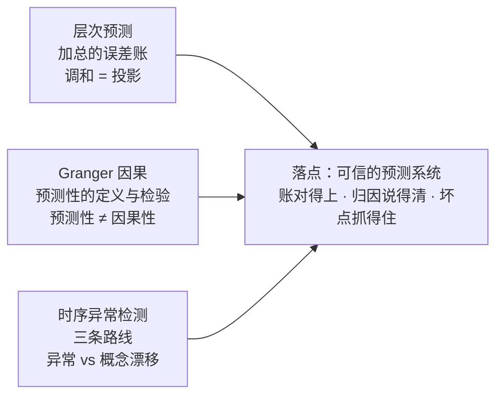
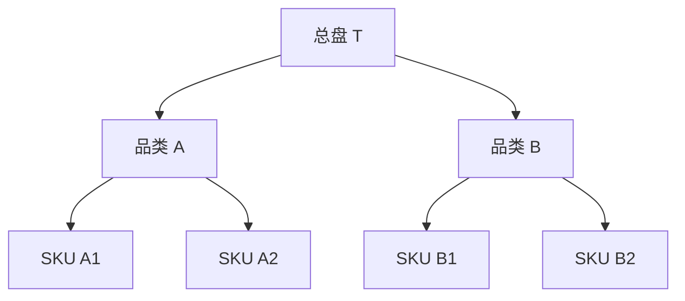
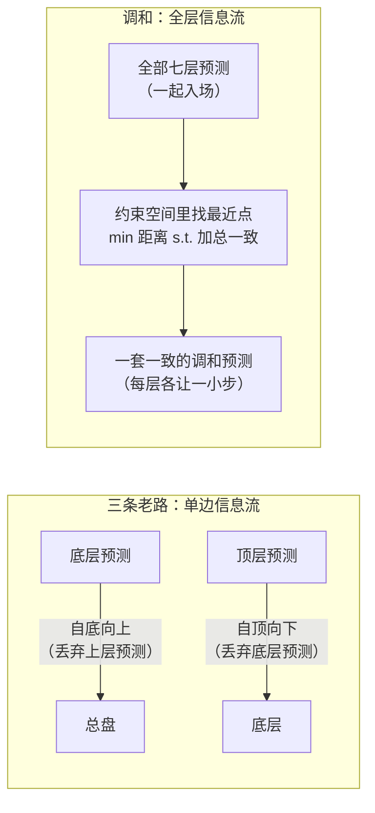
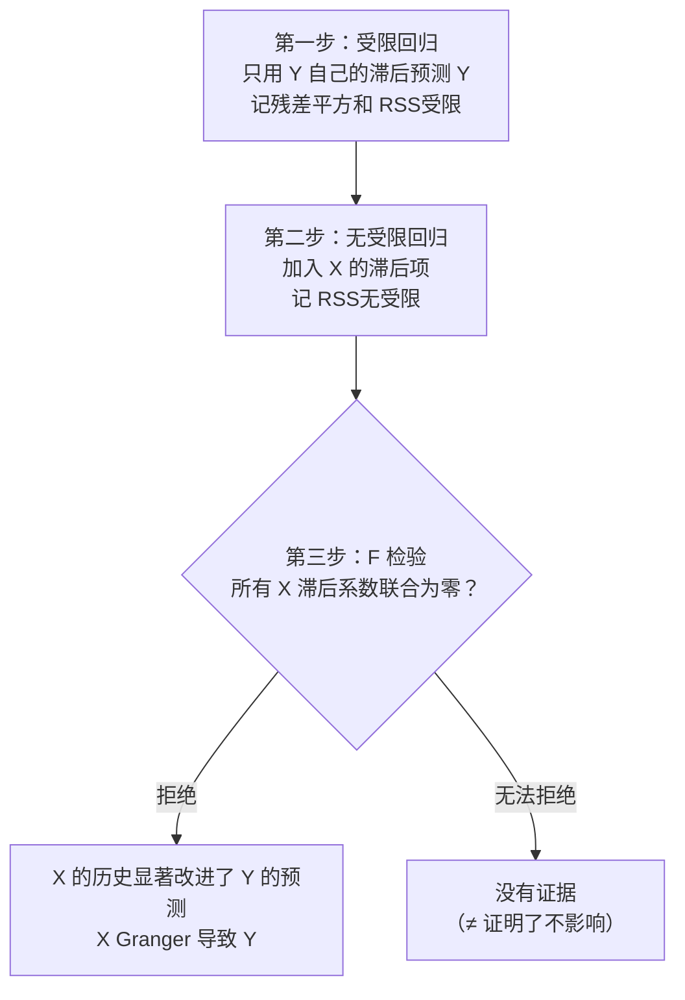
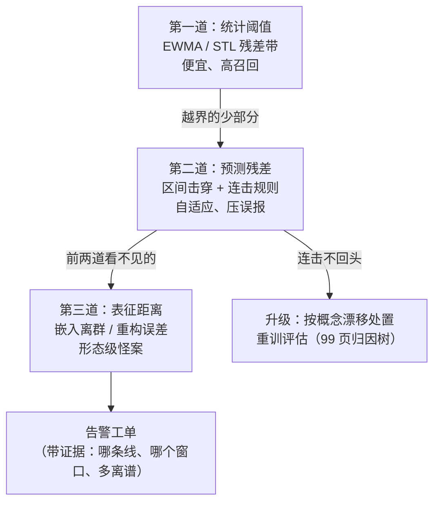

# 进阶专题：层次预测与时序进阶

> **一句话理解**：把每条序列预测准只是半程——上万条预测还要**对得上账**（层次调和的投影数学）、经得起**"谁影响谁"的追问**（Granger 因果：预测性 ≠ 因果性）、扛得住**"这个点不对劲"的惊吓**（时序异常检测与概念漂移的区分）——本页补齐从"单点预测"走向"预测系统"的最后三块拼图。

[⬆️ 返回总目录](../../../README.md) · [⬆️ 返回本篇](../README.md) · [⬅️ 返回本章目录](./README.md)

| 属性 | 说明 |
|------|------|
| 难度 | ⭐⭐⭐⭐（高阶） |
| 所属分支 | 时序 |
| 前置知识 | [时间序列分析入门](./01-时间序列分析入门.md)、[现代时间序列模型](./03-现代时间序列模型.md)、[进阶专题：序列建模前沿](./04-进阶专题-序列建模前沿.md) |

---

## 📌 这一节解决什么问题

前四页与 99 页解决了"怎么把一条序列、一个模型训好"；但真实的预测系统在模型之外还有三件必答题，本页逐一拆解：

1. **层次预测（Hierarchical Forecasting）**：预测从来不是一条序列的事。SKU → 子品类 → 品类 → 事业部 → 总盘，同一个未来被问了五遍。为什么"每个 SKU 各自预测再相加"不等于"总盘预测"？为什么反过来"总盘预测除以 SKU 占比"也不行？**调和（Reconciliation）**的数学是什么——答案出人意料地干净：一次**投影**。
2. **Granger 因果（Granger Causality）**：业务方最常问的问题不是"下个月卖多少"，而是"广告投放对销量有没有用"。Granger 因果给出了一个可检验的版本："知道 X 的历史，能不能改进对 Y 的预测？"——注意这个定义从头到尾讲的是**预测性**，不是因果性；把它错当因果性是本领域最经典的翻车现场，也是本页最重要的辨析（与[第 11 章因果之梯](../11-因果推断/01-相关不等于因果.md)正面对接）。
3. **时序异常检测（Time Series Anomaly Detection）**：预测系统上线后，你每天都在做异常检测而不自知——**残差监控就是最朴素的异常检测器**。本页把这件事显式化：三条技术路线（统计阈值 / 预测残差 / 表征距离）各自的机理与盲区，以及一个比"怎么检测"更要紧的判断：**这到底是异常，还是概念漂移？**——两者的处方完全相反。

三块拼图共享同一条主线：**从"预测一个数"到"维护一个预测系统"**——账要对得上、归因要说得清、坏点要抓得住。

## 🌱 通俗理解

三句话先行：

- **层次调和像"公司预算会"**：各条线报自己的预算（底层预测），总部也有大盘判断（顶层预测），两边对不上就开会拉扯——直接把各部门数字加总，误差越滚越大（还可能互相打架）；只按总部数字往下摊派，一线的真实差异全被抹平。**调和 = 让所有层一起拉扯到平衡**：谁的预测历史更可信，谁在拉扯中嗓门更大。
- **Granger 因果像"预报员考试"**：两个预报员预测明天的销量，一个只看销量的历史，另一个额外看广告投放的历史——如果后者稳定地更准，就说"广告 Granger 导致销量"。注意这场考试考的是"**预报有没有变准**"，不是"**加大投放会不会涨**"——考试考的是预测，你答的是干预，答非所问。
- **异常检测像"体检报告"**：三种医生各有看法——老医生对照"人群参考范围"（统计阈值：3σ 之外就报警）；你的主治医生对照"你自己的历史"（预测残差：比模型预测离谱太多就报警）；影像科医生看"整体形态像不像见过的病例"（表征距离：嵌入向量离正常簇太远就报警）。而**概念漂移 vs 异常**的区别是："偶尔一次血压飙升"（异常，观察 + 兜底）vs "血压基线整体上移了"（漂移，得换处方——重训或在线适应）。

## 🗺️ 本页地图



## 📋 举个例子

用一个两层小层次走一遍"账为什么对不上"。四个底层 SKU、两个品类、一个总盘；各层**独立建模**（每个序列各配一个预测器）：



| 层级 | 真值 | 各自独立预测 | 误差 |
|------|------|--------------|------|
| SKU A1 | 10 | 12 | +2 |
| SKU A2 | 6 | 5 | −1 |
| SKU B1 | 8 | 7 | −1 |
| SKU B2 | 2 | 3 | +1 |
| 品类 A（直接建模） | 16 | 16.5 | +0.5 |
| 品类 B（直接建模） | 10 | 9.0 | −1.0 |
| 总盘 T（直接建模） | 26 | 26.4 | +0.4 |

读三件事：

1. **账对不上**：自底向上加总，品类 A = 12 + 5 = 17，但品类 A 自己的模型说 16.5；总盘 = 27，总盘模型说 26.4——七个预测给出三套互相矛盾的账（17 vs 16.5；10 vs 9.0；27 vs 26.4）；
2. **底层误差不等于顶层误差**：四个 SKU 的误差 (+2, −1, −1, +1) 加总只净剩 +1（独立误差部分抵消）；但若大促周四个误差**同向**（都是 +30% 那种），加总就是全须全尾的 +30%——误差是抵消还是合谋，取决于误差之间的**相关性**，这是板块一的数学主菜；
3. **调和的结果**：把这 7 个预测一起"拉扯到账能对上"（板块一给出投影公式），结果是 [11.89, 4.89, 6.72, 2.72, **16.78**, **9.45**, **26.23**]——每层都被小幅修正，且 11.89 + 4.72……严格等于 16.78、9.45、26.23 逐级吻合（动手试试环节用 10 行 numpy 复算）。注意品类 A 的误差从 +0.5 变成了 +0.78——**调和不保证每层都变好，它保证的是整体最优与全局一致**。

## 🧠 核心原理

### 板块一：层次预测——为什么"分品类加总 ≠ 总预测"

#### 1.1 三条老路与各自的账单

在没有调和之前，工程上有三条朴素做法，每条都附一张账单：

| 路线 | 做法 | 账单 |
|------|------|------|
| **自底向上（Bottom-up）** | 只预测底层 SKU，上层一律加总 | 底层序列最噪（月销几件的长尾 SKU，相对误差巨大）；误差的**相关部分**逐级累加——大促周全员同向偏，总盘跟着偏 |
| **自顶向下（Top-down）** | 只预测顶层总量，按历史占比摊到下层 | 占比不是常数（新品爬坡、季节切换）；摊派抹平底层差异——促销敏感 SKU 的翻倍增长被"平均"稀释 |
| **中间出发（Middle-out）** | 选中间层预测，向下摊派、向上加总 | 折中，但"选哪层"本身是个拍脑袋超参；上下两头的缺点各继承一半 |

三条路的共同病灶：**只信一层的信息，把其他层的独立预测全扔了**。而真实系统里，底层模型懂 SKU 细节、顶层模型懂大盘趋势（聚合后噪声互相抵消、信号更干净）——两边的预测**都有价值且互补**。调和的思路因此不是"选一层"，而是**把所有层的预测都拿来，在"加总必须一致"的约束下找一组离它们最近的修正值**。信息流向画成一张图，病灶与药方一目了然：



#### 1.2 加总误差的数学：抵消还是合谋

自底向上的总盘误差 = 各 SKU 误差之和 $e_T = \sum_{i=1}^{N} e_i$。它的方差是：

$$
\mathrm{Var}\Big(\sum_{i=1}^{N} e_i\Big) = N\sigma^2\big[1 + (N-1)\rho\big]
$$

> 👉 **人话**：N 个误差加总的方差 = 单个方差的 N 倍，再乘一个"合谋系数" [1 + (N−1)ρ]。ρ 是误差之间的平均相关——**独立时（ρ=0）方差按 N 涨；同向合谋时（ρ=1）方差按 N² 涨**。这正是"分品类加总 ≠ 总预测"的数学本体：加总不是问题，**加总时误差不独立才是问题**。（对照 04 页的 N 模型**平均**降方差公式 $\frac{\sigma^2}{N}[1+(N-1)\rho]$：平均除以 N、加总乘以 N，ρ 的角色一模一样——相关一旦走高，红利/灾难都同源。）

<details>
<summary>📐 数学深潜：自底向上的误差账——独立时抵消、合谋时爆炸、偏置时线性漂移</summary>

**严格陈述。** 设 $e_1, \dots, e_N$ 为各 SKU 的预测误差，两两相关系数均为 ρ、方差均为 σ²。记 $e_T = \sum_i e_i$，则

$$
\mathrm{Var}(e_T) = \sum_i \mathrm{Var}(e_i) + 2\sum_{i<j} \mathrm{Cov}(e_i, e_j) = N\sigma^2 + N(N-1)\rho\sigma^2 = N\sigma^2\,[1+(N-1)\rho]
$$

**推导（三行协方差展开）。** $\mathrm{Var}(\sum e_i) = \sum_i \mathrm{Var}(e_i) + 2\sum_{i<j}\mathrm{Cov}(e_i,e_j)$（和的方差公式）；代入 $\mathrm{Var}(e_i)=\sigma^2$、$\mathrm{Cov}(e_i,e_j)=\rho\sigma^2$（对数对相同，共 $\binom{N}{2}$ 对）；合并即得上式。∎

**三种情况读一遍公式（对照深度标准的三情况）**：

| 情况 | 代入 | 总盘误差标准差 | 直觉 |
|------|------|----------------|------|
| 正常（独立，ρ=0） | $N\sigma^2$ | $\sqrt{N}\,\sigma$ | **相对误差反而在缩小**：$\sqrt{N}\sigma / (N\mu) = \sigma/(\sqrt{N}\mu)$——独立噪声在加总中互相抵消，这正是"聚合序列更平滑"的原因 |
| 极端（同向，ρ=1） | $N^2\sigma^2$ | $N\sigma$ | **线性放大**：每个 SKU 偏 10%，总盘就偏 10%——促销、节假日、涨价是全员同向的典型时刻（99 页"大促期间误差是平日 3~5 倍"的数学根源） |
| 失败（系统性偏差，$e_i \equiv b$） | $(Nb)^2$ | $N b$ | 底层模型若有共同偏差源（同一套价格特征全错、同一口径缺退货冲减），偏差**原样传导**到顶层，加总完全不稀释 |

**反例与边界**：① 公式假设方差齐、相关齐——真实 SKU 群的误差方差差几个量级（头部 vs 长尾），长尾的大方差在加总里占主导；② ρ 不是常数：平日 ρ≈0、大促周 ρ→0.8+，**合谋系数是状态依赖的**——评估调和收益必须分状态回测（99 页"按平日/周末/大促分层再排一次榜"的道理）；③ 顶层直接建模为什么常更准？因为聚合序列的信噪比更高（分子信号保留、分母噪声按 √N 缩）——但这不等于顶层信息够用，底层的**结构性变化**（新品、断货、区域差异）顶层永远看不见。

> 👉 **一句人话总结**：加总本身无罪，**误差的相关性与共同偏置**才有罪——自底向上的总盘误差 = N·σ²·[1+(N−1)ρ]，ρ 从 0 走到 1，账单从"√N 可控"涨到"N 爆炸"；调和的全部动机，就是别把顶层与中间层那些更干净的预测白白扔掉。

</details>

#### 1.3 调和的数学：一次投影

把层次写成矩阵语言。底层序列记为向量 $\mathbf{b}$（本例 4 维），则**任何一层**的值都是底层的线性组合——用**求和矩阵（Summing Matrix）S** 表示：

$$
\mathbf{y} = S\,\mathbf{b}, \qquad
S = \begin{bmatrix}
1&0&0&0\\ 0&1&0&0\\ 0&0&1&0\\ 0&0&0&1\\
1&1&0&0\\ 0&0&1&1\\ 1&1&1&1
\end{bmatrix}
\;\begin{matrix}\leftarrow \text{SKU A1}\\ \leftarrow \text{SKU A2}\\ \leftarrow \text{SKU B1}\\ \leftarrow \text{SKU B2}\\ \leftarrow \text{品类 A}\\ \leftarrow \text{品类 B}\\ \leftarrow \text{总盘 T}\end{matrix}
$$

> 👉 **人话**：S 的每一行是"这一层等于哪些底层之和"的编码——品类 A 那行是 [1,1,0,0]，意思是"A = A1 + A2"。于是"账对得上"这个业务要求，翻译成数学就是一句话：**预测向量必须落在 S 的列空间里**（即形如 S·b 的向量，b 是任取的底层值）。

各层独立建模给出的原始预测 $\hat{\mathbf{y}}$（7 维）一般**不**落在这个空间里（17 ≠ 16.5）。最小二乘调和解它离原始预测最近：

$$
\tilde{\mathbf{y}} = \arg\min_{\tilde{\mathbf{y}}} \;\big\| \tilde{\mathbf{y}} - \hat{\mathbf{y}} \big\|^2 \quad \text{s.t.} \quad \tilde{\mathbf{y}} = S\mathbf{b} \ \text{（某个底层组合）}
$$

> 👉 **人话**：在"所有账能对上的向量"里，挑一个离"各层原始预测"最近的——既不是全听底层的（自底向上），也不是全听顶层的（自顶向下），而是**让七个预测一起各让一步**。

<details>
<summary>📐 数学深潜：最小二乘调和的投影直觉——预测向量投影到和约束空间</summary>

**严格陈述。** 记 $\mathcal{C}(S)$ 为 S 的列空间（本例：7 维空间里的一个 4 维子空间——底层自由度有多少，子空间就有多少维）。最小二乘调和解恰是 $\hat{\mathbf{y}}$ 到 $\mathcal{C}(S)$ 的**正交投影**：

$$
\tilde{\mathbf{y}} = P\,\hat{\mathbf{y}}, \qquad P = S\,(S^{\!\top} S)^{-1} S^{\!\top}
$$

且解有闭式：调和后的底层值 $\tilde{\mathbf{b}} = (S^{\!\top} S)^{-1} S^{\!\top} \hat{\mathbf{y}}$，$\tilde{\mathbf{y}} = S\tilde{\mathbf{b}}$。

**推导（两条路，都只用到"求导置零"）。**

*路线一（消去约束）*：目标 $\|S\mathbf{b} - \hat{\mathbf{y}}\|^2$ 对 b 求梯度：$2S^{\!\top}(S\mathbf{b} - \hat{\mathbf{y}}) = 0 \Rightarrow S^{\!\top}S\,\mathbf{b} = S^{\!\top}\hat{\mathbf{y}}$——这正是最小二乘的正规方程（01 页的老朋友）。S 列满秩（层次的树结构保证）⇒ $(S^{\!\top}S)$ 可逆，解出 b、左乘 S 即得 $\tilde{\mathbf{y}} = S(S^{\!\top}S)^{-1}S^{\!\top}\hat{\mathbf{y}}$。

*路线二（几何）*：投影等价于**残差正交于子空间**：$\hat{\mathbf{y}} - \tilde{\mathbf{y}} \perp \mathcal{C}(S)$，即 $S^{\!\top}(\hat{\mathbf{y}} - \tilde{\mathbf{y}}) = 0$。展开正好是路线一的正规方程——两条路殊途同归：**最小化距离 ⟺ 残差垂直于约束空间**。∎

**几何/概率解释。** 把 7 维预测空间想成一间屋子：**能对上账的预测们（$\mathcal{C}(S)$）是屋里一块倾斜的地板**（4 维）；各层独立预测 $\hat{\mathbf{y}}$ 是悬在半空的一个点；调和 = **从这点向地板放下一根铅垂线**，落点就是调和预测。铅垂线（残差）最短 ⟺ 垂直——这就是"离原始预测最近"的几何含义。落点由"哪层拉力大"决定：**某层的历史预测越准（误差方差越小），它在 $\hat{\mathbf{y}}$ 里的分量越值得信赖，落点就越往它那边靠**。

**MinT 一句话。** 上面的 P 用单位阵加权（所有层等权）。MinT（Minimum Trace，Wickramasuriya 等 2019）把权重换成各层预测误差的协方差 $W$：

$$
\tilde{\mathbf{y}}_{\text{MinT}} = S\,(S^{\!\top} W^{-1} S)^{-1}\, S^{\!\top} W^{-1}\,\hat{\mathbf{y}}
$$

> 👉 **人话**：**用"误差量尺"重新定义"最近"**——把每层按它自己的预测误差方差缩放坐标后再投影（W 对角元小 = 这层准 = 在缩放后的空间里它的票更重）。在"各层预测无偏"的假设下，可证 MinT 调和后的总误差（误差协方差矩阵的迹）不增——99 页"弹簧网"比喻（可信的层拉力大）的严格版本就是它。实践中 W 常用对角方差（WLS 变体）或其收缩估计（结构化 shrinkage），因为完整估 N×N 的 W 需要的误差样本远比手里多。

**反例与边界。** ① **投影不保证贴近真值**：它最小化的是"离原始预测的距离"，不是"离真值的距离"——调和带来精度提升的前提是各层预测无偏且信息互补；若底层有系统性偏差（误差账第三种情况），投影会把偏差礼貌地摊到每一层，账对得很齐、错得很一致。② **约束错了全盘皆输**：若层间关系不是纯加总（含税/不含税口径混层、跨品类重复计数），S 写错，投影空间就不是"账对得上"的空间——先审计口径再谈调和。③ **维度爆炸**：全层次联合调和时 $S^{\!\top}W^{-1}S$ 的求逆随底层序列数增长，大层次（百万 SKU）要用稀疏/分块技巧（库如 hierarchicalforecast 已处理）。

> 👉 **一句人话总结**：调和 = 把"各层各自说的未来"投影到"账能对上"的子空间——普通最小二乘用等权的尺子量距离，MinT 用各层历史误差的方差当尺子（谁准谁话语权大）；投影保证**一致**，精度收益则要靠"无偏 + 信息互补"来挣。

</details>

99 页已经给了这套数学的落地姿势（自底向上跑通对账 → 顶层波动大再上最小二乘调和），本页补的是"为什么"：**调和不是行政对账，是统计最优的组合**——它同时回收了顶层（聚合后信噪比高）与底层（结构性细节）两边的预测信息，本质与 04 页"混合系统"一脉相承：**多个来源的判断，比任何单一来源更接近真相**。

<details>
<summary>📊 展开：拉扯怎么分账——投影把 0.5 的缺口分给了谁</summary>

回到本页例子，读一遍投影的"分账明细"（数值与动手试试代码完全一致）：

| 层级 | 原始预测 | 调和后 | 挪了多少 | 谁的意见占了上风 |
|------|---------|--------|---------|----------------|
| SKU A1 | 12.0 | 11.89 | −0.11 | — |
| SKU A2 | 5.0 | 4.89 | −0.11 | — |
| 品类 A | 16.5 | 16.78 | **+0.28** | 底层加总（17）比它自己（16.5）离落点更远——它让得多 |
| SKU B1 | 7.0 | 6.72 | −0.28 | — |
| SKU B2 | 3.0 | 2.72 | −0.28 | — |
| 品类 B | 9.0 | 9.45 | **+0.45** | 底层加总 10 vs 自己 9.0，分歧更大，拉扯更狠 |
| 总盘 T | 26.4 | 26.23 | −0.17 | 各方意见的"汇合点" |

三个读法：

1. **分歧大的组挪得多**：品类 B 的"底层加总（10）vs 直接预测（9.0）"分歧 1.0，比品类 A 的 0.5 大，调和后它挪了 +0.45——投影把修正量按平方距离摊派，**谁离共识远谁多让**；
2. **底层不是等额分摊**：A 组两个 SKU 各让 0.11、B 组各让 0.28——因为 B 组的分歧要通过底层的大改动才能"够得着"（约束空间里只有底层是自由变量，上层的值全由底层加总决定）；
3. **等权是 OLS 的默认姿态**：本例没有告诉投影"谁的历史更准"，所以按几何等权拉扯；换成 MinT（W 加权），若品类 A 的直接预测历史误差小，落点会更靠近 16.5——**"话语权"就是从 W 里来的**。

</details>

### 板块二：Granger 因果——"预测性因果"的定义与边界

#### 2.1 定义：X 的历史能否改进 Y 的预测

Granger（1969）的操作性定义基于**信息集**：记 $\Omega_t$ 为截至 t 时刻的全部信息，$\Omega_t \setminus X_t$ 为"抠掉 X 的历史"剩下的信息。若

$$
F\big(Y_{t+1} \,\big|\, \Omega_t\big) \;\neq\; F\big(Y_{t+1} \,\big|\, \Omega_t \setminus X_t\big)
$$

> 👉 **人话**：**在"已经知道的一切"里，X 的历史那一块有没有带来增量**——把 X 的历史抠掉，Y 明天的条件分布变了，就说"X Granger 导致 Y"。工程上常用它的均方误差版：加上 X 的滞后后，Y 的预测误差方差变小了，就是 Granger 意义上的"导致"。注意定义的每一个字都在说**预测**，没有一个字在说**干预**。

这个定义的价值是把"谁领先谁"从一个玄学问题变成了一个**可检验的统计假设**——检验流程的直觉版：



> 👉 **人话**：两个学生预测 Y——一个只看 Y 的历史卷子，一个额外看 X 的历史卷子；F 检验在问"第二个学生的误差是不是**显著**更小"。显著 = 预测上有用；不显著只是"这门考试没考出来"，不是无罪证明。

<details>
<summary>📐 数学深潜：F 统计量的构造与两个翻车现场——混淆变量与时间聚合</summary>

**严格陈述（线性版本）。** 对双变量自回归模型（VAR 的单方程版）：

$$
Y_t = a + \sum_{i=1}^{p} \alpha_i\, Y_{t-i} + \sum_{i=1}^{p} \beta_i\, X_{t-i} + \varepsilon_t
$$

检验 $H_0: \beta_1 = \cdots = \beta_p = 0$（X 的全部滞后系数为零）。记受限/无受限拟合的残差平方和为 $\mathrm{RSS}_r / \mathrm{RSS}_u$、有效样本 n，则

$$
F = \frac{(\mathrm{RSS}_r - \mathrm{RSS}_u)\,/\,p}{\mathrm{RSS}_u\,/\,(n - 2p - 1)} \;\sim\; F(p,\ n-2p-1) \quad \text{（} H_0 \text{ 下近似）}
$$

**推导骨架。** H₀ 为真时，加进来的 p 个 X 滞后项是"没信息的变量"——RSS 几乎不降，分子（单位自由度的 RSS 降幅）在期望意义下约等于分母（单位自由度的残差方差），F ≈ 1；H₀ 为假时，X 滞后真带了信息，RSS 显著下降，F 远大于 1。它就是[第 3 章](../../2-经典机器学习/03-机器学习/07-模型评估与调优.md)"嵌套模型比较"在时间序列上的标准件：**多付 p 个参数，换来了多少误差下降？** ∎

**翻车现场一：混淆变量（最常见）。** 设隐藏变量 Z 领先驱动 X 与 Y（Z 先动，X、Y 跟着动），但 X 对 Y 毫无作用。单看 (X, Y) 双变量检验：X 的滞后里**含有 Z 的信息**，而 Z 恰是 Y 的真因——于是"X 的历史改进 Y 的预测"成立，F 显著，**X 被判 Granger 导致 Y，尽管干预 X 对 Y 毫无影响**。动手试试的代码第 2 段会亲手造一个这样的世界：F 照样显著。病根：Granger 检验的是**条件于"你放进模型的信息集"**——信息集缺了真因 Z，X 就替 Z 顶了名。

**翻车现场二：时间聚合（更隐蔽）。** 若 X 对 Y 的真实作用在一拍之内完成（X 先动、Y 毫秒级跟上），而你的数据是日粒度——采样时两者的"先后"已经被抹掉，双向 Granger 因果同时显著；反过来，聚合还可能制造虚假的单向领先（周内错位的效应聚合后看起来像 X 领先）。**因果发生在采样间隔之内时，Granger 的"先后"望远镜根本对不上焦**。

**边界清单（开检验前先过一遍）**：① 平稳性——两个单位根序列的 F 检验分布漂移（01 页 ADF 先行）；② 滞后阶 p——太短漏信息（假"无因果"），太长吃自由度（AIC/BIC 定阶，但结论对 p 敏感时别下重话）；③ 非线性依赖——线性 VAR 只能看见线性领先，非线性传导会漏报；④ 样本量——Granger 检验对短样本功效低，"没检出"和"不存在"隔着一条统计功效的沟。

> 👉 **一句人话总结**：Granger 因果 = "把 X 的历史卷子给预测员看，成绩显著变好"——它是**关于预测的命题**，不是关于干预的命题；混淆变量、时间聚合、信息集残缺随时能让它指认错人，读结论时永远带着一句追问：**"X 亲自导致了 Y，还是 X 只是捎带了真凶的消息？"**

</details>

#### 2.2 预测性 ≠ 因果性：本页最重要的辨析

把 Granger 因果放回[第 11 章因果之梯](../11-因果推断/01-相关不等于因果.md)的三级台阶上，位置一目了然：

| | 因果之梯 | Granger 因果站在哪 |
|---|---|---|
| 第一级：关联（看见） | P(Y \| X)——共现、预测 | **Granger 在这级**：一种带时间方向的关联（X 的过去关联 Y 的未来），比普通相关多了"先后"信息，但仍是观察世界 |
| 第二级：干预（做到） | P(Y \| do(X))——动手改变 X | **不在**：Granger 显著不保证"加大 X 会改变 Y"；干预问题要用 A/B 实验或第 11 章的工具箱 |
| 第三级：反事实（想象） | "如果当时没投广告" | 更不在 |

> 👉 **人话**：Granger 因果是"**穿着因果马甲的预测命题**"——它回答"X 的历史对预测 Y 有没有增量"，而业务方真正想问的"该不该加投"是干预问题。正确的用法两步走：Granger 检验当**候选关系的筛子**（便宜、先跑），筛出的关系再交给实验或因果推断方法**裁判**（第 11 章的 do 演算、DID、Uplift）。顺序不能反——拿 Granger 直接指导干预，等于用体检报告开处方。

顺带一句历史公道话：Granger 本人在原始论文里就把这个概念命名为"causality"并立刻声明它只在预测意义上成立——后来的误用不能全算在他头上。

### 板块三：时序异常检测——三条路线与"漂移 vs 异常"

#### 3.1 残差监控 = 最朴素的异常检测

先建立一个让人安心的等式：99 页的监控表里"滚动 WAPE 偏差告警""连续 7 天同向偏差"这些动作，**在数学上就是异常检测**——预测器给出"此刻应该是什么"（$\hat{y}_t$），实测值与它的差是残差，残差超过某个控制限就报警：

$$
\text{告警} \iff \big|\, y_t - \hat{y}_t \,\big| > c
$$

> 👉 **人话**：预测器的本职是预报未来，但**顺手产出了一张"正常范围说明书"**——实测跟预报差太远，要么世界抽风（异常），要么说明书过期（漂移）。预测系统与异常检测不是两个系统，是**同一个残差的两种读法**。

升级一步就接上了 03/04 页的概率预测：不用固定阈值 c，改用**预测区间**——"真值落在 P10~P90 之外"记一次击穿，连续击穿才升级告警。区间随波动自适应变宽（异方差友好），比 3σ 更少误报；04 页的共形校准还能给"击穿概率"钉上有限样本保证。这套"区间 + 连击规则"是生产里最常见的中间档。

#### 3.2 三条路线对比

| 路线 | 代表方法 | 一句话机制 | 强项 | 盲区 |
|------|---------|-----------|------|------|
| **统计阈值** | 3σ / 箱线图 / EWMA 控制图 / STL 分解残差阈值 | 先刻画"正常长什么样"（分布、分位数、季节分解后的残差带），越界即报 | 便宜、可解释、不需要标签；EWMA 还能平滑掉单点毛刺 | **非平稳序列上"正常"自己在漂**——用全局 3σ 盯一条缓升趋势，报警会越来越频繁；对形态级异常（波形整体变怪但幅值正常）失明 |
| **预测残差** | 预测器 + 残差控制限（含区间击穿、连击规则） | 学一个强预测器，"模型没想到的"就是异常 | 与预测系统**共生**（残差监控白拿）；能吃协变量（促销、节假日进模型后不再误报）；自适应非平稳 | **继承预测器的盲区**：训练期见过的异常被学成"正常"（污染）；预测器自身漂移时残差全面走样——先分清是模型病还是世界病（99 页归因树） |
| **表征距离** | 自编码器重构误差 / 子空间方法 / 嵌入近邻（孤立森林等在特征空间） | 把窗口序列嵌入向量空间，离正常簇远即异常 | 无监督、能抓**形态级**异常（不靠幅值靠形状）；可复用预训练时序模型的表征 | 阈值难标定（重构误差的"正常带"要靠验证数据划）；黑盒难解释；高维距离的集中效应让"远"变得含糊 |

> 👉 **人话**：三个医生各看各的——统计阈值看"人群参考范围"（快但不知道你在长个子）、预测残差看"你自己的轨迹"（懂你但拿你的病历当圣经）、表征距离看"影像形态"（能看出片子不对劲但说不清哪不对劲）。生产常见姿势是**分层**：便宜的统计阈值当第一道网（高召回），预测残差当第二道（压误报），表征距离留给"前两道看不见的形态怪案"。



> 👉 **人话**：分层的关键不是"三道都上"，而是**每道有不同的出口**——第一二道的越界者走告警工单；第二道的"连击不回头"不走告警、直接升级成漂移处置（观察窗规则在 3.3 展开）。把三道串成一条没有出口的流水线，是这套架构最常见的实现错误（告警淹没 → 全员免疫）。

#### 3.3 概念漂移 vs 异常：一次点错药方的代价

这是时序异常检测**最贵的误判**——两者的处置完全相反：

| | 异常（Anomaly / Outlier） | 概念漂移（Concept Drift） |
|---|---|---|
| 世界怎么了 | 单点或短窗的离群，**世界暂时抽风，过去之后回来** | 分布的持久迁移，**世界变了，回不去了** |
| 典型指纹 | 零星、双刺（突升突降）、孤立尖峰 | 异常告警"报个不停"：连续多点、单侧为主、且逐渐形成**新的稳态** |
| 序列视角 | $y_t$ 离群，$y_{t+1}$ 回到正常带 | 均值/方差/季节形状整体搬家 |
| 正确处置 | 观察或兜底（剔除、封顶、人工覆写）；**别喂给模型重训**（把噪声学进去） | 承认新常态：重训 / 在线适应 / 换特征（99 页"真漂移 → 安排重训"） |
| 点错药方的后果 | 把漂移当异常打补丁：每天剔除、封顶，模型在新常态下越来越偏 | 把异常当漂移重训：把一次毛刺学进模型，模型学会了"抽风也是规律" |

> 👉 **人话**：判别的金标准是**持久性**——给"离群"一点时间，回来了是异常，回不来就是漂移。工程上落地成"观察窗 + 升级规则"：先按异常处理并进观察期，连续 k 个窗口不回来就按漂移升级（触发重训评估）。99 页的偏差归因树（数据缺报 / 事件没建模 / 真漂移的三分）正是这条判别逻辑的生产版——**先诊断世界，再动手模型**。

## 🩺 失败模式速查（何时不 work）

| 症状 | 病因 | 诊断 | 补救 |
|------|------|------|------|
| 调和后各层预测反而变差 | 底层系统性偏差被投影摊到全层；或 W（误差协方差）估得离谱 | 分层对比调和前后的误差：底层独差 = 底层偏差；全体同向变差 = 检查 S 与口径 | 先修底层偏差与口径；W 退回对角方差（WLS 变体）或 shrinkage 估计 |
| 账始终对不上（调和后仍有残差） | 层间关系不是纯加总（口径混层、跨层重复计数） | 手工核对几行 S 编码与业务口径 | 修 S 之前别调算法——约束空间错了，投影越准越错 |
| Granger 检验显著、业务照做没效果 | 混淆变量（X 替真凶顶名）或时间聚合制造假领先 | 加候选混淆进信息集重跑；换粒度（日→小时）看显著性是否稳定 | 把 Granger 当筛子不当裁判；上 A/B 实验或第 11 章方法验证 |
| 3σ 阈值报警越报越多 | 非平稳：序列均值/方差在漂，全局阈值过期 | 画报警率的时间曲线：单调上升 = 阈值过期而非世界更乱 | 换滚动窗口阈值 / EWMA / STL 残差阈值；或预测残差路线 |
| 残差监控长期零报警，事后发现大事故 | 预测器把训练期的异常学成"正常"（污染）；或区间画得过宽 | 回放历史已知异常：能不能报出来（召回自检）；查区间覆盖率是否虚高 | 清洗训练期的异常段或加权降采样；区间重校准（04 页共形） |
| 漂移被当异常天天打补丁 | 观察窗太短，新稳态没等出来就判了异常 | 看剔除值的分布：若剔除值稳定在新水平（不是尖峰）即坐实漂移 | 停止剔除，触发重训评估；观察窗按业务周期拉长 |

## 🧭 开放问题（批判视角）

- **调和的最优性依赖一个估不出来的东西**：MinT 的最优性证明需要各层预测误差的协方差 W，而 W 的自由度（N² 级）远超手里的误差样本——实践中只能用对角/收缩近似。理论最优与工程近似之间的缺口，至今靠"分状态回测"这种笨办法弥合。
- **Granger 因果在高频与非线性世界里的失效边界**：采样粒度粗于真实传导速度时"先后"不可见（双向伪因果）；非线性传导线性检验漏报。深度版（用神经网络比较两类预测器的损失）补了非线性，但牺牲了解释性，且更容易把混淆变量的信息"学进来"。
- **异常检测的评估危机**：真实异常标签极稀缺（出了事才知道）、基准数据集被多篇公开研究指出标注有缺陷（把正常模式标成异常），导致"榜单进步"与"生产能力"错位——这个领域比模型更缺的是**可信的评估协议**。

## 🔬 SOTA 演进（2023–2026）

- **层次调和已成生产标配动作（一句话级）**：开源生态（Nixtla 的 hierarchicalforecast 等）把 OLS/WLS/MinT 做成开箱组件，零售与供应链预测系统及 M5 类竞赛的前排方案里"各层独立预测 + 统一调和"已是常规工艺（竞赛总结报告与工程实践的公开共识，经验参考）——从论文到生产的最后一公里已走完。
- **时序异常检测的基准反思（一句话级）**：多篇公开研究指出常用基准存在标注缺陷（正常周期被标成异常等），修正后的统一评测（TSB-UAD 一类）把不少无监督方法的"领先"拉回现实——生产选型别只信榜单，回放自己业务的历史事故做召回自检更可靠（公开论文观点，2021–2022 年起持续发酵）。

## 💻 动手试试

```python
import numpy as np
rng = np.random.default_rng(0)

# ============ 1) 最小二乘调和：10 行 numpy 的投影 ============
S = np.array([                       # 求和矩阵：每行 = "这层是哪些底层的和"
    [1,0,0,0], [0,1,0,0], [0,0,1,0], [0,0,0,1],   # 底层 SKU
    [1,1,0,0], [0,0,1,1], [1,1,1,1],               # 品类A、品类B、总盘
], dtype=float)
names = ["A1","A2","B1","B2","品类A","品类B","总盘T"]

y_hat  = np.array([12.0, 5.0, 7.0, 3.0, 16.5, 9.0, 26.4])   # 各层独立预测（本页例子）
y_true = np.array([10.0, 6.0, 8.0, 2.0, 16.0, 10.0, 26.0])  # 真值（演示用）

P = S @ np.linalg.inv(S.T @ S) @ S.T      # 正交投影矩阵：P = S(S'S)^{-1}S'
y_rec = P @ y_hat                          # 调和 = 投影

print("调和前不一致：A1+A2 =", y_hat[0]+y_hat[1], "≠ 品类A 预测", y_hat[4])
print("调和后逐层：", dict(zip(names, np.round(y_rec, 2))))
print("调和后一致：", round(y_rec[0]+y_rec[1], 4) == round(y_rec[4], 4),
      "| 总和误差 %.2f -> %.2f" % (np.abs(y_hat-y_true).sum(), np.abs(y_rec-y_true).sum()))

# 预期输出：
# 调和前不一致：A1+A2 = 17.0 ≠ 品类A 预测 16.5
# 调和后逐层： {'A1': 11.89, 'A2': 4.89, 'B1': 6.72, 'B2': 2.72,
#               '品类A': 16.78, '品类B': 9.45, '总盘T': 26.23}
# 调和后一致： True | 总和误差 6.90 -> 6.56
# 读法：投影后账全对上（A1+A2 == 品类A == ...逐级吻合），
# 且整体误差略降——但注意品类A 误差从 +0.5 变 +0.78：
# 调和保证"离原始预测最近 + 全局一致"，不保证每一层都变好。

# ============ 2) Granger 检验：真传导 vs 混淆伪因果 ============
def granger_f(y, x, p=2):
    """受限/无受限回归的 F 统计量。H0：x 的历史不改进 y 的预测"""
    T = len(y); Y, Xr, Xu = [], [], []
    for t in range(p, T):
        Y.append(y[t])
        Xr.append([1.0] + [y[t-i] for i in range(1, p+1)])          # 只用 y 的历史
        Xu.append([1.0] + [y[t-i] for i in range(1, p+1)]
                        + [x[t-i] for i in range(1, p+1)])          # 加上 x 的历史
    Y, Xr, Xu = map(np.asarray, (Y, Xr, Xu))
    def rss(X):
        b, *_ = np.linalg.lstsq(X, Y, rcond=None)
        return ((Y - X @ b) ** 2).sum()
    rss_r, rss_u = rss(Xr), rss(Xu)
    n, k_u = Xu.shape
    return ((rss_r - rss_u) / p) / (rss_u / (n - k_u))

T = 500
x1 = np.zeros(T); y1 = np.zeros(T)                     # 场景一：x 先动、y 下一拍真跟着动
for t in range(1, T):
    x1[t] = 0.5*x1[t-1] + rng.normal(0, 1)
    y1[t] = 0.6*y1[t-1] + 0.4*x1[t-1] + rng.normal(0, 0.5)

z = np.zeros(T); x2 = np.zeros(T); y2 = np.zeros(T)    # 场景二：隐藏 z 同驱 x、y，x 对 y 无传导
for t in range(1, T):
    z[t]  = 0.5*z[t-1] + rng.normal(0, 1)
    x2[t] = 0.8*z[t-1] + rng.normal(0, 0.3)
    y2[t] = 0.6*y2[t-1] + 0.8*z[t-1] + rng.normal(0, 0.3)

for name, y, x in [("真传导 x->y  ", y1, x1), ("混淆 z 同驱（x 不影响 y）", y2, x2)]:
    print(f"{name}：F = {granger_f(y, x):8.2f}")

# 预期输出（数值随种子小幅浮动）：
# 真传导 x->y  ：F =   217.55
# 混淆 z 同驱（x 不影响 y）：F =     8.33
# 读法：两个 F 都远超常规临界值（约 3）——场景二里 x 根本不影响 y，
# 但 x 的滞后捎带了 z 的信息，Granger 检验照样"显著"。
# 这就是"预测性 != 因果性"的可复现现场：检验通过只说明 x 的历史有用，
# 不说明干预 x 会改变 y —— 裁判要交给实验或第 11 章的方法。

# ============ 改什么，看什么变化 ============
# - 把场景二的 0.8*z[t-1]（y 的方程）改成 0：F 掉回 1 上下——抽掉真因，伪因果消失；
# - 把场景一 y 方程里 0.4*x1[t-1] 改成 0.4*x1[t]（同拍传导）：F 大跌——
#   采样粒度粗于传导速度时，"先后"信息消失，Granger 眼镜对不上焦（时间聚合翻车现场）；
# - 把 y_hat 的总盘预测从 26.4 改成 25.0：重跑第 1 段，看调和后各层怎么分摊这 1.4 的缺口
#   ——谁的历史误差小（本例等权），谁被改得少。
```

## 🔥 炼丹小灶

> 🔥 **炼丹小灶**：工业界常用起点配方与玄学——
> - 配方：层次结构先跑通自底向上对账（一周内可交付），顶层波动大再上最小二乘调和（hierarchicalforecast 的 OLS/WLS 起步，别一上来就估完整协方差）；Granger 用 statsmodels 的 `grangercausalitytests` 配 AIC 定阶，**每个显著结果都必须过一遍混淆变量清单**；异常检测从"预测区间 + 连击规则"起步（复用现有预测系统，零新增模型）。
> - 玄学：调和后变差 → 九成是口径不是算法（先查 S 与加总口径）；Granger 全都显著 → 八成有序列没差分或滞后太短；异常报警忽多忽少 → 先查阈值是否过期（非平稳），再怀疑世界。
> - ⚠️ 以上是经验参考值，不是圣旨；换数据集请重新炼。

## 🖱️ 动手玩

> 🎮 **本库实验场**：[梯度下降炼丹炉](../../../playground/gradient-descent.html)——调和与 Granger 检验最后都落到"最小化一个损失"（投影的正规方程、回归的 RSS），回炉看一眼"损失最小"是怎么被一步步逼近的。
> 🕹️ **延伸玩一玩**：[Seeing Theory](https://seeing-theory.brown.edu)——3σ、分位数与"阈值怎么划"的概率直觉，交互式过一遍，三条异常检测路线的阈值话题立刻有画面。

## 🔗 在知识树中的位置

- **上游**：[时间序列分析入门](./01-时间序列分析入门.md)（正规方程与最小二乘、残差检验的原始出处）、[现代时间序列模型](./03-现代时间序列模型.md)（分位数与区间——异常检测的概率阈值原料）、[进阶专题：序列建模前沿](./04-进阶专题-序列建模前沿.md)（组合降方差公式与共形校准——调和与区间击穿规则的两块直接前置）。
- **下游**：本章[生产实战](./99-生产实战.md)（层次调和两种做法、偏差归因树、监控指标——本页三块内容的生产落地版）。
- **横向对比**：[第 11 章因果之梯](../11-因果推断/01-相关不等于因果.md)——Granger 因果的辨析靠它收口（预测性是第一级，干预是第二级）；调和与 04 页"混合系统"共享同一思想（多来源判断的组合优于单来源）；异常检测与第 12 章生成模型的"似然视角"是远亲（离群 = 低似然），此处点到为止。

## ⚠️ 常见误区

- **误区一**："分品类各自预测，加总就是总预测" → 只有当各层误差独立且无偏时加总才基本可靠；误差相关（大促同向）时方差按 N²[1+(N−1)ρ] 爆炸、系统性偏差原样传导——这正是调和存在的理由。
- **误区二**："调和会让每层都更准" → 调和**保证一致**（投影到约束空间），精度收益需要"无偏 + 信息互补"的条件；底层有系统性偏差时，调和把偏差礼貌地摊到每一层——账对得很齐，错得很一致。
- **误区三**："Granger 因果检验显著，说明 X 导致了 Y" → 显著只说明"X 的历史改进了对 Y 的预测"（预测性）；混淆变量、时间聚合都能让毫无传导关系的变量对"显著"。指导干预前，先过第 11 章的实验或因果方法。
- **误区四**："异常检测是预测系统之外另建的功能" → 残差监控本身就是最朴素的异常检测器；预测区间 + 连击规则是复用现有系统的零成本中间档。
- **误区五**："报警不断 = 世界越来越乱" → 报警率单调上升更常见的病因是**阈值过期**（非平稳序列 + 全局阈值）或**概念漂移**——先修尺子（滚动阈值）再修世界（重训），顺序反了会把漂移越藏越深。

## 📝 小结与自测

**要点回顾**

- 层次预测：三条老路（自底向上 / 自顶向下 / 中间出发）各扔掉了其他层的信息；自底向上的误差账是 $\mathrm{Var}(\sum e_i) = N\sigma^2[1+(N-1)\rho]$——独立时部分抵消、同向合谋时按 N² 爆炸、系统性偏差线性传导。
- 调和的数学是一次投影：账对得上 ⟺ 预测落在求和矩阵 S 的列空间；最小二乘调和解 $\tilde{y} = S(S^{\!\top}S)^{-1}S^{\!\top}\hat{y}$ 正是正交投影；MinT 把单位阵换成误差协方差 W 的加权投影（谁的历史准谁话语权大），无偏假设下最小化调和后总误差的迹。
- Granger 因果："X 的历史能否改进 Y 的预测"——F 检验比较受限/无受限回归的 RSS；它站在因果之梯第一级（带方向的关联），预测性 ≠ 因果性：混淆变量让 X 替真凶顶名、时间聚合抹掉先后；正确用法是当筛子，裁判交给实验或第 11 章。
- 时序异常检测：残差监控 = 最朴素的异常检测（预测区间 + 连击规则是中间档）；三条路线 = 统计阈值（便宜但怕非平稳）/ 预测残差（共生但继承盲区）/ 表征距离（抓形态但难标定）。
- 异常 vs 概念漂移：暂时离群 vs 持久搬家，判别金标准是持久性（观察窗 + 升级规则），处置完全相反（兜底剔除 vs 重训适应）——点错药方会分别得到"学进噪声的模型"和"越剔越偏的系统"。

**自测一下**（点击展开答案）

<details>
<summary>问题 1：为什么"每个 SKU 各自预测再相加"常在总盘层面翻车？给出公式与两种典型触发。</summary>

总盘误差方差 $\mathrm{Var}(\sum e_i) = N\sigma^2[1+(N-1)\rho]$。独立零均值误差在相对意义上部分抵消（√N 量级），翻车的两种触发：① 误差相关（ρ 走高，大促/节假日/涨价让全员同向偏），方差逼近 N²σ²；② 系统性偏差（同一套特征或口径错误），偏差按 N 线性原样传导。此外长尾 SKU 的大相对方差在加总中占主导。

</details>

<details>
<summary>问题 2：最小二乘调和为什么是"投影"？MinT 在投影之上改了什么？调和一定提升精度吗？</summary>

"账对得上"的向量集合恰是求和矩阵 S 的列空间（一个与底层自由度同维的子空间）；最小化"离原始预测最近、且落在该子空间"的解是正交投影 $S(S^{\!\top}S)^{-1}S^{\!\top}\hat{y}$（正规方程或"残差垂直于子空间"两种推法等价）。MinT 把等权距离换成误差协方差 W 加权的距离——历史更准的层在缩放后空间里票更重，并在无偏假设下最小化调和后误差协方差的迹。调和保证一致；精度提升需要"无偏 + 信息互补"——底层系统性偏差时，调和只是把偏差摊齐。

</details>

<details>
<summary>问题 3：Granger 因果的原始定义说的是什么？它站在因果之梯的哪一级，为什么？</summary>

定义：把 X 的历史从信息集中抠掉后，Y 的条件分布（或预测均方误差）发生改变。它站在第一级（关联）——是带时间方向的观察性关联（X 的过去关联 Y 的未来），不含干预语义；"加大 X 是否改变 Y"是第二级的问题，需要 A/B 实验或第 11 章的因果方法回答。

</details>

<details>
<summary>问题 4：构造一个"Granger 显著但 X 对 Y 毫无作用"的世界，并说明病根。</summary>

隐藏变量 Z 领先驱动 X 与 Y（Z 先动，X、Y 各自跟随），X 与 Y 之间无任何传导。对 (X, Y) 做 Granger 检验：X 的滞后携带了 Z 的信息，而 Z 是 Y 的真因——加入 X 的滞后显著降低 RSS，F 显著。病根：检验条件于"放进模型的信息集"，信息集缺真因时 X 替 Z 顶名（动手试试第 2 段可复现，混淆场景 F 约 8，远超临界值）。

</details>

<details>
<summary>问题 5：预测残差路线的异常检测，为什么会"继承预测器的盲区"？怎么补救？</summary>

预测器在训练期见过的异常会被当作规律学进去（数据污染）——线上同样的异常被"预测得很准"，残差不大、不报警；预测器自身漂移时残差则全面走样（模型病被当成世界病）。补救：训练数据清洗（异常段剔除或降权）、定期回放历史已知事故做召回自检、区间覆盖率监控（04 页共形校准兜住"区间画太宽"的静默失效）。

</details>

<details>
<summary>问题 6：异常与概念漂移的判别金标准是什么？把漂移误当异常处置会发生什么？</summary>

金标准是持久性：给离群一个观察窗，回来了是异常、回不来（形成新稳态）是漂移。把漂移当异常处置（天天剔除、封顶、人工覆写），模型始终没见过新常态、系统性越偏越多，且剔除数据掩盖了漂移证据——报警与偏差互相追着涨，直到大事故爆发。反过来把异常当漂移重训，则把毛刺学成规律。99 页的偏差归因树是这条判别的生产版。

</details>

## 📚 延伸阅读

- 书：Hyndman & Athanasopoulos, *Forecasting: Principles and Practice*（第 3 版，免费在线）——层次预测与调和解一章的教材标准叙述
- 论文：Wickramasuriya, Athanasopoulos & Hyndman, *Optimal Forecast Reconciliation of Hierarchical Time Series through the Trace Minimization of the Hierarchy*（MinT，2019）；Hyndman et al., *Fast Combinatorial Algorithms for Reconciling Hierarchical Forecasts*（2011，调和的组合视角）
- 论文：Granger, *Investigating Causal Relations by Econometric Models and Cross-spectral Methods*（1969，原始定义）
- 论文：Wu & Keogh, *Current Time Series Anomaly Detection Benchmarks are Flawed and are Creating the Illusion of Progress*（2021，基准反思）；Paparrizos et al., *TSB-UAD*（2022，修正后的统一评测）
- 综述可搜 "hierarchical time series forecasting survey" / "time series anomaly detection evaluation"

---

[⬅️ 上一页：进阶专题：序列建模前沿](./04-进阶专题-序列建模前沿.md) · [返回本章目录](./README.md) · [下一页：生产实战 ➡️](./99-生产实战.md)
