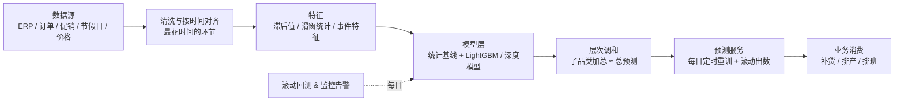
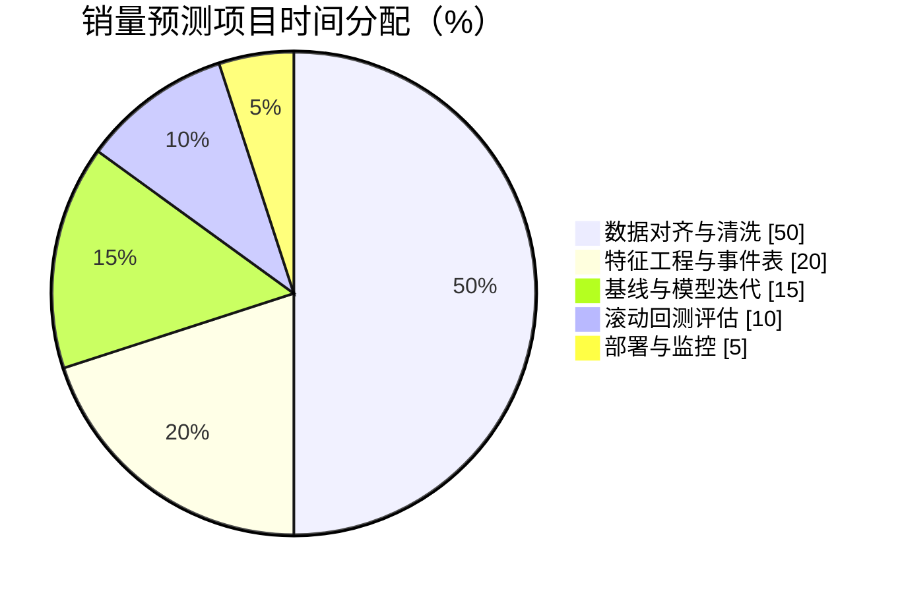
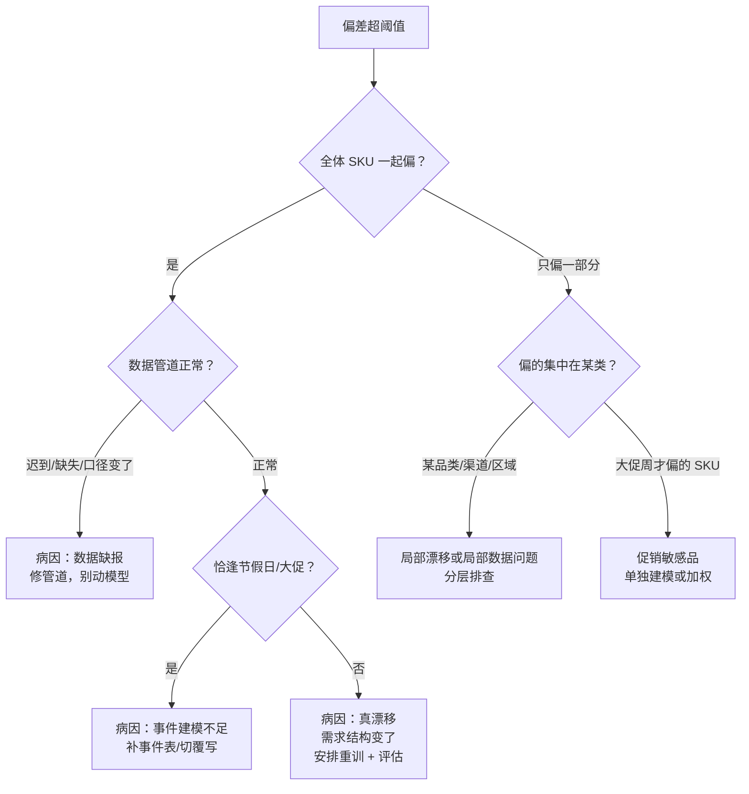

# 生产实战：销量预测系统落地

> **一句话理解**：课本上的时序预测是"一条序列、一个指标"，生产上的销量预测是"成千上万个 SKU、每天滚动出数、错了有人按它下单"——最难的不是模型，是把数据按时间对齐干净。

[⬆️ 返回总目录](../../../README.md) · [⬆️ 返回本篇](../README.md) · [⬅️ 返回本章目录](./README.md)

| 属性 | 说明 |
|------|------|
| 难度 | ⭐⭐ |
| 所属分支 | 时序 |
| 前置知识 | 本章全部正文 |

---

## 🏭 一个真实项目从 0 到 1

场景设定：连锁零售要做**SKU 级销量预测**，供补货与排产使用——两百家店、上万 SKU、日粒度。

先看项目画像（经验参考量级，随企业规模浮动）：

| 维度 | 量级 |
|------|------|
| 团队 | 1~2 名算法/数据 + 1 名工程 + 供应链对接人 |
| 工期 | 基线版 3~4 周可用，完整系统 3~6 个月，此后长期迭代 |
| 数据 | 两年历史 × 上万 SKU 日销量 + 促销/价格/节假日事件表 |
| 预算大头 | 数据治理与管道工程；算力开销反而不大（CPU 为主） |

时间都花在哪（经验参考，零售与制造业都差不多）：

分阶段拆解（做什么、花多久、常见卡点）：

- **需求定义**：先钉死三个问题。**粒度**：日级还是周级？SKU 级还是店-仓级组合？粒度每细一层，序列数量平方级上涨；**预测距离（horizon）**：预测未来 1 天、7 天还是 28 天？补货要 7~14 天（覆盖在途），排产要月级；**谁消费预测值**：补货系统要分位数（备货看 P90 才不缺货），报表要均值——同一模型、不同输出口径，先对齐再动工。
- **数据**：两年左右历史是常见起点（要覆盖至少两个完整旺季周期）。核心特征：滞后值（昨天/上周同日/去年同月销量）、滑窗统计（7 日均）、事件特征（促销、节假日、调价、天气）。**数据质量是命门**：退货冲减口径、门店开关、缺货时的"销量 0"（其实是有需求没货）都要处理；对齐与清洗常占项目总时间的一半以上。
  - 对齐三查：时间戳用下单时间还是发货时间（全表统一）；退货有没有从销量里冲减（口径统一）；缺货日的"0"要打缺货标记或剔除（别让模型学会"卖不动"）。
  - 事件表常常比模型重要：促销深度（满减力度/折扣率）、覆盖范围、起止日期——漏标的促销就是给模型埋雷。
- **设备与算力**：这个项目大概率**不需要 GPU**——上万条序列的 GBRT 训练在多核 CPU 上分钟到小时级；只有上深度模型或基础模型微调才需要单张 GPU。云上按需租即可。
- **算法选型（基线先行，如实讲）**：**很多生产预测系统的主力就是梯度提升树（GBRT，如 LightGBM）+ 滞后特征，不是深度学习**——上万 SKU 各自小数据、特征工程可复用、CPU 训练、可解释，工程性价比极高。第一周就该交付两个基线：朴素基线（去年同期 / 上周同日）与 LightGBM；之后所有花哨模型都必须先打赢它们再上岗。深度模型（本章 02、03 页）在**多变量多序列海量数据**时才显优势：跨序列共享规律、长依赖、端到端事件融合。
- **训练炼丹**：全量重训 vs 增量更新先想清楚（GBRT 全量重训往往就够）；实验记录用 MLflow/W&B 记录每次特征改动；按门店/SKU 分层抽样建验证面板，别只看总榜。
- **评估**：**滚动回测（Backtesting）**：把"今天"依次模拟为历史若干个时点，每次只用该时点之前的数据训练、预测其后 horizon，汇总误差。**切分千万不能随机 shuffle**——随机打乱等于把未来泄漏进训练集，离线分数虚高、上线现原形（见坑 3）。指标分层看：总量看 MAPE/WAPE，SKU 级看分位数损失，头部 SKU 单独出报告。
  - 按周期分层再排一次榜：平日、周末、大促、春节各看一眼——大促期间误差常是平日的 3~5 倍（经验参考），别让平均分掩盖。
- **层次调和**：一万条 SKU 预测各自加总后应≈品类预测、≈总盘预测——不然"SKU 都说涨、大盘说跌"的笑话会出现（做法见下文专节）。
- **部署**：每日定时任务（Airflow 类调度）：凌晨数据到齐 → 重训/更新 → 滚动输出未来 horizon → 写入预测服务表 → 业务系统读取。监控预测偏差告警与概念漂移检测（近 7 天真实 vs 预测的偏差超阈值即告警），并留人工覆写通道（大促前业务手动调整要有记录，反哺特征）。
  - 管道各环节要有超时与兜底：当天数据迟到就用"昨日模型 + 昨日特征"出数——预测系统宁可出一版旧的，不能不出数。

📋 展开一个真实的迭代故事

上线三个月，模型在"双十一"当周翻了车：预测 8000，实际 21000。复盘发现两件事：训练数据里历年大促的促销深度特征标注不全，模型只把大促当普通周末波动；且需求方在两周前已确认今年促销力度翻倍，这个信息没有通道进模型。修复：补齐历史促销深度字段、上线"未来事件登记表"（业务提前录入已排期促销，作为已知未来输入喂给模型），并把"大促期间自动切换到业务覆写优先"写进流程。教训：**模型不知道你嘴里的计划，事件信息要有进模型的通道**。

## 🔁 回测的三种滚动方案：各自的偏差与适用

滚动回测不是只有一种滚法，训练窗口怎么滚决定了"模拟的上线环境"偏乐观还是偏保守：

| 方案 | 做法 | 内在偏差 | 适用 |
|------|------|---------|------|
| **扩张窗（Expanding）** | 每折训练集 = 全部历史（第 1 折用 1~18 月，第 2 折用 1~19 月……） | 越往后旧数据占比越大：规律变化快的业务里，两年前的过时规律稀释了近期信号 | 规律稳定的成熟业务（电力、日用品）；数据本来就少时也别切 |
| **滑动窗（Sliding）** | 固定窗口长度（如最近 52 周），旧数据滑出 | 丢掉久远历史：窗口短于两倍主周期时，年度季节都看不全（窗口 52 周恰好只装下一个周期，模型没见过"第二个冬天"的对照） | 规律变化快、有明显结构性变化的业务（换过定位的门店、改版过的 App） |
| **混合（Hybrid）** | 近期全量 + 远期降权/抽样，或"大周期用长窗、局部规律用短窗" | 实现复杂一点，需要验证两种粒度各自没拖后腿 | 既有长周期又有快变化的零售大盘（常见生产折中） |

经验参考三句话：**窗口至少容纳两个完整主周期**；换方案必须整组重跑（半程换滚法 = 前后分数不可比）；无论哪种方案，"每折训练时只用该折时点之前的数据"这条铁律不变——变的只是"丢弃多旧的历史"。

📋 展开：滚动回测切分示意（为什么不能 shuffle）

设历史为 24 个月，horizon = 1 个月，做 4 折扩张窗滚动回测：

- 第 1 折：用第 1~18 月训练 → 预测第 19 月 → 与真实比；
- 第 2 折：用第 1~19 月训练 → 预测第 20 月；
- 第 3 折：用第 1~20 月训练 → 预测第 21 月；
- 第 4 折：用第 1~21 月训练 → 预测第 22 月。

四折误差汇总，就是"模拟上线后连续四个月的表现"。若随机 shuffle，训练集里混着"第 20 月"、去预测"第 19 月"——时间倒流，信息泄漏，分数再高也是假象。同一框架下把训练集改成"每折只用最近 12 个月"，就得到滑动窗版本，可直接对比两种滚法在你数据上的差异。

## 🧮 层次调和的两种做法

上万条 SKU 预测完后，各层必须对得上账。两种经典做法：

**① 自底向上（Bottom-up）**：底层 SKU 预测直接加总成品类、加总成总盘。

- 优点：简单、保留底层细节、每层口径天然一致；
- 缺点：**底层噪声逐级累积**——单个 SKU 的误差只有 ±20%，但上千条误差叠出来的总盘预测方差很大；长尾 SKU（月销几件）的噪声尤其伤顶层。

**② 最小二乘调和（MinT 思想）**：不再强行选"自下而上"或"自上而下"，而是把所有层的原始预测（独立做出的 SKU 层、品类层、总盘层）放在一起，**在"满足加总约束"的前提下，整体离各原始预测最近**：

$$
\min_{\tilde{Y}} \;\sum_{\text{所有层}} \big\| \tilde{Y}_{\text{层}} - \hat{Y}_{\text{层}} \big\|^2 \quad \text{s.t.} \quad \text{子层加总} = \text{父层}
$$

> 👉 **人话**：像一张弹簧网——每个节点是自己那层做出的原始预测（各拽着自己的方向），约束是"子节点加起来必须等于父节点"。松手后全网拉扯到平衡，得到的是"谁也不用全盘妥协、但整体账能对上"的一组修正预测。直觉上：**可信度高（历史误差小）的层拉力大，修正时说话权大**。实现层面常见做法是对各层预测误差的协方差做加权（MinT-WLS 一类），库如 hierarchicalforecast 开箱可用。

实践路线：**先自底向上跑通对账，顶层波动大再上最小二乘调和**——多数团队 80% 的对账需求，简单版就够了。

## 🌲 预测偏差归因：一棵区分树

监控告警"近 7 天偏差超阈值"之后，第一个问题不是"重训"，而是"**为什么偏**"。四种常见病因走这棵树：

四类病因的鉴别与处置：

| 病因 | 鉴别特征 | 处置 |
|------|---------|------|
| **节假日/事件** | 偏差只在特定日期窗口出现，且方向与事件强度相符 | 核对节假日表与事件登记表；给模型补事件特征或分位数调档 |
| **促销** | 只有参与促销的 SKU 偏，偏差幅度与促销深度相关 | 补促销深度特征；大促样本加权；必要时业务覆写优先 |
| **数据缺报** | 偏差其实是"真实值还没到齐"造成的假象；管道日志有迟到/缺失 | 修管道与兜底；**千万别拿残缺数据重训** |
| **真漂移** | 排除以上三种后仍持续同向偏差，且渐变 | 安排重训；评估是否结构性变化（需换特征/换模型） |

> 👉 **人话**：先分清"世界变了"还是"数据错了"还是"事件没建模"——三种情况的处方完全不同，吃错药（比如数据缺报时猛重训）会把小病治成大病。

## 🆕 新品冷启动

📋 展开：新品冷启动——相似品过渡法怎么做

新 SKU 上架，自身历史为零，按四步过渡：

1. **找相似品**：同品类 × 同价位带 × 同销售渠道（如"夏季短袖 T 恤、99~129 元、华东门店"），取三五条种子曲线。相似品不止一条时按相似度加权平均（品类全中权重最高，渠道其次）——别只挑一条最像的，单条曲线的偶然性太大；
2. **借曲线初始化**：用相似品历史（或其加权均值曲线）当作新品的"虚拟历史"喂给模型，预测从第一天就能出数；
3. **快速切换**：新品真实数据积累 4~8 周后，虚拟历史的权重逐日下调，平滑切换到自身数据；
4. **监控切换点**：切换期误差单独盯，发现明显偏离立即回退权重——新品首发爆冷或爆火都常见，宁可慢一点换。

经验参考：这套过渡法能把新品首月的预测误差从"纯猜"拉到与成熟品相差不多的量级。注意它是**映射不是魔法**：相似品选错（比如拿棉服曲线映射新款防晒衣），前几周的预测会系统性错方向——切换机制就是给这个风险上的保险。

## 🧭 场景选型表

| 场景 | 推荐 | 理由 | 不推荐 |
|------|------|------|--------|
| 单条/少量序列、要快出结果 | ARIMA / Prophet | 数据要求低、可解释、当天出活 | 深度模型（杀鸡用牛刀且更差） |
| 多 SKU、海量序列、工程性价比优先 | LightGBM + 滞后特征 | CPU 训练、稳、好维护，很多生产系统的真身 | 逐条序列手工调 ARIMA（调不过来） |
| 多变量、长依赖、跨序列共享规律 | Transformer 时序模型 | 注意力回看、多序列联合建模 | 小数据硬上（过拟合） |
| 缺标注、想立刻出预测 | 时序基础模型（API/开源） | zero-shot，给历史就出数 | 从零训练自研模型（没必要） |
| 业务方要求"解释得通" | 统计模型 + TFT 类可解释模型 | 分解结构与变量权重看得见 | 纯黑盒深度模型（会议室里说不清） |
| 大促/事件主导的类目 | GBRT + 事件特征为主 | 事件影响可显式建模，促销可控可查 | 纯自回归（把大促当"无缘无故的尖峰"） |
| 长周期计划（月度/季度） | 先聚合成月序列再预测 | 聚合后噪声小、规律稳 | 日级预测再手动加总（误差逐级放大） |
| 要预测区间（备货线） | 分位数损失（多分位多头） | 不依赖正态假设，P90/P10 直接出 | 只报均值再拍脑袋乘系数（区间没有统计含义） |

## 🧰 真实工具链

| 环节 | 常用工具 | 一句话点评 |
|------|----------|-----------|
| 统计建模 | statsmodels | 分解、ARIMA/SARIMA 的标准件，配合 01 页的直觉用 |
| 快速基线 | Prophet | 节假日友好，业务同学也能调，当基线很称职 |
| 梯度提升 | LightGBM | 生产预测的主力引擎，CPU 上跑得飞快 |
| 时序基础模型 | TimesFM / Chronos / Moirai（开源或 API） | zero-shot 起步，微调再上一层，评估照旧严格 |
| 层次调和 | hierarchicalforecast | 自底向上/MinT 调和的开箱实现 |
| 调度与管道 | Airflow（或 DolphinScheduler） | 每日重训、滚动出数、失败重试的骨架 |
| 实验跟踪 | MLflow / W&B | 特征一多，没记录就是玄学现场 |
| 监控看板 | Grafana / Prometheus | 预测偏差与漂移告警可视化，值班必备 |

## 📈 上线后盯什么（监控指标）

| 指标 | 看什么 | 告警参考 |
|------|--------|---------|
| 滚动 WAPE | 近 7/28 天加权绝对百分比误差 | 连续超基线 20% 即告警 |
| 偏差方向 | 连续偏高还是偏低（系统性偏差） | 连续 7 天同向偏差即告警（触发归因树） |
| 分层误差 | 头部 SKU / 品类 / 门店分层 | 单层爆表就单独复盘 |
| 区间覆盖率 | 真实值落进 P10~P90 区间的比例 | 显著偏离 80% = 区间失真（模型过度自信/保守） |
| 覆写率 | 业务人工修改预测的比例 | 覆写率升高 = 模型信任度在流失 |
| 数据管道 | 数据到达时间与完整性 | 迟到/缺失触发兜底流程 |
| 模型版本 | 上线版本、日期、回测分数 | 版本可回溯，出问题可一键回滚 |
| 概念漂移 | 特征分布与残差的自相关变化 | 漂移显著即安排重训 |

监控的灵魂一句话：**告警要指到动作**——每条告警都该对应"谁、做什么"（降阈值/重训/切兜底/走归因树），只响不动的告警很快就没人看了。

## 💣 踩坑实录

- **坑 1：促销冲击把模型带偏** → 大促的销量尖峰会污染"去年同期""滑动均值"这些滞后特征，平时准、大促崩。救法：促销打标进特征、大促样本单独加权或分段建模、上线事件登记通道。
- **坑 2：新品冷启动没历史** → 新 SKU 零历史，任何时序模型两眼一抹黑。救法：用同品类/同价位相似品的曲线初始化（"像谁就先照谁预测"），上架前 4~8 周靠这个过渡，再切换到自身数据。
- **坑 3：随机切分造成的虚假高分** → 评估时随机 shuffle，等于训练时偷看了未来，离线 MAPE 好看到不敢信，上线惨不忍睹。救法：只用**按时间先后切分的滚动回测**，这是时序评估的铁律，没有例外。
- **坑 4：偏差告警一响就重训** → 告警后不归因直接重训，若是数据缺报或事件没建模，重训等于把噪声学进模型。救法：先走归因树分清四类病因，再开处方。

## 🗣️ 炼丹师大实话

> "时序项目最贵的不是模型，是把数据按时间对齐干净——退货口径、缺货假零、促销漏标，这三件事能吃掉项目一半时间；它们不性感，但决定上限。"

---

[⬅️ 上一页：进阶专题：序列建模前沿](./04-进阶专题-序列建模前沿.md) · [返回本章目录](./README.md) · [下一页：第 7 章：自然语言处理与大语言模型 ➡️](../07-自然语言处理与LLM/README.md)
