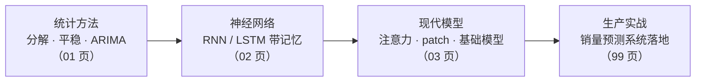

# 第 6 章：时间序列 📈（预知）

> 时间序列（Time Series）就是**带时间顺序的观测值**：每天的销量、每小时的用电量、每分钟的接口延迟。它的本质特点是**顺序本身携带信息**——这是与普通表格数据的分水岭：把普通表格的行打乱，模型照常能学；把时序的行打乱，"过去"与"未来"就全乱了。预测未来 = 用已发生的推测未发生的，机器的这种能力就叫"预知"。本章按"统计方法 → 神经网络 → 现代模型"三段式展开：先学老而弥坚的 ARIMA，再学带记忆的 RNN/LSTM，最后看注意力与预训练浪潮如何改造时序。

[⬆️ 返回总目录](../../../README.md) · [⬆️ 返回本篇](../README.md)

## 🗺️ 本章知识树：三段式路线

三段不是"淘汰关系"而是"工具箱分层"：数据少时统计方法依然最能打；深度模型吃数据量与变量数；时序基础模型提供零样本新选项——怎么选，03 页末尾有决策图，99 页有选型表。

## 🆚 时序数据与普通表格差在哪

| | 普通表格数据 | 时间序列 |
|---|---|---|
| 行的顺序 | 随意，打乱不影响学习 | **就是信息本身**，打乱即毁灭 |
| 样本独立性 | 行与行独立同分布 | 相邻时刻强相关（今天像昨天） |
| 训练/测试切分 | 随机切分 | **必须按时间先后**，否则"偷看未来" |
| 典型问题 | 这条记录是哪类？ | 下一个时刻/时期是多少？ |

## 🌍 时序预测都在哪用

| 应用 | 一句话 |
|------|--------|
| 销量预测 | 备货、补货、大促规划的前提（本章 99 页主角） |
| 负载与容量规划 | 服务器扩容、电力调度，看未来峰值 |
| 股价预测 | 免责一句：**股价预测极难**——市场近乎有效、噪声远大于信号，任何"稳赚模型"都值得先怀疑 |
| 天气与水文 | 数值模式 + 统计校正的强强联合 |
| 设备故障预警 | 振动、温度曲线先于故障异常，早发现早停机 |

## 🧭 怎么读本章

- **按序读**（01 → 02 → 03 → 99）：三段式路线是认知递进，"分解/平稳"的直觉会在 03 页（趋势季节分解内建进网络）反复回收；
- **代码跟着跑**：01 页统计分解用 statsmodels、02 页 LSTM 用 PyTorch，CPU 均可承受（01 页数据需联网下载）；
- **带着一个问题读**：如果你要预测手里的某条曲线，先问它平稳吗、有季节吗、有几条、要预测多远——读到 99 页你应该能给出完整方案。

## 📖 推荐阅读顺序

| 顺序 | 页面 | 难度 | 一句话说明 |
|------|------|------|-----------|
| 1 | [时间序列分析入门](./01-时间序列分析入门.md) | ⭐⭐ | 分解、平稳性、ARIMA——动手前先学会"看"序列 |
| 2 | [RNN 与 LSTM](./02-RNN与LSTM.md) | ⭐⭐⭐ | 给网络装上记忆，边读边记的序列模型 |
| 3 | [现代时间序列模型](./03-现代时间序列模型.md) | ⭐⭐⭐⭐ | 注意力、patch、时序基础模型：NLP 的配方搬进时序 |
| 收官 | [生产实战](./99-生产实战.md) | ⭐⭐ | 销量预测系统从 0 到 1 落地 |

## 🎯 读完本章你应该能

- 把一条序列拆成**趋势、季节、残差**，并用差分判断它平不平稳；
- 说清 ARIMA 三个字母（AR 惯性、I 差分、MA 纠偏）各自在干嘛，跑通一次分解与预测；
- 讲清 RNN 的隐藏状态如何传递、LSTM 三道门如何解决"读完忘开头"；
- 用"数据量、变量数、长依赖、算力"四个维度在 LSTM 与 Transformer 之间做选择，知道时序基础模型能零样本预测；
- 记住生产铁律：评估用滚动回测，**切分永远不能随机打乱**。

## 🔗 与其他章节的关系

- **前置章节**：[第 4 章：深度学习基础](../../3-深度学习/04-深度学习基础/README.md)——02 页的 RNN/LSTM 是神经网络在序列上的延伸，训练循环仍用第 4 章那套。
- **横向呼应**：[第 7 章：自然语言处理与大语言模型](../07-自然语言处理与LLM/README.md)——03 页的主角是把该章的 Transformer 与注意力机制搬进时间轴；语言和时序都是"序列"，方法论高度互通。
- **后续章节**：[第 11 章：因果推断](../11-因果推断/README.md)——预测回答"未来大概多少"，因果回答"促销到底涨了多少销量"；业务预测的经典组合正是第 6 + 11 章。下一章先去第 7 章看语言的世界。

---

[⬅️ 上一章：第 5 章：计算机视觉](../05-计算机视觉/README.md) · [返回总目录](../../../README.md) · [下一章：第 7 章：自然语言处理与大语言模型 ➡️](../07-自然语言处理与LLM/README.md)
