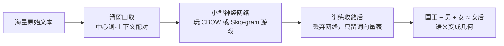
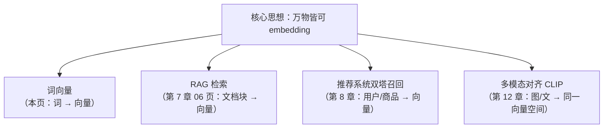

# 词向量与 embedding

> **一句话理解**：把每个词变成一串数字（向量），让意思相近的词在"向量空间"里离得近——从此"语义"这种玄学，变成了可以计算的数学。

[⬆️ 返回总目录](../../../README.md) · [⬆️ 返回本篇](../README.md) · [⬅️ 返回本章目录](./README.md)

| 属性 | 说明 |
|------|------|
| 难度 | ⭐⭐⭐（较难） |
| 所属分支 | NLP与LLM |
| 前置知识 | [神经网络是怎么炼成的](../../3-深度学习/04-深度学习基础/01-神经网络是怎么炼成的.md)（知道"训练 = 朝着目标调参数"即可） |

---

## 📌 这一节解决什么问题

计算机只认数字，而语言是符号。最早的表示方法叫 **one-hot 编码（独热编码）**：先建一个包含所有词的大词典，每个词用一条"只有一个位置是 1、其余全是 0"的超长向量表示。这个方案有三个致命伤：

- **词典巨大**：常见语言动辄几十万词，向量维度随之暴涨，每句话都是一个巨大而稀疏的矩阵；
- **没有语义**"猫"的向量和"狗"的向量没有任何关系，"猫"和"汽车"也没有任何区别——在数学上它们完全平等；
- **互相正交**：任意两个不同词的 one-hot 向量点积恒为 0，你想算"猫和狗有多相似"？答案是 0，和"猫与汽车"一模一样。

2013 年前后，研究者换了一个思路：与其让语言学家手工给词标注属性，不如让模型从海量文本里**自己学出**每个词的表示——这就是词向量（Word Embedding，"词嵌入"）。它掀开了"预训练 + 迁移"时代的序幕：先在无标注的大语料上学习通用表示，再拿去干各种下游任务。

## 🌱 通俗理解

词向量的理论根基只有一句话，叫**分布式假设（Distributional Hypothesis）**：

> **看一个词的朋友圈，就知道它是什么人。**

"苹果"的朋友圈里频繁出现"吃、香蕉、水果、维生素"；"华为"的朋友圈里频繁出现"手机、芯片、发布会"。两个词从没见过面，但只要朋友圈高度重合，它们八成就沾亲带故。词向量做的事，就是把"朋友圈重合度"压缩进一个几百维的稠密向量里。

**word2vec** 是最经典的训练方法，本质是拿神经网络玩两种"文字游戏"：

- **CBOW（Continuous Bag-of-Words，连续词袋）＝完形填空**：把句子挖个空，用上下文猜中心词。"我 ___ 咖啡"→ 大概率"喝"。
- **Skip-gram（跳字模型）＝反过来**：给中心词，猜它周围会出现谁。"喝"周围可能是"我、咖啡、水、汤"。

玩几亿次这个游戏后，为了"猜得准"，每个词就被迫学出一个能反映它惯常搭配的向量。最著名的副产品是：**语义居然可以做算术**——国王 − 男 + 女 ≈ 女王（下面马上算给你看）。

## 📋 举个例子

真实的词向量是几百维的，没法画。我们造一个 **2 维玩具世界**（数字是编的，只为示意"向量能承载语义方向"这一思想）：

| 词 | 向量 | 玩具设定 |
|------|--------|----------|
| 国王 | [0.90, 0.10] | "权力"高、"性别男"高 |
| 王后 | [0.86, 0.48] | "权力"高、"性别"偏女 |
| 男 | [0.10, −0.40] | 主要是"性别男"方向 |
| 女 | [0.05, 0.00] | 主要是"性别女"方向 |

做算术：国王 − 男 + 女 = [0.90 − 0.10 + 0.05, 0.10 − (−0.40) + 0.00] = **[0.85, 0.50]**。

拿这个结果去和所有词算距离：离"王后"（[0.86, 0.48]）最近，距离约 0.022；离"国王"反而远。也就是说，"从国王身上去掉男性属性、加上女性属性"这个动作，在向量空间里真实地"走"到了王后附近——语义关系被几何结构记住了。

<details>
<summary>📊 展开完整算例：距离是怎么算的</summary>

用欧氏距离（或更常用的余弦相似度）验证"最近邻是王后"：

- 与"王后"的距离：$\sqrt{(0.85-0.86)^2 + (0.50-0.48)^2} = \sqrt{0.0001+0.0004} = \sqrt{0.0005} \approx 0.022$
- 与"国王"的距离：$\sqrt{(0.85-0.90)^2 + (0.50-0.10)^2} = \sqrt{0.0025+0.16} \approx 0.403$

0.022 远小于 0.403，所以"国王 − 男 + 女"的最近邻是"王后"。

注意两点：① 这是精心构造的玩具数字，真实词向量中该性质只是**近似**成立（很多关系并不沿整齐方向排列，反例不少）；② 真实词向量维度通常 100~300，没有任何一维单独对应"性别"或"权力"，语义分散在所有维度构成的几何结构里。

</details>

<details>
<summary>🧮 展开看：Skip-gram 的一条训练样本是怎么构造的</summary>

拿句子"我 爱 自然 语言 处理"，设窗口大小 window = 2（往前往后各看 2 个词）：

1. 滑到中心词"语言"（下标 3），它的邻居是下标 1、2、4 的词（下标 5 越界，不计）；
2. 于是产出 3 条正样本：("语言" → "爱")、("语言" → "自然")、("语言" → "处理")；
3. 训练时就是一道道选择题："语言"的向量要和谁拉近？和"爱/自然/处理"拉近，和随机抽的负样本（比如"苹果"）拉远。

把几亿条这样的样本喂给一个只有一层的小网络，训练完扔掉网络、只留每个词的输入向量，就是词向量。负采样（Negative Sampling）是让这件事算得动的关键工程技巧。

</details>

## 🧠 核心原理

### 整体流程





### 逐步拆解

one-hot 的问题用公式看更清楚。设词典大小为 $|V|$，词 $w$ 在词典里排第 $k$ 位：

$$
\mathbf{x}_w = [0,\; 0,\; \dots,\; \underbrace{1}_{\text{第 } k \text{ 位}},\; \dots,\; 0] \in \mathbb{R}^{|V|}
$$

> 👉 **人话**：词典有多长向量就有多长，自己那一位是 1，其余全是 0——所以任意两个词的内积都是 0，"相似度"这个概念直接失效。

Skip-gram 的训练目标（负采样形式简化后）：

$$
\frac{1}{T}\sum_{t=1}^{T}\sum_{\substack{-c \le j \le c \\ j \neq 0}} \log P(w_{t+j} \mid w_t)
$$

> 👉 **人话**：把每个窗口里的"中心词猜邻居"都猜对，全都加起来取平均——训练就是把这个"接龙得分"最大化。

其中"猜"用的概率由向量点积加 softmax 给出：

$$
P(o \mid c) = \frac{\exp(\mathbf{u}_o^{\top} \mathbf{v}_c)}{\sum_{w \in V} \exp(\mathbf{u}_w^{\top} \mathbf{v}_c)}
$$

> 👉 **人话**：中心词向量和每个候选词向量做点积打分（越对口分越高），再用 softmax 把分数变成概率——两个向量越"对味"，点积越大，概率越高。

训练好之后，衡量两个词的相似度通常不用欧氏距离，而用**余弦相似度（Cosine Similarity）**：

$$
\text{sim}(\mathbf{a}, \mathbf{b}) = \frac{\mathbf{a} \cdot \mathbf{b}}{\lVert\mathbf{a}\rVert \, \lVert\mathbf{b}\rVert}
$$

> 👉 **人话**：只看两个向量指向是不是同一个方向，不看它们各自多长——"意思像不像"是方向问题，不是长度问题。

<details>
<summary>🧮 展开看：从词向量到"万物向量"（选讲）</summary>

词向量的真正遗产不是"词"，而是"**embedding 化**"这个动作：任何东西，只要你能定义出"什么算相似"，就能学一个向量表示它——

- 句子和文档 → 向量：RAG 检索的基础（见本页下游 [RAG 与 Agent](./06-RAG与Agent.md)）；
- 用户和商品 → 向量：推荐系统的双塔召回（见 [双塔模型与向量召回](../08-推荐系统/03-双塔模型与向量召回.md)）；
- 图像和文本 → 同一个向量空间：CLIP 多模态对齐（见 [多模态模型](../../5-前沿与融合/12-生成模型与多模态/04-多模态模型.md)）。

一条主线贯穿第四、五篇：**把万物变成向量，再用向量找相似**。

</details>

## 💻 动手试试

```python
# 依赖：pip install gensim
# 说明：纯本地运行，无需联网下载模型；语料是刻意构造的 8 句话
from gensim.models import Word2Vec

corpus = [
    "我 爱 吃 苹果".split(),
    "我 爱 吃 香蕉".split(),
    "他 也 爱 吃 苹果".split(),
    "我们 喜欢 吃 葡萄".split(),
    "猫 喜欢 吃 鱼".split(),
    "狗 喜欢 啃 骨头".split(),
    "猫 在 沙发 上 睡觉".split(),
    "狗 在 窝 里 睡觉".split(),
]

# sg=1 表示用 Skip-gram；vector_size=50：每个词一个 50 维向量
model = Word2Vec(sentences=corpus, vector_size=50, window=2,
                 min_count=1, sg=1, epochs=300, seed=42)

print(model.wv.most_similar("苹果", topn=3))   # 查"苹果"的相似词
print(model.wv.similarity("猫", "狗"))          # 两词相似度
print(model.wv["苹果"].shape)                   # (50,)：一个 50 维向量

# 预期输出（每次随机初始化略有差异）：
# most_similar 会优先返回和"苹果"共享上下文的词（香蕉/葡萄/吃 一类）；
# sim(猫, 狗) 会明显高于 sim(猫, 我)，因为它们的朋友圈更像。
# ⚠️ 8 句话的语料只演示"方法怎么跑"：真实词向量需要数亿词级语料，
#    别指望这里的语义质量，也别用它验证"国王−男+女"。
```

想用大规模现成词向量：中文可搜"腾讯 AI Lab 词向量"或 fastText 官方发布的预训练向量，直接加载查询。

## 🔥 炼丹小灶

> 🔥 **炼丹小灶**：自己训词向量的工业界起点配方——
> - 配方：维度 100~300、窗口 5、min_count=5（过滤生僻词）、语料越大越好，几亿词起步才有像样的语义；
> - 玄学：相似词结果怪，先怀疑语料领域不匹配（医疗语料里"苹果"挨着"膳食纤维"很正常），再怀疑词频太低；
> - ⚠️ 以上是经验参考值，不是圣旨；换语料请重新炼。

## 🖱️ 动手玩

> 🕹️ **延伸玩一玩**：[Embedding Projector](https://projector.tensorflow.org)——把高维词向量投到 2D/3D 平面上，搜一个词看它的"邻居圈"，直观感受"语义 = 几何邻近"。

## 🔗 在知识树中的位置

- **上游**：建立在[神经网络是怎么炼成的](../../3-深度学习/04-深度学习基础/01-神经网络是怎么炼成的.md)的基本训练机制上（本质是一个极浅的网络）。
- **下游**：[Transformer 与注意力机制](./02-Transformer与注意力机制.md)（词向量是它的输入层）；[RAG 与 Agent](./06-RAG与Agent.md)（文档块 embedding 检索）；[双塔模型与向量召回](../08-推荐系统/03-双塔模型与向量召回.md)（用户/商品向量）；[多模态模型](../../5-前沿与融合/12-生成模型与多模态/04-多模态模型.md)（CLIP 把图文放进同一空间）。
- **横向对比**：one-hot 是"查户口"（每个词一个独立编号），词向量是"看朋友圈"（从共现学语义）；后者之前的统计方法（TF-IDF 等）也用词共现，但不把词压缩成稠密的低维语义空间。

## ⚠️ 常见误区

- **误区一**："词向量的某一维有明确含义，比如第 1 维是性别。" → 没有。每一维都是联合学出来的混合特征，语义只存在于整体几何结构中，单看一维没有意义。
- **误区二**："语义算术总是成立。" → 只在部分关系上近似成立。反例很多：把"法国 − 巴黎 + 东京"算出来未必是"日本"，很多关系在向量空间里并不沿整齐的方向排列。
- **误区三**："词向量理解语义，所以没有偏见。" → 恰恰相反，它忠实复刻语料里的统计，语料有性别/地域偏见，向量就照单全收——这也是后面"对齐"要处理的课题之一。

## 📝 小结与自测

**要点回顾**

- one-hot 三宗罪：维度爆炸、无语义、任意两词正交（相似度恒为 0）；
- 分布式假设："看一个词的朋友圈就知道它是什么人"；CBOW 是完形填空，Skip-gram 反过来；
- 词向量让语义可计算：国王 − 男 + 女 ≈ 女王（近似成立）；
- 遗产是"万物皆可 embedding"：RAG 检索、推荐双塔、多模态 CLIP 都在这条主线上。

**自测一下**（点击展开答案）

<details>
<summary>问题 1：为什么 one-hot 向量算不出"猫"和"狗"的相似度？</summary>

任意两个不同词的 one-hot 向量，其 1 所在的位置不同，内积恒为 0；余弦相似度也恒为 0。"猫"与"狗"、"猫"与"汽车"的相似度完全相等——表示里根本没有语义信息。

</details>

<details>
<summary>问题 2：CBOW 和 Skip-gram 的预测方向分别是什么？各适合什么场景？</summary>

CBOW：用上下文预测中心词（完形填空），训练更快，适合小语料；Skip-gram：用中心词预测上下文，对低频词更友好，效果通常更好，适合大语料。

</details>

## 📚 延伸阅读

- 论文：Efficient Estimation of Word Representations in Vector Space（word2vec，2013，https://arxiv.org/abs/1301.3781）
- 论文：GloVe: Global Vectors for Word Representation（2014，https://nlp.stanford.edu/pubs/glove.pdf）
- 可视化：[Embedding Projector](https://projector.tensorflow.org)（本页"动手玩"同款，值得反复把玩）

---

[⬅️ 上一页：第 7 章导览](./README.md) · [返回本章目录](./README.md) · [下一页：Transformer 与注意力机制 ➡️](./02-Transformer与注意力机制.md)
