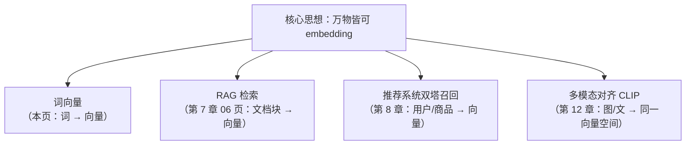
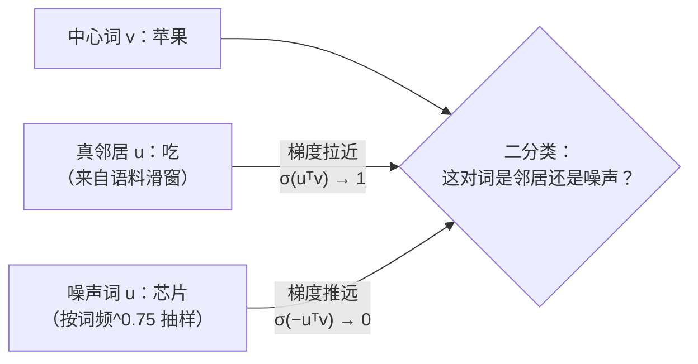
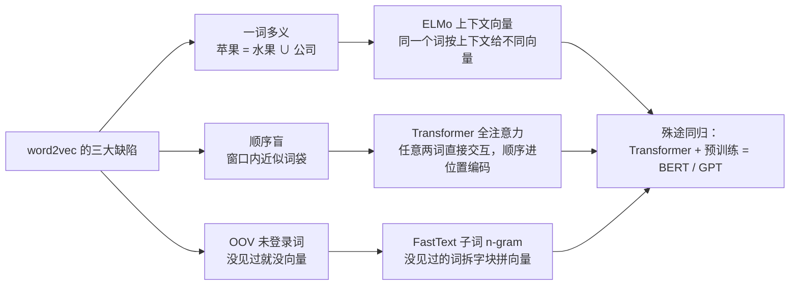

# 词向量与 embedding

> **一句话理解**：把每个词变成一串数字（向量），让意思相近的词在"向量空间"里离得近——从此"语义"这种玄学，变成了可以计算的数学。

[⬆️ 返回总目录](../../../README.md) · [⬆️ 返回本篇](../README.md) · [⬅️ 返回本章目录](./README.md)

| 属性 | 说明 |
|------|------|
| 难度 | ⭐⭐⭐（较难） |
| 所属分支 | NLP与LLM |
| 前置知识 | [神经网络是怎么炼成的](../../3-深度学习/04-深度学习基础/01-神经网络是怎么炼成的.md)（知道"训练 = 朝着目标调参数"即可） |

---

## 📌 这一节解决什么问题

计算机只认数字，而语言是符号。最早的表示方法叫 **one-hot 编码（独热编码）**：先建一个包含所有词的大词典，每个词用一条"只有一个位置是 1、其余全是 0"的超长向量表示。这个方案有三个致命伤：

- **词典巨大**：常见语言动辄几十万词，向量维度随之暴涨，每句话都是一个巨大而稀疏的矩阵；
- **没有语义**"猫"的向量和"狗"的向量没有任何关系，"猫"和"汽车"也没有任何区别——在数学上它们完全平等；
- **互相正交**：任意两个不同词的 one-hot 向量点积恒为 0，你想算"猫和狗有多相似"？答案是 0，和"猫与汽车"一模一样。

2013 年前后，研究者换了一个思路：与其让语言学家手工给词标注属性，不如让模型从海量文本里**自己学出**每个词的表示——这就是词向量（Word Embedding，"词嵌入"）。它掀开了"预训练 + 迁移"时代的序幕：先在无标注的大语料上学习通用表示，再拿去干各种下游任务。

但词向量不是终点站。它有三个娘胎里带来的缺陷——**一词多义**（"苹果"是水果还是公司，向量只有一个）、**顺序盲**（窗口内词序信息几乎丢失）、**未登录词（OOV, Out-of-Vocabulary）**（没见过的词没有向量）——这三个缺陷各自被后来者解决，一步步把 NLP 推向 Transformer 与 LLM（本页末尾有完整的演进主线）。所以这一页既是起点，也是理解后面所有页的钥匙。

## 🌱 通俗理解

词向量的理论根基只有一句话，叫**分布式假设（Distributional Hypothesis）**。语言学家 Firth 在 1957 年给出过它的经典表述：

> **"You shall know a word by the company it keeps."（观其伴，知其义）——J. R. Firth, 1957**

翻译成大白话：**看一个词的朋友圈，就知道它是什么人。**

"苹果"的朋友圈里频繁出现"吃、香蕉、水果、维生素"；"华为"的朋友圈里频繁出现"手机、芯片、发布会"。两个词从没见过面，但只要朋友圈高度重合，它们八成就沾亲带故。词向量做的事，就是把"朋友圈重合度"压缩进一个几百维的稠密向量里。

这个假设为什么能 work？做一个 30 秒的**滑窗统计**就明白了。拿一篇讲水果的文章，画一个大表格：行是词，列是"这个词左右各 5 个词的窗口里出现过哪些词"，格子里填出现次数。你会发现：

- "苹果"和"香蕉"两行长得非常像（都被"吃/买/水果/新鲜"包围）；
- "苹果"和"芯片"两行几乎不重叠（除非语料混了大量科技新闻——这时"苹果"自己就会被拉向两个方向，这正是"一词多义"问题的伏笔）。

统计学家几十年前就会做这张表（叫**共现矩阵，Co-occurrence Matrix**），问题是表太大、太稀疏。词向量的贡献是：**用一个小网络把这张巨大稀疏的表"压缩"成一个稠密低维的空间**，让"行相近"变成"点相近"。数学上，这和把one-hot 的共现计数做一次降维（如矩阵分解）是一脉相承的——GloVe 干脆直接分解共现矩阵，word2vec 则用"预测任务"间接达到同样效果。

**word2vec** 是最经典的训练方法，本质是拿神经网络玩两种"文字游戏"：

- **CBOW（Continuous Bag-of-Words，连续词袋）＝完形填空**：把句子挖个空，用上下文猜中心词。"我 ___ 咖啡"→ 大概率"喝"。
- **Skip-gram（跳字模型）＝反过来**：给中心词，猜它周围会出现谁。"喝"周围可能是"我、咖啡、水、汤"。

玩几亿次这个游戏后，为了"猜得准"，每个词就被迫学出一个能反映它惯常搭配的向量。最著名的副产品是：**语义居然可以做算术**——国王 − 男 + 女 ≈ 女王（下面马上算给你看）。

## 📋 举个例子

真实的词向量是几百维的，没法画。我们造一个 **2 维玩具世界**（数字是编的，只为示意"向量能承载语义方向"这一思想）：

| 词 | 向量 | 玩具设定 |
|------|--------|----------|
| 国王 | [0.90, 0.10] | "权力"高、"性别男"高 |
| 王后 | [0.86, 0.48] | "权力"高、"性别"偏女 |
| 男 | [0.10, −0.40] | 主要是"性别男"方向 |
| 女 | [0.05, 0.00] | 主要是"性别女"方向 |

做算术：国王 − 男 + 女 = [0.90 − 0.10 + 0.05, 0.10 − (−0.40) + 0.00] = **[0.85, 0.50]**。

拿这个结果去和所有词算距离：离"王后"（[0.86, 0.48]）最近，距离约 0.022；离"国王"反而远。也就是说，"从国王身上去掉男性属性、加上女性属性"这个动作，在向量空间里真实地"走"到了王后附近——语义关系被几何结构记住了。

词向量算术的三种下场（正常 / 极端 / 失败各一个，都用真实词向量能复现的现象说明）：

| 情况 | 例子 | 结果 | 为什么 |
|------|------|------|--------|
| ✅ 正常 | 国王 − 男 + 女 ≈ 女王 | 最近邻确实是"女王/王后" | "性别"这类关系在语料里呈现稳定的方向偏移 |
| ⚠️ 极端 | 首都 − 国家：巴黎 − 法国 + 中国 | **经常算不出"北京"**，可能冒出别的中国城市或无关词 | "首都"关系不如"性别"关系在语料中分布均匀，偏移方向不稳 |
| ❌ 失败 | 多义词：苹果 − 香蕉 + 芯片 | 结果落在水果和公司之间的"无人区" | 一个词只有一个向量，但它的语境有两个聚类，向量被迫取折中——这是 word2vec 的结构性缺陷 |

<details>
<summary>📊 展开完整算例：距离是怎么算的</summary>

用欧氏距离（或更常用的余弦相似度）验证"最近邻是王后"：

- 与"王后"的距离：$\sqrt{(0.85-0.86)^2 + (0.50-0.48)^2} = \sqrt{0.0001+0.0004} = \sqrt{0.0005} \approx 0.022$
- 与"国王"的距离：$\sqrt{(0.85-0.90)^2 + (0.50-0.10)^2} = \sqrt{0.0025+0.16} \approx 0.403$

0.022 远小于 0.403，所以"国王 − 男 + 女"的最近邻是"王后"。

注意两点：① 这是精心构造的玩具数字，真实词向量中该性质只是**近似**成立（很多关系并不沿整齐方向排列，反例不少）；② 真实词向量维度通常 100~300，没有任何一维单独对应"性别"或"权力"，语义分散在所有维度构成的几何结构里。

</details>

<details>
<summary>🧮 展开看：Skip-gram 的一条训练样本是怎么构造的</summary>

拿句子"我 爱 自然 语言 处理"，设窗口大小 window = 2（往前往后各看 2 个词）：

1. 滑到中心词"语言"（下标 3），它的邻居是下标 1、2、4 的词（下标 5 越界，不计）；
2. 于是产出 3 条正样本：("语言" → "爱")、("语言" → "自然")、("语言" → "处理")；
3. 训练时就是一道道选择题："语言"的向量要和谁拉近？和"爱/自然/处理"拉近，和随机抽的负样本（比如"苹果"）拉远。

把几亿条这样的样本喂给一个只有一层的小网络，训练完扔掉网络、只留每个词的输入向量，就是词向量。负采样（Negative Sampling）是让这件事算得动的关键工程技巧（公式见"核心原理"）。

</details>

## 🧠 核心原理

### 整体流程




### 逐步拆解：one-hot 为什么不行

one-hot 的问题用公式看更清楚。设词典大小为 $|V|$，词 $w$ 在词典里排第 $k$ 位：

$$
\mathbf{x}_w = [0,\; 0,\; \dots,\; \underbrace{1}_{\text{第 } k \text{ 位}},\; \dots,\; 0] \in \mathbb{R}^{|V|}
$$

> 👉 **人话**：词典有多长向量就有多长，自己那一位是 1，其余全是 0——所以任意两个词的内积都是 0，"相似度"这个概念直接失效。

### Skip-gram 的目标函数：从"猜对邻居"到数学

Skip-gram 最大化的是：给定中心词 $w_t$ 时，窗口内每个邻居 $w_{t+j}$ 被预测出来的概率（对数形式）：

$$
\mathcal{L} = \frac{1}{T}\sum_{t=1}^{T}\sum_{\substack{-c \le j \le c \\ j \neq 0}} \log P(w_{t+j} \mid w_t)
$$

> 👉 **人话**：把每个窗口里的"中心词猜邻居"都猜对，全都加起来取平均——训练就是把这个"接龙得分"最大化。$T$ 是语料词数，$c$ 是窗口半径。

其中"猜"用的概率由向量点积加 softmax 给出（$\mathbf{u}$ 是"输出向量"，$\mathbf{v}$ 是"输入向量"，每个词各一份，见下方折叠）：

$$
P(o \mid c) = \frac{\exp(\mathbf{u}_o^{\top} \mathbf{v}_c)}{\sum_{w \in V} \exp(\mathbf{u}_w^{\top} \mathbf{v}_c)}
$$

> 👉 **人话**：中心词向量和每个候选词向量做点积打分（越对口分越高），再用 softmax 把分数变成概率——两个向量越"对味"，点积越大，概率越高。

<details>
<summary>🧮 展开完整推导：梯度揭示"拉近正样本、按概率推远所有词"的本质</summary>

**第一步：对 $\log P(o \mid c)$ 求梯度。** 记 $s_w = \mathbf{u}_w^{\top}\mathbf{v}_c$（中心词与词 $w$ 的打分），则：

$$
\frac{\partial \log P(o \mid c)}{\partial \mathbf{v}_c}
= \frac{\partial}{\partial \mathbf{v}_c}\left[ s_o - \log \sum_{w \in V} e^{s_w} \right]
= \mathbf{u}_o - \sum_{w \in V} \underbrace{\frac{e^{s_w}}{\sum_{w'} e^{s_{w'}}}}_{=\,P(w \mid c)} \mathbf{u}_w
$$

**第二步：读懂这个梯度。** 更新量 = **实际邻居的向量 $\mathbf{u}_o$ − 按当前概率加权平均的"所有词向量"**。换句话说：

- 中心词向量被拉向真实邻居；
- 同时被推离"模型当前以为会出现"的那些词——概率 $P(w|c)$ 越高的词被推得越远。

**第三步：为什么这能学出语义？** 假设"猫"和"狗"的邻居分布相近，那么对"猫"训练时，"平均项"里 dog 类向量占的权重高；对"狗"训练时猫类向量同理。两边互相"纠偏"的结果，是语义相近的词最终被挤到空间中的相邻位置——**分布式假设就这样被 softmax 梯度机械地执行了**。

**第四步：算一笔账，看它为什么训不动。** 分母要对整个词典（几十万词）求和，每一条样本、每一个梯度步都要算一遍：$T \times 2c \times |V|$ 量级的点积。一亿词的语料 × 10 邻居 × 30 万词典 ≈ $3 \times 10^{14}$ 次点积——这就是负采样要解决的问题（见下一节）。

**附：为什么每个词有两份向量？** 输入向量 $\mathbf{v}$（做中心词时用）和输出向量 $\mathbf{u}$（做候选邻居时用）分开，避免了"一个向量既要和自己点积大、又要和别人点积小"的自洽难题。最终发布词向量时通常只保留输入向量 $\mathbf{v}$。

</details>

### 负采样：把"几十万选 1"变成"1 正 + K 负"

softmax 的分母是性能杀手。**负采样（Negative Sampling）**把多分类改写成一系列二分类：给一个 (中心词, 候选词) 对，判断"它是真实邻居还是抽来凑数的噪声"。目标函数变成：

$$
\mathcal{L}_{\text{neg}} = -\sum_{(c,\,o)} \Big[ \log \sigma(\mathbf{u}_o^{\top}\mathbf{v}_c) \;+\; \sum_{k=1}^{K} \mathbb{E}_{w_k \sim P_n(w)}\, \log \sigma(-\mathbf{u}_{w_k}^{\top}\mathbf{v}_c) \Big]
$$

> 👉 **人话**：真邻居的打分要过 sigmoid 后尽量接近 1（拉近距离），随机抽的 $K$ 个"噪声词"要尽量接近 0（推远）。每条样本只算 $K+1$ 个点积（典型 K=5~20），不再遍历几十万词典——训练便宜了几个数量级。

<details>
<summary>🧮 展开看：负采样从哪来——NCE 的直觉（选讲）</summary>

负采样的理论源头是**噪声对比估计（NCE, Noise Contrastive Estimation）**，思想非常巧：

> **不会算"数据本身的概率"，就退一步：只要会分辨"数据"和"噪声"，你其实已经隐式知道了数据的分布。**

- 造一个容易采样的噪声分布 $P_n$（实践中用"词频的 3/4 次方"——比原始词频更平：既让高频噪声多点，又给低频词留机会）；
- 训练一个二分类器区分"来自语料的真样本"和"来自 $P_n$ 的假样本"；
- NCE 证明了：这个二分类器做到最优时，它内部的打分函数就还原出了真实分布的未归一化形式——**分类做好了，概率模型就免费到手**。

负采样是 NCE 的工程简化版：干脆不做概率还原，只保留"拉近正样本、推远负样本"的梯度方向。虽然理论保证打了折扣，但实验效果几乎无损，训练却快了一个数量级——深度学习史上"理论折扣换工程胜利"的经典案例。

顺带一个选择偏差：$\sigma(-\mathbf{u}^{\top}\mathbf{v})$ 的推远力在打分很大时趋近 0，所以"高频噪声词"会被反复、但越来越轻地推——这在无意中实现了一种频率平滑。

一次负采样更新在图上看就是"一拉一推"：



</details>

度量选择的数值感受（长度有含义时两者分家）：

| 向量对 | 余弦 | 欧氏距离 | 解读 |
|--------|------|---------|------|
| a=[3, 0]（高频词），b=[1, 0]（低频同义词） | 1.0（完全同向） | 2.0（很远） | 余弦说"同义"，欧氏因词频差惩罚——语义检索选余弦 |
| a=[1, 0]，b=[0.7, 0.7]（约 45°） | ≈0.71 | ≈0.76 | 归一化后两度量排序一致，任选 |

### CBOW vs Skip-gram：选哪个？

| 维度 | CBOW（上下文→中心词） | Skip-gram（中心词→上下文） |
|------|----------------------|---------------------------|
| 每个窗口的训练信号 | 1 次（上下文平均后猜 1 个词） | $2c$ 次（中心词对每个邻居各一次） |
| 训练速度 | 快 | 慢（约慢数倍） |
| 低频词效果 | 一般（低频词的"完形填空"信号被高频邻居平均稀释） | **好**（低频词每次出现都把自己的 $2c$ 个邻居充分学一遍） |
| 高频词效果 | 略好 | 略逊于 CBOW |
| 适用场景 | 小语料、求快、高频词为主的下游任务 | 大语料、追求质量、关心稀有词与类比性质 |

经验结论：语料够大时选 skip-gram（gensim 里 `sg=1`）；几十万句以内的小语料、只做相似词查询，CBOW 性价比更高。

### 词向量的三大缺陷与演进主线

word2vec 是里程碑，但它有三个结构性缺陷。重要的不是缺陷本身，而是**每个缺陷分别催生了哪个后来者**——这条演进主线贯穿 NLP 十年：



- **一词多义 → 上下文相关向量**：ELMo（Embeddings from Language Models）用双向 LSTM 读完整句，"苹果"在"吃苹果"和"苹果发布会"里得到不同向量。它证明了"向量应该属于'词的一次出现'而不是'词的类型'"，但 LSTM 的长依赖能力有限——最终由 Transformer 把这件事做到极致（[02 页](./02-Transformer与注意力机制.md)）；
- **顺序盲 → 全注意力**：窗口内"猫追狗"和"狗追猫"产生的训练信号几乎一样。注意力机制让任意两词（不受窗口限制）两两交互，词序由位置编码显式携带（[02 页](./02-Transformer与注意力机制.md)）；
- **OOV → 子词（Subword）**：FastText 把每个词拆成字符 n-gram（"苹果"→"苹/果/苹果"等），词向量 = 字块向量之和。没见过的"苹果梨"也能由"苹果"和"梨"的字块拼出合理向量；顺带缓解了拼写错误和形态丰富的语言（芬兰语、土耳其语）。子词思想后来演化为 BPE 分词，成为所有 LLM 的标配（[04 页](./04-大语言模型LLM全景.md)）。

### 向量空间的几何性质

**平行四边形法则为什么近似成立？** "国王 − 男 + 女 ≈ 女王"等价于要求偏移向量近似相等：$\mathbf{v}_{国王} - \mathbf{v}_{男} \approx \mathbf{v}_{王后} - \mathbf{v}_{女}$，即"男→女"这个关系在空间里是一个**近似恒定的平移方向**。它何时成立？当关系词对语料的影响足够"均匀"——把"他/她、国王/王后、演员/女演员"的上下文成对替换，句子的其他部分几乎不变，于是训练把每一对都往同一个方向推。它何时失效？当关系牵动上下文的方式不均匀（"法国→巴黎"换成"中国→北京"时，两国相关语料差异巨大），或多义词把向量拖向折中点——这就是上面"极端/失败"两个算例的几何解释。

**各向异性的坑（一句话级）**：真实词向量不是均匀撒在空间里的，而是挤在一个狭窄的"锥形"区域，导致**任意两个词的余弦相似度都偏高**（比如普遍 0.3 起步）。这不妨碍同一语料内"排序"，但**跨语料比较、或用绝对阈值判断"相关/不相关"时会翻车**。补救：算余弦前先把所有向量减去均值（中心化），或阈值必须在同一批向量上重新标定。

### 相似度度量：余弦 vs 欧氏

训练好之后，衡量两个词的相似度通常不用欧氏距离，而用**余弦相似度（Cosine Similarity）**：

$$
\text{sim}(\mathbf{a}, \mathbf{b}) = \frac{\mathbf{a} \cdot \mathbf{b}}{\lVert\mathbf{a}\rVert \, \lVert\mathbf{b}\rVert}
$$

> 👉 **人话**：只看两个向量指向是不是同一个方向，不看它们各自多长——"意思像不像"是方向问题，不是长度问题。

两者什么时候等价？把欧氏距离平方展开：

$$
\lVert \mathbf{a} - \mathbf{b} \rVert^2 = \lVert\mathbf{a}\rVert^2 + \lVert\mathbf{b}\rVert^2 - 2\,\lVert\mathbf{a}\rVert\lVert\mathbf{b}\rVert\cos\theta
$$

> 👉 **人话**：当所有向量都归一化到同一长度时，前两项是常数，欧氏距离由 $\cos\theta$ 唯一决定——**此时两种度量的排序结果完全一致**，选哪个都行。什么时候不等价、该选谁？当向量长度本身有含义时。词向量的长度与词频正相关（高频词向量更长），你若关心"这个词是不是也常见"，欧氏距离保留了这个信号；若只关心语义方向，余弦更干净。工程默认：先归一化、再用余弦（很多向量库的"内积检索"就是这么实现的）。

<details>
<summary>🧮 展开看：从词向量到"万物向量"（选讲）</summary>

词向量的真正遗产不是"词"，而是"**embedding 化**"这个动作：任何东西，只要你能定义出"什么算相似"，就能学一个向量表示它——

- 句子和文档 → 向量：RAG 检索的基础（见本页下游 [RAG 与 Agent](./06-RAG与Agent.md)）；
- 用户和商品 → 向量：推荐系统的双塔召回（见 [双塔模型与向量召回](../08-推荐系统/03-双塔模型与向量召回.md)）；
- 图像和文本 → 同一个向量空间：CLIP 多模态对齐（见 [多模态模型](../../5-前沿与融合/12-生成模型与多模态/04-多模态模型.md)）。

一条主线贯穿第四、五篇：**把万物变成向量，再用向量找相似**。

</details>

### 📐 数学深潜：SGNS ≈ 分解平移 PMI 矩阵

**严格陈述**。记共现计数 $\#(w,c)$ 为窗口配对 (中心词 $w$, 上下文词 $c$) 出现次数，$\#w = \sum_{c'} \#(w,c')$，噪声分布 $P_n$ 取非平滑的上下文词频（即 $P_n(c) = P(c)$，配对语料上的词频）。skip-gram 负采样（SGNS）的全语料目标在"各词对打分可独立取值"的理想化（嵌入维度足够大）下，最优解满足：

$$
\sigma(\mathbf{u}_c^{\top}\mathbf{v}_w) \;=\; \frac{\#(w,c)}{\#(w,c) + k\,\#w\,P_n(c)}
\qquad\Longleftrightarrow\qquad
\mathbf{u}_c^{\top}\mathbf{v}_w \;=\; \mathrm{PMI}(w,c) - \log k
$$

其中 $\mathrm{PMI}(w,c) = \log\dfrac{P(c \mid w)}{P(c)}$。即 **SGNS 隐式地在低秩分解一张"平移过的 PMI 矩阵"** $M$，$M_{w,c} = \mathrm{PMI}(w,c) - \log k$：$W C^{\top} \approx M$（$W$ 是全部输入向量摞成的矩阵，$C$ 是输出向量）。

> 👉 **人话**：负采样不是在"做预测"，它在偷偷做一件老数学——把"词 × 语境"的互信息表整体减去 $\log k$，再压成两个瘦长矩阵的乘积；负样本数 $k$ 就是这张表的平移量。这解释了本页"深度视角"的取舍二：预测式与计数式（GloVe 直接分解共现统计）殊途同归，因为它们分解的本是同一张表。

<details>
<summary>🧮 展开完整推导：从 SGNS 目标到 PMI − log k（不跳步）</summary>

**第 1 步：写出全语料目标。** 对语料中每个配对 $(w,c)$ 各给一条正样本项；词 $w$ 每次作为中心词（共 $\#w$ 次）各抽 $k$ 个噪声词，抽中 $c$ 的期望次数为 $k\,\#w\,P_n(c)$。于是打分 $s = \mathbf{u}_c^{\top}\mathbf{v}_w$ 在目标里总共出现（把期望当次数，这是标准的隐式期望处理）：

$$
L(s) \;=\; -\,\#(w,c)\,\log \sigma(s) \;-\; k\,\#w\,P_n(c)\,\log \sigma(-s)
$$

> 👉 **人话**：这个词对既当过"真邻居"（第一项，分数要高），也被别的词抽中过"凑数的噪声"（第二项，分数要低）——最优分数是两股力的平衡点。

**第 2 步：求导置零。** 逐项求导（利用 $\sigma(-s) = 1-\sigma(s)$，故 $\frac{d}{ds}[-\log\sigma(-s)] = \sigma(s)$）：

$$
\frac{dL}{ds} = -\#(w,c)\big(1-\sigma(s)\big) + k\,\#w\,P_n(c)\,\sigma(s) \stackrel{!}{=} 0
$$

整理：$\#(w,c) = \sigma(s)\big(\#(w,c) + k\,\#w\,P_n(c)\big)$，解出

$$
\sigma(s^*) = \frac{\#(w,c)}{\#(w,c) + k\,\#w\,P_n(c)}
$$

> 👉 **人话**：最优 sigmoid 概率 = 该词对真实计数占"真实 + 被当噪声抽中"总次数的比例——正例越密集、噪声抽得越少，最优分数越高。

**第 3 步：换成概率语言。** 取 $P_n(c) = P(c)$，并把计数换成条件概率 $\frac{\#(w,c)}{\#w} = P(c \mid w)$（分子分母同除 $\#w$）：

$$
\sigma(s^*) = \frac{P(c \mid w)}{P(c \mid w) + k\,P(c)}
\;\Longrightarrow\;
s^* = \log\frac{P(c \mid w)}{P(c)} - \log k = \mathrm{PMI}(w,c) - \log k
$$

（用 $\sigma^{-1}(x) = \log\frac{x}{1-x}$，代入后两个 $P(c\mid w)$ 相消，只剩上式。）

**第 4 步：读成矩阵分解。** 最优时全体词对的打分表 $s^*_{w,c}$ 恰是矩阵 $M_{w,c} = \mathrm{PMI}(w,c) - \log k$；而打分表由嵌入算出：$s_{w,c} = \mathbf{u}_c^{\top}\mathbf{v}_w$，摞起来即 $W C^{\top}$。SGNS 的训练（随机梯度下降）就是在逼近这个分解——**"预测式"与"分解式"在最优解处合流**。

**第 5 步：玩具数字验算**（3 词 × 3 语境，编的数字）：设 $\#($猫,追$)=40$、$\#($车,开$)=45$、$\#$猫 $=72$、$P($追$)=0.363$、$k=5$：

- 平移 PMI 公式：$\mathrm{PMI}($猫,追$) = \log\frac{40/72}{0.363} \approx 0.427$，目标打分 $= 0.427 - \log 5 \approx -1.18$；
- 直接用第 2 步的公式：$\sigma(s^*) = \frac{40}{40 + 5 \times 72 \times 0.363} \approx \frac{40}{170.7} \approx 0.234$，反解 $s^* = \log\frac{0.234}{0.766} \approx -1.19$。

两条路算出的目标分数一致（末位差为舍入）——推导自洽。

</details>

**$k$ 与偏置的角色**，从公式里直接读出：

- **$k$ 是整表平移量**：$M = \mathrm{PMI} - \log k\cdot\mathbf{1}\mathbf{1}^{\top}$。$k$ 越大平移越狠，词对需要更高的互信息才能拿正分——负样本越多，"及格线"越高；$k=1$ 时及格线恰在 $\mathrm{PMI}=0$（$w$ 与 $c$ 独立）处。
- **平移可被偏置吸收**：若分解模型显式带偏置 $\mathbf{u}_c^{\top}\mathbf{v}_w + b_w + b_c$（GloVe 的做法），常数平移会被偏置项吸收、进不了向量本身；word2vec 没有偏置项，平移被"烤进"了向量——这是两个家族向量几何略有差异的一个来源。


**反例与边界**：

- **只约束出现过的格子**：$\#(w,c)=0$ 的词对 PMI 无定义（$-\infty$），SGNS 对它们没有任何直接约束——这些"空格"的值由低秩结构隐式插值。低维嵌入本质是给这张巨表做有损压缩，稀有词对的互信息最先被牺牲；
- **理想化条件**：推导假设"各词对打分可独立取值"，真实嵌入维度有限（自由度 $2|V|d \ll |V|^2$），最优只能近似达到；实践还叠了高频词降采样（等效改写计数）、动态窗口——所以结论是"隐式分解平移 PMI"的**结构性对应**，不是逐格精确相等；
- **跨语料不可比**：PMI 依赖 $P(c)$，换语料整张表都变——本页"误区四"（余弦阈值不可跨模型迁移）在这里找到数学根源。

> 👉 **一句人话**：负采样学到的点积，约等于"这两个词的互信息减一条及格线（$\log k$）"——词向量之所以能比相似度，是因为它就是一张互信息表的低秩压缩包。

## 💻 动手试试

```python
# 依赖：pip install gensim
# 说明：纯本地运行，无需联网下载模型；语料是刻意构造的 12 句话
from gensim.models import Word2Vec

corpus = [
    "我 爱 吃 苹果".split(),
    "我 爱 吃 香蕉".split(),
    "他 也 爱 吃 苹果".split(),
    "我们 喜欢 吃 葡萄".split(),
    "猫 喜欢 吃 鱼".split(),
    "狗 喜欢 啃 骨头".split(),
    "猫 在 沙发 上 睡觉".split(),
    "狗 在 窝 里 睡觉".split(),
    "苹果 是 一种 水果".split(),          # 给"苹果"补水果语境
    "香蕉 是 一种 水果".split(),
    "猫 和 狗 是 宠物".split(),           # 给"猫/狗"补同类语境
    "鱼 和 骨头 不是 水果".split(),
]

# sg=1 表示用 Skip-gram；vector_size=50：每个词一个 50 维向量
model = Word2Vec(sentences=corpus, vector_size=50, window=2,
                 min_count=1, sg=1, epochs=300, seed=42)

print("词表大小：", len(model.wv))                      # 中间变量：模型到底学了哪些词
print("苹果 的 50 维向量（前 5 维）：", model.wv["苹果"][:5].round(3))
print(model.wv.most_similar("苹果", topn=3))   # 查"苹果"的相似词
print("sim(猫, 狗) =", round(model.wv.similarity("猫", "狗"), 3))
print("sim(猫, 水果) =", round(model.wv.similarity("猫", "水果"), 3))
print("sim(苹果, 香蕉) =", round(model.wv.similarity("苹果", "香蕉"), 3))

# 预期输出（每次随机初始化略有差异）：
# most_similar 优先返回与"苹果"共享上下文的词（香蕉/葡萄/水果 一类）；
# sim(猫, 狗) 明显高于 sim(猫, 水果)——朋友圈不同，向量自然分家；
# 但 sim(苹果, 香蕉) 也不会到 0.9——语料只有 12 句，"语义"远未饱和。
# ⚠️ 12 句话的语料只演示"方法怎么跑"：真实词向量需要数亿词级语料，
#    别指望这里的语义质量，也别用它验证"国王−男+女"。

# 🧪 改什么参数、看什么变化（建议逐个试，一次只改一个）：
# 1) sg=1 改 sg=0（CBOW）：小语料上训练更快，但相似词质量通常略降；
# 2) window=2 改 window=5：窗口变大，相似词从"语法搭配"（吃、喜欢）
#    慢慢偏向"话题同类"（水果、宠物）——窗口决定"朋友圈"的范围；
# 3) negative=5 改 negative=20：负采样数变多，正负词的边界更"用力"，
#    小语料上过拟合风险也更高；
# 4) epochs=300 改 30：相似度明显变差——欠训练时"朋友圈"还没统计充分。
```

想用大规模现成词向量：中文可搜"腾讯 AI Lab 词向量"或 fastText 官方发布的预训练向量，直接加载查询。

## 🔥 炼丹小灶

> 🔥 **炼丹小灶**：自己训词向量的工业界起点配方——
> - 配方：维度 100~300、窗口 5、min_count=5（过滤生僻词）、负采样 5~15、语料越大越好，几亿词起步才有像样的语义；
> - 玄学：相似词结果怪，先怀疑语料领域不匹配（医疗语料里"苹果"挨着"膳食纤维"很正常），再怀疑词频太低；跨语料复用向量前，先抽查一批词的近邻做"体检"；
> - ⚠️ 以上是经验参考值，不是圣旨；换语料请重新炼。

## 🖱️ 动手玩

> 🕹️ **延伸玩一玩**：[Embedding Projector](https://projector.tensorflow.org)——把高维词向量投到 2D/3D 平面上，搜一个词看它的"邻居圈"，直观感受"语义 = 几何邻近"；同一批向量分别用 PCA 和 t-SNE 降维，你会发现聚类形状大不相同——降维方法本身也在"编故事"。

## 🔗 在知识树中的位置

- **上游**：建立在[神经网络是怎么炼成的](../../3-深度学习/04-深度学习基础/01-神经网络是怎么炼成的.md)的基本训练机制上（本质是一个极浅的网络）。
- **下游**：[Transformer 与注意力机制](./02-Transformer与注意力机制.md)（词向量是它的输入层，注意力输出进一步解决"一词多义/顺序盲"）；[Transformer 架构细节与变体](./03-Transformer架构细节与变体.md)（子词思想在 LLM 里的形态）；[RAG 与 Agent](./06-RAG与Agent.md)（文档块 embedding 检索）；[双塔模型与向量召回](../08-推荐系统/03-双塔模型与向量召回.md)（用户/商品向量）；[多模态模型](../../5-前沿与融合/12-生成模型与多模态/04-多模态模型.md)（CLIP 把图文放进同一空间）。
- **横向对比**：one-hot 是"查户口"（每个词一个独立编号），词向量是"看朋友圈"（从共现学语义）；后者之前的统计方法（TF-IDF 等）也用词共现，但不把词压缩成稠密的低维语义空间。同期的 GloVe 直接分解共现矩阵，与 word2vec 的"预测式"殊途同归——两条路线学出的空间几何性质惊人相似，说明"分布式假设"才是主角，具体算法只是执行者。

## 🎓 深度视角

**真实取舍一：静态词向量输给了"上下文"，却从未退场。** ELMo/BERT 的上下文表示在语义精度上全面胜出，静态词向量却一直活到今天——因为它的优势恰恰是"静态"：查表即得（推理成本近乎零）、可离线预计算、空间固定可入索引。现代检索系统的文档侧 embedding 本质上是同一思路的深度版（把"静态"的对象从词升级为整段文本，见下方 SOTA 一节）。**当任务需要"语义的平均"而不是"这一次出现的语义"时，便宜而稳定的静态表示仍是正解**——选它不是落后，是算账。

**真实取舍二：预测式（word2vec）与计数式（GloVe）之争，被数学终结于"同一件事"。** 有研究证明（Levy & Goldberg，2014《Neural Word Embedding as Implicit Matrix Factorization》）：skip-gram 负采样在特定目标下隐式分解的是一个偏移过的逐点互信息（PMI, Pointwise Mutual Information）矩阵——与 GloVe 直接分解共现矩阵殊途同归。这解释了为什么两条路线学出的空间几何高度相似：**它们都是"共现统计的低秩压缩"，差别只在压缩算法**。工程含义：与其纠结用哪个算法，不如把预算花在语料质量与词表设计上——地基相同，图纸无关紧要。

**真实取舍三：负采样的 3/4 次幂——一个没有严格理论的工程常数。** 噪声分布取词频的 0.75 次方而非词频本身，是 word2vec 论文里实验搜出来的折中：纯词频会让"的/the"这类超高频词垄断负样本（容量浪费在反复学"一切都不和'的'相关"），纯均匀又让低频词几乎抽不到（学不到细粒度区分）。0.75 恰在两者之间——**深度学习里大量"神秘常数"的真相就是这样的搜索结果：可复现，但难证明**。

<details>
<summary>🧮 高级深问 3 则：维度上限、分数可比性、为什么不直接分解矩阵</summary>

**问 1：词向量维度是不是越大越好？** 不是。语料能提供的"语义自由度"有限——几百亿词的共现结构，其有效秩在数百维就趋于饱和；超过饱和点后，多出来的维度主要在拟合噪声、放大各向异性，还会加重"距离浓缩"（高维空间中所有点对的距离趋同，近邻区分度反降）。经验上 100~300 维是甜点区；维度应与**语料规模**同涨，而不是与任务野心同涨。

**问 2：余弦相似度的分数可以跨模型比较吗？** 不可以。两个原因：① 各向异性让每个模型的"分数基线"不同（A 模型里 0.6 是相关，B 模型里 0.6 可能是噪声底）；② 训练目标不同（词级预测 vs 句级对比、有无温度参数）直接改变分数量纲。跨模型唯一安全的用法是**各自内部排序**；要跨模型对齐分数，必须在同一评估集上重新标定——这也是 RAG 拒答阈值"换 embedding 模型必须重标"的数学原因（[06 页](./06-RAG与Agent.md)）。

**问 3：既然"负采样 ≈ 隐式分解 PMI 矩阵"，为什么不干脆直接做矩阵分解（GloVe 路线）？** 可以，且 GloVe 在词级任务上不相上下。word2vec 路线胜在**在线、流式、可增量**：语料来了就训，不必先建完整共现矩阵；GloVe 胜在全局统计一次到位、超参更少。深度学习最终整体选择"预测式"的更根本原因是：预测目标可以随架构升级——换成 Transformer 后预测任务照常训，而"分解一个固定矩阵"绑定在既有统计量上。**可扩展的是目标，不是算法**。

</details>

## 🔬 SOTA 演进（2023–2026）

本页"词向量"的思想在检索时代开出了两朵新花：

- **现代文本检索 embedding（BGE 类开源检索模型）**：BGE 类开源模型把本页的全部地基（分布式假设 + 拉近正例推远负例）从"词"升级到"句子/段落"——双塔结构、在海量"问题-文档"对上做对比学习、多语言可用，是 MTEB（Massive Text Embedding Benchmark，文本嵌入主流榜单）常客，也是[06 页 RAG](./06-RAG与Agent.md) 检索端的开源默认起点之一。词向量时代的"各向异性、阈值不可迁移"等坑在句向量上原样存在，治理手段同源（中心化、同空间内标定）。
- **Matryoshka 嵌入（套娃表示，Matryoshka Representation Learning）**：一次训练让向量的"前 k 维"单独拿出来也够用——1024 维截断到 256/64 维仍保留大部分检索精度，像俄罗斯套娃层层内嵌。工程价值：粗排用低维（快、省显存）、精排用高维（准），一个模型两档成本；它同时回应了上面深问 1——"够用的维度"可以被训练显式地排进前几维，而不是任由噪声占据尾部。

## ❓ 开放问题

1. **各向异性的根源**：现象（向量挤在窄锥区）与后处理（中心化、白化）都清楚，但它到底源于 softmax 目标、优化动力学还是频率分布，至今没有定论——"治标有效"反而延缓了"治本"的出现。
2. **语义方向为什么部分线性**：类比算术只在部分关系上成立，目前只有事后统计解释（共现替换的均匀性），没有能**预测**哪些关系会线性的理论——"国王−男+女"至今更像经验规律而非定理。
3. **好表示与好检索是否同一目标**：为"相似度排序"优化的 embedding，未必是下游理解/生成任务最好的表示（检索要区分度，理解要覆盖度）——[06 页](./06-RAG与Agent.md)的"协同微调"与[进阶专题](./07-进阶专题-LLM训练与推理全栈.md)的数据工程都在摸这条边界。

## ⚠️ 常见误区

- **误区一**："词向量的某一维有明确含义，比如第 1 维是性别。" → 没有。每一维都是联合学出来的混合特征，语义只存在于整体几何结构中，单看一维没有意义。
- **误区二**："语义算术总是成立。" → 只在部分关系上近似成立。反例很多：把"法国 − 巴黎 + 东京"算出来未必是"日本"，很多关系在向量空间里并不沿整齐的方向排列。
- **误区三**："词向量理解语义，所以没有偏见。" → 恰恰相反，它忠实复刻语料里的统计，语料有性别/地域偏见，向量就照单全收——这也是后面"对齐"要处理的课题之一。
- **误区四**："余弦相似度 0.6 以上就算相关。" → 绝对阈值不可迁移。各向异性让不同语料、不同模型训出的向量分数基准完全不同；阈值必须在自己的向量集上标定，跨集比较没有意义。

## 📝 小结与自测

**要点回顾**

- one-hot 三宗罪：维度爆炸、无语义、任意两词正交（相似度恒为 0）；
- 分布式假设（Firth："观其伴，知其义"）+ 滑窗共现统计 = 词向力的全部地基；CBOW 是完形填空，Skip-gram 反过来；
- softmax 梯度 = 拉近真实邻居 − 按概率推远其余词；负采样把它从"遍历词典"降到"1 正 + K 负"（NCE：会分辨真假样本 ≈ 隐式知道分布）；
- 词向量让语义可计算：国王 − 男 + 女 ≈ 女王（近似成立，成立条件是关系偏移在语料中均匀）；
- 三大缺陷三条出路：多义→ELMo 上下文、顺序盲→Transformer 全注意力、OOV→FastText 子词，最终汇入 BERT/GPT 主线；
- 相似度：归一化后余弦与欧氏排序等价；各向异性使绝对阈值不可跨集迁移；
- 遗产是"万物皆可 embedding"：RAG 检索、推荐双塔、多模态 CLIP 都在这条主线上。

**自测一下**（点击展开答案）

<details>
<summary>问题 1：为什么 one-hot 向量算不出"猫"和"狗"的相似度？</summary>

任意两个不同词的 one-hot 向量，其 1 所在的位置不同，内积恒为 0；余弦相似度也恒为 0。"猫"与"狗"、"猫"与"汽车"的相似度完全相等——表示里根本没有语义信息。

</details>

<details>
<summary>问题 2：CBOW 和 Skip-gram 的预测方向分别是什么？各适合什么场景？</summary>

CBOW：用上下文预测中心词（完形填空），每窗口一次预测、训练快，适合小语料和高频词；Skip-gram：用中心词预测上下文，每窗口 $2c$ 次预测、对低频词更友好，效果通常更好，适合大语料。

</details>

<details>
<summary>问题 3：负采样为什么敢扔掉 softmax 的分母？理论依据是什么？</summary>

依据是噪声对比估计（NCE）：只要分类器能分辨"真样本 vs 噪声样本"，它的打分函数就隐式还原了数据分布。负采样是 NCE 的工程简化，牺牲部分理论保证换来每条样本只算 $K+1$ 个点积（而非整个词典）的速度。

</details>

<details>
<summary>问题 4：语料里"苹果"既出现在水果语境又出现在手机语境，word2vec 会学出什么？后来谁修好了这个问题？</summary>

word2vec 给每个词型只学一个向量，两个语境的梯度会把它拉向折中位置——既不太像水果也不太像手机，两个任务都用不好。ELMo 用上下文相关的向量修复（同词不同句不同向量），Transformer 把这件事做到极致：向量的真正单位从"词"变成了"词的一次出现"。

</details>

## 📚 延伸阅读

- 论文：Efficient Estimation of Word Representations in Vector Space（word2vec，2013，https://arxiv.org/abs/1301.3781）
- 论文：Distributed Representations of Words and Phrases and their Compositionality（负采样，2013，https://arxiv.org/abs/1310.4546）
- 论文：GloVe: Global Vectors for Word Representation（2014，https://nlp.stanford.edu/pubs/glove.pdf）
- 论文：Enriching Word Vectors with Subword Information（FastText，2017，https://arxiv.org/abs/1607.04606）
- 论文：Deep Contextualized Word Representations（ELMo，2018，https://arxiv.org/abs/1802.05365）
- 可视化：[Embedding Projector](https://projector.tensorflow.org)（本页"动手玩"同款，值得反复把玩）

---

[⬅️ 上一页：第 7 章导览](./README.md) · [返回本章目录](./README.md) · [下一页：Transformer 与注意力机制 ➡️](./02-Transformer与注意力机制.md)
