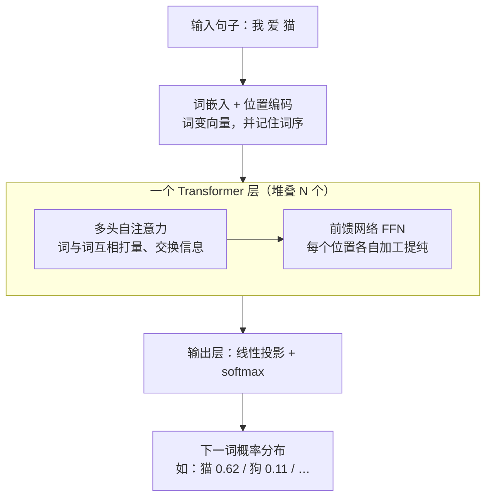

# Transformer 与注意力机制

> **一句话理解**：Transformer 彻底抛弃"逐词递推"，改用注意力机制（Attention）让句子里所有词两两之间直接"对话"，一次性并行处理整个序列——它是今天几乎所有大语言模型的骨架。

[⬆️ 返回总目录](../../../README.md) · [⬆️ 返回本篇](../README.md) · [⬅️ 返回本章目录](./README.md)

| 属性 | 说明 |
|------|------|
| 难度 | ⭐⭐⭐⭐（高阶） |
| 所属分支 | NLP与LLM |
| 前置知识 | [词向量与 embedding](./01-词向量与embedding.md) |

---

## 📌 这一节解决什么问题

在 Transformer 之前，处理文本的主力是 RNN/LSTM（可回顾[第 6 章的 RNN 与 LSTM](../06-时间序列/02-RNN与LSTM.md)）。它像人一行行读文章：看完第 1 个词更新一次记忆，再看第 2 个词再更新……这个设计有三个绕不过去的痛点：

- **串行慢**：第 100 个词必须等前 99 个词处理完，天然无法并行，GPU 再强也白搭；
- **长依赖衰减**：信息要靠"传话游戏"式的一步步传递，隔了 50 个词之后，开头的重点早已被稀释，"她指代谁"这种远距离关系常常接不住；
- **难并行 → 难扩展**：无法并行意味着没法简单堆大堆深，也就喂不进海量数据，模型规模上不去。

2017 年论文《Attention is All You Need》给出釜底抽薪的答案：既然瓶颈在"逐词递推"，那就**不要递推**——让每个词直接看到句子里所有其他词，按"相关性"决定看谁多一点、看谁少一点。这个机制就是注意力，以它为骨架的架构就是 Transformer。

## 🌱 通俗理解

**注意力是你每时每刻都在做的事。** 读这句：

> 小明把苹果给了小红，**她**很开心。

读到"她"的瞬间，你会立刻回看前文，判断"她"指小红而不是小明和小明手里的苹果——你并不是平均地重读整句话，而是把"注意力"集中投给了"小红"。注意力机制把这个过程数学化：**按相关性分配关注度**，相关的词权重大，不相关的权重小。

**Q/K/V 用图书馆类比：**

- 你带着一个**问题 Q（Query，查询）**走进图书馆："我想找指代对象相关的信息"；
- 每个书架贴着**标签 K（Key，键）**："人物-小红""动作-给了""物品-苹果"；
- 你拿问题和每个标签逐一比对（**打分**），越匹配的书架分数越高；
- 最后按分数高低，从各书架**取回内容 V（Value，值）**，分数高的书架贡献多。

一句话：**Q 是你在找什么，K 是每个位置"自我介绍"的内容，V 是每个位置真正交付的信息。** 三者都由同一个词的向量乘三个不同的可学习矩阵投影而来——同一个学生，一份成绩单（Q）、一张名片（K）、一身本领（V）。

**自注意力（Self-Attention）**＝序列内部互相打量：Q、K、V 全部来自同一句话，"她"的 Q 去和句中每个词的 K 比对，包括"她"自己。

**多头注意力（Multi-Head Attention）＝多视角评审团**：一组注意力只能盯一种关系。那就雇一个评审团——语法组盯主谓搭配，语义组盯指代关系，搭配组盯习惯用语……各组独立打分，最后把意见拼起来。实践中没人手工分工，8 个、16 个头自己学出 8 种、16 种视角。

**位置编码（Positional Encoding）＝补课**：注意力只看"内容相关不相关"，天生不知道"我打猫"和"猫打我"的区别——它眼里所有词一视同仁地两两比对，词序信息丢了。解决办法：给每个位置额外发一个位置向量，加到词向量上，等于给每个词挂上门牌号。

## 📋 举个例子

拿 3 个词的句子 **["我", "爱", "猫"]**，看注意力权重到底长什么样（玩具数字，只为示意）。第一步是每个词的 Q 和所有词的 K 做点积、除以 $\sqrt{d_k}$，得到"打分矩阵"；第二步对每一行做 softmax，变成"注意力百分比"：

**打分矩阵（softmax 之前，玩具数字示意）**

| 打分（行 = 查询词 Q，列 = 被看词 K） | 我 | 爱 | 猫 |
|---|---|---|---|
| **我** | 2.0 | 1.0 | 0.5 |
| **爱** | 1.2 | 0.6 | 1.5 |
| **猫** | 0.5 | 2.0 | 0.8 |

**注意力权重矩阵（每行 softmax 之后）**

| 权重 | 我 | 爱 | 猫 | 行和 |
|---|---|---|---|---|
| **我** | 0.63 | 0.23 | 0.14 | 1.00 |
| **爱** | 0.34 | 0.19 | 0.47 | 1.00 |
| **猫** | 0.15 | 0.66 | 0.20 | ≈1.00（四舍五入误差） |

读这张表（每一行回答"这个词在看谁"）：

- **"爱"**把注意力分给"我"（0.34）和"猫"（0.47）——动词天然要同时看住主语和宾语，谁都不能丢；
- **"猫"**最关注"爱"（0.66）——宾语回望动词，"被爱"的语义主要来自这条边；
- **"我"**最关注自己（0.63）——句首主语信息相对自足；
- **每一行加起来恒等于 1**：softmax 保证注意力是一份"蛋糕切分方案"，总和固定，只是分配不同。这就是"按相关性分配关注度"的数学形态。

<details>
<summary>📊 展开完整算例：从打分到权重，手算一遍</summary>

以"爱"这一行为例（$e \approx 2.718$）：

1. 打分：$[1.2,\; 0.6,\; 1.5]$（由 $\mathbf{q}_{\text{爱}}$ 与三个 $\mathbf{k}$ 的点积除以 $\sqrt{d_k}$ 得来；为聚焦 softmax，此处直接给分）；
2. 取指数：$e^{1.2} = 3.320,\; e^{0.6} = 1.822,\; e^{1.5} = 4.482$；
3. 求和：$3.320 + 1.822 + 4.482 = 9.624$；
4. 归一化：$[3.320/9.624,\; 1.822/9.624,\; 4.482/9.624] = [0.34,\; 0.19,\; 0.47]$，和恰为 1。

再验证"猫"行：$e^{0.5}=1.649,\; e^{2.0}=7.389,\; e^{0.8}=2.226$，和为 11.263，归一化得 $[0.15,\; 0.66,\; 0.20]$。

最关键的一步还没做：把权重乘到 V 上。设 $\mathbf{v}_{\text{我}}=[1,0],\; \mathbf{v}_{\text{爱}}=[0,1],\; \mathbf{v}_{\text{猫}}=[1,1]$，则"爱"的新表示 = $0.34[1,0] + 0.19[0,1] + 0.47[1,1] = [0.81,\; 0.66]$——一个掺进了主语和宾语信息的混合向量。**注意力的输出不是"看谁"，而是把看到的东西按比例兑成一杯新表示。**

</details>

## 🧠 核心原理

### 整体流程



### 逐步拆解

**第 1 步：打分。** 把所有词的 Query 摞成矩阵 $Q$、Key 摞成 $K$，一次性算完所有"问题 × 标签"的比对：

$$
S = \frac{QK^{\top}}{\sqrt{d_k}}
$$

> 👉 **人话**：$QK^{\top}$ 就是"每个问题和每个标签两两点积"的完整打分表；除以 $\sqrt{d_k}$ 是给分数降温，防止维度一大分数爆炸（细节见下方折叠）。

**第 2 步：softmax 归一。** 把打分表的每一行变成和为 1 的权重：

$$
\text{softmax}(z_i) = \frac{e^{z_i}}{\sum_{j} e^{z_j}}
$$

> 👉 **人话**：指数放大差距、再归一成百分比——任何一串数字都能变成一份"蛋糕切分方案"，分数高的多分，分数低的少分，但蛋糕总量不变（恒为 1）。

**第 3 步：加权取内容。** 合起来就是著名的**缩放点积注意力（Scaled Dot-Product Attention）**：

$$
\text{Attention}(Q, K, V) = \text{softmax}\!\left(\frac{QK^{\top}}{\sqrt{d_k}}\right)V
$$

> 👉 **人话**：拿问题 Q 和所有钥匙 K 逐个点积打分，除以 $\sqrt{d_k}$ 防爆，softmax 把分数变百分比，最后按百分比把内容 V 加权混合——每个词得到一份"按需调配"的新表示。

**第 4 步：多头并行。** 把向量切成 $h$ 份，每份独立做一遍注意力再拼接：

$$
\text{head}_h = \text{Attention}(QW_h^{Q},\; KW_h^{K},\; VW_h^{V}), \qquad \text{MultiHead} = \text{Concat}(\text{head}_1, \dots, \text{head}_h)\,W^{O}
$$

> 👉 **人话**：评审团的每个组拿各自的"问题清单"和"关注清单"独立打分，最后把所有组的意见拼在一起——一组盯语法、一组盯指代、一组盯搭配，互不干扰。

**第 5 步：位置编码。** 用固定公式给每个位置生成"波形指纹"并加到词向量上：

$$
PE_{(pos,\,2i)} = \sin\!\left(\frac{pos}{10000^{2i/d}}\right), \qquad PE_{(pos,\,2i+1)} = \cos\!\left(\frac{pos}{10000^{2i/d}}\right)
$$

> 👉 **人话**：给每个位置发一个独一无二的正弦/余弦"波形指纹"，加在词向量上，模型就能从指纹差异推断出谁在前谁在后——注意力本身不带词序，必须靠这一步补课。

<details>
<summary>🧮 展开看：为什么点积要除以 √d（选讲）</summary>

设 $\mathbf{q}$、$\mathbf{k}$ 的每个分量都是零均值、方差 1 的独立随机变量，则点积 $\mathbf{q} \cdot \mathbf{k}$ 的方差是 $d_k$（每乘一项贡献方差 1）。维度从 64 涨到 4096，打分的波动范围就放大 64 倍。

后果：分数一大，softmax 就会"一家独大"——最大值拿走几乎 100% 的权重，其余全被压成 0。此时 softmax 输出接近 one-hot，梯度几乎为 0，训练停滞（进入饱和区）。

除以 $\sqrt{d_k}$ 恰好把方差拉回 1 量级，让 softmax 工作在"梯度健康"的区间。这是全文里最不起眼却最体现工程功力的一个 $\sqrt{\;}$。

</details>

<details>
<summary>🧮 展开看：自注意力的计算量——长短版的代价（选讲）</summary>

自注意力要算所有词两两的分数，序列长 $n$、维度 $d$ 时约需 $O(n^2 d)$ 计算和 $O(n^2)$ 存储——序列翻倍，注意力矩阵面积翻四倍。这就是为什么：

- 短句上 Transformer 又快又好（还能并行，GPU 吃满）；
- 长文档（几万词）上 $n^2$ 爆炸，催生了稀疏注意力、长上下文外推等技术（下一页与 [03 架构细节](./03-Transformer架构细节与变体.md)会讲）。

RNN 是 $O(n)$ 串行、无法并行；自注意力是 $O(n^2)$ 但完全并行——Transformer 用"计算量换并行度"，在 GPU 时代这笔交易大赚。

</details>

## 💻 动手试试

```python
# 依赖：pip install torch（纯本地运行，无需联网）
import torch
import torch.nn.functional as F

torch.manual_seed(0)                 # 固定随机种子，结果可复现

words = ["我", "爱", "猫"]
d = 8                                 # 玩具维度；真实模型是 4096 这个量级

# 每个词一个词向量（真实模型来自词表 embedding 查表）
E = torch.randn(len(words), d)
# 三个可学习投影矩阵（真实模型由训练学出，这里随机初始化只看机制）
Wq, Wk, Wv = torch.randn(d, d), torch.randn(d, d), torch.randn(d, d)

Q, K, V = E @ Wq, E @ Wk, E @ Wv      # 同一批词的"三份投影"

scores = Q @ K.T / d ** 0.5           # 第 1 步：打分（含 √d 缩放）
W = F.softmax(scores, dim=-1)         # 第 2 步：每行 softmax → 注意力权重
out = W @ V                           # 第 3 步：加权混合 V

print("注意力权重矩阵（行=查询词，列=被看词）：")
print(W.round(decimals=2))
print("每行的和：", W.sum(dim=-1).round(decimals=4))
# 预期输出：W 是 3×3 矩阵，每个元素在 0~1 之间；
# W.sum(dim=-1) = tensor([1.0000, 1.0000, 1.0000])——softmax 保证行和恒为 1。
# 某一行哪列数值大，就说明那个词在"重点看谁"（随机矩阵看不出语义，
# 想看有语义的权重，请玩下方实验场）。
```

## 🔥 炼丹小灶

> 🔥 **炼丹小灶**：自己从头训一个小 Transformer 的起点配方——
> - 配方：AdamW + 学习率 warmup（前几千步从 0 升到峰值，再余弦衰减），峰值 lr 约 1e-4~3e-4（小模型量级），梯度裁剪 1.0；
> - 玄学：loss 一开始就不动，先查是不是忘了位置编码或忘了缩放；训崩多半是 lr 太大，先砍半再说；
> - ⚠️ 以上是经验参考值，不是圣旨；换规模请重新炼。

## 🖱️ 动手玩

> 🎮 **本库实验场**：[注意力热力图](../../../playground/attention.html)——自己换句子、拖参数，亲眼看权重矩阵怎么变：改一个词，整行整列的颜色都会跟着动。
> 🕹️ **延伸玩一玩**：[Transformer Explainer](https://poloclub.github.io/transformer-explainer/)——输入任意句子，逐层逐头查看真实模型（GPT-2 级）内部的注意力热力图，还能看到下一词预测的实时分布。

## 🔗 在知识树中的位置

- **上游**：[词向量与 embedding](./01-词向量与embedding.md)——Transformer 的输入就是词向量 + 位置编码。
- **下游**：[Transformer 架构细节与变体](./03-Transformer架构细节与变体.md)（三家族、掩码、KV Cache）；[大语言模型 LLM 全景](./04-大语言模型LLM全景.md)（把"下一词概率"做到极致）。
- **横向对比**：与 RNN/LSTM（[第 6 章](../06-时间序列/02-RNN与LSTM.md)）相比——RNN 串行、长依赖靠传递；Transformer 并行、任意两词一步直达。注意力思想也搬进了视觉（[ViT 视觉 Transformer](../05-计算机视觉/03-ViT视觉Transformer.md)）：图像切块当"词"处理。

## ⚠️ 常见误区

- **误区一**："注意力权重高 = 模型给出因果解释。" → 权重只说明"计算时这里用了多少信息"，不等于"因为这个词才有这个输出"；它常与模型真实归因不一致，当分析线索可以，当呈堂证供不行。
- **误区二**："注意力是 NLP 专用。" → 只要有"元素集合 + 两两相关性"，就能用注意力：图像块（ViT）、图节点（[GAT，第 9 章](../09-图神经网络/02-GNN核心模型.md)）、甚至蛋白质序列。
- **误区三**："多头越多越好。" → 头数只是把向量切更多份，维度不变时切太细每份信息量不足；常见配置 8~96 头，是"够用就好"而非越多越好。

## 📝 小结与自测

**要点回顾**

- RNN 三痛点：串行慢、长依赖衰减、难并行难扩展；Transformer 用"所有词两两直接对话"一次解决；
- Q/K/V 图书馆类比：Q 是你在找什么，K 是每个位置的标签，V 是每个位置交付的内容；打分→softmax→加权混合；
- softmax 保证每行权重和为 1——注意力是"蛋糕切分"，不是"打分悬赏"；
- 多头 = 多视角评审团；位置编码给无序的注意力补上词序这一课。

**自测一下**（点击展开答案）

<details>
<summary>问题 1：为什么打分要除以 √d_k？</summary>

维度越大点积方差越大（约 $d_k$），大分数会让 softmax 饱和成"一家独大"，梯度趋近 0，训不动。除以 $\sqrt{d_k}$ 把方差拉回 1 量级，让 softmax 保持在梯度健康的区间。

</details>

<details>
<summary>问题 2："我打猫"和"猫打我"，注意力算出来会一样吗？</summary>

不会。两者词的内容向量相同，但位置编码不同，导致 Q/K/V 全部不同，打分和权重都会变。如果没有位置编码，这两句（以及任何同词不同序的句子）在自注意力眼里将不可区分——这正是位置编码必须存在的原因。

</details>

## 📚 延伸阅读

- 论文：Attention is All You Need（2017，https://arxiv.org/abs/1706.03762）——本页主角的出生证明，短小精悍
- 博客：The Illustrated Transformer（Jay Alammar，https://jalammar.github.io/illustrated-transformer/）——图解经典，本页思想的可视化版
- 交互：[Transformer Explainer](https://poloclub.github.io/transformer-explainer/)（同"动手玩"）

---

[⬅️ 上一页：词向量与 embedding](./01-词向量与embedding.md) · [返回本章目录](./README.md) · [下一页：Transformer 架构细节与变体 ➡️](./03-Transformer架构细节与变体.md)
