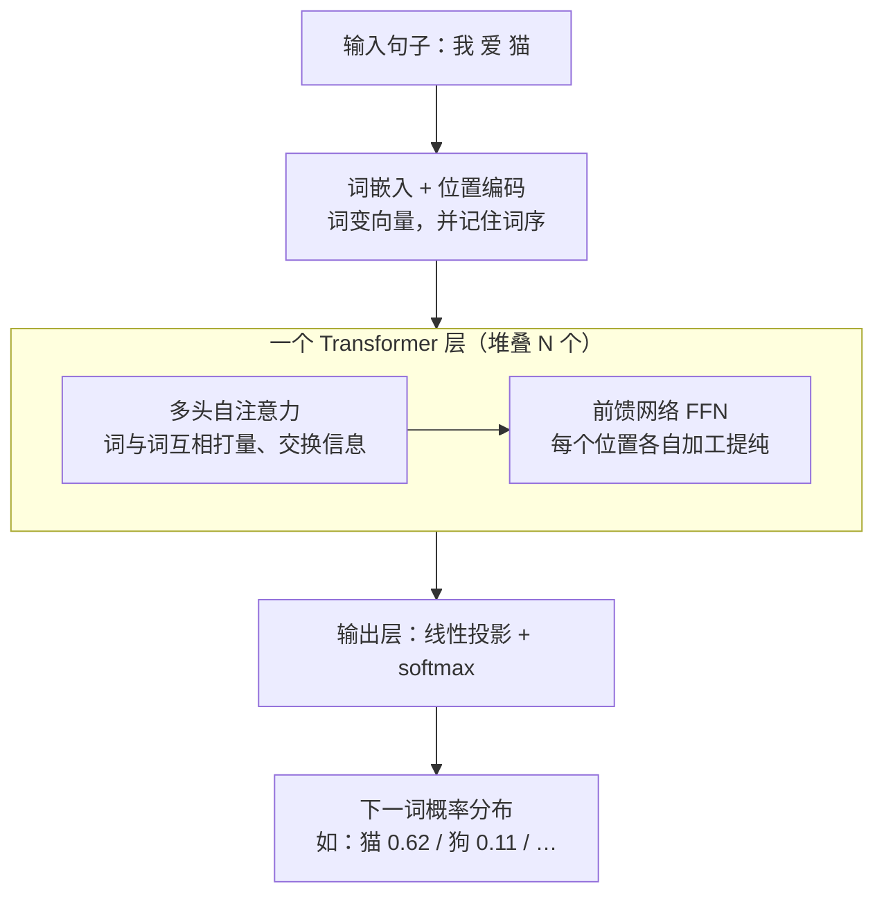
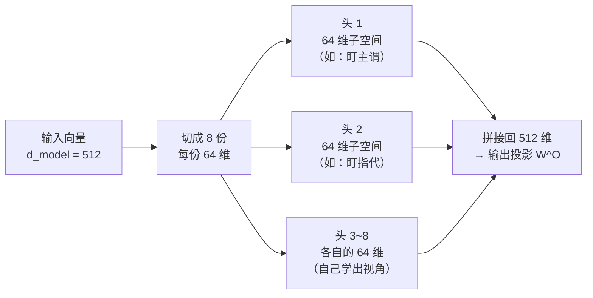

# Transformer 与注意力机制

> **一句话理解**：Transformer 彻底抛弃"逐词递推"，改用注意力机制（Attention）让句子里所有词两两之间直接"对话"，一次性并行处理整个序列——它是今天几乎所有大语言模型的骨架。

[⬆️ 返回总目录](../../../README.md) · [⬆️ 返回本篇](../README.md) · [⬅️ 返回本章目录](./README.md)

| 属性 | 说明 |
|------|------|
| 难度 | ⭐⭐⭐⭐（高阶） |
| 所属分支 | NLP与LLM |
| 前置知识 | [词向量与 embedding](./01-词向量与embedding.md) |

---

## 📌 这一节解决什么问题

在 Transformer 之前，处理文本的主力是 RNN/LSTM（可回顾[第 6 章的 RNN 与 LSTM](../06-时间序列/02-RNN与LSTM.md)）。它像人一行行读文章：看完第 1 个词更新一次记忆，再看第 2 个词再更新……这个设计有三个绕不过去的痛点：

- **串行慢**：第 100 个词必须等前 99 个词处理完，天然无法并行，GPU 再强也白搭；
- **长依赖衰减**：信息要靠"传话游戏"式的一步步传递，隔了 50 个词之后，开头的重点早已被稀释，"她指代谁"这种远距离关系常常接不住；
- **难并行 → 难扩展**：无法并行意味着没法简单堆大堆深，也就喂不进海量数据，模型规模上不去。

2017 年论文《Attention is All You Need》给出釜底抽薪的答案：既然瓶颈在"逐词递推"，那就**不要递推**——让每个词直接看到句子里所有其他词，按"相关性"决定看谁多一点、看谁少一点。这个机制就是注意力，以它为骨架的架构就是 Transformer。

本页是全书最重要的一页，值得慢读。我们将分四层递进：**直觉**（Q/K/V 到底在干嘛）→ **数学结构**（完整的矩阵推导，每一步标注形状）→ **成立条件**（√d 缩放、位置编码为什么必不可少）→ **失效边界**（注意力稀释、训练不稳的信号）。读完这一页，后面 LLM、微调、RAG 的所有机制都只是它的变奏。

## 🌱 通俗理解

**注意力是你每时每刻都在做的事。** 读这句：

> 小明把苹果给了小红，**她**很开心。

读到"她"的瞬间，你会立刻回看前文，判断"她"指小红而不是小明和小明手里的苹果——你并不是平均地重读整句话，而是把"注意力"集中投给了"小红"。注意力机制把这个过程数学化：**按相关性分配关注度**，相关的词权重大，不相关的权重小。

**Q/K/V 用图书馆类比：**

- 你带着一个**问题 Q（Query，查询）**走进图书馆："我想找指代对象相关的信息"；
- 每个书架贴着**标签 K（Key，键）**："人物-小红""动作-给了""物品-苹果"；
- 你拿问题和每个标签逐一比对（**打分**），越匹配的书架分数越高；
- 最后按分数高低，从各书架**取回内容 V（Value，值）**，分数高的书架贡献多。

一句话：**Q 是你在找什么，K 是每个位置"自我介绍"的内容，V 是每个位置真正交付的信息。** 三者都由同一个词的向量乘三个不同的可学习矩阵投影而来——同一个学生，一份成绩单（Q）、一张名片（K）、一身本领（V）。

**自注意力（Self-Attention）**＝序列内部互相打量：Q、K、V 全部来自同一句话，"她"的 Q 去和句中每个词的 K 比对，包括"她"自己。

**多头注意力（Multi-Head Attention）＝多视角评审团**：一组注意力只能盯一种关系。那就雇一个评审团——语法组盯主谓搭配，语义组盯指代关系，搭配组盯习惯用语……各组独立打分，最后把意见拼起来。实践中没人手工分工，8 个、16 个头自己学出 8 种、16 种视角。

**位置编码（Positional Encoding）＝补课**：注意力只看"内容相关不相关"，天生不知道"我打猫"和"猫打我"的区别——它眼里所有词一视同仁地两两比对，词序信息丢了。解决办法：给每个位置额外发一个位置向量，加到词向量上，等于给每个词挂上门牌号。

**残差连接（Residual Connection）＝原稿加批注**：每层不重写句子，只在上一层的表示上"打补丁"。信息像在高速公路上直通顶层，每一层只是并上去的一条修订意见——这是 Transformer 能堆一百层的命门（[03 页](./03-Transformer架构细节与变体.md)细讲）。

## 📋 举个例子

拿 3 个词的句子 **["我", "爱", "猫"]**，看注意力权重到底长什么样（玩具数字，只为示意）。第一步是每个词的 Q 和所有词的 K 做点积、除以 $\sqrt{d_k}$，得到"打分矩阵"；第二步对每一行做 softmax，变成"注意力百分比"：

**打分矩阵（softmax 之前，玩具数字示意）**

| 打分（行 = 查询词 Q，列 = 被看词 K） | 我 | 爱 | 猫 |
|---|---|---|---|
| **我** | 2.0 | 1.0 | 0.5 |
| **爱** | 1.2 | 0.6 | 1.5 |
| **猫** | 0.5 | 2.0 | 0.8 |

**注意力权重矩阵（每行 softmax 之后）**

| 权重 | 我 | 爱 | 猫 | 行和 |
|---|---|---|---|---|
| **我** | 0.63 | 0.23 | 0.14 | 1.00 |
| **爱** | 0.34 | 0.19 | 0.47 | 1.00 |
| **猫** | 0.15 | 0.66 | 0.20 | ≈1.00（四舍五入误差） |

读这张表（每一行回答"这个词在看谁"）：

- **"爱"**把注意力分给"我"（0.34）和"猫"（0.47）——动词天然要同时看住主语和宾语，谁都不能丢；
- **"猫"**最关注"爱"（0.66）——宾语回望动词，"被爱"的语义主要来自这条边；
- **"我"**最关注自己（0.63）——句首主语信息相对自足；
- **每一行加起来恒等于 1**：softmax 保证注意力是一份"蛋糕切分方案"，总和固定，只是分配不同。这就是"按相关性分配关注度"的数学形态。

三种序列长度下的注意力分布（正常 / 极端 / 失败，直觉预热，机理见"失效边界"）：

| 情况 | 序列 | softmax 后的典型形态 | 后果 |
|------|------|---------------------|------|
| ✅ 正常 | 3~几十词 | 每行集中在 1~5 个关键位置 | 该看的看得清 |
| ⚠️ 极端 | 数千词、且无明显关键词 | 每行几百个 0.00x，最大权重也 <5% | 重点被摊薄，远距离信号弱 |
| ❌ 失败 | 数万词 | 权重近乎均匀 + 中段信息利用率低 | "lost in the middle"：开头结尾还记得，中段全糊 |

<details>
<summary>📊 展开完整算例：从打分到权重，手算一遍</summary>

以"爱"这一行为例（$e \approx 2.718$）：

1. 打分：$[1.2,\; 0.6,\; 1.5]$（由 $\mathbf{q}_{\text{爱}}$ 与三个 $\mathbf{k}$ 的点积除以 $\sqrt{d_k}$ 得来；为聚焦 softmax，此处直接给分）；
2. 取指数：$e^{1.2} = 3.320,\; e^{0.6} = 1.822,\; e^{1.5} = 4.482$；
3. 求和：$3.320 + 1.822 + 4.482 = 9.624$；
4. 归一化：$[3.320/9.624,\; 1.822/9.624,\; 4.482/9.624] = [0.34,\; 0.19,\; 0.47]$，和恰为 1。

再验证"猫"行：$e^{0.5}=1.649,\; e^{2.0}=7.389,\; e^{0.8}=2.226$，和为 11.263，归一化得 $[0.15,\; 0.66,\; 0.20]$。

最关键的一步还没做：把权重乘到 V 上。设 $\mathbf{v}_{\text{我}}=[1,0],\; \mathbf{v}_{\text{爱}}=[0,1],\; \mathbf{v}_{\text{猫}}=[1,1]$，则"爱"的新表示 = $0.34[1,0] + 0.19[0,1] + 0.47[1,1] = [0.81,\; 0.66]$——一个掺进了主语和宾语信息的混合向量。**注意力的输出不是"看谁"，而是把看到的东西按比例兑成一杯新表示。**

对照"极端"一行做个速算：若序列长 1000、每行 softmax 后最大权重仅 0.05，那么最重要的那个词也只贡献 5% 的信息，其余 95% 是"陪审团噪音"——蛋糕切得越平，谁都吃不上。

</details>

## 🧠 核心原理

### 整体流程



每层的两条通道用"编辑部"理解：**注意力是"跨位置的信息汇聚"**（把别的词的信息搬过来），**FFN 是"单位置的深加工"**（对每个位置独立做一次非线性变换），两条通道外面都套着残差连接——上一层的输出是原稿，这层的计算结果只是批注。

### 逐步拆解：缩放点积注意力的完整矩阵推导

**第 1 步：从词向量到 Q/K/V。** 设序列长 $n$、词向量维度 $d$（下文用 $d_k$ 表示 Q/K 的投影维度），输入矩阵 $X \in \mathbb{R}^{n \times d}$（一行一个词）。三个可学习投影矩阵 $W^Q, W^K, W^V \in \mathbb{R}^{d \times d_k}$ 把它投影成三份"视角"：

$$
Q = XW^Q, \qquad K = XW^K, \qquad V = XW^V
$$

> 👉 **人话**：同一个句子（$X$）被乘三个不同矩阵，得到三份档案——"我要找什么"（Q）、"我是什么标签"（K）、"我能提供什么"（V）。每份档案仍然是 $n$ 行，一行一个词，只是每行从 $d$ 维换成了 $d_k$ 维。

**第 2 步：打分。** 把所有词的 Query 摞成矩阵 $Q$、Key 摞成 $K$，一次性算完所有"问题 × 标签"的比对：

$$
S = \frac{QK^{\top}}{\sqrt{d_k}}
$$

> 👉 **人话**：$QK^{\top}$ 就是"每个问题和每个标签两两点积"的完整打分表；除以 $\sqrt{d_k}$ 是给分数降温，防止维度一大分数爆炸（推导见下方折叠）。

**第 3 步：softmax 归一。** 把打分表的每一行变成和为 1 的权重：

$$
\text{softmax}(z_i) = \frac{e^{z_i}}{\sum_{j} e^{z_j}}
$$

> 👉 **人话**：指数放大差距、再归一成百分比——任何一串数字都能变成一份"蛋糕切分方案"，分数高的多分，分数低的少分，但蛋糕总量不变（恒为 1）。

**第 4 步：加权取内容。** 合起来就是著名的**缩放点积注意力（Scaled Dot-Product Attention）**：

$$
\text{Attention}(Q, K, V) = \text{softmax}\!\left(\frac{QK^{\top}}{\sqrt{d_k}}\right)V
$$

> 👉 **人话**：拿问题 Q 和所有钥匙 K 逐个点积打分，除以 $\sqrt{d_k}$ 防爆，softmax 把分数变百分比，最后按百分比把内容 V 加权混合——每个词得到一份"按需调配"的新表示。

<details>
<summary>🧮 展开看：全矩阵版逐步算例（含每步形状标注，手算可验）</summary>

取 3 个词、$d = d_k = 2$，让每一步都能手算。设：

$$
X = \begin{bmatrix} 1 & 0 \\ 0 & 1 \\ 1 & 1 \end{bmatrix} \;(n{=}3,\; d{=}2,\;\text{行}=\text{我/爱/猫}),
\quad
W^Q = \begin{bmatrix} 1 & 0 \\ 0 & 1 \end{bmatrix},\;
W^K = \begin{bmatrix} 0 & 1 \\ 1 & 0 \end{bmatrix},\;
W^V = \begin{bmatrix} 1 & 1 \\ 1 & 0 \end{bmatrix}
$$

**① 投影（形状 $X[3,2] \times W[2,2] \to [3,2]$）**：

- $Q = XW^Q = \begin{bmatrix} 1 & 0 \\ 0 & 1 \\ 1 & 1 \end{bmatrix}$（单位阵，Q = X）
- $K = XW^K = \begin{bmatrix} 0 & 1 \\ 1 & 0 \\ 1 & 1 \end{bmatrix}$（两列交换）
- $V = XW^V = \begin{bmatrix} 1 & 1 \\ 1 & 0 \\ 2 & 1 \end{bmatrix}$

**② 打分（$QK^\top$ 形状 $[3,2]\times[2,3] \to [3,3]$，除以 $\sqrt{d_k}=\sqrt2 \approx 1.41$）**：

- $QK^\top = \begin{bmatrix} 0 & 1 & 1 \\ 1 & 0 & 1 \\ 1 & 1 & 2 \end{bmatrix}$（第 $i$ 行第 $j$ 列 = 第 $i$ 个词的 Q 点第 $j$ 个词的 K）
- $S = QK^\top/\sqrt{2} \approx \begin{bmatrix} 0 & 0.71 & 0.71 \\ 0.71 & 0 & 0.71 \\ 0.71 & 0.71 & 1.41 \end{bmatrix}$

**③ softmax（逐行，形状不变 $[3,3]$）**：以第 3 行（"猫"）为例：$e^{0.71}=2.03,\; e^{0.71}=2.03,\; e^{1.41}=4.10$，和 8.16，归一化得 $[0.25,\; 0.25,\; 0.50]$——"猫"一半注意力看自己，一半平分给"我"和"爱"。

$$
A = \text{softmax}(S) \approx \begin{bmatrix} 0.31 & 0.31 & 0.38 \\ 0.31 & 0.31 & 0.38 \\ 0.25 & 0.25 & 0.50 \end{bmatrix}
$$

**④ 加权混合（$A[3,3] \times V[3,2] \to [3,2]$）**：以"猫"行为例：$0.25[1,1] + 0.25[1,0] + 0.50[2,1] = [1.50,\; 0.75]$。每个输出行都是三个 V 向量的加权平均，权重正是该行注意力。

**全程形状小结（背下来，读任何 Transformer 代码都对得上）**：

| 步骤 | 运算 | 形状变化 |
|------|------|---------|
| 输入 | — | $X:\ [n, d]$ |
| 投影 | $XW^Q$ 等 | $[n,d]\times[d,d_k] \to Q,K,V:\ [n, d_k]$ |
| 打分 | $QK^\top/\sqrt{d_k}$ | $[n,d_k]\times[d_k,n] \to S:\ [n, n]$ |
| 归一 | softmax 逐行 | $[n,n] \to A:\ [n,n]$ |
| 输出 | $AV$ | $[n,n]\times[n,d_k] \to O:\ [n, d_k]$ |

三个观察：① $S$ 是 $n \times n$——**序列长度在打分这一步进入平方**；② 输出 $O$ 与输入 $X$ 形状同构（$d_k = d$ 时完全相同），所以可以一层层套娃堆叠；③ 整个过程没有一个 for 循环依赖上一步的输出——**全部是矩阵乘法，GPU 天堂**。

</details>

<details>
<summary>🧮 展开看推导：为什么点积要除以 √d（完整版）</summary>

**命题**：设 $\mathbf{q}, \mathbf{k} \in \mathbb{R}^{d_k}$，各分量独立、零均值、方差 1，则点积 $s = \mathbf{q} \cdot \mathbf{k}$ 的均值为 0、**方差为 $d_k$**。

**推导**：$s = \sum_{i=1}^{d_k} q_i k_i$。由独立性，$q_i, k_i$ 不相关（协方差 0），所以每项的方差为：

$$
\mathrm{Var}(q_i k_i) = \mathbb{E}[q_i^2]\mathbb{E}[k_i^2] - \big(\mathbb{E}[q_i]\big)^2\big(\mathbb{E}[k_i]\big)^2 = 1 \times 1 - 0 = 1
$$

各项之间也独立，方差相加：$\mathrm{Var}(s) = \sum_{i=1}^{d_k} 1 = d_k$。因此标准差为 $\sqrt{d_k}$——**除以 $\sqrt{d_k}$ 恰好把标准差归一回 1**（这是比"方差回 1"更精确的说法：严格做方差归一应除 $d_k$，论文选择了更温和的 $\sqrt{d_k}$，经验上工作得很好）。

**数值感受**：$d_k = 64$ 时 $\sqrt{d_k}=8$，不缩放的话打分标准差 8，softmax 输入差 8 个单位意味着指数比 $e^8 \approx 3000$ 倍——基本就是"一家独大"；$d_k = 4096$ 时不缩放的标准差 64，指数比天文数字，softmax 输出无限接近 one-hot。

**为什么 one-hot 的 softmax 会训不动**：设 softmax 输出几乎全在最大位（概率 $\approx 1$）。对输入 $z_i$ 的梯度是 $\partial \text{softmax}_i / \partial z_j = a_i(\delta_{ij} - a_j)$；当 $a_{\max} \to 1$、其余 $\to 0$ 时，所有梯度项都趋近 0——**梯度饱和**，这一层的参数几乎收不到学习信号，训练停滞。除以 $\sqrt{d_k}$ 让 softmax 工作在输入标准差约 1 的区间，输出既不"一刀切"也不"大锅饭"，梯度健康。

一句话：这是全文里最不起眼却最体现工程功力的一个 $\sqrt{\;}$——**它把"数学上成立的注意力"变成"数值上可训练的注意力"**。

</details>

**第 5 步：多头并行——切分，不是复制。** 把向量切成 $h$ 份，每份独立做一遍注意力再拼接：

$$
\text{head}_h = \text{Attention}(QW_h^{Q},\; KW_h^{K},\; VW_h^{V}), \qquad \text{MultiHead} = \text{Concat}(\text{head}_1, \dots, \text{head}_h)\,W^{O}
$$

> 👉 **人话**：评审团的每个组拿各自的"问题清单"和"关注清单"独立打分，最后把所有组的意见拼在一起——一组盯语法、一组盯指代、一组盯搭配，互不干扰。

这里有个高频误解必须掰开：**多头不是把 $d$ 维向量复制 $h$ 份再做 $h$ 次完整注意力，而是把 $d_{\text{model}}$ 维切成 $h$ 份、每份 $d_k = d_{\text{model}}/h$ 维，各做一次"小维度"注意力**。以原始论文配置为例：$d_{\text{model}} = 512$、$h = 8$，每个头只在 64 维子空间里做注意力，8 个头的输出拼回 512 维。三个实质后果：

- **参数没变多**：8 个头的小投影矩阵（$512 \times 64$ × 每个）拼起来正好等于一个大矩阵的参数量——多头是"免费"的视角拆分；
- **每个头是不同的子空间投影**：切分 + 各自的 $W_h$ 投影，意味着每个头在 512 维语义空间的不同子空间里度量相关性——一个头里的"近"可能是语法相近，另一个头里可能是话题相近；
- **总计算量几乎不变**：8 个 64 维注意力 ≈ 1 个 512 维注意力的算力（$n^2 d$ 里的 $d$ 缩小到 $d/h$，但要做 $h$ 次）。

代价也要知道：单头 $d_k$ 太小（比如 $h$ 切到 64，每头只剩 8 维）时，点积在这么低维的子空间里打分噪音太大、区分度下降——所以"头数越多越好"不成立（见误区三）。



**第 6 步：位置编码——多分辨率的时钟。** 用固定公式给每个位置生成"波形指纹"并加到词向量上：

$$
PE_{(pos,\,2i)} = \sin\!\left(\frac{pos}{10000^{2i/d}}\right), \qquad PE_{(pos,\,2i+1)} = \cos\!\left(\frac{pos}{10000^{2i/d}}\right)
$$

> 👉 **人话**：给每个位置发一个独一无二的正弦/余弦"波形指纹"，加在词向量上，模型就能从指纹差异推断出谁在前谁在后——注意力本身不带词序，必须靠这一步补课。

频率结构的直觉：把每个维度对 $(2i, 2i{+}1)$ 看成一根**指针**，第 $i$ 根指针的波长是 $\lambda_i = 2\pi \cdot 10000^{2i/d}$。低维度（$i$ 小）波长短，指针转得飞快——相邻位置的指纹差异巨大，负责"细粒度定位"（隔一个词都不同）；高维度波长长，指针慢得几乎不动——负责"粗粒度定位"（隔一千个词才有区别）。整套位置编码就是**一排转速从秒针到千年历的时钟**：任何两个位置，无论隔多远，总有一些"时钟"能读出它们的差异。这回答了一个隐藏问题：为什么一套固定公式能同时编码"隔壁"和"隔了 5000 词"的相对关系——单靠一种波长做不到，多分辨率叠加才做到。

正弦 vs 可学习位置的取舍：

| 方案 | 优点 | 缺点 | 谁在用 |
|------|------|------|--------|
| 正弦（固定） | 无参数；理论上可外推到训练没见过的长度；任意相对偏移可用"旋转"表达 | 形状硬编码，表达力有限 | 原始 Transformer |
| 可学习（nn.Embedding 一张位置表） | 灵活，位置表示完全由数据决定 | 最大长度焊死（超表长就得外推/微调）；小数据下易欠拟合 | GPT-2 级、BERT 级模型 |
| RoPE（旋转位置编码） | 把位置揉进 Q/K 的旋转里，天然只依赖相对位置，长文本外推友好 | 实现稍绕；外推仍常需插值微调 | 现代 LLM 主流（[03 页](./03-Transformer架构细节与变体.md)） |

<details>
<summary>🧮 展开看：正弦位置编码的一个漂亮性质——相对偏移是线性变换（选讲）</summary>

利用 $\sin(a+b) = \sin a \cos b + \cos a \sin b$（cos 同理），对任意固定偏移 $k$：

$$
\begin{bmatrix} PE_{pos+k,\,2i} \\ PE_{pos+k,\,2i+1} \end{bmatrix}
=
\begin{bmatrix} \cos(k/\lambda_i) & \sin(k/\lambda_i) \\ -\sin(k/\lambda_i) & \cos(k/\lambda_i) \end{bmatrix}
\begin{bmatrix} PE_{pos,\,2i} \\ PE_{pos,\,2i+1} \end{bmatrix}
$$

即：**位置 $pos+k$ 的编码 = 位置 $pos$ 的编码乘一个只依赖 $k$ 的旋转矩阵**。模型若想学"往下看 3 个词"的注意力模式，学一个固定旋转变换即可——这为相对位置感知提供了数学便利，也正是 RoPE 的思想源头（把"旋转"从编码层搬进 Q/K 内积里，见 [03 页](./03-Transformer架构细节与变体.md)）。

</details>

### FFN：逐位置的非线性车间

注意力层之后，每个位置独立经过一个两层全连接网络（FFN, Feed-Forward Network）：

$$
\text{FFN}(x) = \text{GELU}(xW_1 + b_1)\,W_2 + b_2, \qquad W_1 \in \mathbb{R}^{d \times 4d}
$$

> 👉 **人话**：先把向量升维 4 倍"摊开来加工"，过一个非线性激活，再压回原维度——这一步**不看别的词**，只对注意力收集来的情报就地深加工。

两个层次的理解：初级版——注意力是"搬家"（把别的位置的信息搬过来），FFN 是"加工"（对搬来的货做非线性变换提纯）；进阶版一句话——**FFN 可以看作一个 key-value 记忆库**：$W_1$ 的每一列像一把"钥匙"（识别输入里是否存在某种模式），$W_2$ 的对应行像存放的"内容"（该模式触发了就在输出里叠加什么）。大量事实性知识（"巴黎是法国首都"这类关联）被认为主要以这种键值形式存在 FFN 权重里，这也是"模型知识存在 FFN、注意力负责路由"这种说法的来源。

### 残差流视角：信息高速公路 + 每层增量修订

每层（含其后的归一化）不是替换上一层的表示，而是加一笔修订：

$$
\mathbf{x}^{(l+1)} = \mathbf{x}^{(l)} + F\big(\mathbf{x}^{(l)}\big)
$$

> 👉 **人话**：第 $l+1$ 层的输出 = 原稿 + 这层的批注。原稿永远在场，批注只做增量。

这个视角（有人称"残差流，Residual Stream"）有三个推论：① **信息直通**：嵌入层的原始信号（词身份、位置）可以原样流到最后一层，任何层想要都能读到；② **梯度高速**：反向传播时梯度沿加法支路直通底层，深达百层不消失（[03 页](./03-Transformer架构细节与变体.md)细讲）；③ **层的角色 = 读-改-写**：每层从残差流里"读"信息、做一点计算、把修订"写"回去——理解 Transformer 内部行为的现代框架（如"每层向残差流里写入特定信息"的机械可解释性研究）都建立在这个图景上。

### 复杂度与显存：为什么长上下文贵

自注意力要算所有词两两的分数，序列长 $n$、维度 $d$ 时约需 $O(n^2 d)$ 计算和 $O(n^2)$ 存储。三个数字感受一下"平方"的威力：

| 序列长度 | 注意力矩阵大小（每层每头合计） | 相对短句成本 |
|---------|------------------------------|-------------|
| 128（一段话） | $128^2 = 1.6$ 万分数 | 1× |
| 8K（一篇长文） | $8192^2 \approx 6700$ 万 | 4096× |
| 128K（一本书） | $131072^2 \approx 172$ 亿 | 100 万× |

> 👉 **人话**：序列翻倍，注意力矩阵面积翻四倍。长上下文贵在两处：**算力**（$n^2$ 次打分）和**显存**（推理时每层的 K/V 缓存随长度线性膨胀，公式与实算见 [03 页 KV Cache](./03-Transformer架构细节与变体.md)）。

RNN 是 $O(n)$ 串行、无法并行；自注意力是 $O(n^2)$ 但完全并行——Transformer 用"计算量换并行度"，在 GPU 时代这笔交易大赚；但序列长到一定规模，$n^2$ 反噬，催生了稀疏/滑窗/线性注意力等变体（[03 页](./03-Transformer架构细节与变体.md)一览）。

### 失效边界：注意力什么时候不 work

**失效一：注意力稀释（长序列 softmax 变平）。** softmax 是"相对竞争"：一行里如果没有任何一个分数显著领先（长句、关键词不突出时常见），权重就摊平成一堆 0.00x。后果：真正的信息源只分到极小权重，输出近似平均池化，模型表现"看了很多、什么都没看进去"。诊断信号：注意力矩阵可视化近乎均匀、熵值高；对策：让相关内容靠近开头/结尾摆放、缩小检索范围（RAG 只塞相关块而不是整本书）、或用长文本专用架构变体（[03 页](./03-Transformer架构细节与变体.md)）。与之相关的是 **lost in the middle** 现象：模型对上下文开头与结尾的信息利用率明显高于中段——工程上的直接推论是"最重要的材料放前面，或者放最后"。

**失效二：训练不稳定的常见信号。** 从零训练 Transformer 时的三大警报（与下方"炼丹小灶"的玄学一一对应）：

| 信号 | 症状 | 常见原因 | 补救 |
|------|------|---------|------|
| loss 尖刺/NaN | loss 突然飙高或变 NaN | lr 太大、未做梯度裁剪、数值溢出（fp16） | lr 砍半；梯度裁剪 1.0；换 bf16 |
| loss 平台不动 | 从头到尾不降 | 忘了位置编码/缩放因子；数据管道喂空 | 打印中间张量形状与统计量逐项检查 |
| 注意力熵塌缩 | 每行权重过早锁死在少数位置，模型退化为复读 | softmax 过尖、训练数据重复率过高 | 检查缩放；降重复数据；temperature/初始化检查 |

**失效三：注意力权重 ≠ 因果解释。** 权重高只说明"计算时用了多少"，不等于"因为这个词才有这个输出"——多层的组合计算里，信息可能经多条路径流动（见误区一）。分析线索可用，呈堂证供不行。

## 💻 动手试试

```python
# 依赖：pip install torch（纯本地运行，无需联网）
import torch
import torch.nn.functional as F

torch.manual_seed(0)                 # 固定随机种子，结果可复现

words = ["我", "爱", "猫"]
n, d = len(words), 8                 # n=序列长，d=维度；真实模型是 4096 量级

# 每个词一个词向量（真实模型来自词表 embedding 查表）
E = torch.randn(n, d)                # 形状 [n, d] = [3, 8]
# 三个投影矩阵随机初始化后除以 √d（Xavier 式缩放，真实网络的标准做法）：
# 这样 Q/K 的每个分量近似单位方差，正好对齐上文"点积方差 = d_k"的推导条件
Wq, Wk, Wv = (torch.randn(d, d) / d ** 0.5 for _ in range(3))

# 新手常见错误提醒：三个投影要分别算（写成 E @ Wq, E @ Wk, E @ Wv），
# 不是把三个矩阵串起来连乘——投影是"三条岔路"，不是"一条道走到黑"
Q, K, V = E @ Wq, E @ Wk, E @ Wv       # [n,d]@[d,d] → 三个 [n,d]，与上面形状表一致
print("X 的形状：", E.shape, " Q/K/V 的形状：", Q.shape)  # 中间变量：形状自检

scores = Q @ K.T / d ** 0.5           # 第 1 步：打分 [n,d]@[d,n] → [n,n]（含 √d 缩放）
print("缩放前打分标准差：", (Q @ K.T).std().item(),
      "缩放后：", scores.std().item())                    # 中间变量：缩放把标准差压低 √d 倍
W = F.softmax(scores, dim=-1)         # 第 2 步：每行 softmax → 注意力权重 [n,n]
out = W @ V                           # 第 3 步：加权混合 V [n,n]@[n,d] → [n,d]

print("注意力权重矩阵（行=查询词，列=被看词）：")
print(W.round(decimals=2))
print("每行的和：", W.sum(dim=-1).round(decimals=4))
print("每行的最大权重（粗看是否稀释）：", W.max(dim=-1).values.round(decimals=3))
print("输出形状：", out.shape)          # [n, d]——与输入同构，可以继续堆层

# 预期输出：缩放前标准差 ≈ √d（此处 ≈ 2.8）、缩放后 ≈ 1——与上文折叠推导
# "点积方差 = d_k，除以 √d 拉回 1 量级"完全对上；W 是 3×3 矩阵，元素在 0~1
# 之间；W.sum(dim=-1) = [1., 1., 1.]，softmax 保证行和恒为 1。
# 某一行哪列数值大，就说明那个词在"重点看谁"（随机矩阵看不出语义，
# 想看有语义的权重，请玩下方实验场）。

# 🧪 改什么参数、看什么变化：
# 1) 删掉 "/ d ** 0.5"：缩放前后标准差变成 1:1，再把 d 改成 64/512 看它随
#    维度增长——同时打印 W，每行最大权重越来越逼近 1（one-hot 化）：这就是
#    "不缩放 → softmax 饱和 → 梯度消失"的现场；
# 2) 把 n 改成 2000（E 用 torch.randn(2000, d)）：打印 W.max(dim=-1)，
#    最大权重掉到 0.0x 量级——"注意力稀释"的现场；
# 3) 把 torch.manual_seed 换几个值：权重表会变，但"行和=1"永不变。
```

## 🔥 炼丹小灶

> 🔥 **炼丹小灶**：自己从头训一个小 Transformer 的起点配方——
> - 配方：AdamW + 学习率 warmup（前几千步从 0 升到峰值，再余弦衰减），峰值 lr 约 1e-4~3e-4（小模型量级），梯度裁剪 1.0，权重衰减 0.01~0.1，混合精度用 bf16 优先（fp16 需配 loss scaling）；
> - 玄学：loss 一开始就不动，先查是不是忘了位置编码或忘了缩放；训崩多半是 lr 太大，先砍半再说；loss 尖刺先降 lr 再怀疑数据（有一批脏样本也会造成尖刺）；
> - ⚠️ 以上是经验参考值，不是圣旨；换规模请重新炼。

## 🖱️ 动手玩

> 🎮 **本库实验场**：[注意力热力图](../../../playground/attention.html)（本地双击即可打开）——自己换句子、拖参数，亲眼看权重矩阵怎么变：改一个词，整行整列的颜色都会跟着动；把句子拉长，观察颜色怎么被"摊薄"。
> 🕹️ **延伸玩一玩**：[Transformer Explainer](https://poloclub.github.io/transformer-explainer/)——输入任意句子，逐层逐头查看真实模型（GPT-2 级）内部的注意力热力图，还能看到下一词预测的实时分布。

## 🔗 在知识树中的位置

- **上游**：[词向量与 embedding](./01-词向量与embedding.md)——Transformer 的输入就是词向量 + 位置编码。
- **下游**：[Transformer 架构细节与变体](./03-Transformer架构细节与变体.md)（三家族、掩码、KV Cache、RoPE、MoE）；[大语言模型 LLM 全景](./04-大语言模型LLM全景.md)（把"下一词概率"做到极致）。
- **横向对比**：与 RNN/LSTM（[第 6 章](../06-时间序列/02-RNN与LSTM.md)）相比——RNN 串行、长依赖靠传递；Transformer 并行、任意两词一步直达。注意力思想也搬进了视觉（[ViT 视觉 Transformer](../05-计算机视觉/03-ViT视觉Transformer.md)）：图像切块当"词"处理。

## ⚠️ 常见误区

- **误区一**："注意力权重高 = 模型给出因果解释。" → 权重只说明"计算时这里用了多少信息"，不等于"因为这个词才有这个输出"；它常与模型真实归因不一致（信息可经残差流直接绕过注意力），当分析线索可以，当呈堂证供不行。
- **误区二**："注意力是 NLP 专用。" → 只要有"元素集合 + 两两相关性"，就能用注意力：图像块（ViT）、图节点（[GAT，第 9 章](../09-图神经网络/02-GNN核心模型.md)）、甚至蛋白质序列。
- **误区三**："多头越多越好。" → 头数只是把向量切更多份，维度不变时切太细每份信息量不足（$d_k = d/h$ 越来越小，点积区分度下降）；常见配置 8~96 头，是"够用就好"而非越多越好。
- **误区四**："多头 = 把整个向量复制 h 份各算一次。" → 是**切分**不是复制：$d_{\text{model}}$ 切成 $h$ 份、每头 $d/h$ 维、各自注意力后拼接。参数量与单头满维注意力基本相同。

## 📝 小结与自测

**要点回顾**

- RNN 三痛点：串行慢、长依赖衰减、难并行难扩展；Transformer 用"所有词两两直接对话"一次解决；
- Q/K/V 图书馆类比：Q 是你在找什么，K 是每个位置的标签，V 是每个位置交付的内容；打分→softmax→加权混合；
- 形状链：$X[n,d] \to Q,K,V[n,d_k] \to S,A[n,n] \to O[n,d_k]$——输出与输入同构，所以能堆任意层；
- 为什么除 $\sqrt{d_k}$：点积方差随维度线性增长（推导见折叠），不缩放则 softmax 饱和成 one-hot、梯度消失；
- 多头 = 切分子空间各算各的（不是复制），正弦位置编码 = 多分辨率时钟（秒针到千年历）；
- FFN 是逐位置非线性车间、可看作 key-value 记忆；残差流是信息高速公路，每层只做增量修订；
- 失效边界：注意力稀释（长序列摊平）、lost in the middle、训练不稳三信号（NaN/平台/熵塌缩）。

**自测一下**（点击展开答案）

<details>
<summary>问题 1：为什么打分要除以 √d_k？</summary>

维度越大点积方差越大（$\mathrm{Var}(\mathbf{q}\cdot\mathbf{k}) = d_k$，标准差 $\sqrt{d_k}$），大分数会让 softmax 饱和成"一家独大"，梯度趋近 0，训不动。除以 $\sqrt{d_k}$ 把标准差拉回 1 量级，让 softmax 保持在梯度健康的区间。

</details>

<details>
<summary>问题 2："我打猫"和"猫打我"，注意力算出来会一样吗？</summary>

不会。两者词的内容向量相同，但位置编码不同，导致 Q/K/V 全部不同，打分和权重都会变。如果没有位置编码，这两句（以及任何同词不同序的句子）在自注意力眼里将不可区分——这正是位置编码必须存在的原因。

</details>

<details>
<summary>问题 3：8 个头、d_model=512 时，每个头在几维空间里做注意力？参数量比单头 512 维的注意力多吗？</summary>

每头 $512/8 = 64$ 维。不多——8 个头的投影矩阵（$512\times64$）参数加总等于单头一个大矩阵（$512\times512$）的参数。多头是"免费"的视角拆分，代价只在计算次数与低维子空间里点积区分度的轻微下降。

</details>

<details>
<summary>问题 4：序列从 4K 涨到 64K，注意力计算量涨多少倍？这说明长上下文贵的根源是什么？</summary>

$(64/4)^2 = 256$ 倍。根源是 $n \times n$ 打分矩阵的平方增长：算力 $O(n^2 d)$、显存上推理时每层 K/V 缓存还要随长度线性累积（[03 页](./03-Transformer架构细节与变体.md)）。

</details>

## 📚 延伸阅读

- 论文：Attention is All You Need（2017，https://arxiv.org/abs/1706.03762）——本页主角的出生证明，短小精悍
- 博客：The Illustrated Transformer（Jay Alammar，https://jalammar.github.io/illustrated-transformer/）——图解经典，本页思想的可视化版
- 博客：The Annotated Transformer（Harvard NLP，https://nlp.seas.harvard.edu/annotated-transformer/）——逐行代码实现论文，本页"动手试试"的进阶版
- 交互：[Transformer Explainer](https://poloclub.github.io/transformer-explainer/)（同"动手玩"）

---

[⬅️ 上一页：词向量与 embedding](./01-词向量与embedding.md) · [返回本章目录](./README.md) · [下一页：Transformer 架构细节与变体 ➡️](./03-Transformer架构细节与变体.md)
