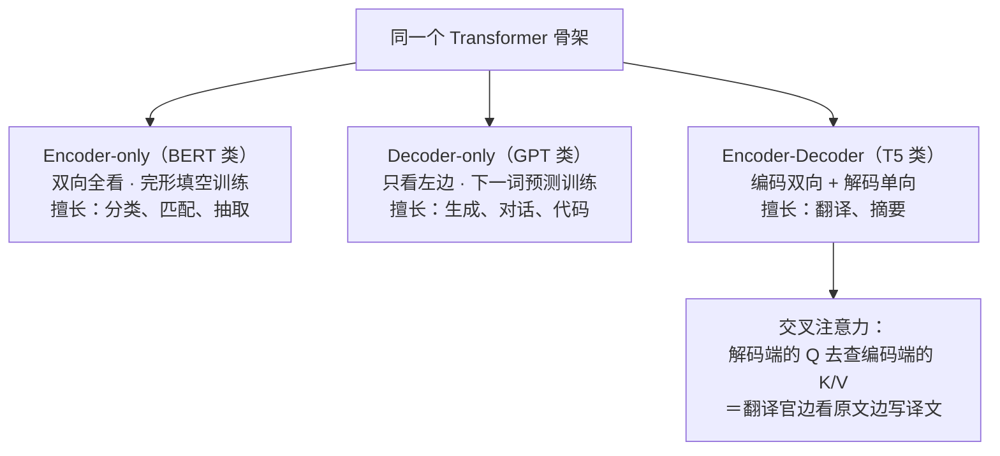
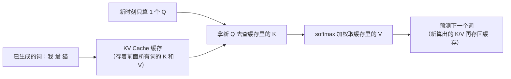

# Transformer 架构细节与变体

> **一句话理解**：同一个注意力骨架，按"遮不遮住未来"长出 Encoder、Decoder、Encoder-Decoder 三大家族；而 pre-norm、RoPE、KV Cache、MoE 这些工程细节，决定了它能不能训得深、扛得长、生成得快、扩得省。

[⬆️ 返回总目录](../../../README.md) · [⬆️ 返回本篇](../README.md) · [⬅️ 返回本章目录](./README.md)

| 属性 | 说明 |
|------|------|
| 难度 | ⭐⭐⭐⭐（高阶） |
| 所属分支 | NLP与LLM |
| 前置知识 | [Transformer 与注意力机制](./02-Transformer与注意力机制.md) |

---

## 📌 这一节解决什么问题

上一页你已经会算一次注意力了，但真跑起来的 Transformer 还有几个绕不开的问题：几十层堆起来为什么训得动（残差与归一化的摆位）？生成模型为什么不能偷看后文（因果掩码）？每层除了注意力还在干什么（FFN）？为什么大模型回答能一个词一个词"流式"蹦出来还越答越快（KV Cache）？长上下文的账到底贵在哪（RoPE 与注意力瓶颈）？"7B""70B"这些数字又是怎么来的（参数量估算）？为什么有些模型"总参数很大、激活参数很小"（MoE）？

这一页补齐这些工程细节，并把 BERT/GPT/T5 三大家族的分叉讲清楚——它是从"懂一个机制"到"懂一个物种"的桥梁，也是读懂下一页 LLM 全景的最后一块地基。

## 🌱 通俗理解

**三家族的分工，像三种读书人：**

- **Encoder（编码器，BERT 类）**：完形填空专家。读句子时**前后双向全看**，最适合"理解"类任务——分类、语义匹配、信息抽取；
- **Decoder（解码器，GPT 类）**：说书人。**只许看左边**，读到哪讲到哪，绝不剧透后文，天生适合"生成"——写作、对话、代码，今天的 LLM 几乎全是它；
- **Encoder-Decoder（编码-解码器，T5 类）**：翻译官。左边一位读原文（双向全看），右边一位写译文（单向），中间靠"交叉注意力"递纸条——翻译、摘要这类"输入一套、输出另一套"的任务。

**残差连接（Residual Connection）是高速公路**：每层不直接输出新结果，而是输出"在原输入上打的一个补丁"。层再深，原始信息也有一条直通车道，梯度能顺畅回流到底层——网络从"接力传话"变成"原稿+批注"。

**层归一化（Layer Normalization, LayerNorm）是稳定器**：每次加工前把数值的均值方差拉回标准范围，防止层层叠加后数值越滚越离谱。高速路（残差）让你跑得远，稳定器（归一化）让你不翻车。而稳定器**装在闸机前还是闸机后**（pre-norm 还是 post-norm），是深模型能否稳定训练的分水岭（下面细讲）。

**因果掩码（Causal Mask）是防剧透口罩**：Decoder 生成第 3 个词时不许看第 4 个词——训练时把打分矩阵"右上方未来区域"全部改成负无穷，softmax 后那些位置权重变 0。

**前馈网络（Feed-Forward Network, FFN）是信息加工车间**：注意力负责"从别的词收集情报"，FFN 负责把收集来的情报就地深加工提纯。有情报收集没加工车间，模型只是个传声筒。

**KV Cache（键值缓存）是速记本**：生成第 10 个词时，前 9 个词的 K/V 算过一遍就够了，存进缓存，别每步重算——这是自回归推理快起来的关键。

**RoPE（旋转位置编码）是给每个词发一个"转角器"**：词的 Q/K 向量按所在位置旋转一个角度，两个词做点积时，转角之差（相对位置）自然进入打分——位置信息不再是一张贴在向量上的"门牌"，而是融入比对过程的"角度差"。

**MoE（Mixture of Experts，混合专家）是外包团队**：FFN 不再是一个车间，而是一排车间 + 一个调度员（路由器）。每个词只派给最合适的两三个车间加工——大楼的总编制（总参数）可以非常大，但每个词实际开工的车间（激活参数）很小，"大而不贵"。

## 📋 举个例子

**量级估算一个 Decoder-only 模型的参数量。** 记一个结论：每层的注意力参数约 $4d^2$（Q/K/V/输出四个投影矩阵），FFN 约 $8d^2$（先升维 4 倍再降维），合计 $12d^2$。设 $d = 512$、层数 $L = 12$：

- 注意力：$4 \times 512^2 = 4 \times 262{,}144 \approx 1.05\text{M}$
- FFN：$8 \times 512^2 \approx 2.10\text{M}$
- 每层合计 $\approx 3.15\text{M}$，再乘 12 层：$\approx 37.7\text{M}$

所以这是一个 **37M（三千七百万）参数量级**的小模型（忽略词嵌入和偏置；词嵌入约"词表大小 × d"，词表 5 万时要再加约 26M）。记住 $12Ld^2$ 这把尺子，看到任何 Decoder-only 模型都能秒估它的体格。

**再实算一笔 KV Cache 的账（长上下文的显存入场费）。** 用公式"每 token 缓存字节 = 2 × 层数 × 每层 KV 维度 × 每参数字节数"，取 7B 级模型（$L=32$、$d=4096$）、fp16（每参数 2 字节）、batch=1：

- 每 token：$2 \times 32 \times 4096 \times 2 = 524{,}288$ 字节 ≈ **0.5 MB**
- 上下文 2K（2048 token）：$\approx$ **1 GB**
- 上下文 128K（131072 token）：$\approx$ **64 GB**——一张 24GB 消费级显卡根本放不下

极端情况（128K）正是不 work 的边界：不换技术（GQA 共享、KV 量化、更小的精度），服务根本起不来——详细展开见核心原理的 KV Cache 一节。

<details>
<summary>📊 展开完整算例：从 GPT-2 Small 到百 B 级（量级估算）</summary>

用 $N \approx 12Ld^2$ 逐个验证（均为量级估算，加词嵌入后与公开数字对得上）：

| 规模级 | 典型 L × d | 12Ld² 估算 | 加词嵌入后（词表 3~5 万） |
|---|---|---|---|
| 125M 级（GPT-2 Small 级） | 12 × 768 | ≈ 85M | ≈ 124M，与公开的 124M 对上 |
| 1.5B 级（GPT-2 XL 级） | 48 × 1600 | ≈ 1.47B | ≈ 1.6B |
| 7B 级（Llama 类小杯） | 32 × 4096 | ≈ 6.4B | ≈ 7B |
| 70B 级（Llama 类大杯） | 80 × 8192 | ≈ 64B | ≈ 70B |
| 百 B 级 | 96 × 12288 | ≈ 174B | 更高 |

三个观察：① 层数和宽度大致同步增长，不是只堆某一个；② "7B/70B"口语里指的是参数量，B = 十亿（Billion）；③ 真实模型还有 GQA、词嵌入共享等省参数设计，所以只是**量级对得上**，不是精确值。

</details>

## 🧠 核心原理

### 整体流程：同一个骨架，三大家族



| 家族 | 注意力方向 | 预训练目标 | 代表任务 | 代表模型系列 |
|------|-----------|-----------|---------|-------------|
| Encoder-only | 双向（全看） | 掩码语言建模（完形填空） | 分类、抽取、语义匹配 | BERT 类 |
| Decoder-only | 单向（只看左边） | 下一词预测 | 生成、对话、代码 | GPT 类 |
| Encoder-Decoder | 编码双向 + 解码单向 | 序列到序列恢复/翻译 | 翻译、摘要 | T5 类 |

### 逐步拆解

**残差连接**：每一层的输出是"输入 + 本层学到的修正"（Pre-Norm 风格，先归一化再进层）：

$$
\mathbf{x}^{(l+1)} = \mathbf{x}^{(l)} + F\big(\text{LN}(\mathbf{x}^{(l)})\big)
$$

> 👉 **人话**：每层只负责在原稿上"打补丁"，不改丢原稿；哪怕这层学废了（F≈0），信息也原样通过——深网络因此能训得动，梯度沿加号一路直通底层。

**层归一化**：对每个 token 自己的特征向量做标准化：

$$
\text{LN}(x) = \gamma \odot \frac{x - \mu(x)}{\sqrt{\sigma^2(x) + \epsilon}} + \beta
$$

> 👉 **人话**：不管上一层输出多离谱，先拉回"均值 0、方差 1"的标准体态，再用 $\gamma$、$\beta$ 微调——层层叠加的数值因此不会滚雪球式失控。

**Pre-Norm vs Post-Norm：一个摆位决定命运。** 原始论文用的是 **Post-Norm**（残差相加之后再归一化：$x + F(x) \to \text{LN}$），现代 LLM 几乎清一色 **Pre-Norm**（先归一化再进子层，残差主路上不设关卡：$x + F(\text{LN}(x))$）。为什么？

- **梯度路径**：Post-Norm 里残差主路每层都要过一次 LN，梯度要穿过 L 个 LN 的非线性缩放，深了就震荡；Pre-Norm 的残差主路是纯粹的加法直通道，梯度无阻碍直达任意层；
- **损失曲面视角（一句话）**：Pre-Norm 让网络"有效深度"随训练平滑生长，损失曲面更温和，对学习率不敏感；Post-Norm 在深层时如同在没有护栏的山路上开快车，必须小心 warmup 且随时可能翻车；
- **代价**：Pre-Norm 理论表达能力略弱、最后一层的贡献可能偏小，实践里常用最后一层补一次 LN 之类的微调找补——总账依然远比训练崩掉划算。

一条时间线记住它：2017 原始 Transformer 是 Post-Norm；GPT-2 级模型改 Pre-Norm 后，百层网络和免调 lr 的稳定性才成为日常。

**因果掩码**：生成第 $t$ 个词时，把打分矩阵中"未来位置"（$j > t$）设为 $-\infty$：

$$
S_{ij} = \begin{cases} \mathbf{q}_i^{\top}\mathbf{k}_j / \sqrt{d_k}, & j \le i \\ -\infty, & j > i \end{cases}
$$

> 👉 **人话**：softmax 见到 $-\infty$ 会输出 0，未来词的权重被强制清零——训练时模型才能"猜下一词"而不是"抄下一词"，否则就是泄题。

**FFN**：注意力收完情报，FFN 就地加工：

$$
\text{FFN}(x) = \text{GELU}(xW_1 + b_1)\,W_2 + b_2, \qquad W_1 \in \mathbb{R}^{d \times 4d}
$$

> 👉 **人话**：先把向量升维 4 倍"摊开来加工"，再压回原维度——车间里发生的事更接近"查表 + 组合"，大量事实性知识被认为存在这两个矩阵里（[02 页](./02-Transformer与注意力机制.md)的 key-value 记忆视角）。

### 参数量公式 12Ld²：拆开看它从哪来

$$
N \approx 12 \, L \, d^2
$$

> 👉 **人话**：Decoder-only 模型的参数量 ≈ 12 × 层数 × 维度²——一把随身尺子，见模型先量体格。

<details>
<summary>🧮 展开看推导：12 = 4（注意力）+ 8（FFN），每个数字的来历</summary>

**注意力部分（每层 $4d^2$）**。四个投影矩阵，各 $d \times d$：

| 矩阵 | 形状 | 参数量 | 作用 |
|------|------|--------|------|
| $W^Q$ | $d \times d$ | $d^2$ | 生成查询 |
| $W^K$ | $d \times d$ | $d^2$ | 生成键 |
| $W^V$ | $d \times d$ | $d^2$ | 生成值 |
| $W^O$ | $d \times d$ | $d^2$ | 多头拼接后的输出投影 |
| 小计 | | $4d^2$ | |

**FFN 部分（每层 $8d^2$）**。升维 4 倍再降回来：

- $W_1 \in \mathbb{R}^{d \times 4d}$：$4d^2$ 个参数；
- $W_2 \in \mathbb{R}^{4d \times d}$：$4d^2$ 个参数；
- 小计 $8d^2$。偏置（$4d + d$ 个）是 $d$ 的一次项，忽略。

**合计**：每层 $4d^2 + 8d^2 = 12d^2$，$L$ 层共 $12Ld^2$。词嵌入另计：$\text{词表} \times d$（词表 5 万、$d=4096$ 时约 0.2B，占比随模型变大而缩小）。

两个有用的推论：① FFN 占参数量的 2/3（8/12）——"知识主要存在 FFN"的量化佐证，也是 MoE 选择把 FFN 专家化的原因；② 参数量对 $d$ 是平方关系——加宽比加深贵得多，所以"深窄"与"浅宽"之争里，深窄在同等参数下往往更稳。

**Chinchilla 最优配比（一句话）**：在固定算力预算下，参数量 $N$ 与训练数据量 $D$ 要大致按 $D/N \approx 20$ token/参数 同步增长才最划算——"只堆参数不喂够数据"的模型是训练不足的（GPT-3 级模型按此标准都被判定喂少了），详见[04 页 Scaling Law](./04-大语言模型LLM全景.md)。

</details>

### KV Cache：完整公式与实算



没有 KV Cache，生成第 $n$ 个词要把前面 $n-1$ 个词的 K/V 全部重算，整段生成变成 $O(n^2)$ 次前向；有了它，每步只算新词的 Q/K/V，是自回归推理"边生成边提速"的关键。现代推理框架默认开启。

每 token 的 KV Cache 字节数有一个可以默写的公式：

$$
\text{KV Bytes/token} = 2 \;(\text{K和V两份}) \times L \;(\text{层数}) \times d_{\text{kv}} \;(\text{每层KV总维}) \times b \;(\text{每参数字节数})
$$

> 👉 **人话**：每一层、每一个已生成的词，都要存两份向量（K 和 V）；层数 × 长度 × 维度 × 精度，四个因子连乘——**这就是"上下文每翻一倍、缓存显存翻一倍"的数学形态**，也是长上下文服务的入场费。

<details>
<summary>🧮 展开实算：同一模型在 2K / 128K / GQA / 量化 四种情形下的缓存账</summary>

基准：7B 级 Dense 模型，$L = 32$，多头注意力（MHA）$d_{\text{kv}} = d = 4096$，fp16（$b=2$ 字节），batch=1。

| 配置 | 每 token 缓存 | 128K 上下文总缓存 | 说明 |
|------|--------------|-------------------|------|
| MHA + fp16（基准） | $2 \times 32 \times 4096 \times 2 = 0.5$ MB | **64 GB** | 24GB 消费卡放不下，必须多卡 |
| GQA：32 查询头共享 8 组 KV | $2 \times 32 \times 1024 \times 2 = 0.125$ MB | **16 GB** | $d_{\text{kv}}$ 缩为 1/4，缓存同缩 |
| GQA + KV 量化 int8 | $2 \times 32 \times 1024 \times 1 = 0.0625$ MB | **8 GB** | 精度减半再省一半 |
| GQA + int8 + 上下文 2K | — | **0.125 GB** | 长度因子回归温和 |

三条结论：① 缓存显存 = 上面公式 × 序列长 × batch——**batch 是隐形的乘数**，10 个并发用户就是 10 倍缓存；② GQA/MQA（分组/多查询共享 KV）是最有效的"瘦身术"，现代开源模型标配；③ KV 量化（int8/int4）是第二档杠杆，代价是轻微精度损失。

顺带补一笔"2K vs 128K 贵在哪"的完整账：显存（上面的缓存）+ 算力（预填充阶段 $O(n^2 d)$ 打分）+ 带宽（每生成一个 token 都要读整个缓存一遍，长上下文的解码受**显存带宽**限制多于算力）。

</details>

### RoPE 旋转位置编码：把位置揉进"角度差"

正弦位置编码是"把位置加到向量上"，**RoPE（Rotary Position Embedding，旋转位置编码）**改成"按位置旋转 Q/K 向量"：把 $d$ 维切成 $d/2$ 个二维平面，第 $i$ 个平面按 $\theta_i \cdot pos$ 旋转（$\theta_i = 10000^{-2i/d}$，与正弦编码同一套多分辨率频率）。

它讨巧的地方在一个内积恒等式：两个向量各自旋转 $\theta \cdot m$ 与 $\theta \cdot n$ 后做点积，结果只依赖**旋转角之差** $(m-n)$：

$$
\langle R_m \mathbf{q},\; R_n \mathbf{k} \rangle = \langle \mathbf{q},\; R_{n-m} \mathbf{k} \rangle
$$

> 👉 **人话**：查询旋转"第 100 位"的角度、键旋转"第 95 位"的角度，点积里自动只剩"差 5 位"的信息——**打分天然变成相对位置的函数**，绝对位置被旋转抵消了。

为什么这带来**外推性**：模型从没背过"第 10001 个位置长什么样"（可学习位置表的死穴），它只学过"相隔 5 个词"这类相对关系；RoPE 把位置完全表达为相对角度，训练长度外的相对位置仍是合法输入。当然外推不是无限的——训练时没见过的旋转角度分布会让打分失真，所以实践中还要配**位置插值**（把位置序号按比例压缩回训练范围，如把 128K 的位置除以 8 当 16K 用，再做少量微调）——这就是"RoPE 可外推 + 插值微调"这对组合拳的由来。

### 长上下文的注意力瓶颈与对策一览

上一页讲过失效现场：$O(n^2)$ 打分爆炸、注意力稀释、**lost in the middle**（模型利用上下文开头与结尾的信息明显好于中段，长文档问答的经典病症——对策之一就是把最相关材料放在开头或结尾）。对策家族各用一句话定位：

| 路线 | 一句话原理 | 代表 |
|------|-----------|------|
| 稀疏注意力 | 只让部分词对（如全局锚点 + 局部窗口）互相打分，$n^2$ 变稀疏 | Sparse Transformer |
| 滑窗注意力 | 每个词只看左右 w 个邻居，堆 L 层后感受野逐层扩大 | 类 Mistral 做法（通用描述） |
| 线性注意力 | 用核函数替换 softmax，把 $QK^\top V$ 重排成 $Q(K^\top V)$，复杂度降为 $O(nd^2)$ | 常见于现代线性注意力变体 |
| 上下文工程 | 不改架构：检索只塞相关块、摘要压缩历史、重排材料位置 | RAG（[06 页](./06-RAG与Agent.md)） |

选型直觉：追求精度上限用全注意力 + GQA 省缓存；超长流式输入（百万级）线性注意力有天然优势；大多数业务场景，"好的检索 + 适度窗口"比"硬扛超长窗口"便宜得多。

<details>
<summary>🧮 展开看：lost in the middle 的典型实验形态（选讲）</summary>

经典实验设计：把一条"关键事实"放在长上下文里的不同位置，问模型依赖该事实的问题，画出"正确率—位置"曲线。反复观察到的形态是 **U 形曲线**：材料在开头（primacy）与结尾（recency）时正确率高，落在中段时明显塌陷——哪怕模型"看得见"它。

两种主流解释：① 注意力稀释 + 位置竞争——中段位置要与更多邻居抢 softmax 权重；② 训练分布——预训练与指令数据里重要信息多出现在开头/结尾，模型学出了这种位置先验。

工程上的三条免费对策：把最重要的材料放在上下文的开头或结尾（而不是顺手往中间塞）；控制检索材料的数量（top-3 精选好过 top-20 灌满）；关键指令在提示词里重复出现（开头系统区 + 结尾再叮嘱一次）。RAG 的"重排后取 top-k"本质上就是在做第一与第二条（见 [06 页](./06-RAG与Agent.md)）。

</details>

### MoE：稀疏激活的大而不贵

Dense 模型每个 token 都要过全部 FFN；**MoE（Mixture of Experts）**把每层的 FFN 替换为 $E$ 个并列的"专家"FFN + 一个**路由器（Router/Gate）**：

$$
\text{MoE}(x) = \sum_{i \in \text{TopK}(g(x))} g_i(x) \cdot \text{Expert}_i(x), \qquad g(x) = \text{softmax}(W_g x)
$$

> 👉 **人话**：路由器给每个专家打分，只挑分数最高的 $k$ 个（常见 $k=1$ 或 2）加工这个词，输出按路由分数加权合并——**大楼编制 64 个车间，每个词只进 2 个车间**。

账本：总参数 $\approx$ 全部专家之和（可以做得巨大），每个 token 的**激活参数（Active Params）**≈ Dense 骨架 + $k$ 个专家（小得多）。训练算力和推理算力按激活算——这是 MoE 的全部意义：用相同算力买更多知识容量。

它的三个工程难点也来自"稀疏"本身：

- **负载均衡**：路由器如果发现某几个专家"好用"，会把 token 越来越多地派过去（富者愈富），其余专家得不到训练、退化成摆设。对策是给训练目标加一项负载均衡损失（惩罚专家间负载不均），或定期扰动路由；
- **训练不稳定**：路由是"硬选择"（top-k 不可导），梯度估计带噪声，超参比 Dense 更娇气；
- **显存不省**：激活参数小，但**总参数全要装进显存**——"训练便宜、部署不便宜"，推理并发低时性价比打折。

一句话记忆：**MoE 用"总参数买知识、激活参数算成本"，代价是路由的均衡与稳定**。

**与算力的现实衔接**：125M 级单卡可训可推；7B 级推理要一张 24GB 显存级显卡，训练需多卡；70B 到百 B 级需要专业卡集群。规模、显存、通信的账在[分布式训练与模型规模](../../3-深度学习/04-深度学习基础/04-分布式训练与模型规模.md)细算，部署侧见[推理与部署](../../3-深度学习/04-深度学习基础/05-推理与部署.md)。

## 💻 动手试试

```python
# 依赖：pip install torch（纯本地运行，无需联网）
import torch
import torch.nn.functional as F

# 1) 因果掩码：沿用上一页 ["我","爱","猫"] 的打分矩阵
scores = torch.tensor([[2.0, 1.0, 0.5],
                       [1.2, 0.6, 1.5],
                       [0.5, 2.0, 0.8]])
mask = torch.triu(torch.ones(3, 3, dtype=torch.bool), diagonal=1)  # 右上三角=未来
masked = scores.masked_fill(mask, float("-inf"))
print(F.softmax(masked, dim=-1).round(decimals=2))
# 输出：
# tensor([[1.00, 0.00, 0.00],     ← “我”只能看自己
#         [0.65, 0.35, 0.00],     ← “爱”能看“我”和自己
#         [0.15, 0.66, 0.20]])    ← “猫”本来就能看全部，不受影响
# 注意第三行与上一页完全一致：最后一个词没有“未来”可遮。

# 2) 参数量量级估算：N ≈ 12 × L × d²（不含词嵌入）
L, d = 12, 512
n_attn = 4 * d * d    # 注意力：Q/K/V/输出四个 d×d 矩阵
n_ffn = 8 * d * d     # FFN：d→4d→d 两个矩阵
print(f"每层参数：{(n_attn + n_ffn)/1e6:.2f}M，其中注意力占 {n_attn/(n_attn+n_ffn):.0%}")
print(f"整模型：{L * (n_attn + n_ffn) / 1e6:.1f}M")   # 37.7M，与手算一致

# 3) KV Cache 显存计算器（对照正文公式）
def kv_cache_gb(L, d_kv, seq_len, batch=1, bytes_per=2, kv=2):
    total = kv * L * d_kv * seq_len * batch * bytes_per  # 公式四因子连乘
    return total / 1024**3

for seq in [2048, 131072]:
    print(f"7B MHA fp16 @{seq}: {kv_cache_gb(32, 4096, seq):.2f} GB")
print(f"7B GQA int8 @131072: {kv_cache_gb(32, 1024, 131072, bytes_per=1):.2f} GB")
# 预期输出：1.00 GB / 64.00 GB / 8.00 GB——与正文表格一致
# 可见上下文长度是显存的线性乘数；batch=10 时再乘 10。

# 🧪 改什么参数、看什么变化：
# 1) 把 L 从 32 改成 80、d_kv 改 8192（70B 级体格）：看缓存怎么暴涨；
# 2) 把 bytes_per 改 0.5（4bit 量化）：看缓存降为 1/4；
# 3) 把 n_attn 的 4 改 3（省掉输出投影的错误理解）再对比 12Ld² ——
#    会发现对不上公开参数量，验证"4 个投影矩阵"缺一不可。
```

## 🔥 炼丹小灶

> 🔥 **炼丹小灶**：复现/魔改一个小 Decoder-only 模型的起点——
> - 配方：Pre-Norm + 残差（深了别用 Post-Norm 硬扛）、RoPE 位置编码、GELU 激活、Attention dropout 0.1、按上一页的 warmup 配方喂 lr；MoE 起步用少量专家（如 8 选 2）+ 负载均衡系数调小，先跑通 Dense 再上专家；
> - 玄学：loss 尖刺状抖动先降 lr 再查数据；小模型先在 1~2 亿 token 上把 loss 磨平，再谈扩数据；长上下文先短训再逐步拉长并配位置插值；
> - ⚠️ 以上是经验参考值，不是圣旨；换规模请重新炼。

## 🖱️ 动手玩

> 🕹️ **延伸玩一玩**：[Transformer Explainer](https://poloclub.github.io/transformer-explainer/)——逐层展开一个真实 GPT-2 级 Decoder-only 模型的内部：层数、头数、FFN 维度都是活的，可以把本页的 $12Ld^2$ 尺子对着它量一遍。

## 🔗 在知识树中的位置

- **上游**：[Transformer 与注意力机制](./02-Transformer与注意力机制.md)（本页的全部细节都长在那个骨架上）。
- **下游**：[大语言模型 LLM 全景](./04-大语言模型LLM全景.md)——Decoder-only + 下一词预测 + 无限堆料 = LLM。
- **横向对比**：三家族像同一个人的三种职业装——理解岗（BERT 类）、生成岗（GPT 类）、转换岗（T5 类）；2018 年前后三线并进，最终 Decoder-only 阵营收编了大多数应用（原因见下一页）。工程变体方面：Dense 追求"每参数都干活"，MoE 追求"总参数买知识、激活算成本"；MHA 追求表达力，GQA/MQA 用一点质量换大把缓存显存。

## ⚠️ 常见误区

- **误区一**："BERT 和 GPT 只是大小不同的同款模型。" → 家族不同：注意力方向（双向 vs 单向）、训练目标（完形填空 vs 下一词预测）、用法（理解 vs 生成）都不同；拿 BERT 类模型去"续写"是张冠李戴。
- **误区二**："KV Cache 是可选的锦上添花。" → 不开 Cache，生成耗时随长度平方级暴涨，长文本几乎不可用；它是现代推理框架的默认项，也是部署算账的必算项。
- **误区三**："参数量越大越聪明。" → 参数量只是三要素之一；数据质量与数量、训练配比同样关键（下一页的 Scaling Law 与 Chinchilla 配比会展开），"小而精训得好"常胜过"大而糙"。
- **误区四**："MoE 模型 400B 参数，推理成本就是 400B 级。" → 推理算力按**激活参数**算（每 token 只过 k 个专家），但**显存仍要装下全部参数**——算力便宜了，显存没省。

## 📝 小结与自测

**要点回顾**

- 三家族 = 三种"看句子的纪律"：BERT 类双向理解、GPT 类单向生成、T5 类编码-解码转换（交叉注意力是递纸条）；
- 残差是高速公路（信息与梯度直通）、LayerNorm 是稳定器（数值不失控）；**Pre-Norm 把 LN 挪出残差主路**，深模型稳定训练的关键摆位；
- 因果掩码把未来打分压成 0，是"猜下一词"训练成立的前提；FFN 是每层的信息加工车间（占参数 2/3，可视为 key-value 记忆）；
- 参数量 ≈ $12Ld^2$ = 注意力 $4Ld^2$ + FFN $8Ld^2$；Chinchilla 提醒：参数和数据要按 ~20 token/参数 配比一起长；
- KV Cache 公式：每 token 字节 = 2 × L × $d_{\text{kv}}$ × 精度；GQA 与 KV 量化是两大瘦身杠杆；
- RoPE 让打分只依赖相对位置（旋转角之差），外推性由此而来，配位置插值吃满长上下文；长文本三病：$n^2$ 算力、注意力稀释、lost in the middle；
- MoE：路由器 top-k 专家稀疏激活，总参数买知识、激活参数算成本，难点在负载均衡与训练稳定。

**自测一下**（点击展开答案）

<details>
<summary>问题 1：残差连接为什么能让"很深的网络"训练成功？Pre-Norm 又在此之上补了什么？</summary>

因为每层学的是"增量补丁"：输出 = 输入 + F(输入)。反向传播时梯度可以沿加法支路直接流回浅层（不经过 F 的连乘衰减），深层的训练信号因此不至于消失。Pre-Norm 进一步把 LayerNorm 挪到子层内部，保证残差主路（x + …）是一条不设关卡的纯加法通道——梯度在几十层里传递时不再被 LN 反复缩放，深模型才能"免惊吓"训练。

</details>

<details>
<summary>问题 2：一个 L=32、d=4096 的 Decoder-only 模型，参数量量级是多少？</summary>

$12 \times 32 \times 4096^2 = 12 \times 32 \times 16.78\text{M} \approx 6.4\text{B}$，加词嵌入后约 7B——正是"7B 级"开源模型的典型体格。

</details>

<details>
<summary>问题 3：为什么 RoPE 天然有利于长上下文外推？为什么外推还需要位置插值？</summary>

RoPE 把位置编码成 Q/K 向量的旋转角，点积只依赖两位置的角度差（相对位置）——模型只需理解"相隔多远"，不必背绝对位置表，因此训练长度外的相对位置在数学上仍是合法输入。但训练时没见过的角度分布会让打分失真，所以实践中把位置按比例压缩回训练范围（插值）再少量微调，才能把 4K 训练的模型拉伸到几十万上下文。

</details>

<details>
<summary>问题 4：128K 上下文的 7B 模型（MHA、fp16、batch=1）KV Cache 要多少显存？GQA 共享 8 组 KV 后呢？</summary>

MHA：$2 \times 32 \times 4096 \times 131072 \times 2$ 字节 ≈ 64 GB。GQA 8 组：$d_{\text{kv}}$ 降为 1024，约 16 GB；再叠 int8 量化约 8 GB。可见长上下文的入场费主要压在 KV Cache 上，瘦身靠共享与量化。

</details>

<details>
<summary>问题 5：MoE 模型"总参数 400B、激活 40B"是什么意思？部署它要按哪个数字准备显存？</summary>

总参数 400B = 骨架 + 全部专家的参数之和；激活 40B = 每个 token 实际只经过的参数量（骨架 + 被 top-k 路由选中的专家）。训练与推理**算力**按激活算（便宜），但显存要装下全部 400B 权重（昂贵）——所以 MoE 是"算力省钱、显存费钱"的架构，部署显存按总参数备，吞吐收益按激活参数享。

</details>

## 📚 延伸阅读

- 论文：BERT: Pre-training of Deep Bidirectional Transformers（2018，https://arxiv.org/abs/1810.04805）
- 论文：Exploring the Limits of Transfer Learning with a Unified Text-to-Text Transformer（T5，2019，https://arxiv.org/abs/1910.10683）
- 论文：Language Models are Few-Shot Learners（GPT-3，2020，https://arxiv.org/abs/2005.14165）
- 论文：RoFormer: Enhanced Transformer with Rotary Position Embedding（RoPE，2021，https://arxiv.org/abs/2104.09864）
- 论文：GQA: Training Generalized Multi-Query Transformer Models（2023，https://arxiv.org/abs/2305.13245）
- 论文：Outrageously Large Neural Networks: The Sparsely-Gated Mixture-of-Experts Layer（MoE，2017，https://arxiv.org/abs/1701.06538）

---

[⬅️ 上一页：Transformer 与注意力机制](./02-Transformer与注意力机制.md) · [返回本章目录](./README.md) · [下一页：大语言模型 LLM 全景 ➡️](./04-大语言模型LLM全景.md)
