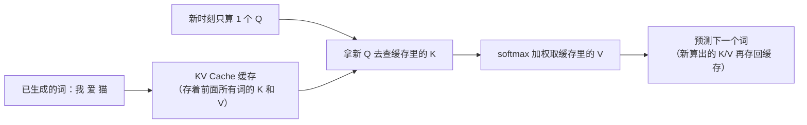

# Transformer 架构细节与变体

> **一句话理解**：同一个注意力骨架，按"遮不遮住未来"长出 Encoder、Decoder、Encoder-Decoder 三大家族；而残差、掩码、KV Cache 这些工程细节，决定了它能不能训得深、生成得快。

[⬆️ 返回总目录](../../../README.md) · [⬆️ 返回本篇](../README.md) · [⬅️ 返回本章目录](./README.md)

| 属性 | 说明 |
|------|------|
| 难度 | ⭐⭐⭐⭐（高阶） |
| 所属分支 | NLP与LLM |
| 前置知识 | [Transformer 与注意力机制](./02-Transformer与注意力机制.md) |

---

## 📌 这一节解决什么问题

上一页你已经会算一次注意力了，但真跑起来的 Transformer 还有几个绕不开的问题：几十层堆起来为什么训得动（残差与 LayerNorm）？生成模型为什么不能偷看后文（因果掩码）？每层除了注意力还在干什么（FFN）？为什么大模型回答能一个词一个词"流式"蹦出来还越答越快（KV Cache）？"7B""70B"这些数字又是怎么来的（参数量估算）？

这一页补齐这些工程细节，并把 BERT/GPT/T5 三大家族的分叉讲清楚——它是从"懂一个机制"到"懂一个物种"的桥梁，也是读懂下一页 LLM 全景的最后一块地基。

## 🌱 通俗理解

**三家族的分工，像三种读书人：**

- **Encoder（编码器，BERT 类）**：完形填空专家。读句子时**前后双向全看**，最适合"理解"类任务——分类、语义匹配、信息抽取；
- **Decoder（解码器，GPT 类）**：说书人。**只许看左边**，读到哪讲到哪，绝不剧透后文，天生适合"生成"——写作、对话、代码，今天的 LLM 几乎全是它；
- **Encoder-Decoder（编码-解码器，T5 类）**：翻译官。左边一位读原文（双向全看），右边一位写译文（单向），中间靠"交叉注意力"递纸条——翻译、摘要这类"输入一套、输出另一套"的任务。

**残差连接（Residual Connection）是高速公路**：每层不直接输出新结果，而是输出"在原输入上打的一个补丁"。层再深，原始信息也有一条直通车道，梯度能顺畅回流到底层——网络从"接力传话"变成"原稿+批注"。

**层归一化（Layer Normalization, LayerNorm）是稳定器**：每次加工前把数值的均值方差拉回标准范围，防止层层叠加后数值越滚越离谱。高速路（残差）让你跑得远，稳定器（归一化）让你不翻车。

**因果掩码（Causal Mask）是防剧透口罩**：Decoder 生成第 3 个词时不许看第 4 个词——训练时把打分矩阵"右上方未来区域"全部改成负无穷，softmax 后那些位置权重变 0。

**前馈网络（Feed-Forward Network, FFN）是信息加工车间**：注意力负责"从别的词收集情报"，FFN 负责把收集来的情报就地深加工提纯。有情报收集没加工车间，模型只是个传声筒。

**KV Cache（键值缓存）是速记本**：生成第 10 个词时，前 9 个词的 K/V 算过一遍就够了，存进缓存，别每步重算——这是自回归推理快起来的关键。

## 📋 举个例子

**量级估算一个 Decoder-only 模型的参数量。** 记一个结论：每层的注意力参数约 $4d^2$（Q/K/V/输出四个投影矩阵），FFN 约 $8d^2$（先升维 4 倍再降维），合计 $12d^2$。设 $d = 512$、层数 $L = 12$：

- 注意力：$4 \times 512^2 = 4 \times 262{,}144 \approx 1.05\text{M}$
- FFN：$8 \times 512^2 \approx 2.10\text{M}$
- 每层合计 $\approx 3.15\text{M}$，再乘 12 层：$\approx 37.7\text{M}$

所以这是一个 **37M（三千七百万）参数量级**的小模型（忽略词嵌入和偏置；词嵌入约"词表大小 × d"，词表 5 万时要再加约 26M）。记住 $12Ld^2$ 这把尺子，看到任何 Decoder-only 模型都能秒估它的体格。

<details>
<summary>📊 展开完整算例：从 GPT-2 Small 到百 B 级（量级估算）</summary>

用 $N \approx 12Ld^2$ 逐个验证（均为量级估算，加词嵌入后与公开数字对得上）：

| 规模级 | 典型 L × d | 12Ld² 估算 | 加词嵌入后（词表 3~5 万） |
|---|---|---|---|
| 125M 级（GPT-2 Small 级） | 12 × 768 | ≈ 85M | ≈ 124M，与公开的 124M 对上 |
| 1.5B 级（GPT-2 XL 级） | 48 × 1600 | ≈ 1.47B | ≈ 1.6B |
| 7B 级（Llama 类小杯） | 32 × 4096 | ≈ 6.4B | ≈ 7B |
| 70B 级（Llama 类大杯） | 80 × 8192 | ≈ 64B | ≈ 70B |
| 百 B 级 | 96 × 12288 | ≈ 174B | 更高 |

三个观察：① 层数和宽度大致同步增长，不是只堆某一个；② "7B/70B"口语里指的是参数量，B = 十亿（Billion）；③ 真实模型还有 GQA、词嵌入共享等省参数设计，所以只是**量级对得上**，不是精确值。

</details>

## 🧠 核心原理

### 整体流程：同一个骨架，三大家族


| 家族 | 注意力方向 | 预训练目标 | 代表任务 | 代表模型系列 |
|------|-----------|-----------|---------|-------------|
| Encoder-only | 双向（全看） | 掩码语言建模（完形填空） | 分类、抽取、语义匹配 | BERT 类 |
| Decoder-only | 单向（只看左边） | 下一词预测 | 生成、对话、代码 | GPT 类 |
| Encoder-Decoder | 编码双向 + 解码单向 | 序列到序列恢复/翻译 | 翻译、摘要 | T5 类 |

### 逐步拆解

**残差连接**：每一层的输出是"输入 + 本层学到的修正"（Pre-Norm 风格，先归一化再进层）：

$$
\mathbf{x}^{(l+1)} = \mathbf{x}^{(l)} + F\big(\text{LN}(\mathbf{x}^{(l)})\big)
$$

> 👉 **人话**：每层只负责在原稿上"打补丁"，不改丢原稿；哪怕这层学废了（F≈0），信息也原样通过——深网络因此能训得动，梯度沿加号一路直通底层。

**层归一化**：对每个 token 自己的特征向量做标准化：

$$
\text{LN}(x) = \gamma \odot \frac{x - \mu(x)}{\sqrt{\sigma^2(x) + \epsilon}} + \beta
$$

> 👉 **人话**：不管上一层输出多离谱，先拉回"均值 0、方差 1"的标准体态，再用 $\gamma$、$\beta$ 微调——层层叠加的数值因此不会滚雪球式失控。

**因果掩码**：生成第 $t$ 个词时，把打分矩阵中"未来位置"（$j > t$）设为 $-\infty$：

$$
S_{ij} = \begin{cases} \mathbf{q}_i^{\top}\mathbf{k}_j / \sqrt{d_k}, & j \le i \\ -\infty, & j > i \end{cases}
$$

> 👉 **人话**：softmax 见到 $-\infty$ 会输出 0，未来词的权重被强制清零——训练时模型才能"猜下一词"而不是"抄下一词"，否则就是泄题。

**FFN**：注意力收完情报，FFN 就地加工：

$$
\text{FFN}(x) = \text{GELU}(xW_1 + b_1)\,W_2 + b_2, \qquad W_1 \in \mathbb{R}^{d \times 4d}
$$

> 👉 **人话**：先把向量升维 4 倍"摊开来加工"，再压回原维度——车间里发生的事更接近"查表 + 组合"，大量事实性知识被认为存在这两个矩阵里。

**参数量与 KV Cache**：

$$
N \approx 12 \, L \, d^2
$$

> 👉 **人话**：Decoder-only 模型的参数量 ≈ 12 × 层数 × 维度²——一把随身尺子，见模型先量体格。



没有 KV Cache，生成第 $n$ 个词要把前面 $n-1$ 个词的 K/V 全部重算，整段生成变成 $O(n^2)$ 次前向；有了它，每步只算新词的 Q/K/V，是自回归推理"边生成边提速"的关键。现代推理框架默认开启。

<details>
<summary>🧮 展开看：同一个模型 2K vs 128K 上下文，KV Cache 显存差多少（量级估算）</summary>

每 token 的 KV Cache 大小 = $2 \times L \times d \times 2$ 字节（2 = K 和 V 两份，末尾 2 = fp16 每参数 2 字节）。

取 7B 级模型（$L=32$、$d=4096$）、batch=1：

- 每 token：$2 \times 32 \times 4096 \times 2 = 524{,}288$ 字节 ≈ **0.5 MB**
- 上下文 2K（2048 token）：$2048 \times 0.5\text{MB} \approx$ **1 GB**
- 上下文 128K（131072 token）：$\approx$ **64 GB**——一张 24GB 消费级显卡根本放不下

这就是长上下文贵的根本原因，也是 GQA（分组共享 K/V）、MQA、KV 量化等"给缓存瘦身"技术存在的意义。结论记住量级即可：**上下文每翻一倍，缓存显存跟着翻倍**。

</details>

**长上下文概览（一句话级）**：位置编码用 **RoPE（旋转位置编码）** 时可通过"外推/插值"把训练长度拉伸到更长；稀疏注意力让每个词不必和所有词两两打分，省下 $O(n^2)$ 的爆炸算力——细节等真做长文本时再深挖。

**与算力的现实衔接**：125M 级单卡可训可推；7B 级推理要一张 24GB 显存级显卡，训练需多卡；70B 到百 B 级需要专业卡集群。规模、显存、通信的账在[分布式训练与模型规模](../../3-深度学习/04-深度学习基础/04-分布式训练与模型规模.md)细算，部署侧见[推理与部署](../../3-深度学习/04-深度学习基础/05-推理与部署.md)。

## 💻 动手试试

```python
# 依赖：pip install torch（纯本地运行，无需联网）
import torch
import torch.nn.functional as F

# 1) 因果掩码：沿用上一页 ["我","爱","猫"] 的打分矩阵
scores = torch.tensor([[2.0, 1.0, 0.5],
                       [1.2, 0.6, 1.5],
                       [0.5, 2.0, 0.8]])
mask = torch.triu(torch.ones(3, 3, dtype=torch.bool), diagonal=1)  # 右上三角=未来
masked = scores.masked_fill(mask, float("-inf"))
print(F.softmax(masked, dim=-1).round(decimals=2))
# 输出：
# tensor([[1.00, 0.00, 0.00],     ← “我”只能看自己
#         [0.65, 0.35, 0.00],     ← “爱”能看“我”和自己
#         [0.15, 0.66, 0.20]])    ← “猫”本来就能看全部，不受影响
# 注意第三行与上一页完全一致：最后一个词没有“未来”可遮。

# 2) 参数量量级估算：N ≈ 12 × L × d²（不含词嵌入）
L, d = 12, 512
n_attn = 4 * d * d    # 注意力：Q/K/V/输出四个 d×d 矩阵
n_ffn = 8 * d * d     # FFN：d→4d→d 两个矩阵
print(f"{L * (n_attn + n_ffn) / 1e6:.1f}M")   # 37.7M，与手算一致
```

## 🔥 炼丹小灶

> 🔥 **炼丹小灶**：复现/魔改一个小 Decoder-only 模型的起点——
> - 配方：Pre-Norm + 残差（深了别用 Post-Norm 硬扛）、GELU 激活、Attention dropout 0.1、按上一页的 warmup 配方喂 lr；
> - 玄学：loss 尖刺状抖动先降 lr 再查数据；小模型先在 1~2 亿 token 上把 loss 磨平，再谈扩数据；
> - ⚠️ 以上是经验参考值，不是圣旨；换规模请重新炼。

## 🖱️ 动手玩

> 🕹️ **延伸玩一玩**：[Transformer Explainer](https://poloclub.github.io/transformer-explainer/)——逐层展开一个真实 GPT-2 级 Decoder-only 模型的内部：层数、头数、FFN 维度都是活的，可以把本页的 $12Ld^2$ 尺子对着它量一遍。

## 🔗 在知识树中的位置

- **上游**：[Transformer 与注意力机制](./02-Transformer与注意力机制.md)（本页的全部细节都长在那个骨架上）。
- **下游**：[大语言模型 LLM 全景](./04-大语言模型LLM全景.md)——Decoder-only + 下一词预测 + 无限堆料 = LLM。
- **横向对比**：三家族像同一个人的三种职业装——理解岗（BERT 类）、生成岗（GPT 类）、转换岗（T5 类）；2018 年前后三线并进，最终 Decoder-only 阵营收编了大多数应用（原因见下一页）。

## ⚠️ 常见误区

- **误区一**："BERT 和 GPT 只是大小不同的同款模型。" → 家族不同：注意力方向（双向 vs 单向）、训练目标（完形填空 vs 下一词预测）、用法（理解 vs 生成）都不同；拿 BERT 类模型去"续写"是张冠李戴。
- **误区二**："KV Cache 是可选的锦上添花。" → 不开 Cache，生成耗时随长度平方级暴涨，长文本几乎不可用；它是现代推理框架的默认项，也是部署算账的必算项。
- **误区三**："参数量越大越聪明。" → 参数量只是三要素之一；数据质量与数量、训练配比同样关键（下一页的 Scaling Law 会展开），"小而精训得好"常胜过"大而糙"。

## 📝 小结与自测

**要点回顾**

- 三家族 = 三种"看句子的纪律"：BERT 类双向理解、GPT 类单向生成、T5 类编码-解码转换（交叉注意力是递纸条）；
- 残差是高速公路（信息与梯度直通）、LayerNorm 是稳定器（数值不失控），两者合起来深网络才训得动；
- 因果掩码把未来打分压成 0，是"猜下一词"训练成立的前提；FFN 是每层的信息加工车间；
- KV Cache 缓存历史 K/V，让自回归生成免于重复计算；Decoder-only 参数量 ≈ $12Ld^2$。

**自测一下**（点击展开答案）

<details>
<summary>问题 1：残差连接为什么能让"很深的网络"训练成功？</summary>

因为每层学的是"增量补丁"：输出 = 输入 + F(输入)。反向传播时梯度可以沿加法支路直接流回浅层（不经过 F 的连乘衰减），深层的训练信号因此不至于消失；某层学废了（F≈0）也只是"这层白叠"，不会毁掉整网。

</details>

<details>
<summary>问题 2：一个 L=32、d=4096 的 Decoder-only 模型，参数量量级是多少？</summary>

$12 \times 32 \times 4096^2 = 12 \times 32 \times 16.78\text{M} \approx 6.4\text{B}$，加词嵌入后约 7B——正是"7B 级"开源模型的典型体格。

</details>

## 📚 延伸阅读

- 论文：BERT: Pre-training of Deep Bidirectional Transformers（2018，https://arxiv.org/abs/1810.04805）
- 论文：Exploring the Limits of Transfer Learning with a Unified Text-to-Text Transformer（T5，2019，https://arxiv.org/abs/1910.10683）
- 论文：Language Models are Few-Shot Learners（GPT-3，2020，https://arxiv.org/abs/2005.14165）

---

[⬅️ 上一页：Transformer 与注意力机制](./02-Transformer与注意力机制.md) · [返回本章目录](./README.md) · [下一页：大语言模型 LLM 全景 ➡️](./04-大语言模型LLM全景.md)
