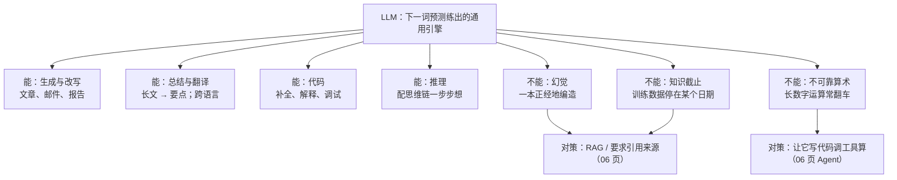
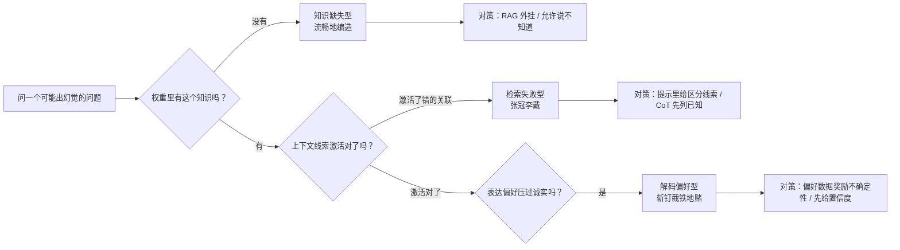
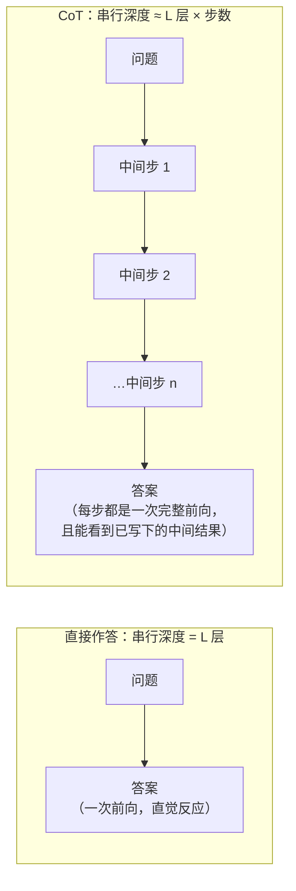

# 大语言模型 LLM 全景

> **一句话理解**：LLM 是一个读了几乎整个互联网、训练目标只有"预测下一个词"的模型——把这个简单目标用海量数据和算力做到极致后，竟"涌现"出了对话、推理、写代码等通用能力。

[⬆️ 返回总目录](../../../README.md) · [⬆️ 返回本篇](../README.md) · [⬅️ 返回本章目录](./README.md)

| 属性 | 说明 |
|------|------|
| 难度 | ⭐⭐⭐⭐（高阶） |
| 所属分支 | NLP与LLM |
| 前置知识 | [Transformer 架构细节与变体](./03-Transformer架构细节与变体.md) |

---

## 📌 这一节解决什么问题

GPT、Claude、Gemini、Llama、Qwen、DeepSeek……这些名字天天上新闻，但"大语言模型"四个字拆开到底是什么？为什么一个只会"接龙"的模型能写代码、做翻译、答问题？它明明读遍了互联网，为什么会一本正经地编造事实？为什么"逐步思考"四个字能显著提高它的正确率？这一页把 LLM 的概念地基一次性铺平：GPT 三个字母的含义、训练目标、Scaling Law、token 与分词器、解码采样的数学、幻觉的机理、上下文学习与思维链为什么有效——为下一页"微调与对齐"做好铺垫。

## 🌱 通俗理解

**先拆 GPT 这三个字母：**

- **G = Generative（生成式）**：它会"写字"，一个个往外蹦词，而不是给输入贴标签；
- **P = Pretrained（预训练）**：先在海量无标注文本上"通识教育"打底，再做专项适配（预训练范式由[词向量](./01-词向量与embedding.md)开启）；
- **T = Transformer**：骨架就是前两页讲的 Decoder-only Transformer。

**训练目标 = 超级成语接龙。** 整个预训练只干一件事：给上文的词，猜下一个词。接了几万亿次之后，要接得准，模型被迫在参数里压缩语法、事实、常识、逻辑——"智能"没有被人显式教过，它是"把接龙接好"的副产品。

**模型眼里没有字，只有 token（词元）。** 分词器（Tokenizer）把文本切成模型词典里的碎片：常见词一个 token，生僻词拆成几块。**中文常吃亏**：同一句话，中文往往比英文消耗更多 token（一个汉字常被切成不止一个碎片），于是同样的内容占用更多上下文、花更多钱。

**上下文窗口（Context Window）= 工作记忆。** 模型一次能"看到"的 token 上限，就像考场上你桌上能同时摊开的资料量。窗口外的内容不是"忘了"，是**根本没进来**——所以"超长对话开头被无视"不是模型闹脾气，是物理隔绝。窗口同时还是**钱包**：计费按输入 + 输出 token 算，且长上下文的显存入场费（[03 页 KV Cache](./03-Transformer架构细节与变体.md)）随长度线性上涨——"能塞"不等于"值得塞"，RAG 的"精选 top-k 材料"正是窗口经济学（见 [06 页](./06-RAG与Agent.md)）。

**上下文学习（In-Context Learning, ICL）：给几个例子就会新任务。** 不改任何参数，只在输入里塞两三个示例，模型就照葫芦画瓢——像新员工看两份别人写的周报就上手了。

**思维链（Chain-of-Thought, CoT）：一步步想再答。** 在提示里加一句"让我们一步步思考"，或给一个带推理过程的示例，复杂问题（尤其数学、多步逻辑）的正确率显著提升——先打草稿再交卷。

把 ICL 和 CoT 放进同一个提示词长这样（一个通用的 few-shot + CoT 骨架）：

```text
把形容词换成反义词并保持语法正确。
示例 1：输入"这部电影很好看" → 输出"这部电影很难看"
示例 2：输入"今天很热"      → 输出"今天很冷"
现在处理：小明跑得很快
（ICL：两个示例告诉模型任务是什么；
 CoT 则在示例里再展示"为什么"：
 示例改写为 输入 → "先找形容词'快'，反义词是'慢'，替换得'小明跑得很慢'"）
```

两种机制的本质差别：**ICL 传递"任务规格"（做什么、输出什么格式），CoT 传递"计算过程"（按什么步骤算）**——前者省去训练一个分类器的功夫，后者把串行算力租给模型（原理见核心原理一节）。

## 📋 举个例子

模型内部每生成一个词，都是在算"下一个 token 的概率分布"。假设输入"今天天气真"，模型算出：

$$
P(\text{下一词}) = \{\text{好}: 0.60,\; \text{不错}: 0.20,\; \text{冷}: 0.10,\; \text{差}: 0.05,\; \text{糟}: 0.05,\; \dots\}
$$

> 👉 **人话**：模型不是"想好了再说话"，而是每一步都端出一张完整的下注表——"好"六成胜率，其余分剩下的。"生成"就是从这张表里选词、把选中的词接回输入、再算下一张表，循环往复。

怎么从这张表里选词？**采样温度（Temperature）**是总开关：

- **贪心（T→0）**：永远选概率最高的，输出固定、稳但呆；
- **T = 0.7 左右**：大概率选"好"，偶尔"不错"，多数任务的甜点区；
- **T = 1.5 以上**：冷门词大量上位，文风"放飞"，事实类任务开始胡说。

<details>
<summary>📊 展开完整算例：同一张概率表在三种温度下的样子</summary>

温度的做法：把每个概率开 $1/T$ 次方再归一化（等价于对 logits 除以 T 再 softmax）。对上表计算（保留两位小数）：

| 候选词 | 原概率 (T=1) | T=0.5（保守） | T=2.0（冒险） |
|---|---|---|---|
| 好 | 0.60 | 0.87 | 0.39 |
| 不错 | 0.20 | 0.10 | 0.23 |
| 冷 | 0.10 | 0.02 | 0.16 |
| 差 | 0.05 | 0.01 | 0.11 |
| 糟 | 0.05 | 0.01 | 0.11 |

验算 T=0.5 一列（平方后归一化）：$0.6^2{:}0.2^2{:}0.1^2{:}0.05^2{:}0.05^2 = 0.36{:}0.04{:}0.01{:}0.0025{:}0.0025$，总和 0.415，归一化即 $[0.87, 0.10, 0.02, 0.006, 0.006]$。

结论一句话：**温度压低 → 富者愈富，分布尖；温度调高 → 均贫富，分布平。** 这就是同一个模型"一会儿严谨一会儿发散"的全部秘密。

</details>

**再看一个 BPE 分词的小算例**（训练一个玩具分词器，体会"词典是怎么长出来的"）：

<details>
<summary>📊 展开完整算例：BPE 从零合并出一个"低低落"</summary>

**字节对编码（BPE, Byte Pair Encoding）**的原理一句话：从"单字全拆"起步，反复合并语料中出现最多的相邻对，直到词典达到预定大小。设玩具语料只有 3 句话：`["低落", "低落", "低低落"]`，目标再合并 2 轮。

**第 0 步（初始状态）**：全部拆成单字，词典 = {低, 落}，语料表示为：

```
[低][落]   [低][落]   [低][低][落]
```

**第 1 步：统计相邻对频次**：

| 相邻对 | 出现次数 | 备注 |
|--------|---------|------|
| (低, 落) | **3** | 前两句各 1 次 + 第三句末尾 1 次 |
| (低, 低) | 1 | 只在第三句 |

合并最高频对 (低, 落) → 新 token"低落"入词典。语料变为：

```
[低落]   [低落]   [低][低落]
```

**第 2 步：再统计**：(低, 低落) 出现 1 次，是唯一剩下的对。合并 → 新 token"低低落"入词典：

```
[低落]   [低落]   [低低落]
```

**终态词典**：{低, 落, 低落, 低低落}。观察三件事：

- 高频组合"低落"成了一个整体 token——生僻的长词（如成语、专业术语、代码片段）会因高频共现被逐步"焊"进词典，这正是真实 BPE 词典里既有单字符也有长片段的原因；
- "低低落"只需 1 个 token 而不是 3 个——BPE 本质是**为你的语料定制的一套压缩码**；
- 中文被切得碎，是因为汉字组合爆炸、很多组合在训练语料里频次不够高，没能进入词典，只能退回单字甚至字节级——这就是"中文更费 token"的机制根源（[01 页](./01-词向量与embedding.md)的 FastText 子词是它的思想前身）。

</details>

## 🧠 核心原理

### 整体流程：能力全景



### 逐步拆解

**训练目标：下一词预测的损失函数。** 对一段长为 $T$ 的文本，把每个位置的"接龙错误"加起来：

$$
\mathcal{L} = -\frac{1}{T}\sum_{t=1}^{T} \log P(x_{t+1} \mid x_1, \dots, x_t)
$$

> 👉 **人话**：接龙接对的概率越高、损失越小；训练就是在几万亿 token 上，把这一件事练到极致——没有第二项任务，没有任何"教它写代码"的专门模块。

换个视角看这个目标：它等价于让模型**压缩**训练文本（预测越准，所需"修正信息"越少）。而要把海量文本压得动，模型必须显式或隐式地抓住其中的规律——语法、事实、常识、推理模式都被迫成为"压缩工具"。这个"压缩即智能"的视角是理解下一节 Scaling Law 与涌现的钥匙。

**Scaling Law（缩放定律）：智能是"堆"出来的。** 经验拟合发现，损失随参数量 $N$、数据量 $D$、算力按幂律平滑下降：

$$
L(N, D) \approx \frac{A}{N^{0.34}} + \frac{B}{D^{0.28}} + C
$$

> 👉 **人话**：模型规模和数据量各能独立压低损失，且要"两手一起抓"（只堆参数不喂够数据是浪费）；这条可预测的曲线，是各家敢提前几年规划万卡集群的底气。

幂律的工业含义有三条：① **平滑可预测**——损失随规模的对数线性下降，没有悬崖也没有平台，扩大 10 倍算力大概能换回固定幅度的损失下降；② **Chinchilla 配比**——在固定算力下，$N$ 与 $D$ 大致按 **20 token/参数** 同步增长最优（GPT-3 时代的"大参数、欠数据"路线因此被修正为今天的"参数数据齐步走"）；③ **推论到训练之外仍近似有效**——同一模型的损失曲线可以用来估算"再喂一倍数据值不值"，是数据采买的算账工具。

与之相伴的现象叫**涌现（Emergence）**：某些能力（多步推理、指令跟随）在规模小时几乎不存在，跨过某个量级后突然可用——量变引发质变，也是"为什么小模型不会聊天"的常见解释。

但"突然"二字学界有真争议，两边观点都要知道：

- **度量假象说**：涌现的"悬崖"可能是不连续指标造出来的——用"选择题全对才得分"（精确匹配）衡量，能力是渐变的、指标却是跳变的；换用连续指标（逐 token 概率、损失），能力曲线平滑得看不到台阶；
- **真实质变说**：也有研究认为多步任务存在真实的"串行深度门槛"——链条里每一步都对才算对，单步准确率 90% 的任务串 10 步只有 35%，这种乘法效应会造成工程意义上的真实跳变，哪怕底层是平滑的。

共识的落点：**底层能力大概率平滑增长，任务级表现可以出现陡峭跳变**；工程上"等规模到了再指望能力自己长出来"和"小模型上悲观断言做不了"两种倾向都要打个问号，先测再说。

**解码采样：温度、Top-k、Top-p 的数学。** 从 logits $z$ 到概率：

$$
P_T(i) = \frac{\exp(z_i / T)}{\sum_{j} \exp(z_j / T)}
$$

> 👉 **人话**：T 调低 → 只认高分词、保守稳定；T 调高 → 冷门词也有机会、天马行空。一个旋钮控制"胆子大小"。

温度之外还有两个"候选池修剪器"，解决的是同一个问题：低温把概率削尖但仍会给病态长尾留缝，高温更甚——干脆限制"只准从哪些词里抽"：

| 采样器 | 规则 | 数学表述 | 失败现场 |
|--------|------|---------|---------|
| Top-k | 只保留概率最高的 k 个候选再采样 | 截断集合 $V_k = \text{arg top-}k\, P$ | k 固定不适应分布：分布很尖时（答案显然），k=50 仍放进了 49 个歪瓜裂枣；分布很平时，k=5 又砍掉了合法的多样性 |
| Top-p（核采样，Nucleus Sampling） | 保留累计概率达到 p 的最小候选集 | $V_p$ 使 $\sum_{i \in V_p} P_i \ge p$ 且集合最小 | p 设太低（如 0.5）近似贪心，复读机化；p 设太高回到全词表，温度失控的老问题回归 |
| 温度 T | 重新分配候选间概率 | 上式 | T≈0 复读循环（"很好很好很好很好…"）；T≥1.5 事实任务胡言乱语（连主谓都漂） |

**采样的失败模式与急救**（对应下方炼丹小灶）：复读 → 降温 + 重复惩罚（repetition penalty 对已出现 token 的 logits 打折）；胡言乱语 → 降温 + top-p 收紧 + 换事实性提示；干瘪无聊 → 升温 + top-p 放宽。三个旋钮（T/k/p）**一次只动一个**再评估，否则归因不了。

**幻觉（Hallucination）机理三来源与对症下药：**

| 来源 | 机制一句话 | 典型症状 | 对症手段 |
|------|-----------|---------|---------|
| 知识缺失 | 训练数据里根本没有（或极少）这个事实，但生成目标逼它必须输出点什么 | 问冷门细节，答得流畅且自信，细节全错 | RAG 外挂知识（[06 页](./06-RAG与Agent.md)）、允许说"不知道"、引用来源 |
| 检索失败（内部） | 知识在权重里，但当前上下文的线索没能激活它，反而激活了相邻的错误关联 | 张冠李戴：把 A 的属性安到 B 头上 | 提示里给足区分线索、CoT 先列已知再作答、换更大/更新的模型 |
| 解码偏好 | 训练偏好"流畅、具体、自信"的表达，hedging（"可能、据我所知"）在偏好数据里常被排为差答案 | 明知不确定也斩钉截铁；编造引用、编造 API | 偏好数据里奖励诚实的不确定性表达、要求先给置信度再作答、低温解码 |

> 👉 **人话**：幻觉不是一个 bug，而是"永远要接下一个词"这个训练目标 + "奖励自信表达"这个偏好方向的自然产物。三种来源要用三种药——外挂知识、激活线索、改偏好——只骂模型不换药方，幻觉不会自己好。



**上下文学习（ICL）为什么 work：三种假说并列。** 不改参数却会新任务，这事在机制层面至今没有定论，三种主流假说各有一票证据：

1. **隐式优化假说**：对示例的注意力计算在数学上近似于"在隐空间里做几步梯度下降"（有工作证明线性注意力的一步前向等价于一步 GD）——ICL 相当于"现场微调但不更新权重"；
2. **任务识别假说**：模型先从示例里识别"这是哪类任务"（翻译？分类？格式改写？），再调用预训练时已具备的对应能力——示例只是"任务路由器"，不是"知识来源"；
3. **贝叶斯推断假说**：ICL = 隐式贝叶斯推断——提示是条件，模型在"任务的后验分布"上生成；示例越多、越一致，后验越尖锐，输出越稳定。

三种假说共享一个工程推论：**示例的任务一致性比数量重要**——混入格式不一致的示例等于往后验里灌噪声，模型会"人格分裂"。

**思维链（CoT）为什么有效：串行计算深度的视角。** Transformer 的层数 $L$ 是固定的：每个 token 从输入到输出，无论问题多难，都只经历 $L$ 层串行计算——这是"一次直觉反应"的算力上限。CoT 的作用是把**串行计算步数外包给生成的 token 数**：让模型先写出中间步骤，每生成一个 token 就多一次完整的 $L$ 层前向，后面的 token 还能看到前面写下的中间结果。一个需要 20 步推理的任务，直接作答只有 $L$ 层可用；CoT 之后是"$L$ 层 × 20 个 token"的串行深度。这同时解释了：① 为什么 CoT 对多步问题提升最大、对一步记忆题几乎无感；② 为什么"边写边算"比"憋大招"可靠——中间结果落到 token 上就不会在深层里被稀释；③ 为什么小模型 CoT 常常没用——单步能力不足时，串行再多次也凑不出正确链条（与"涌现"的真实门槛视角呼应）。



**Scaling Law 的算力分配小算例**——为什么"参数数据齐步走"是省钱策略：

<details>
<summary>🧮 展开算例：同样 10 倍算力，三种花法谁的损失低</summary>

用 Chinchilla 的经验结论（算力最优配比 $D/N \approx 20$ token/参数）看三种花法（量级示意）：

| 花法 | 参数 × 数据 | 问题 |
|------|------------|------|
| A：只堆参数 | 参数 ×100，数据不变 | 严重欠训练——每个参数分到的 token 从 20 掉到 0.2，大半参数浪费（GPT-3 时代路线） |
| B：只堆数据 | 参数不变，数据 ×100 | 参数容量不足——损失在"背下更多重复"上饱和，边际收益骤减 |
| C：齐步走 | 参数 ×10，数据 ×10 | 配比维持 20，算力全花在刀刃上——同预算下损失最低 |

> 👉 **人话**：模型是炉子、数据是燃料，炉子和燃料要按固定比例一起换大——只换大炉子烧不旺，只堆燃料炉子装不下。这条结论直接改变了行业路线：与其训一个 500B 的"巨炉"，不如用同样算力训一个"参数减半、数据翻倍"的模型（Chinchilla 论文的 headline 结果）。

注意配比是"预训练算力最优"的配比；若目标是推理成本最小化（用小模型服务海量请求），事后多喂数据（继续预训练、稠密化）把小模型练强，也是常见且合理的偏离。

</details>

**代表模型格局（2026 年视角，通用描述）：**

| 阵营 | 代表系列 | 一般特点 |
|------|---------|---------|
| 闭源 API | GPT、Claude、Gemini 系 | 能力第一梯队，按 token 计费，数据需出域 |
| 开放权重 | Llama、Qwen、DeepSeek 系 | 可自部署、可微调，隐私可控，需自备算力 |

**能与不能的边界：** 能——生成、总结、翻译、代码、（配合 CoT 的）推理；不能——幻觉（编造事实且语气自信）、知识截止（训练数据有截止日期，问"最新"必翻车）、不可靠算术（逐 token 生成不适合精确长运算，交给工具）。牢记这条边界，是后面判断"该用什么方案"的第一原则。

"不可靠算术"值得一提机理：多位数乘法需要**精确的中间进位**，而模型每一步都是概率采样——一步进位错，全盘皆输且错得很自信。CoT 能救小数字（把进位写出来逐步算），救不了长数字（链条太长必错）。所以"让它写代码调工具算"不是偷懒，是对的概率结构使然（[06 页 Agent](./06-RAG与Agent.md)）。顺带一提"对齐税"：偏好对齐让模型更礼貌克制，但偶尔也会在纯接龙类任务上比裸模型略保守——有用与无害的平衡从来不是免费的。

## 💻 动手试试

```python
# 依赖：pip install transformers torch
# 说明：首次运行会联网下载 GPT-2 级小模型（约 500MB），之后走本地缓存
from transformers import pipeline

# 用 GPT-2 级小模型演示“下一词接龙”机制本身（它没有经过对话对齐，只会续写）
generator = pipeline("text-generation", model="gpt2")

# 1) 贪心解码：永远挑概率最高的词，输出固定
print(generator("The weather today is really",
                max_new_tokens=8, do_sample=False)[0]["generated_text"])

# 2) 高温采样：T=1.5，冷门词上位，每次运行结果都可能不同
print(generator("The weather today is really",
                max_new_tokens=8, do_sample=True, temperature=1.5)[0]["generated_text"])

# 3) 低温失败现场：T≈0 + 长生成 → 观察复读倾向（贪心路径最容易循环）
print(generator("The list of things I like: apples, apples,",
                max_new_tokens=20, do_sample=False,
                repetition_penalty=1.0)[0]["generated_text"])
# 多跑几次，注意结尾是否陷入重复片段——这就是“低温复读”的现场；
# 再把 repetition_penalty 改 1.2 重跑，复读明显缓解。

# 预期：贪心版每次输出相同（如 "...really nice and sunny..."）；
# 高温版明显更“放飞”。这个小模型没学过多少中文，所以示例用英文——
# 对话能力来自下一页的微调与对齐，预训练本身只有接龙。

# 4) 亲眼看 token：中文为什么吃亏
from transformers import AutoTokenizer
tok = AutoTokenizer.from_pretrained("gpt2")
text = "人工智能 Artificial Intelligence"
ids = tok(text, return_tensors=None)["input_ids"]
print("token 数：", len(ids))                    # 中间变量：先数个数
print("逐个还原：", [tok.decode([i]) for i in ids])  # 每个碎片切在哪，一目了然
# 典型输出：英文词被切成少量碎片，而 4 个汉字往往被拆成 6~9 个 token
# （GPT-2 分词器按字节切中文）——同样内容，中文占用更多 token。
# 🧪 改什么参数、看什么变化：把 text 换成你的中文句子，数 token/字数比值；
# 再换一个中文友好的分词器（如 Qwen 系开源模型的 tokenizer），比值显著下降；
# 把 max_new_tokens 拉到 100 观察 do_sample=False 的复读倾向在第几个 token 出现。
```

## 🔥 炼丹小灶

> 🔥 **炼丹小灶**：日常使用/开发时的采样起点——
> - 配方：事实问答与代码 T≈0~0.3、top_p≈0.9；通用对话 T≈0.5~0.8；创意写作 T≈0.9~1.2、top_p≈0.95；`max_new_tokens` 按任务留余量；
> - 玄学：输出开始复读机化 → 降温 + 加重复惩罚；输出干瘪无聊 → 升温或加一句"给出三种不同思路"；胡言乱语 → 先降温收 top_p，再怀疑是不是在问它根本不知道的事（那是 RAG 的活）；
> - ⚠️ 以上是经验参考值，不是圣旨；换模型换任务请重新炼。

## 🖱️ 动手玩

> 🕹️ **延伸玩一玩**：[tiktokenizer](https://tiktokenizer.vercel.app)——粘贴一段中英文混排文本，实时数 token：亲眼看"中文更吃亏"到什么程度，再算算你的上下文窗口能装几本书。
> 🕹️ **延伸玩一玩**：[Transformer Explainer](https://poloclub.github.io/transformer-explainer/)——看下一词概率分布实时随输入变化，把本页"下注表"的直觉变成肉眼可见。

## 🔗 在知识树中的位置

- **上游**：[Transformer 架构细节与变体](./03-Transformer架构细节与变体.md)——Decoder-only 骨架 + 下一词预测目标 = 预训练 LLM。
- **下游**：[微调与对齐](./05-微调与对齐.md)（把"接龙机器"变成"助手"）；[RAG 与 Agent](./06-RAG与Agent.md)（补上外挂知识与行动力）。
- **横向对比**：与[第 12 章多模态模型](../../5-前沿与融合/12-生成模型与多模态/04-多模态模型.md)的关系——多模态大模型 = 把"下一 token 预测"里的 token 从词扩展到图像块/音频帧，同一套哲学。

## ⚠️ 常见误区

- **误区一**："LLM 是连到数据库的查询系统。" → 它是概率生成器，不是检索系统：每个词都是从分布里采样出来的，"查到"只是碰巧像查到。要真查，得配 RAG（06 页）。
- **误区二**："上下文窗口 = 长期记忆。" → 它是工作记忆：这一轮对话的桌面。关掉对话、超出窗口，一切清零；它不因聊天而"学到"任何新东西。
- **误区三**："回答流畅 = 回答可信。" → 流畅是训练目标（下一词像样）的直接产物，与事实正确性是两回事——幻觉问题恰恰出在"太会接龙"（见幻觉三来源：流畅与自信正是被偏好数据奖励的）。
- **误区四**："涌现被证伪了/被证实了。" → 争议点是"跳变是指标假象还是真实门槛"：连续指标下能力曲线平滑，但多步任务的乘法效应也能造成工程意义上的真实跳变。两个极端都别站，先测你的具体任务。

## 📝 小结与自测

**要点回顾**

- GPT = Generative 生成式 + Pretrained 预训练 + Transformer 骨架；训练目标只有下一词预测，等价于"压缩海量文本"；
- Scaling Law 说"参数 × 数据 × 算力"按幂律换能力，Chinchilla 配比 ≈ 20 token/参数；涌现的"突然性"存在度量假象与真实门槛两种解释；
- BPE 从单字起步反复合并最高频对，词典是为语料定制的压缩码；中文组合爆炸所以更费 token；
- 采样三旋钮：温度（分配）、top-k（固定候选数）、top-p（自适应候选集）；失败现场：低温复读、高温胡说；
- 幻觉三来源三种药：知识缺失→RAG、检索失败→线索与 CoT、解码偏好→偏好数据与置信度表达；
- ICL 三假说（隐式优化/任务识别/贝叶斯推断）共享推论：示例一致性 > 数量；CoT 把串行计算深度外包给 token 数；
- 能：生成/总结/翻译/代码/推理；不能：幻觉/知识截止/精确长算术（概率采样扛不住精确长进位，交给工具是对的结构）；
- 上下文窗口既是工作记忆也是钱包：能塞 ≠ 值得塞；BPE 是"为语料定制的压缩码"，高频组合先入词典。

**自测一下**（点击展开答案）

<details>
<summary>问题 1：为什么"预测下一个词"这么简单的目标，能练出写代码、做推理的能力？</summary>

要把接龙接准，模型必须隐式掌握语法、事实关联与逻辑依赖（"9 的下一个数字大概率是 10"这类规律都在压缩范围里）。这些能力不是被显式教授的，而是"压缩海量文本以预测下一词"的副产品；规模越大（Scaling Law + 涌现），副产品越像通用智能。

</details>

<details>
<summary>问题 2：temperature 从 0.7 调到 1.5，同一个问题的输出会怎么变？为什么会这样？</summary>

输出更随机、更发散、更容易选到低概率词。数学上，T 进入 softmax 的指数里（logits 除以 T）：T 大 → 分布被"拉平"，高低分差距缩小；T 小 → 分布被"削尖"，赢家通吃。生成端的表现就是从"稳"到"放飞"。

</details>

<details>
<summary>问题 3：top-k=50 和 top-p=0.9 同时摆在你面前，什么时候 top-p 更合理？</summary>

top-p 自适应分布形状：分布尖时候选集自动收缩（接近贪心），分布平时自动放宽（保留多样性）；top-k 的候选数永远固定，在尖分布下放进噪音、平分布下误砍合法候选。所以答案分布形态多变的开放任务（对话、写作）优先 top-p；输出空间本身离散且均匀的任务（如从固定清单里选）top-k 更直接。

</details>

<details>
<summary>问题 4：CoT 对"背一首你学过的诗"和"算一道五步应用题"哪个帮助大？为什么？</summary>

五步应用题。CoT 的价值在增加串行计算深度——每个生成的中间 token 都带来一次完整的 L 层前向，且中间结果落在 token 上不会被稀释。背诗是单步检索任务，直接作答的算力已够，写思维链反而增加跑偏的机会。

</details>

<details>
<summary>问题 5：模型把"某小众框架的 API 参数"答得头头是道但全是编的，这最可能是幻觉三来源中的哪一种？怎么救？</summary>

最可能是知识缺失（训练数据里该框架太冷门，权重里没有），叠加解码偏好（流畅自信的表达被偏好数据奖励）。救法按优先级：RAG 外挂官方文档（治本）、提示词允许并鼓励"不确定就说不确定"、低温解码 + 要求先引用文档再作答。换更大的模型只能缓解不能根除——权重里没有的知识，再大也没有。

</details>

<details>
<summary>问题 6：语料 ["低落", "低落", "低低落"] 上跑 BPE，第一轮会合并哪一对？为什么不是 (低, 低)？</summary>

统计相邻对：(低, 落) 出现 3 次（两个"低落"各 1 次 + "低低落"末尾 1 次），(低, 低) 只出现 1 次（只在"低低落"开头）。BPE 每轮合并**频次最高**的相邻对，所以第一轮合并 (低, 落) 生成新 token"低落"；第二轮剩余的相邻对只剩 (低, 低落)（来自"[低][低落]"），再合并成"低低落"——(低, 低) 在这个语料里频次始终不够，永远不会被单独合并。原则记法：BPE 永远先"焊"最常见的组合——你的语料越常说什么，词典就越省着编码什么。

</details>

## 📚 延伸阅读

- 论文：Language Models are Few-Shot Learners（GPT-3，2020，https://arxiv.org/abs/2005.14165）——ICL 的系统展示
- 论文：Training Compute-Optimal Large Language Models（Chinchilla，2022，https://arxiv.org/abs/2203.15556）——Scaling Law 的数据/参数配比修正
- 论文：Chain-of-Thought Prompting Elicits Reasoning in Large Language Models（2022，https://arxiv.org/abs/2201.11903）
- 论文：Are Emergent Abilities of Large Language Models a Mirage?（2023，https://arxiv.org/abs/2304.15004）——涌现的度量假象说
- 论文：The Curious Case of Neural Text Degeneration（top-p/核采样原论文，2019，https://arxiv.org/abs/1904.09751）
- 视频：Let's build GPT: from scratch（Andrej Karpathy，https://www.youtube.com/watch?v=kCc8FmEb1nY）——两小时从零手写一个 mini-GPT，本页全部概念的代码级复走

---

[⬅️ 上一页：Transformer 架构细节与变体](./03-Transformer架构细节与变体.md) · [返回本章目录](./README.md) · [下一页：微调与对齐 ➡️](./05-微调与对齐.md)
