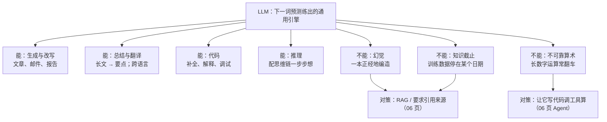

# 大语言模型 LLM 全景

> **一句话理解**：LLM 是一个读了几乎整个互联网、训练目标只有"预测下一个词"的模型——把这个简单目标用海量数据和算力做到极致后，竟"涌现"出了对话、推理、写代码等通用能力。

[⬆️ 返回总目录](../../../README.md) · [⬆️ 返回本篇](../README.md) · [⬅️ 返回本章目录](./README.md)

| 属性 | 说明 |
|------|------|
| 难度 | ⭐⭐⭐⭐（高阶） |
| 所属分支 | NLP与LLM |
| 前置知识 | [Transformer 架构细节与变体](./03-Transformer架构细节与变体.md) |

---

## 📌 这一节解决什么问题

GPT、Claude、Gemini、Llama、Qwen、DeepSeek……这些名字天天上新闻，但"大语言模型"四个字拆开到底是什么？为什么一个只会"接龙"的模型能写代码、做翻译、答问题？它明明读遍了互联网，为什么会一本正经地编造事实？这一页把 LLM 的概念地基一次性铺平：GPT 三个字母的含义、训练目标、Scaling Law、token、上下文窗口、能力与局限——为下一页"微调与对齐"做好铺垫。

## 🌱 通俗理解

**先拆 GPT 这三个字母：**

- **G = Generative（生成式）**：它会"写字"，一个个往外蹦词，而不是给输入贴标签；
- **P = Pretrained（预训练）**：先在海量无标注文本上"通识教育"打底，再做专项适配（预训练范式由[词向量](./01-词向量与embedding.md)开启）；
- **T = Transformer**：骨架就是前两页讲的 Decoder-only Transformer。

**训练目标 = 超级成语接龙。** 整个预训练只干一件事：给上文的词，猜下一个词。接了几万亿次之后，要接得准，模型被迫在参数里压缩语法、事实、常识、逻辑——"智能"没有被人显式教过，它是"把接龙接好"的副产品。

**模型眼里没有字，只有 token（词元）。** 分词器（Tokenizer）把文本切成模型词典里的碎片：常见词一个 token，生僻词拆成几块。**中文常吃亏**：同一句话，中文往往比英文消耗更多 token（一个汉字常被切成不止一个碎片），于是同样的内容占用更多上下文、花更多钱。

**上下文窗口（Context Window）= 工作记忆。** 模型一次能"看到"的 token 上限，就像考场上你桌上能同时摊开的资料量。窗口外的内容不是"忘了"，是**根本没进来**——所以"超长对话开头被无视"不是模型闹脾气，是物理隔绝。

**上下文学习（In-Context Learning, ICL）：给几个例子就会新任务。** 不改任何参数，只在输入里塞两三个示例，模型就照葫芦画瓢——像新员工看两份别人写的周报就上手了。

**思维链（Chain-of-Thought, CoT）：一步步想再答。** 在提示里加一句"让我们一步步思考"，或给一个带推理过程的示例，复杂问题（尤其数学、多步逻辑）的正确率显著提升——先打草稿再交卷。

## 📋 举个例子

模型内部每生成一个词，都是在算"下一个 token 的概率分布"。假设输入"今天天气真"，模型算出：

$$
P(\text{下一词}) = \{\text{好}: 0.60,\; \text{不错}: 0.20,\; \text{冷}: 0.10,\; \text{差}: 0.05,\; \text{糟}: 0.05,\; \dots\}
$$

> 👉 **人话**：模型不是"想好了再说话"，而是每一步都端出一张完整的下注表——"好"六成胜率，其余分剩下的。"生成"就是从这张表里选词、把选中的词接回输入、再算下一张表，循环往复。

怎么从这张表里选词？**采样温度（Temperature）**是总开关：

- **贪心（T→0）**：永远选概率最高的，输出固定、稳但呆；
- **T = 0.7 左右**：大概率选"好"，偶尔"不错"，多数任务的甜点区；
- **T = 1.5 以上**：冷门词大量上位，文风"放飞"，事实类任务开始胡说。

<details>
<summary>📊 展开完整算例：同一张概率表在三种温度下的样子</summary>

温度的做法：把每个概率开 $1/T$ 次方再归一化（等价于对 logits 除以 T 再 softmax）。对上表计算（保留两位小数）：

| 候选词 | 原概率 (T=1) | T=0.5（保守） | T=2.0（冒险） |
|---|---|---|---|
| 好 | 0.60 | 0.87 | 0.39 |
| 不错 | 0.20 | 0.10 | 0.23 |
| 冷 | 0.10 | 0.02 | 0.16 |
| 差 | 0.05 | 0.01 | 0.11 |
| 糟 | 0.05 | 0.01 | 0.11 |

验算 T=0.5 一列（平方后归一化）：$0.6^2{:}0.2^2{:}0.1^2{:}0.05^2{:}0.05^2 = 0.36{:}0.04{:}0.01{:}0.0025{:}0.0025$，总和 0.415，归一化即 $[0.87, 0.10, 0.02, 0.006, 0.006]$。

结论一句话：**温度压低 → 富者愈富，分布尖；温度调高 → 均贫富，分布平。** 这就是同一个模型"一会儿严谨一会儿发散"的全部秘密。

</details>

## 🧠 核心原理

### 整体流程：能力全景



### 逐步拆解

**训练目标：下一词预测的损失函数。** 对一段长为 $T$ 的文本，把每个位置的"接龙错误"加起来：

$$
\mathcal{L} = -\frac{1}{T}\sum_{t=1}^{T} \log P(x_{t+1} \mid x_1, \dots, x_t)
$$

> 👉 **人话**：接龙接对的概率越高、损失越小；训练就是在几万亿 token 上，把这一件事练到极致——没有第二项任务，没有任何"教它写代码"的专门模块。

**Scaling Law（缩放定律）：智能是"堆"出来的。** 经验拟合发现，损失随参数量 $N$、数据量 $D$、算力按幂律平滑下降：

$$
L(N, D) \approx \frac{A}{N^{0.34}} + \frac{B}{D^{0.28}} + C
$$

> 👉 **人话**：模型规模和数据量各能独立压低损失，且要"两手一起抓"（只堆参数不喂够数据是浪费）；这条可预测的曲线，是各家敢提前几年规划万卡集群的底气。

与之相伴的现象叫**涌现（Emergence）**：某些能力（多步推理、指令跟随）在规模小时几乎不存在，跨过某个量级后突然可用——量变引发质变，也是"为什么小模型不会聊天"的常见解释（注意：涌现的"突然性"在学界仍有讨论，量变到质变的直觉可以先建立）。

**采样温度。** 从 logits $z$ 到概率：

$$
P_T(i) = \frac{\exp(z_i / T)}{\sum_{j} \exp(z_j / T)}
$$

> 👉 **人话**：T 调低 → 只认高分词、保守稳定；T 调高 → 冷门词也有机会、天马行空。一个旋钮控制"胆子大小"。

**代表模型格局（2026 年视角，通用描述）：**

| 阵营 | 代表系列 | 一般特点 |
|------|---------|---------|
| 闭源 API | GPT、Claude、Gemini 系 | 能力第一梯队，按 token 计费，数据需出域 |
| 开放权重 | Llama、Qwen、DeepSeek 系 | 可自部署、可微调，隐私可控，需自备算力 |

**能与不能的边界：** 能——生成、总结、翻译、代码、（配合 CoT 的）推理；不能——幻觉（编造事实且语气自信）、知识截止（训练数据有截止日期，问"最新"必翻车）、不可靠算术（逐 token 生成不适合精确长运算，交给工具）。牢记这条边界，是后面判断"该用什么方案"的第一原则。

## 💻 动手试试

```python
# 依赖：pip install transformers torch
# 说明：首次运行会联网下载 GPT-2 级小模型（约 500MB），之后走本地缓存
from transformers import pipeline

# 用 GPT-2 级小模型演示“下一词接龙”机制本身（它没有经过对话对齐，只会续写）
generator = pipeline("text-generation", model="gpt2")

# 1) 贪心解码：永远挑概率最高的词，输出固定
print(generator("The weather today is really",
                max_new_tokens=8, do_sample=False)[0]["generated_text"])

# 2) 高温采样：T=1.5，冷门词上位，每次运行结果都可能不同
print(generator("The weather today is really",
                max_new_tokens=8, do_sample=True, temperature=1.5)[0]["generated_text"])
# 预期：贪心版每次输出相同（如 "...really nice and sunny..."）；
# 高温版明显更“放飞”。这个小模型没学过多少中文，所以示例用英文——
# 对话能力来自下一页的微调与对齐，预训练本身只有接龙。

# 3) 亲眼看 token：中文为什么吃亏
from transformers import AutoTokenizer
tok = AutoTokenizer.from_pretrained("gpt2")
print(tok.tokenize("人工智能 Artificial Intelligence"))
# 典型输出：英文词被切成少量碎片，而 4 个汉字往往被拆成 6~9 个 token
# （GPT-2 分词器按字节切中文）——同样内容，中文占用更多 token。
```

## 🔥 炼丹小灶

> 🔥 **炼丹小灶**：日常使用/开发时的采样起点——
> - 配方：事实问答与代码 T≈0~0.3；通用对话 T≈0.5~0.8、top_p≈0.9；创意写作 T≈0.9~1.2；`max_new_tokens` 按任务留余量；
> - 玄学：输出开始复读机化 → 降温 + 加重复惩罚；输出干瘪无聊 → 升温或加一句"给出三种不同思路"；
> - ⚠️ 以上是经验参考值，不是圣旨；换模型换任务请重新炼。

## 🖱️ 动手玩

> 🕹️ **延伸玩一玩**：[tiktokenizer](https://tiktokenizer.vercel.app)——粘贴一段中英文混排文本，实时数 token：亲眼看"中文更吃亏"到什么程度，再算算你的上下文窗口能装几本书。

## 🔗 在知识树中的位置

- **上游**：[Transformer 架构细节与变体](./03-Transformer架构细节与变体.md)——Decoder-only 骨架 + 下一词预测目标 = 预训练 LLM。
- **下游**：[微调与对齐](./05-微调与对齐.md)（把"接龙机器"变成"助手"）；[RAG 与 Agent](./06-RAG与Agent.md)（补上外挂知识与行动力）。
- **横向对比**：与[第 12 章多模态模型](../../5-前沿与融合/12-生成模型与多模态/04-多模态模型.md)的关系——多模态大模型 = 把"下一 token 预测"里的 token 从词扩展到图像块/音频帧，同一套哲学。

## ⚠️ 常见误区

- **误区一**："LLM 是连到数据库的查询系统。" → 它是概率生成器，不是检索系统：每个词都是从分布里采样出来的，"查到"只是碰巧像查到。要真查，得配 RAG（06 页）。
- **误区二**："上下文窗口 = 长期记忆。" → 它是工作记忆：这一轮对话的桌面。关掉对话、超出窗口，一切清零；它不因聊天而"学到"任何新东西。
- **误区三**："回答流畅 = 回答可信。" → 流畅是训练目标（下一词像样）的直接产物，与事实正确性是两回事——幻觉问题恰恰出在"太会接龙"。

## 📝 小结与自测

**要点回顾**

- GPT = Generative 生成式 + Pretrained 预训练 + Transformer 骨架；训练目标只有下一词预测；
- Scaling Law 说"参数 × 数据 × 算力"按幂律换能力，涌现是量变到质变的直观现象；
- 模型眼里只有 token：中文常被切成更多 token，更费上下文也更费钱；上下文窗口是工作记忆，不是硬盘；
- ICL 靠示例、CoT 靠"一步步想"都能零参数地提升表现；温度控制选词的胆量；
- 能：生成/总结/翻译/代码/推理；不能：幻觉/知识截止/精确长算术。

**自测一下**（点击展开答案）

<details>
<summary>问题 1：为什么"预测下一个词"这么简单的目标，能练出写代码、做推理的能力？</summary>

要把接龙接准，模型必须隐式掌握语法、事实关联与逻辑依赖（"9 的下一个数字大概率是 10"这类规律都在压缩范围里）。这些能力不是被显式教授的，而是"压缩海量文本以预测下一词"的副产品；规模越大（Scaling Law + 涌现），副产品越像通用智能。

</details>

<details>
<summary>问题 2：temperature 从 0.7 调到 1.5，同一个问题的输出会怎么变？为什么会这样？</summary>

输出更随机、更发散、更容易选到低概率词。数学上，T 进入 softmax 的指数里（logits 除以 T）：T 大 → 分布被"拉平"，高低分差距缩小；T 小 → 分布被"削尖"，赢家通吃。生成端的表现就是从"稳"到"放飞"。

</details>

## 📚 延伸阅读

- 论文：Language Models are Few-Shot Learners（GPT-3，2020，https://arxiv.org/abs/2005.14165）——ICL 的系统展示
- 论文：Training Compute-Optimal Large Language Models（Chinchilla，2022，https://arxiv.org/abs/2203.15556）——Scaling Law 的数据/参数配比修正
- 论文：Chain-of-Thought Prompting Elicits Reasoning in Large Language Models（2022，https://arxiv.org/abs/2201.11903）

---

[⬅️ 上一页：Transformer 架构细节与变体](./03-Transformer架构细节与变体.md) · [返回本章目录](./README.md) · [下一页：微调与对齐 ➡️](./05-微调与对齐.md)
