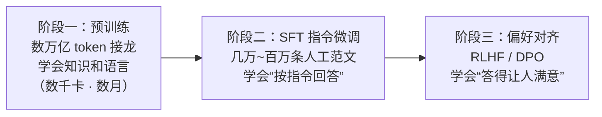
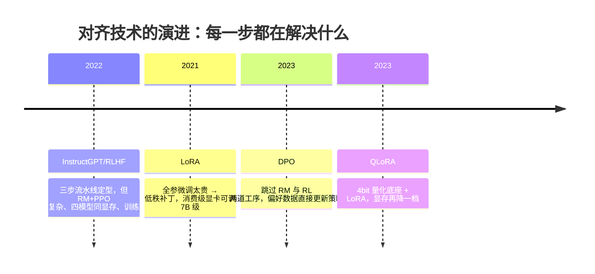
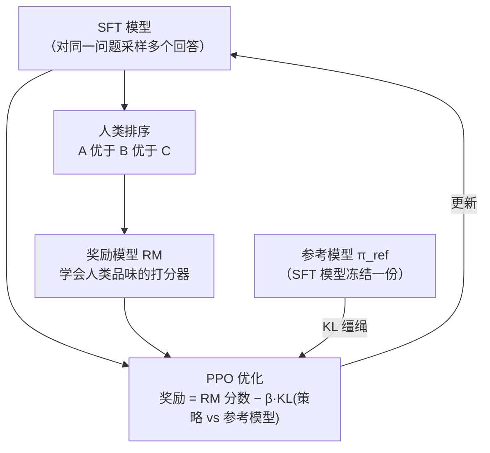

# 微调与对齐

> **一句话理解**：预训练模型只会"接话"不会"好好回答"；微调教它回答的格式，对齐教它答得让人满意——把一座移动图书馆，训练成一位随叫随到的助手。

[⬆️ 返回总目录](../../../README.md) · [⬆️ 返回本篇](../README.md) · [⬅️ 返回本章目录](./README.md)

| 属性 | 说明 |
|------|------|
| 难度 | ⭐⭐⭐⭐（高阶） |
| 所属分支 | NLP与LLM |
| 前置知识 | [大语言模型 LLM 全景](./04-大语言模型LLM全景.md) |

---

## 📌 这一节解决什么问题

你直接对一个预训练模型说"帮我写周报"，它大概率会**续写**一段"关于周报的说明文"——因为它的训练目标只有下一词预测，见到的输入像一篇帖子的开头，最合理的续写就是接着"介绍周报"写下去。知识都在，就是不会"以助手的方式调用"。

从"会接话"到"会好好回答"，行业演化出三段式流水线：**预训练 → 指令微调（SFT）→ 偏好对齐（RLHF 或 DPO）**。这一页讲清三阶段各自解决什么、代价是什么，两个核心算法（RLHF 与 DPO）的数学到底在优化什么、KL 惩罚项为什么生死攸关，以及最重要的工程问题：改 70 亿参数太贵，怎么办？答案是小补丁——LoRA，以及"秩选多大才够、什么时候低秩会失效"。

## 🌱 通俗理解

三阶段像培养一个新员工：

- **预训练（Pre-training）**：读遍整个图书馆，天文地理都懂——但只是个"知识渊博的续写机器"；
- **监督微调（Supervised Fine-Tuning, SFT，也叫指令微调）**：看几万到上百万条"问题 → 优质回答"的人工范文，照着学"别人提问时，应当直接回答"——像新员工研读前辈的范文合集；
- **基于人类反馈的强化学习（RLHF, Reinforcement Learning from Human Feedback）**：同一个问题的多个回答，人类排出好坏，训练一个"品味打分器"，再用强化学习让模型朝高分方向打磨——不再教"怎么答"，只教"哪个更好"。

而 **LoRA（Low-Rank Adaptation，低秩适配）** 解决的是成本问题：原模型几十上百亿参数像一栋装修好的大楼，微调不需要拆楼重建，只在几个房间里**贴可撕墙纸**——冻结原参数，另学一块很小的"增量补丁"。训完每个任务只保存墙纸（几十 MB），随时可撕可换。

SFT 阶段还有一条重要的经验（来自 LIMA 论文的"表面对齐假说"，一句话级）：**对齐主要教的是"格式与风格"，知识几乎全在预训练里**——所以一千条精心筛选的高质量范文，常常胜过几十万条平庸数据。**质量 > 数量**是 SFT 数据的第一军规。

## 📋 举个例子

同一个问题"**帮我写周报**"，三个阶段的模型行为对比（示例文本为自拟，展示行为差异）：

**裸模型（只有预训练，直接提问）**——它在续写，不在回答：

> 帮我写周报。周报是职场中常见的书面沟通形式，一般包括本周工作总结、下周工作计划两个部分。一份好的周报应当突出结果、量化数据……（开始写"关于周报的百科词条"）

**SFT 之后**——学会了"回答"这个动作，但模板化、爱铺陈：

> 好的，以下是一份周报模板：
> 【本周完成】1. 完成 XX 需求的开发与联调；2. 参加 XX 评审会议；3. ……
> 【下周计划】1. ……；2. ……；3. ……
> 【风险与求助】……
> （有模有样，但每次都是这套三段式，不管你需不需要）

**RLHF 之后**——人类偏好排序奖励了"简洁、贴需求、帮到底"，废话消失：

> 给你一版精简周报结构：本周 3 条以内（写结果不写流水账）、下周 3 条以内（标注优先级）、风险 1 条。
> 把你本周做的事发我，我直接帮你填好。

<details>
<summary>📊 展开算例：LoRA 秩 r=8 能省多少参数（量级估算）</summary>

以 7B 级模型（$d=4096$、32 层）为例，只给注意力的 Q/K/V/O 四个投影矩阵挂 LoRA、秩 $r=8$：

- 每个矩阵：原参数 $d \times d = 16.78\text{M}$；LoRA 只训 $A \in \mathbb{R}^{8 \times d}$ 与 $B \in \mathbb{R}^{d \times 8}$，共 $2 \times 8 \times 4096 = 65{,}536$ 个；
- 全部 32 层 × 4 个矩阵：LoRA 可训练参数 $= 32 \times 4 \times 65{,}536 \approx 8.4\text{M}$；
- 占总参数比例：$8.4\text{M} / 7000\text{M} \approx 0.12\%$。

代价收益：优化器状态只需为这 0.12% 参数保存（全参微调时 Adam 状态会让显存再翻数倍）；每个任务的成果是几十 MB 的补丁文件，而非整份十几 GB 的权重。这就是消费级显卡也能微调 7B 级模型的算术根基（数字为量级估算）。

</details>

## 🧠 核心原理

### 整体流程：三阶段流水线



三阶段流水线本身也在演化，每个后来者都在解决前者的痛点：



### RLHF：目标函数与 KL 缰绳的完整推导

**RLHF 三步走**（强化学习基础见[第 10 章：强化学习](../10-强化学习/README.md)，PPO 细节见[深度强化学习](../10-强化学习/02-深度强化学习.md)）：



1. **采样**：让 SFT 模型对同一问题生成多个回答；
2. **训练奖励模型（Reward Model, RM）**：人类给回答排序，训练一个"学会人类品味"的打分器；
3. **PPO 优化**：以 RM 分数为奖励信号更新模型，同时用 KL 惩罚拴住它别跑偏（在线训练时策略、参考、奖励、价值四组模型要同时在显存里——这正是它贵与不稳的结构性原因）：

$$
\max_{\theta}\; \mathbb{E}_{(x,y)\sim\pi_\theta}\big[r(x, y)\big] \;-\; \beta\, \mathrm{KL}\big(\pi_\theta \,\|\, \pi_{\mathrm{ref}}\big)
$$

> 👉 **人话**：往"人类打分高"的方向优化，但和原模型（参考模型）的差距被 KL 这根缰绳拽着——分数要挣，人格不能崩，否则模型会学会讨好打分器的怪癖（reward hacking）。

这个 KL 项不是"锦上添花的正则"，而是**没有它整个算法会当场翻车**的原因：

- **奖励模型是个漏洞百出的代理**。它只是从有限的人工排序样本里学出来的打分器，学的是"人类偏好的影子"。不带 KL 地最大化它，优化器会精确找到影子与真身的缝隙：把回答变得无限长（人类偏爱详尽）、堆砌讨好语气（人类偏爱礼貌）、复读高分成句的句式——分数一路走高，真实质量一路走低。这就是 **reward hacking（奖励钻空）**：代理指标被优化到失真。历史上真实出现过的钻空姿势：加长答案刷"详尽分"、开头先夸问题刷"礼貌分"、无条件附和用户观点刷"满意分"、堆砌免责声明刷"安全分"——每一种都是"人类排序里的统计倾向被放大成病态策略"；
- **语言能力是参考模型给的**。$\pi_{\mathrm{ref}}$（通常是 SFT 模型）承载着预训练学来的流畅与知识。KL 惩罚把新策略按概率比 $\pi_\theta/\pi_{\mathrm{ref}}$ "指数级扣分"，任何大幅偏离参考分布的行为都要付出奖励代价——模型只能在"还像一句人话"的约束内追求高分，语言能力因此不丢。

<details>
<summary>🧮 展开完整推导：RLHF 目标的最优解长什么样（这也是 DPO 的伏笔）</summary>

**问题**：$\max_{\pi} \; \mathbb{E}_{y \sim \pi(\cdot|x)}[r(x,y)] - \beta\, \mathrm{KL}(\pi(\cdot|x) \| \pi_{\mathrm{ref}}(\cdot|x))$，对每个 $x$ 求 $y$ 上的最优分布。

**第一步：把目标写成显式积分**（对固定 $x$，略去常数项）：

$$
J(\pi) = \sum_y \pi(y|x)\Big[ r(x,y) - \beta \log\frac{\pi(y|x)}{\pi_{\mathrm{ref}}(y|x)} \Big]
$$

**第二步：变分求解**（对每个 $y$ 的概率做拉格朗日/配方法，或引用 Gibbs 不等式），最优解为：

$$
\pi^*(y \mid x) = \frac{1}{Z(x)}\, \pi_{\mathrm{ref}}(y \mid x)\, \exp\!\Big(\frac{r(x,y)}{\beta}\Big),
\qquad Z(x) = \sum_y \pi_{\mathrm{ref}}(y|x)\, e^{r(x,y)/\beta}
$$

**怎么读这个解**：最优策略 = 参考模型按奖励的指数重新加权——奖励高的回答概率被指数放大，但底数仍是 $\pi_{\mathrm{ref}}$（参考模型给 0 概率的回答，永远翻不了身：语言能力的下界被保住）；$\beta$ 越小越敢偏离，$\beta \to \infty$ 时退回参考模型。

**第三步（关键伏笔）：把奖励"反解"出来**。对上式两边取对数并移项：

$$
r(x, y) = \beta \log\frac{\pi^*(y|x)}{\pi_{\mathrm{ref}}(y|x)} + \beta \log Z(x)
$$

这句话反过来读是：**只要给我一个策略，我就能算出它"等价于"什么奖励函数**——RLHF 转了一圈，最优策略与奖励函数一一对应。DPO 的全部推导就从此开始（见下一节）。

</details>

### DPO：跳过奖励模型的偏好学习

RLHF 的工程痛点：训 RM 要排序数据、跑 PPO 要四组模型在线协同（策略、参考、奖励、价值）——显存翻倍、调参娇气、训练不稳。**DPO（Direct Preference Optimization，直接偏好优化）**的洞察是：上一步推导出的"策略 ↔ 奖励"一一对应意味着**奖励模型可以不训**——偏好数据能直接约束策略本身。

$$
\mathcal{L}_{\mathrm{DPO}} = -\log \sigma\!\left(\beta \log\frac{\pi_\theta(y_w \mid x)}{\pi_{\mathrm{ref}}(y_w \mid x)} - \beta \log\frac{\pi_\theta(y_l \mid x)}{\pi_{\mathrm{ref}}(y_l \mid x)}\right)
$$

> 👉 **人话**：让"好答案相对参考模型的提升幅度"比"坏答案的提升幅度"越大越好——同样是学偏好，省掉"先训打分器、再跑强化学习"两道工序，工程上简单稳定，近两年被大量开源模型采用。

<details>
<summary>🧮 展开推导：三步从 RLHF 目标推出 DPO 损失（关键在 Z 的抵消）</summary>

**输入**：人类偏好数据的生成模型是 **Bradley-Terry 模型**——人类比较两个回答 $y_w$（好）与 $y_l$（差）时，选前者的概率只依赖奖励差：

$$
P(y_w \succ y_l \mid x) = \sigma\big(r(x, y_w) - r(x, y_l)\big)
$$

**第一步：代入"反解奖励"**。把 RLHF 最优解反解出的 $r(x,y) = \beta \log\frac{\pi^*(y|x)}{\pi_{\mathrm{ref}}(y|x)} + \beta\log Z(x)$ 代入上式：

$$
P(y_w \succ y_l \mid x) = \sigma\Big(\beta \log\frac{\pi^*(y_w|x)}{\pi_{\mathrm{ref}}(y_w|x)} - \beta \log\frac{\pi^*(y_l|x)}{\pi_{\mathrm{ref}}(y_l|x)} + \underbrace{\beta\log Z(x) - \beta \log Z(x)}_{\text{同一个 } x,\ \text{相消}}\Big)
$$

**第二步：看到奇迹**。配分函数 $Z(x)$ 只依赖 $x$，在"同一个问题的两个回答相减"时**精确抵消**——原本 RLHF 里无法处理的归一化常数（要对全部 $y$ 求和，正是需要单独训 RM 再绕路的原因）消失了。

**第三步：得到闭式解并参数化**。偏好概率现在完全由策略比值表达；把待优化的最优策略 $\pi^*$ 换成参数化的 $\pi_\theta$，最大化偏好数据的对数似然，即得 DPO 损失（正文公式）。

**一句话总结推导链**：RLHF 最优解反解出奖励 → 偏好模型里两项 $Z(x)$ 相消 → 偏好概率有了"只含策略"的闭式解 → 直接对策略做极大似然。**DPO 不是绕开了 RLHF 的数学，而是把 RLHF 目标解析地解到了底。** 梯度直觉：$\nabla \mathcal{L} \propto$ 同时压低坏答案概率、抬高好答案概率（相对参考模型），且答案越"被模型意外地偏爱"，纠正力度越大。

**代价与边界**：DPO 假设偏好数据近似满足 Bradley-Terry、且离线（不在训练中采样新回答）；策略大幅偏离参考分布时，离线偏好的覆盖不足可能被放大（实践里常配合小 $\beta$ 与迭代式偏好数据更新）。

两条路线的工程账对照（选型看这张表）：

| 维度 | RLHF（RM + PPO） | DPO（直接偏好优化） |
|------|-----------------|---------------------|
| 需要训练的模型 | 奖励模型 + 策略（+ 价值模型，共四组同显存） | 只有策略一组 |
| 数据需求 | 排序数据（训 RM）+ 在线采样 | 成对偏好数据（好/坏答案），离线 |
| 训练稳定性 | 娇气：lr、裁剪、奖励尺度都敏感 | 相当于普通分类式损失，稳定好调 |
| 优化上限 | 在线采样能探索参考分布外的新回答 | 受限于离线数据里出现过的回答 |
| 典型用法 | 大厂对齐主线的传统选项、探索性强 | 开源社区与多数业务对齐的默认起点 |

一句话选型：**数据是成对偏好、追求稳与省 → DPO；需要在线探索（模型自己生成新答案再被评价）→ RLHF 路线**。两者不互斥，迭代式 DPO（多轮采样 + 偏好标注）正在模糊边界。

</details>

### LoRA：为什么"低秩补丁"够用

LoRA 冻结原权重 $W_0$，只学低秩增量：

$$
W' = W_0 + \Delta W = W_0 + BA, \qquad A \in \mathbb{R}^{r \times d},\; B \in \mathbb{R}^{d \times r}
$$

> 👉 **人话**：微调带来的改动本身是"低秩"的——不必动 $d \times d$ 的大矩阵，用两个瘦长矩阵 $B \cdot A$（秩 $r \ll d$）就能表达这层改动。只学增量补丁，楼还是那栋楼，换的只是墙纸。

**为什么低秩就够？两个理论支点（一句话级）**：

- **内在维度（Intrinsic Dimension）**：有研究发现，预训练大模型微调时，损失面在极低维的子空间里就能下降到接近全参的水平——即"把模型调成新任务"所需的自由度天然很小，几百维就够，不需要动用全部 $d \times d$；
- **权重更新低秩假说**：微调的 $\Delta W$ 相对原权重的谱能高度集中（奇异值衰减快），用秩 $r$=8~64 的近似已经抓住主要方向。直觉版：预训练权重是"百科全书"，微调只是"在页边写批注"——批注的信息量远小于全书，天然低秩。

**秩 r 与 alpha 怎么选**：$\alpha$ 是缩放系数，实际生效的增量是 $\frac{\alpha}{r} BA$；经验起点 $r=8/16$、$\alpha = 2r$、目标模块先挂注意力投影（q/v），不够再加 FFN。**失效场景**：任务与底座差异极大时（教一个英文代码底座说小语种、学全新领域的深层规律），批注写满页边也不够——低秩容量不足，表现为训不动/严重欠拟合，这时要加秩（64+）、加目标模块（全线性层），甚至承认 LoRA 不合适、上全参或换底座。一句话：**低秩假设的前提是"改动离底座不远"；距离越远，需要的秩越高。**

**QLoRA 一句话**：把冻结的底座量化到 4 bit 再挂 LoRA，进一步把微调 7B 级模型的显存压进消费级显卡——经验上质量损失很小，是"一张卡微调一个模型"的标配组合。

### 灾难性遗忘：症状与缓解

微调专得太狠，通用能力会被冲掉——这不是玄学，是梯度只见过窄数据的必然（术语：灾难性遗忘，Catastrophic Forgetting）。一个典型现场：医疗问答数据微调三小时后，模型回答"写一首关于秋天的诗"也开始输出"建议进一步完善相关检查，明确诊断"——领域话术渗进了所有场景。

| 环节 | 内容 |
|------|------|
| 症状 | 通用 benchmark 掉分；对话风格漂移（变得死板/油滑）；领域外的常识问题开始答非所问；输出格式单一化 |
| 诊断 | 微调前后跑同一份**通用 held-out 评估集**对比（不是只跑领域集）；抽查闲聊、写作、推理三类样本 |
| 缓解 | ① 数据混合：领域数据里掺 5%~30% 通用数据（比例是经验起点）；② 早点停（epoch 1~3，多了必过拟合）；③ 低学习率；④ 用 LoRA 本身就是刹车——只允许低秩扰动，遗忘天然受限；⑤ KL/正则把参数拴在底座附近 |

**全参 vs LoRA vs 只提示（提示工程/ICL）决策表：**

| 决策维度 | 只提示（含 ICL/Few-shot） | LoRA/QLoRA | 全参微调 |
|---------|------------------------|-----------|---------|
| 成本 | 几乎为零（只花推理） | 单卡~数卡，补丁 MB 级 | 集群级，权重 GB 级 |
| 改什么 | 行为引导、任务说明 | 风格/格式/领域话术、小规模行为重塑 | 深层能力与大量知识改造 |
| 知识注入 | ✗（靠 RAG） | 弱（少量、易过拟合） | 可以但性价比通常不如 RAG |
| 见效速度 | 分钟级 | 天级 | 周级 |
| 先后顺序 | **永远第一步** | 第二步（提示榨干了再上） | 资源充足且前两步证明不够时 |

经验主线：**提示工程 → RAG → LoRA → 全参**，能左边解决的绝不往右边走。

**全参微调 vs LoRA 对比：**

| 维度 | 全参微调 | LoRA |
|------|---------|------|
| 可训练参数 | 100% | 约 0.1%~1%（经验量级） |
| 显存需求 | 高：权重 + 梯度 + 优化器状态全套 | 低：只为小补丁存优化器状态 |
| 效果上限 | 最高 | 多数任务与全参差距很小；领域差异极大时可能不足（见上文失效场景） |
| 任务切换 | 每任务一份完整权重（GB 级） | 每任务一个小补丁（MB 级），可热插拔 |
| 遗忘风险 | 高（要靠数据混合等手段主动防） | 低（低秩扰动天然受限） |
| 适合场景 | 资源充足的深度领域改造 | 绝大多数业务微调场景 |

**对齐（Alignment）的目标常概括为三件事：有用（Helpful）、诚实（Honest）、无害（Harmless）**——三者之间本身存在张力（太怕错就变得支支吾吾），对齐是在其间找平衡，而不是把模型教成老好人。

### SFT 数据：质量、多样性、格式的三条经验

LIMA 的"表面对齐假说"展开成数据工程就是三条（均为行业经验，非圣旨）：

| 维度 | 经验做法 | 反面案例 |
|------|---------|---------|
| 质量 | 千条级高质量范文 > 十万条平庸模板；每条最好人工过目 | 爬来的问答对直接开训——噪声风格全被学走 |
| 多样性 | 任务类型、问法风格、长度档位都要覆盖（多样本 > 同任务多样本堆量） | 5000 条"写周报"模板——模型学会的是"全世界只有周报" |
| 格式一致性 | 提示模板与部署时用的模板逐字一致（包括系统提示词） | 训练一套模板、上线另一套模板——模型认不出"这是我的任务" |

诊断"数据没配好"的信号：训练 loss 正常下降但上线效果差（多半是格式不一致）；回答千篇一律（多样性不足）；新问法就翻车（问法风格覆盖不足）。

量级手感（行业常见量级，经验参考）：SFT 范文从一千条（LIMA 式精品路线）到几十万条（覆盖广路线）都有成功案例，分歧点在"质量能否守住"；偏好对齐的成对偏好数据常见几万到几十万对；LoRA 微调业务任务常见几百到几千条即可启动。**先小后大**：500 条高质量数据先跑通全链路，再决定加量还是提质。

## 💻 动手试试

```python
# 依赖：pip install peft transformers torch
# 说明：首次运行联网下载 GPT-2 级小模型（约 500MB，之后走本地缓存）；
#       配置骨架在 CPU 上即可跑通，真正训练请自备数据集与 GPU
#       （训练循环与 NLP 常规微调一致，这里聚焦 LoRA 配置）
from peft import LoraConfig, get_peft_model
from transformers import AutoModelForCausalLM

def build_and_report(r, alpha=32):
    # 每次重新加载底座：get_peft_model 会原地注入适配器，
    # 同一个模型对象反复包装会叠加适配器，实验之间要互不污染
    model = AutoModelForCausalLM.from_pretrained("gpt2")   # 演示用小模型，可换成任意 CausalLM
    config = LoraConfig(
        r=r,                              # 秩：补丁的“容量”，重点观察对象
        lora_alpha=alpha,                 # 缩放系数：实际增量 = alpha/r × BA
        lora_dropout=0.05,
        target_modules=["c_attn"],        # GPT-2 的注意力投影层；换模型时改对应模块名
        task_type="CAUSAL_LM",
    )
    peft_model = get_peft_model(model, config)     # 挂上补丁（原参数自动冻结）
    trainable, total = 0, 0
    for name, p in peft_model.named_parameters():
        total += p.numel()
        if p.requires_grad:                # 中间变量：哪些参数在“开着门”等训练
            trainable += p.numel()
    print(f"r={r:>3}, alpha={alpha}: 可训练 {trainable:,} / {total:,}"
          f" = {trainable/total:.4%}")

build_and_report(r=8, alpha=16)    # 经验起点
build_and_report(r=16, alpha=32)   # 加秩：容量翻倍，参数线性上涨
build_and_report(r=64, alpha=128)  # 大领域差异时的“重补丁”量级

# 预期输出形如：
# r=  8, alpha=16 : 可训练 294,912 / 124,734,720 = 0.24%
# r= 16, alpha=32 : 可训练 589,824 / 125,029,632 = 0.47%
# r= 64, alpha=128: 可训练 2,359,296 / 126,799,104 = 1.86%
# —— 分母 = 原模型 + LoRA 补丁；秩每翻一倍，可训练参数线性翻倍，
#    但相对全模型仍是个零头。
# 🧪 改什么参数、看什么变化：
# 1) r=8 与 r=64 各自微调同一任务，对比验证集表现：小差异任务两者接近
#    （低秩够用的证据）；领域差异大的任务 r=64 才能追上（低秩失效的证据）；
# 2) alpha 固定不变、只改 r：注意 alpha/r 变小，同样 BA 的实际影响被压低——
#    这就是“加秩的同时要同步调 alpha”的原因；
# 3) target_modules 去掉 c_attn 再看可训练参数：不挂任何模块时为 0，
#    模型完全冻结——验证“LoRA 训的只有补丁”；
# 4) lora_dropout 从 0.05 调到 0.3：小数据集上过拟合变慢，
#    但过大也会欠拟合——正则项的经典两难。
```

## 🔥 炼丹小灶

> 🔥 **炼丹小灶**：LoRA 微调的常用起点——
> - 配方：秩 r=8 或 16 起步、lora_alpha=2r、lr=1e-4 量级（全参微调则用 1e-5 量级）、epoch 1~3（多了必过拟合）、领域数据里混 5%~30% 通用数据防遗忘；
> - 玄学：不收敛先怀疑数据格式（提示模板没对齐）再怀疑超参；学不动把 alpha 调到 2r~4r、秩翻倍；上线前必跑通用评估集对照，掉分超预期就回退减 epoch；偏好数据成对出题时控制单一变量（长度/事实性/礼貌分开比较），别让标注者打架；
> - ⚠️ 以上是经验参考值，不是圣旨；换底座换数据请重新炼。

## 🖱️ 动手玩

> 🕹️ **延伸玩一玩**：你每天在用的任何聊天产品，都是"SFT + 偏好对齐"的成品——试着让它"复现裸模型行为"（比如在开头放一段未完成的说明文），观察它是耐心接话还是会"纠正"成回答模式，体会对齐的痕迹。
> 再试一个偏好对齐实验：故意问一个开放问题，看它会不会先给结论再展开、会不会主动列出"另一种可能"——这些"好答案的形状"正是偏好数据刻出来的。
> 🕹️ **延伸玩一玩**：[Transformer Explainer](https://poloclub.github.io/transformer-explainer/)——对照看一个未对齐的 GPT-2 级裸模型的"续写感"，与本页开头"裸模型答周报"的行为互相印证。

## 🔗 在知识树中的位置

- **上游**：[大语言模型 LLM 全景](./04-大语言模型LLM全景.md)——先有预训练的"接龙机器"，本页负责把它变成助手。
- **交叉**：[第 10 章：强化学习](../10-强化学习/README.md)（[深度强化学习](../10-强化学习/02-深度强化学习.md)）——RLHF 的"R"和"PPO"全部来自这里，本章是强化学习在 2022 年之后最大的应用出口之一；KL 散度的统计直觉可回[第 2 章数学基础](../../1-起步准备/02-数学基础/README.md)补课。
- **下游**：[RAG 与 Agent](./06-RAG与Agent.md)——对齐解决"怎么答"，RAG 解决"拿什么答"，两者经常叠加；[99 生产实战](./99-生产实战.md)会回答"什么时候才真的需要微调"。

## ⚠️ 常见误区

- **误区一**："微调能把新知识灌进模型。" → 往模型权重里"塞事实"效率低且易过拟合、易诱发幻觉；事实类知识优先用 RAG 外挂，微调更适合改风格、格式与固定的行为模式。
- **误区二**："RLHF 就是教模型说好听的话。" → 对齐目标是"有用 + 诚实 + 无害"的平衡；一味讨好会被 reward hacking 反噬（满嘴奉承却答非所问），这正是 KL 惩罚与偏好数据多样性要防的。
- **误区三**："LoRA 效果一定显著差于全参。" → 在多数数据量适中的业务任务上两者差距很小；LoRA 省下的显存、存储和切换成本，往往比那一点理论上限更值钱。反过来，"LoRA 万能"也不对——与底座差异极大的任务，低秩容量不够，要么加秩要么换方案。
- **误区四**："DPO 是 RLHF 的简化版，理论更弱。" → DPO 是把 RLHF 目标解析求解到底的等价改写（核心推导是 $Z(x)$ 在偏好差中相消），不是近似简化；它的风险在离线数据的覆盖假设，不在数学硬度。
- **误区五**："偏好数据谁标都行。" → 标注者之间对"好"的判断不一致（一个要简洁、一个要详尽），噪声偏好会被 DPO 直接写进策略。开工前先测标注一致性（双人标一批算一致率），分歧大的维度拆成多条单维度问题再标。

## 📝 小结与自测

**要点回顾**

- 三阶段：预训练（读遍互联网学会接话）→ SFT（看范文学会"答"；LIMA 观点：质量 > 数量，对齐主要教格式与风格）→ 偏好对齐（RLHF/DPO 学会"答得好"）；
- RLHF 三步：采样 → 训练奖励模型（人类品味打分器）→ PPO 优化 + KL 缰绳；KL 必要性两支柱：防 reward hacking（RM 是漏洞百出的代理）+ 保语言能力（参考模型定下限）；最优解 $\pi^* \propto \pi_{\mathrm{ref}} \exp(r/\beta)$；
- DPO：反解奖励 + Bradley-Terry + $Z(x)$ 相消 → 偏好概率只含策略的闭式解，直接极大似然，跳过 RM 与 RL 两道工序；
- LoRA：低秩有效的支点是内在维度与 ΔW 低秩假说；r=8/16、α=2r 起步；失效场景 = 任务离底座太远（加秩/加模块/换方案）；QLoRA 再叠 4bit 量化省显存；
- 灾难性遗忘：症状（通用掉分、风格漂移）、诊断（通用 held-out 集对照）、缓解（混通用数据/早停/低 lr/LoRA 本身）；
- 决策主线：提示 → RAG → LoRA → 全参，能左不右；对齐 = 有用/诚实/无害的平衡；
- SFT 数据三条军规：质量 > 数量（LIMA）、多样性覆盖（任务/问法/长度）、训练与上线模板逐字一致；灾难性遗忘靠"通用 held-out 对照 + 混数据 + 早停"防；
- 工程选型：成对偏好、求稳求省 → DPO；需要在线探索 → RLHF 路线；两者不互斥（迭代式 DPO 正在模糊边界）；
- LoRA 失效信号：任务离底座太远时低秩容量不足（欠拟合/训不动），加秩、加目标模块或承认 LoRA 不合适。

**自测一下**（点击展开答案）

<details>
<summary>问题 1：SFT 和 RLHF 各自解决什么问题？为什么缺一不可？</summary>

SFT 教会模型"以回答的形式响应指令"（行为格式），但它只能模仿范文，分不出"两都对时哪个更好"；RLHF 用人类偏好排序打磨"回答质量"（更简洁、更贴需求、更诚实）。只做 SFT 得到模板机器，只做 RLHF（无 SFT 起点）则连"好好回答"的基本格式都还不稳。

</details>

<details>
<summary>问题 2：KL 惩罚项去掉会发生什么？β 调得极小又会怎样？</summary>

去掉 KL：优化器全力钻奖励模型的空子（加长、讨好、复读高分成句），reward hacking 爆发，语言能力崩坏——分数涨、质量跌。β 极小：缰绳形同虚设，等价于近似去掉 KL。β 极大：动弹不得，策略退回参考模型，什么都学不到。β 是"敢偏离多少"的总阀门。

</details>

<details>
<summary>问题 3：DPO 的损失函数里为什么不需要配分函数 Z(x)？</summary>

偏好比较只涉及同一个问题的两个回答：把"反解奖励"公式代入 Bradley-Terry 后，两边的 $\beta \log Z(x)$ 是同一个 $x$ 的同一项，相减精确抵消。Z 的消失使偏好概率有了只含策略比值的闭式解，因此无需先训奖励模型。

</details>

<details>
<summary>问题 4：LoRA 微调后模型连常识问答都变差了，先查什么？怎么救？</summary>

先诊断：跑通用 held-out 评估集与微调前对照，确认遗忘幅度与类型。常见原因：epoch 太多/数据太窄/lr 太大。救法：混入 5%~30% 通用数据重训、减少 epoch、降 lr；或缩小改动面（只挂 q/v、降秩）。LoRA 场景下也可直接回退补丁（这正是补丁可撕的价值）。

</details>

<details>
<summary>问题 5："让模型回答时统一使用公司话术、固定 JSON 输出"——选提示工程、RAG 还是 LoRA？</summary>

先试提示工程（把话术样例和 JSON schema 直接写进系统提示，成本最低）；格式仍不稳再上 LoRA（风格与格式正是低秩改动的甜点区，几百到几千条样本即可）。RAG 不合适——它解决"知识从哪来"，不解决"答成什么样"。无论如何不要为此全参微调。

</details>

## 📚 延伸阅读

- 论文：Training language models to follow instructions with human feedback（InstructGPT，2022，https://arxiv.org/abs/2203.02155）——三阶段流水线的奠基之作
- 论文：LoRA: Low-Rank Adaptation of Large Language Models（2021，https://arxiv.org/abs/2106.09685）
- 论文：Direct Preference Optimization: Your Language Model is Secretly a Reward Model（DPO，2023，https://arxiv.org/abs/2305.18290）
- 论文：Intrinsic Dimensionality Explains the Effectiveness of Language Model Fine-Tuning（2020，https://arxiv.org/abs/2012.13255）——LoRA 的理论伏笔之一
- 论文：LIMA: Less Is More for Alignment（2023，https://arxiv.org/abs/2305.11206）——"表面对齐假说"与 SFT 质量 > 数量
- 论文：Constitutional AI: Harmlessness from AI Feedback（2022，https://arxiv.org/abs/2212.08073）——用 AI 反馈替代部分人类标注的对齐路线（RLAIF）

---

[⬅️ 上一页：大语言模型 LLM 全景](./04-大语言模型LLM全景.md) · [返回本章目录](./README.md) · [下一页：RAG 与 Agent ➡️](./06-RAG与Agent.md)
