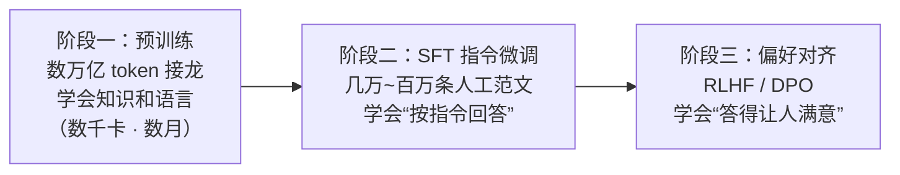

# 微调与对齐

> **一句话理解**：预训练模型只会"接话"不会"好好回答"；微调教它回答的格式，对齐教它答得让人满意——把一座移动图书馆，训练成一位随叫随到的助手。

[⬆️ 返回总目录](../../../README.md) · [⬆️ 返回本篇](../README.md) · [⬅️ 返回本章目录](./README.md)

| 属性 | 说明 |
|------|------|
| 难度 | ⭐⭐⭐⭐（高阶） |
| 所属分支 | NLP与LLM |
| 前置知识 | [大语言模型 LLM 全景](./04-大语言模型LLM全景.md) |

---

## 📌 这一节解决什么问题

你直接对一个预训练模型说"帮我写周报"，它大概率会**续写**一段"关于周报的说明文"——因为它的训练目标只有下一词预测，见到的输入像一篇帖子的开头，最合理的续写就是接着"介绍周报"写下去。知识都在，就是不会"以助手的方式调用"。

从"会接话"到"会好好回答"，行业演化出三段式流水线：**预训练 → 指令微调（SFT）→ 偏好对齐（RLHF 或 DPO）**。这一页讲清三阶段各自解决什么、代价是什么，以及最重要的工程问题：改 70 亿参数太贵，怎么办？答案是小补丁——LoRA。

## 🌱 通俗理解

三阶段像培养一个新员工：

- **预训练（Pre-training）**：读遍整个图书馆，天文地理都懂——但只是个"知识渊博的续写机器"；
- **监督微调（Supervised Fine-Tuning, SFT，也叫指令微调）**：看几万到上百万条"问题 → 优质回答"的人工范文，照着学"别人提问时，应当直接回答"——像新员工研读前辈的范文合集；
- **基于人类反馈的强化学习（RLHF, Reinforcement Learning from Human Feedback）**：同一个问题的多个回答，人类排出好坏，训练一个"品味打分器"，再用强化学习让模型朝高分方向打磨——不再教"怎么答"，只教"哪个更好"。

而 **LoRA（Low-Rank Adaptation，低秩适配）** 解决的是成本问题：原模型几十上百亿参数像一栋装修好的大楼，微调不需要拆楼重建，只在几个房间里**贴可撕墙纸**——冻结原参数，另学一块很小的"增量补丁"。训完每个任务只保存墙纸（几十 MB），随时可撕可换。

## 📋 举个例子

同一个问题"**帮我写周报**"，三个阶段的模型行为对比（示例文本为自拟，展示行为差异）：

**裸模型（只有预训练，直接提问）**——它在续写，不在回答：

> 帮我写周报。周报是职场中常见的书面沟通形式，一般包括本周工作总结、下周工作计划两个部分。一份好的周报应当突出结果、量化数据……（开始写"关于周报的百科词条"）

**SFT 之后**——学会了"回答"这个动作，但模板化、爱铺陈：

> 好的，以下是一份周报模板：
> 【本周完成】1. 完成 XX 需求的开发与联调；2. 参加 XX 评审会议；3. ……
> 【下周计划】1. ……；2. ……；3. ……
> 【风险与求助】……
> （有模有样，但每次都是这套三段式，不管你需不需要）

**RLHF 之后**——人类偏好排序奖励了"简洁、贴需求、帮到底"，废话消失：

> 给你一版精简周报结构：本周 3 条以内（写结果不写流水账）、下周 3 条以内（标注优先级）、风险 1 条。
> 把你本周做的事发我，我直接帮你填好。

<details>
<summary>📊 展开算例：LoRA 秩 r=8 能省多少参数（量级估算）</summary>

以 7B 级模型（$d=4096$、32 层）为例，只给注意力的 Q/K/V/O 四个投影矩阵挂 LoRA、秩 $r=8$：

- 每个矩阵：原参数 $d \times d = 16.78\text{M}$；LoRA 只训 $A \in \mathbb{R}^{8 \times d}$ 与 $B \in \mathbb{R}^{d \times 8}$，共 $2 \times 8 \times 4096 = 65{,}536$ 个；
- 全部 32 层 × 4 个矩阵：LoRA 可训练参数 $= 32 \times 4 \times 65{,}536 \approx 8.4\text{M}$；
- 占总参数比例：$8.4\text{M} / 7000\text{M} \approx 0.12\%$。

代价收益：优化器状态只需为这 0.12% 参数保存（全参微调时 Adam 状态会让显存再翻数倍）；每个任务的成果是几十 MB 的补丁文件，而非整份十几 GB 的权重。这就是消费级显卡也能微调 7B 级模型的算术根基（数字为量级估算）。

</details>

## 🧠 核心原理

### 整体流程：三阶段流水线



### 逐步拆解

**RLHF 三步走**（强化学习基础见[第 10 章：强化学习](../10-强化学习/README.md)，PPO 细节见[深度强化学习](../10-强化学习/02-深度强化学习.md)）：

1. **采样**：让 SFT 模型对同一问题生成多个回答；
2. **训练奖励模型（Reward Model, RM）**：人类给回答排序，训练一个"学会人类品味"的打分器；
3. **PPO 优化**：以 RM 分数为奖励信号更新模型，同时用 KL 惩罚拴住它别跑偏：

$$
\max_{\theta}\; \mathbb{E}_{(x,y)\sim\pi_\theta}\big[r(x, y)\big] \;-\; \beta\, \mathrm{KL}\big(\pi_\theta \,\|\, \pi_{\mathrm{ref}}\big)
$$

> 👉 **人话**：往"人类打分高"的方向优化，但和原模型（参考模型）的差距被 KL 这根缰绳拽着——分数要挣，人格不能崩，否则模型会学会讨好打分器的怪癖（reward hacking）。

**DPO（Direct Preference Optimization，直接偏好优化）**：跳过奖励模型，拿着"好答案 vs 坏答案"的成对偏好直接更新策略：

$$
\mathcal{L}_{\mathrm{DPO}} = -\log \sigma\!\left(\beta \log\frac{\pi_\theta(y_w \mid x)}{\pi_{\mathrm{ref}}(y_w \mid x)} - \beta \log\frac{\pi_\theta(y_l \mid x)}{\pi_{\mathrm{ref}}(y_l \mid x)}\right)
$$

> 👉 **人话**：让"好答案相对参考模型的提升幅度"比"坏答案的提升幅度"越大越好——同样是学偏好，省掉"先训打分器、再跑强化学习"两道工序，工程上简单稳定，近两年被大量开源模型采用。

**LoRA**：冻结原权重 $W_0$，只学低秩增量：

$$
W' = W_0 + \Delta W = W_0 + BA, \qquad A \in \mathbb{R}^{r \times d},\; B \in \mathbb{R}^{d \times r}
$$

> 👉 **人话**：微调带来的改动本身是"低秩"的——不必动 $d \times d$ 的大矩阵，用两个瘦长矩阵 $B \cdot A$（秩 $r \ll d$）就能表达这层改动。只学增量补丁，楼还是那栋楼，换的只是墙纸。

**QLoRA 一句话**：把冻结的底座量化到 4 bit 再挂 LoRA，进一步把微调 7B 级模型的显存压进消费级显卡。

**全参微调 vs LoRA 对比：**

| 维度 | 全参微调 | LoRA |
|------|---------|------|
| 可训练参数 | 100% | 约 0.1%~1%（经验量级） |
| 显存需求 | 高：权重 + 梯度 + 优化器状态全套 | 低：只为小补丁存优化器状态 |
| 效果上限 | 最高 | 多数任务与全参差距很小 |
| 任务切换 | 每任务一份完整权重（GB 级） | 每任务一个小补丁（MB 级），可热插拔 |
| 适合场景 | 资源充足的深度领域改造 | 绝大多数业务微调场景 |

**对齐（Alignment）的目标常概括为三件事：有用（Helpful）、诚实（Honest）、无害（Harmless）**——三者之间本身存在张力（太怕错就变得支支吾吾），对齐是在其间找平衡，而不是把模型教成老好人。

## 💻 动手试试

```python
# 依赖：pip install peft transformers torch
# 说明：首次运行联网下载 GPT-2 级小模型（约 500MB）；配置骨架在 CPU 上即可跑通，
#       真正训练请自备数据集与 GPU（训练循环与 NLP 常规微调一致，这里聚焦 LoRA 配置）
from peft import LoraConfig, get_peft_model
from transformers import AutoModelForCausalLM

model = AutoModelForCausalLM.from_pretrained("gpt2")   # 演示用小模型，可换成任意 CausalLM

config = LoraConfig(
    r=8,                      # 秩：补丁的“容量”
    lora_alpha=16,            # 缩放系数，常取 2r
    lora_dropout=0.05,
    target_modules=["c_attn"],  # GPT-2 的注意力投影层；换模型时改对应模块名
    task_type="CAUSAL_LM",
)
model = get_peft_model(model, config)
model.print_trainable_parameters()
# 预期输出形如：
# trainable params: 294,912 || all params: 124,439,808 || trainable%: 0.2369
# —— 1.24 亿参数的模型里，只有 0.24% 在被训练，其余全部冻结。
```

## 🔥 炼丹小灶

> 🔥 **炼丹小灶**：LoRA 微调的常用起点——
> - 配方：秩 r=8 或 16 起步、lora_alpha=2r、lr=1e-4 量级（全参微调则用 1e-5 量级）、epoch 1~3（多了必过拟合）、目标模块先挂注意力投影（q/v），不够再加 FFN；
> - 玄学：不收敛先怀疑数据格式（提示模板没对齐）再怀疑超参；学不动把 alpha 调到 2r~4r；
> - ⚠️ 以上是经验参考值，不是圣旨；换底座换数据请重新炼。

## 🖱️ 动手玩

> 🕹️ **延伸玩一玩**：你每天在用的任何聊天产品，都是"SFT + 偏好对齐"的成品——试着让它"复现裸模型行为"（比如在开头放一段未完成的说明文），观察它是耐心接话还是会"纠正"成回答模式，体会对齐的痕迹。

## 🔗 在知识树中的位置

- **上游**：[大语言模型 LLM 全景](./04-大语言模型LLM全景.md)——先有预训练的"接龙机器"，本页负责把它变成助手。
- **交叉**：[第 10 章：强化学习](../10-强化学习/README.md)（[深度强化学习](../10-强化学习/02-深度强化学习.md)）——RLHF 的"R"和"PPO"全部来自这里，本章是强化学习在 2022 年之后最大的应用出口之一。
- **下游**：[RAG 与 Agent](./06-RAG与Agent.md)——对齐解决"怎么答"，RAG 解决"拿什么答"，两者经常叠加；[99 生产实战](./99-生产实战.md)会回答"什么时候才真的需要微调"。

## ⚠️ 常见误区

- **误区一**："微调能把新知识灌进模型。" → 往模型权重里"塞事实"效率低且易过拟合、易诱发幻觉；事实类知识优先用 RAG 外挂，微调更适合改风格、格式与固定的行为模式。
- **误区二**："RLHF 就是教模型说好听的话。" → 对齐目标是"有用 + 诚实 + 无害"的平衡；一味讨好会被 reward hacking 反噬（满嘴奉承却答非所问），这正是 KL 惩罚与偏好数据多样性要防的。
- **误区三**："LoRA 效果一定显著差于全参。" → 在多数数据量适中的业务任务上两者差距很小；LoRA 省下的显存、存储和切换成本，往往比那一点理论上限更值钱。

## 📝 小结与自测

**要点回顾**

- 三阶段：预训练（读遍互联网学会接话）→ SFT（看范文学会"答"）→ 偏好对齐（RLHF/DPO 学会"答得好"）；
- RLHF 三步：采样 → 训练奖励模型（人类品味打分器）→ PPO 优化 + KL 缰绳；DPO 跳过奖励模型直接学成对偏好；
- LoRA：冻结原模型、只训低秩增量补丁（r=8 时约 0.1% 参数），QLoRA 再叠加 4 bit 量化省显存；
- 对齐 = 有用 / 诚实 / 无害的平衡，不是讨好。

**自测一下**（点击展开答案）

<details>
<summary>问题 1：SFT 和 RLHF 各自解决什么问题？为什么缺一不可？</summary>

SFT 教会模型"以回答的形式响应指令"（行为格式），但它只能模仿范文，分不出"两都对时哪个更好"；RLHF 用人类偏好排序打磨"回答质量"（更简洁、更贴需求、更诚实）。只做 SFT 得到模板机器，只做 RLHF（无 SFT 起点）则连"好好回答"的基本格式都还不稳。

</details>

<details>
<summary>问题 2：LoRA 的秩 r 调大意味着什么？代价是什么？</summary>

r 是补丁的"容量"：r 越大，$BA$ 能表达的改动越复杂，可拟合的任务差异越强，理论上限越高；代价是可训练参数线性增多（$2rd$ 每矩阵）、显存与过拟合风险上升。业务任务从 r=8/16 起步，不够再加。

</details>

## 📚 延伸阅读

- 论文：Training language models to follow instructions with human feedback（InstructGPT，2022，https://arxiv.org/abs/2203.02155）——三阶段流水线的奠基之作
- 论文：LoRA: Low-Rank Adaptation of Large Language Models（2021，https://arxiv.org/abs/2106.09685）
- 论文：Direct Preference Optimization: Your Language Model is Secretly a Reward Model（DPO，2023，https://arxiv.org/abs/2305.18290）

---

[⬅️ 上一页：大语言模型 LLM 全景](./04-大语言模型LLM全景.md) · [返回本章目录](./README.md) · [下一页：RAG 与 Agent ➡️](./06-RAG与Agent.md)
