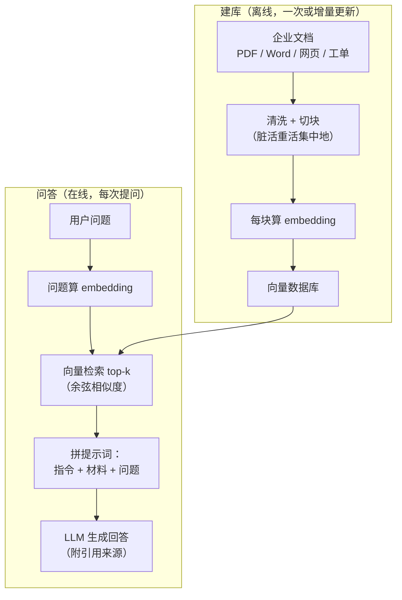
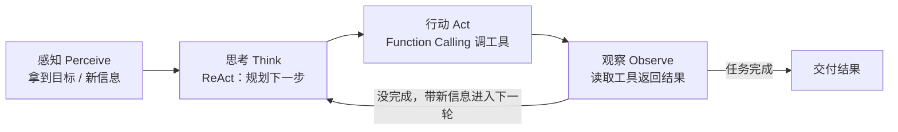
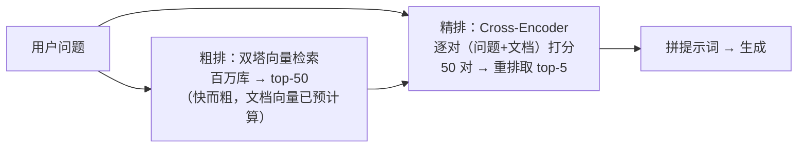
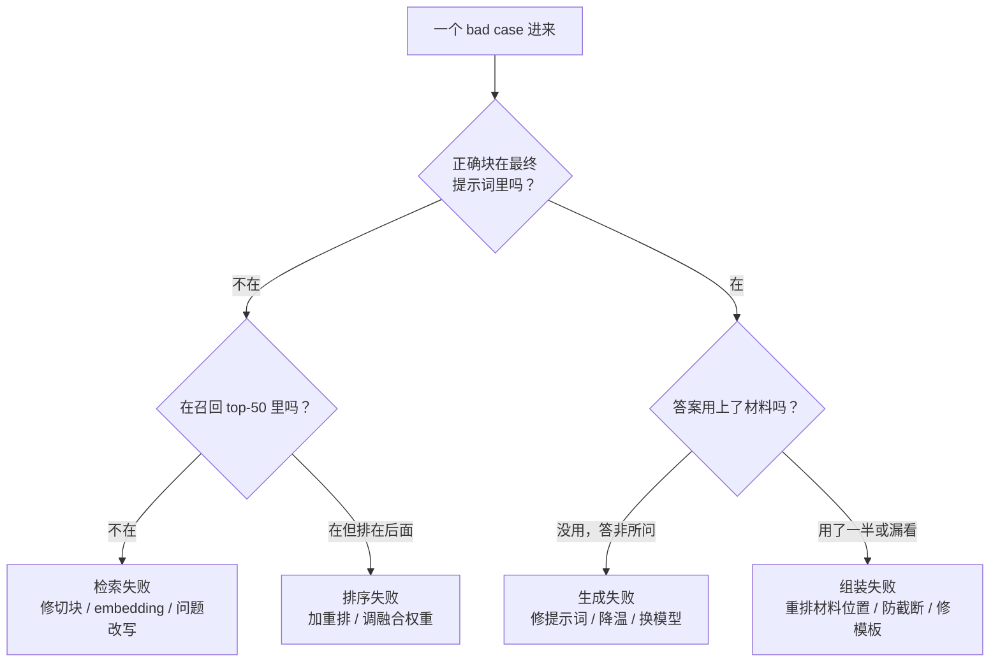

# RAG 与 Agent

> **一句话理解**：RAG 给 LLM 外挂一个可随时翻阅的知识库（开卷考试），Agent 给 LLM 装上会规划、会用工具的手脚——一个补"知识不够新不准"，一个补"只会说不会做"。

[⬆️ 返回总目录](../../../README.md) · [⬆️ 返回本篇](../README.md) · [⬅️ 返回本章目录](./README.md)

| 属性 | 说明 |
|------|------|
| 难度 | ⭐⭐⭐（较难） |
| 所属分支 | NLP与LLM |
| 前置知识 | [词向量与 embedding](./01-词向量与embedding.md)、[大语言模型 LLM 全景](./04-大语言模型LLM全景.md) |

---

## 📌 这一节解决什么问题

再大的 LLM 也有三个硬伤：**知识截止**（训练数据停在某个日期，问"最新"就露馅）、**幻觉**（没有依据也敢编）、**不懂私有数据**（你公司的制度文档它从没见过）。改模型有两条路：

1. **改模型本身**——[微调与对齐](./05-微调与对齐.md)，把行为改好，甚至灌点领域知识（贵、慢、知识更新要重训）；
2. **外挂知识**——RAG（Retrieval-Augmented Generation，检索增强生成），每次回答前先去知识库把相关材料检出来塞进提示词。知识更新只需换文档，当天生效。

RAG 解决"拿什么答"，Agent 解决"怎么把多步任务做完"：让模型不只是输出一段文字，而是**调用工具、观察结果、循环推进**直到任务完成。这两件事合起来，就是当前 LLM 落地应用的两大主线。

本页在"怎么跑通"之上，重点补两块深水区：**RAG 的数据管道深挖**（切块、检索模型、混合检索、重排——检索质量的四道工序）和 **RAG 失败模式的分类学**（检索失败/排序失败/生成失败/组装失败——本页核心增量：出问题时先定位是哪一类，再对症下药，而不是无脑换模型）。

## 🌱 通俗理解

**RAG = 开卷考试。** 闭卷考试（纯 LLM）只能靠背，背不到就编；开卷考试允许先翻书：把问题变成"检索请求"→ 从资料里找到最相关的几页 → 摊在桌面上（拼进提示词）→ 照着材料作答并注明出处。翻书用到的正是第 1 页学的 embedding：**问题和文档块都变成向量，谁的向量离得近，谁就是"相关的材料"**。

**向量数据库一句话**：FAISS、Milvus 这类库专管"在高维向量堆里飞快找出最相似的 k 个"——工程上它和推荐系统的召回是同一件事（呼应[第 8 章双塔模型与向量召回](../08-推荐系统/03-双塔模型与向量召回.md)：检索即推荐，只不过一边推商品一边推文档块）。选型时真正拉开差距的往往是三件事：**元数据过滤**（按部门/密级先过滤再检索——权限隔离的实现位置）、**混合检索内建与否**（BM25 与向量一站式融合，省一层胶水代码）、**增量更新能力**（文档频繁变更时不用全量重建索引）。

**切块（Chunking）= 把书撕成便签。** 书不能整本摊在桌上（塞不进上下文），要撕成一页页便签。撕法很有讲究：按固定字数撕会把一张表格拦腰斩断；按语义撕（段落、条款）才能保证每张便签自身说得通——撕错了便签，后面检索再准也白搭。

**重排序（Rerank）= 初筛后复试。** 向量检索像 HR 筛简历（快、粗看、难免看走眼），重排模型像部门面试官（把"问题 + 简历"放在一起仔细比对，慢、但准）——先用便宜的方法圈出 top-50，再用贵而准的方法精选 top-5。

**Agent = 给 LLM 装手脚。** 光有大脑（LLM 负责规划）不够，还得有工具（搜索、代码执行、数据库查询、发邮件）和一个循环：**感知 → 思考 → 行动 → 观察**，转着圈推进任务。最经典的执行范式是 **ReAct（Reason + Act）**：边想边做——先写下"我需要先查年假制度"（思考），调用知识库工具（行动），读返回结果（观察），再决定下一步，直到交付。

**Function Calling（函数调用）** 是"手脚"的标准化接口：开发者用结构化方式告诉模型有哪些工具、各要什么参数；模型不直接执行任何东西，只是输出"我要调用 `search(query="年假")`"这样的请求，由外部程序执行后把结果回填对话。模型点菜，程序上菜。

**多智能体（Multi-Agent）一句话**：多个各有角色提示词的 Agent 互相传递结果（研究员找资料 → 写手成稿 → 审稿员挑错），本质是"循环 + 消息传递"的编排，没有更多魔法——它值不值，本页末尾有一张成本收益表帮你算。

## 📋 举个例子

一个 mini 企业知识库，只有 3 个文档块（切块后）：

| 块号 | 内容摘要 |
|------|---------|
| 块 1 | 报销制度：差旅发票 30 天内提交，单程超过 X 元需提前审批…… |
| 块 2 | 休假制度：年假按工龄 5～15 天，入职满 1 年起享，可跨年结转 1 次…… |
| 块 3 | 考勤制度：工作日 9:00–18:00，迟到 3 次以内口头提醒…… |

用户问"**年假几天？**"。检索过程：问题 embedding 分别和 3 个块的 embedding 算余弦相似度（玩具数字示意）：

- 块 1（报销）：0.12
- 块 2（休假）：**0.83**
- 块 3（考勤）：0.21

top-1 命中块 2，把它塞进提示词模板：

```text
你是公司制度助手。只根据【材料】回答问题；材料里没有的内容，
直接回答"制度库中暂无相关规定"，不要自行推测。

【材料】（来自《员工手册》第 4 章）
休假制度：年假按工龄 5～15 天，入职满 1 年起享，可跨年结转 1 次……

【问题】年假几天？
```

模型照着材料回答"年假按工龄 5～15 天，入职满 1 年起享"并引用出处——知识来自文档而不是模型权重，更新制度只需替换文档块。这一问一答，就是 RAG 的最小完整闭环。

<details>
<summary>💣 展开看一个失败案例：检索不到时，RAG 照样胡说</summary>

失败现场：用户问"**病假工资怎么算？**"。知识库里压根没有病假条款，但检索器必须返回 top-k，于是硬塞回最"像"的块 2（年假，相似度 0.41——看起来不低，因为都是"假"）。模型拿到材料后顺着"假"字硬答："病假工资按年假标准 5～15 天折算……"——**一本正经，完全错误**。

修复三板斧：

1. **相似度阈值拒答**：最高分低于 0.5 直接走"知识库暂无该制度"，别让模型开口；
2. **混合检索（Hybrid Search）**：向量找"语义像"，BM25 关键词找"字面命中"，两路取长补短（"病假"这个词关键词零命中，就是强信号）；
3. **重排序（Rerank）**：召回 top-20 后用交叉编码器（Cross-Encoder）精排，把"看似相关实则不对"的块压下去再取 top-3。

第 0 桩其实最便宜：**知识库补一条病假条款**——数据管道修一次，全世界的问题少一类。教训：RAG 的下限由检索决定，检索错了，后面神仙难救；而最好的"检索优化"常常是补文档。

</details>

## 🧠 核心原理

### 整体流程：RAG 开卷考试流水线



生产级流水线在"检索"和"生成"之间还会插两道工序（下文细讲）：**混合检索**（向量 + 关键词）与**重排序**。

### Agent：感知-思考-行动-观察的循环



### 逐步拆解

**检索的核心还是第 1 页的余弦相似度：**

$$
\text{sim}(\mathbf{q}, \mathbf{d}) = \frac{\mathbf{q} \cdot \mathbf{d}}{\lVert\mathbf{q}\rVert \, \lVert\mathbf{d}\rVert}
$$

> 👉 **人话**：问题和文档块谁的方向一致谁相关——"年假几天"和"休假制度"的向量天然指得很近，和"报销发票"则几乎垂直。检索就是在几百万个文档块里找夹角最小的那 k 个。

**切块策略：数据管道里被低估最深的一环。**

| 策略 | 做法 | 优点 | 缺点 | 适合的文档 |
|------|------|------|------|-----------|
| 固定长度 | 每 N 字（如 500）切一刀，块间留重叠 | 实现零门槛、块大小均匀 | 把句子/表格/条款拦腰斩断，语义完整性没保障 | 日志、聊天记录等本来就近乎均匀的流水文本 |
| 递归切分 | 按分隔符优先级递归：先段落 → 再句子 → 最后才按字数兜底 | 尽量保住自然语义单元，长度大体可控 | 解析依赖文档格式规范 | 绝大多数通用文档的**默认起点**（LlamaIndex/LangChain 的默认套路） |
| 语义切分 | 对相邻句子算 embedding，相似度骤降处下刀 | 块内主题一致性最好 | 每块都要过一遍 embedding，建库成本高 | 长文章、研报等主题流动的连续叙事 |
| 结构切分 | 按文档自身结构切：条款、章节、函数、表格 | 尊重文档作者的语义划分 | 每种格式要写解析器 | **制度手册（按条款）、代码（按函数，AST 切）、API 文档** |

**表格与代码的特殊处理**（最容易翻车的两类）：表格按字数切必死（列被切成天书），正确做法是**整表保留为一个块**；超长表格按行组拆分并**复制表头**到每个子块，让每块自解释；表格转 Markdown/HTML 文本入库比转图片好检索。代码按函数/类切（用 AST 而不是正则），并保留签名与上下文注释；[99 生产实战](./99-生产实战.md)的迭代故事就是一个被切碎的表格引发的翻车现场。

<details>
<summary>🧮 展开看：递归切分的伪代码与一次切分的走向</summary>

```text
递归切分(文本, 分隔符优先级=[双换行, 单换行, 句号, 逗号, 字符]):
    若 len(文本) <= 块上限: 返回 [文本]           # 已经够小，直接成块
    用当前优先级最高的分隔符把文本切开
    对每一段:
        若 len(段) <= 块上限: 收集为块
        否则: 递归切分(段, 下一级分隔符)          # 降级到更细的分隔符
    相邻块之间补 50~100 字重叠
```

一次走向示例：一份 2000 字的制度文档，块上限 400——先按双换行切成 6 个章节段，其中 3 段已 ≤400 直接成块；剩下 3 段超限，降级按单换行切；仍超限的一小节再降级按句号切。**核心思想：永远优先在"天然语义边界"下刀，字数只是兜底**——这正是它优于固定切分的原因。

</details>

**检索用的 embedding 模型是怎么训出来的？** 它不是第 1 页的词向量，而是**句子/段落级**的检索模型，训练方法与[第 8 章双塔模型](../08-推荐系统/03-双塔模型与向量召回.md)同源——**双塔 + 对比学习（Contrastive Learning）**：

$$
\mathcal{L} = -\log \frac{\exp(\text{sim}(q, d^+)/\tau)}{\exp(\text{sim}(q, d^+)/\tau) + \sum_{d^- \in \mathcal{N}} \exp(\text{sim}(q, d^-)/\tau)}
$$

> 👉 **人话**：一个问题 $q$ 配一个正确文档 $d^+$ 和一堆错误文档 $d^-$——训练目标就是让"正确答案"的相似度在一堆"干扰项"里脱颖而出（softmax 形式的"选对真人"）。它就是 [02 页](./02-Transformer与注意力机制.md) softmax 的翻版：拉近正例、推远负例。

两个决定成败的细节：① 负例怎么来很关键——只用随机负例，模型学到的是"问题像不像文档"的浅层皮毛；**难负例（Hard Negative）**（用 BM25 或初版模型召回的"看起来相关其实不相关"的文档）逼模型学细粒度区分，是检索模型质量的主要来源；② 双塔结构（问题一座塔、文档一座塔，各自编码后只算一次相似度）让**文档向量可以离线预计算**——百万文档实时检索才有可能，这也是它和下面重排模型的本质区别。

**混合检索：BM25 与向量的互补。** BM25 是经典关键词打分（词频 × 反文档频率的工程化版本），两者的互补性一句话说透：**BM25 抓"字面精确"，向量抓"语义近似"**——

| 查询特征 | BM25 表现 | 向量表现 | 谁赢 |
|---------|----------|---------|------|
| 精确词/型号/错误码（"ERR_CONN_1042"） | ✅ 零容错，一击命中 | ❌ 可能被"相似错误码"带偏 | BM25 |
| 同义改写（"怎么请假" vs "休假申请流程"） | ❌ 无共同词就抓瞎 | ✅ 语义空间里本来就是邻居 | 向量 |
| 生僻专有名词 + 口语提问混合 | 各对一半 | 各错一半 | **必须两路合流** |

合流方法常用 **RRF（Reciprocal Rank Fusion，倒数排名融合）**：每个文档在两路里各有一个名次，按 $\sum 1/(\text{rank} + c)$ 加总重排——不比分数比名次，天然免疫两路分数量纲不同的问题：

$$
\text{RRF}(d) = \sum_{i \in \{\text{向量路},\, \text{BM25 路}\}} \frac{1}{k + \text{rank}_i(d)}, \qquad k \approx 60
$$

> 👉 **人话**：一个文档在两路里都排前面（比如各第 2 名），它的 RRF 分就是 $2/(60+2)$，比"一路第 1、一路第 50"（$1/61 + 1/110$）高——**两路都认可的文档优先**。$k$ 是平滑常数，压制"第 1 名和第 2 名差别很大"的错觉。

另一个检索失败的高频修法：**问题改写（Query Rewrite）**。用户的原始提问常常不适合直接检索（口语、指代、多重问句）："那报销的话发票丢了呢？"——"那"指代上一轮的差旅，直接拿去检索命中率惨淡。做法是在检索前加一步便宜的重写（小模型或规则）："差旅报销 发票丢失 处理流程"。多轮对话的知识库问答几乎必配这一步，否则每轮都把指代问题喂给检索器。

**重排序：cross-encoder 为什么准但慢。** 双塔（Bi-Encoder）把问题和文档**各自**编码成向量再算相似度——快（文档向量可预计算），但两塔之间没有任何信息交换，细粒度匹配做不了。交叉编码器（Cross-Encoder）把**问题和文档拼在一起**喂进同一个 Transformer，全程做完整的交叉注意力——每个词都能看到对方的所有词，"这一句的'它'指的就是问题里那个系统"这种精细对齐才可能发生。代价：**每一对 (问题, 文档) 都要跑一次完整前向**，无法预计算——百万库里直接 cross-encoder 等于每问一次问题就把全库读一遍。所以生产架构是两阶段：



（BM25 同理也是粗排一路；两阶段思想 = "先海选后复试"，和推荐系统的召回+精排、[08 章](../08-推荐系统/03-双塔模型与向量召回.md)完全同构。）

**检索质量的度量口径**（调优前先会测，不然不知道改好了没有）：

| 指标 | 定义 | 人话 |
|------|------|------|
| Recall@k（命中率@k） | 正确块出现在 top-k 里的比例 | "海选漏没漏"——RAG 最该先盯的指标，漏了后面全白搭 |
| MRR（平均倒数排名） | 正确块名次的倒数（第 1 名=1，第 5 名=0.2）取平均 | "正确块平均排多前"——衡量排序质量，比命中率更细腻 |
| nDCG | 按名次折减的累计增益（相关度加权） | "越相关的排得越靠前加越多分"——多档相关度时用 |

经验基线：专用检索模型在干净的通用测试集上 Recall@10 常能到 0.8~0.9+，但在**你自己的切块语料上可能显著更低**——所以调优永远用自己语料上标的 ground truth 测，别引用论文数字自我安慰。

### RAG 失败模式分类学（本页核心增量）

RAG 出了问题，第一件事不是换模型，而是**定位失败发生在哪一环**。四类失败 + 一张对症表：

| 失败类别 | 定义 | 典型症状 | 诊断方法 | 对症修法 |
|---------|------|---------|---------|---------|
| **检索失败** | 正确的块根本没进 top-k | 答非所问；引用的出处和问题风马牛不相及 | 打日志：人工判断"正确块在召回里的名次"——在 50 名开外即此类 | 换/训 embedding 模型、改切块（块太大信息被稀释、太小上下文不足）、问题改写（口语问题先改写成检索友好的表述）、加 BM25 混合 |
| **排序失败** | 正确块进了 top-k，但被排到后面/没进最终 top-3 | 回答里"擦边"正确：引用了相关但不关键的块，答对一半 | 日志：正确块的名次在 5~50 之间即此类 | 上重排（cross-encoder）、增大 top-k 再精排、RRF 融合权重调整 |
| **生成失败** | 材料（至少部分）是对的，模型没用好 | 材料明明写了答案，回答却编了别的；或无视材料里的限制条件 | 人工对照：把正确材料手工塞进提示词重问——还错就是生成端问题 | 提示词强化"只依据材料"、降温、换更强模型、要求先引用后作答、忠实度校验（[Ragas](./99-生产实战.md)） |
| **组装失败** | 检索、生成都对，但拼装环节坏了 | 正确块在上下文里却"看不见"（lost in the middle：被淹没在中段）；截断丢块；模板变量填错；权限过滤误杀 | 检查最终提示词原文：块到齐了吗？顺序如何？有没有被截断？ | 重排材料顺序（最重要的放开头/结尾）、压缩材料长度、修模板 bug、检权限过滤逻辑 |

这张表的用法：出 bad case 先做一次**五分钟定位**——看最终提示词里有没有正确块（没有 → 检索/排序失败，再看名次细分）→ 有但答错（生成失败）→ 有且答对一半（组装失败，查位置与截断）。**四类失败对应四拨完全不同的修法，误诊的代价是无休止地换模型。**诊断流程画成图：



### Agent 的规划失败模式与 ReAct 的作用

Agent 不是许愿机，它的失败集中在"规划"这一环，三类高发：

| 失败模式 | 症状 | 常见诱因 | 补救 |
|---------|------|---------|------|
| **循环** | 反复调用同一工具、重复同一句话，token 烧完任务没动 | 工具返回错误信息模型读不懂；规划里没有"死路标记" | 循环步数上限（5~10 步）；检测连续重复的调用直接打断并要求换策略；错误信息写得让人（模型）能懂 |
| **工具误用** | 调错工具、参数填错（把城市名塞进日期参数） | 工具描述含糊；工具太多互相混淆；参数没有示例 | 工具描述当"给新同事的说明书"写（一句话用途 + 参数示例 + 何时**不**该用）；砍工具数量；参数校验 + 出错回传 |
| **过早收敛** | 第一步就说"任务完成"，实际没做完 | 完成标准没写清；模型偏好"尽快交差" | 提示词里给完成检查清单（checklist）；加一道"自检步骤"（交付前逐条核对）；关键任务加人工确认 |

**ReAct 的作用正是治这些病**：把"思考"显式写成文字夹在行动之间，等于强迫模型把隐式规划落到明面上——循环能被看见（同一段思考反复出现）、工具误用能被追溯（思考里写错了意图）、过早收敛能被拦截（思考里跳步会被下一轮观察打脸）。思考文本同时是**调试日志**：Agent 出错时先读它的思考链，十有八九能定位到是"想错了"还是"做错了"。

**多智能体：成本与收益怎么判断。** 多智能体不是免费的智能加成，而是一笔要算的账：**成本** = 每多一个 Agent，调用次数、token 消耗、延迟、故障面（任何一环出错全链路重跑）全部上升，且错误会沿消息链放大；**收益**只在这些条件下兑现——任务可分解且子任务间耦合低、角色分工带来真实的信息增量（审稿员能发现写手的错）、且需要"生成-批评-修改"这类对抗性自检。判断口诀：**先用单 Agent + 好工具跑通；只有当错误率瓶颈出现在"缺乏自查/视角单一"时，才值得上多智能体**。深度研究类任务（多轮检索 + 综合）是它的甜点区；简单的问答/查询，多智能体纯属烧钱。

| 维度 | 单 Agent + 好工具 | 多智能体编排 |
|------|------------------|-------------|
| token 成本 / 延迟 | 1× | 常见 3~10×（角色越多越贵） |
| 故障面 | 一处 | 每个角色 + 每条消息链都是新故障点 |
| 质量上限 | 受"自查能力弱"限制 | 生成-批评-修改循环能抬高一档 |
| 调试难度 | 读一条思考链 | 逐角色回放消息流 |
| 适用 | 默认起点 | 可分解 + 需要对抗性自检的任务 |

**应用全景：**

| 场景 | 形态 | 工具示例 |
|------|------|---------|
| 智能客服 | RAG 为主 | 知识库检索、工单系统 |
| 多轮知识问答 | RAG + 问题改写 | 向量库、改写模型、会话状态 |
| 编程助手 | RAG + Agent | 代码库检索、终端、测试运行 |
| 数据分析 | Agent 为主 | SQL/Python 沙箱、图表生成 |
| 深度研究（Deep Research） | 多轮 Agent | 搜索引擎、多智能体分工综合 |

### 📐 数学深潜：BM25 的 IDF 为什么是对数——从信息量到"及格线"

**严格陈述**。BM25 对查询 $q$ 与文档 $d$ 的打分为：

$$
\text{BM25}(q, d) = \sum_{t \in q} \mathrm{IDF}(t) \cdot \frac{\mathrm{tf}(t, d)\,(k_1 + 1)}{\mathrm{tf}(t, d) + k_1\big(1 - b + b\,\frac{|d|}{\mathrm{avgdl}}\big)},
\qquad
\mathrm{IDF}(t) = \ln\!\Big(\frac{N - \mathrm{df}(t) + 0.5}{\mathrm{df}(t) + 0.5} + 1\Big)
$$

（$N$ 为文档总数，$\mathrm{df}(t)$ 为含词 $t$ 的文档数，$\mathrm{tf}$ 为词在文档内频次，$|d|/\mathrm{avgdl}$ 为长度归一。）**命题**：去掉平滑项后 $\mathrm{IDF}(t) \approx \ln\frac{N}{\mathrm{df}(t)} = -\ln\frac{\mathrm{df}(t)}{N}$，恰是事件"随机抽一篇文档、其中含有 $t$"的**自信息**（self-information，$I = -\log P$）；对数形式不是工程方便，而是"词项稀有度"的度量必然。

> 👉 **人话**：IDF 回答"这个词值多少信息"——越少见的词越值钱。"的"出现在几乎所有文档里，不值钱；一个错误码只出现在三篇文档里，一出现就几乎锁定了答案。对数就是这个"值钱程度"的标准计价方式：概率每翻一倍，信息量加一单位（一个比特/nat）。

<details>
<summary>🧮 展开完整推导：从"信息量三公理"到 IDF 公式（不跳步）</summary>

**第 1 步：信息量的函数方程。** 要给"事件稀有度"定一个计价函数 $I(P)$，合理的公理有两条：① 确定事件不值钱 $I(1) = 0$；② **独立事件的信息可加** $I(P_1 \cap P_2) = I(P_1) + I(P_2)$（两条独立线索的信息量应该相加）。设 $I(P) = f(\log P)$，第二条要求 $f(x + y) = f(x) + f(y)$——满足可加性的（连续）函数只有线性 $f(x) = c\,x$。于是：

$$
I(P) = -c\,\log P
$$

（取负号让 $0 < P \le 1$ 时信息量非负；$c$ 选对数底——$\ln$ 时单位是 nat，$\log_2$ 时是比特。）这就是自信息的来历：**对数不是选出来的，是"可加性"逼出来的唯一解**。

**第 2 步：词项稀有度的概率模型。** 把"随机抽一篇文档"当试验，事件 $E_t$ = "该文档包含词 $t$"。把 $\mathrm{df}(t)/N$ 当 $P(E_t)$ 的估计，则词 $t$ 的信息量：

$$
I(E_t) = -\ln\frac{\mathrm{df}(t)}{N} = \ln\frac{N}{\mathrm{df}(t)} \;\approx\; \mathrm{IDF}(t)
$$

**第 3 步：验证边界的正确性。** 两个极端恰好符合直觉：

- $\mathrm{df} = N$（词出现在所有文档，如停用词）：$I = \ln 1 = 0$——**零信息，权重自动归零**。BM25 不需要停用词表，IDF 的数学结构自动把"到处都有的词"压到及格线以下；
- $\mathrm{df} \to 0$（罕见词）：$I \to \infty$——理论上信息量爆炸（工程上必须截断，见反例）。

**第 4 步：BM25 的平滑项在防什么。** 原始 $\ln\frac{N-\mathrm{df}}{\mathrm{df}}$ 在 $\mathrm{df} > N/2$ 时为负（高频词负权重，可能出现"文档含高频词反而扣分"的反常）；Lucene/Elasticsearch 采用的 $\ln\big(\frac{N-\mathrm{df}+0.5}{\mathrm{df}+0.5} + 1\Big)$ 保证恒正、且 $\mathrm{df}=N$ 时趋近一个小正数而非零以下——**数学上的信息量 + 工程上的防爆栏**。

**第 5 步：对数的第二重作用——查询内累加。** 查询有多个词时 BM25 直接把各项 IDF×tf 相加；按第 1 步的可加公理，这恰是"各词信息量之和"（在词独立假设下近似整个查询的自信息）。若 IDF 不取对数（比如用 $N/\mathrm{df}$ 本身），高频词与低频词的权重差距会大到淹没 tf 信号——对数把"稀有度"压回线性尺度，让 tf（词在**这篇**文档里出现的证据）有机会参与决策。

</details>

**数值感受**（配图，$N = 10{,}000$ 篇；条形长度 ∝ IDF，信息量的"计价条"）：

```text
词项稀有度 → 信息计价条（ln(N/df)，N = 10,000）：

"的"        df=9,800  │≈0.02 （▏几乎看不见：出现与否不构成证据）
"报销"      df=500    │████████████████████████████████ 3.00
                        （有区分力，但多篇都有）
"ERR_1042"  df=3      │████████████████████████████████████████████████████████████████████████████ 8.11
                        （一出现几乎点名文档——BM25"零容错"威力的来源）
每少见一倍（df 减半），条形加长 ln2 ≈ 0.69 一个单位——对数的刻度。
```

| 词 | df | IDF = ln(N/df) | 解读 |
|----|----|----------------|------|
| "的"（停用词级） | 9,800 | ≈ 0.02 | 几乎零信息——出现与否不构成证据 |
| "报销"（领域常见词） | 500 | ≈ 3.00 | 有区分力，但多篇都有 |
| "ERR_CONN_1042"（错误码） | 3 | ≈ 8.11 | 一出现几乎点名文档——**BM25 抓字面精确的威力来源**（上文混合检索表的"零容错一击命中"） |

**反例与边界**：

- **罕见≠相关**：错拼词、无意义 token 的 df 极小、IDF 极高——纯 BM25 会给"文档恰好包含乱码"打高分；生产要配 min_df 过滤或与语义检索融合，不能裸信 IDF；
- **独立性假设失效**：查询里同义/同词根的词（"报销""发票"高度相关）信息量被重复相加，BM25 会"同一个证据记两遍分"；
- **语料依赖**：IDF 是相对语料的量——同一个词在通用语料与企业内部库的 IDF 完全不同，两套索引的 BM25 分数**不可跨库比较**（与本页拒答阈值"换库必须重标"同根源）；
- **与向量检索的分工**：IDF 只看"字面在不在"，看不见"病假≈年假"的语义近邻——这正是上文混合检索两路合流的理由。

> 👉 **一句人话**：IDF 的对数 = "这个词能排除掉多少文档"的信息量计价——每少见一倍，值钱加一个单位；停用词自动免费、错误码一锤定音，BM25 的全部性格都写在这一个对数里。

### 📐 数学深潜：Recall@K 的无偏估计与偏差来源

**严格陈述**。设查询总体分布为 $Q$，对查询 $q$ 记命中事件 $h(q) = \mathbb{1}\,[\text{相关块排在 top-}K\text{ 内}]$。Recall@K 的**总体定义**与**样本估计**：

$$
R@K = \mathbb{E}_{q \sim Q}[h(q)] = P(h = 1),
\qquad
\widehat{R@K} = \frac{1}{n}\sum_{i=1}^{n} h(q_i) \;\;\text{（} n \text{ 个 i.i.d. 查询）}
$$

**命题**：$\widehat{R@K}$ 是 $R@K$ 的**无偏估计**（$\mathbb{E}[\widehat{R@K}] = R@K$），方差 $\mathrm{Var} = \frac{p(1-p)}{n}$（$p = R@K$），95% 置信区间约 $\widehat{R} \pm 1.96\sqrt{\widehat{R}(1-\widehat{R})/n}$。

> 👉 **人话**：Recall@K 本质是"命中概率"，估计它就是伯努利抽样——抽 $n$ 个查询数命中几个。无偏的含义朴素：**平均而言不偏不倚**；但单次估计有波动，样本小的时候"0.85"这种报法是在冒充实证。

<details>
<summary>🧮 展开完整推导：两行证明无偏性 + 算一次置信区间</summary>

**第 1 步：指示变量期望。** $h(q_i)$ 是 0/1 变量，$\mathbb{E}[h] = 1 \cdot P(h{=}1) + 0 \cdot P(h{=}0) = R@K$。

**第 2 步：期望的线性（无需独立性）。**

$$
\mathbb{E}\big[\widehat{R@K}\big] = \frac{1}{n}\sum_{i=1}^n \mathbb{E}[h(q_i)] = \frac{1}{n}\cdot n \cdot R@K = R@K
$$

（第 2 步连独立都不需要；独立只用在算方差与置信区间。）

**第 3 步：方差与区间。** 伯努利方差 $p(1-p)$，除以样本量 $n$；正态近似下 95% 区间如严格陈述。**算例**：$n = 100$、$\widehat{R} = 0.85$ → $\sqrt{0.85 \times 0.15 / 100} \approx 0.036$，区间 $\approx 0.85 \pm 0.07$；$n = 25$ 时±0.14——"测了 25 条说召回 85%"与"召回 71%~99%"是同一句话，报告必须带 $n$。

</details>

**抽样图**（配图）——同样的点估计，样本量决定你敢说多满：

```text
R̂ = 0.85 时 95% 置信区间随 n 收窄：

n =    25  [============●============]      0.71 ~ 0.99（几乎什么都没说）
n =   100  [======●======]                  0.78 ~ 0.92
n = 1,000  [===●===]                        0.83 ~ 0.87
                └── 区间宽 ≈ 1.96·√(R̂(1−R̂)/n)
```

**偏差来源一句话**：无偏性成立的前提是"查询 i.i.d. 于真实分布 **且** 相关性判定完整"——现实中它输给三件事：**标注不全**（漏标的相关块算 miss → 系统性**低估**）、**查询分布偏移**（评估集不是线上真实提问 → 估的不是你要的总体）、**截断盲区**（只看 top-K 内，对"该不该调大 K"的决策没有证据）。

**反例与边界**（三件套各自的翻车现场）：

- **标注不全**：库里有相关块但 ground truth 只标了 top-K 外的一个——命中判定把"检索到了"记成 miss。这是企业语料上 Recall@K 被系统性低估的头号原因，修法是抽样人工复查或用"多标注 + 去重"补全；
- **分布偏移**：评估集全是规范问句、线上是口语碎片——估计量对**评估分布**无偏，但你要的是**线上分布**的 R@K，两个总体不是同一个。唯一出路：定期用线上真实查询回流重测；
- **截断盲区**：R@10 = 0.60 时你不知道"第 11~50 名里还有多少相关块"——加大 K 是否值得，这个指标天然沉默（要看 MRR/nDCG 与加大 K 的增量曲线）。

> 👉 **一句人话**：Recall@K 就是数命中率的伯努利抽样——多测、如实报区间；而它无偏的前提（标注全、分布对）在企业语料上经常先崩，测之前先审这两件事。

## 💻 动手试试

```python
# 依赖：pip install sentence-transformers
# 说明：首次运行联网下载多语言小模型（约 100~500MB），之后走本地缓存
from sentence_transformers import SentenceTransformer, util

model = SentenceTransformer("paraphrase-multilingual-MiniLM-L12-v2")  # 多语言，中文可用

# 刻意把"病假"问题也放进来：亲眼看一次"检索失败→阈值拒答"的现场
docs = [
    "报销制度：差旅发票需在 30 天内提交，单程超过 800 元需提前审批。",
    "休假制度：年假按工龄 5～15 天，入职满 1 年起享，可跨年结转 1 次。",
    "考勤制度：工作日 9:00-18:00，每月迟到 3 次以内口头提醒。",
]
doc_emb = model.encode(docs, normalize_embeddings=True)   # 文档块 → 向量（建库）

def rag_query(question: str, threshold: float = 0.5):
    q_emb = model.encode([question], normalize_embeddings=True)  # 问题 → 向量
    scores = util.cos_sim(q_emb, doc_emb)[0]       # 余弦相似度：检索这一步
    top = scores.argmax().item()
    top_score = scores[top].item()
    print(f"[{question}] 各块得分：{scores.round(decimals=2).tolist()}")
    if top_score < threshold:                      # 阈值拒答：组装前先拦一道
        return "制度库中暂无相关规定（最高相似度 %.2f 低于阈值 %.2f）" % (top_score, threshold)
    return (f"只根据以下材料回答：\n材料：{docs[top]}\n问题：{question}"
            f"\n（材料相似度 {top_score:.2f}，可交给任意 LLM 生成）")

print(rag_query("年假有几天？"))      # 正常：命中块 2，分数高
print(rag_query("病假工资怎么算？"))  # 失败现场：库里没有，得分被压在阈值下 → 拒答

# 预期输出：
# [年假有几天？] 各块得分：[0.15, 0.72, 0.25] 之类 → 正常返回带材料的提示词
# [病假工资怎么算？] 各块得分形如 [0.2x, 0.4x, 0.3x] → 触发拒答分支
# 没有阈值时，第二个问题会把"年假"块硬塞给模型——正是本页失败案例的现场。

# 🧪 改什么参数、看什么变化：
# 1) threshold 从 0.5 调到 0.3：拒答消失，但"病假"会被硬答（错误率上升）——
#    阈值是"宁可少答 vs 宁可错答"的旋钮，必须按自己的模型重新标定；
# 2) 把问题改成"怎么请假"（与文档用词不同）：看语义检索对同义改写的鲁棒性；
# 3) 换一个更大的检索模型：看"病假"与"年假"的分数差是否拉开——
#    模型越强，"看似相关"与"真相关"分得越开；
# 4) docs 里加一条"病假制度：……"再问"病假"：观察分数从 0.4x 跳到 0.7x+，
#    亲眼看"知识库补文档"如何比换任何模型都有效。
```

## 🔥 炼丹小灶

> 🔥 **炼丹小灶**：RAG 的常用起点——
> - 配方：递归切分 300~500 字/块、相邻块重叠 50~100 字、检索 top-k=3~5、提示词里显式写"材料没有就说不知道"；多轮对话先做问题改写再检索；
> - 进阶顺序：先纯向量 → 不准再加 BM25 混合（RRF 融合）→ 还不准上 cross-encoder 重排；切块优先按文档结构（条款/表格/函数）而不是无脑定长；Agent 的工具描述要写得像给新同事的说明书，循环设 5~10 步上限防跑飞；
> - ⚠️ 以上是经验参考值，不是圣旨；换语料换模型请重新炼。

## 🖱️ 动手玩

> 🕹️ **延伸玩一玩**：[Embedding Projector](https://projector.tensorflow.org)——把你语料的块向量可视化，肉眼看"相关块聚在一起、无关块散开"的程度；聚类混成一团的语料，检索注定难做（切块或 embedding 模型有问题）。
> 🕹️ **延伸玩一玩**：[tiktokenizer](https://tiktokenizer.vercel.app)——数一数你的"材料 + 问题"各占多少 token，直观感受上下文预算怎么分配（材料塞太多也会挤占生成空间）。

## 🔗 在知识树中的位置

- **上游**：[词向量与 embedding](./01-词向量与embedding.md)（检索的地基）；[大语言模型 LLM 全景](./04-大语言模型LLM全景.md)（生成端）；[微调与对齐](./05-微调与对齐.md)（另一条改造路线）。
- **横向对比**：与[第 8 章：双塔模型与向量召回](../08-推荐系统/03-双塔模型与向量召回.md)共享"双塔 + 向量检索"骨架——推荐召回物料，RAG 召回知识；重排的"粗排+精排"两阶段也与推荐的召回+排序完全同构；[02 页](./02-Transformer与注意力机制.md)的 lost in the middle 现象是本页"组装失败"的机理来源。
- **下游**：[99 生产实战](./99-生产实战.md)（企业知识库问答完整落地）；多模态检索在[第 12 章](../../5-前沿与融合/12-生成模型与多模态/04-多模态模型.md)（用图找文、用文找图）。

## 🎓 深度视角

**真实取舍一：长上下文与 RAG 是叠加，不是替代。** 窗口涨到百万级后"把全库塞进去"看似可行，四笔账都不允许它成为默认：**token 成本**（每次请求都为全部材料付费，检索只付 top-k 的钱）、**权限**（向量库层过滤是权限隔离的自然位置，全文进上下文等于先泄密再叮嘱）、**可审计**（引用粒度到块，才回答得了"你依据什么"）、**利用率**（lost in the middle：塞得越多，中段利用率越低）。窗口变大让 RAG 更从容（top-k 放宽、切块可以更完整），不是让它失业。

**真实取舍二：两阶段检索的成本大头在精排。** 粗排（双塔向量检索）毫秒级、可预计算；精排 cross-encoder 要对 50 对 (问题, 候选) 逐对跑完整前向——**它是延迟与算力的主项**。工程上真正调的是"精排候选数"这个旋钮：50→20 对，延迟近乎线性下降，质量的损失通常远小于线性（排序误差集中在尾部候选）——先量化你的 bad case 有多少死在 20 名之后，再决定付不付 50 对的钱。

**真实取舍三：Agent 的算力经济学。** 每轮"思考 + 工具调用 + 观察"都是一次完整的 prefill + decode，10 步任务的 token 成本 ≈ 10 倍起（还不含工具返回的长文本）；重试、自检、多智能体全都按这个汇率计价。**可靠性是用 token 买的**——设计 Agent 时先算"每提升 1% 任务成功率的 token 成本"，再决定加不加那道自检。

<details>
<summary>🧮 高级深问 3 则：组合误差的杠杆、检索器何时收手、Agent 记忆存什么</summary>

**问 1：单步 95% 可靠的 Agent，10 步链路还剩多少可靠？每步提升 1 个百分点值多少？** 假设步间独立：$0.95^{10} \approx 0.60$；单步升到 96% 得 $0.96^{10} \approx 0.66$（+6.5 个百分点）；单步升到 99% 得 $0.99^{10} \approx 0.90$（+30 个百分点）。结论：**在多步链路上，把单步可靠性往 99% 推的杠杆，远大于加长链路或加更多规划花活**；反之，任务链路越长，越要拆解与断点续传（checkpoint），让失败只重跑局部。

**问 2：检索器优化到什么程度该收手？** 边际递减 + 瓶颈转移：Recall@10 从 0.85 提到 0.92 很贵，而如果你的 bad case 分布里"检索/排序失败"只占四成（四类失败分类学），这笔投入最多修复四成的问题——此时材料组织（组装失败）与提示词（生成失败）的性价比更高。**先画自己的失败分布饼图，再决定钱花在哪**，是 RAG 调优的第一性流程。

**问 3：Agent 的"长期记忆"该存什么？** 候选三种：对话原文（忠实但贵且超窗口）、滚动摘要（省但丢细节）、结构化状态（用户偏好/事实抽取，省且可查但抽取有错）。当前实践多为混合（近期原文 + 远期摘要 + 结构化事实），"存什么、何时遗忘、错了怎么改"没有共识——但"全存"一定先死于上下文经济学（[04 页](./04-大语言模型LLM全景.md)的窗口账本）。

</details>

## 🔬 SOTA 演进（2023–2026）

- **Agentic 评估难题（2023–2026 的核心缺口）**：多步工具调用的可靠性度量至今没有公认标准。三个具体难点：**结果与过程要分开记**（结果对过程错 = 运气，下次未必对；过程对结果错 = 环境/工具问题，不是模型的锅）；**能力指标与可靠性指标要分开记**——pass@k（k 次里至少一次成功的比例，衡量能力上限）与 pass^k（k 次全部成功的比例，衡量可靠性下界，用户实际体验的是它）；**轨迹级裁判的偏差**（用 LLM 裁判评轨迹，继承 [99 页](./99-生产实战.md)所述裁判偏差体系且更严重——轨迹长、判断点多、误差沿轨迹累积）。现状：自建评估任务 + 人工抽检仍是主力，agentic benchmark 在工具环境与任务分布上快速演化、远未收敛。
- **检索模型与 LLM 的协同微调（一句话级）**：传统 pipeline 里 embedding 模型只对"相似度"负责；前沿做法是用下游 LLM 的生成反馈（忠实度、答对与否）反向微调检索器，让**检索为"生成端好用"优化，而不是为相似度指标优化**——端到端 RAG 的方向之一，与本页"检索指标好 ≠ 最终效果好"的错位问题正面相撞。

## ❓ 开放问题

1. **过程风险的度量盲区**：任务完成率会掩盖过程中的越权操作、错误工具调用（被"结果好"赎买了）——安全审计要求过程级可回放，但过程级评估的成本与标准化都无解。
2. **多智能体的必要性边界**：什么条件下"一个强模型 + 好工具"胜过"一个模型团队"？成本 3~10 倍的兑换在哪些任务上有正收益，目前只有经验判断，没有理论。
3. **工具生态的碎片化**：Function Calling 的接口各家 API 已经分化（参数 schema、错误回传约定不一），"工具描述工程"会不会沉淀为标准、沉淀成谁的标准——牵动所有 Agent 的可移植性。

## ⚠️ 常见误区

- **误区一**："RAG = 接个向量库就完事。" → 切块策略、检索质量、拒答阈值决定系统的下限；模型只是最后一公里，前面九十公里都是数据管道的活。
- **误区二**："Agent 的智能全在模型，工具随便写。" → 工具描述的清晰度直接决定调用成功率；模型是按"说明书"点菜的，说明书含糊，点的菜就离谱。
- **误区三**："RAG 和微调二选一。" → 两者正交可叠加：RAG 管"知识从哪来"（事实、时效），微调管"答成什么样"（风格、格式、领域话术）。事实类需求优先 RAG。
- **误区四**："RAG 效果差就换更大的生成模型。" → 先过一遍四类失败分类学：多数 bad case 死在检索与排序（换生成模型无效），相当一部分死在切块（换检索模型也无效）。定位，再动手。
- **误区五**："多智能体一定比单智能体强。" → 多智能体是延迟、成本与故障面的三重加价，只在"可分解 + 需要对抗性自检"的任务上划算；单 Agent + 好工具是默认起点。
- **误区六**："Recall@10 上 90% 了，效果一定好。" → 检索指标只覆盖四类失败中的前两类；生成失败与组装失败（材料淹死在中段、模板 bug）在检索指标上完全隐形。最终回答质量必须用忠实度/相关性另测（工具见 [99 生产实战](./99-生产实战.md)）。

## 📝 小结与自测

**要点回顾**

- LLM 三大局限：知识截止、幻觉、不懂私有数据；对策两条线——改模型（微调）或外挂知识（RAG）；
- RAG 五步：文档切块 → embedding 入库 → 问题向量化检索 top-k → 拼提示词 → 生成并引用；向量数据库与推荐召回同源；
- 切块四策略（固定/递归/语义/结构）各有所适：递归是默认起点，制度按条款、表格整块、代码按函数；检索模型 = 双塔 + 对比学习 + 难负例；
- BM25 抓字面、向量抓语义，混合检索（RRF）补齐两端；cross-encoder 拼接细看所以准、逐对前向所以慢，生产用"粗排海选 + 精排复试"两阶段；
- 失败分类学四类：检索失败（没进 top-k）/ 排序失败（进了但排后）/ 生成失败（材料对没用好）/ 组装失败（拼装环节坏事）——先定位再修，别急着换模型；
- 检索不到时模型会"硬答"：阈值拒答 + 混合检索 + 重排序是三道保险；
- Agent = 大脑（规划）+ 工具（Function Calling）+ 循环（感知-思考-行动-观察）；三大规划病：循环、工具误用、过早收敛；ReAct 的显式思考链既是护栏也是调试日志；多智能体只在可分解 + 需自检的任务上划算；
- 度量先行：Recall@k 盯海选漏没漏、MRR/nDCG 盯排序细不细；检索指标好 ≠ 最终效果好（生成与组装失败在检索指标上隐形）；问题改写是多轮对话检索的几乎必配项；
- 向量库选型看三件事：元数据过滤（权限隔离的位置）、混合检索内建、增量更新——相似度搜索本身各家都够用；
- 拒答是合格回答：阈值 + 混合检索 + 重排三道保险，而第 0 桩（也是最好的优化）常常是给知识库补文档。

**自测一下**（点击展开答案）

<details>
<summary>问题 1：RAG 和微调分别适合解决什么问题？</summary>

RAG 适合事实性、时效性、私有性的知识需求（制度文档、产品手册），更新即换文档；微调适合稳定的风格、格式与行为模式（固定话术、输出 JSON、领域术语习惯）。事实类知识硬灌进权重既贵又易过拟合——优先 RAG。

</details>

<details>
<summary>问题 2：Function Calling 里模型真的在"执行"函数吗？</summary>

没有。模型只输出一份结构化的"调用请求"（工具名 + 参数），真正执行的是外部程序，执行结果再回填给模型继续推理。模型是点菜的服务员，不是下厨的厨师——这个设计保证了对系统能力的可控与可审计。

</details>

<details>
<summary>问题 3：日志显示：正确的文档块排在召回结果第 12 名，top-k=3 里没有它。这是四类失败中的哪一类？怎么修？</summary>

排序失败（正确块进了大召回池但没进最终 top-k；若连前 50 都没进才算检索失败）。修法：上 cross-encoder 重排（top-50 里精选 top-3）、或调大送入重排的候选数、或调 RRF 融合权重。

</details>

<details>
<summary>问题 4：为什么 cross-encoder 明明更准，生产系统却不直接用它检索全库？</summary>

因为它必须把"每个候选文档与问题拼在一起"跑一次完整前向，百万文档等于每问一次问题就全库推理一遍；双塔的文档向量可离线预计算，才能毫秒级海选。所以是"双塔海选保速度、cross-encoder 复试保精度"的分工。

</details>

<details>
<summary>问题 5：同一个问题"那报销的话发票丢了呢"，单轮检索命中率很低，先修什么？</summary>

先做问题改写：这是多轮对话的指代问题（"那"指上一轮的差旅），原始问句不适合直接检索。加一步便宜的重写（"差旅报销 发票丢失 处理流程"）往往立竿见影；改写后仍低再查切块与 embedding 模型。直接换更贵的检索模型是误诊。

</details>

## 📚 延伸阅读

- 论文：Retrieval-Augmented Generation for Knowledge-Intensive NLP Tasks（RAG 原论文，2020，https://arxiv.org/abs/2005.11401）
- 论文：Retrieval-Augmented Generation for Large Language Models: A Survey（2024，https://arxiv.org/abs/2312.10997）
- 论文：ReAct: Synergizing Reasoning and Acting in Language Models（2023，https://arxiv.org/abs/2210.03629）
- 论文：Dense Passage Retrieval for Open-Domain Question Answering（DPR，2020，https://arxiv.org/abs/2004.04906）——对比学习训检索模型的代表作
- 论文：Lost in the Middle: How Language Models Use Long Contexts（2023，https://arxiv.org/abs/2307.03172）——组装失败的机理来源
- 文档：主流大模型平台的 Function Calling 指南（各家 API 文档的"工具调用"章节）

---

[⬅️ 上一页：微调与对齐](./05-微调与对齐.md) · [返回本章目录](./README.md) · [下一页：进阶专题：LLM 训练与推理全栈 ➡️](./07-进阶专题-LLM训练与推理全栈.md)
