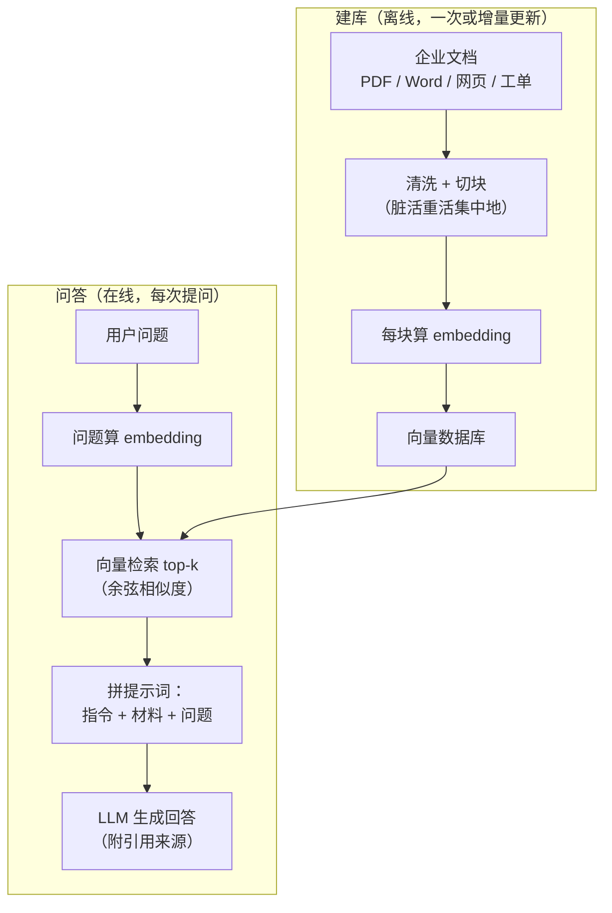
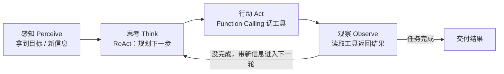

# RAG 与 Agent

> **一句话理解**：RAG 给 LLM 外挂一个可随时翻阅的知识库（开卷考试），Agent 给 LLM 装上会规划、会用工具的手脚——一个补"知识不够新不准"，一个补"只会说不会做"。

[⬆️ 返回总目录](../../../README.md) · [⬆️ 返回本篇](../README.md) · [⬅️ 返回本章目录](./README.md)

| 属性 | 说明 |
|------|------|
| 难度 | ⭐⭐⭐（较难） |
| 所属分支 | NLP与LLM |
| 前置知识 | [词向量与 embedding](./01-词向量与embedding.md)、[大语言模型 LLM 全景](./04-大语言模型LLM全景.md) |

---

## 📌 这一节解决什么问题

再大的 LLM 也有三个硬伤：**知识截止**（训练数据停在某个日期，问"最新"就露馅）、**幻觉**（没有依据也敢编）、**不懂私有数据**（你公司的制度文档它从没见过）。改模型有两条路：

1. **改模型本身**——[微调与对齐](./05-微调与对齐.md)，把行为改好，甚至灌点领域知识（贵、慢、知识更新要重训）；
2. **外挂知识**——RAG（Retrieval-Augmented Generation，检索增强生成），每次回答前先去知识库把相关材料检出来塞进提示词。知识更新只需换文档，当天生效。

RAG 解决"拿什么答"，Agent 解决"怎么把多步任务做完"：让模型不只是输出一段文字，而是**调用工具、观察结果、循环推进**直到任务完成。这两件事合起来，就是当前 LLM 落地应用的两大主线。

## 🌱 通俗理解

**RAG = 开卷考试。** 闭卷考试（纯 LLM）只能靠背，背不到就编；开卷考试允许先翻书：把问题变成"检索请求"→ 从资料里找到最相关的几页 → 摊在桌面上（拼进提示词）→ 照着材料作答并注明出处。翻书用到的正是第 1 页学的 embedding：**问题和文档块都变成向量，谁的向量离得近，谁就是"相关的材料"**。

**向量数据库一句话**：FAISS、Milvus 这类库专管"在高维向量堆里飞快找出最相似的 k 个"——工程上它和推荐系统的召回是同一件事（呼应[第 8 章双塔模型与向量召回](../08-推荐系统/03-双塔模型与向量召回.md)：检索即推荐，只不过一边推商品一边推文档块）。

**Agent = 给 LLM 装手脚。** 光有大脑（LLM 负责规划）不够，还得有工具（搜索、代码执行、数据库查询、发邮件）和一个循环：**感知 → 思考 → 行动 → 观察**，转着圈推进任务。最经典的执行范式是 **ReAct（Reason + Act）**：边想边做——先写下"我需要先查年假制度"（思考），调用知识库工具（行动），读返回结果（观察），再决定下一步，直到交付。

**Function Calling（函数调用）** 是"手脚"的标准化接口：开发者用结构化方式告诉模型有哪些工具、各要什么参数；模型不直接执行任何东西，只是输出"我要调用 `search(query="年假")`"这样的请求，由外部程序执行后把结果回填对话。模型点菜，程序上菜。

**多智能体（Multi-Agent）一句话**：多个各有角色提示词的 Agent 互相传递结果（研究员找资料 → 写手成稿 → 审稿员挑错），本质是"循环 + 消息传递"的编排，没有更多魔法。

## 📋 举个例子

一个 mini 企业知识库，只有 3 个文档块（切块后）：

| 块号 | 内容摘要 |
|------|---------|
| 块 1 | 报销制度：差旅发票 30 天内提交，单程超过 X 元需提前审批…… |
| 块 2 | 休假制度：年假按工龄 5～15 天，入职满 1 年起享，可跨年结转 1 次…… |
| 块 3 | 考勤制度：工作日 9:00–18:00，迟到 3 次以内口头提醒…… |

用户问"**年假几天？**"。检索过程：问题 embedding 分别和 3 个块的 embedding 算余弦相似度（玩具数字示意）：

- 块 1（报销）：0.12
- 块 2（休假）：**0.83**
- 块 3（考勤）：0.21

top-1 命中块 2，把它塞进提示词模板：

```text
你是公司制度助手。只根据【材料】回答问题；材料里没有的内容，
直接回答"制度库中暂无相关规定"，不要自行推测。

【材料】（来自《员工手册》第 4 章）
休假制度：年假按工龄 5～15 天，入职满 1 年起享，可跨年结转 1 次……

【问题】年假几天？
```

模型照着材料回答"年假按工龄 5～15 天，入职满 1 年起享"并引用出处——知识来自文档而不是模型权重，更新制度只需替换文档块。这一问一答，就是 RAG 的最小完整闭环。

<details>
<summary>💣 展开看一个失败案例：检索不到时，RAG 照样胡说</summary>

失败现场：用户问"**病假工资怎么算？**"。知识库里压根没有病假条款，但检索器必须返回 top-k，于是硬塞回最"像"的块 2（年假，相似度 0.41——看起来不低，因为都是"假"）。模型拿到材料后顺着"假"字硬答："病假工资按年假标准 5～15 天折算……"——**一本正经，完全错误**。

修复三板斧：

1. **相似度阈值拒答**：最高分低于 0.5 直接走"知识库暂无该制度"，别让模型开口；
2. **混合检索（Hybrid Search）**：向量找"语义像"，BM25 关键词找"字面命中"，两路取长补短（"病假"这个词关键词零命中，就是强信号）；
3. **重排序（Rerank）**：召回 top-20 后用交叉编码器（Cross-Encoder）精排，把"看似相关实则不对"的块压下去再取 top-3。

教训：RAG 的下限由检索决定，检索错了，后面神仙难救。

</details>

## 🧠 核心原理

### 整体流程：RAG 开卷考试流水线



### Agent：感知-思考-行动-观察的循环



### 逐步拆解

**检索的核心还是第 1 页的余弦相似度：**

$$
\text{sim}(\mathbf{q}, \mathbf{d}) = \frac{\mathbf{q} \cdot \mathbf{d}}{\lVert\mathbf{q}\rVert \, \lVert\mathbf{d}\rVert}
$$

> 👉 **人话**：问题和文档块谁的方向一致谁相关——"年假几天"和"休假制度"的向量天然指得很近，和"报销发票"则几乎垂直。检索就是在几百万个文档块里找夹角最小的那 k 个。

**应用全景：**

| 场景 | 形态 | 工具示例 |
|------|------|---------|
| 智能客服 | RAG 为主 | 知识库检索、工单系统 |
| 编程助手 | RAG + Agent | 代码库检索、终端、测试运行 |
| 数据分析 | Agent 为主 | SQL/Python 沙箱、图表生成 |
| 深度研究（Deep Research） | 多轮 Agent | 搜索引擎、多智能体分工综合 |

## 💻 动手试试

```python
# 依赖：pip install sentence-transformers
# 说明：首次运行联网下载多语言小模型（约 100~500MB），之后走本地缓存
from sentence_transformers import SentenceTransformer, util

model = SentenceTransformer("paraphrase-multilingual-MiniLM-L12-v2")  # 多语言，中文可用

docs = [
    "报销制度：差旅发票需在 30 天内提交，单程超过 800 元需提前审批。",
    "休假制度：年假按工龄 5～15 天，入职满 1 年起享，可跨年结转 1 次。",
    "考勤制度：工作日 9:00-18:00，每月迟到 3 次以内口头提醒。",
]
question = "年假有几天？"

doc_emb = model.encode(docs, normalize_embeddings=True)      # 文档块 → 向量
q_emb = model.encode([question], normalize_embeddings=True)  # 问题 → 向量
scores = util.cos_sim(q_emb, doc_emb)[0]                     # 余弦相似度

print(scores.round(decimals=2))   # 形如 [0.15, 0.72, 0.25]：块 2 明显最高
top = scores.argmax().item()

# 把命中的块拼进提示词，一个最小 RAG 闭环就完成了
prompt = (f"只根据以下材料回答，材料没有就说“不知道”：\n"
          f"材料：{docs[top]}\n问题：{question}")
print(prompt)
# 预期：top 命中“休假制度”块；把 prompt 交给任意 LLM 即可得到有出处的回答。
```

## 🔥 炼丹小灶

> 🔥 **炼丹小灶**：RAG 的常用起点——
> - 配方：切块 300~500 字/块、相邻块重叠 50~100 字、检索 top-k=3~5、提示词里显式写"材料没有就说不知道"；
> - 进阶顺序：先纯向量 → 不准再加 BM25 混合 → 还不准上重排序；Agent 的工具描述要写得像给新同事的说明书，循环设 5~10 步上限防跑飞；
> - ⚠️ 以上是经验参考值，不是圣旨；换语料换模型请重新炼。

## 🔗 在知识树中的位置

- **上游**：[词向量与 embedding](./01-词向量与embedding.md)（检索的地基）；[大语言模型 LLM 全景](./04-大语言模型LLM全景.md)（生成端）；[微调与对齐](./05-微调与对齐.md)（另一条改造路线）。
- **横向对比**：与[第 8 章：双塔模型与向量召回](../08-推荐系统/03-双塔模型与向量召回.md)共享"双塔 + 向量检索"骨架——推荐召回物料，RAG 召回知识。
- **下游**：[99 生产实战](./99-生产实战.md)（企业知识库问答完整落地）；多模态检索在[第 12 章](../../5-前沿与融合/12-生成模型与多模态/04-多模态模型.md)（用图找文、用文找图）。

## ⚠️ 常见误区

- **误区一**："RAG = 接个向量库就完事。" → 切块策略、检索质量、拒答阈值决定系统的下限；模型只是最后一公里，前面九十公里都是数据管道的活。
- **误区二**："Agent 的智能全在模型，工具随便写。" → 工具描述的清晰度直接决定调用成功率；模型是按"说明书"点菜的，说明书含糊，点的菜就离谱。
- **误区三**："RAG 和微调二选一。" → 两者正交可叠加：RAG 管"知识从哪来"（事实、时效），微调管"答成什么样"（风格、格式、领域话术）。事实类需求优先 RAG。

## 📝 小结与自测

**要点回顾**

- LLM 三大局限：知识截止、幻觉、不懂私有数据；对策两条线——改模型（微调）或外挂知识（RAG）；
- RAG 五步：文档切块 → embedding 入库 → 问题向量化检索 top-k → 拼提示词 → 生成并引用；向量数据库与推荐召回同源；
- 检索不到时模型会"硬答"：阈值拒答 + 混合检索 + 重排序是三道保险；
- Agent = 大脑（规划）+ 工具（Function Calling）+ 循环（感知-思考-行动-观察）；ReAct 边想边做；多智能体 = 循环与消息传递的编排。

**自测一下**（点击展开答案）

<details>
<summary>问题 1：RAG 和微调分别适合解决什么问题？</summary>

RAG 适合事实性、时效性、私有性的知识需求（制度文档、产品手册），更新即换文档；微调适合稳定的风格、格式与行为模式（固定话术、输出 JSON、领域术语习惯）。事实类知识硬灌进权重既贵又易过拟合——优先 RAG。

</details>

<details>
<summary>问题 2：Function Calling 里模型真的在"执行"函数吗？</summary>

没有。模型只输出一份结构化的"调用请求"（工具名 + 参数），真正执行的是外部程序，执行结果再回填给模型继续推理。模型是点菜的服务员，不是下厨的厨师——这个设计保证了对系统能力的可控与可审计。

</details>

## 📚 延伸阅读

- 论文：Retrieval-Augmented Generation for Large Language Models: A Survey（2024，https://arxiv.org/abs/2312.10997）
- 论文：ReAct: Synergizing Reasoning and Acting in Language Models（2023，https://arxiv.org/abs/2210.03629）
- 文档：主流大模型平台的 Function Calling 指南（各家 API 文档的"工具调用"章节）

---

[⬅️ 上一页：微调与对齐](./05-微调与对齐.md) · [返回本章目录](./README.md) · [下一页：生产实战 ➡️](./99-生产实战.md)
