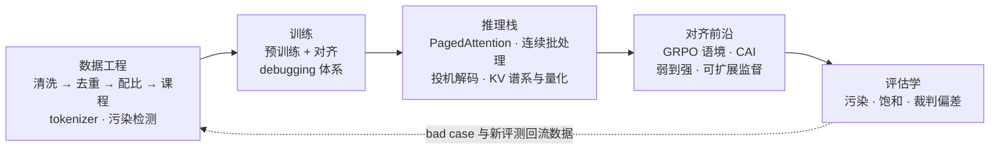
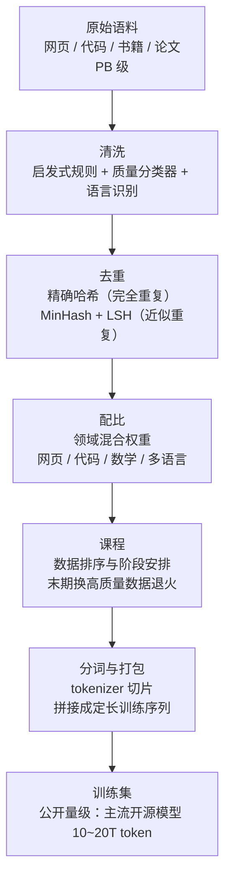
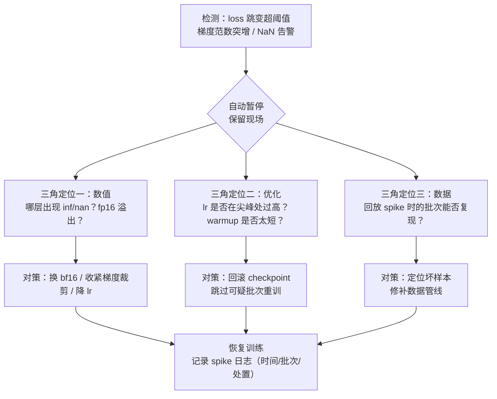
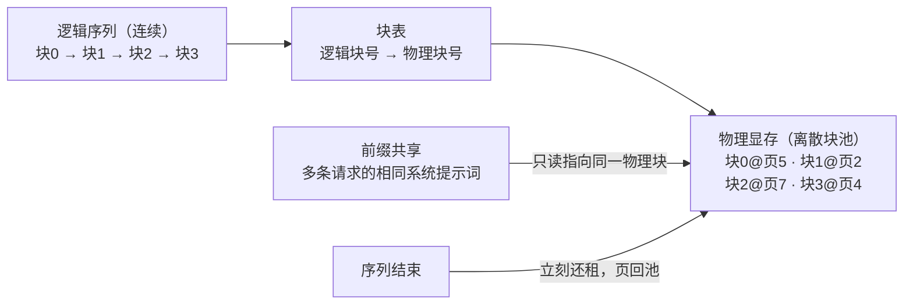
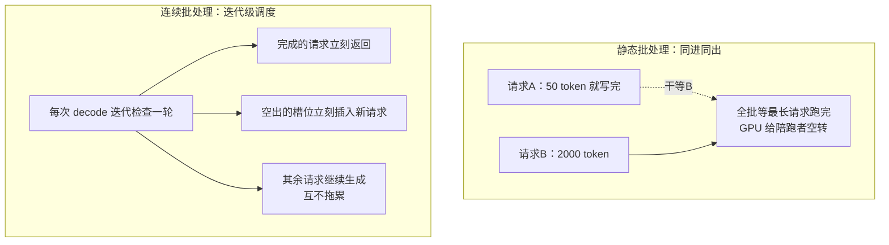
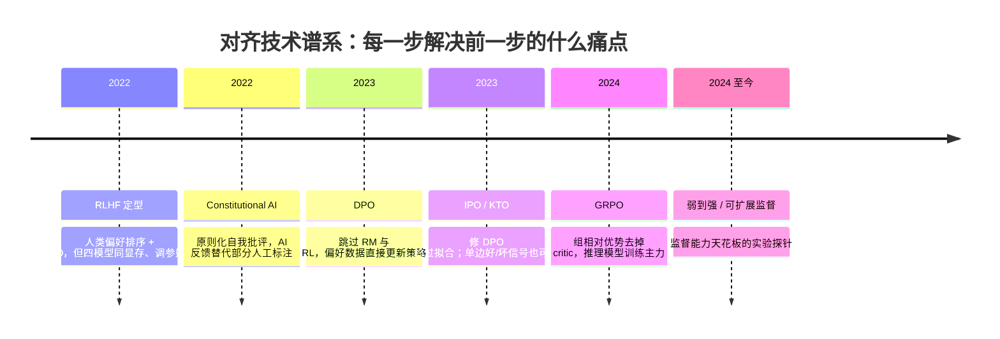
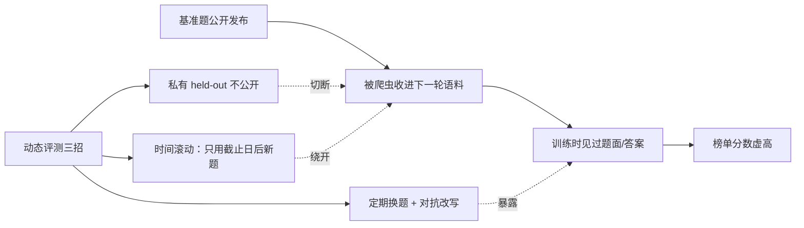

# 进阶专题：LLM 训练与推理全栈

> **一句话理解**：前六页讲的是"模型是什么"，这一页讲"模型是怎么被造出来、怎么被伺候起来的"——数据工程决定模型吃到什么，训练 debugging 决定它能不能长大，推理栈数学决定它一秒能吐几个字，对齐前沿与评估学决定它能不能被信任。

[⬆️ 返回总目录](../../../README.md) · [⬆️ 返回本篇](../README.md) · [⬅️ 返回本章目录](./README.md)

| 属性 | 说明 |
|------|------|
| 难度 | ⭐⭐⭐⭐（高阶） |
| 所属分支 | NLP与LLM |
| 前置知识 | [Transformer 架构细节与变体](./03-Transformer架构细节与变体.md)、[大语言模型 LLM 全景](./04-大语言模型LLM全景.md)、[微调与对齐](./05-微调与对齐.md) |

---

## 📌 这一节解决什么问题

前面六页把 LLM 的"用户视角"讲完了：它怎么表示语言、怎么生成、怎么对齐、怎么外挂知识。但真正动手造一个模型（或深入理解行业动向），你会在四个地方撞墙：

1. **数据工程**：行业共识是"预训练质量的大头在数据管线"——清洗、去重、配比、tokenizer 设计、污染检测，每一步都是"论文一句话、工程三个月"；
2. **训练 debugging**：从零预训练一个模型，loss 尖刺（Loss Spike）、梯度爆炸、NaN 是日常而不是事故——需要一套成建制的处置流程，而不是"重启大法"；
3. **推理栈**：同样的模型，朴素实现与生产级推理框架的吞吐能差一个数量级——PagedAttention、连续批处理（Continuous Batching）、投机解码（Speculative Decoding）、KV 侧的 MQA/GQA/MLA 谱系，每一项都有可推导的数学；
4. **对齐前沿与评估学**：GRPO 之后的对齐在往哪走、基准为什么会"虚高"、LLM 裁判的偏差怎么治——这些决定了你对"某某模型又刷屏了"的新闻有没有免疫力。

这一页把它们串成一条全栈流水线：**数据 → 训练 → 推理 → 对齐 → 评估**。每一节都尽量给"可默写的公式 + 可复算的数字"，数字凡属行业量级都标"经验参考"。

## 🌱 通俗理解

把造 LLM 想成开一家大型餐厅：

- **数据工程 = 中央厨房的采购与预处理**：食材（原始网页）里混着烂菜叶（乱码、广告、模板页），要先挑拣（清洗）、再把重复进货的退掉（去重）、按菜谱比例配菜（配比）、决定先上凉菜还是硬菜（课程）；分词器（Tokenizer）则是"把食材切成一口大小"的刀工——切多大，决定了后面每道工序的成本；
- **训练 debugging = 后厨火警系统**：火偶尔窜一下（loss spike）不奇怪，关键是装好传感器（梯度范数监控）、知道哪三种火源最常见（数据坏块 / 数值精度 / 学习率）、以及灭火器放在哪（回滚 checkpoint 跳过坏批次）；
- **推理栈 = 出餐系统**：灶（GPU）很贵，要让每个灶头尽量不空转——PagedAttention 是"把冰箱格子化"（显存按块租借，不整柜预留），连续批处理是"吃完一桌立刻翻台"（不等全餐厅吃完才收台），投机解码是"学徒先炒、大厨验菜"（小模型打草稿、大模型一次确认）；
- **对齐与评估 = 食安与点评体系**：对齐前沿在解决"教后厨做好菜，不靠天天盯"（原则化自我改进、弱监督强模型）；评估学在解决"点评可信吗"（基准被背过题、裁判有偏好）。

一句话：**模型架构（02/03 页）是灶台图纸，这一页是整家店的运营手册。**

## 📋 举个例子

**先看一个"推理栈决定生死"的账**。同一个 7B 模型、128K 上下文，三种伺候法的显存对比（[03 页](./03-Transformer架构细节与变体.md)已推导 KV Cache 公式，这里换算成"能同时服务几个用户"）：

| 伺候法 | 每 token KV 显存 | 128K 上下文单用户 | 24GB 消费卡单卡能服务几路 128K |
|--------|-----------------|------------------|------------------------------|
| MHA + fp16（裸奔） | 0.5 MB | 64 GB | 0 路（放不下） |
| GQA-8 + int8 量化 | 0.0625 MB | 8 GB | 约 2 路（还要扣掉权重） |
| GQA-8 + int8 + PagedAttention | 同上 | 8 GB（但碎片消失，实际能塞满） | 2 路且利用率接近满格 |

> 👉 **人话**：前两行的差别来自**架构选择**（GQA 共享 KV + 量化），第三行的增量来自**显存管理**（分页消除碎片）——模型一个字没变，可服务的流量完全不同。这就是"推理栈是第二训练"的含义。

**再看投机解码的一个小算例**（完整推导在推理栈一节）：草稿模型每步与大模型输出一致的概率（接受率）α = 0.8，一次让草稿连猜 γ = 4 个 token、大模型一次前向全部验证，则平均每次验证能产出约 3.36 个 token——相当于大模型一个字一个字写的 2.4 倍速度（含草稿开销的折算）。而如果草稿很烂（α = 0.5），只能白拿 1.94 个，加速比掉到 1.38×；α 再低就直接负收益。**投机解码的收益对接受率极其敏感**——这是它的命门，也是"小模型必须与大模型分布对齐"这条工程铁律的来源。

<details>
<summary>📊 展开完整算例：α=0.8、γ=4 时 3.36 与 2.4× 的来历</summary>

**每步接受模型**：草稿猜的每个 token，与大模型分布采样的结果一致的概率为 α（严格定义见推理栈一节的推导）。从左到右验证，遇到第一个不一致就停下、由大模型重采样出修正 token；若 4 个全对，大模型还能额外送一个"奖励 token"。

1. 接受 0 个草稿（概率 $1-\alpha = 0.2$）：产出 1 个（修正 token）；
2. 接受 1 个（概率 $\alpha(1-\alpha) = 0.16$）：产出 2 个；
3. 接受 2 个（概率 $\alpha^2(1-\alpha) = 0.128$）：产出 3 个；
4. 接受 3 个（概率 $\alpha^3(1-\alpha) = 0.1024$）：产出 4 个；
5. 接受全部 4 个（概率 $\alpha^4 = 0.4096$）：产出 5 个（4 草稿 + 1 奖励）。

期望产出 $= 1\times0.2 + 2\times0.16 + 3\times0.128 + 4\times0.1024 + 5\times0.4096 = 3.3616 \approx 3.36$（正是公式 $(1-\alpha^{\gamma+1})/(1-\alpha)$ 的值）。

**折算加速比**：设草稿每 token 前向成本是大模型的 $c = 0.1$（7B 草稿配 70B 主力之类的比例，经验参考），一次迭代总成本 $= 1 + \gamma c = 1.4$ 个"大模型前向"。每大模型前向产出 $3.36/1.4 \approx 2.4$ 个 token——对比朴素解码的 1 个，**理论加速约 2.4×**。实际还受批处理调度与草稿模型加载的工程损耗影响（经验：实际拿到理论值的六到八成已属优秀，经验参考）。

</details>

## 🧠 核心原理

### 全栈总览



五段不是并列关系而是闭环：评估暴露的问题回流到数据与训练，推理栈的成本约束反过来影响数据（token 效率）与对齐（β 的定价）决策。

---

## ① 数据工程：模型的"食谱"

### 预训练数据管线



四道工序各自的"为什么"：

- **清洗（Cleaning）**：常见规则三类——启发式（文档长度上下限、重复行占比、符号/文字比、平均句长）、模型式（用高质量语料训一个质量分类器给每篇文档打分）、语言识别（过滤目标外语言）。公开量级：原始网页 PB 级，逐层过滤后留存的常是百分之几的量级（经验参考）——**漏斗每层都可能丢掉一半以上，丢掉的大多是重复与模板**；
- **去重（Deduplication）**：精确去重用哈希；近似去重用 MinHash（最小哈希，把文档压成一组指纹签名）+ LSH（Locality Sensitive Hashing，局部敏感哈希，把相似文档聚到同一桶）。为什么要做：重复数据会强化**逐字记忆**——有公开研究（Lee et al., 2021）系统证明去重能降 loss、减少训练数据被逐字复述的风险；经验上去重常移除"看似可用"数据的两到五成（经验参考）；
- **配比（Mixture / 配比实验）**：各领域数据按权重混合。为什么关键：代码与数学数据的占比被广泛认为对推理能力有正迁移（多项公开技术报告的共同观察），网页占比过高则聊天味浓而推理弱。为什么难：配比空间是组合爆炸的，**公开做法是用小模型做配比消融实验，选中后再放大到大模型**——小模型上 loss 曲线对配比的偏好，大体能外推；
- **课程（Curriculum, 课程学习）**：训练末期（学习率退火阶段）换用更高质量、更贴近目标分布的数据——多家公开技术报告提到这一"末期提质"操作带来可观收益（经验参考，具体配比各家保密）。一句话直觉：**低 lr 阶段喂什么，模型最后记住的就是什么**。

<details>
<summary>🧮 展开看：MinHash 为什么能估相似度（手算玩具版）</summary>

MinHash 的核心定理一句话：**两个集合的 MinHash 相等的概率 = 它们的 Jaccard 相似度**。手算一遍（数字为玩具数字）：

设文档 A 的词对（2-gram）集合 = {the cat, cat sat}，文档 B = {the cat, cat ran}。

1. **真实 Jaccard**：交集 = {the cat}（1 个），并集 = {the cat, cat sat, cat ran}（3 个），$J = 1/3 \approx 0.33$；
2. **第一个哈希函数 h**（玩具取值）：h(the cat)=2, h(cat sat)=5, h(cat ran)=3 → A 的 MinHash = min{2,5} = 2，B 的 = min{2,3} = 2 → **相等**；
3. **第二个哈希函数 h'**（玩具取值）：h'(the cat)=4, h'(cat sat)=1, h'(cat ran)=6 → A 的 = min{4,1} = 1，B 的 = min{4,6} = 4 → **不等**；
4. **估计**：两个哈希里 1 个相等，估计 $\hat{J} = 1/2$——与真值 0.33 有偏差，因为只用了 2 个哈希；用 k 个哈希的"相等比例"是 Jaccard 的**无偏估计**，标准差随 k 增大而缩小。

LSH 接在 MinHash 之后：把 k 个签名切成若干**带（band）**，两文档任一带完全相同就视为候选对——用"多个弱信号取或"把海量文档对中可能相似的一小撮先筛出来，再精确算 Jaccard。工程量级：亿级文档的去重管线靠的就是"MinHash 签名（快）+ LSH 分桶（省）"这对组合（通用做法，经验参考）。

</details>

### Tokenizer 设计的取舍：词表大小的三笔账

[04 页](./04-大语言模型LLM全景.md)讲了 BPE 的合并原理；工程上的核心抉择是**词表大小（Vocab Size）**。三笔账：

| 账本 | 小词表（如 3.2 万，Llama 2 级） | 大词表（如 12.8 万~15 万，Llama 3 / Qwen 级） |
|------|--------------------------------|----------------------------------------------|
| 压缩率（fertility，每字/词平均 token 数） | 差：同一段文本 token 更多 → 推理 FLOPs 与上下文占用都更高 | 好：高频组合整词入表，token 数显著下降 |
| Embedding 参数 | 省：$V \times d$，V=3.2 万、d=4096 时约 0.13B | 贵：V=12.8 万时约 0.53B（词嵌入共享可省一份，见 [03 页深问](./03-Transformer架构细节与变体.md)） |
| 低频 token 质量 | 高频 token 训练充分 | 长尾 token 训练不足，学不出好表示、还占推理词表 |

> 👉 **人话**：词表是"一次性预付 vs 按量付费"的选择——大词表多付一份 embedding 参数（预付），换每条文本更少的 token（此后每次推理都省）。**推理流量大的模型，大词表几乎总是划算**；这也是 2023 年后主流开源模型词表从 3 万级跳到 13~15 万级的公开动因（数字为公开架构参数）。

**中文与代码的 vocab 设计**（两类"结构性需求"）：

- **中文**：必须保证常用汉字整字入表（GB2312 收录的 6763 个常用字是经典底线），再给高频双字词留条目；否则退回字节级切分，一个汉字变 2~3 个 token——[04 页](./04-大语言模型LLM全景.md)的 tiktokenizer 实验展示了这种劣势。更深一层：**词表分配是零和的**——给中文多留条目就挤占代码/其他语言的空间，多语言模型的词表是"按语料配比 + 目标市场"谈判出来的；
- **代码**：三个特殊需求——缩进与连续空格要有专门 token（代码结构信息的载体，切碎等于撕毁排版）；标识符切分要稳定（同一个变量名在各处切法一致，模型才认得出"这是同一个名字"）；数字常按 1~3 位分组入表（避免同一个数值有十种切法、模型学不到数字的组合结构，通用做法）。

### 数据污染检测（Data Contamination）

**污染**指评测基准的题目（或其改写）混进了训练语料——模型是"背过答案"而不是"会做题"。检测三招：

| 方法 | 做法 | 能抓到 | 抓不到 |
|------|------|--------|--------|
| n-gram 重叠 | 基准题与语料做 8~13-gram 重叠扫描（GPT-3 公开用 13-gram；长度越短越激进、误报越多） | 原文照抄 | 改写、翻译 |
| 嵌入近邻 | 用 embedding 检索语料中与基准题语义最近邻的文档，人工审高风险样本 | 同义改写 | 融合式"学过解题思路" |
| 时间切分 | 只用"基准发布日期之前"的语料快照训练 | 一劳永逸 | 基准发布后被爬虫二次收进语料（越是流行的基准越容易"回锅"） |

工程现实：大训练集的完全去污（Decontamination）成本极高，各家公开报告的去污强度不一——**跨模型比较基准分数时，"是否认真去污"本身就是最大的混淆变量之一**（评估学一节展开）。

---

## ② 训练 debugging 体系：与 loss spike 共存

### Loss Spike 处置流程

从零预训练大模型，loss 突然飙升（或 NaN）是**常态**而非事故——处理它的纪律比"消灭它"更现实：



流程的核心是**"回滚 + 跳过"而不是"硬扛"**：从 spike 前的健康 checkpoint 重启、跳过（或稀释）可疑批次，是大规模训练的公开标准操作；硬扛往往导致 loss 长期回不到原曲线。spike 日志（何时、哪个批次、什么处置、效果）是团队最重要的隐性资产——同样的坑踩第二次就是事故（经验参考，行业通行做法）。

### 梯度异常三角：三个观测点交叉定位

| 观测点 | 看什么 | 指向 |
|--------|--------|------|
| **梯度范数** | 全局范数曲线：突增（数据/激活爆炸）还是归零（梯度消失/除零） | 优化器与学习率层面 |
| **NaN/Inf 分布** | 哪一层、哪个算子先出现；batch 维还是特征维 | 数值精度层面 |
| **数据坏块** | 固定批次重放能否复现 spike；逐样本二分定位 | 数据管线层面 |

交叉判读示例：NaN 固定出现在某一层且**换数据不消失** → 数值问题（精度/初始化）；spike **固定批次重放必现** → 数据坏块（超长重复文本、乱码、异常值样本）；**随机出现且梯度范数先于 loss 爆** → 学习率/优化器问题居多。三角齐备，绝大多数异常能在半小时内定位（经验参考）。

<details>
<summary>📋 展开看：spike 日志字段模板与坏样本二分定位</summary>

**spike 日志**（团队最重要的隐性资产，字段最少集）：

- 时间与训练步数 / 所在数据分片与批次号；
- 症状：loss 跳变幅度、NaN 首发的层与算子、梯度范数曲线截图链接；
- 定位结论：数值 / 优化 / 数据（三角判读结果写清依据）；
- 处置：回滚到的 checkpoint、跳过的批次范围、lr 或梯度裁剪的改动；
- 效果：恢复后 loss 是否回到原曲线（没回去的标红——这类 spike 通常还会复发）。

**坏样本二分定位**（"固定批次重放必现"时的标准操作）：

1. 把该批次按样本序号对半切，分别重放 → 保留会复现的那一半；
2. 递归对半，约 $\log_2 N$ 次重放即可锁定单样本——2048 条样本只需 11 次；
3. 肉审锁定样本：超长重复、乱码、异常字符、超纲数值是最常见四类；
4. 修法分级：能补数据管线规则的补规则（治本），只删本条的进黑名单（治标，同类问题会换条样本再来）。

</details>

### 微调 vs 预训练的 debug 差异

| 维度 | 预训练 | 微调（SFT/LoRA） |
|------|--------|------------------|
| 主要信号 | **训练 loss 本身**（长程平滑，可作健康度主指标） | **评估集效果**（loss 正常 ≠ 行为正常，见下） |
| 高频故障 | loss spike、发散、平台 | 不学（模板不一致）、过拟合（train 降 eval 升）、灾难性遗忘 |
| 高频原因 | lr 计划、坏数据、数值精度 | 提示模板与上线不一致、数据太少/太脏、lr 过大 |
| 回滚成本 | 高（checkpoint 与重算都贵） | 低（LoRA 补丁可扔了重训） |
| 最容易被骗的地方 | "loss 在降"但数据重复导致记忆化（去重不达标） | "loss 在降"但模型在背答案（评估集泄漏进训练集） |

最关键的一条差异：**微调场景里，训练 loss 是弱信号**——数据格式 bug（模板字段错位、截断）完全不影响 loss 下降，却会把行为毁得一塌糊涂；所以微调的 debug 主战场在"输入样本逐条目检 + 通用 held-out 对照"（[05 页](./05-微调与对齐.md)的遗忘诊断），不在 loss 曲线。

---

## ③ 推理栈数学：吞吐与显存的经济学

### PagedAttention：把 KV Cache 的"碎片"还给操作系统

**问题**：KV Cache 必须按"可能的最长序列"**连续预留**显存。假设每请求预留 2048 token 的连续空间，而多数请求实际只用到 512——**内部碎片**（预留未用）立刻浪费四分之三；再加上反复分配/释放造成的**外部碎片**（显存里有总量够但不连续的空洞，新请求放不进去）。vLLM 论文（Kwon et al., 2023）给出公开数字：传统实现的 KV Cache 浪费常达 **60%~80%**。

**方案**：照搬操作系统的虚拟内存——把 KV Cache 切成固定大小的**块（Block，典型 16 token/块）**，每个序列的逻辑顺序通过一张**块表**映射到物理上离散的块。序列变长就再租一块，变短（结束）就立刻还租——两类碎片同时消失（论文公开口径：浪费降到 4% 以下）。附带红利：**前缀共享**——同一段系统提示词/共享前缀的多个请求（并行采样、beam search、多路 Agent 提示）可以指向同一组物理块，只读不写。



块表之外还有一个容易被忽略的工程收益：**显存预算成了可运营的量**——"还能接几个请求"从猜测变成查表（剩余块数 × 块大小），排队与抢占（preemption，把低优先序列的块换出）因此可编程。这也是 [99 页](./99-生产实战.md)里"自部署吞吐翻几倍"的机制来源。

> 👉 **人话**：把"每桌客人必须包一个最大的包间"改成"按人头拼桌、走了立刻翻台"——餐厅（显存）没变大，但翻台率（吞吐）天差地别。

### 连续批处理（Continuous Batching）：迭代级调度

**静态批处理**的问题：一个 batch 里所有请求同进同出——生成 50 token 的短请求必须等生成 2000 token 的长请求跑完，整批 GPU 在给"陪跑者"空转。**连续批处理**（Orca 论文提出，业界称 iteration-level scheduling，迭代级调度）把调度粒度从"整个请求"降到"一次解码迭代"：每生成一个 token 就检查一遍——完成的请求立刻返回、新请求立刻插入，长短请求互相不再拖累。



还有一个实现层细节决定成败：**prefill 与 decode 的混排**。新请求插入时要先对长输入做预填充（prefill，计算重、一次完成），老请求每步只做轻量解码（decode，访存重、逐 token）——连续批处理框架要把这两类负载合理交织（例如按 token 预算限制每步混入的 prefill 量），否则新请求的预填充会周期性卡住所有人的解码延迟。这是"吞吐与尾延迟"的经典权衡，被参数化成推理引擎的调度配置（通用做法，经验参考）。

吞吐增益的量级（经验参考）：静态批处理下 GPU 有效利用率常低于两成，连续批处理配合 PagedAttention 能把利用率推到七成以上，**吞吐提升数倍到一个数量级**（Orca 论文公开报告过接近一个数量级的场景）。这就是 [99 页生产实战](./99-生产实战.md)里 vLLM 成为自部署事实标准的两块基石（另一块是量化）。

### 投机解码（Speculative Decoding）：draft-verify 的无损加速

**机制**：小模型（Draft Model，草稿）先自回归连猜 γ 个 token，大模型（Target，目标）**一次并行前向**同时验证这 γ 个位置；从左到右接受最长正确前缀，在第一个分歧处按大模型分布重采样修正。数学上可证明：**输出分布与"大模型单独一个字一个字写"完全一致**——这是"无损加速"，不是近似（Leviathan et al., 2023；Chen et al., 2023）。

期望产出（每步接受率 α 假设恒定，完整推导见下方折叠）：

$$
\mathbb{E}[T] = \frac{1-\alpha^{\gamma+1}}{1-\alpha}
$$

> 👉 **人话**：每次"大厨验菜"平均能确认并端出 $(1-\alpha^{\gamma+1})/(1-\alpha)$ 个菜——接受率越高、草稿越长，白拿的越多；α→1 时趋近 γ+1（全对还送一个），α 低时趋近 1（白忙一场）。

<details>
<summary>🧮 展开推导：期望产出公式的三行证明与加速比模型</summary>

**记号**：草稿每个 token 被接受的概率为 α（与大模型分布采样的重合度，正式定义是对齐后的接受概率）；接受过程从左到右，第一个被拒处由大模型重采样——无论拒在哪，**该位置仍产出 1 个 token**（修正 token）；全部接受时大模型再送 1 个奖励 token。

**第一步（接受数的尾部求和）**：设被接受的草稿数为 $A \in \{0,1,\dots,\gamma\}$。用尾部概率求和公式 $\mathbb{E}[A] = \sum_{k=1}^{\gamma} P(A \ge k)$，而"至少接受 k 个"需要前 k 个全对，即 $P(A\ge k) = \alpha^k$，所以：

$$
\mathbb{E}[A] = \alpha + \alpha^2 + \dots + \alpha^{\gamma} = \frac{\alpha(1-\alpha^{\gamma})}{1-\alpha}
$$

**第二步（加 1）**：无论接受多少个，总产出都是 $A+1$（被拒处的修正 token 或全对时的奖励 token），故：

$$
\mathbb{E}[T] = \mathbb{E}[A] + 1 = \frac{\alpha(1-\alpha^{\gamma})}{1-\alpha} + \frac{1-\alpha}{1-\alpha} = \frac{1-\alpha^{\gamma+1}}{1-\alpha}
$$

**第三步（加速比模型）**：设草稿每 token 前向成本为大模型的 c 倍，一次迭代成本 = $1 + \gamma c$ 个大模型前向，产出 $\mathbb{E}[T]$ 个 token；朴素大模型解码每 1 个前向产出 1 个 token。故：

$$
\text{加速比} = \frac{\mathbb{E}[T]}{1+\gamma c}
$$

> 👉 **人话**：每次大模型前向的"净产出" = 白拿的 token 数 ÷ 总成本（验证 1 次 + 草稿 γ 次的打折成本）——分子靠接受率，分母靠草稿便宜，两头一起决定赚不赚。

代入本文算例（α=0.8, γ=4, c=0.1）：$3.36/1.4 \approx 2.4\times$；α=0.5 时 $1.94/1.4 \approx 1.38\times$；α=0.3 时 $1.43/1.4 \approx 1.02\times$——**草稿质量跌破某个阈值，投机就从赚变赔**。这也是为什么 draft 模型通常从同一模型家族中选（分布天然更接近，公开实践）。

</details>

**适用边界**：收益集中在**解码阶段（访存受限、算力有富余）**的任务；批处理满载时 GPU 已吃满算力，投机解码的并行验证挤占算力，收益缩水；此外接受率高度依赖内容——分布分歧大的位置（专有名词、数字）接受率显著更低（经验参考）。

### KV 侧注意力谱系与 KV 量化：一张实算表

[02 页](./02-Transformer与注意力机制.md)一句话带过、[03 页](./03-Transformer架构细节与变体.md)实算过 GQA——这里把四代放在一起。统一设定：**7B 级 Dense 模型，L=32 层，32 个查询头，head_dim=128，fp16（2 字节），128K 上下文，batch=1**。

| 方案（代际） | KV 侧设计 | 每 token 缓存 | 128K 总缓存 | 质量与代价（公开口径，经验参考） |
|--------------|-----------|---------------|-------------|--------------------------------|
| MHA（2017，基线） | 每查询头各配 1 组 K/V（32 组） | $2 \times 32 \times 4096 \times 2\text{B} = 0.5$ MB | **64 GB** | 质量基准；长上下文显存不可承受 |
| MQA（2019） | 全部查询头共享 1 组 K/V | $2 \times 1 \times 128 \times 2\text{B} = 512$ B → 32 层共 16 KB | **2 GB** | 缓存省 32×；质量掉点明显（长上下文检索类任务可观测） |
| GQA（2023） | 分组共享：8 组 K/V 服务 32 个查询头 | $2 \times 8 \times 128 \times 2\text{B} = 4$ KB/层 → 0.125 MB | **16 GB** | 省 4×，质量接近 MHA——当前开源标配的甜点 |
| MLA（2024） | K/V 联合压缩进低秩潜在向量（512 维）+ 解耦的 RoPE 键（64 维），缓存的是潜在向量 | $(512+64) \times 2\text{B} = 1152$ B/层 → 36 KB | **4.5 GB** | 省约 14×（对齐本配置），质量接近 MHA；代价：推理时要从潜在向量重投影出 K/V（**用计算换显存**），且要求推理框架专门适配 |

> 👉 **人话**：三代演进做的是同一道题——"少存一点 K/V，但别让注意力变瞎"：MQA 省过头伤了质量，GQA 折中胜出，MLA 用"存压缩包、用时解压"把两头都要了。谱系的下一步没有定论（新的压缩/共享设计仍在涌现），但**记账公式始终是 [03 页](./03-Transformer架构细节与变体.md)那一条**：缓存 = 2 × L × KV 维度 × 精度 × 长度 × batch。

<details>
<summary>🧮 展开看：MLA 的"计算换显存"细节与为什么 RoPE 键要解耦</summary>

**计算换显存**：GQA/MQA 读缓存即用（缓存里就是 K/V 向量）；MLA 缓存的是**低秩潜在向量**，每个注意力层在使用前要先用两个小投影矩阵把它还原成这一层的 K 与 V——多出的这两次矩阵乘就是"解压"的成本。划算的原因：解压是**算力型**开销（GPU 富余），而 KV Cache 是**显存型**开销（GPU 稀缺）——用富余资源换稀缺资源，这笔账在长上下文高并发时尤其划算。

**RoPE 解耦**：RoPE 要求 K 向量按位置旋转（[03 页](./03-Transformer架构细节与变体.md)），而"旋转后的 K"与"潜在向量"线性不同构——若把位置信息压进潜在向量，不同位置的 K 无法从同一向量线性还原。所以 MLA 把"带位置的键"单拎一小路（64 维解耦 RoPE 键）与潜在向量并排缓存：**可共享的进低秩压缩、不可共享的走小通道**。这是"想共享就必须绕开旋转"的一个漂亮工程解，也解释了上表里 (512+64) 这个加法的来历（512 维潜在 + 64 维 RoPE 键）。

</details>

**KV 量化（KV Cache Quantization）**：把缓存的 K/V 从 fp16 压到 int8/int4（带缩放因子），在谱系方案之上再叠 2~4×——上表 GQA 行叠 int8 即 8 GB、叠 int4 即 4 GB。工程细节（经验参考）：K 与 V 的敏感度不同——K 参与打分（误差经 softmax 放大）、V 直接成为输出内容，实践常对 K 用更细的分组粒度（如按通道）、V 用按 token 分组；质量损失通常小于同等位数的权重量化，但**必须在自己的长上下文任务上回归测试**。

---

## ④ 对齐前沿：GRPO 之后往哪走

[05 页](./05-微调与对齐.md)推导了 RLHF 与 DPO；这里按"一句话级"补齐变体地图，再展开三条主线。



**DPO 系变体（各一句话）**：

- **IPO**：DPO 的对数 sigmoid 损失对"偏好差距极大"的样本会无限拉开 log-ratio 导致过拟合，IPO 改用平方损失把这对优化"封顶"——牺牲一点锐度，换稳健；
- **KTO**：不要求成对偏好数据，只要"好/坏"二元信号（点赞点踩这类单边反馈），把对齐建模为前景理论（Prospect Theory）式的效用优化——数据获取成本大幅下降，适合从真实用户反馈直接学。

**Constitutional AI（宪法 AI，原则化自我改进）**：给模型一组成文原则（" Helpful / Harmless / Honest"的具体化条款），让模型**按原则自我批评并改写自己的回答**，再用"AI 反馈替代人类偏好标注"（RLAIF，RL from AI Feedback）完成偏好训练。价值有二：标注成本从人工偏好对降到原则评估；价值观从"隐式藏在标注人群里"变成**显式可审计的文本**。争议也正在于此——**原则由谁写、由谁修订**，是这项技术真正的权力问题。

**Weak-to-Strong Generalization（弱到强泛化，弱监督强模型）**：当被监督者比监督者更强时（人类监督超人类 AI 的预演），用弱模型当"老师"给强模型打标签训练，强模型能否"青出于蓝"？公开初步实验（Burns et al., 2023）的结论两面性：能——强模型普遍超越弱老师；但也没那么乐观——离强模型自监督的想象上限还有明显差距，需要借助中间规模模型过渡、辅助结构等手段补课。它是"对齐可扩展性"（ Scalable Alignment，监督能力天花板问题）最重要的实验探针。

<details>
<summary>📋 展开看：weak-to-strong 的实验设计与两个易误读</summary>

**设计直觉**：弱老师是"训出来"的——先拿一个小模型在受限数据上训到平庸水平，它给训练题打的标签就是"弱监督"；再让强学生（大模型）在这些带噪标签上微调，测强学生能否超过弱老师。

- **为什么"超过老师"并不神秘**：强学生自带更强的预训练先验，面对有噪监督可以"半信半疑地学"——老师对的部分学下来，错的部分用自己的先验盖掉；
- **为什么"超过老师"不等于解决了问题**：关键对照是强学生的**自监督上限**（真标签或自训练能达到的水平）——公开实验里弱监督的强学生离这个上限仍有明显差距，说明监督质量在"老师已到极限"的能力区还是硬约束；
- **第二个易误读**：各种辅助手段（中间规模模型过渡、弱老师辅助对齐中间层等）确能把差距拉小，但每一步都引入新假设——它们是"对齐可扩展性"的候选拼图，不是已完成的证明。

</details>

**可扩展监督（Scalable Oversight，一句话级）**：辩论（Debate）——两个模型就问题互相辩论、人类只当裁判（裁判只需判别力，不需要解题能力）；市场机制——用预测市场式的多方下注聚合判断。两路线都试图"用人类的判别力放大人类的监督力"，均未成熟。

---

## ⑤ 评估学：为什么榜单越来越不可信

### 基准污染与动态评测

污染问题（成因见①数据工程）的评估侧对策：**动态评测**——私有 held-out 题库不公开、定期换题、对题目做对抗性改写（换数字、换实体、换问法）测"背题 vs 会题"；以及**按时间滚动**（只用模型训练截止日期之后新产生的题目测）。污染对"分数差距小"的模型比较是致命混淆——两个相差 2 分的模型，去污后胜负完全可能反转（经验参考，评审文献中的常见现象）。



### 基准饱和（Benchmark Saturation）

老基准分数逼近天花板（饱和）后区分度归零，行业被迫不断滚动出新基准。更深的坑是**格式捷径**：有研究只给选择题选项、不给题干，模型仍能拿到显著高于随机的分数——说明部分"能力分"来自选项分布的统计规律而非知识。**读榜单的正确姿势**：一问是否饱和、二问是否污染、三问测的是能力还是格式。

### 人评 vs LLM 裁判：偏差体系

用 LLM 当裁判（LLM-as-a-Judge）是规模化评估的主流，但它有一张**系统性的偏差清单**（[99 页](./99-生产实战.md)已给校准操作，这里给体系）：

| 偏差 | 表现 | 治理 |
|------|------|------|
| 长度偏差 | 偏爱更长的回答（长≈详尽≈好） | 提示词强制按维度打分；报告中位长度对照 |
| 位置偏差 | 成对比较时偏向排在前面的 | A/B 顺序交换跑两遍，不一致样本剔除或送人 |
| 自我偏好 | 偏爱与自己同源的输出风格 | 裁判模型与被评模型异源、多裁判交叉 |
| 风格偏差 | 格式漂亮（列表、加粗）压过内容正确 | 先理由后分数；关键任务人工抽检 |
| 难度外推 | 裁判只会判"自己会做的题"，难题上的打分接近噪声 | 难题强制双裁判 + 人工仲裁 |

人评是金标准但有反向问题：贵、慢、标注者间一致性有限（[05 页](./05-微调与对齐.md)误区五）——**现实的最优解是"LLM 裁判规模化 + 人工校准抽检"的混合体系**，且一致率指标要当一等公民来汇报（不是藏在附录）。

<details>
<summary>📋 展开看：一页纸的榜单审读清单——拿到任何新分数先过这五问</summary>

1. **饱和了吗**：该基准头部分数离天花板多远？差距小于随机波动量级（经验上 1~2 分，经验参考）时排名基本无意义；
2. **去污了吗**：发布方是否声明去污协议（n-gram / 嵌入近邻 / 时间切分）？协议不同的两家分数不可横比；
3. **测的是能力还是格式**：有没有"只给选项不给题干"式的捷径检查？多项选择占比高的基准尤其要打问号；
4. **谁在当裁判**：LLM 裁判的四类偏差治理了吗（顺序交换、人工一致率抽检）？"自评自家"的数字一律打折；
5. **与我的任务分布差多远**：通用基准的高分对垂直领域（法律、医疗、代码某个子语言）外推有限——最终还是回到[99 页](./99-生产实战.md)那条铁律：**自己的评估集说了算**。

</details>

---

## ⑥ 开放问题（本页收束）

**一、对齐的可扩展性（Scalable Alignment）。** 监督者的能力天花板低于被监督者时怎么办——这是对齐研究"皇冠上的问题"。弱到强泛化给出了"能超越老师"的初步证据，但离"强模型自监督的上限"还很远；可扩展监督的辩论/市场路线都还停留在小规模验证。**当前的诚实结论是：我们还没有被证明够用的方案，只有一批有希望的探针。**

**二、推理时计算（Test-time Compute）与能力涌现的关系。** 2024–2025 最重要的趋势之一：**同一模型在推理阶段投入更多计算——更长的思考链、多次采样择优、搜索式的验证——能在困难任务上大幅提升表现**，构成与"训练规模"正交的第二根 scaling 轴。三种典型形态（各一句话）：

| 形态 | 做法 | 买的什么 |
|------|------|---------|
| 长思考链 | 生成更长的中间推理再作答 | 串行计算深度（[04 页](./04-大语言模型LLM全景.md)CoT 的"量变版"） |
| 多样本采样择优 | 同题多次采样，投票/打分选答案 | 对"单次采样方差"的平均化 |
| 搜索式验证 | 生成-验证-回溯（代码跑通、答案自洽才收） | 用可校验信号过滤错误路径 |

三个已观察到的特性：提升幅度随模型本身能力增长（弱模型多算也涨不动，与 [04 页](./04-大语言模型LLM全景.md)的涌现门槛同构）；它买的正是 CoT 一节说的"串行计算深度"（token 数 × 层数）；训练算力与推理算力存在替代关系（部分能力可以训练时练死，也可以推理时现算）。**未定的问题**：两种算力的最优分配比例、推理时涨起来的能力是否稳定可迁移（换个问法还在不在）、以及"思考得更久"会不会被证明是通向更强能力的通用阶梯——这些直接决定下一代产品的算力账本。

---

## 💻 动手试试

```python
# 依赖：仅标准库（纯本地运行，无需联网）
# 模拟投机解码的 draft-verify 过程，验证期望产出公式 E = (1-a^(g+1))/(1-a)
import random

def speculative_simulate(alpha, gamma, draft_cost, n_iter=200000, seed=42):
    """alpha: 每步接受率; gamma: 草稿长度; draft_cost: 草稿每 token 相对成本"""
    rng = random.Random(seed)
    total_tokens, total_forward = 0, 0.0
    for _ in range(n_iter):
        accepted = 0
        for _ in range(gamma):                 # 从左到右验证 gamma 个草稿
            if rng.random() < alpha:
                accepted += 1                  # 与大模型一致：接受
            else:
                break                          # 分歧即停
        produced = accepted + 1                # 修正 token（或全对时的奖励 token）
        total_tokens += produced
        total_forward += 1 + gamma * draft_cost  # 1 次大模型验证 + gamma 次草稿
    sim_e = total_tokens / n_iter
    theory_e = (1 - alpha ** (gamma + 1)) / (1 - alpha)
    speedup = total_tokens / total_forward     # 每个大模型前向产出的 token 数
    return sim_e, theory_e, speedup

print(f"{'α':>5} {'γ':>3} {'模拟E[T]':>9} {'理论E[T]':>9} {'加速比(每前向产出)':>14}")
for alpha in [0.95, 0.8, 0.5, 0.3]:           # 接受率从好到烂扫一遍
    sim_e, theory_e, sp = speculative_simulate(alpha, gamma=4, draft_cost=0.1)
    print(f"{alpha:>5} {4:>3} {sim_e:>9.3f} {theory_e:>9.3f} {sp:>13.2f}x")

# 预期输出（随机模拟与理论值在小数点后两位内一致）：
#   α=0.95 → E[T]≈4.52，加速 ≈3.23x   草稿很准：白拿 4 个还送 1 个
#   α=0.80 → E[T]≈3.36，加速 ≈2.40x   本文正文算例
#   α=0.50 → E[T]≈1.94，加速 ≈1.39x   收益锐减
#   α=0.30 → E[T]≈1.43，加速 ≈1.02x   几乎白忙——草稿烂时投机解码是负收益

# 🧪 改什么参数、看什么变化：
# 1) draft_cost 从 0.1 调到 0.3（草稿没那么便宜）：所有加速比一起跳水——
#    草稿成本与接受率是投机解码的两道生死线；
# 2) gamma 从 4 调到 8：α=0.95 时 E[T] 趋近 1/0.05=20 上限的一半以上，
#    α=0.5 时收益几乎不动——草稿越长，只有高接受率才吃得到红利；
# 3) 把接受逻辑改成"只接受前两个再看"（gamma=2）：短草稿在高接受率下
#    反而更划算吗？算一遍就知道答案取决于 c 与 α 的组合，没有普适 γ。

# 第二个实验：MinHash 估 Jaccard——去重管线的数学核心（纯标准库）
import hashlib

def shingles(text, k=2):
    """k-gram 集合：中文用 k 字滑窗（等价词对的简化版）"""
    return {text[i:i+k] for i in range(len(text) - k + 1)}

def minhash_sig(s, n_hash=200, seed=0):
    """n_hash 个哈希函数 → n_hash 个最小值 = 签名"""
    sig = []
    for h in range(n_hash):
        vals = [hashlib.md5((str(seed) + str(h) + sh).encode()).hexdigest()
                for sh in s]
        sig.append(min(vals))                     # 每个哈希函数取最小值
    return sig

def est_jaccard(a, b):
    """签名相等位数的比例 = Jaccard 的无偏估计"""
    return sum(x == y for x, y in zip(a, b)) / len(a)

d1 = "年假按工龄五至十五天，入职满一年起享受年假"
d2 = "年假按工龄五至十五天，入职满一年起享年假"       # 近似重复（转载微改）
d3 = "报销发票需在三十天内提交，单程超标需提前审批"     # 无关文档
s1, s2, s3 = shingles(d1), shingles(d2), shingles(d3)
sig1, sig2, sig3 = minhash_sig(s1), minhash_sig(s2), minhash_sig(s3)
print("真值 J(1,2) = %.3f，MinHash 估计 = %.3f" % (
    len(s1 & s2) / len(s1 | s2), est_jaccard(sig1, sig2)))
print("真值 J(1,3) = %.3f，MinHash 估计 = %.3f" % (
    len(s1 & s3) / len(s1 | s3), est_jaccard(sig1, sig3)))
# 预期输出：J(1,2) 估计明显高于 J(1,3)——微改的近似重复被识破，
# 而精确哈希去重对这对文档无能为力（一个字节都不相同）。
# 🧪 改什么参数、看什么变化：
# 1) n_hash 从 200 调到 20：估计值波动变大——签名越长估计越稳，
#    工程上是"签名长度 vs 计算量"的取舍（常见 100~256，经验参考）；
# 2) 给 d2 再多改几个字：真值与估计同步下滑——近似去重的"近似"
#    就藏在这里：改写幅度过大时会漏判，所以去重阈值要按语料调；
# 3) 把 shingles 的 k 从 2 调到 1：短 shingle 让不相关文档也显得相似
#    （单字重叠太多）——k 的选择决定"多像才算像"。
```

## 🔥 炼丹小灶

> 🔥 **炼丹小灶**：全栈三档起点配方——
> - **数据**：先去重再谈质量（MinHash 门槛低收益大）；配比用小模型消融、末期退火换高质量数据；中文语料先查 tokenizer fertility（每字 token 数），超了先换词表再堆数据；
> - **训练**：bf16 优先、梯度裁剪常开、spike 处置预案（回滚+跳批次）开训前写好；微调项目第一件事是逐条目检训练样本的模板与上线一致性；
> - **推理**：自部署先上连续批处理 + PagedAttention（现成框架即得），长上下文再上 KV 量化；投机解码先测接受率（同家族小模型），α 低于 0.5 就别上线；
> - ⚠️ 以上是经验参考值，不是圣旨；换模型换流量结构请重新炼。

## 🖱️ 动手玩

> 🕹️ **延伸玩一玩**：[tiktokenizer](https://tiktokenizer.vercel.app)——分别粘贴同一段中文与代码，数 token/字符比：这就是①数据工程"tokenizer 决定 token 效率"的亲手实验；再对比不同模型的词表档位（3 万级 vs 15 万级）的切分差异，直观感受"词表大小的三笔账"。

## 🔗 在知识树中的位置

- **上游**：[Transformer 架构细节与变体](./03-Transformer架构细节与变体.md)（KV Cache 公式与 GQA，是推理栈一节的地基）；[大语言模型 LLM 全景](./04-大语言模型LLM全景.md)（BPE、Scaling Law 与对齐税）；[微调与对齐](./05-微调与对齐.md)（RLHF/DPO 推导，本页对齐前沿的直接前置）。
- **交叉**：[分布式训练与模型规模](../../3-深度学习/04-深度学习基础/04-分布式训练与模型规模.md)（上下文并行是并行谱系的一支）；[推理与部署](../../3-深度学习/04-深度学习基础/05-推理与部署.md)（量化与部署工程总论）；[第 10 章强化学习](../10-强化学习/02-深度强化学习.md)（GRPO 的 PPO 前置）；[第 8 章双塔模型](../08-推荐系统/03-双塔模型与向量召回.md)（嵌入与检索侧的评估同源）。
- **下游**：[99 生产实战](./99-生产实战.md)——本页的推理栈与评估学在生产里怎么落地（vLLM、Ragas、裁判校准的实战版）。

## ⚠️ 常见误区

- **误区一**："投机解码会降低输出质量。" → 数学上无损：验证-接受机制保证输出分布与大模型单独采样完全一致；真正的代价是延迟方差变大与工程复杂度，不是质量。
- **误区二**："去重就是删掉完全一样的文档。" → 完全重复只是冰山一角；近似重复（转载、模板页、小改洗稿）要靠 MinHash+LSH，子串级重复同样影响记忆化——只做精确去重的管线等于没去重。
- **误区三**："词表越大越好。" → 大词表要付 embedding 参数与低频 token 质量的代价；收益（token 数下降）只对**推理流量大**的场景摊得平。词表大小是预算问题，不是品味问题。
- **误区四**："loss spike 说明我的代码有 bug。" → 大规模训练中偶发 spike 是常态，预训练团队的成熟度体现在处置流程（检测-定位-回滚-跳批-复盘），而不是追求零 spike；微调场景则相反——loss 平稳但行为崩坏（模板 bug）才是高频坑。
- **误区五**："LLM 裁判打的分就是标准答案。" → 裁判自带长度/位置/自我/风格四类系统偏差（见⑤偏差表）；没有交换顺序与人工一致率抽检的裁判分数，只能当参考系不能当结算单。

## 📝 小结与自测

**要点回顾**

- 数据工程四道工序：清洗（规则+质量分类器）、去重（精确+MinHash 近似）、配比（小模型消融再放大）、课程（末期退火提质）；tokenizer 的三笔账：压缩率 vs embedding 参数 vs 低频 token 质量，推理流量大则大词表划算；
- 数据污染检测三板斧：n-gram 重叠（抓照抄）、嵌入近邻（抓改写）、时间切分（治本但防不住"回锅"）——榜单比较必须先问去污强度；
- 训练 debug：spike 处置 = 回滚 checkpoint + 跳过坏批次 + 复盘日志；梯度异常三角（范数/NaN 分布/数据坏块）交叉定位；微调的主信号是评估不是 loss（模板 bug 不影响 loss 但毁行为）；
- 推理栈：PagedAttention 用分页+块表消灭内部/外部碎片（公开口径：浪费 60~80% → 4% 以下）；连续批处理把调度降到迭代级，吞吐增益数倍到一个数量级；
- 投机解码：$\mathbb{E}[T] = (1-\alpha^{\gamma+1})/(1-\alpha)$，加速比 = $\mathbb{E}[T]/(1+\gamma c)$；无损（分布不变），生死线是接受率 α 与草稿成本 c；
- KV 谱系实算（7B/128K/batch1）：MHA 64GB → MQA 2GB（伤质量）→ GQA 16GB（甜点）→ MLA 4.5GB（计算换显存）；KV 量化再叠 2~4×，K 的量化粒度要更细（经验）；
- 对齐前沿：IPO 封顶防过拟合、KTO 只需点赞点踩；Constitutional AI 把价值观从标注人群搬到可审计文本（权力问题随之而来）；弱到强泛化是"对齐可扩展性"的探针（能超老师、离上限尚远）；
- 评估学：污染+饱和+格式捷径让老榜单区分度存疑；LLM 裁判偏差四件套（长度/位置/自我/风格）必须配交换顺序+人工一致率抽检；
- 两大开放问题：对齐的可扩展性（尚无被证明够用的方案）；test-time compute 是与训练规模正交的第二根 scaling 轴，其与训练算力的最优分配是 2025 年后的核心问题。

**自测一下**（点击展开答案）

<details>
<summary>问题 1：为什么 PagedAttention 能同时消灭内部碎片和外部碎片？</summary>

内部碎片源于"按最大长度连续预留、实际用不满"——分页后按实际长度逐块租借，用几块租几块，不存在预留未用；外部碎片源于反复分配释放造成显存空洞——块是固定大小的最小分配单位，任何空洞只要装得下一个块就能被复用。一句话：把"变长序列的分配问题"转化为"固定大小块的记账问题"，两类碎片都失去了存在条件。

</details>

<details>
<summary>问题 2：草稿接受率 α=0.6、γ=4、草稿成本 c=0.2 时，投机解码还值得上吗？</summary>

期望产出 $\mathbb{E}[T] = (1-0.6^5)/0.4 = (1-0.0778)/0.4 \approx 2.31$ 个 token；每次迭代成本 $1 + 4\times0.2 = 1.8$ 个大模型前向；加速比 $2.31/1.8 \approx 1.28\times$。只有约三成加速，还要承担延迟方差与双模型部署复杂度——多数场景不值得，除非该服务延迟极不敏感且算力空闲。结论要靠算，不能靠"投机解码就是快"的印象。

</details>

<details>
<summary>问题 3：微调项目上线后行为大乱但训练 loss 一路正常，最可能死在哪一环？</summary>

最可能是"模板不一致"这类格式 bug：训练样本的提示模板与上线模板不逐字一致（字段错位、截断、系统提示词不同），模型认不出任务——这类 bug 不影响 loss 下降（它仍在好好学习"背那些样本"），却彻底改变行为。处置：逐条打印训练样本与上线请求的实际字符串 diff；对照跑通用 held-out（[05 页](./05-微调与对齐.md)遗忘诊断表）。

</details>

<details>
<summary>问题 4：为什么说"榜单分数差 2 分"在污染面前可能毫无意义？</summary>

污染是模型间的混淆变量：若 A 模型训练数据恰好含某基准题目（或其改写），分数含"背题"成分，B 模型干净——两者差距不是能力差而是去污强度差。动态评测（换题、改写、时间滚动）之后，2 分的胜负完全可能反转。所以跨模型比较的先决条件是确认评测协议与去污口径一致，分数本身是最后才看的东西。

</details>

## 📚 延伸阅读

- 论文：Efficient Memory Management for Large Language Model Serving with PagedAttention（vLLM，2023，https://arxiv.org/abs/2309.06180）——PagedAttention 与连续批处理的工程圣经
- 论文：Fast Inference from Transformers via Speculative Decoding（Leviathan et al., 2023，https://arxiv.org/abs/2211.17192）——期望产出公式的原始出处
- 论文：FlashAttention: Fast and Memory-Efficient Exact Attention with IO-Awareness（2022，https://arxiv.org/abs/2205.14135）——IO 感知计算范式的开创者（[02 页](./02-Transformer与注意力机制.md)SOTA 一节的主角）
- 论文：YaRN: Efficient Context Window Extension of Large Language Models（2023，https://arxiv.org/abs/2309.00071）——NTK 感知缩放一族（[03 页](./03-Transformer架构细节与变体.md)）
- 论文：DeepSeek-V2: A Strong, Economical, and Efficient Mixture-of-Experts Language Model（2024，https://arxiv.org/abs/2405.04434）——MLA 的出处与 KV 谱系最新一代
- 论文：DeepSeekMath: Pushing the Limits of Mathematical Reasoning（2024，https://arxiv.org/abs/2402.03300）——GRPO 的出处
- 论文：Weak-to-Strong Generalization（Burns et al., 2023，https://arxiv.org/abs/2312.09390）——对齐可扩展性的实验探针
- 论文：Constitutional AI: Harmlessness from AI Feedback（2022，https://arxiv.org/abs/2212.08073）——原则化自我改进与 RLAIF
- 论文：Deduplicating Training Data Makes Language Models Better（Lee et al., 2021）——去重的系统证据
- 论文：Scaling Laws for Reward Model Overoptimization（Gao et al., 2023）——奖励模型过优化的剪刀差曲线
- 系统：vLLM / SGLang 等开源推理框架文档——本页推理栈一节所有机制的工程实现对照

---

[⬅️ 上一页：RAG 与 Agent](./06-RAG与Agent.md) · [返回本章目录](./README.md) · [下一页：生产实战 ➡️](./99-生产实战.md)
