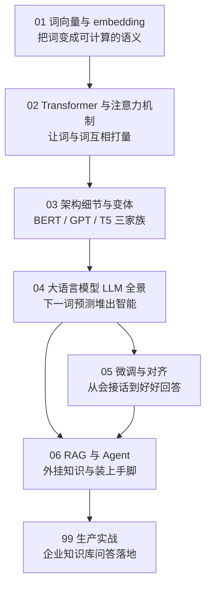
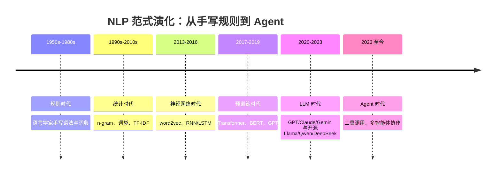

# 第 7 章：自然语言处理与大语言模型 💬（读写）

> 语言是人类信息密度最高、也最难处理的信号：长度不定、充满歧义、还在不断演化。本章从"怎么把一个词变成数字"这个最朴素的问题出发，一路讲到 Transformer、大语言模型（Large Language Model, LLM）、微调与对齐，最后到 RAG 与 Agent。这是全书篇幅最重、也最贴近当下产业浪潮的一章；读完你会发现，每天在用的聊天模型，内核其实是一台极其精密的"下一词预测机器"。

[⬆️ 返回总目录](../../../README.md) · [⬆️ 返回本篇](../README.md)

## 🗺️ 本章知识树

要看懂本章，先看懂 NLP 七十年走过的路——每一代都在回答同一个问题"怎么让机器处理语言"，只是答案从"人写规则"一步步变成了"让模型自己从数据里学"：

## 📖 推荐阅读顺序

| 顺序 | 页面 | 难度 | 一句话说明 |
|------|------|------|-----------|
| 1 | [词向量与 embedding](./01-词向量与embedding.md) | ⭐⭐⭐ | 把词变成向量，"语义"终于可以被计算 |
| 2 | [Transformer 与注意力机制](./02-Transformer与注意力机制.md) | ⭐⭐⭐⭐ | 全书最重要单页之一：注意力到底在算什么 |
| 3 | [Transformer 架构细节与变体](./03-Transformer架构细节与变体.md) | ⭐⭐⭐⭐ | 三大家族、因果掩码、KV Cache 与参数量估算 |
| 4 | [大语言模型 LLM 全景](./04-大语言模型LLM全景.md) | ⭐⭐⭐⭐ | "预测下一个词"怎么堆出通用智能 |
| 5 | [微调与对齐](./05-微调与对齐.md) | ⭐⭐⭐⭐ | SFT、RLHF、DPO、LoRA：从会接话到好好回答 |
| 6 | [RAG 与 Agent](./06-RAG与Agent.md) | ⭐⭐⭐ | 开卷考试与装上手脚：当前应用的两大主线 |
| 收官 | [生产实战](./99-生产实战.md) | ⭐⭐⭐ | 企业知识库问答项目从 0 到 1 |

## 🎯 读完本章你应该能

- 说清 one-hot、词向量、上下文相关表示（注意力输出）三者的区别与递进关系；
- 手算一个 3 词句子的注意力权重矩阵，并解释 Q/K/V 各自在干什么；
- 区分 Encoder-only / Decoder-only / Encoder-Decoder 三家族，能估一个 Decoder-only 模型的参数量级；
- 解释下一词预测、上下文学习、思维链、幻觉这些高频术语背后模型到底做了什么；
- 判断一个业务问题该用提示工程、RAG 还是微调，而不是"无脑上大模型"。

## 🔗 与其他章节的关系

- **前置章节**：[第 4 章：深度学习基础](../../3-深度学习/04-深度学习基础/README.md)——本章所有模型都是神经网络，训练流程与部署都建立在第 4 章之上；其中 [神经网络是怎么炼成的](../../3-深度学习/04-深度学习基础/01-神经网络是怎么炼成的.md) 与 [分布式训练与模型规模](../../3-深度学习/04-深度学习基础/04-分布式训练与模型规模.md) 最常被引用。
- **交叉章节**：[第 10 章：强化学习](../10-强化学习/README.md)——本章 [微调与对齐](./05-微调与对齐.md) 中的 RLHF 直接使用强化学习（尤其是 PPO 算法），看不懂时回第 10 章补课。
- **后续章节**：[第 8 章：推荐系统](../08-推荐系统/README.md)的[双塔模型与向量召回](../08-推荐系统/03-双塔模型与向量召回.md)与本章的 embedding、RAG 是同一套"向量检索"思想；[第 12 章：生成模型与多模态](../../5-前沿与融合/12-生成模型与多模态/README.md)把"万物向量"这条线扩展到图文世界。

---

[⬅️ 上一章：第 6 章：时间序列](../06-时间序列/README.md) · [返回总目录](../../../README.md) · [下一章：第 8 章：推荐系统 ➡️](../08-推荐系统/README.md)
