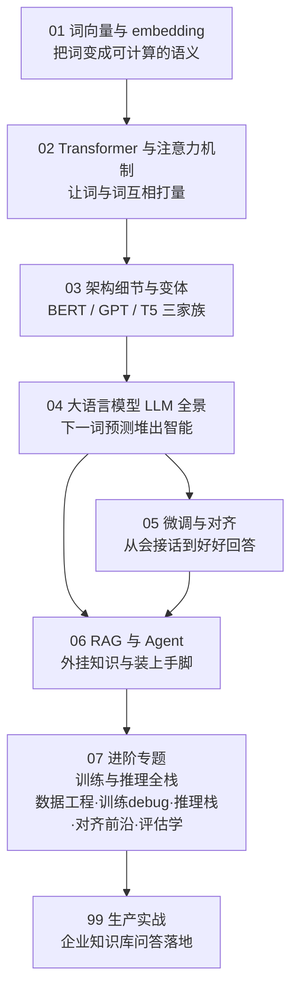
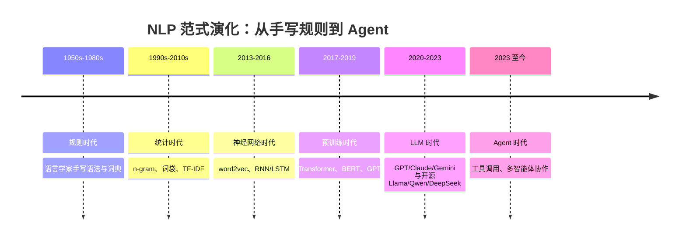

# 第 7 章：自然语言处理与大语言模型 💬（读写）

> 语言是人类信息密度最高、也最难处理的信号：长度不定、充满歧义、还在不断演化。本章从"怎么把一个词变成数字"这个最朴素的问题出发，一路讲到 Transformer、大语言模型（Large Language Model, LLM）、微调与对齐，最后到 RAG 与 Agent。这是全书篇幅最重、也最贴近当下产业浪潮的一章；读完你会发现，每天在用的聊天模型，内核其实是一台极其精密的"下一词预测机器"。
>
> 本章已按"深度标准六条"完成深化：每个关键公式都有可折叠的完整推导，每个方法都讲清"解决了前者的什么痛点"与"什么时候不 work"，算例覆盖正常/极端/失败三种情况——慢读比快刷更划算。

[⬆️ 返回总目录](../../../README.md) · [⬆️ 返回本篇](../README.md)

## 🗺️ 本章知识树

要看懂本章，先看懂 NLP 七十年走过的路——每一代都在回答同一个问题"怎么让机器处理语言"，只是答案从"人写规则"一步步变成了"让模型自己从数据里学"：

## 📖 推荐阅读顺序

| 顺序 | 页面 | 难度 | 一句话说明 |
|------|------|------|-----------|
| 1 | [词向量与 embedding](./01-词向量与embedding.md) | ⭐⭐⭐ | 把词变成向量；含 skip-gram 梯度与负采样（NCE）推导、三大缺陷与"FastText→ELMo→Transformer"演进主线、余弦 vs 欧氏的等价条件 |
| 2 | [Transformer 与注意力机制](./02-Transformer与注意力机制.md) | ⭐⭐⭐⭐ | 全书最重要单页：缩放点积注意力的全矩阵推导（逐步形状标注）、√d 的方差推导、多头切分实质、位置编码"多分辨率时钟"、O(n²) 复杂度与注意力稀释等失效边界 |
| 3 | [Transformer 架构细节与变体](./03-Transformer架构细节与变体.md) | ⭐⭐⭐⭐ | 三大家族、pre-norm vs post-norm、KV Cache 显存公式实算（GQA/量化）、RoPE 与外推、长上下文瓶颈对策、MoE 稀疏激活、12Ld² 参数公式拆解 |
| 4 | [大语言模型 LLM 全景](./04-大语言模型LLM全景.md) | ⭐⭐⭐⭐ | 下一词预测堆出智能：BPE 分词小算例、温度/Top-k/Top-p 的数学与失败现场、幻觉三来源、涌现争议两边观点、ICL 三假说、CoT 的串行计算深度解释 |
| 5 | [微调与对齐](./05-微调与对齐.md) | ⭐⭐⭐⭐ | SFT→RLHF→DPO 全推导（KL 惩罚为什么生死攸关、Z(x) 如何相消）、LoRA 低秩有效的理论与失效场景、灾难性遗忘的诊与治、全参/LoRA/只提示决策表 |
| 6 | [RAG 与 Agent](./06-RAG与Agent.md) | ⭐⭐⭐ | 开卷考试与装上手脚：切块四策略、检索模型的对比学习训练、混合检索与重排两阶段，核心是 **RAG 失败四分类学**（检索/排序/生成/组装）与 Agent 三大规划病 |
| 7 | [进阶专题：LLM 训练与推理全栈](./07-进阶专题-LLM训练与推理全栈.md) | ⭐⭐⭐⭐ | 全栈深水区：数据工程（清洗/去重/配比/tokenizer 三笔账/污染检测）、训练 debugging（loss spike 处置 + 梯度异常三角）、推理栈数学（PagedAttention/连续批处理/投机解码期望公式/KV 谱系 MQA→GQA→MLA 实算）、对齐前沿（IPO/KTO/Constitutional AI/弱到强）、评估学（污染/饱和/裁判偏差体系）与 test-time compute 开放问题 |
| 收官 | [生产实战](./99-生产实战.md) | ⭐⭐⭐ | 企业知识库问答从 0 到 1：评估体系四层面（含 LLM 裁判校准与抽检比例）、成本工程账本、提示注入分层防御、PoC 到生产的五道门 |

## 🎯 读完本章你应该能

- 说清 one-hot、词向量、上下文相关表示（注意力输出）三者的区别与递进关系，并解释词向量三大缺陷分别被谁解决；
- 手算一个 3 词句子的注意力权重矩阵，写得出 X→Q/K/V→scores→softmax→O 的形状链，解释为什么除 √d、多头为什么是切分不是复制；
- 区分 Encoder-only / Decoder-only / Encoder-Decoder 三家族，能估一个 Decoder-only 模型的参数量级与 128K 上下文的 KV Cache 显存；
- 解释下一词预测、上下文学习、思维链、幻觉这些高频术语背后模型到底做了什么，并能说出幻觉三来源各自的缓解手段；
- 推导 RLHF 目标的最优解形式，讲清 DPO 如何跳过奖励模型、LoRA 为什么低秩够用又何时失效；
- 出了 bad case 先用"检索/排序/生成/组装"四分法定位，再决定修数据、修检索还是换模型，而不是无脑换模型；
- 对"训练数据是怎么炼出来的、推理服务是怎么快起来的、榜单为什么虚高"有全栈判断力：能默写 KV Cache 与投机解码的期望产出公式，能说出数据污染、基准饱和与裁判偏差各自的治理手段（进阶专题）。

## 🔗 与其他章节的关系

- **前置章节**：[第 4 章：深度学习基础](../../3-深度学习/04-深度学习基础/README.md)——本章所有模型都是神经网络，训练流程与部署都建立在第 4 章之上；其中 [神经网络是怎么炼成的](../../3-深度学习/04-深度学习基础/01-神经网络是怎么炼成的.md) 与 [分布式训练与模型规模](../../3-深度学习/04-深度学习基础/04-分布式训练与模型规模.md) 最常被引用。
- **交叉章节**：[第 10 章：强化学习](../10-强化学习/README.md)——本章 [微调与对齐](./05-微调与对齐.md) 中的 RLHF 直接使用强化学习（尤其是 PPO 算法），看不懂时回第 10 章补课。
- **后续章节**：[第 8 章：推荐系统](../08-推荐系统/README.md)的[双塔模型与向量召回](../08-推荐系统/03-双塔模型与向量召回.md)与本章的 embedding、RAG 是同一套"向量检索"思想（对比学习与难负例、粗排+精排两阶段完全同构）；[第 12 章：生成模型与多模态](../../5-前沿与融合/12-生成模型与多模态/README.md)把"万物向量"这条线扩展到图文世界。

---

[⬅️ 上一章：第 6 章：时间序列](../06-时间序列/README.md) · [返回总目录](../../../README.md) · [下一章：第 8 章：推荐系统 ➡️](../08-推荐系统/README.md)
