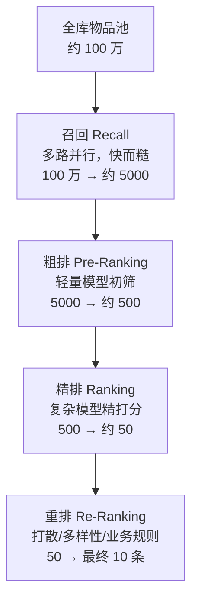
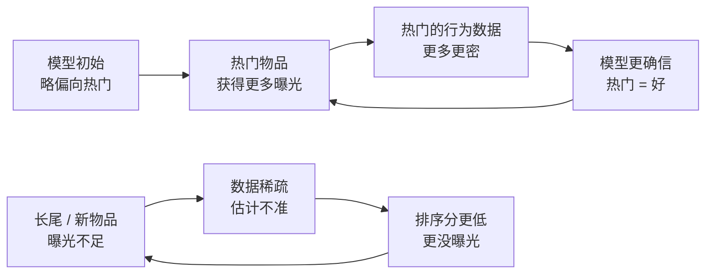

# 推荐系统全景

> **一句话理解**：推荐系统是一条"漏斗流水线"——先用快而糙的办法从百万物品里捞出几千个候选，再用慢而精的模型逐层筛，最终在几百毫秒内排出给你看的那 10 条内容；而它真正的难题，往往不在"打分"，而在分数之外：多样性怎么保、新东西怎么试、反馈闭环怎么不让它跑偏。

[⬆️ 返回总目录](../../../README.md) · [⬆️ 返回本篇](../README.md) · [⬅️ 返回本章目录](./README.md)

| 属性 | 说明 |
|------|------|
| 难度 | ⭐⭐（进阶） |
| 所属分支 | 推荐 |
| 前置知识 | 无 |

---

## 📌 这一节解决什么问题

一个内容平台的物品池可能是百万级的：视频、商品、文章。用户一次刷新只看 10 条，而他的耐心大约只有几百毫秒——总不能把一百万个物品每个都塞进一个大模型里打分，那算一次要几分钟。

在推荐系统出现之前，人们靠两样东西解决"看什么"：**编辑精选**（人工排榜，千人一面）和**热销榜**（卖得好的往前放，强者恒强）。它们没有个性化，也永远发现不了长尾里的好东西。

推荐系统的解法是**分工**：把"从一百万里选十"拆成一条流水线，每一层用不同的模型——越靠前的层看得越多、算得越糙、速度越快；越靠后的层看得越少、算得越精、结构越复杂。这就是贯穿全章的"召回（Recall）→ 排序（Ranking）"漏斗。

但漏斗只是骨架。真实系统还要回答三个打分之外的难题，本章后面几页会反复回到它们：

1. **多个目标打架怎么办**——点击、时长、互动各自排出的顺序不一样，听谁的？
2. **分数最高的一排内容就是最好的列表吗**——10 个都是 0.99 分的篮球视频，用户可能第二条就腻了；
3. **新东西没人点击记录，怎么获得第一次机会**——不试永远不知道，试多了又浪费流量。

## 🌱 通俗理解

把推荐系统想象成一场大型相亲会的筛选流程：

- **召回**像初筛：拿着硬条件（年龄区间、城市）从一万份资料里快速捞出 500 份，标准糙但极快；
- **粗排**像快翻：浏览 500 份资料，扫一眼照片和简介，留下 50 份"眼缘还行"的；
- **精排**像细聊：和这 50 位逐个深聊，比较兴趣、三观，选出最合适的几位；
- **重排**像最终安排：考虑"这三位都是程序员，换掉一个保持多样性""刚见过体育类的，穿插一位艺术类的"，排出最终的见面顺序。

一层比一层慢，一层比一层准。这就是漏斗的本质：**用便宜的计算扛住量，用昂贵的计算保住准**。

再往下想一层：即便精排给出了"最合适的 10 个人"，红娘也不会真按分数从高到低安排——清一色程序员应聘者会让人审美疲劳，偶尔塞进一位"分数中等但背景新鲜"的候选人反而让整场相亲更有看点。**单条最优 ≠ 整列表最优**，这是重排层存在的理由，也是本节后面要展开的主题。

## 📋 举个例子

小明晚上 21:00 打开短视频 App，手指还没离开屏幕，这 300 毫秒里发生了什么：

| 层级 | 物品数变化 | 这一层干了什么 | 大约耗时 |
|------|-----------|---------------|---------|
| 全库物品池 | 1 000 000 | 所有上架视频的向量索引、倒排索引静静躺在内存里 | — |
| 召回（多路并行） | 1 000 000 → 5 000 | 向量召回、协同过滤、关注关系等各路各出几千，合并去重 | ~50 ms |
| 粗排 | 5 000 → 500 | 轻量模型（小网络）给每个候选快打一个分 | ~30 ms |
| 精排 | 500 → 50 | 复杂模型（交叉特征 + 深度网络）精打分 | ~150 ms |
| 重排 | 50 → 10 | 打散同类、插广告位、业务规则，排出最终信息流 | ~20 ms |

小明刷到的 10 条视频，就是这条漏斗 300 毫秒的产物。下一页开始，我们逐层拆开看每一层里的模型长什么样。

<details>
<summary>🔄 展开看：同一个人两次刷新，为什么结果不一样？</summary>

小明 21:00 刷了一次，21:05 又刷新一次，出来的列表大不相同，原因有四类：

1. **打散（Diversity / 去重）**：刚看过的内容会被过滤或降权，同一个创作者、同一话题的连续出现条数有上限——否则你会连刷 10 条同一个博主；
2. **探索（Exploration）**：系统会留出小比例流量（例如 5%~10%）试探你没看过的类目——不试，永远不知道你可能喜欢什么；
3. **实时行为反馈**：你刚点赞了一条美食视频，这个行为毫秒级回流进特征系统，下一次召回立刻偏向美食；
4. **多路召回的随机性**：向量检索的近似算法（下一页详讲）本身带轻微随机，加上各路召回配额轮换，两次结果天然不同。

推荐是"动态对话"，不是"一次算好的静态列表"。

</details>

## 🧠 核心原理

### 整体流程：推荐漏斗



### 逐步拆解：每层在拿什么换什么

- **召回（Recall）**：任务是从百万里"别漏掉好的"，宁可多捞不可漏捞。模型必须极快，所以结构简单（向量相似度、协同过滤、倒排索引多路并行），每个候选只花几微秒；
- **粗排（Pre-Ranking）**：召回的几千个候选还是太多，用轻量模型（往往是精排模型的"缩水版"）先砍到几百，为精排争取时间；
- **精排（Ranking）**：几百个候选逐个用复杂模型精打分——可以用几十上百个特征、特征间交叉、多目标融合，每个候选花约 1 毫秒也花得起；
- **重排（Re-Ranking）**：不再只看单条分数，而是把"这 50 条作为一组"整体考虑：同类打散、控制广告位、插入运营内容。

一条经验律：**延迟预算倒逼架构**。用户可感知的刷新延迟约 300~500 ms（经验参考），扣掉网络和渲染，留给整条漏斗的计算时间常常不到 200 ms——这 200 ms 怎么分，决定了每层模型能做多复杂。

### 延迟预算：每个环节花多少毫秒

把"约 300 ms"拆开看（数字为信息流场景的经验参考，各厂差异很大）：

| 环节 | 预算 | 花在哪 | 超时会怎样 |
|------|------|--------|-----------|
| 客户端渲染 | ~30 ms | 列表排版、图片首帧 | 用户感知"卡" |
| 网络传输 | ~50 ms | 请求上行 + 响应下行（含序列化） | 弱网下首当其冲 |
| 请求入口 / 特征读取 | ~30 ms | 用户画像、实时行为序列从缓存读 | 特征读超时只能用默认值，个性化退化 |
| 多路召回 | ~50 ms | 向量 ANN、倒排查表、合并去重 | 单路超时就丢弃该路结果（不能拖垮整体） |
| 粗排 | ~30 ms | 5000 候选 × 轻量打分 | 超时直接截断保留靠前的 |
| 精排 | ~100~150 ms | 500 候选 × 深度模型，通常并行批处理 | 超时降级到粗排分数 |
| 重排 | ~20 ms | 打散、滑窗规则、混排 | 规则可以简化执行 |
| **合计** | **~300 ms** | | |

这张表解释了三个架构事实：

1. **特征读取和召回共用一个"前 80 ms"**——所以特征必须常驻内存缓存（Redis 类），实时行为序列要提前算好，不能现场扫日志；
2. **每层都有"降级预案"**——精排超时就用粗排分、召回单路挂了就少一路，**宁可推荐质量降一档，不能白屏**；
3. **精排是预算大头**，所以才有"粗排帮它砍数量、蒸馏帮它砍计算"的种种衍生设计（[排序模型](./04-排序模型.md)详讲）。

<details>
<summary>🧮 展开看：一个数字实验——为什么精排不能吃下全部物品</summary>

假设精排模型对单个候选打分耗时 1 ms（已是很快的深度模型）：

- 给 500 个候选打分：500 × 1 ms = 0.5 s —— 勉强能接受（实际会用并行计算压到几十 ms）；
- 给 100 万个候选打分：1 000 000 × 1 ms ≈ 17 分钟 —— 完全不可行。

再假设召回用向量相似度，单个候选只需 0.1 μs 量级的距离计算（配合近似检索的批量优化），扫一遍百万物品可压到几十毫秒。**差 4 个数量级的单次计算成本，就是漏斗必须分层的原因**——不是模型不想统一，是时间不允许。

</details>

### 指标体系：不只是点击率

推荐系统的"北极星指标"因产品而异，常见一篮子指标：

| 维度 | 指标 | 说明 |
|------|------|------|
| 效率 | 点击率（CTR，Click-Through Rate）、转化率（CVR）、完播/停留时长 | 用户"用手指投票"的直接信号 |
| 体验 | 多样性（多样性类目数）、惊喜度（Serendipity）、满意度调研 | 防止短期指标绑架长期体验 |
| 生态 | 覆盖度（被推荐出来的物品占比）、创作者激励分发 | 长尾物品能否被看见、新创作者能否活下来 |

$$
\mathrm{CTR} = \frac{\text{点击次数}}{\text{曝光次数}}
$$

> 👉 **人话**：给你看了 100 次，你点了 3 次，CTR 就是 3%。它衡量"推荐的内容有多戳人"。

**为什么只优化 CTR 会出事？**点击是最容易采集的信号，但标题党、擦边内容天然高点击——模型若只追 CTR，会越来越推"忍不住点但点完就后悔"的内容；同时模型持续推你点过的类目，你的兴趣边界会越收越窄，这就是**信息茧房（Filter Bubble）**。真实系统的对策：多目标融合（把时长、负反馈一起进损失）、多样性重排、给探索留流量、监控覆盖度等生态指标。

### 多目标融合：一篮子指标怎么拧成一股绳

现代精排不只预测点击率，而是同时预测点击、时长、点赞/评论/分享等多个概率，再**融合成一个分数**去排序。最常用的两把工具：

**① 加权融合（线性或幂次）**：

$$
s = w_1 \cdot p_{\text{点击}} + w_2 \cdot f(\text{时长}) + w_3 \cdot p_{\text{互动}}
\qquad\text{或}\qquad
s = p_{\text{点击}}^{\alpha} \cdot p_{\text{时长}}^{\beta} \cdot p_{\text{互动}}^{\gamma}
$$

> 👉 **人话**：加权和就是把几个目标按"话语权"折算成一个总分；幂次连乘版本更柔和——任何一项接近 0 都会重罚总分，逼着模型找"样样都不差"的内容，而不是"一项爆表其他摆烂"的偏科生。

**权重怎么定？**三层递进，工业界的标准路径：

1. **业务先验拍板**：新平台拉活跃，时长权重高；电商平台冲 GMV，转化权重高——先按业务阶段给一版；
2. **离线扫参**：在历史日志上模拟不同权重下的指标组合，剔除明显劣解；
3. **AB 实验微调**：一次只动一个权重（比如 $\beta$ 从 1.0 到 1.2），看在线指标——因为多目标之间常常**此消彼长**，离线模拟很难完全复现线上行为。

**② Pareto 前沿（帕累托前沿，Pareto Front）**：当你调权重时，会得到一堆"点击 ↑ 但时长 ↓"的方案。其中有一组特殊方案：**再想让任何一个指标变好，就必须牺牲另一个**——这组方案连成的边界就叫 Pareto 前沿。

> 👉 **人话**：Pareto 前沿就是"鱼与熊掌不可兼得"的那条边界线。调权重的本质是在这条线上选一个点：往点击挪一点，时长就掉一点。前沿以内的方案（还能同时变好的）都该被淘汰，前沿以外的方案不存在。

**多目标融合的失效边界**：它假设"指标之间的偏好关系稳定"。一旦业务阶段剧变（拉新期转留存期）、或某个目标的建模本身有偏（时长被长视频系统性拉高），权重体系就要推倒重调——所以大平台会把"权重调优"做成可配置参数加 AB 验证的常态机制，而不是一次性决策（[排序模型](./04-排序模型.md)、[生产实战](./99-生产实战.md)继续展开）。

### 重排的多样性：为什么精排分最高的列表未必是好列表

精排给出的是**每条独立**的最高分。但用户看的是**一整个列表**，而"整列表的满意度"不等于"单条分数之和"。三个原因：

1. **边际效用递减**：第 1 条篮球视频很爽，第 5 条就腻了，第 10 条想卸载 App——重复内容的"第二条"价值远低于分数显示的值；
2. **需求是多面的**：用户此刻想放松（喜剧）也想获取信息（科技新闻），单目标分数看不见"组合需求"；
3. **信息茧房的最后一道闸**：召回和排序都被历史行为带偏时，重排的打散规则是流水线里**最后一道**强制多样性的防线。

工业界最经典的多样性重排算法是 **MMR（Maximal Marginal Relevance，最大边际相关性）**：每次从候选里挑下一条时，不选纯分数最高的，而选"分数高 **且** 与已选列表都不像"的那个：

$$
\text{MMR}(i) = \lambda \cdot \text{score}(i) - (1 - \lambda) \cdot \max_{j \in \text{已选列表}} \, \text{sim}(i, j)
$$

> 👉 **人话**：下一条的身价 = $\lambda$ 份"模型觉得你喜欢"减去 $(1-\lambda)$ 份"和你已经刷到的太像"。$\lambda$ 调到 1 就退化成纯分数排序（可能连出 10 条篮球），调到 0.5 左右就开始主动插入类目新鲜的内容。这个减法项就是"审美疲劳税"。

一个直观小例（数字为示意）：

| 候选 | 精排分 | 与已选第 1 条（篮球）的相似度 | $\lambda{=}1.0$ 时排序 | $\lambda{=}0.6$ 时 MMR 分 |
|------|--------|------------------------------|----------------------|--------------------------|
| 篮球 2 | 0.95 | 0.95 | 第 2 名 | 0.6×0.95 − 0.4×0.95 = **0.57** |
| 科技 | 0.80 | 0.10 | 第 3 名 | 0.6×0.80 − 0.4×0.10 = **0.44** |
| 美食 | 0.75 | 0.15 | 第 4 名 | 0.6×0.75 − 0.4×0.15 = **0.39** |

$\lambda{=}1.0$ 时篮球 2 稳压科技；$\lambda{=}0.6$ 时篮球 2 仍领先，但差距从 0.15 缩到 0.13——如果它的相似度再高一点（比如 0.99，同一位博主的同系列视频），MMR 分掉到 0.567，就会被科技反超。**相似度的"惩罚"只在临界时翻盘**，这正是我们想要的：轻度重复可容忍，重度复制被拦截。

MMR 的成立条件与短板：它依赖一个靠谱的**相似度函数**（内容 embedding 余弦、类目/作者重合度）；它是贪心算法，每步只看当前最优，不保证整列表全局最优；滑窗规则（"同作者最多连续 2 条"）这类硬约束通常与 MMR 叠加使用，软硬兼施。

### EE：探索与利用的平衡

推荐系统面对一个多臂老虎机困境（Multi-Armed Bandit）：每个物品是一台"老虎机"，点击率是未知的 payout。

- **只利用（Exploitation）**：永远推估计点击率最高的——短期最优，但估计本身不准：新物品没数据，估计值低，永远没机会被推，也就永远攒不到数据，**死循环**；
- **只探索（Exploration）**：均匀随机推——数据攒得快，但短期指标崩盘，用户卸载。

两种经典平衡策略的直觉：

**① ε-greedy（epsilon 贪心）**：以概率 $1-\epsilon$ 推当前最优的（利用），以小概率 $\epsilon$（如 5%~10%）随机推一个候选（探索）。

> 👉 **人话**：平时点菜都点老三样，但每十次饭里留一次"闭眼盲选"，给没吃过的菜一个翻牌机会。实现一页代码，工业冷启动的默认起步方案；缺点是探索是"无差别随机"，浪费在明显不靠谱的候选上。

**② 汤普森采样（Thompson Sampling）**：对每个候选的点击率维护一个 Beta 分布（点击次数越多、分布越集中；没数据时分布很宽），每次推荐前**从每个候选的分布里各抽一个随机数**，推抽出来的最大者。

> 👉 **人话**：不确定的候选，"手气"波动大——这次抽出 0.02，下次可能抽出 0.15，总有走运的时候被顶上去试一把；数据攒多了，分布收紧、波动变小，回归到真实水平。**不确定性本身就是探索的燃料**：谁没被摸清，谁就自动获得更多试探机会，而不需要人为设定 ε。

| 策略 | 探索从哪来 | 优点 | 短板 |
|------|-----------|------|------|
| ε-greedy | 人为固定的随机比例 | 简单、可控、好解释 | 探索不分对象，浪费流量 |
| 汤普森采样 | 不确定性（分布宽度） | 自动按需探索，新物品天然多试 | 实现与调参更复杂，要维护分布参数 |

EE 的失效边界：探索流量本质是**拿短期指标换长期信息**。如果业务极度在乎短期（大促期间），探索要主动压低；如果物品池更新极快（直播、新闻），探索比例必须抬高，否则新内容永远等不到分发。没有万能常数，只有随业务节奏调的旋钮。

### 反馈闭环：让系统变好的正循环与变坏的负循环

推荐系统最大的特点是：**它的输出（推荐列表）会变成它的输入（训练数据）**。这把双刃剑叫反馈闭环（Feedback Loop）。

**正循环（飞轮）**：推荐准 → 用户互动多 → 行为数据更多更细 → 模型更准。系统启动时数据越多，飞轮转得越快——这是推荐系统强者恒强的底层原因。

**负循环（马太效应，Matthew Effect）**：同一个机制跑偏了就是灾难链条：



> 👉 **人话**：头部物品在"曝光→数据→更高分→更多曝光"的环里滚雪球，越热越推、越推越热；长尾和新物品在"没曝光→没数据→分低→更没曝光"的环里饿死。两个环都是反馈闭环，一个成就平台，一个杀死生态——成因是同一个：**模型只看得见被曝光过的东西**。

**怎么诊断马太效应已经过度？**看三个信号：

1. **曝光基尼系数**（头部 1% 物品拿走的曝光占比）持续上升；
2. **新物品冷启动存活率**（上架 7 天后日曝光仍超过阈值的比例）持续下降；
3. **推荐列表多样性**（人均单次刷新类目数）持续走低。

**缓解手段**（正交，可叠加）：

- **曝光去偏**：训练时对物品按曝光频率做负样本加权修正，抵消"热门=常见负样本"的统计偏差（[双塔页](./03-双塔模型与向量召回.md)的 logQ 纠偏）；
- **流量扶持池**：给新物品保底曝光量，攒够数据再进正式赛跑（[生产实战](./99-生产实战.md)）；
- **EE 探索流量**：上文 ε-greedy / 汤普森采样，制度化地给"不确定"留机会；
- **生态护栏指标**：把覆盖度、新创作者存活率放进 AB 实验的一票否决线——算法同学优化模型时绕不过去。

### 一句话辨析：推荐 vs 搜索 vs 广告

| | 搜索 | 推荐 | 广告 |
|------|------|------|------|
| 一句话 | 用户**主动**说需求，系统匹配 | 系统**猜测**需求，主动推送 | 出资方**付费**买展示位 |
| 优化目标 | 结果与查询的相关性 | 用户长期价值（时长/留存/GMV） | 平台收入 × 用户体验的平衡 |

三者技术栈高度重叠（都是"检索 + 排序"漏斗），推荐与搜索的边界正随"搜索结果页混排推荐内容"逐渐模糊。

## 💻 动手试试

```python
# 最小漏斗 + MMR 多样性重排模拟：感受"每层数量骤降"和"λ 如何改变列表口味"
import numpy as np

np.random.seed(0)
n_items = 1_000_000                    # 全库 100 万个物品
scores = np.random.rand(n_items)       # 每个物品一个"匹配分"（模拟召回快打分）

recall_top = np.argsort(scores)[-5000:]   # 召回：留 5000（快而糙）
coarse_top  = recall_top[np.argsort(scores[recall_top])[-500:]]  # 粗排：留 500
fine_top    = coarse_top[np.argsort(scores[coarse_top])[-50:]]   # 精排：留 50
final_list  = fine_top[::-1]           # 重排后输出前 10
print("漏斗数量:", n_items, "→", len(recall_top), "→", len(coarse_top), "→", len(fine_top), "→", len(final_list))
# 预期输出：漏斗数量: 1000000 → 5000 → 500 → 50 → 10

# ---- MMR 重排演示：50 个候选，每个属于一个类目，同类别相似度 0.9、跨类别 0.1 ----
n_cand = 50
cand_score = np.random.rand(n_cand)                        # 模拟精排分
cand_cat   = np.random.randint(0, 5, n_cand)               # 5 个类目
def sim(i, j):                                             # 相似度：同类 0.9，异类 0.1
    return 0.9 if cand_cat[i] == cand_cat[j] else 0.1

def mmr(lam, k=10):
    """MMR 贪心选 k 条：λ=1 退化为纯分数排序"""
    selected = []
    rest = list(range(n_cand))
    while len(selected) < k:
        # MMR 分 = λ×精排分 − (1−λ)×与已选列表的最大相似度
        best = max(rest, key=lambda i: lam * cand_score[i]
                   - (1 - lam) * max((sim(i, j) for j in selected), default=0.0))
        selected.append(best)
        rest.remove(best)
    return selected

for lam in [1.0, 0.6]:
    sel = mmr(lam)
    cats = [cand_cat[i] for i in sel]
    print(f"λ={lam}: 前 10 条的类目序列 = {cats}, 覆盖类目数 = {len(set(cats))}")
# 预期输出（随机种子固定，数值可复现）：
# λ=1.0: 覆盖类目数通常 3~4 个，且常常出现同类连排
# λ=0.6: 覆盖类目数趋近 5 个（全部），同类连排明显减少
#
# 🧪 实验建议：
# 1) 把 λ 从 1.0 逐步降到 0.4，观察覆盖类目数上升、但选中候选的平均精排分下降
#    ——这就是"多样性 vs 短期分数"的直观权衡；
# 2) 把 sim() 里同类相似度从 0.9 改成 0.99（模拟"同一博主同系列视频"），
#    观察 λ=0.6 时惩罚项更狠、同类更难连排；
# 3) 把 n_cand 从 50 改成 500，观察 MMR 的贪心循环变慢——它是 O(k×n) 的，
#    这也是真实系统只用它排最后几十条、不排全量候选的原因。
```

## 🔥 炼丹小灶

> 🔥 **炼丹小灶**：工业界的延迟预算参考——
> - 配方：总预算 ~300 ms，网络与渲染 ~100 ms；召回 ~50 ms、粗排 ~30 ms、精排 ~100~150 ms、重排 ~20 ms（经验参考，各厂不同）；多样性 λ 从 0.5~0.7 起步；探索流量 5%~10% 起步，新物品扶持另算；
> - 玄学：精排超时先砍特征数而不是砍模型层数；召回永远要多路冗余，单路挂了系统不能挂；多样性 λ 调太大用户会抱怨"猜不透我"，调太小会连刷同款——拿 AB 里的负反馈率当指南针；
> - ⚠️ 以上是经验参考值，不是圣旨；换业务请重新压测。

## 🖱️ 动手玩

> 🕹️ **延伸玩一玩**：[Embedding Projector](https://projector.tensorflow.org)——推荐系统里的"相似度"都发生在向量空间里，亲手转一转高维向量的二维投影，体会"MMR 惩罚的 sim(i,j) 到底在量什么"。

## 🔗 在知识树中的位置

- **上游**：[机器学习全景](../../2-经典机器学习/03-机器学习/01-机器学习全景.md)——推荐是机器学习最典型的工业应用场景之一；
- **下游**：[协同过滤与矩阵分解](./02-协同过滤与矩阵分解.md)（召回的起点）、[排序模型](./04-排序模型.md)（精排与多目标的深化）；
- **横向对比**：与[时间序列](../06-时间序列/README.md)同样研究用户行为，但推荐关心"此刻匹配什么"，时序关心"未来发生什么"；反馈闭环的"输出变输入"与[强化学习](../10-强化学习/README.md)的"行动影响观测"同构，EE 问题正是从强化学习借来的弹药。

## ⚠️ 常见误区

- **误区一**：推荐系统 = 一个大模型 → 它是一条流水线，由几十个模型、索引和服务组成，"模型"只是其中一环；
- **误区二**：CTR 高 = 推荐好 → 点击只是短期信号，标题党也能拉高 CTR；要看时长、留存、生态指标的一篮子表现；
- **误区三**：精排分最高的列表就是最好的列表 → 单条最优 ≠ 列表最优，重复内容的边际效用递减，重排层的多样性约束（如 MMR）专门处理"整列表体验"；
- **误区四**：探索是浪费流量 → 探索是拿短期流量换长期信息的投资；不探索的系统会困在马太效应里，长尾和新物品永远没有数据，模型永远学不到它们。

## 📝 小结与自测

**要点回顾**

- 推荐链路是漏斗：召回（100 万→5000）→ 粗排（→500）→ 精排（→50）→ 重排（→10），每层用计算成本换精度；延迟预算（~300 ms 经验参考）拆到每个环节，超时各有降级预案；
- 指标是一篮子：CTR/时长管效率，多样性/惊喜度管体验，覆盖度管生态；只优化 CTR 会导向信息茧房；
- 多目标融合用权重（或幂次）拧成一股绳，权重靠业务先验 + 离线扫参 + AB 微调；指标此消彼长的边界就是 Pareto 前沿；
- 重排保多样性：MMR 用"分数 − λ 加权的与已选最大相似度"贪心选择，惩罚审美疲劳；
- EE 平衡探索与利用：ε-greedy 无差别随机，汤普森采样让"不确定性"自动换探索机会；
- 反馈闭环一体两面：正循环是数据飞轮，负循环是马太效应——靠曝光去偏、扶持池、探索流量、生态护栏四个旋钮缓解。

**自测一下**（点击展开答案）

<details>
<summary>问题 1：为什么召回层不敢用复杂模型？</summary>

召回要面对百万级候选，单个候选的计算预算只有微秒级；复杂模型单个候选要毫秒级，总量乘起来完全超时。所以召回宁可用简单模型多捞一些（高召回），把精度留给后面层数量变少的精排。

</details>

<details>
<summary>问题 2：信息茧房是怎么一步步形成的？</summary>

模型推你常点的类目 → 你点得更多 → 训练样本里这类更多 → 模型更偏这类……正反馈循环让兴趣分布越收越窄。破解靠：多样性重排、探索流量、把负反馈和长期指标（时长/留存）纳入优化目标。

</details>

<details>
<summary>问题 3：ε-greedy 和汤普森采样，探索的"燃料"分别是什么？</summary>

ε-greedy 的燃料是人为设定的固定随机比例 ε——不管候选摸没摸清，一律随机试探；汤普森采样的燃料是每个候选点击率估计的**不确定性**（分布宽度）——谁没被摸清，抽样的波动就大，谁就自动获得更多被顶上去试探的机会。前者探索不分对象，后者探索按需分配。

</details>

<details>
<summary>问题 4：马太效应的成因是什么？为什么说它和"数据飞轮"是同一个机制？</summary>

成因：模型只看得见被曝光过的东西——曝光多的物品数据多、估计准、分数稳；曝光少的物品数据稀疏、估计差、分数被系统性压低。于是"曝光→数据→高分→更多曝光"和"没曝光→没数据→低分→更没曝光"两个环同时转。它和数据飞轮（推荐准→数据多→更准）是同一个反馈闭环，方向对了叫飞轮，方向偏了叫马太效应——缓解手段不是拆掉闭环，而是定期往"饿死"的那一环里强制注入流量（扶持池、探索、去偏加权）。

</details>

## 📚 延伸阅读

- 论文：Deep Neural Networks for YouTube Recommendations（2016）——工业推荐漏斗架构的经典参考，https://arxiv.org/abs/1606.07774
- 论文：The Use of MMR, Diversity-Based Reranking for Reordering Documents and Producing Summaries（MMR, 1998）——多样性重排的开山，https://dl.acm.org/doi/10.1145/290941.291025
- 博客：Google Research 关于推荐系统的系列博客（Recommender Systems 分类）
- 教材：Bandit Algorithms for Website Optimization（2012）——ε-greedy 与汤普森采样的工程入门，https://www.oreilly.com/library/view/bandit-algorithms-for/9781449341568/

---

[⬅️ 上一页：第 8 章：推荐系统](./README.md) · [返回本章目录](./README.md) · [下一页：协同过滤与矩阵分解 ➡️](./02-协同过滤与矩阵分解.md)
