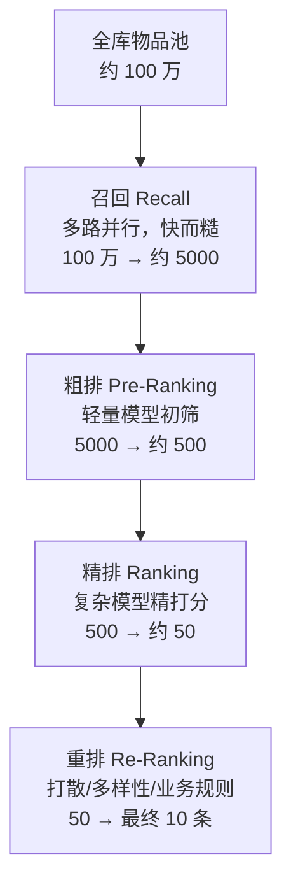

# 推荐系统全景

> **一句话理解**：推荐系统是一条"漏斗流水线"——先用快而糙的办法从百万物品里捞出几千个候选，再用慢而精的模型逐层筛，最终在几百毫秒内排出给你看的那 10 条内容。

[⬆️ 返回总目录](../../../README.md) · [⬆️ 返回本篇](../README.md) · [⬅️ 返回本章目录](./README.md)

| 属性 | 说明 |
|------|------|
| 难度 | ⭐⭐（进阶） |
| 所属分支 | 推荐 |
| 前置知识 | 无 |

---

## 📌 这一节解决什么问题

一个内容平台的物品池可能是百万级的：视频、商品、文章。用户一次刷新只看 10 条，而他的耐心大约只有几百毫秒——总不能把一百万个物品每个都塞进一个大模型里打分，那算一次要几分钟。

在推荐系统出现之前，人们靠两样东西解决"看什么"：**编辑精选**（人工排榜，千人一面）和**热销榜**（卖得好的往前放，强者恒强）。它们没有个性化，也永远发现不了长尾里的好东西。

推荐系统的解法是**分工**：把"从一百万里选十"拆成一条流水线，每一层用不同的模型——越靠前的层看得越多、算得越糙、速度越快；越靠后的层看得越少、算得越精、结构越复杂。这就是贯穿全章的"召回（Recall）→ 排序（Ranking）"漏斗。

## 🌱 通俗理解

把推荐系统想象成一场大型相亲会的筛选流程：

- **召回**像初筛：拿着硬条件（年龄区间、城市）从一万份资料里快速捞出 500 份，标准糙但极快；
- **粗排**像快翻：浏览 500 份资料，扫一眼照片和简介，留下 50 份"眼缘还行"的；
- **精排**像细聊：和这 50 位逐个深聊，比较兴趣、三观，选出最合适的几位；
- **重排**像最终安排：考虑"这三位都是程序员，换掉一个保持多样性""刚见过体育类的，穿插一位艺术类的"，排出最终的见面顺序。

一层比一层慢，一层比一层准。这就是漏斗的本质：**用便宜的计算扛住量，用昂贵的计算保住准**。

## 📋 举个例子

小明晚上 21:00 打开短视频 App，手指还没离开屏幕，这 300 毫秒里发生了什么：

| 层级 | 物品数变化 | 这一层干了什么 | 大约耗时 |
|------|-----------|---------------|---------|
| 全库物品池 | 1 000 000 | 所有上架视频的向量索引、倒排索引静静躺在内存里 | — |
| 召回（多路并行） | 1 000 000 → 5 000 | 向量召回、协同过滤、关注关系等各路各出几千，合并去重 | ~50 ms |
| 粗排 | 5 000 → 500 | 轻量模型（小网络）给每个候选快打一个分 | ~30 ms |
| 精排 | 500 → 50 | 复杂模型（交叉特征 + 深度网络）精打分 | ~150 ms |
| 重排 | 50 → 10 | 打散同类、插广告位、业务规则，排出最终信息流 | ~20 ms |

小明刷到的 10 条视频，就是这条漏斗 300 毫秒的产物。下一页开始，我们逐层拆开看每一层里的模型长什么样。

<details>
<summary>🔄 展开看：同一个人两次刷新，为什么结果不一样？</summary>

小明 21:00 刷了一次，21:05 又刷新一次，出来的列表大不相同，原因有四类：

1. **打散（Diversity / 去重）**：刚看过的内容会被过滤或降权，同一个创作者、同一话题的连续出现条数有上限——否则你会连刷 10 条同一个博主；
2. **探索（Exploration）**：系统会留出小比例流量（例如 5%~10%）试探你没看过的类目——不试，永远不知道你可能喜欢什么；
3. **实时行为反馈**：你刚点赞了一条美食视频，这个行为毫秒级回流进特征系统，下一次召回立刻偏向美食；
4. **多路召回的随机性**：向量检索的近似算法（下一页详讲）本身带轻微随机，加上各路召回配额轮换，两次结果天然不同。

推荐是"动态对话"，不是"一次算好的静态列表"。

</details>

## 🧠 核心原理

### 整体流程：推荐漏斗



### 逐步拆解：每层在拿什么换什么

- **召回（Recall）**：任务是从百万里"别漏掉好的"，宁可多捞不可漏捞。模型必须极快，所以结构简单（向量相似度、协同过滤、倒排索引多路并行），每个候选只花几微秒；
- **粗排（Pre-Ranking）**：召回的几千个候选还是太多，用轻量模型（往往是精排模型的"缩水版"）先砍到几百，为精排争取时间；
- **精排（Ranking）**：几百个候选逐个用复杂模型精打分——可以用几十上百个特征、特征间交叉、多目标融合，每个候选花约 1 毫秒也花得起；
- **重排（Re-Ranking）**：不再只看单条分数，而是把"这 50 条作为一组"整体考虑：同类打散、控制广告位、插入运营内容。

一条经验律：**延迟预算倒逼架构**。用户可感知的刷新延迟约 300~500 ms（经验参考），扣掉网络和渲染，留给整条漏斗的计算时间常常不到 200 ms——这 200 ms 怎么分，决定了每层模型能做多复杂。

<details>
<summary>🧮 展开看：一个数字实验——为什么精排不能吃下全部物品</summary>

假设精排模型对单个候选打分耗时 1 ms（已是很快的深度模型）：

- 给 500 个候选打分：500 × 1 ms = 0.5 s —— 勉强能接受（实际会用并行计算压到几十 ms）；
- 给 100 万个候选打分：1 000 000 × 1 ms ≈ 17 分钟 —— 完全不可行。

再假设召回用向量相似度，单个候选只需 0.1 μs 量级的距离计算（配合近似检索的批量优化），扫一遍百万物品可压到几十毫秒。**差 4 个数量级的单次计算成本，就是漏斗必须分层的原因**——不是模型不想统一，是时间不允许。

</details>

### 指标体系：不只是点击率

推荐系统的"北极星指标"因产品而异，常见一篮子指标：

| 维度 | 指标 | 说明 |
|------|------|------|
| 效率 | 点击率（CTR，Click-Through Rate）、转化率（CVR）、完播/停留时长 | 用户"用手指投票"的直接信号 |
| 体验 | 多样性（多样性类目数）、惊喜度（Serendipity）、满意度调研 | 防止短期指标绑架长期体验 |
| 生态 | 覆盖度（被推荐出来的物品占比）、创作者激励分发 | 长尾物品能否被看见、新创作者能否活下来 |

$$
\mathrm{CTR} = \frac{\text{点击次数}}{\text{曝光次数}}
$$

> 👉 **人话**：给你看了 100 次，你点了 3 次，CTR 就是 3%。它衡量"推荐的内容有多戳人"。

**为什么只优化 CTR 会出事？**点击是最容易采集的信号，但标题党、擦边内容天然高点击——模型若只追 CTR，会越来越推"忍不住点但点完就后悔"的内容；同时模型持续推你点过的类目，你的兴趣边界会越收越窄，这就是**信息茧房（Filter Bubble）**。真实系统的对策：多目标融合（把时长、负反馈一起进损失）、多样性重排、给探索留流量、监控覆盖度等生态指标。

### 一句话辨析：推荐 vs 搜索 vs 广告

| | 搜索 | 推荐 | 广告 |
|------|------|------|------|
| 一句话 | 用户**主动**说需求，系统匹配 | 系统**猜测**需求，主动推送 | 出资方**付费**买展示位 |
| 优化目标 | 结果与查询的相关性 | 用户长期价值（时长/留存/GMV） | 平台收入 × 用户体验的平衡 |

三者技术栈高度重叠（都是"检索 + 排序"漏斗），推荐与搜索的边界正随"搜索结果页混排推荐内容"逐渐模糊。

## 💻 动手试试

```python
# 最小漏斗模拟：感受"每层数量骤降 + 每层单件成本骤升"
import numpy as np

np.random.seed(0)
n_items = 1_000_000                    # 全库 100 万个物品
scores = np.random.rand(n_items)       # 每个物品一个"匹配分"（模拟召回快打分）

recall_top = np.argsort(scores)[-5000:]   # 召回：留 5000（快而糙）
coarse_top  = recall_top[np.argsort(scores[recall_top])[-500:]]  # 粗排：留 500
fine_top    = coarse_top[np.argsort(scores[coarse_top])[-50:]]   # 精排：留 50
final_list  = fine_top[::-1]           # 重排后输出前 10
print("漏斗数量:", n_items, "→", len(recall_top), "→", len(coarse_top), "→", len(fine_top), "→", len(final_list))
# 预期输出：漏斗数量: 1000000 → 5000 → 500 → 50 → 10
```

## 🔥 炼丹小灶

> 🔥 **炼丹小灶**：工业界的延迟预算参考——
> - 配方：总预算 ~300 ms，网络与渲染 ~100 ms；召回 ~50 ms、粗排 ~30 ms、精排 ~100~150 ms、重排 ~20 ms（经验参考，各厂不同）；
> - 玄学：精排超时先砍特征数而不是砍模型层数；召回永远要多路冗余，单路挂了系统不能挂；
> - ⚠️ 以上是经验参考值，不是圣旨；换业务请重新压测。

## 🔗 在知识树中的位置

- **上游**：[机器学习全景](../../2-经典机器学习/03-机器学习/01-机器学习全景.md)——推荐是机器学习最典型的工业应用场景之一；
- **下游**：[协同过滤与矩阵分解](./02-协同过滤与矩阵分解.md)（召回的起点）、[排序模型](./04-排序模型.md)（精排）；
- **横向对比**：与[时间序列](../06-时间序列/README.md)同样研究用户行为，但推荐关心"此刻匹配什么"，时序关心"未来发生什么"。

## ⚠️ 常见误区

- **误区一**：推荐系统 = 一个大模型 → 它是一条流水线，由几十个模型、索引和服务组成，"模型"只是其中一环；
- **误区二**：CTR 高 = 推荐好 → 点击只是短期信号，标题党也能拉高 CTR；要看时长、留存、生态指标的一篮子表现。

## 📝 小结与自测

**要点回顾**

- 推荐链路是漏斗：召回（100 万→5000）→ 粗排（→500）→ 精排（→50）→ 重排（→10），每层用计算成本换精度；
- 分层的根本原因是**延迟预算**：用户只给几百毫秒；
- 指标是一篮子：CTR/时长管效率，多样性/惊喜度管体验，覆盖度管生态；只优化 CTR 会导向信息茧房。

**自测一下**（点击展开答案）

<details>
<summary>问题 1：为什么召回层不敢用复杂模型？</summary>

召回要面对百万级候选，单个候选的计算预算只有微秒级；复杂模型单个候选要毫秒级，总量乘起来完全超时。所以召回宁可用简单模型多捞一些（高召回），把精度留给后面层数量变少的精排。

</details>

<details>
<summary>问题 2：信息茧房是怎么一步步形成的？</summary>

模型推你常点的类目 → 你点得更多 → 训练样本里这类更多 → 模型更偏这类……正反馈循环让兴趣分布越收越窄。破解靠：多样性重排、探索流量、把负反馈和长期指标（时长/留存）纳入优化目标。

</details>

## 📚 延伸阅读

- 论文：Deep Neural Networks for YouTube Recommendations（2016）——工业推荐漏斗架构的经典参考，https://arxiv.org/abs/1606.07774
- 博客：Google Research 关于推荐系统的系列博客（Recommender Systems 分类）

---

[⬅️ 上一页：第 8 章：推荐系统](./README.md) · [返回本章目录](./README.md) · [下一页：协同过滤与矩阵分解 ➡️](./02-协同过滤与矩阵分解.md)
