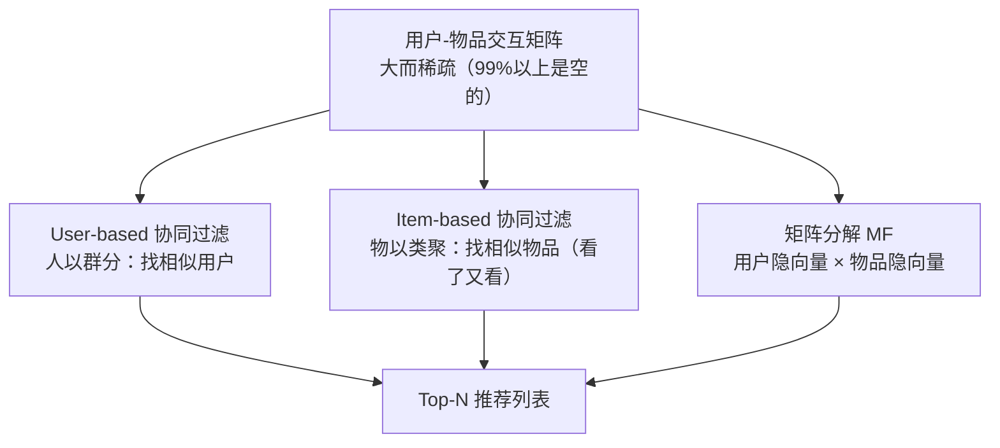

# 协同过滤与矩阵分解

> **一句话理解**：不看物品内容、只看"大家怎么用"——和你口味最像的人喜欢什么，就推荐什么；这一路走到头，是把每个用户和物品都压缩成一个隐向量，正是 embedding 思想的源头。

[⬆️ 返回总目录](../../../README.md) · [⬆️ 返回本篇](../README.md) · [⬅️ 返回本章目录](./README.md)

| 属性 | 说明 |
|------|------|
| 难度 | ⭐⭐⭐（较难） |
| 所属分支 | 推荐 |
| 前置知识 | [推荐系统全景](./01-推荐系统全景.md) |

---

## 📌 这一节解决什么问题

推荐要回答"这个用户会不会喜欢这个物品"。最直接的想法是分析物品内容：这部电影的题材、演员、时长……但内容分析又贵又不可靠（你喜欢科幻不等于喜欢所有科幻片）。

协同过滤（Collaborative Filtering, CF）换了一个刁钻的角度：**完全不看物品内容，只看行为**。如果成千上万个用户的点击/评分记录里藏着规律——"喜欢 A 的人也喜欢 B"——那不用理解 A 和 B 是什么，也能推荐。这把推荐问题变成了一个纯数学问题：一张用户-物品交互矩阵。

但这张矩阵有两个要命的性质：**大**（百万用户 × 千万物品）和**稀疏**（99% 以上是空的——每个人只碰过物品海洋里的一瓢水）。矩阵分解（Matrix Factorization, MF）就是对付"大而稀疏"的武器：把大矩阵拆成两个小矩阵相乘，顺便把空格补上。

## 🌱 通俗理解

两种生活智慧，对应两条路线：

- **人以群分（user-based）**：想看新电影，你去找那位"每次推荐都正中红心"的老友——他和你口味最像，他看过而你没看的高分片，闭眼入；
- **物以类聚（item-based）**：饭店老板不认识你，但他发现"点麻辣香锅的人，十个里有六个接着点酸梅汤"——于是菜单上把酸梅汤放到香锅旁边。电商的"看了又看"就是它。

矩阵分解再往前一步：老板想，每个客人心里其实有个"口味坐标"（爱吃辣的程度、爱甜的程度），每道菜也有个"味道坐标"，点单记录就是两种坐标的匹配。**把每个客人和每道菜的坐标都学出来**，就算某位客人从没点过某道菜，坐标一对，就知道合不合口味。

"口味坐标"就是隐向量（Latent Vector）——不用人告诉模型"辣度""甜度"这些维度，它们是从数据里**自动学出来的**。这正是[词向量](../07-自然语言处理与LLM/01-词向量与embedding.md)的同款思想，只是这里嵌入的不是词，而是用户和物品。

## 📋 举个例子

4 个用户对 4 部电影的评分（1~5 分，`?` 表示没看过）：

| | A 流浪地球 | B 泰坦尼克号 | C 星际穿越 | D 罗曼假日 |
|------|------|------|------|------|
| 小红 | 5 | 1 | 5 | 1 |
| 小刚 | 4 | 2 | **?** | 1 |
| 小美 | 1 | 5 | 2 | 5 |
| 小李 | 2 | 5 | 1 | 4 |

**任务**：小刚还没看《星际穿越》(C)，要不要推给他？

**第一步：找"和你最像的人"。** 用余弦相似度（Cosine Similarity）比较小刚和其他人，只用三人都评过的电影 A、B、D 打分：

$$
\cos(\theta) = \frac{\vec{a} \cdot \vec{b}}{\|\vec{a}\| \, \|\vec{b}\|}
$$

> 👉 **人话**：两个人的打分向量方向越接近，口味越像；分子是逐项相乘再求和（同高同低加分），分母把长度归一（只比方向不比幅度）。

以小红为例，两人在 A、B、D 上的打分分别是 $[5,1,1]$ 和 $[4,2,1]$：

- 分子：$5{\times}4 + 1{\times}2 + 1{\times}1 = 23$
- 分母：$\sqrt{5^2{+}1^2{+}1^2} \times \sqrt{4^2{+}2^2{+}1^2} = \sqrt{27} \times \sqrt{21} \approx 23.8$
- 相似度：$23 / 23.8 \approx 0.97$

同法算完所有人：**小红 ≈ 0.97，小李 ≈ 0.72，小美 ≈ 0.58**。

**第二步：借最像的人的口味。** 取相似度超过 0.8 的邻居——只有小红。小红给《星际穿越》打了 5 分 → 预测小刚也会很喜欢 → **推荐 C**。顺带一提，口味最不像的小美（0.58）恰是唯一给 C 打低分的爱情片爱好者，她的意见被自动降权了。

**item-based 视角再看一眼**：只用共同评分用户算电影相似度，得 sim(A, C) ≈ 0.97（最高）、sim(A, B) ≈ 0.56、sim(A, D) ≈ 0.50——"看了《流浪地球》的人也看《星际穿越》"，同一个结论从另一条路得到了。

<details>
<summary>📊 展开完整算例：矩阵分解的 2 维隐向量玩具演示</summary>

假设训练后学到了这样的隐向量（数字为示意，维度含义是模型自动学出的，这里恰好可解读为"科幻浓度 / 爱情浓度"）：

| 用户 | 隐向量 | | 电影 | 隐向量 |
|------|------|---|------|------|
| 小红 | [2.1, 0.2] | | A 流浪地球 | [2.1, 0.4] |
| 小刚 | [1.9, 0.4] | | B 泰坦尼克号 | [0.6, 2.0] |
| 小美 | [0.5, 2.0] | | C 星际穿越 | [2.2, 0.5] |
| 小李 | [0.8, 1.8] | | D 罗曼假日 | [0.4, 2.1] |

预测评分 = 用户向量 · 物品向量，重建整张表：

| 预测 | A | B | C | D |
|------|------|------|------|------|
| 小红 | **4.49** (真5) | **1.66** (真1) | **4.72** (真5) | **1.26** (真1) |
| 小刚 | **4.15** (真4) | **1.94** (真2) | **4.38** (原为?) | **1.60** (真1) |
| 小美 | **1.85** (真1) | **4.30** (真5) | **2.10** (真2) | **4.40** (真5) |
| 小李 | **2.40** (真2) | **4.08** (真5) | **2.66** (真1) | **4.10** (真4) |

三个观察：

1. **重建很准**：已评分的格子被近似还原（误差零点几分）——说明 2 维坐标已抓住"科幻/爱情"这个主要结构；
2. **空格被补上了**：小刚 × C = 1.9×2.2 + 0.4×0.5 = **4.38** → 推！与 user-based 的结论一致，而且这次完全没"借用"任何邻居，是坐标相乘算出来的；
3. **泛化能力来自压缩**：把 16 个格子压缩成 4+4 个小向量，模型被迫学出规律，才能既拟合旧格子、又合理填充新格子——这就是 embedding 的魔力。

</details>

## 🧠 核心原理

### 整体流程



### 逐步拆解

**① 交互矩阵有多稀疏？** 一个 10 万用户 × 100 万物品的平台，矩阵有 $10^{11}$ 个格子；每人平均交互 1000 次，非空格子只有 $10^8$ 个，占比 0.1%——**99.9% 是空的**。稀疏是推荐数据的宿命，也是后面一切设计的出发点。

**② 基于记忆的 CF（Memory-based CF）**：不做任何"学习"，直接拿历史行为算相似度。user-based 对用户算相似度（人以群分），item-based 对物品算相似度（物以类聚）。item-based 在工业界更受偏爱：物品之间的相似度比用户之间稳定（一部电影的受众群不会天天变，用户的口味会），且物品相似表可以**离线算好**，在线只查表——这个"离线预计算"的思路，下一页双塔会走到极致。

**③ 矩阵分解**：把评分矩阵 $R$ 近似拆成两个小矩阵的乘积——用户矩阵 $P$（每行是一个用户的隐向量 $p_u$）× 物品矩阵 $Q$（每行是一个物品的隐向量 $q_i$）：

$$
\hat{r}_{u,i} = p_u^{\top} q_i
$$

> 👉 **人话**：用户 u 会不会喜欢物品 i，就看这两个向量有多"对得上劲"——逐维相乘再求和，方向越一致分数越高。

训练目标是在已有评分上让预测尽量准，同时别让向量学得太大（防过拟合）：

$$
\min_{P, Q} \sum_{(u,i) \in \text{已有评分}} \left( r_{u,i} - p_u^{\top} q_i \right)^2 + \lambda \left( \|p_u\|^2 + \|q_i\|^2 \right)
$$

> 👉 **人话**：让"预测分 ≈ 真实分"（第一项），$\lambda$ 那一项是"别用力过猛"的刹车——向量太大会把偶然的噪声也背下来。

**④ 冷启动（Cold Start）**：MF 只能学会"有行为"的用户和物品。新用户没点过任何东西、新物品没被任何人点过——隐向量无从学起，这就是冷启动问题。出路是引入**内容特征**：新电影总归有标题、类目、演员，用内容侧特征先给它一个向量兜底——"让特征上车，等行为攒够再换引擎"，这正是下一页双塔模型的拿手好戏。

<details>
<summary>🧮 展开看：MF 是怎么训练的（梯度下降视角）</summary>

把每个用户向量、物品向量当作可学习参数，用随机梯度下降（SGD）逐条更新：

- 看到一条评分 $r_{u,i}$，算误差 $e = r_{u,i} - p_u^{\top} q_i$；
- 让 $p_u$ 朝着"减少误差"的方向挪一小步：$p_u \leftarrow p_u + \eta \cdot e \cdot q_i$（$\eta$ 是学习率）；
- 对 $q_i$ 做对称的更新。

直觉：每条评分都在微调"口味坐标"和"味道坐标"，让合拍的靠拢、不合拍的远离。Netflix Prize（2006–2009 年的百万美元推荐算法竞赛）让 MF 一战成名，隐向量从此成为推荐系统的标配表达。

想亲眼看看"误差一步步变小"的过程，可以去 [梯度下降炼丹炉](../../../playground/gradient-descent.html) 拖动学习率感受一下——MF 的训练和它是一回事。

</details>

## 💻 动手试试

```python
# 最小 item-based 协同过滤：numpy 手写"看了又看"
import numpy as np

# 4 个用户 × 4 部电影的评分矩阵（0 = 没看过），就是正文里的例子
# 行 = 用户 [小红, 小刚, 小美, 小李]，列 = 电影 [流浪地球, 泰坦尼克号, 星际穿越, 罗曼假日]
R = np.array([
    [5, 1, 5, 1],
    [4, 2, 0, 1],
    [1, 5, 2, 5],
    [2, 5, 1, 4],
], dtype=float)

def item_cos(R, i, j):
    """计算电影 i 和 j 的余弦相似度，只用在两部电影上都评过分的用户"""
    mask = (R[:, i] > 0) & (R[:, j] > 0)      # 共同评分的用户
    a, b = R[mask, i], R[mask, j]
    return np.dot(a, b) / (np.linalg.norm(a) * np.linalg.norm(b))

movies = ["流浪地球", "泰坦尼克号", "星际穿越", "罗曼假日"]
i = 0                                        # 用户刚看完《流浪地球》
for j in range(4):
    if j != i:
        print(f"sim({movies[i]}, {movies[j]}) = {item_cos(R, i, j):.3f}")

# Top-N 推荐：取相似度最高的 2 部作为"看了又看"
sims = sorted(((item_cos(R, i, j), j) for j in range(4) if j != i), reverse=True)
print("看了又看 Top-2:", [movies[j] for _, j in sims[:2]])
# 预期输出：
# sim(流浪地球, 泰坦尼克号) = 0.557
# sim(流浪地球, 星际穿越) = 0.967
# sim(流浪地球, 罗曼假日) = 0.495
# 看了又看 Top-2: ['星际穿越', '泰坦尼克号']
```

## 🔥 炼丹小灶

> 🔥 **炼丹小灶**：MF 的工业起点配方——
> - 配方：隐向量维度 8~128 起步（维度越高表达力越强、也越容易过拟合）；SGD 或 Adam，lr 从 1e-3 试起；正则 $\lambda$ 从 1e-4~1e-2 扫一遍；
> - 玄学：显式评分用平方误差，隐式反馈（点击/播放）常用"加权 + 负采样"的变体；热度偏置（用户和物品各自的"平均分"）先加上去再训练，收敛快一截；
> - ⚠️ 以上是经验参考值，不是圣旨；换数据集请重新炼。

## 🖱️ 动手玩

> 🎮 **本库实验场**：[梯度下降炼丹炉](../../../playground/gradient-descent.html)——MF 的隐向量就是靠梯度下降一条条评分学出来的，拖学习率滑块看loss怎么下降。
> 🕹️ **延伸玩一玩**：[Embedding Projector](https://projector.tensorflow.org)——把学到的隐向量投到二维平面，亲眼看到"口味相近的用户聚成一团"。

## 🔗 在知识树中的位置

- **上游**：[推荐系统全景](./01-推荐系统全景.md)——CF/MF 是召回层最经典的几路之一；[词向量与 embedding](../07-自然语言处理与LLM/01-词向量与embedding.md)——同一思想在 NLP 的源头；
- **下游**：[双塔模型与向量召回](./03-双塔模型与向量召回.md)——把"人工设计的隐向量"升级成"深度网络生成的向量"；
- **横向对比**：与[聚类与降维](../../2-经典机器学习/03-机器学习/06-聚类与降维.md)共享"把大矩阵压缩成低维表示"的直觉，但 MF 是为"补全缺失格子"而生的有监督压缩。

## ⚠️ 常见误区

- **误区一**：协同过滤需要理解物品内容 → 恰恰相反，经典 CF 完全不看内容，只看行为共现；内容只在冷启动时被请出来救场；
- **误区二**：交互多 = 喜欢 → 用户可能替别人买礼物、被标题党骗点击；行为的"信噪比"问题催生了各种加权与去偏技巧；
- **误区三**：矩阵分解过时了 → MF 本体确实常被深度模型替代，但"万物皆隐向量"的思想统治至今，双塔就是它的直系后代。

## 📝 小结与自测

**要点回顾**

- 协同过滤只看行为：user-based 人以群分，item-based 物以类聚（"看了又看"）；
- 交互矩阵大而稀疏（99% 以上为空），矩阵分解用"用户隐向量 × 物品隐向量"把它压缩并补全；
- 隐向量是 embedding 思想在推荐领域的源头，维度含义是模型自动学出的；
- 新用户/新物品没行为就没向量——冷启动，需要内容特征兜底。

**自测一下**（点击展开答案）

<details>
<summary>问题 1：为什么工业界 item-based 比 user-based 用得更多？</summary>

物品相似度比用户相似度稳定（物品受众相对不变、用户口味漂移快）；物品数量通常远小于用户数量，相似表离线算好、在线查表即可，工程上便宜；可解释性也更好——"因为你看过 X 所以推 Y"说得出口。

</details>

<details>
<summary>问题 2：矩阵分解补出来的空格，和真实评分比可信吗？</summary>

在"结构性强、主要规律集中在前几个维度"的数据上可信度高（玩具例子里 2 维就还原出主结构）；但对依赖长尾规律的用户误差会大。维度越高拟合越强也越容易过拟合，需要靠验证集和正则项权衡。

</details>

## 📚 延伸阅读

- 论文：Item-based Collaborative Filtering Recommendation Algorithms（2001）——item-based CF 的开山之作，http://files.grouplens.org/papers/www10_sarwar.pdf
- 论文：Matrix Factorization Techniques for Recommender Systems（2009）——MF 的权威综述，https://ieeexplore.ieee.org/document/5197422
- 竞赛：Netflix Prize（2006–2009）——把推荐算法竞赛推向大众视野的百万美元大奖

---

[⬅️ 上一页：推荐系统全景](./01-推荐系统全景.md) · [返回本章目录](./README.md) · [下一页：双塔模型与向量召回 ➡️](./03-双塔模型与向量召回.md)
