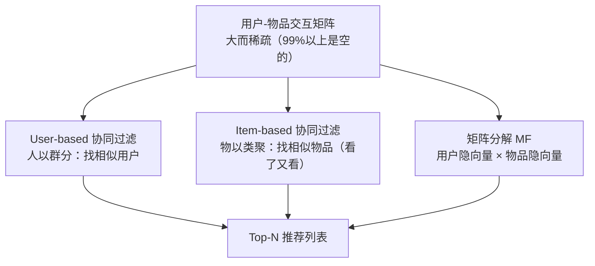
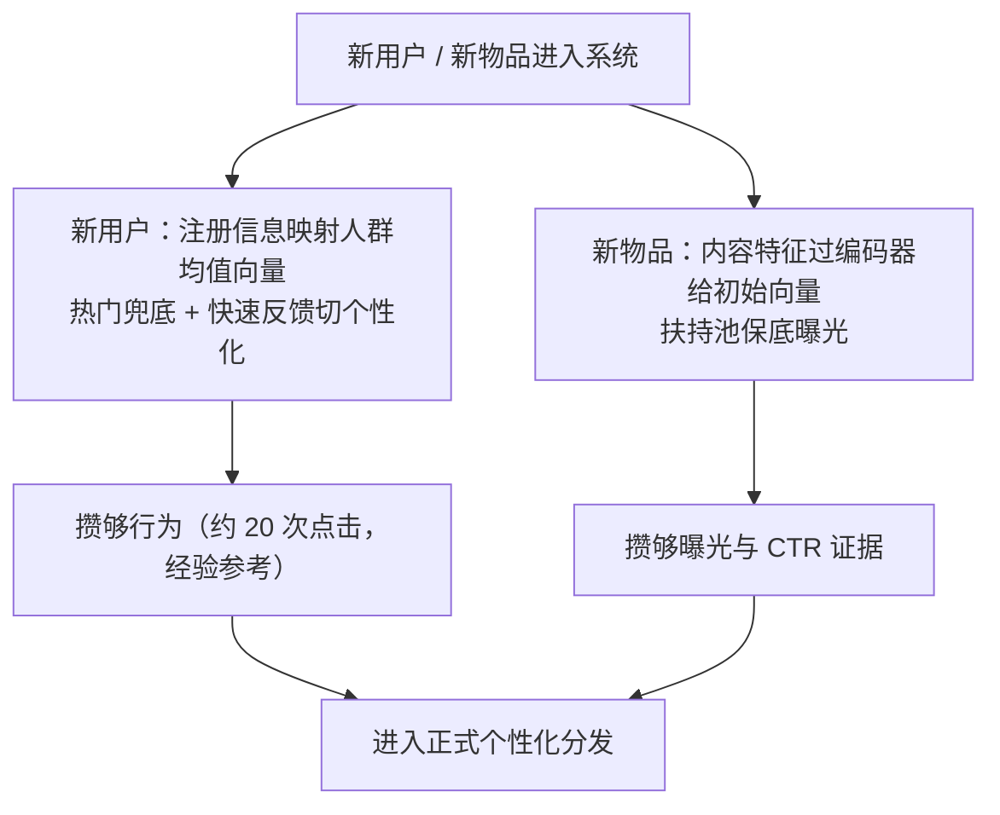

# 协同过滤与矩阵分解

> **一句话理解**：不看物品内容、只看"大家怎么用"——和你口味最像的人喜欢什么，就推荐什么；这一路走到头，是把每个用户和物品都压缩成一个隐向量，正是 embedding 思想的源头。

[⬆️ 返回总目录](../../../README.md) · [⬆️ 返回本篇](../README.md) · [⬅️ 返回本章目录](./README.md)

| 属性 | 说明 |
|------|------|
| 难度 | ⭐⭐⭐（较难） |
| 所属分支 | 推荐 |
| 前置知识 | [推荐系统全景](./01-推荐系统全景.md) |

---

## 📌 这一节解决什么问题

推荐要回答"这个用户会不会喜欢这个物品"。最直接的想法是分析物品内容：这部电影的题材、演员、时长……但内容分析又贵又不可靠（你喜欢科幻不等于喜欢所有科幻片）。

协同过滤（Collaborative Filtering, CF）换了一个刁钻的角度：**完全不看物品内容，只看行为**。如果成千上万个用户的点击/评分记录里藏着规律——"喜欢 A 的人也喜欢 B"——那不用理解 A 和 B 是什么，也能推荐。这把推荐问题变成了一个纯数学问题：一张用户-物品交互矩阵。

但这张矩阵有两个要命的性质：**大**（百万用户 × 千万物品）和**稀疏**（99% 以上是空的——每个人只碰过物品海洋里的一瓢水）。矩阵分解（Matrix Factorization, MF）就是对付"大而稀疏"的武器：把大矩阵拆成两个小矩阵相乘，顺便把空格补上。

再往深一层，这一页还埋着三个后患，它们催生了后面所有模型：相似度怎么选才不会被数据坑（皮尔逊还是杰卡德？）；隐向量维度 k 拍多少才不会欠拟合/过拟合；以及最根本的——**评分和点击根本不是一回事**（"没点"不等于"不喜欢"），这个偏差不解，模型学得越认真错得越远。

## 🌱 通俗理解

两种生活智慧，对应两条路线：

- **人以群分（user-based）**：想看新电影，你去找那位"每次推荐都正中红心"的老友——他和你口味最像，他看过而你没看的高分片，闭眼入；
- **物以类聚（item-based）**：饭店老板不认识你，但他发现"点麻辣香锅的人，十个里有六个接着点酸梅汤"——于是菜单上把酸梅汤放到香锅旁边。电商的"看了又看"就是它。

矩阵分解再往前一步：老板想，每个客人心里其实有个"口味坐标"（爱吃辣的程度、爱甜的程度），每道菜也有个"味道坐标"，点单记录就是两种坐标的匹配。**把每个客人和每道菜的坐标都学出来**，就算某位客人从没点过某道菜，坐标一对，就知道合不合口味。

"口味坐标"就是隐向量（Latent Vector）——不用人告诉模型"辣度""甜度"这些维度，它们是从数据里**自动学出来的**。这正是[词向量](../07-自然语言处理与LLM/01-词向量与embedding.md)的同款思想，只是这里嵌入的不是词，而是用户和物品。

## 📋 举个例子

4 个用户对 4 部电影的评分（1~5 分，`?` 表示没看过）：

| | A 流浪地球 | B 泰坦尼克号 | C 星际穿越 | D 罗曼假日 |
|------|------|------|------|------|
| 小红 | 5 | 1 | 5 | 1 |
| 小刚 | 4 | 2 | **?** | 1 |
| 小美 | 1 | 5 | 2 | 5 |
| 小李 | 2 | 5 | 1 | 4 |

**任务**：小刚还没看《星际穿越》(C)，要不要推给他？

**第一步：找"和你最像的人"。** 用余弦相似度（Cosine Similarity）比较小刚和其他人，只用三人都评过的电影 A、B、D 打分：

$$
\cos(\theta) = \frac{\vec{a} \cdot \vec{b}}{\|\vec{a}\| \, \|\vec{b}\|}
$$

> 👉 **人话**：两个人的打分向量方向越接近，口味越像；分子是逐项相乘再求和（同高同低加分），分母把长度归一（只比方向不比幅度）。

以小红为例，两人在 A、B、D 上的打分分别是 $[5,1,1]$ 和 $[4,2,1]$：

- 分子：$5{\times}4 + 1{\times}2 + 1{\times}1 = 23$
- 分母：$\sqrt{5^2{+}1^2{+}1^2} \times \sqrt{4^2{+}2^2{+}1^2} = \sqrt{27} \times \sqrt{21} \approx 23.8$
- 相似度：$23 / 23.8 \approx 0.97$

同法算完所有人：**小红 ≈ 0.97，小李 ≈ 0.72，小美 ≈ 0.58**。

**第二步：借最像的人的口味。** 取相似度超过 0.8 的邻居——只有小红。小红给《星际穿越》打了 5 分 → 预测小刚也会很喜欢 → **推荐 C**。顺带一提，口味最不像的小美（0.58）恰是唯一给 C 打低分的爱情片爱好者，她的意见被自动降权了。

**item-based 视角再看一眼**：只用共同评分用户算电影相似度，得 sim(A, C) ≈ 0.97（最高）、sim(A, B) ≈ 0.56、sim(A, D) ≈ 0.50——"看了《流浪地球》的人也看《星际穿越》"，同一个结论从另一条路得到了。

**再故意失败一次（极端与失败算例）**：把小李的打分整体加 2 分（他是"宽容型"用户，什么都打 3 分起：$[4, 5, 3, 5]$），再算他与小美的余弦相似度（共同评过 A、B、D）：$[2,5,1]$ vs $[4,5,5]$，分子 = 8+25+5 = 38，相似度 ≈ 0.95——**一个苛刻、一个宽容，口味其实相近**；但如果换成"打分普遍减 1 的严厉型"用户（$[1,4,0,3]$，D 评 3），与同样数据算出来可能骤降到 0.7 以下。这就是余弦相似度的软肋：**它对"整体打分习惯"（有人手紧有人手松）不免疫**——解法见下一节的皮尔逊相似度。

<details>
<summary>📊 展开完整算例：矩阵分解的 2 维隐向量玩具演示</summary>

假设训练后学到了这样的隐向量（数字为示意，维度含义是模型自动学出的，这里恰好可解读为"科幻浓度 / 爱情浓度"）：

| 用户 | 隐向量 | | 电影 | 隐向量 |
|------|------|---|------|------|
| 小红 | [2.1, 0.2] | | A 流浪地球 | [2.1, 0.4] |
| 小刚 | [1.9, 0.4] | | B 泰坦尼克号 | [0.6, 2.0] |
| 小美 | [0.5, 2.0] | | C 星际穿越 | [2.2, 0.5] |
| 小李 | [0.8, 1.8] | | D 罗曼假日 | [0.4, 2.1] |

预测评分 = 用户向量 · 物品向量，重建整张表：

| 预测 | A | B | C | D |
|------|------|------|------|------|
| 小红 | **4.49** (真5) | **1.66** (真1) | **4.72** (真5) | **1.26** (真1) |
| 小刚 | **4.15** (真4) | **1.94** (真2) | **4.38** (原为?) | **1.60** (真1) |
| 小美 | **1.85** (真1) | **4.30** (真5) | **2.10** (真2) | **4.40** (真5) |
| 小李 | **2.40** (真2) | **4.08** (真5) | **2.66** (真1) | **4.10** (真4) |

三个观察：

1. **重建很准**：已评分的格子被近似还原（误差零点几分）——说明 2 维坐标已抓住"科幻/爱情"这个主要结构；
2. **空格被补上了**：小刚 × C = 1.9×2.2 + 0.4×0.5 = **4.38** → 推！与 user-based 的结论一致，而且这次完全没"借用"任何邻居，是坐标相乘算出来的；
3. **泛化能力来自压缩**：把 16 个格子压缩成 4+4 个小向量，模型被迫学出规律，才能既拟合旧格子、又合理填充新格子——这就是 embedding 的魔力。

**失败情况**：注意小李 × C 的格子——真实 1 分、预测 2.66，误差最大。小李是唯一的"不规则用户"（爱情片爱好者却给科幻打了 2 而非 1），2 维的"科幻/爱情"坐标系装不下他的个性。想拟合他可以把 k 加大，但代价见下文"k 的选择"——他会把整个模型往过拟合的方向拖。

</details>

## 🧠 核心原理

### 整体流程



### 逐步拆解

**① 交互矩阵有多稀疏？** 一个 10 万用户 × 100 万物品的平台，矩阵有 $10^{11}$ 个格子；每人平均交互 1000 次，非空格子只有 $10^8$ 个，占比 0.1%——**99.9% 是空的**。稀疏是推荐数据的宿命，也是后面一切设计的出发点。

**② 基于记忆的 CF（Memory-based CF）**：不做任何"学习"，直接拿历史行为算相似度。user-based 对用户算相似度（人以群分），item-based 对物品算相似度（物以类聚）。item-based 在工业界更受偏爱：物品之间的相似度比用户之间稳定（一部电影的受众群不会天天变，用户的口味会），且物品相似表可以**离线算好**，在线只查表——这个"离线预计算"的思路，下一页双塔会走到极致。

**③ 相似度怎么选：三种度量，三片战场。** 相似度函数是 CF 的地基，选错了后面全歪：

| 相似度 | 公式直觉 | 最适合的数据 | 什么时候会坑你 |
|--------|---------|-------------|---------------|
| 余弦（Cosine） | 比方向不比长度：$\frac{a \cdot b}{\|a\|\|b\|}$ | 0/1 行为矩阵（点过/没点过） | 打分场景遇"手松手紧"：宽容用户和严厉用户方向被长度差带偏 |
| 皮尔逊（Pearson） | 先各自减均值再算余弦 | 1~5 星显式评分 | 共同评分太少时不稳定（两人只共同看过 1 部，减均值后相似度失去意义） |
| 杰卡德（Jaccard） | $\frac{\lvert A \cap B \rvert}{\lvert A \cup B \rvert}$：交集占并集的比例 | 集合语义的隐式行为（买过/没买过） | 分不清"喜欢强度"——买 1 件和买 100 件的同款粉丝被视为一样 |

> 👉 **人话**：只记"点没点"用余弦或杰卡德（杰卡德还会惩罚"你俩交集之外还各自点了很多不同东西"的假相似）；记了星级分数用皮尔逊（先各自减掉自己的平均分，把"手松手紧"的个人习惯扣掉，只比口味差异）。选错度量 = 用体重秤量身高——工具没坏，量错了对象。

一个判断流程：**数据是 0/1 行为 → 杰卡德/余弦；数据是分值 → 皮尔逊；分值且共同评分极多 → 余弦也行（大数定律把个人习惯平均掉了）**。

**④ 矩阵分解**：把评分矩阵 $R$ 近似拆成两个小矩阵的乘积——用户矩阵 $P$（每行是一个用户的隐向量 $p_u$）× 物品矩阵 $Q$（每行是一个物品的隐向量 $q_i$）：

$$
\hat{r}_{u,i} = p_u^{\top} q_i
$$

> 👉 **人话**：用户 u 会不会喜欢物品 i，就看这两个向量有多"对得上劲"——逐维相乘再求和，方向越一致分数越高。

训练目标是在已有评分上让预测尽量准，同时别让向量学得太大（防过拟合）：

$$
\min_{P, Q} \sum_{(u,i) \in \text{已有评分}} \left( r_{u,i} - p_u^{\top} q_i \right)^2 + \lambda \left( \|p_u\|^2 + \|q_i\|^2 \right)
$$

> 👉 **人话**：让"预测分 ≈ 真实分"（第一项），$\lambda$ 那一项是"别用力过猛"的刹车——向量太大会把偶然的噪声也背下来。

<details>
<summary>🧮 展开看：MF 的 SGD 训练推导——梯度公式怎么来的</summary>

对单条评分 $(u, i)$，记误差 $e_{u,i} = r_{u,i} - p_u^{\top} q_i$，只看这一条的损失（暂略正则项）：

$$
\ell = e_{u,i}^2 = \left( r_{u,i} - p_u^{\top} q_i \right)^2
$$

**对 $p_u$ 求梯度**。用链式法则：外层平方对 $e$ 求导得 $2e$，内层 $e$ 对 $p_u$ 的每个分量 $p_{u,f}$ 求导（注意 $p_u^{\top} q_i = \sum_f p_{u,f} q_{i,f}$，是 $p_{u,f}$ 的线性函数，导数就是系数 $q_{i,f}$）：

$$
\frac{\partial \ell}{\partial p_{u,f}} = 2\, e_{u,i} \cdot (-q_{i,f}) = -2\, e_{u,i}\, q_{i,f}
$$

梯度下降是"往负梯度方向走"，于是更新式为（把常数 2 吸进学习率 $\eta$）：

$$
p_u \leftarrow p_u + \eta \cdot e_{u,i} \cdot q_i
$$

对称地对 $q_i$ 求梯度（两者在损失里地位完全对称）：

$$
q_i \leftarrow q_i + \eta \cdot e_{u,i} \cdot p_u
$$

**直觉解读**：误差为正（低估了真实分，用户其实很爱看）时，更新让 $p_u$ 往 $q_i$ 的方向靠拢、$q_i$ 也往 $p_u$ 靠——这对"合拍组合"互相靠近；误差为负（高估了）时，两者互相远离。**整个训练就是几百万条评分反复上演的"靠拢与疏远"**，最终每个用户身边围着他喜欢的物品向量。

加上 L2 正则后的完整更新（以 $p_u$ 为例）：

$$
p_u \leftarrow p_u + \eta \left( e_{u,i} \cdot q_i - \lambda\, p_u \right)
$$

正则项 $-\lambda p_u$ 每一步都把向量往原点拉一把——"能力不够靠数量凑"式地撑大坐标是被禁止的。

**只更新被观测到的格子**：注意 SGD 天然只在"有评分的 $(u,i)$"上更新对应的 $p_u, q_i$——空格不参与损失，这正是 MF 能处理稀疏矩阵的原因：参数量 $O((m+n) \cdot k)$ 远小于格子数 $O(mn)$，100 万用户 × 1000 万物品、k=64 时约 7 亿参数，而全矩阵是 1 万亿格子。

Netflix Prize（2006–2009 年的百万美元推荐算法竞赛）让这套 SGD 训练的 MF 一战成名，隐向量从此成为推荐系统的标配表达。想亲眼看看"误差一步步变小"，去 [梯度下降炼丹炉](../../../playground/gradient-descent.html) 拖动学习率感受一下——MF 的训练和它是一回事。

</details>

**⑤ 隐向量维度 k：模型容量的旋钮。** k 是 MF 最重要的超参，它直接控制"模型能记住多少种口味"：

| k 的量级 | 状态 | 症状 | 典型场景 |
|---------|------|------|---------|
| k = 2~4 | 欠拟合 | 已评分格子的重建误差都压不下去；所有人被塞进"科幻/爱情"两个维度 | 玩具演示可以，真实数据不够 |
| k = 16~64 | 常规区间 | 训练/验证误差都低，冷门口味也开始被表达 | 大多数工业场景的起点（经验参考） |
| k = 256+ | 过拟合风险 | 训练误差继续降、验证误差回升；隐向量开始"背题"（把个别用户的怪癖也建成独立维度） | 数据量没跟上就拍大 k 是常见翻车点 |

量纲感怎么建立：**k 的上限应该由"数据能支撑几个自由度"决定**。一个只有 10 次行为的用户，他身上可靠的信息撑不起 64 维个性——工业上的对应做法是按用户行为数自适应（行为少的用户向量自动收缩向均值/热门向量插值）。判断欠拟合还是过拟合，看的不是 k 的绝对值，而是**验证集上的 RMSE 随 k 变化的 U 形曲线**：左半边降（表达力不够）、谷底最优、右半边升（开始背噪声）。

**⑥ 显式评分 vs 隐式反馈：数据根本不是一回事。**

| | 显式评分（Explicit Feedback） | 隐式反馈（Implicit Feedback） |
|------|------|------|
| 信号形态 | 1~5 星、赞/踩 | 点击、播放、购买、停留 |
| 缺失的含义 | "没评过"= 没看过（中性） | "没点击" = **可能是没看到、没来得及、不喜欢——三种解释分不清** |
| 信号强度 | 强而稀少（愿意打分的用户是少数） | 弱而海量 |
| 缺失=负样本？ | 可以近似这么假设 | **不可以**——这正是本质差异 |

> 👉 **人话**：评分世界里，空格 ≈"没吃过这道菜"；点击世界里，空格可能是"没吃过"，也可能是"端上来闻了闻不想吃"，还可能是"压根没走到这家店"。把没点击一律当不喜欢训练，模型会系统性地冤枉那些"曝光少但会被喜欢"的物品——它和马太效应互相放大。

工业主流的应对是**把"是否点击"的分类问题换成"排得对不对"的排序问题**：BPR（Bayesian Personalized Ranking）损失只要求"用户点击过的物品，分数要排在他没点过的物品前面"，不要求没点过的分数绝对值多低——未点击的物品之间不较劲，只跟点击过的比。

$$
\max_{P,Q} \sum_{(u, i \in \text{点击},\, j \in \text{未点击})} \ln \sigma\big( p_u^{\top} q_i - p_u^{\top} q_j \big)
$$

> 👉 **人话**：对每个用户，抽一对"点过的 i"和"没点过的 j"，要求 i 的预测分高于 j——只比相对顺序，不纠结绝对分值。这就把"没点 ≠ 不喜欢"的模糊性绕开了：j 输给 i 不代表 j 是坏的。

另一条路是加权法（如 WMF/ALS 变体）：观测到的交互给高置信度权重、未观测的给极低权重——"没点击"以"很低的置信度"参与，而不是硬当 0。两条路殊途同归：**尊重缺失的模糊性**。

**⑦ 冷启动（Cold Start）三类，各自对症下药：**

| 类型 | 缺什么 | 症状 | 解法 |
|------|--------|------|------|
| 新用户冷启动 | 该用户零行为，$p_u$ 学不出 | 给他推什么都"没把握" | 注册信息（年龄/地域）映射到人群均值向量；热门兜底 + 快速反馈（前 20 次点击内快速切个性化） |
| 新物品冷启动 | 该物品零交互，$q_i$ 学不出 | 永远进不了 CF 的推荐候选 | 内容特征（标题/封面/类目过编码器）先给一个向量；流量扶持池保底曝光攒行为（[生产实战](./99-生产实战.md)） |
| 系统冷启动 | 整个平台数据稀少 | CF/MF 全体失效 | 用热门榜/编辑精选/跨域数据（别的业务的行为）先跑，攒数据再切个性化 |

一句话总结：**冷启动的通用解法是"让内容特征先上车、行为数据攒够了再换引擎"**——把基于内容的推荐（Content-based）当作协同过滤的冷启动备胎，这正是下一页双塔模型的拿手好戏：它的塔里特征和 ID 平等共存。



### 📐 数学深潜：低秩矩阵的自由度账——参数量 r(m+n−r) 与"稀疏为何能被填满"

④ 的 SGD 推导回答了"怎么学"，这一节回答一个更根本的疑问：**一个 99.9% 是空格的矩阵，凭几个小向量就能合理填满——凭什么？** 答案是一笔自由度的账：低秩矩阵的"可动旋钮"远少于格子总数，**少量的观测（放在好位置）就足以把它钉死**。

**严格陈述。** 全体秩 ≤ r 的 m×n 实矩阵构成一个维数为

$$
\dim = r\,(m + n - r)
$$

的集合。换言之：**确定一个秩 ≤ r 的矩阵，恰好需要 r(m+n−r) 个独立实数**（对照：完整矩阵需要 mn 个）。因此当观测到的格子数——放在合适的位置——超过 r(m+n−r) 时，其余空格原则上被唯一钉死：这正是矩阵补全与 ④ MF 填空格的数学地基。

> 👉 **人话**：一张满秩大表每个格子都自由；一张秩 r 的表其实只有 r(m+n−r) 个"旋钮"——格子虽多、旋钮有限，看过的格子一旦多过旋钮，没看的格子就被旋钮的唯一取值锁死了。"稀疏能被填满"不是玄学，是欠定方程变成了恰定/超定方程。

**完整推导。**

<details>
<summary>🧮 展开推导：mr + nr 个参数 − r² 个冗余 = r(m+n−r)；再算玩具账与工业账</summary>

**第一步：参数化的自由参数。** 秩 ≤ r 的矩阵都可写成 $R = P Q^{\top}$（$P \in \mathbb{R}^{m \times r}$、$Q \in \mathbb{R}^{n \times r}$，R 秩为 r 时取满秩因子——线性代数标准事实）。P 有 mr 个数、Q 有 nr 个数，参数化共 **mr + nr** 个自由参数。

**第二步：同一个 R 有无穷多组分解——数冗余。** 对任意可逆 r×r 矩阵 M：

$$
P' = P M, \qquad Q' = Q\, M^{-\top} \;\Longrightarrow\; P' Q'^{\top} = P\, M\, (M^{-\top})^{\top} Q^{\top} = P\, M M^{-1} Q^{\top} = R
$$

（中间用 $(M^{-\top})^{\top} = M^{-1}$。）可逆 r×r 矩阵有 r² 个自由度（r² 个元素，"行列式非零"只挖掉一片零测集）；对满秩的 P、Q，不同的 M 给出不同参数组、却对应**同一个 R**——每个 R 背后拖着 r² 个"纯摆设"参数。

**第三步：真自由度。**

$$
\underbrace{(mr + nr)}_{\text{参数个数}} - \underbrace{r^{2}}_{\text{规范冗余}} \;=\; r\,(m + n - r) ∎
$$

**两个自检**：r = 1 时 m + n − 1 ✓（外积 $uv^{\top}$ 有 m+n 个数，但 $(cu)(v/c) = uv$：长度可在两因子间搬运，恰 1 个冗余）；r = m = n（满秩方阵）时 n(2n−n) = n² ✓ 恰为格子数——满秩没有便宜可占，账目自洽。

**第四步：两笔账。**

- **玩具账（本页 4×4 例）**：m = n = 4、r = 2，自由度 = 2×(4+4−2) = **12**。例子观测了 16 − 1 = **15** 格 > 12——多出 3 个"校验方程"，那 1 个空格当然可解。"2 维坐标抓住主结构"的背后，正是欠定 → 恰定/超定的转换；
- **工业账**：m = 10⁵ 用户、n = 10⁶ 物品、r = 64，自由度 = 64×(1.1×10⁶ − 64) ≈ **7×10⁷**；对照格子总数 mn = **10¹¹**——约万分之一的观测密度（再乘理论要求的 log 类因子）就足以"装下"整张表。低维口味结构把需要的信息量压小了 3~4 个数量级，这就是稀疏矩阵能被低秩模型填满的**计数论证**。

</details>

**图景：旋钮比格子少。**

```
 完整矩阵（自由度 = mn）：              秩 r 矩阵（自由度 = r(m+n−r)）：
 ┌─────────────────┐                  ┌─────────────────┐
 │ ████ 每格一个旋钮 │                  │  P (m×r) × Q (n×r) │
 │ ████ mn ≈ 10¹¹   │                  │  旋钮 ≈ 10⁸ 个     │
 └─────────────────┘                  └─────────────────┘
       几乎全观测才定得住                    观测约万分之一即可钉死

 观测数 > r(m+n−r)：欠定 → 恰定/超定，空格被"校验方程"锁死
 观测数 < r(m+n−r)：欠定，空格仍可自由晃——k 拍太大时的过拟合空间
```

**反例与边界。**

1. **位置比数量更关键（非相干性条件）**：计数只是必要性的直觉，不是充分性的证明——若观测全挤在一角（只看过 1000 个重度用户，其余 99,000 人零观测），那 99,000 行向量从没被任何方程碰到、任意取值都能拟合观测，自由度照样超支。矩阵补全定理要求观测近似均匀散布（非相干）并多付一个 log 因子——**计数给希望，位置给保证**；
2. **真实矩阵不是精确低秩**：口味数据带噪声与长尾个性——r 只是"有效秩"的近似；⑤ 的 U 形曲线（k 太小欠拟合、太大背噪声）就是这笔账在数据侧的回声；
3. **自由度 ≠ 泛化**：参数虽只有 ~10⁸ 个，与可用样本量同量级时照样过拟合——正则项 $\lambda\|p\|^2$ 的作用正是压低有效自由度。计数解释"为什么填得满"，不自动担保"填得对"；
4. **行级自由度同样有限**：一个只有 10 次行为的用户，他那一行的可靠信息 ≪ 64 维——⑤ 表"行为少的用户向量向均值收缩"的工程做法，就是在承认行级自由度不足。

> 👉 **人话总结**：秩 r 的矩阵是一台只有 r(m+n−r) 个旋钮的机器——格子再多，旋钮就那么多；观测一旦多过旋钮又散得开，空格就被唯一钉死。"万物皆隐向量"能工作的全部底气，就是旋钮数比格子数少了几个数量级。

## 💻 动手试试

```python
# 最小 item-based 协同过滤 + 杰卡德/皮尔逊对比 + MF 的 SGD 训练
import numpy as np

# 4 个用户 × 4 部电影的评分矩阵（0 = 没看过），就是正文里的例子
# 行 = 用户 [小红, 小刚, 小美, 小李]，列 = 电影 [流浪地球, 泰坦尼克号, 星际穿越, 罗曼假日]
R = np.array([
    [5, 1, 5, 1],
    [4, 2, 0, 1],
    [1, 5, 2, 5],
    [2, 5, 1, 4],
], dtype=float)

def item_cos(R, i, j):
    """计算电影 i 和 j 的余弦相似度，只用在两部电影上都评过分的用户"""
    mask = (R[:, i] > 0) & (R[:, j] > 0)      # 共同评分的用户
    a, b = R[mask, i], R[mask, j]
    return np.dot(a, b) / (np.linalg.norm(a) * np.linalg.norm(b))

movies = ["流浪地球", "泰坦尼克号", "星际穿越", "罗曼假日"]
i = 0                                        # 用户刚看完《流浪地球》
for j in range(4):
    if j != i:
        print(f"sim_cos({movies[i]}, {movies[j]}) = {item_cos(R, i, j):.3f}")

# Top-N 推荐：取相似度最高的 2 部作为"看了又看"
sims = sorted(((item_cos(R, i, j), j) for j in range(4) if j != i), reverse=True)
print("看了又看 Top-2:", [movies[j] for _, j in sims[:2]])
# 预期输出：
# sim_cos(流浪地球, 泰坦尼克号) = 0.557
# sim_cos(流浪地球, 星际穿越) = 0.967
# sim_cos(流浪地球, 罗曼假日) = 0.495
# 看了又看 Top-2: ['星际穿越', '泰坦尼克号']

# ---- MF 的 SGD 训练：亲眼看着误差下降、空格被补上 ----
np.random.seed(0)
k = 2                                        # 隐向量维度（玩具数据 2 维就够表达"科幻/爱情"）
P = np.random.normal(0, 0.1, (4, k))         # 用户矩阵：4 个用户 × k 维
Q = np.random.normal(0, 0.1, (4, k))         # 物品矩阵：4 部电影 × k 维
lr, lam, epochs = 0.02, 0.02, 5000           # 学习率 / 正则强度 / 轮数

observed = [(u, i) for u in range(4) for i in range(4) if R[u, i] > 0]  # 只在有评分的格子上训练
for ep in range(epochs):
    for u, i in observed:                    # 随机梯度下降：逐条评分更新
        e = R[u, i] - P[u] @ Q[i]            # 误差：真实分 − 预测分
        # 梯度更新式（正则项把向量往原点拉一把防过拟合）：
        Pu, Qi = P[u].copy(), Q[i].copy()
        P[u] += lr * (e * Qi - lam * Pu)     # p_u ← p_u + η(e·q_i − λp_u)
        Q[i] += lr * (e * Pu - lam * Qi)     # q_i ← q_i + η(e·p_u − λq_i)

print(f"\nMF 训练后：k={k}, 已评分格子 RMSE = "
      f"{np.sqrt(np.mean([(R[u,i] - P[u] @ Q[i])**2 for u,i in observed])):.3f}")
pred_c = P[1] @ Q[2]                         # 小刚 × 星际穿越：原来是空格！
print(f"补全空格：小刚对《星际穿越》的预测分 = {pred_c:.2f}（> 3 分 → 值得推荐）")
# 预期输出（数值随种子与轮数略有差异）：
# 已评分格子 RMSE ≈ 0.3~0.5；小刚 × 星际穿越 ≈ 3.5~4.5 —— 与正文玩具隐向量的 4.38 一致

# 🧪 实验建议（改什么参数，看什么变化）：
# 1) 把 k 从 2 改成 3：RMSE 略降——玩具数据的结构 2 维已基本说尽，第 3 维收益很小；
# 2) 把 k 改成 16：训练误差可以压得更低，但这是 16 个参数去拟合每个用户的 4 条评分，
#    属于"背题"——真实数据上会表现为验证集误差回升（本玩具没有验证集，感受现象即可）；
# 3) 把 lr 改成 0.5：误差发散（NaN 或爆炸）——学习率对 SGD 永远是第一嫌疑人；
# 4) 把 lam 改成 0 再加大到 1.0：观察 RMSE 变差——正则太弱向量飘、太强向量萎缩。
```

## 🔥 炼丹小灶

> 🔥 **炼丹小灶**：MF 的工业起点配方——
> - 配方：隐向量维度 8~128 起步（先 32 跑通再扫）；SGD 或 Adam，lr 从 1e-3 试起；正则 $\lambda$ 从 1e-4~1e-2 扫一遍；隐式反馈直接上 BPR 类排序损失，别硬用平方误差；
> - 玄学：显式评分用平方误差，隐式反馈（点击/播放）常用"加权 + 负采样"的变体；热度偏置（用户和物品各自的"平均分"）先加上去再训练，收敛快一截；k 调优看验证集 RMSE 的 U 形曲线，不是拍脑袋"越大越好"；
> - ⚠️ 以上是经验参考值，不是圣旨；换数据集请重新炼。

## 🖱️ 动手玩

> 🎮 **本库实验场**：[梯度下降炼丹炉](../../../playground/gradient-descent.html)——MF 的隐向量就是靠梯度下降一条条评分学出来的，拖学习率滑块看 loss 怎么下降。
> 🕹️ **延伸玩一玩**：[Embedding Projector](https://projector.tensorflow.org)——把学到的隐向量投到二维平面，亲眼看到"口味相近的用户聚成一团"。

## 🔗 在知识树中的位置

- **上游**：[推荐系统全景](./01-推荐系统全景.md)——CF/MF 是召回层最经典的几路之一；[词向量与 embedding](../07-自然语言处理与LLM/01-词向量与embedding.md)——同一思想在 NLP 的源头；
- **下游**：[双塔模型与向量召回](./03-双塔模型与向量召回.md)——把"人工设计的隐向量"升级成"深度网络生成的向量"；
- **横向对比**：与[聚类与降维](../../2-经典机器学习/03-机器学习/06-聚类与降维.md)共享"把大矩阵压缩成低维表示"的直觉，但 MF 是为"补全缺失格子"而生的有监督压缩；反馈闭环的偏差问题与[全景页](./01-推荐系统全景.md)的马太效应一脉相承。

## 🎓 深度视角

**三个真实取舍**：

1. **MF 的"压缩即泛化"有成立边界**：它假设口味结构集中在低维（正文玩具里 2 维就够）；当个性化信息大量藏在长尾维度时，加大 k 会先背噪声（正文"小李问题"）。工业上深度模型接管后，MF 并没被扔掉——它退居两个岗位：冷数据场景的强基线（一切新模型上线前要打赢的第一关）、以及深度模型的 embedding 预训练（先跑一版 MF 给 ID 向量暖场）。
2. **item-based CF 至今活着，靠的不是精度而是工程性**：相似表可增量更新（新行为只刷新相关物品的行）、可解释（"因为你看过 X"说得出口）、故障半径小（一条相似度算错只影响一个"看了又看"栏位）。深度模型把它升级成向量索引，但"离线预计算 + 在线查表"的运维骨架原样保留——[双塔](./03-双塔模型与向量召回.md)是它的直系后代。
3. **隐式反馈引发的方法论分叉比模型演进更根本**：显式评分时代比 RMSE（预测分数准不准），隐式反馈时代比 AUC/Recall@K（相对顺序对不对）——评价指标变了，"什么是好模型"的定义就变了，BPR、负采样、去偏这一整套工业范式都是跟着指标长出来的。

**高级深问与答**：

<details>
<summary>深问 1："深度学习杀死 MF"的预言为什么没有发生？</summary>

三个原因：① MF 的信息来源（ID 共现）被双塔完整吸收，但 MF 本身就是"塔退化为查表"的双塔——数学上是连续谱，谈不上"取代"；② 数据规模中庸的场景（百万级交互以下），MF 的精度/算力性价比仍然占优，深度模型的embedding 需要更大数据量才回本；③ 工业遗产：MF 的隐向量体系（用户/物品向量表、近线更新管道）早已建成，替换的迁移成本要大于收益。学术数据集上深度模型对 MF 的提升幅度，长期小于论文叙事给人的印象——这也是推荐领域"论文级正确、工业级存疑"的经典案例之一。

</details>

<details>
<summary>深问 2：皮尔逊/余弦都要求"共同评分够多"，工业上怎么处理共同评分只有 1~2 个的物品对？</summary>

用**收缩估计（Shrinkage）**：给相似度乘一个置信系数 $\frac{n}{n + \lambda}$（n 为共同评分/共同交互数，λ 为平滑常数）——共同交互越多越信，越少越往 0（不相似）收。两个只共同被 1 个人点过的物品，原始余弦可能高达 1.0，收缩后只剩 $\frac{1}{1+\lambda}$。这是工业 CF 的标配技巧（经验参考），本质和[第 3 章贝叶斯平均](../../2-经典机器学习/03-机器学习/01-机器学习全景.md)的"小样本往先验收缩"是同一思想：**不确定性大的时候，宁可保守也别嘴硬**。

</details>

<details>
<summary>深问 3：冷启动的"内容特征先上车"，为什么不干脆全程用内容推荐（Content-based）？</summary>

内容特征只有"宽度"没有"深度"：它能判断"这是体育视频"，判断不了"这个用户此刻想不想看体育"——后者藏在行为共现里。内容推荐会陷入"越推越像"的窄化（你点过一次萌宠，满屏萌宠），协同信号才能带来"意外但合适"的跨类推荐（惊喜度）。所以工业形态是混合：内容特征负责冷启动和兜底，协同信号负责个性化主力，两者在[双塔](./03-双塔模型与向量召回.md)的塔里共存。

</details>

## 🔬 SOTA 演进（2023–2026）

按本页主题，只展开**隐式反馈的偏差体系**——经典 CF/MF 论文默认"观测 = 偏好"，而工业界过去十年逐步认清：观测是被曝光机制、位置、流行度三层过滤后的产物。这张谱系表是理解现代推荐（去偏、无偏学习）的地图：

| 偏差 | 生成机理 | 症状 | 主流纠偏（一句话级） |
|------|---------|------|---------------------|
| **曝光偏差（Exposure Bias）** | 用户只能对"被系统曝光过的物品"产生行为，未曝光 ≠ 不喜欢 | 低曝光物品被系统性当负样本，模型冤枉它们 | 逆概率加权（IPS，Inverse Propensity Scoring）：按"被曝光概率"的倒数给样本加权，把筛选过的分布还原回全分布（详见[专题页](./05-进阶专题-大规模推荐系统.md)样本工程） |
| **位置偏差（Position Bias）** | 排前的物品天然多点击，用户是"顺手点"不是"真心爱" | 模型把"位置好"学成"内容好" | 位置进特征 + 预估时固定为无偏位置打分；或随机流量小桶纠偏 |
| **流行度偏差（Popularity Bias）** | 头部物品在正负样本里都高频出现，主导损失 | 推荐同质化、马太效应滚雪球 | logQ 纠偏（[双塔页](./03-双塔模型与向量召回.md)）；样本加权惩罚热门 |

> 👉 **人话**：谱系的共同骨架是一个乘法——**观测到的行为 = 真实偏好 × 曝光机制 × 位置效应 × 流行度**。去偏就是把这个乘法里"偏好"以外的因子除回去。三种偏差不是三个独立 bug，而是同一台"过滤机器"的三层滤网；纠偏方法（IPS、位置建模、logQ）在数学上同属"重要性加权"家族——这与[第 11 章因果推断](../11-因果推断/02-因果推断方法工具箱.md)用倾向得分修正"谁被处理"的混杂，是同一套思想在推荐数据上的落地。

## ❓ 开放问题

1. **"无偏学习"的评估本身需要无偏数据，这是鸡生蛋**：验证 IPS/去偏模型效果，最干净的办法是拿一段全随机曝光的流量当标准答案——但随机曝光伤体验、成本高，只能小流量短周期地开。于是"用什么评估纠偏方法"本身成了开放问题，部分工作转向合成数据，而合成数据的分布又和真实反馈闭环相去甚远。
2. **去偏后离线指标常常变差，怎么让组织相信"更差的是更对的"？**去掉流行度偏差，模型不再蹭热门红利，离线 AUC/Recall 往往下降，但长期生态指标（覆盖度、长尾分发）改善——短期指标与长期价值的冲突在去偏这件事上最尖锐（与[全景页](./01-推荐系统全景.md)的多目标仲裁同构，解法要靠长期 holdout 实验，见[生产实战](./99-生产实战.md)）。
3. **公开学术数据集与工业闭环数据的鸿沟**：MovieLens 类数据集是（近）随机曝光下的采集，天然少了一层曝光偏差；工业日志是被自家模型筛过的分布。论文方法在公开集上的排名，迁移到工业闭环数据上经常失效——这是推荐领域学术与工业最著名的断层之一。

## ⚠️ 常见误区

- **误区一**：协同过滤需要理解物品内容 → 恰恰相反，经典 CF 完全不看内容，只看行为共现；内容只在冷启动时被请出来救场；
- **误区二**：交互多 = 喜欢 → 用户可能替别人买礼物、被标题党骗点击；行为的"信噪比"问题催生了各种加权与去偏技巧；
- **误区三**：矩阵分解过时了 → MF 本体确实常被深度模型替代，但"万物皆隐向量"的思想统治至今，双塔就是它的直系后代；
- **误区四**：没点击 = 不喜欢，可以直接当负样本 → 隐式反馈的缺失是"没看到 / 没来得及 / 不喜欢"的混合，硬当负样本会冤枉低曝光物品并放大马太效应；用 BPR 这类排序损失或低置信度加权来尊重这种模糊性；
- **误区五**：相似度函数随便挑一个 → 余弦吃 0/1 行为、皮尔逊吃分值、杰卡德吃集合语义，选错度量相当于用体重秤量身高。

## 📝 小结与自测

**要点回顾**

- 协同过滤只看行为：user-based 人以群分，item-based 物以类聚（"看了又看"）；
- 相似度三分天下：余弦（0/1 行为）、皮尔逊（分值、先减均值去掉手松手紧）、杰卡德（集合语义、交集占并集）；
- 交互矩阵大而稀疏（99% 以上为空），矩阵分解用"用户隐向量 × 物品隐向量"把它压缩并补全；SGD 更新式 $p_u \leftarrow p_u + \eta(e \cdot q_i - \lambda p_u)$，本质是"合拍的靠拢、不合拍的疏远"；
- 隐向量维度 k 是容量旋钮：太小欠拟合（压不住主要结构），太大过拟合（背个别用户的怪癖），看验证集 U 形曲线定；
- 显式评分与隐式反馈本质不同：后者的"缺失"是多义的（未点击 ≠ 不喜欢），主流解法是 BPR 排序损失——只要求点过的排没点过的前面；
- 冷启动三类各自下药：新用户（人群均值 + 热门兜底 + 快速反馈）、新物品（内容特征向量 + 流量扶持）、系统（热门/编辑/跨域先跑）。

**自测一下**（点击展开答案）

<details>
<summary>问题 1：为什么工业界 item-based 比 user-based 用得更多？</summary>

物品相似度比用户相似度稳定（物品受众相对不变、用户口味漂移快）；物品数量通常远小于用户数量，相似表离线算好、在线查表即可，工程上便宜；可解释性也更好——"因为你看过 X 所以推 Y"说得出口。

</details>

<details>
<summary>问题 2：矩阵分解补出来的空格，和真实评分比可信吗？</summary>

在"结构性强、主要规律集中在前几个维度"的数据上可信度高（玩具例子里 2 维就还原出主结构）；但对依赖长尾规律的用户误差会大。维度越高拟合越强也越容易过拟合，需要靠验证集和正则项权衡。

</details>

<details>
<summary>问题 3：皮尔逊相似度比余弦多做了一步什么？为什么显式评分场景下这步关键？</summary>

皮尔逊先让每个用户减去自己的平均分再算余弦。这步"去均值"扣掉了"手松手松"的个人打分习惯：有人习惯全打 4~5、有人全打 2~3，原始余弦会把这两类人判为不相似，去均值后比较的才是纯粹的口味方向差异。

</details>

<details>
<summary>问题 4：BPR 损失为什么能绕开"未点击 ≠ 不喜欢"的问题？</summary>

BPR 不要求给未点击物品一个低的绝对分，只要求"点击过的物品分数高于未点击的"——它优化的是相对顺序。两个都没点击的物品之间不产生任何约束，因此"没点击"携带的模糊性（没看到？没来得及？不喜欢？）不会被强行解读成负标签，低曝光物品不再被系统性冤枉。

</details>

## 📚 延伸阅读

- 论文：Item-based Collaborative Filtering Recommendation Algorithms（2001）——item-based CF 的开山之作，http://files.grouplens.org/papers/www10_sarwar.pdf
- 论文：Matrix Factorization Techniques for Recommender Systems（2009）——MF 的权威综述，https://ieeexplore.ieee.org/document/5197422
- 论文：BPR: Bayesian Personalized Ranking from Implicit Feedback（2009）——隐式反馈排序损失的原点，https://arxiv.org/abs/1205.2618
- 竞赛：Netflix Prize（2006–2009）——把推荐算法竞赛推向大众视野的百万美元大奖

---

[⬅️ 上一页：推荐系统全景](./01-推荐系统全景.md) · [返回本章目录](./README.md) · [下一页：双塔模型与向量召回 ➡️](./03-双塔模型与向量召回.md)
