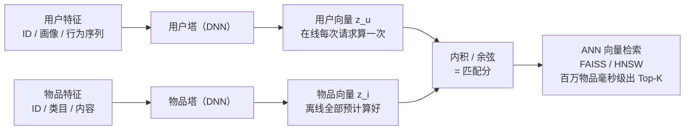

# 双塔模型与向量召回

> **一句话理解**：用户和物品各自用一个深度网络编码成向量，匹配分就是两个向量的余弦相似度——因为两塔互不干扰，物品向量可以提前离线算好，在线只需算一次用户向量，就能毫秒级从百万物品里捞出最相关的 Top-K。

[⬆️ 返回总目录](../../../README.md) · [⬆️ 返回本篇](../README.md) · [⬅️ 返回本章目录](./README.md)

| 属性 | 说明 |
|------|------|
| 难度 | ⭐⭐⭐⭐（高阶） |
| 所属分支 | 推荐 |
| 前置知识 | [协同过滤与矩阵分解](./02-协同过滤与矩阵分解.md)；[PyTorch 快速上手](../../3-深度学习/04-深度学习基础/03-PyTorch快速上手.md) |

---

## 📌 这一节解决什么问题

矩阵分解证明了"隐向量"可行，但它有两个短板：一是向量只从 ID 交互中学出来，**吃不了丰富的特征**——用户的年龄、关注列表、最近点过什么，物品的标题、类目、封面内容，全都用不上；二是没有解决**检索速度**——真有了一百万个物品向量，在线怎么快速找出最相似的那几个？

双塔模型（Two-Tower Model，也叫 DSSM 结构）同时解决这两件事：

- **特征升级**：每一塔都是一个深度神经网络（DNN），什么特征都能吃进去，输出的向量是"深度网络消化几十种特征后的浓缩";
- **速度升级**：因为用户塔和物品塔**彼此独立、互不交叉**，物品向量可以在离线阶段全部算好、建成索引；在线请求来了，只算一次用户向量，然后做近似最近邻检索（ANN，Approximate Nearest Neighbor），毫秒级返回 Top-K。

这个"两塔各自编码、最后算相似"的结构是如此好用，以至于从搜索、推荐一路复制到了图文匹配和文档检索——文末的"万物双塔"会把这些同构关系串起来。

## 🌱 通俗理解

把双塔想象成一家婚介所的两台"简历提炼机"：

- 用户侧机器读你的资料（年龄、爱好、最近看的内容），浓缩成一张**名片**（一个 128 维的向量）；
- 物品侧机器读每位候选者的资料，也浓缩成一张名片——而且**早就印好了**，一百万张名片按"气质相近放一起"整理进档案柜；
- 你来相亲时，婚介所现场只做两件事：把你压成名片（一次），去档案柜里翻出和你名片最像的几张（ANN 检索）。

为什么强调"早就印好"？因为压名片（跑深度网络）不便宜——如果每次都要把你的名片和一百万张候选名片**配对着重新精算**，那要算到天亮；分开各自印好、最后只对暗号，才能又准又快。"对暗号"就是算余弦相似度，一次只需几百次乘加，微秒级。

## 📋 举个例子

假设双塔把某用户编码成 3 维向量（三个维度由模型自动学出，这里恰好可解读为"体育 / 美食 / 数码"偏好浓度）：

- 用户向量 $z_u = [0.8,\ 0.2,\ 0.1]$——重度体育迷；
- 物品 1 篮球新闻：$[0.9,\ 0.1,\ 0.0]$；
- 物品 2 美食探店视频：$[0.2,\ 0.8,\ 0.2]$；
- 物品 3 数码测评：$[0.7,\ 0.3,\ 0.4]$。

手算用户与篮球新闻的余弦相似度：

$$
s(u, i) = \frac{z_u^{\top} z_i}{\|z_u\| \, \|z_i\|}
$$

> 👉 **人话**：两个向量方向越一致，相似度越接近 1。分子是逐维相乘求和（你爱体育它也体育，加分），分母归一掉长度只留方向。

- 分子：$0.8{\times}0.9 + 0.2{\times}0.1 + 0.1{\times}0.0 = 0.74$
- 分母：$\sqrt{0.8^2+0.2^2+0.1^2} \times \sqrt{0.9^2+0.1^2} = \sqrt{0.69} \times \sqrt{0.82} \approx 0.83 \times 0.91$
- $s \approx 0.74 / 0.755 \approx 0.98$

同法算完三个物品并排名：

| 排名 | 物品 | 余弦相似度 | 解读 |
|------|------|-----------|------|
| 1 | 篮球新闻 | ≈ 0.98 | 主维度（体育）完全对上 |
| 2 | 数码测评 | ≈ 0.92 | 数码维度部分对上 |
| 3 | 美食视频 | ≈ 0.48 | 美食维度高、体育维度低，方向不合 |

真实系统里这套计算发生在一百万个物品向量上——由 ANN 索引在几毫秒内完成，返回的正是排好序的 Top-K。

## 🧠 核心原理

### 整体流程：双塔架构



### 逐步拆解

**① 两座塔吃什么。** 用户塔吃用户 ID、画像属性（年龄/地域）、行为序列（最近点击的物品列表）等；物品塔吃物品 ID、类目、统计量、内容特征（标题/封面过编码器）。两塔结构可以不同，输出维度必须相同（比如都是 128 维），通常再做 L2 归一化——归一化后内积等于余弦，数值稳定且检索索引友好。

**② 训练：正样本是点击，负样本靠"采"。** 全库不可能都当负样本（算不动），所以要**负采样（Negative Sampling）**：正样本 = 用户真正点击/完播的物品，配若干"没点过"的物品当负样本，用二分类（或 softmax）损失拉开两者的分数。两个实战要点：

- **热门纠偏**：随机采负样本时，热门物品（人人刷到过的）更容易被采成负样本，但它其实"曝光多才没被某些人点"，模型会错怪它。工业做法是按曝光频率做对数概率修正（如 logQ 纠偏），把热门物品的负样本权重降下来；
- **难负样本**：与用户向量很接近、但确实没点击的物品是"最锻炼模型的负样本"——容易的分对了不涨本事，难的分对了才见功夫。常用做法是混合少量"高相似但未点击"的难负样本与大量随机负样本。

**③ 温度系数（Temperature）**：训练时把相似度除以一个小温度 $\tau$（如 0.05~0.2）再进损失：

$$
\tilde{s}(u, i) = \frac{s(u, i)}{\tau}
$$

> 👉 **人话**：把分数差距"放大"后再学，梯度更陡、学得更较真；温度太小容易过拟合，太大又学不动，是个需要调的超参。

**④ 上线：离线建索引 + 在线 ANN。** 物品塔把全库物品向量算好，灌进向量检索引擎（如开源库 FAISS，或 HNSW 类图索引）。在线请求只需：算一次用户向量 → 在索引里查 Top-K。ANN 的本质是**用极小的召回损失换几十到上百倍的速度**——百万到亿级物品时，暴力全量比对不再现实，ANN 用"分桶 / 建图跳转"把搜索范围缩到一小片。

**⑤ 评估：Recall@K。** 召回层的本职是"别漏"，评估用召回率：

$$
\text{Recall@K} = \frac{\lvert \text{用户真实点击的物品} \cap \text{召回的 Top-K} \rvert}{\lvert \text{用户真实点击的物品} \rvert}
$$

> 👉 **人话**：用户后来真正点了 10 个物品，你的 Top-K 召回捞到了其中几个——捞到 8 个，Recall@K 就是 0.8。召回层只求"好东西在篮子里"，篮子里东西排得对不对，交给下一页的排序模型。

<details>
<summary>🧮 展开看：为什么不能把两塔拼在一起过交叉网络？</summary>

一个自然的念头：把用户特征和物品特征**拼接**起来过一个更深的网络，让它们充分交叉，打分岂不更准？——更准，但算不动。关键在**在线 / 离线计算的差异**：

- **双塔**：物品向量不依赖用户，可全部**离线**算好建索引；在线只算 1 次用户向量 + 1 次 ANN 查询。代价是打分前两侧没有任何交互，"用户 × 物品"的交叉信息（如"这个用户在这个类目的偏好强度"）全丢给精排；
- **交叉网络**：每个 (用户, 候选) 对都要把两侧特征拼起来跑完整网络——100 万候选 × 1 毫秒 ≈ 17 分钟，只能用在候选已被召回层缩到几百个的精排阶段；
- 所以工业链路的分工是：**双塔管"从百万捞几百"（快而糙），交叉网络管"从几百选几十"（慢而精）**——不是不想交叉，是交叉不起。折中方案（如双塔输出后再做轻量交叉、或用精排模型给双塔做蒸馏）也存在，但都守住"召回必须毫秒级"的底线。

</details>

### 万物双塔：同一个骨架，四处开花

双塔的本质是"**两类东西各自编码成向量，再用相似度对齐**"。你会发现很多名声在外的系统都是它：

| 场景 | 塔 A | 塔 B | 训练信号 | 详细页面 |
|------|------|------|---------|---------|
| 推荐召回 | 用户塔 | 物品塔 | 点击 / 播放 | 本文 |
| 图文匹配 | 图像编码器 | 文本编码器 | 配对的图与文字 | [多模态模型](../../5-前沿与融合/12-生成模型与多模态/04-多模态模型.md)（如 CLIP） |
| 文档检索 | 问题编码器 | 文档编码器 | 问答 / 引用对 | [RAG 与 Agent](../07-自然语言处理与LLM/06-RAG与Agent.md) |

再往前追，它的源头正是[协同过滤的隐向量](./02-协同过滤与矩阵分解.md)和[词向量](../07-自然语言处理与LLM/01-词向量与embedding.md)——从"词对词"到"人对物"再到"图对文"，变的只是塔里装什么，不变的是"万物皆可向量，向量找相似"。

## 💻 动手试试

```python
# 运行前先安装：pip install torch
import torch
import torch.nn as nn
import torch.nn.functional as F

torch.manual_seed(0)                      # 固定随机种子，结果可复现
n_users, n_items, dim = 4, 6, 8           # 4 个用户、6 个物品、8 维向量

# 玩具交互数据：每个用户点击过的物品编号（正样本）
clicks = {0: [0, 1], 1: [0, 1, 2], 2: [3, 4], 3: [4, 5]}

class TwoTower(nn.Module):
    """双塔：两塔各自把 ID 编码成向量（真实场景中每塔是吃几十种特征的 DNN）"""
    def __init__(self):
        super().__init__()
        self.user_tower = nn.Embedding(n_users, dim)   # 用户塔
        self.item_tower = nn.Embedding(n_items, dim)   # 物品塔
    def forward(self, u, i):
        zu = F.normalize(self.user_tower(u), dim=-1)   # 归一化后，点积 = 余弦
        zi = F.normalize(self.item_tower(i), dim=-1)
        return (zu * zi).sum(dim=-1) * 10.0            # 除以温度 τ=0.1，等价于乘 10

model = TwoTower()
opt = torch.optim.Adam(model.parameters(), lr=1e-2)
loss_fn = nn.BCEWithLogitsLoss()

# 构造训练样本：每个正样本配 2 个随机负样本（没点过 ≈ 大概率不感兴趣）
pairs = []
for u, pos in clicks.items():
    negs = [i for i in range(n_items) if i not in pos]
    for p in pos:
        pairs.append((u, p, 1.0))                      # 正样本
        pairs.append((u, negs[0], 0.0))                # 负样本 1
        pairs.append((u, negs[1], 0.0))                # 负样本 2
u_idx  = torch.tensor([p[0] for p in pairs])
i_idx  = torch.tensor([p[1] for p in pairs])
labels = torch.tensor([p[2] for p in pairs])

for epoch in range(500):                               # 全量小数据，直接整批训练
    opt.zero_grad()
    loss = loss_fn(model(u_idx, i_idx), labels)
    loss.backward()
    opt.step()
print(f"最终 loss: {loss.item():.4f}")

# 上线检索演示：只算一次用户 0 的向量，与全部物品向量比相似度
with torch.no_grad():
    zu = F.normalize(model.user_tower(torch.tensor([0])), dim=-1)
    zi = F.normalize(model.item_tower(torch.arange(n_items)), dim=-1)
    sims = (zu * zi).sum(-1)[0]
for i in sims.argsort(descending=True):
    tag = "点击过(正样本)" if i.item() in clicks[0] else "未点击(负样本)"
    print(f"物品 {i.item()} 相似度 {sims[i]:.3f}  {tag}")
# 预期输出（数值随 torch 版本略有差异）：最终 loss 降到 0.1 以下；
# 用户 0 点击过的物品 0、1 相似度最高、排在最前——双塔学会了"按口味聚向量"
```

## 🔥 炼丹小灶

> 🔥 **炼丹小灶**：双塔召回的工业起点配方——
> - 配方：向量维度 32~128；温度 τ 在 0.05~0.2 网格搜；Adam lr 1e-3~1e-2；负采样比例 1:10~1:100（随机负为主 + 少量难负）；训练样本按天滚动更新；
> - 玄学：召回效果差，先查负采样偏差和温度，再怀疑网络结构；行为序列特征（"最近点过的 50 个物品"）往往比画像特征涨点多；
> - ⚠️ 以上是经验参考值，不是圣旨；换场景请重新炼。

## 🖱️ 动手玩

> 🕹️ **延伸玩一玩**：[Embedding Projector](https://projector.tensorflow.org)——把双塔学出的物品向量投到二维平面，同类目物品会聚成一簇，直观感受"向量空间即兴趣地图"。

## 🔗 在知识树中的位置

- **上游**：[协同过滤与矩阵分解](./02-协同过滤与矩阵分解.md)——隐向量思想的直系祖先；[神经网络是怎么炼成的](../../3-深度学习/04-深度学习基础/01-神经网络是怎么炼成的.md)——塔里的 DNN 就是它；
- **下游**：[排序模型](./04-排序模型.md)——双塔捞回来的候选交给它精排；[RAG 与 Agent](../07-自然语言处理与LLM/06-RAG与Agent.md)、[多模态模型](../../5-前沿与融合/12-生成模型与多模态/04-多模态模型.md)——同构的"万物双塔"；
- **横向对比**：与矩阵分解相比，双塔赢在"能吃任意特征"；与精排交叉网络相比，双塔赢在"离线可预计算"，输在"无法特征交叉"。

## ⚠️ 常见误区

- **误区一**：双塔的分数就是最终排序 → 双塔只管召回"别漏"，它的分数在精排模型面前只是粗筛意见，最终顺序由排序层决定；
- **误区二**：负样本随便采就行 → 不纠热门偏差，模型会系统性低估热门物品；不加难负样本，模型分不开"像但没点"的物品；
- **误区三**：ANN 是精确检索 → 它是"近似"最近邻，允许漏掉极少数真正最近的邻居，换取几十倍速度；索引参数（如探查深度）就是速度与召回的旋钮。

## 📝 小结与自测

**要点回顾**

- 双塔 = 用户塔 + 物品塔各自编码成向量，余弦/内积为匹配分；
- 工业爱它的根本原因：物品向量**离线预计算**，在线只算一次用户向量，ANN 毫秒级出 Top-K；
- 训练三板斧：负采样（热门纠偏 + 难负样本）、温度系数、按天滚动更新；
- 召回层用 Recall@K 评估——只求"好东西在篮子里"，不求"篮子里排得对"；
- CLIP、RAG 检索与推荐召回同构：各自编码成向量，再算相似。

**自测一下**（点击展开答案）

<details>
<summary>问题 1：为什么双塔的物品向量可以离线算，交叉网络却不行？</summary>

双塔中物品塔的输入只有物品自身特征，不依赖"哪个用户来请求"，所以每个物品算一次就能存起来；交叉网络里用户特征和物品特征在打分前就融合在一起，每个 (用户, 候选) 组合都要现场算一遍，无法预计算，只能服务候选数很少的精排。

</details>

<details>
<summary>问题 2：Recall@K 和 AUC 分别评估哪一层？为什么不能只用一个？</summary>

Recall@K 评估召回层——在百万物品里"捞没捞到用户会点的好东西"，考察的是覆盖能力；AUC 评估排序层——对召回的候选"排得对不对"，考察的是相对顺序。召回层排序乱一点没关系（后面有精排），但漏了好东西精排再准也无米下锅；反之召回一堆但排不对，用户也刷不到。两层指标各管一段，缺一不可。

</details>

## 📚 延伸阅读

- 论文：Learning Deep Structured Semantic Models for Web Search（DSSM, 2013）——双塔结构的开山，https://www.microsoft.com/en-us/research/publication/learning-deep-structured-semantic-models-for-web-search-using-clickthrough-data/
- 论文：Sampling-Bias-Corrected Neural Modeling for Large Corpus Item Recommendations（2020）——工业双塔召回 + logQ 热门纠偏的代表作，https://arxiv.org/abs/2006.10112
- 论文：Billion-scale Similarity Search with GPUs（FAISS, 2019）——向量检索引擎的基石，https://arxiv.org/abs/1702.08734

---

[⬅️ 上一页：协同过滤与矩阵分解](./02-协同过滤与矩阵分解.md) · [返回本章目录](./README.md) · [下一页：排序模型 ➡️](./04-排序模型.md)
