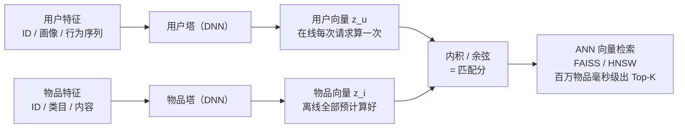
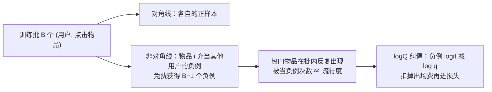

# 双塔模型与向量召回

> **一句话理解**：用户和物品各自用一个深度网络编码成向量，匹配分就是两个向量的余弦相似度——因为两塔互不干扰，物品向量可以提前离线算好，在线只需算一次用户向量，就能毫秒级从百万物品里捞出最相关的 Top-K；但它快起来的代价（不能特征交叉、向量会过期、偏差会传染）也全在这同一结构里。

[⬆️ 返回总目录](../../../README.md) · [⬆️ 返回本篇](../README.md) · [⬅️ 返回本章目录](./README.md)

| 属性 | 说明 |
|------|------|
| 难度 | ⭐⭐⭐⭐（高阶） |
| 所属分支 | 推荐 |
| 前置知识 | [协同过滤与矩阵分解](./02-协同过滤与矩阵分解.md)；[PyTorch 快速上手](../../3-深度学习/04-深度学习基础/03-PyTorch快速上手.md) |

---

## 📌 这一节解决什么问题

矩阵分解证明了"隐向量"可行，但它有两个短板：一是向量只从 ID 交互中学出来，**吃不了丰富的特征**——用户的年龄、关注列表、最近点过什么，物品的标题、类目、封面内容，全都用不上；二是没有解决**检索速度**——真有了一百万个物品向量，在线怎么快速找出最相似的那几个？

双塔模型（Two-Tower Model，也叫 DSSM 结构）同时解决这两件事：

- **特征升级**：每一塔都是一个深度神经网络（DNN），什么特征都能吃进去，输出的向量是"深度网络消化几十种特征后的浓缩"；
- **速度升级**：因为用户塔和物品塔**彼此独立、互不交叉**，物品向量可以在离线阶段全部算好、建成索引；在线请求来了，只算一次用户向量，然后做近似最近邻检索（ANN，Approximate Nearest Neighbor），毫秒级返回 Top-K。

这个"两塔各自编码、最后算相似"的结构是如此好用，以至于从搜索、推荐一路复制到了图文匹配和文档检索——文末的"万物双塔"会把这些同构关系串起来。

但把双塔用进真实系统，还要回答四个训练与运维的难题，它们是本页深化的重点：**负样本怎么采才不带偏差**（in-batch negative 的流行度陷阱）；**温度和难负例怎么配合**（调一个不调另一个等于白调）；**ANN 的"近似"到底丢了多少好结果**（召回率怎么量化）；**向量多久更新一次才跟得上世界变化**（实时与离线的边界画在哪）。每个问题处理不好，症状都是"离线指标很好、线上就是不见涨"。

## 🌱 通俗理解

把双塔想象成一家婚介所的两台"简历提炼机"：

- 用户侧机器读你的资料（年龄、爱好、最近看的内容），浓缩成一张**名片**（一个 128 维的向量）；
- 物品侧机器读每位候选者的资料，也浓缩成一张名片——而且**早就印好了**，一百万张名片按"气质相近放一起"整理进档案柜；
- 你来相亲时，婚介所现场只做两件事：把你压成名片（一次），去档案柜里翻出和你名片最像的几张（ANN 检索）。

为什么强调"早就印好"？因为压名片（跑深度网络）不便宜——如果每次都要把你的名片和一百万张候选名片**配对着重新精算**，那要算到天亮；分开各自印好、最后只对暗号，才能又准又快。"对暗号"就是算余弦相似度，一次只需几百次乘加，微秒级。

这个比喻还顺出了三个生产难题：名片**印久了会过期**（物品变了、口味变了，向量还停在三个月前——兴趣漂移）；名片的内容**不能夹带"明天才知道的信息"**（训练时用了未来数据——特征穿越）；档案柜为了快是**按类摆放的**，翻的时候可能漏掉压在别的柜子里的真命天子（ANN 召回损失）。三个问题后面逐一拆解。

## 📋 举个例子

假设双塔把某用户编码成 3 维向量（三个维度由模型自动学出，这里恰好可解读为"体育 / 美食 / 数码"偏好浓度）：

- 用户向量 $z_u = [0.8,\ 0.2,\ 0.1]$——重度体育迷；
- 物品 1 篮球新闻：$[0.9,\ 0.1,\ 0.0]$；
- 物品 2 美食探店视频：$[0.2,\ 0.8,\ 0.2]$；
- 物品 3 数码测评：$[0.7,\ 0.3,\ 0.4]$。

手算用户与篮球新闻的余弦相似度：

$$
s(u, i) = \frac{z_u^{\top} z_i}{\|z_u\| \, \|z_i\|}
$$

> 👉 **人话**：两个向量方向越一致，相似度越接近 1。分子是逐维相乘求和（你爱体育它也体育，加分），分母归一掉长度只留方向。

- 分子：$0.8{\times}0.9 + 0.2{\times}0.1 + 0.1{\times}0.0 = 0.74$
- 分母：$\sqrt{0.8^2+0.2^2+0.1^2} \times \sqrt{0.9^2+0.1^2} = \sqrt{0.69} \times \sqrt{0.82} \approx 0.83 \times 0.91$
- $s \approx 0.74 / 0.755 \approx 0.98$

同法算完三个物品并排名：

| 排名 | 物品 | 余弦相似度 | 解读 |
|------|------|-----------|------|
| 1 | 篮球新闻 | ≈ 0.98 | 主维度（体育）完全对上 |
| 2 | 数码测评 | ≈ 0.92 | 数码维度部分对上 |
| 3 | 美食视频 | ≈ 0.48 | 美食维度高、体育维度低，方向不合 |

**极端情况**：一个"什么都看一点"的用户 $[0.45, 0.45, 0.45]$，与三个物品的相似度全都挤在 0.7~0.8 之间——**向量太"居中"就失去了分辨力**。这不是 bug，是双塔的本质限制：它把用户压成一个点，兴趣多面且均衡的用户，这个点谁都不挨着。这类用户在真实系统里靠**多兴趣向量**（一个用户多个向量，各自召回一路）来救——本页末尾失败模式再谈。

真实系统里这套计算发生在一百万个物品向量上——由 ANN 索引在几毫秒内完成，返回的正是排好序的 Top-K。

## 🧠 核心原理

### 整体流程：双塔架构



### 逐步拆解

**① 两座塔吃什么。** 用户塔吃用户 ID、画像属性（年龄/地域）、行为序列（最近点击的物品列表）等；物品塔吃物品 ID、类目、统计量、内容特征（标题/封面过编码器）。两塔结构可以不同，输出维度必须相同（比如都是 128 维），通常再做 L2 归一化——归一化后内积等于余弦，数值稳定且检索索引友好。

**特征进塔的实时性边界**——不是所有特征都能"实时"：

| 特征 | 实时性 | 原因 |
|------|--------|------|
| 最近点击序列（近 10~50 个物品 ID） | **实时（毫秒级）** | 从行为流直接拼，请求时现场取 |
| 实时统计（近 1 小时点击数、当前会话类目分布） | **准实时（分钟级）** | 流式聚合有窗口延迟 |
| 物品近 7 天 CTR | **T+1 为主，小时级增量** | 依赖离线批统计，小时级刷新已经够用 |
| 用户长期画像（90 天兴趣分布） | **天级** | 本来就慢变量，不值得实时算 |
| 训练标签（是否点击） | **只能离线** | 点击发生在未来——训练时拿不到"这条请求未来会不会点"，见失败模式"特征穿越" |

> 👉 **人话**：判断一个特征能不能实时进塔，问一句"**在用户按下刷新的那一刻，这个数存在吗、算得出吗**"。存在且便宜的（刚点过的 10 个视频）就实时；存在但贵的（物品 7 天 CTR）就缓存 + 定期刷新；要到未来才存在的（点击标签）绝对不能进特征。这条边界画错了，轻则浪费机器，重则离线虚高、上线翻车。

**② 训练：正样本是点击，负样本靠"采"。** 全库不可能都当负样本（算不动），所以要**负采样（Negative Sampling）**：正样本 = 用户真正点击/完播的物品，配若干"没点过"的物品当负样本，用二分类（或 softmax）损失拉开两者的分数。

工业界最常用的省钱技巧是 **in-batch negative（批内负例）**：一个 batch 里有 1024 个 (用户, 正样本物品) 对，其中任何用户的正样本物品，都可以顺手拿来当其他 1023 个用户的负样本——**一批数据同时充当正样本和负样本，训练成本几乎为零**（不用额外采样和读取）。但天下没有免费的负样本，in-batch negative 自带一个系统性偏差：

**流行度偏差（Popularity Bias）的机理**：batch 里的物品来自"被点击的样本"，而**热门物品被点击的概率天然高**——于是在 batch 内反复出现的都是热门物品，它们被当作负例的次数远高于冷门物品。模型反复收到"用户 × 热门物品 = 负样本"的信号，就会系统性压低热门物品的向量，**冤枉了那些"其实是人人都爱、只是这个用户还没点"的物品**。

纠偏的标准做法（logQ 纠偏，源自 Google 的 streaming frequency 系列工作）：估计每个物品 $i$ 在 batch 中出现的概率 $q_i$（正比于其流行度），对"物品 i 充当负例"时的 logit 做 $\log q_i$ 的修正：

$$
s_{\text{修正}}(u, i_{\text{负}}) = s(u, i_{\text{负}}) - \log q_i
$$

> 👉 **人话**：热门物品当负例时，先把它"出场太频繁"的那部分分数减掉再进损失——出场费扣了，才公平参赛。不减的话，模型学到的不是"用户不喜欢它"，而是"它出镜太多被骂惨了"。



两个实战要点：

- **热门纠偏**：随机采负样本时同样有此问题（热门物品更容易被采成负样本，但它其实"曝光多才没被某些人点"，模型会错怪它），logQ 修正同样适用；
- **难负样本（Hard Negative）**：与用户向量很接近、但确实没点击的物品是"最锻炼模型的负样本"——容易的分对了不涨本事，难的分对了才见功夫。常用做法是混合少量"高相似但未点击"的难负样本与大量随机负样本。

<details>
<summary>🧮 展开看：softmax 损失下 in-batch 负例的梯度与偏差来源</summary>

以 softmax 形式的损失看一个 batch（B 个用户-正样本对，用批内其他物品当负例）：

$$
\ell = -\log \frac{\exp(s(u, i^+))}{\sum_{j \in \text{batch}} \exp(s(u, j))}
$$

对负例物品 $j$ 的向量 $z_j$ 求梯度，得（softmax 的标准结果）：

$$
\frac{\partial \ell}{\partial z_j} = \big(\underbrace{\sigma(s(u,j) - \cdot)}_{\text{该负例的软概率}}\big) \cdot \frac{\partial s(u,j)}{\partial z_j}, \quad \sigma \in (0,1)
$$

**关键观察**：每个 batch 里，物品 $j$ 被多少个用户当作负例，正比于它在 batch 里的出现次数 $c_j$。对单个 batch 求期望，$z_j$ 收到的"推远"梯度总量 $\propto c_j$。而 $E[c_j]$ 正比于物品 $j$ 的点击频率——**热门物品每个 batch 被推远几十次，冷门物品可能一天才被推远几次**。不加修正的最终平衡态：热门物品向量被压得离所有用户都远。

logQ 纠偏在数学上等价于把损失改写为（对负例部分加权 $\frac{1}{q_j}$）：

$$
\ell_{\text{corr}} = -\log \frac{\exp(s(u, i^+))}{\exp(s(u,i^+)) + \sum_{j \neq u} \frac{1}{q_j}\exp(s(u, j) - \log q_j)}
$$

这样"高频出现"的负例在 softmax 分母中的有效权重被除回去，期望意义上每个物品的推远压力与流行度无关。

</details>

**③ 温度系数（Temperature）与难负例的联动。** 训练时把相似度除以一个小温度 $\tau$（如 0.05~0.2）再进损失：

$$
\tilde{s}(u, i) = \frac{s(u, i)}{\tau}
$$

> 👉 **人话**：把分数差距"放大"后再学，梯度更陡、学得更较真；温度太小容易过拟合，太大又学不动，是个需要调的超参。

**温度与难负例是一对必须联调的旋钮**，机理在 softmax 的梯度上：

- **温度低（τ 小）**：logit 被放大，softmax 分布变得尖锐——分数略高的正例就拿到接近 1 的概率，损失很快趋近 0，**梯度集中在"还没分对的难样本"上**。如果此时负例全是随机采的简单负例（分数本来就低），放大后的分布已经"全对"，梯度近乎为零，**模型学不到新东西**——必须配更难的负例才有分可拉；
- **温度高（τ 大）**：分布被抹平，正负例概率都接近均匀，梯度平缓地作用于所有样本——简单负例也能持续提供学习信号，但难例得不到重点攻坚，**边界学不精细**。

| | 随机/简单负例为主 | 难负例为主 |
|---|---|---|
| **τ 小（0.05）** | 简单负例的 loss 快速归零，**训练提前"空转"** | 匹配：梯度聚焦难例，边界精细 |
| **τ 大（0.5+）** | 匹配：均匀温和地学，但天花板不高 | 难例被抹平重点，杀鸡用了钝刀 |

> 👉 **人话**：温度是"显微镜的放大倍数"，难负例是"值得放大看的目标"。倍数开很高却在看大片平坦区域（简单负例），什么也看不见；倍数很低却指着细微结构（难负例），也看不清。**降温要配加难，升温可配减难**——只调一个，另一个的效用就被浪费。

**④ 上线：离线建索引 + 在线 ANN。** 物品塔把全库物品向量算好，灌进向量检索引擎（如开源库 FAISS，或 HNSW 类图索引）。在线请求只需：算一次用户向量 → 在索引里查 Top-K。ANN 的本质是**用极小的召回损失换几十到上百倍的速度**——百万到亿级物品时，暴力全量比对不再现实，ANN 用"分桶 / 建图跳转"把搜索范围缩到一小片。

**ANN 的召回率损失怎么量化**——工程上的标准做法是拿 **golden 集**（暴力精确检索的结果当标准答案）对比 ANN 结果：

1. 随机抽一批用户请求，对每个用户向量分别做**暴力全量检索**（精确 Top-K，慢但准）得到 golden 集合 $G$；再走**线上 ANN 链路**得到集合 $A$；
2. 计算相对召回率：

$$
\text{ANN Recall@K} = \frac{1}{|Q|}\sum_{q \in Q} \frac{\lvert G_q \cap A_q \rvert}{\lvert G_q \rvert}
$$

> 👉 **人话**：标准答案是暴力算出来的 Top-K，ANN 捞回了其中百分之几——95% 就是"100 个该出现的物品漏了 5 个"。这是**索引质量**的指标，和模型好坏无关：模型把向量学歪了它不管，它只管"给定这批向量，索引漏没漏"。

3. 经验目标：ANN Recall@K ≥ 90%~95% 再上线（经验参考），再往上调收益递减、延迟陡增；
4. **注意口径**：ANN Recall 衡量的是"对精确 Top-K 的召回"，而**精确 Top-K 本身也不等于用户会点的东西**——评估召回模型请另用业务 Recall@K（下一小节），两个"Recall"量的是两层东西，别混。

**⑤ 评估：Recall@K。** 召回层的本职是"别漏"，评估用召回率：

$$
\text{Recall@K} = \frac{\lvert \text{用户真实点击的物品} \cap \text{召回的 Top-K} \rvert}{\lvert \text{用户真实点击的物品} \rvert}
$$

> 👉 **人话**：用户后来真正点了 10 个物品，你的 Top-K 召回捞到了其中几个——捞到 8 个，Recall@K 就是 0.8。召回层只求"好东西在篮子里"，篮子里东西排得对不对，交给下一页的排序模型。

**⑥ 流式更新与向量版本管理：实时与离线的边界。** 两类向量的"保鲜期"完全不同：

| | 用户向量 | 物品向量 |
|---|---|---|
| 计算时机 | **在线实时算**（每次请求跑一遍用户塔，毫秒级） | **离线 T+1 全量 + 小时级/流式增量** |
| 为什么 | 用户向量必须吃实时行为序列（刚点过什么），预计算必然过期 | 物品特征变化慢（标题/类目不变），全量重算要小时级，在线等不起 |
| 更新边界 | 请求来就算，天然最新 | 新物品分钟级入索引（先算向量再插入）；存量物品天级重算 |
| 版本管理要点 | 用户塔模型版本必须与请求时的服务版本一致 | **索引里的向量必须与线上打分用的物品塔同版本** |

**版本一致性是这里真正的坑**：用户塔和物品塔是**同一个训练任务的两个部分**，必须同时上线。如果在线服务加载了新版用户塔、而向量索引里还是旧版物品塔算的向量——两套向量来自不同坐标系，相似度全乱（症状：某次发版后召回指标突然跳水，回滚即恢复）。工程解法：**索引按模型版本命名隔离，新索引灌完后原子切换**，旧版本保留一段时间供回滚。

**⑦ 失败模式：双塔系统的三种慢性病。**

<details>
<summary>🩺 展开看：兴趣漂移、特征穿越、塌缩——症状 / 诊断 / 补救</summary>

**失败模式一：兴趣漂移（Interest Drift）——向量更新跟不上世界**

- **何时不 work**：物品池更新极快（新闻、直播、热点事件），或用户兴趣快速切换（世界杯期间），而向量索引还是 T+1 甚至 T+3 的；
- **症状**：热点内容召回不出来或滞后一天；用户"刚搜完 A，刷新还是 B"；夜间指标掉、凌晨（T+1 刷新后）恢复——**时间规律是最强指纹**；
- **诊断**：对比"新上架 1 小时物品"的召回占比随时间的变化；抽样比对"用户此刻行为序列"与"召回结果类目"的错位率；
- **补救**：新物品流式入索引（算好向量即插入，不等天级全量）；用户向量本就实时算，确认用户塔输入里真的带了实时行为序列（很多"漂移"其实是实时特征没接上）；热点另开一路专门的实时召回兜底。

**失败模式二：特征穿越（Feature Leakage / 时间旅行）——训练时用了未来信息**

- **何时不 work**：拼训练样本时，特征取的是"事后才知道的值"，典型如：用物品**当天**的全天累计点击数预测**当天早些时候**的点击；用用户**当天**的行为统计预测当天的请求；
- **症状**：离线 Recall@K / AUC 好得反常（比如一次特征改动涨 5 个点），上线不涨甚至跌——**离线与线上悬殊是最典型指纹**；
- **诊断**：逐特征审计"这个特征的时间戳晚于样本时间戳吗"；用线上实时打分的日志回放离线评估，对比离线/在线偏差；
- **补救**：特征严格带生成时间戳、样本拼接按请求时刻对齐（point-in-time join）；统计类特征一律用"截至请求时刻"的窗口值。

**失败模式三：向量空间退化（模长塌缩 / 各向异性）**

- **何时不 work**：温度、归一化、正则配置失当，或负例过难过多，训练后期所有物品向量挤向空间一隅；
- **症状**：召回结果高度同质化（人人推的都是同一小撮物品）；向量两两相似度的分布集中在一个窄带里；
- **诊断**：监控物品向量集合的平均两两余弦与模长分布——健康空间应有明显的层次结构，塌缩空间里"什么都像什么"；
- **补救**：坚持 L2 归一化；检查温度是否过小；难负例比例降回 5%~10% 量级（经验参考）。

</details>

<details>
<summary>🧮 展开看：为什么不能把两塔拼在一起过交叉网络？</summary>

一个自然的念头：把用户特征和物品特征**拼接**起来过一个更深的网络，让它们充分交叉，打分岂不更准？——更准，但算不动。关键在**在线 / 离线计算的差异**：

- **双塔**：物品向量不依赖用户，可全部**离线**算好建索引；在线只算 1 次用户向量 + 1 次 ANN 查询。代价是打分前两侧没有任何交互，"用户 × 物品"的交叉信息（如"这个用户在这个类目的偏好强度"）全丢给精排；
- **交叉网络**：每个 (用户, 候选) 对都要把两侧特征拼起来跑完整网络——100 万候选 × 1 毫秒 ≈ 17 分钟，只能用在候选已被召回层缩到几百个的精排阶段；
- 所以工业链路的分工是：**双塔管"从百万捞几百"（快而糙），交叉网络管"从几百选几十"（慢而精）**——不是不想交叉，是交叉不起。折中方案（如双塔输出后再做轻量交叉、或用精排模型给双塔做蒸馏）也存在，但都守住"召回必须毫秒级"的底线。

</details>

### 万物双塔：同一个骨架，四处开花

双塔的本质是"**两类东西各自编码成向量，再用相似度对齐**"。你会发现很多名声在外的系统都是它：

| 场景 | 塔 A | 塔 B | 训练信号 | 详细页面 |
|------|------|------|---------|---------|
| 推荐召回 | 用户塔 | 物品塔 | 点击 / 播放 | 本文 |
| 图文匹配 | 图像编码器 | 文本编码器 | 配对的图与文字 | [多模态模型](../../5-前沿与融合/12-生成模型与多模态/04-多模态模型.md)（如 CLIP） |
| 文档检索 | 问题编码器 | 文档编码器 | 问答 / 引用对 | [RAG 与 Agent](../07-自然语言处理与LLM/06-RAG与Agent.md) |

再往前追，它的源头正是[协同过滤的隐向量](./02-协同过滤与矩阵分解.md)和[词向量](../07-自然语言处理与LLM/01-词向量与embedding.md)——从"词对词"到"人对物"再到"图对文"，变的只是塔里装什么，不变的是"万物皆可向量，向量找相似"。

### 📐 数学深潜：归一化内积 = 球面夹角——L2 归一化的推导与球面几何

① 说"通常再做 L2 归一化——归一化后内积等于余弦"。这半句话值得一次完整推导：它不只省一次除法，而是**把整个检索问题搬上了单位球面**——排序语义从"内积"换成"夹角"，这个变换保什么、丢什么，全写在几何里。

**严格陈述。** 对非零向量 u, v ∈ ℝ^d，记夹角 θ ∈ [0, π]。则：

1. $\hat{u} = u/\|u\|_2$、$\hat{v} = v/\|v\|_2$ 后，$\langle \hat u, \hat v\rangle = \dfrac{\langle u, v\rangle}{\|u\|_2 \|v\|_2} = \cos\theta$（Cauchy–Schwarz 保证 ∈ [−1, 1]）；
2. 固定查询 $\hat q$，对全体归一化物品按 $\langle \hat q, \hat v_i \rangle$ 排序 ⟺ 按夹角 θ 从小到大排序（cos 在 [0, π] 上严格递减）；
3. 单位球面上 L2 距离与内积排序等价：$\|\hat q - \hat v\|_2 = \sqrt{2 - 2\cos\theta} = 2\sin(\theta/2)$——**内积、余弦、L2 三种度量在归一化后给出同一个 Top-K**。

> 👉 **人话**：归一化之后，"算内积"、"量夹角"、"量距离"是同一件事的三种说法——都在问"方向有多合"；唯一的区别是向量原来的长短被扔掉了。

**完整推导。**

<details>
<summary>🧮 展开推导：余弦定理对表 → 排序等价 → 距离/夹角换算 → 模长出局</summary>

**第一步：夹角公式（余弦定义的推导）。** 把 u、v、u−v 看成三角形三边，对"u−v 这条边"用余弦定理：

$$
\|u - v\|^2 = \|u\|^2 + \|v\|^2 - 2\,\|u\|\,\|v\|\cos\theta
$$

（θ 为 u、v 的夹角。）左边直接展开：$\|u-v\|^2 = (u-v)^{\top}(u-v) = \|u\|^2 + \|v\|^2 - 2\langle u, v\rangle$（平方展开、交叉项恰是 2⟨u,v⟩）。两式对照：

$$
\langle u, v \rangle = \|u\|\,\|v\|\cos\theta \;\Longrightarrow\; \frac{\langle u,v\rangle}{\|u\|\|v\|} = \cos\theta \;\Longrightarrow\; \langle \hat u, \hat v\rangle = \cos\theta ∎
$$

**第二步：排序等价。** 固定 $\hat q$，得分 $s(\hat v) = \langle \hat q, \hat v\rangle = \cos\theta \in [-1,1]$；cos 在 [0, π] 上**严格递减** ⟹ 分数大 ⟺ 夹角小——按分数排序 = 按方向贴合度排序。

**第三步：与 L2 检索等价。** 单位球面上 $\|\hat q\| = \|\hat v\| = 1$：

$$
\|\hat q - \hat v\|_2^2 = 1 + 1 - 2\langle \hat q, \hat v\rangle = 2 - 2\cos\theta
$$

⟹ L2 距离是 cosθ 的**严格减函数**（开方、乘常数都不改序）⟹ "最近邻（L2）" = "最大内积" = "最小夹角"，同一个 Top-K。∎（FAISS 用 L2 索引服务余弦检索，走的正是这条换算。）

**第四步：丢了什么——模长出局。** 未归一化时 $s = \langle q, v\rangle = \|v\|\cos\theta$：一个"方向一般但很长"的向量可以靠模长挤进 Top-K——**流行度常藏进模长**（被点击多的物品梯度更新多、向量易变大）。归一化后 $s = \cos\theta$ 只看方向，模长信息整体丢弃——"数值稳定且索引友好"背后的语义变化：**检索从"又长又合"变成"只看合不合"**。

</details>

**球面几何图景。**

```
               单位球面（所有向量的家，模长全部 = 1）

                  • v̂₁（篮球新闻）
                 ╱ θ₁ 小 ── 方向最贴
           q̂ •  ╱
               ╲ θ₂
                ╲
                 • v̂₃（数码测评）
                  ＼
                   ＼ θ₃ 大
                    • v̂₂（美食视频）

  得分 = cosθ：θ=0° → 1（同向）；θ=90° → 0（无关）；θ=180° → −1（反向）
  弦长 ‖q̂−v̂‖ = 2sin(θ/2)：与 cosθ 单调互换 ⟹ L2 索引 / 内积索引同一张榜
```

**反例与边界。**

1. **模长有时是信息不是噪声**：少数系统**故意不归一化**，让塔自己学模长承载"热度/置信"（长向量 = 被反复强化的偏好）——归一化与否是设计决策；失败模式三"模长塌缩"的解法（坚持 L2 归一化）针对的是**病态**模长，不否定健康模长可携带信息；
2. **高维球面上"近 ≠ 很近"**：维度高了，随机向量对的夹角集中在 90° 附近（cos ≈ 0），分数挤在窄带里——真正拉开排序的是 0.9 与 0.7 的差距；温度（下一深潜）与各向异性（失败模式三）都在这条窄带上做文章；
3. **零向量未定义**：某物品向量塌到 0 时归一化除零——工程上加 ε 兜底，但本质是空间已病态的信号；
4. **归一化 ≠ 白化**：只统一模长，不解除各维相关——"所有向量挤在球面一小块"的各向异性它治不了（需要白化/正交约束一类手段，见失败模式三的监控项）。

> 👉 **人话总结**：L2 归一化把检索搬上单位球面：内积、余弦、距离三种度量合流成"量夹角"一件事，换来索引友好与数值稳定；代价是把模长连同它可能携带的热度信息一起扔掉——方向定生死，长短不计数。

### 📐 数学深潜：温度的 Gibbs 分布视角——softmax(内积/τ) 是一种能量分布

③ 把温度当"显微镜倍数"讲了梯度的账。同一枚 τ 还有一副更物理的面孔：**softmax(s/τ) 是统计力学里的 Gibbs（Boltzmann）分布**——分数当负能量、τ 当温度。这副面孔让"τ 控制探索-利用"从比喻变成定理，也与第 7 章[大语言模型全景](../07-自然语言处理与LLM/04-大语言模型LLM全景.md)的采样温度是同一个数学对象。

**严格陈述。** 给候选集 {1..N}、打分 s_i，定义能量 $E_i = -s_i$（分高 = 能量低），则

$$
p_i(\tau) = \frac{\exp(s_i / \tau)}{\sum_j \exp(s_j / \tau)} = \frac{\exp(-E_i/\tau)}{\sum_j \exp(-E_j/\tau)}
$$

正是温度 τ 下的 Gibbs 分布。它满足：**熵 H(τ) 随 τ 严格单调增**（分数不全相等时）：

$$
\frac{\mathrm{d}H}{\mathrm{d}\tau} = \frac{\mathrm{Var}_{p(\tau)}(s)}{\tau^3} \;\ge\; 0
$$

且两端极限：τ → 0⁺ 时分布收敛到"全押最大分"（纯利用）；τ → ∞ 时收敛到均匀分布（纯探索）。

> 👉 **人话**：把候选想成一片高低不平的能量地貌，τ 是这块地貌上的"体温"：温度趋零，粒子全部沉进最低能谷（分数最高的候选独吞概率——纯利用）；温度趋高，粒子被烫得四处乱蹦（人人平分——纯探索）；中间的 τ 就是两个极端之间拧的旋钮，而且"拧多少 = 熵增多少"有精确公式。

**完整推导。**

<details>
<summary>🧮 展开推导：认出 Gibbs 形 → 两个极限 → 熵单调性微分推导（一步不跳）</summary>

**第一步：认出 Gibbs 形。** 把 $E_i = -s_i$ 代入 softmax 定义即得——softmax 本来就是"负能量除温度再归一化"的统计力学标准写法，形式相同不是巧合。

**第二步：两个极限。**

- **τ → 0⁺（冻结/贪心）**：任取 s_i > s_j，概率比

$$
\frac{p_i}{p_j} = \exp\Big(\frac{s_i - s_j}{\tau}\Big) \;\xrightarrow{\;\tau \to 0^+\;}\; \infty
$$

（正的分数差被无穷大的 1/τ 放大）——最大分候选吸干全部概率质量，分布 → one-hot(argmax)；
- **τ → ∞（沸腾/均匀）**：Taylor 展开 $\exp(s_i/\tau) = 1 + s_i/\tau + O(\tau^{-2})$：

$$
p_i = \frac{1 + s_i/\tau + O(\tau^{-2})}{N + \bar{s}/\tau + O(\tau^{-2})} = \frac{1}{N} + \frac{s_i - \bar s}{N\,\tau} + O(\tau^{-2}) \;\to\; \frac{1}{N}
$$

（一阶修正项含个体分与均分之差，随 1/τ 消失。）

**第三步：熵单调性（定理核心）。** 熵 $H = -\sum_i p_i \ln p_i$。用 $\ln p_i = s_i/\tau - \ln Z$（Z 为归一化常数）：

$$
H = -\sum_i p_i \Big(\frac{s_i}{\tau} - \ln Z\Big) = \ln Z - \frac{\bar{s}_p}{\tau}, \qquad \bar s_p = \sum_i p_i s_i
$$

对 τ 求导，逐项来：其一，$\dfrac{\mathrm{d}\ln Z}{\mathrm{d}\tau} = \dfrac{1}{Z}\sum_i e^{s_i/\tau}\Big(-\frac{s_i}{\tau^2}\Big) = -\dfrac{\bar s_p}{\tau^2}$；其二，softmax 求导的标准结果 $\dfrac{\mathrm{d}p_i}{\mathrm{d}\tau} = p_i\,(\bar s_p - s_i)/\tau^2$，于是

$$
\frac{\mathrm{d}\bar s_p}{\mathrm{d}\tau} = \sum_i p_i\,\frac{(\bar s_p - s_i)\,s_i}{\tau^2} = \frac{\bar s_p^2 - \overline{s^2}_p}{\tau^2} = -\frac{\mathrm{Var}_p(s)}{\tau^2}
$$

（$\sum_i p_i (\bar s_p - s_i)s_i = \bar s_p\sum p_i s_i - \sum p_i s_i^2 = \bar s_p^2 - \overline{s^2}$ = 负方差。）合并两式：

$$
\frac{\mathrm{d}H}{\mathrm{d}\tau} = -\frac{\bar s_p}{\tau^2} - \frac{\tau\,\mathrm{d}\bar s_p/\mathrm{d}\tau - \bar s_p}{\tau^2} = -\frac{\mathrm{d}\bar s_p/\mathrm{d}\tau}{\tau} = \frac{\mathrm{Var}_p(s)}{\tau^3} \ge 0 ∎
$$

（分数存在离散度时严格大于 0。**熵 = 探索度的度量，τ 是它的油门**——"温度控制探索-利用"由经验陈述升级为恒等式。）

**第四步：数字体感。** 候选分 [0.9, 0.7, 0.3]：

| τ | 概率分布 | 状态 |
|---|---|---|
| 0.05 | ≈ [0.98, 0.02, 0.00] | 几乎 one-hot（贪心/纯利用） |
| 0.2 | ≈ [0.71, 0.26, 0.03] | 有主见地探索 |
| 1.0 | ≈ [0.42, 0.34, 0.23] | 接近均匀（乱撞/纯探索） |

</details>

**概率图景：同一地貌，三种体温。**

```
 概率
 1.0 ┤█
     │█
 0.7 ┤█          τ→0：能量谷独占（纯利用）
     │██
 0.4 ┤███        τ=1：高低抹平（近均匀）
     │█████
 0.0 └─────── 候选（按分数从高到低）──────►
           0.9   0.7   0.3

 与第 7 章采样温度的呼应：LLM 逐词采样的 softmax(logits/τ) 与这里的
 softmax(相似度/τ) 是同一个 Gibbs 分布——那头管"选哪个词"，这头管"选哪个物品"；
 训练时的 τ（③ 的梯度聚焦）与采样时的 τ（探索油门）是同一枚旋钮的两个工位。
```

**反例与边界。**

1. **温度不改排序**：softmax(·/τ) 对分数做严格单调变换，Top-K 与顺序在任何 τ 下不变——**确定性取 Top-K 的线上链路里 τ 不影响结果**；τ 起作用的地方是 (a) 训练损失（③ 的梯度账）与 (b) 带随机性的探索分发（[全景页](./01-推荐系统全景.md)的 EE 流量）；
2. **τ → 0 的训练病**：分布过尖时 softmax 梯度消失（③ 的"训练空转"）；熵公式同样揭示——Var_p(s) → 0 时熵对 τ 失去响应，过冷系统既学不动也不探索；
3. **Gibbs 视角假设"分数即能量"，不保证校准**：两塔分数尺度漂移（换版本、改归一化）后，同一 τ 的"体温"含义就变了——τ 的网格搜索要锁定在固定的分数标定下做（炼丹小灶"温度与难负例联动调"的深层原因之一）；
4. **探索值不值，熵公式不评判**：它只说"τ 大 = 更探索"；探索的收益（长期信息）与代价（短期指标损失）的权衡是 EE 与业务代价结构的领地（全景页）。

> 👉 **人话总结**：softmax(内积/τ) 就是把候选当能量地貌、τ 当体温的 Gibbs 分布——体温趋零万物冻结成贪心，体温趋高万物乱撞成均匀，而熵恰以 Var(s)/τ³ 的速率随温度上升：探索-利用的旋钮上刻着刻度。

## 💻 动手试试

```python
# 运行前先安装：pip install torch
# 双塔玩具：含 in-batch negative + 温度 + logQ 纠偏的最小演示
import torch
import torch.nn as nn
import torch.nn.functional as F

torch.manual_seed(0)                      # 固定随机种子，结果可复现
n_users, n_items, dim = 8, 6, 8           # 8 个用户、6 个物品、8 维向量（batch 内才有足够负例）
tau = 0.1                                 # 温度系数 τ（改我！见下方实验建议）

# 玩具交互数据：每个用户点击过的物品编号（正样本）
clicks = {0: [0, 1], 1: [0, 1, 2], 2: [3, 4], 3: [4, 5],
          4: [0, 2], 5: [3], 6: [4, 5], 7: [1, 2]}

user_tower = nn.Embedding(n_users, dim)   # 用户塔（真实场景是吃几十种特征的 DNN）
item_tower = nn.Embedding(n_items, dim)   # 物品塔
opt = torch.optim.Adam(list(user_tower.parameters()) + list(item_tower.parameters()), lr=1e-2)

def inbatch_softmax_loss(u_idx, pos_idx, use_logq=False):
    """in-batch negative：批内其他用户的正样本物品充当本用户的负例（省掉显式采样）"""
    zu = F.normalize(user_tower(u_idx), dim=-1)          # 归一化后，点积 = 余弦
    zi = F.normalize(item_tower(pos_idx), dim=-1)
    sims = zu @ zi.t() / tau                             # [B, B] 矩阵：第 r 行 c 列 = 用户 r × 物品 c 的相似度 / τ
    if use_logq:                                         # logQ 纠偏：热门物品（批内出现多）扣掉出场费
        counts = torch.bincount(pos_idx, minlength=n_items).float()
        logq = (counts[pos_idx] + 1e-6).log().unsqueeze(0)  # 物品在批内出现次数的对数，近似 log q
        sims = sims - 0.5 * logq                         # 修正系数 0.5 为演示值，工业实现按频率估计定标
    labels = torch.arange(len(u_idx))                    # 对角线位置 = 正样本（第 r 行的第 r 个物品）
    return F.cross_entropy(sims, labels)                 # softmax 交叉熵：正例概率最大化 = 负例被压低

# 构造训练 batch：每个用户取他的一个正样本
u_idx   = torch.tensor([u for u in clicks for _ in clicks[u]][:8])
pos_idx = torch.tensor([i for _, lst in clicks.items() for i in lst][:8])
print("batch 组成: 用户", u_idx.tolist(), "正样本", pos_idx.tolist())

for epoch in range(500):                                  # 全量小数据，直接整批训练
    opt.zero_grad()
    loss = inbatch_softmax_loss(u_idx, pos_idx)           # 可切换 use_logq=True 看纠偏效果
    loss.backward()
    opt.step()
    if epoch % 100 == 0:
        print(f"epoch {epoch}: loss = {loss.item():.4f}") # 观察中间变量：loss 应稳步下降
print(f"最终 loss: {loss.item():.4f}")

# 上线检索演示：只算一次用户 0 的向量，与全部物品向量比相似度
with torch.no_grad():
    zu = F.normalize(user_tower(torch.tensor([0])), dim=-1)
    zi = F.normalize(item_tower(torch.arange(n_items)), dim=-1)
    sims = (zu * zi).sum(-1)[0]
for i in sims.argsort(descending=True):
    tag = "点击过(正样本)" if i.item() in clicks[0] else "未点击(负样本)"
    print(f"物品 {i.item()} 相似度 {sims[i]:.3f}  {tag}")

# ANN 召回率演示：golden 集 = 暴力精确 Top-K；ANN 用"随机丢弃 5% 距离计算"模拟近似损失
with torch.no_grad():
    all_zu = F.normalize(user_tower(torch.arange(n_users)), dim=-1)
    exact = torch.argsort(all_zu @ zi.t(), dim=-1, descending=True)[:, :3]   # 精确 Top-3 = golden
    ann   = exact + (torch.rand_like(exact.float()) < 0.05).long()           # 模拟 ANN 漏掉 5%
    hit = sum(len(set(a.tolist()) & set(g.tolist())) for a, g in zip(ann, exact)) \
          / sum(len(g) for g in exact)
    print(f"ANN Recall@3（相对暴力精确检索）= {hit:.2f}")
# 预期输出（数值随 torch 版本略有差异）：最终 loss 降到 0.1 以下；
# 用户 0 点击过的物品 0、1 相似度最高、排在最前——双塔学会了"按口味聚向量"
#
# 🧪 实验建议（改什么参数，看什么变化）：
# 1) tau 从 0.1 改成 0.02：loss 下降更快但更容易过拟合（把玩具数据"背下来"），
#    改成 1.0：loss 下降变慢——温度就是"学得多较真"的旋钮；
# 2) inbatch_softmax_loss 里 use_logq 改成 True：观察物品 0、4（批内出现最多的热门物品）
#    的最终相似度是否被抬高——logQ 纠偏直接对抗批内流行度偏差；
# 3) n_users 从 8 改成 2：in-batch 负例骤减（每个用户只剩 1 个负例），训练明显变慢变差
#    ——这就是 in-batch negative 需要大 batch 的原因，工业上常见 batch 数千；
# 4) 模拟漏检率 0.05 改成 0.2：ANN Recall@3 应明显下降——体会索引参数怎么换召回率。
```

## 🔥 炼丹小灶

> 🔥 **炼丹小灶**：双塔召回的工业起点配方——
> - 配方：向量维度 32~128；温度 τ 在 0.05~0.2 网格搜（降温同步加难负例，两者联动调）；Adam lr 1e-3~1e-2；负采样比例 1:10~1:100（随机负为主 + 5%~10% 难负，经验参考）；in-batch negative 配大 batch（数千）并开 logQ 纠偏；训练样本按天滚动更新；
> - 玄学：召回效果差，先查负采样偏差和温度，再怀疑网络结构；行为序列特征（"最近点过的 50 个物品"）往往比画像特征涨点多；离线好线上差，先查特征穿越（时间戳对齐）再查版本一致性（用户塔与索引是否同版本）；
> - ⚠️ 以上是经验参考值，不是圣旨；换场景请重新炼。

## 🖱️ 动手玩

> 🕹️ **延伸玩一玩**：[Embedding Projector](https://projector.tensorflow.org)——把双塔学出的物品向量投到二维平面，同类目物品会聚成一簇，直观感受"向量空间即兴趣地图"；顺便观察簇与簇的分离度——分离度差的空间，往往就是塌缩的前兆。

## 🔗 在知识树中的位置

- **上游**：[协同过滤与矩阵分解](./02-协同过滤与矩阵分解.md)——隐向量思想的直系祖先；[神经网络是怎么炼成的](../../3-深度学习/04-深度学习基础/01-神经网络是怎么炼成的.md)——塔里的 DNN 就是它；
- **下游**：[排序模型](./04-排序模型.md)——双塔捞回来的候选交给它精排；[RAG 与 Agent](../07-自然语言处理与LLM/06-RAG与Agent.md)、[多模态模型](../../5-前沿与融合/12-生成模型与多模态/04-多模态模型.md)——同构的"万物双塔"；
- **横向对比**：与矩阵分解相比，双塔赢在"能吃任意特征"；与精排交叉网络相比，双塔赢在"离线可预计算"，输在"无法特征交叉"；负采样偏差与[全景页](./01-推荐系统全景.md)的马太效应同根同源。

## 🎓 深度视角

**三个真实取舍**：

1. **可索引性（Indexability）是双塔的宪法**。ANN 索引（FAISS/HNSW）只支持"度量型"相似度（内积、余弦、L2），任何在打分前混合两侧信息的操作（交叉、注意力）都会让物品分数依赖于请求，预计算失效。所以双塔的一切改进被约束在"塔内做文章"；"塔间轻交互"类折衷（如对两塔输出做有限次的后期交互）牺牲一部分预计算换取精度——这与 RAG 检索里 ColBERT 式"后期交互"（Late Interaction）是同一权衡（见[第 7 章 RAG](../07-自然语言处理与LLM/06-RAG与Agent.md)，那边的"段落向量 + 细粒度交互"和这边同构）。
2. **负采样是双塔隐形的"目标函数"**。负例分布决定向量空间的地形：随机负例学出粗粒度类目结构（"体育都挨着体育"），难负例学出细边界（"体育里细分什么"）。工业常见策略是按训练阶段混合退火——先随机铺地基、后期掺难负例抠细节（经验参考）；单点静态配置（一直随机或一直难负）都次优。
3. **流式训练与版本管理的紧张关系**。流式训练让模型不断吸收新数据，但也意味着"模型在动、索引也在动"——物品向量要用流式增量持续入索引，且用户塔与物品塔的同步从"按天原子切换"变成"持续追赶"。流式下的 logQ 估计也要随窗口滚动更新（流行度分布在变），纠偏系数过期是隐蔽的坑（经验参考）。

**高级深问与答**：

<details>
<summary>深问 1：一个用户 K 个"多兴趣向量"怎么部署？K 拍多大？</summary>

索引侧完全不变（还是那套物品向量索引），变的是查询侧：一个请求算 K 个用户向量、发 K 次检索、再按配额合并去重。K 是"召回多样性 vs 延迟与算力"的近似线性交换：K=1 只能表达"平均口味"（正文"什么都看一点"的用户失分辨力），K 增大后每个向量专职一个兴趣面。工业上 K 常在几个到几十个的量级，且常按用户活跃度自适应（重度用户兴趣面多，给大 K；轻度用户一两个向量够用——经验参考）。它本质是把"一个点表达用户"放松成"一小簇点表达用户"。

</details>

<details>
<summary>深问 2：离线 Recall@K 用历史点击当标准答案，为什么说它"只能证明答对了旧题"？</summary>

历史点击是**旧推荐系统的产物**——旧系统没曝光的物品永远进不了标准答案集。于是一个只会在"旧系统会曝光的圈子里"做得好的新模型，Recall@K 很高，但对圈外一无所知；而真正更有价值的候选恰恰可能在圈外（新兴趣、长尾）。这就是反馈闭环对评估本身的污染。工程对策：① 用随机流量/探索流量的点击做评估集（分布更接近"全库"）；② 看线上各路召回的**实际捞回占比**（新召回路在线上真正贡献了多少最终点击）作为最终裁判——离线 Recall@K 只是入场券（经验参考）。

</details>

<details>
<summary>深问 3：物品向量维度为什么普遍只有几十到一百多，不像 NLP 那样几百上千维？</summary>

三个约束共同压维度：① **索引内存**：亿级物品 × 128 维 × 4 字节 ≈ 50 GB 量级的裸向量内存，且只是单副本（十亿级物品再乘十——示意算术，实际会用量化压缩），维度翻倍内存翻倍；② **检索效率**：HNSW 类索引的计算量随维度上升，长向量让 P99 延迟吃紧；③ **信息上限**：用户一次请求能提供的监督信号有限，超高维向量学不满，反而容易各向异性。推荐向量的"信息密度"靠特征质量而不是维度堆（经验参考）。

</details>

## 🔬 SOTA 演进（2023–2026）

按本页主题（向量召回）记两条新路线，均为"知道方向"级别：

| 方向 | 一句话 | 与本页的关系 |
|------|--------|-------------|
| **语义 / 生成式召回** | 召回从"ID 共现学习"推向"内容语义理解"：用 LLM 蒸馏或强语义编码器产出向量，乃至用语义 ID 让生成式模型直接"生成"候选（TIGER 类）——不再依赖行为共现就能理解"新物品是什么" | 动摇的是本页的第二个地基（负采样学共现），第一个地基（向量 + ANN）仍保留或被吸收（详见[专题页](./05-进阶专题-大规模推荐系统.md)） |
| **多模态内容理解进塔** | 封面图、视频帧、音频经 CLIP 类多模态编码器压成内容向量进物品塔——"没行为的新物品"也有了像样的初始坐标，冷启动与内容多样性同时受益 | 正是本页"新物品分钟级入索引"难题的内容侧解法；编码器原理见[第 12 章：多模态模型](../../5-前沿与融合/12-生成模型与多模态/04-多模态模型.md)（CLIP 的图文对齐塔，与推荐双塔同构） |

> 👉 **人话**：这两条路线合起来在回答同一个问题——**物品塔能不能不靠行为数据就"看懂"物品**。看懂了，冷启动、内容多样性、语义泛化一起受益；代价是多模态/LLM 编码器的算力成本和内容噪声直接进入坐标系统。

## ❓ 开放问题

1. **向量空间的几何病理（塌缩、各向异性）缺乏理论刻画**：温度、归一化、负例难度对向量几何的作用机制，工程上靠配方试出来，理论上没有像 NLP 表示学习那样系统的解释——"先有炼丹炉后有化学"。
2. **生成式召回把"索引"变成了"模型权重"**：权重一更新等于全库索引重建，热更新、回滚、版本管理的运维语义全部改变——这条路能不能在亿级系统走通，是 2024–2026 工业界正在用真金白银回答的问题。
3. **多模态向量与行为向量如何融合没有定论**：拼接、门控、对比对齐各有论文支持；更深的问题是内容质量噪声（封面党、标题党）会随内容向量直接污染坐标系统——内容理解进塔的同时也把"骗点击"的能力进了塔。

## ⚠️ 常见误区

- **误区一**：双塔的分数就是最终排序 → 双塔只管召回"别漏"，它的分数在精排模型面前只是粗筛意见，最终顺序由排序层决定；
- **误区二**：负样本随便采就行 → 不纠热门偏差，模型会系统性低估热门物品；不加难负样本，模型分不开"像但没点"的物品；in-batch negative 不开 logQ 纠偏，流行度偏差会随 batch 增大而加剧；
- **误区三**：ANN 是精确检索 → 它是"近似"最近邻，允许漏掉极少数真正最近的邻居，换取几十倍速度；索引参数（如探查深度）就是速度与召回的旋钮，上线前要拿暴力检索的 golden 集量化 ANN Recall@K；
- **误区四**：温度是独立超参，单独网格搜就行 → 温度低需要更难的负例才有梯度可学，温度高配简单负例更稳——两个旋钮联动调，单调一个容易"另一个白配"；
- **误区五**：向量算好就一劳永逸 → 用户兴趣在漂、物品池在换、模型在更新；索引里的旧向量配上新模型 = 两套坐标系硬对——版本一致性与更新节奏是双塔的"保鲜"工程，和模型结构同等重要。

## 📝 小结与自测

**要点回顾**

- 双塔 = 用户塔 + 物品塔各自编码成向量，余弦/内积为匹配分；工业爱它的根本原因：物品向量**离线预计算**，在线只算一次用户向量，ANN 毫秒级出 Top-K；
- 训练三板斧：负采样（in-batch negative 省成本但要 logQ 纠流行度偏差 + 难负样本）、温度系数（低温度必须配难负例——梯度只集中在还没分对的样本上）、按天滚动更新；
- 特征进塔有实时性边界：判断标准是"请求那一刻这个数存在吗、算得出吗"；标签类未来信息绝不能进特征（特征穿越）；
- ANN 质量用"对暴力精确检索 golden 集的 Recall@K"量化（经验目标 ≥ 90%~95%），它与业务 Recall@K 是两层指标，不可混用；
- 向量版本管理：用户向量在线实时算、物品向量 T+1 全量 + 流式增量；用户塔与索引必须同版本原子切换；
- 三种慢性病各有指纹：兴趣漂移（时间规律性掉指标）、特征穿越（离线虚高线上翻车）、空间塌缩（人人推同一小撮物品）；
- 召回层用 Recall@K 评估——只求"好东西在篮子里"，不求"篮子里排得对"；
- CLIP、RAG 检索与推荐召回同构：各自编码成向量，再算相似。

**自测一下**（点击展开答案）

<details>
<summary>问题 1：为什么双塔的物品向量可以离线算，交叉网络却不行？</summary>

双塔中物品塔的输入只有物品自身特征，不依赖"哪个用户来请求"，所以每个物品算一次就能存起来；交叉网络里用户特征和物品特征在打分前就融合在一起，每个 (用户, 候选) 组合都要现场算一遍，无法预计算，只能服务候选数很少的精排。

</details>

<details>
<summary>问题 2：Recall@K 和 AUC 分别评估哪一层？为什么不能只用一个？</summary>

Recall@K 评估召回层——在百万物品里"捞没捞到用户会点的好东西"，考察的是覆盖能力；AUC 评估排序层——对召回的候选"排得对不对"，考察的是相对顺序。召回层排序乱一点没关系（后面有精排），但漏了好东西精排再准也无米下锅；反之召回一堆但排不对，用户也刷不到。两层指标各管一段，缺一不可。

</details>

<details>
<summary>问题 3：为什么温度越低，越需要难负例？</summary>

温度低把相似度差距放大后再进 softmax，分布变尖锐：随机简单负例（分数本来就低）的损失迅速归零、梯度趋近于零——模型在"已经全对"的样本上无课可上。梯度只会集中在"分数还没拉开"的难样本上，所以低温度必须配上难负例才有学习信号；反过来高温度把分布抹平，简单负例也能持续供梯度，但难例的边界学不精细。温度是放大倍数，难负例是被放大的目标，两者要联调。

</details>

<details>
<summary>问题 4：in-batch negative 的流行度偏差是怎么产生的？logQ 纠偏做了什么？</summary>

批内负例来自"同 batch 其他用户的正样本"，而正样本天然偏向热门物品——热门物品在批内出现次数多，被当作负例的次数就多，收到的"推远"梯度累积远超冷门物品，模型因此系统性压低热门物品向量。logQ 纠偏估计每个物品的批内出现概率 q，在该物品充当负例时对 logit 减去 $\log q$（或等效地按 $1/q$ 加权），把"出场频繁"造成的额外惩罚扣除，让推远压力与流行度脱钩。

</details>

<details>
<summary>问题 5：怎么判断"离线指标很好、线上不涨"是不是特征穿越？</summary>

指纹是离线与线上悬殊得不合常理（一次特征改动离线大涨 5 个点而线上纹丝不动）。诊断三步：逐特征审计"该特征的生成时间戳是否晚于样本请求时间戳"（典型嫌疑：用当天全天统计量预测当天早些时候的行为）；把训练样本的特征换成"线上实时打分时真正能取到的值"重训对比；用线上请求日志回放做时间对齐的离线评估。补救是全链路 point-in-time 对齐——所有特征带生成时间戳，按请求时刻取值。

</details>

## 📚 延伸阅读

- 论文：Learning Deep Structured Semantic Models for Web Search（DSSM, 2013）——双塔结构的开山，https://www.microsoft.com/en-us/research/publication/learning-deep-structured-semantic-models-for-web-search-using-clickthrough-data/
- 论文：Sampling-Bias-Corrected Neural Modeling for Large Corpus Item Recommendations（2020）——工业双塔召回 + in-batch negative + logQ 热门纠偏的代表作，https://arxiv.org/abs/2006.10112
- 论文：Billion-scale Similarity Search with GPUs（FAISS, 2019）——向量检索引擎的基石，https://arxiv.org/abs/1702.08734
- 论文：Efficient Training on Very Large Corpora via Gramian Estimation（2019）——batch 内流行度偏差的估计与修正，https://arxiv.org/abs/1907.05221

---

[⬅️ 上一页：协同过滤与矩阵分解](./02-协同过滤与矩阵分解.md) · [返回本章目录](./README.md) · [下一页：排序模型 ➡️](./04-排序模型.md)
