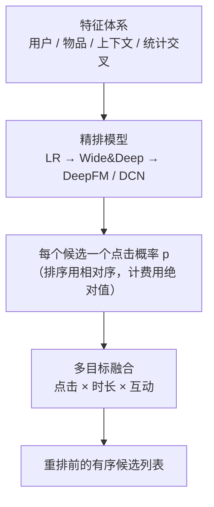
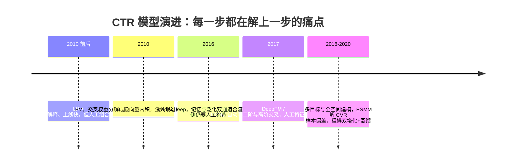

# 排序模型

> **一句话理解**：排序（精排）是对召回捞回来的几百个候选逐个"精打分"——用上用户、物品、上下文三类特征和它们之间的交叉特征，预测点击概率，把最可能点的那几个排到最前面；而这一层十年演进的主线只有一个：怎么更聪明地学特征交叉。

[⬆️ 返回总目录](../../../README.md) · [⬆️ 返回本篇](../README.md) · [⬅️ 返回本章目录](./README.md)

| 属性 | 说明 |
|------|------|
| 难度 | ⭐⭐⭐（较难） |
| 所属分支 | 推荐 |
| 前置知识 | [双塔模型与向量召回](./03-双塔模型与向量召回.md)；[逻辑回归与分类](../../2-经典机器学习/03-机器学习/03-逻辑回归与分类.md) |

---

## 📌 这一节解决什么问题

[双塔召回](./03-双塔模型与向量召回.md)帮我们从百万物品里捞回了 500 个候选——但双塔为了速度牺牲了精度：它在打分前不允许用户特征和物品特征交叉，"这个用户在这个类目的偏好强度"这类最值钱的信息全没用上。

精排（Fine-Ranking）的任务：对这几百个候选，用**又贵又准的模型**逐个算出一个点击概率。数量少了三个数量级，计算预算就能放宽到每个候选约 1 毫秒——足够跑一个吃上百个特征、带特征交叉的深度模型。

这一层也是推荐系统里"特征工程"最浓的地方：模型结构十年演进了一茬又一茬，但"特征决定上限、模型逼近上限"的行业老话，说的主要就是精排。而且精排的输出概率不只用于排序——在广告系统里它还是**计费依据**（按点击出价的广告，收多少钱 = 出价 × pCTR），这带来了排序之外的第二重硬要求：**概率的绝对值必须准**（校准），而不只是相对顺序对。

## 🌱 通俗理解

精排像一位老练的面试官。简历初筛（召回）只看硬条件，每人 10 秒；面试官（精排）不同，他手里只有 50 份简历，可以每份聊 20 分钟，而且专问**组合问题**：

- "你有支付行业经验（用户特征），这个岗位又要常出差（物品特征），你能接受吗？"——单一条件看不出的事，组合起来才见真章；
- "你上次跳槽是三年前（统计特征），这次为什么想动？"——历史行为的沉淀比当下的表态更可信。

"组合问题"在模型里就叫**交叉特征（Cross Feature）**：`用户×物品×上下文`的联合信号，往往比任何单维特征都准。精排模型十年的演进史，一言以蔽之：**怎么更聪明地学交叉**——从人工拍脑袋组合（LR），到记共现 + 泛化双通道（Wide&Deep），到让模型自己分解出任意两特征的交叉强度（FM/DeepFM）。

再补一个面试官的隐喻讲**校准**：面试官内部打分只要"谁比谁强"排对就行（排序准）；但如果公司规定"按面试分数折算 offer 薪水"，那分数的**绝对值**也必须靠谱（校准准）——把 60 分的人报成 90 分，公司就要按 90 分付钱。广告计费就是后者。

## 📋 举个例子

用户 u123（男，晚间 21:00 刷 App）的候选池里有 3 个视频，精排模型是一个带交叉特征的逻辑回归。特征与权重如下：

| 特征 | 篮球视频取值 | 数码视频取值 | 美食视频取值 | 权重 |
|------|------|------|------|------|
| 用户近 7 天"体育"类目点击数（归一化） | 0.6 | 0.2 | 0.0 | 2.0 |
| 视频近 1 小时点击率 | 0.05 | 0.04 | 0.02 | 5.0 |
| **交叉**：男性用户 × 体育视频 | 1 | 0 | 0 | 1.5 |
| 上下文：晚间时段 | 1 | 1 | 1 | 0.5 |
| 物品：时长 < 1 分钟的短视频 | 1 | 1 | 1 | 0.3 |
| 偏置项 $w_0$ | 1 | 1 | 1 | −2.0 |

点击概率用 sigmoid 把加权求和压到 0~1：

$$
p(\text{点击}) = \frac{1}{1 + e^{-(w_0 + w_1 x_1 + w_2 x_2 + \cdots + w_n x_n)}}
$$

> 👉 **人话**：把每个特征的"证据"加权求和，总分越高越像"会点"，sigmoid 负责把任意分数折算成 0%~100% 的概率。

**篮球视频**：$z = -2 + 2.0{\times}0.6 + 5.0{\times}0.05 + 1.5{\times}1 + 0.5{\times}1 + 0.3{\times}1 = 1.75$，$p = \frac{1}{1+e^{-1.75}} \approx 0.85$；

**数码视频**：$z = -2 + 0.4 + 0.2 + 0 + 0.5 + 0.3 = -0.6$，$p \approx 0.35$；

**美食视频**：$z = -2 + 0 + 0.1 + 0 + 0.5 + 0.3 = -1.1$，$p \approx 0.25$。

最终排序：**篮球 (0.85) > 数码 (0.35) > 美食 (0.25)**。注意篮球视频赢在哪里——它是唯一点亮交叉特征"男性 × 体育"的候选，1.5 的权重乘上去直接拉开了差距：**交叉特征是精排的胜负手**。

**校准视角再看同一组数字**：假设第二天上线后实测，"男性 × 晚间 × 体育短视频"这个人群真实点击率是 70%，模型说 85%——排序没受影响（三个视频的相对顺序可能仍对），但**绝对值虚高 15 个点**。如果是内容推荐，无伤大雅（只用来排序）；如果是按 pCTR 计费的广告：广告主按 0.85 被扣了钱，实际只得到 0.70 的点击——**每次曝光多收 21% 的钱**，长期看广告主要求退款、销售要背锅。这就是"排序准 ≠ 校准准"。

<details>
<summary>📊 展开看：Wide&Deep 的 wide 侧"记忆"具体记什么？</summary>

Wide&Deep（2016）把精排模型分成并联的两条通道，wide 侧（宽通道）的本质是**记住历史共现对的统计规律**：

- 它的输入是高维稀疏的 one-hot 交叉特征，比如 `男性用户 × 体育视频 × 晚间`、`刚看过球赛 × 球鞋商品`、`iOS 用户 × 周五 × 快消品类`；
- 训练时，一个共现对历史上点击率 8%，wide 侧就老老实实把"这个组合 = 0.08 的加成"背下来——像一本翻旧了的账本，查得快、记得死；
- 弱点也随之而来：**没见过的组合抓瞎**。新类目、新人群的长尾组合在账本上没有记录，wide 侧无话可说——这时靠 deep 侧（把 ID 都变成 embedding 再过 DNN）泛化兜底：没见过的组合，可以靠"向量相近"猜出个大概。

一句话：**wide 记忆"确切发生过的事"，deep 泛化"相似但没发生过的事"**。后续的 DeepFM、DCN 干的事，是把"记共现"从人工组合升级成自动学习。

**数学直觉补一层**：wide 侧对每个交叉特征 $x_{ij}$（"特征 i 出现且特征 j 出现"的 0/1 指示）学一个独立权重 $w_{ij}$——它的表达力来自"把每个组合当作独立参数"，组合出现千次以上时估计很稳，出现三次时纯属噪声，出现零次时完全空白。deep 侧把特征压成低维 embedding，组合效应由向量内积/非线性层**插值**出来——数据少时也能给出"合理猜测"，代价是数据多时精度不如 wide 死记硬背。**记忆赢在稠密共现，泛化赢在稀疏长尾**——两者失效场景恰好互补，这就是并联结构的理由。

**各自的失效场景**：

| | 失效场景 | 症状 |
|---|---|---|
| wide（记忆） | 新组合、长尾组合从未在日志出现 | 该人群推荐"无话可说"，全靠 deep 兜底甚至推偏 |
| deep（泛化） | embedding 被低频 ID 的噪声带歪；组合规律本该精确（如强规则类目） | 把"相似但不相同"的规律错误扩散，比如把"看过iPhone配件"泛化到安卓配件 |

</details>

## 🧠 核心原理

### 整体流程：从特征到排序



### 逐步拆解

**① 特征体系：四大类。**

| 类别 | 例子 |
|------|------|
| 用户特征 | ID、年龄、地域、会员等级、最近点击序列 |
| 物品特征 | ID、类目、时长、发布时间、内容 embedding |
| 上下文特征 | 时间（晚高峰）、地点、设备、入口场景 |
| **统计交叉特征** | 该用户在该类目近 7 天点击数、该物品在该人群的转化率、该用户对该作者的完播率 |

第四类是精髓：把"用户 × 物品 × 时间"的行为日志预聚合成统计量，是精排里性价比最高的一把刀。

**② CTR 模型演进一段式。** 点击率（CTR）预估模型十年三步走，每步都在回答"怎么学交叉"：



- **逻辑回归（LR）+ 手工交叉**：人工拍脑袋设计交叉特征，可解释、上线快，但人的想象力有限，长尾组合覆盖不了；
- **Wide&Deep**：wide 通道背共现账本（记忆），deep 通道用 embedding 泛化到没见过的组合——记忆与泛化双通道合流；
- **DeepFM / DCN**：不再依赖人工构造，用因子分解机（FM）或交叉网络（Cross Network）**自动学**特征交叉——任意两个特征的交叉强度由模型自己从数据里挖。

<details>
<summary>🧮 展开看：FM 的特征交叉分解——为什么 w_ij 可以拆成向量内积</summary>

**痛点**：LR 想用交叉特征 $x_i x_j$（"男性"×"体育"），就要给每个特征对学一个独立权重 $w_{ij}$。设特征总数 $n$（one-hot 后轻松上万），权重数量 $\binom{n}{2} \approx n^2/2$——上万个特征就是上亿参数，而绝大多数特征对**从未共同出现**（男性用户 × 女装类目 × 冰淇淋口味……），这些权重根本没数据可学。

**FM（Factorization Machine，因子分解机，2010）的招**：给每个特征 $i$ 学一个低维隐向量 $v_i \in \mathbb{R}^k$（k 常取 8~16），把交叉权重定义为两个隐向量的内积：

$$
w_{ij} = \langle v_i, v_j \rangle = \sum_{f=1}^{k} v_{i,f}\, v_{j,f}
$$

> 👉 **人话**：不再给"男性×体育"这个组合单开一个参数，而是给"男性"和"体育"各发一张 k 维小卡片，组合的强度 = 两张卡片逐位相乘再求和。参数量从 $O(n^2)$ 降到 $O(nk)$——上亿变上千万。

**为什么"没共同出现过的特征对"也能估出交叉强度？** 这是分解的精髓：$v_i$ 由特征 $i$ 参与**所有**交叉的训练学出，$v_j$ 同理。哪怕"男性 × 冰淇淋口味 X"这对从未直接出现，"男性"的向量已被它与"体育""数码"等大量特征的共现塑形，"冰淇淋口味 X"的向量也被它与其他人群的共现塑形——内积 $\langle v_{\text{男}}, v_{\text{口味X}} \rangle$ 借助两边在其他组合里的表现**插值**出一个合理猜测。这正是[矩阵分解](./02-协同过滤与矩阵分解.md)补空格的同款魔法：**参数共享让从未共现的组合也有话可说**——区别只是 MF 分解的是"用户×物品"，FM 分解的是"任意特征×任意特征"。

FM 的完整预测式（二阶交叉部分）：

$$
\hat{y}(x) = w_0 + \sum_{i=1}^{n} w_i x_i + \sum_{i=1}^{n}\sum_{j=i+1}^{n} \langle v_i, v_j \rangle\, x_i x_j
$$

利用恒等式 $\sum_i \sum_{j>i} \langle v_i,v_j\rangle x_i x_j = \frac{1}{2}\sum_{f=1}^{k}\left[\big(\sum_i v_{i,f} x_i\big)^2 - \sum_i v_{i,f}^2 x_i^2\right]$，交叉项可从 $O(kn^2)$ 化到 $O(kn)$——这是 FM 能在工业规模上跑起来的关键一步。

**演进逻辑收口**：DeepFM 把 FM（二阶自动交叉）与 DNN（高阶非线性）并联共享 embedding——FM 负责"二阶交叉快而稳"，DNN 负责"更高阶的组合"；DCN 则用结构化的交叉网络显式做高阶交叉。它们解决的都是 LR"人工组合不够用"、Wide&Deep"wide 侧仍需人工构造"的痛点。

</details>

**③ 校准：pCTR 的绝对值为什么必须准。** AUC 只考核"相对顺序"，但有两类场景对**绝对概率**敏感：

- **广告计费**：CPC 广告的实际扣费 = 出价 × 预估点击率（pCTR 是平台算的）。pCTR 系统性偏高 = 多收广告主的钱（客诉、法务风险）；系统性偏低 = 平台少收钱；
- **预算与保量调控**：投放系统按"预计消耗 = pCTR × 出价 × 曝光"来分配预算，pCTR 不准则分配失真。

**校准怎么量**：把预测概率分桶（如按 0.05 一档），每桶内比较"预测均值 vs 实际点击率"，画出校准曲线（reliability curve）；汇总指标常用 ECE（Expected Calibration Error，期望校准误差）——各桶 |预测均值 − 实际值| 的加权平均。

> 👉 **人话**：把模型说的"这批 1000 次曝光会有 5% 点击"和实际点击数对账。说 5% 实际也是 5% 上下，就叫校准好；说 5% 实际只有 3%，就是虚报。**AUC 管排队，校准管报数**。

**为什么精排模型常常需要专门校准**：位置偏差（排前的天然高点击，模型把"位置好"算成了"内容好"）、样本重采样（负样本下采样拉高了预测概率）、训练目标与真实分布的错位，都会让 pCTR 整体偏移。工业做法：训练后加一层校准映射，把预测概率对齐到真实率：

| 校准方法 | 做法 | 适用 |
|---------|------|------|
| 保序回归（Isotonic Regression） | 学一个单调非降的分段映射 | 数据充足时首选，不改排序只改绝对值 |
| Platt 缩放 | 在 logits 上再套一层 logistic（a·z + b） | 数据少时更稳 |
| 温度缩放 | logits 除以一个标量 T | 单参数、最简单，多分类场景常用 |

或在损失里直接对位置去偏（把位置当特征训练、预估时固定为无偏位置打分）。共同点：**校准只动绝对值、不动相对序**——AUC 不变，报数变准。

**④ 多目标排序：点击不是唯一。** 只排点击会被标题党劫持，现代精排同时预估点击率、预估时长、点赞/评论概率，再融合成一个分数：

$$
s = p_{\text{点击}}^{\alpha} \cdot p_{\text{时长}}^{\beta} \cdot p_{\text{互动}}^{\gamma}
$$

> 👉 **人话**：三个概率连乘，指数就是"话语权"——把 $\beta$ 调大，时长说了算的成分变多，标题党（点击高但立刻划走）就被压下去了。指数怎么定？先业务拍板、再用 AB 实验调，调的是平台的价值观。

**多目标的样本选择偏差（ESMM 一句话）**：CVR 模型的训练样本 traditionally 只用"点击过的曝光"——但上线时它要对**所有**召回候选打分，其中大量是"根本不会被点"的物品：**训练空间（点击后）≠ 预测空间（全部曝光）**，用点击样本学的 CVR 在全量空间上系统性跑偏（样本选择偏差，Sample Selection Bias），且点击稀少导致 CVR 样本更少。ESMM（Entire Space Multi-task Model）的思路一句话：**让 CVR 与 CTR 共享 embedding、在"全曝光空间"上用 CTR×CVR=CTCVR 联合建模**，cvr 不再单独用点击样本训练，偏差与稀疏两个问题一起解。

**⑤ 粗排的双塔化：精排思想的"反向输出"。** 粗排夹在中间最尴尬：候选几千个、预算几十毫秒，上交叉网络太贵、上双塔太糙。近年的趋势是**粗排双塔化**——把粗排也做成双塔结构（用户塔 + 物品塔 + 轻量交互），配蒸馏训练（用精排模型的分数当老师）：

| | 老式粗排（LR/小 DNN 交叉） | 双塔化粗排 |
|---|---|---|
| 计算量 | 每个候选一次完整前向，几千次算不动就砍特征 | 物品向量预计算，在线只算一次用户向量 + 批量点积 |
| 精度 | 能用交叉特征，精度潜力高 | 交叉受限（只能在向量级做轻交互），精度有损 |
| 与精排一致性 | 结构差异大，粗排觉得好的精排未必认 | 蒸馏自精排，与精排"口味"天然对齐 |

> 👉 **人话**：粗排双塔化是拿精度换速度的又一次交易——好在它牺牲的精度可以靠蒸馏补一部分，而且换来"粗排选出的候选，精排更认账"（两级列表重合度高，漏杀少）。判断标准是端到端指标：粗排换了结构后，精排打分高的候选被漏掉的比例（漏杀率）降没降。

**⑥ 评估：AUC。** 排序层的核心离线指标是 AUC（正样本得分高于负样本的概率）——它的直觉、计算与陷阱在[第 3 章模型评估与调优](../../2-经典机器学习/03-机器学习/07-模型评估与调优.md)讲过。精排的行规是：**离线 AUC 涨了才值得上线，但离线涨 0.5% 线上未必涨**——最终一切以 AB 实验的在线指标说话（见[生产实战](./99-生产实战.md)）；广告场景在 AUC 之外必须再看校准指标（ECE / 分桶偏差）。

<details>
<summary>🩺 展开看：离线 AUC 与线上效果背离——四大病因与诊断顺序</summary>

"离线涨、线上不涨"是精排工程师最常见的心碎时刻。按排查性价比从高到低，四大病因：

| 病因 | 机理 | 诊断信号 | 补救 |
|------|------|---------|------|
| **特征穿越** | 训练特征里混进了请求时刻拿不到的未来值（当天全天统计量等） | 离线涨幅反常地大；逐特征审计时间戳可复现 | point-in-time 对齐重拼样本 |
| **样本分布错位** | 训练样本是历史日志的分布，上线后模型改变曝光分布，新样本是"模型自己造的" | 离线用最近 7 天重训评估，涨幅缩水 | 线上埋点回放 + 定期近线评估 |
| **位置偏差** | 模型把"排得靠前"学成了"内容好"，离线日志里高分与好位置混杂 | 随机流量小桶里复评 AUC 明显变化 | 位置进特征 / 样本按位置加权去偏 |
| **评估口径与业务脱节** | AUC 只看单请求内排序，但用户价值在会话/长期维度 | 过程指标涨、北极星不动 | 换评估口径（会话级、长期 holdout） |

诊断顺序的道理：先查数据（穿越、错位——便宜且致命），再查偏差（位置），最后怀疑口径。一上来就改模型结构，通常是最后才该动的那张牌。

</details>

## 💻 动手试试

```python
# 玩具 CTR 精排：LR + 手工交叉特征（sklearn，真实可跑）
import numpy as np
from sklearn.linear_model import LogisticRegression

# 玩具曝光日志，每行一次曝光。
# 特征：[用户偏好体育, 视频是体育, 视频是美食, 视频是数码, 晚间, 交叉=体育用户×体育视频]
X = np.array([
    [1,1,0,0,1,1],[1,1,0,0,0,1],[1,1,0,0,1,1],[1,1,0,0,0,1],[1,1,0,0,1,1],[1,1,0,0,0,1],  # 体育迷×体育：点
    [1,0,1,0,1,0],[1,0,0,1,0,0],[1,0,1,0,0,0],[1,0,0,1,1,0],[1,0,1,0,1,0],[1,0,0,1,0,0],  # 体育迷×非体育：不点
    [1,0,0,1,1,0],[1,0,0,1,0,0],[1,0,0,1,1,0],                                             # 体育迷×数码：有时点
    [0,0,1,0,1,0],[0,0,1,0,0,0],[0,0,1,0,1,0],[0,0,1,0,0,0],[0,0,1,0,1,0],[0,0,1,0,0,0],  # 非体育迷×美食：点
    [0,1,0,0,1,0],[0,1,0,0,0,0],[0,1,0,0,1,0],[0,1,0,0,0,0],[0,1,0,0,1,0],[0,1,0,0,0,0],  # 非体育迷×体育：不点
])
y = np.array([1,1,1,1,1,1, 0,0,0,0,0,0, 1,0,1, 1,1,1,1,1,1, 0,0,0,0,0,0])                  # 1=点击 0=未点

model = LogisticRegression(max_iter=1000)
model.fit(X, y)
print("训练集平均真实点击率 =", y.mean().round(3))          # 中间变量：真实基准，校准对账用

# 给"体育迷晚间刷 App"的三个候选视频打分并排序
cands = np.array([
    [1,1,0,0,1,1],   # 体育视频
    [1,0,0,1,1,0],   # 数码视频
    [1,0,1,0,1,0],   # 美食视频
])
probs = model.predict_proba(cands)[:, 1]
for name, p in zip(["体育", "数码", "美食"], probs):
    print(f"预测点击率 {name}: {p:.3f}")
print("交叉特征（体育×体育）权重:", round(float(model.coef_[0][5]), 3))

# ---- 校准演示：整体平移打分会改变"绝对值"但不改变"排序" ----
z_shift = np.log(3.0)                                     # 模拟系统性偏差：logit 整体抬高 ln(3)
p_inflated = 1 / (1 + np.exp(-(np.log(probs/(1-probs)) + z_shift)))  # 手写 sigmoid 平移
print("虚高后的预测（排序不变，绝对值×3 odds）:", np.round(p_inflated, 3))
# 预期输出（随 sklearn 版本略有差异）：
# 预测点击率 体育: 0.743 / 数码: 0.398 / 美食: 0.597，交叉特征权重: 1.713
# 虚高后的预测 ≈ [0.897, 0.664, 0.815]——顺序完全不变，但绝对值全面虚高
# 观察：体育视频靠交叉特征拿下第一；"体育迷也常点数码"的证据太稀疏，LR 没学进去
#（数码被低估）——稀疏交叉学不动，正是 DeepFM 等自动交叉模型要解决的问题。
#
# 🧪 实验建议（改什么参数，看什么变化）：
# 1) 把第 13 行附近"体育迷×数码"那 3 行样本从 3 条复制成 30 条：数码的预测分会显著上升
#    ——体会"交叉证据越稀疏，LR 越学不动"，这正是 FM 用隐向量共享参数要解的痛点；
# 2) z_shift 改成 np.log(0.5)：绝对值全面压低，排序依旧不变——排序与校准是两件事；
# 3) 删掉最后一列交叉特征重训：体育视频的预测优势会缩水——交叉特征"胜负手"不是说说而已。
```

## 🔥 炼丹小灶

> 🔥 **炼丹小灶**：CTR 模型的工业起点配方——
> - 配方：embedding 维度 8~16 起步（FM 隐向量同量级）；Adam lr 1e-3；batch 512~4096；早停看验证集 AUC；统计交叉特征先上一版再谈深度结构；广告场景训完必做校准（保序回归/Platt）再计费；
> - 玄学：AUC 不涨先加特征、再调正则，最后才动模型结构；多目标指数从业务先验拍起，一次只动一个再做 AB；CVR 别只用点击样本硬训，ESMM 式全空间建模或至少看一眼样本选择偏差；
> - ⚠️ 以上是经验参考值，不是圣旨；换场景请重新炼。

## 🔗 在知识树中的位置

- **上游**：[双塔模型与向量召回](./03-双塔模型与向量召回.md)——精排的候选由它供给；[逻辑回归与分类](../../2-经典机器学习/03-机器学习/03-逻辑回归与分类.md)——精排最老也最长寿的基线模型；
- **下游**：[生产实战](./99-生产实战.md)——精排上线后如何 AB、如何监控；
- **横向对比**：与[模型评估与调优](../../2-经典机器学习/03-机器学习/07-模型评估与调优.md)共用 AUC 一套语言，但推荐场景多了"离线在线指标对齐"与"校准"两道坎；FM 的隐向量交叉与[矩阵分解](./02-协同过滤与矩阵分解.md)是同一数学骨架在不同对象上的落地。

## ⚠️ 常见误区

- **误区一**：离线 AUC 涨 = 线上一定涨 → 样本分布、特征穿越、位置偏差都可能让两者背离；AUC 是"值得上线"的门票，不是"必然涨点"的保证；
- **误区二**：精排分数就是用户最终看到的顺序 → 后面还有重排层做打散、多样性、业务规则，最终顺序经常与精排分数不同；
- **误区三**：多目标权重定一次就一劳永逸 → 指数是平台的价值观旋钮，业务阶段变了（拉新期/留存期）要跟着调；
- **误区四**：排序准就万事大吉 → 广告计费、预算分配、保量调控都吃 pCTR 的**绝对值**；不做校准，AUC 再高也是在错误的价格上做正确的排序；
- **误区五**：CVR 模型用点击样本训练理所当然 → 训练空间（点击后）和预测空间（全曝光）不一致，样本选择偏差让 CVR 在全空间系统性跑偏；ESMM 用"全空间联合建模 CTR×CVR"把这个偏差连着稀疏问题一起解。

## 📝 小结与自测

**要点回顾**

- 精排对几百个候选逐个精打分：计算预算放宽，才用得起交叉特征与复杂结构；
- 特征四大类：用户 / 物品 / 上下文 / 统计交叉，第四类性价比最高；
- CTR 模型演进三步：LR 手工交叉 → Wide&Deep 记忆+泛化双通道（wide 记稠密共现、deep 泛化稀疏长尾，失效场景互补）→ DeepFM/DCN 自动学交叉；
- FM 把交叉权重分解为隐向量内积 $w_{ij}=\langle v_i,v_j\rangle$，参数从 $O(n^2)$ 降到 $O(nk)$，且从未共现的特征对也能靠参数共享插值出交叉强度；
- 校准管绝对值、AUC 管相对序：广告按 pCTR 计费，虚报直接变成多收/少收钱——训练后加保序回归/Platt 缩放是标配；
- ESMM 一句话：CVR 与 CTR 共享 embedding、在全曝光空间用 CTR×CVR=CTCVR 联合建模，解样本选择偏差与稀疏；
- 粗排双塔化 = 精度换速度 + 蒸馏找补，成败看"精排高分候选被漏杀的比例"；
- 评估看 AUC（广告加校准），但最终以 AB 实验在线指标为准。

**自测一下**（点击展开答案）

<details>
<summary>问题 1：为什么交叉特征"男性 × 体育"比"男性"和"体育"两个单特征更有价值？</summary>

单特征只提供边际信息："男性平均点击率高一点""体育视频平均点击率高一点"；交叉特征刻画的是**联合效应**——也许男性看体育的概率是 80%，远高于两个边际效应相加的结果。凡是"组合起来才爆发的规律"，都要靠交叉特征（或能自动学交叉的模型）捕捉。

</details>

<details>
<summary>问题 2：多目标融合公式里，把时长指数 β 调大会发生什么？</summary>

时长在总分里的话语权变大：点击高但秒划的标题党内容总分被压低，深度内容（点击一般但看得久）排名上升。副作用是"标题不够吸引人的长内容"可能被过度奖励，需要配合互动目标与 AB 实验找平衡点。

</details>

<details>
<summary>问题 3：FM 为什么能给"从未共同出现过的特征对"估出交叉强度？</summary>

因为交叉权重是隐向量内积、参数是共享的：$v_i$ 由特征 i 与所有其他特征的共现训练塑形，$v_j$ 同理——两个向量各自携带了丰富的"协作历史"，即使 i、j 直接共现次数为零，内积也能借助它们在其他组合中的表现插值出合理猜测。这和矩阵分解能补全矩阵空格是同一个机制：分解 + 参数共享让"没见过的格子"有话可说。

</details>

<details>
<summary>问题 4：同一个模型，AUC 很高但广告主投诉计费不准，可能是什么问题？怎么修？</summary>

AUC 高说明相对顺序对，但绝对概率偏了——校准问题。常见成因：位置偏差（排前位置的高点击被算成内容好）、负样本下采样未做概率还原、训练分布与线上分布错位。诊断：按预测概率分桶对账（校准曲线 / ECE），看系统性偏移方向。修复：训练后加保序回归或 Platt 缩放（用延迟窗口的真实日志对齐），或在损失里显式做位置去偏。

</details>

<details>
<summary>问题 5：ESMM 解决的"样本选择偏差"具体指什么？</summary>

CVR 的传统训练样本只用"被点击的曝光"（因为转化标签只存在于点击之后），但上线后模型必须对所有曝光候选打分——训练空间（点击空间）与预测空间（全曝光空间）不一致，且点击空间里的样本分布天然偏（高 CTR 内容富集），学出的 CVR 用到全空间就系统性跑偏。ESMM 让 CVR 与 CTR 共享 embedding，在全曝光空间上以 CTR×CVR=CTCVR 联合建模，等价于把 CVR 的学习"搬回"它真正要服务的空间，顺带让稀疏的转化标签借力丰富的点击标签。

</details>

<details>
<summary>问题 6：粗排从交叉网络换成双塔化后，怎么判断这笔"精度换速度"的买卖划不划算？</summary>

不能只看粗排自己的离线指标，要看端到端的两头：一是"漏杀率"——精排打分高的候选有没有被粗排提前砍掉（对齐精排分数排名看粗排保留集合的覆盖）；二是最终线上指标——用户的点击/时长有没有变化。粗排自己的 AUC 涨跌都不作数：它可能精度降了，但因为与精排口味更对齐（蒸馏）反而端到端更好；也可能自身指标漂亮但漏杀了精排本可救活的长尾候选。中间层永远为最终层服务，这是漏斗架构的评估铁律。

</details>

## 📚 延伸阅读

- 论文：Wide & Deep Learning for Recommender Systems（2016）——记忆与泛化双通道的出处，https://arxiv.org/abs/1606.07792
- 论文：Factorization Machines（2010）——特征交叉分解的源头，https://www.csie.ntu.edu.tw/~cjlin/papers/ffm.pdf
- 论文：DeepFM: A Factorization-Machine based Neural Network for CTR Prediction（2017），https://arxiv.org/abs/1703.04247
- 论文：Entire Space Multi-Task Model: An Effective Approach for Estimating Post-Click Conversion Rate（ESMM, 2018），https://arxiv.org/abs/1804.07931
- 论文：Deep & Cross Network for Ad Click Predictions（2017），https://arxiv.org/abs/1708.05123

---

[⬅️ 上一页：双塔模型与向量召回](./03-双塔模型与向量召回.md) · [返回本章目录](./README.md) · [下一页：生产实战 ➡️](./99-生产实战.md)
