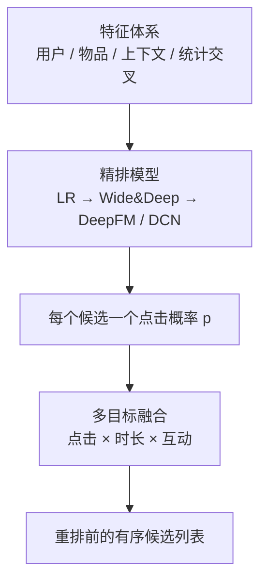

# 排序模型

> **一句话理解**：排序（精排）是对召回捞回来的几百个候选逐个"精打分"——用上用户、物品、上下文三类特征和它们之间的交叉特征，预测点击概率，把最可能点的那几个排到最前面。

[⬆️ 返回总目录](../../../README.md) · [⬆️ 返回本篇](../README.md) · [⬅️ 返回本章目录](./README.md)

| 属性 | 说明 |
|------|------|
| 难度 | ⭐⭐⭐（较难） |
| 所属分支 | 推荐 |
| 前置知识 | [双塔模型与向量召回](./03-双塔模型与向量召回.md)；[逻辑回归与分类](../../2-经典机器学习/03-机器学习/03-逻辑回归与分类.md) |

---

## 📌 这一节解决什么问题

[双塔召回](./03-双塔模型与向量召回.md)帮我们从百万物品里捞回了 500 个候选——但双塔为了速度牺牲了精度：它在打分前不允许用户特征和物品特征交叉，"这个用户在这个类目的偏好强度"这类最值钱的信息全没用上。

精排（Fine-Ranking）的任务：对这几百个候选，用**又贵又准的模型**逐个算出一个点击概率。数量少了三个数量级，计算预算就能放宽到每个候选约 1 毫秒——足够跑一个吃上百个特征、带特征交叉的深度模型。

这一层也是推荐系统里"特征工程"最浓的地方：模型结构十年演进了一茬又一茬，但"特征决定上限、模型逼近上限"的行业老话，说的主要就是精排。

## 🌱 通俗理解

精排像一位老练的面试官。简历初筛（召回）只看硬条件，每人 10 秒；面试官（精排）不同，他手里只有 50 份简历，可以每份聊 20 分钟，而且专问**组合问题**：

- "你有支付行业经验（用户特征），这个岗位又要常出差（物品特征），你能接受吗？"——单一条件看不出的事，组合起来才见真章；
- "你上次跳槽是三年前（统计特征），这次为什么想动？"——历史行为的沉淀比当下的表态更可信。

"组合问题"在模型里就叫**交叉特征（Cross Feature）**：`用户×物品×上下文`的联合信号，往往比任何单维特征都准。精排模型十年的演进史，一言以蔽之：**怎么更聪明地学交叉**。

## 📋 举个例子

用户 u123（男，晚间 21:00 刷 App）的候选池里有 3 个视频，精排模型是一个带交叉特征的逻辑回归。特征与权重如下：

| 特征 | 篮球视频取值 | 数码视频取值 | 美食视频取值 | 权重 |
|------|------|------|------|------|
| 用户近 7 天"体育"类目点击数（归一化） | 0.6 | 0.2 | 0.0 | 2.0 |
| 视频近 1 小时点击率 | 0.05 | 0.04 | 0.02 | 5.0 |
| **交叉**：男性用户 × 体育视频 | 1 | 0 | 0 | 1.5 |
| 上下文：晚间时段 | 1 | 1 | 1 | 0.5 |
| 物品：时长 < 1 分钟的短视频 | 1 | 1 | 1 | 0.3 |
| 偏置项 $w_0$ | 1 | 1 | 1 | −2.0 |

点击概率用 sigmoid 把加权求和压到 0~1：

$$
p(\text{点击}) = \frac{1}{1 + e^{-(w_0 + w_1 x_1 + w_2 x_2 + \cdots + w_n x_n)}}
$$

> 👉 **人话**：把每个特征的"证据"加权求和，总分越高越像"会点"，sigmoid 负责把任意分数折算成 0%~100% 的概率。

**篮球视频**：$z = -2 + 2.0{\times}0.6 + 5.0{\times}0.05 + 1.5{\times}1 + 0.5{\times}1 + 0.3{\times}1 = 1.75$，$p = \frac{1}{1+e^{-1.75}} \approx 0.85$；

**数码视频**：$z = -2 + 0.4 + 0.2 + 0 + 0.5 + 0.3 = -0.6$，$p \approx 0.35$；

**美食视频**：$z = -2 + 0 + 0.1 + 0 + 0.5 + 0.3 = -1.1$，$p \approx 0.25$。

最终排序：**篮球 (0.85) > 数码 (0.35) > 美食 (0.25)**。注意篮球视频赢在哪里——它是唯一点亮交叉特征"男性 × 体育"的候选，1.5 的权重乘上去直接拉开了差距：**交叉特征是精排的胜负手**。

<details>
<summary>📊 展开看：Wide&Deep 的 wide 侧"记忆"具体记什么？</summary>

Wide&Deep（2016）把精排模型分成并联的两条通道，wide 侧（宽通道）的本质是**记住历史共现对的统计规律**：

- 它的输入是高维稀疏的 one-hot 交叉特征，比如 `男性用户 × 体育视频 × 晚间`、`刚看过球赛 × 球鞋商品`、`iOS 用户 × 周五 × 快消品类`；
- 训练时，一个共现对历史上点击率 8%，wide 侧就老老实实把"这个组合 = 0.08 的加成"背下来——像一本翻旧了的账本，查得快、记得死；
- 弱点也随之而来：**没见过的组合抓瞎**。新类目、新人群的长尾组合在账本上没有记录，wide 侧无话可说——这时靠 deep 侧（把 ID 都变成 embedding 再过 DNN）泛化兜底：没见过的组合，可以靠"向量相近"猜出个大概。

一句话：**wide 记忆"确切发生过的事"，deep 泛化"相似但没发生过的事"**。后续的 DeepFM、DCN 干的事，是把"记共现"从人工组合升级成自动学习。

</details>

## 🧠 核心原理

### 整体流程：从特征到排序



### 逐步拆解

**① 特征体系：四大类。**

| 类别 | 例子 |
|------|------|
| 用户特征 | ID、年龄、地域、会员等级、最近点击序列 |
| 物品特征 | ID、类目、时长、发布时间、内容 embedding |
| 上下文特征 | 时间（晚高峰）、地点、设备、入口场景 |
| **统计交叉特征** | 该用户在该类目近 7 天点击数、该物品在该人群的转化率、该用户对该作者的完播率 |

第四类是精髓：把"用户 × 物品 × 时间"的行为日志预聚合成统计量，是精排里性价比最高的一把刀。

**② CTR 模型演进一段式。** 点击率（CTR）预估模型十年三步走，每步都在回答"怎么学交叉"：

- **逻辑回归（LR）+ 手工交叉**：人工拍脑袋设计交叉特征，可解释、上线快，但人的想象力有限，长尾组合覆盖不了；
- **Wide&Deep**：wide 通道背共现账本（记忆），deep 通道用 embedding 泛化到没见过的组合——记忆与泛化双通道合流；
- **DeepFM / DCN**：不再依赖人工构造，用因子分解机（FM）或交叉网络（Cross Network）**自动学**特征交叉——任意两个特征的交叉强度由模型自己从数据里挖。

**③ 多目标排序：点击不是唯一。** 只排点击会被标题党劫持，现代精排同时预估点击率、预估时长、点赞/评论概率，再融合成一个分数：

$$
s = p_{\text{点击}}^{\alpha} \cdot p_{\text{时长}}^{\beta} \cdot p_{\text{互动}}^{\gamma}
$$

> 👉 **人话**：三个概率连乘，指数就是"话语权"——把 $\beta$ 调大，时长说了算的成分变多，标题党（点击高但立刻划走）就被压下去了。指数怎么定？先业务拍板、再用 AB 实验调，调的是平台的价值观。

**④ 评估：AUC。** 排序层的核心离线指标是 AUC（正样本得分高于负样本的概率）——它的直觉、计算与陷阱在[第 3 章模型评估与调优](../../2-经典机器学习/03-机器学习/07-模型评估与调优.md)讲过。精排的行规是：**离线 AUC 涨了才值得上线，但离线涨 0.5% 线上未必涨**——最终一切以 AB 实验的在线指标说话（见[生产实战](./99-生产实战.md)）。

## 💻 动手试试

```python
# 玩具 CTR 精排：LR + 手工交叉特征（sklearn，真实可跑）
import numpy as np
from sklearn.linear_model import LogisticRegression

# 玩具曝光日志，每行一次曝光。
# 特征：[用户偏好体育, 视频是体育, 视频是美食, 视频是数码, 晚间, 交叉=体育用户×体育视频]
X = np.array([
    [1,1,0,0,1,1],[1,1,0,0,0,1],[1,1,0,0,1,1],[1,1,0,0,0,1],[1,1,0,0,1,1],[1,1,0,0,0,1],  # 体育迷×体育：点
    [1,0,1,0,1,0],[1,0,0,1,0,0],[1,0,1,0,0,0],[1,0,0,1,1,0],[1,0,1,0,1,0],[1,0,0,1,0,0],  # 体育迷×非体育：不点
    [1,0,0,1,1,0],[1,0,0,1,0,0],[1,0,0,1,1,0],                                             # 体育迷×数码：有时点
    [0,0,1,0,1,0],[0,0,1,0,0,0],[0,0,1,0,1,0],[0,0,1,0,0,0],[0,0,1,0,1,0],[0,0,1,0,0,0],  # 非体育迷×美食：点
    [0,1,0,0,1,0],[0,1,0,0,0,0],[0,1,0,0,1,0],[0,1,0,0,0,0],[0,1,0,0,1,0],[0,1,0,0,0,0],  # 非体育迷×体育：不点
])
y = np.array([1,1,1,1,1,1, 0,0,0,0,0,0, 1,0,1, 1,1,1,1,1,1, 0,0,0,0,0,0])                  # 1=点击 0=未点

model = LogisticRegression(max_iter=1000)
model.fit(X, y)

# 给"体育迷晚间刷 App"的三个候选视频打分并排序
cands = np.array([
    [1,1,0,0,1,1],   # 体育视频
    [1,0,0,1,1,0],   # 数码视频
    [1,0,1,0,1,0],   # 美食视频
])
for name, p in zip(["体育", "数码", "美食"], model.predict_proba(cands)[:, 1]):
    print(f"预测点击率 {name}: {p:.3f}")
print("交叉特征（体育×体育）权重:", round(float(model.coef_[0][5]), 3))
# 预期输出（随 sklearn 版本略有差异）：
# 预测点击率 体育: 0.743 / 数码: 0.398 / 美食: 0.597，交叉特征权重: 1.713
# 观察：体育视频靠交叉特征拿下第一；但"体育迷也常点数码"的证据太稀疏，
# LR 没学进去（数码被低估）——稀疏交叉学不动，正是 DeepFM 等自动交叉模型要解决的问题。
```

## 🔥 炼丹小灶

> 🔥 **炼丹小灶**：CTR 模型的工业起点配方——
> - 配方：embedding 维度 8~16 起步；Adam lr 1e-3；batch 512~4096；早停看验证集 AUC；统计交叉特征先上一版再谈深度结构；
> - 玄学：AUC 不涨先加特征、再调正则，最后才动模型结构；多目标指数从业务先验拍起，一次只动一个再做 AB；
> - ⚠️ 以上是经验参考值，不是圣旨；换场景请重新炼。

## 🔗 在知识树中的位置

- **上游**：[双塔模型与向量召回](./03-双塔模型与向量召回.md)——精排的候选由它供给；[逻辑回归与分类](../../2-经典机器学习/03-机器学习/03-逻辑回归与分类.md)——精排最老也最长寿的基线模型；
- **下游**：[生产实战](./99-生产实战.md)——精排上线后如何 AB、如何监控；
- **横向对比**：与[模型评估与调优](../../2-经典机器学习/03-机器学习/07-模型评估与调优.md)共用 AUC 一套语言，但推荐场景多了"离线在线指标对齐"这道坎。

## ⚠️ 常见误区

- **误区一**：离线 AUC 涨 = 线上一定涨 → 样本分布、特征穿越、位置偏差都可能让两者背离；AUC 是"值得上线"的门票，不是"必然涨点"的保证；
- **误区二**：精排分数就是用户最终看到的顺序 → 后面还有重排层做打散、多样性、业务规则，最终顺序经常与精排分数不同；
- **误区三**：多目标权重定一次就一劳永逸 → 指数是平台的价值观旋钮，业务阶段变了（拉新期/留存期）要跟着调。

## 📝 小结与自测

**要点回顾**

- 精排对几百个候选逐个精打分：计算预算放宽，才用得起交叉特征与复杂结构；
- 特征四大类：用户 / 物品 / 上下文 / 统计交叉，第四类性价比最高；
- CTR 模型演进三步：LR 手工交叉 → Wide&Deep 记忆+泛化双通道 → DeepFM/DCN 自动学交叉；
- 多目标融合用指数控制各目标"话语权"，本质是在给业务价值观建模；
- 评估看 AUC，但最终以 AB 实验在线指标为准。

**自测一下**（点击展开答案）

<details>
<summary>问题 1：为什么交叉特征"男性 × 体育"比"男性"和"体育"两个单特征更有价值？</summary>

单特征只提供边际信息："男性平均点击率高一点""体育视频平均点击率高一点"；交叉特征刻画的是**联合效应**——也许男性看体育的概率是 80%，远高于两个边际效应相加的结果。凡是"组合起来才爆发的规律"，都要靠交叉特征（或能自动学交叉的模型）捕捉。

</details>

<details>
<summary>问题 2：多目标融合公式里，把时长指数 β 调大会发生什么？</summary>

时长在总分里的话语权变大：点击高但秒划的标题党内容总分被压低，深度内容（点击一般但看得久）排名上升。副作用是"标题不够吸引人的长内容"可能被过度奖励，需要配合互动目标与 AB 实验找平衡点。

</details>

## 📚 延伸阅读

- 论文：Wide & Deep Learning for Recommender Systems（2016）——记忆与泛化双通道的出处，https://arxiv.org/abs/1606.07792
- 论文：DeepFM: A Factorization-Machine based Neural Network for CTR Prediction（2017），https://arxiv.org/abs/1703.04247
- 论文：Deep & Cross Network for Ad Click Predictions（2017），https://arxiv.org/abs/1708.05123

---

[⬅️ 上一页：双塔模型与向量召回](./03-双塔模型与向量召回.md) · [返回本章目录](./README.md) · [下一页：生产实战 ➡️](./99-生产实战.md)
