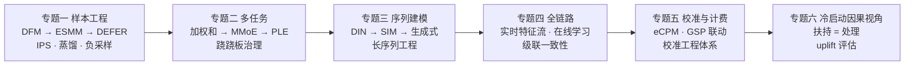
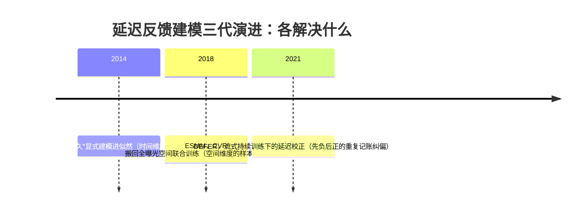
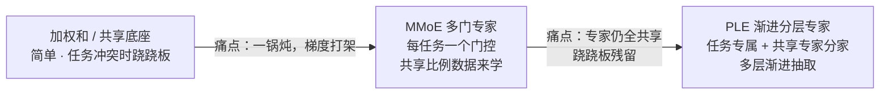
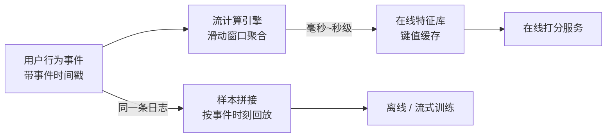
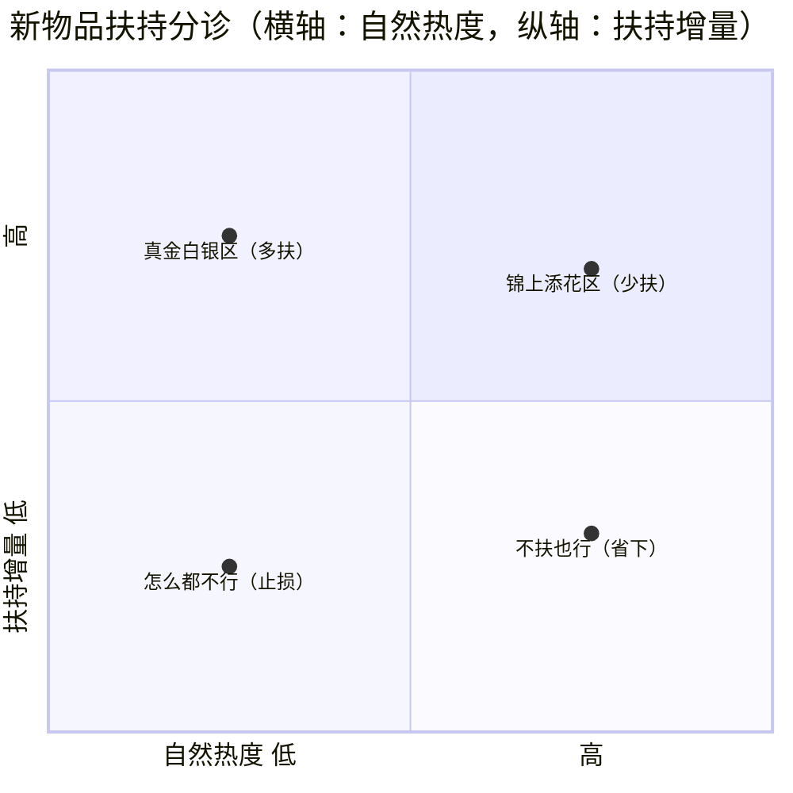

# 进阶专题：大规模推荐系统

> **一句话理解**：把第 1~4 页的"模型视角"翻转成"系统视角"——在亿级用户的推荐系统里，决定上限的往往不是模型结构，而是六件"模型外面"的事：样本怎么造（标签对不对）、多任务怎么共享（梯度打不打架）、序列怎么存（万级行为怎么进毫秒链路）、特征怎么流（实时窗口的语义）、分数怎么计费（校准错了直接亏钱）、冷启怎么试（扶持的因果效应怎么量）；这一页把这六条护城河逐条挖开。

[⬆️ 返回总目录](../../../README.md) · [⬆️ 返回本篇](../README.md) · [⬅️ 返回本章目录](./README.md)

| 属性 | 说明 |
|------|------|
| 难度 | ⭐⭐⭐⭐（高阶） |
| 所属分支 | 推荐 |
| 前置知识 | [推荐系统全景](./01-推荐系统全景.md)、[协同过滤与矩阵分解](./02-协同过滤与矩阵分解.md)、[双塔模型与向量召回](./03-双塔模型与向量召回.md)、[排序模型](./04-排序模型.md) |

---

## 📌 这一节解决什么问题

前四页按"层"讲模型：协同过滤、双塔、排序，各自解决自己那一层的精度问题。但把镜头拉到真实的大规模系统（日活千万到亿级），你会发现团队大部分时间不在调模型，而在处理四类"模型外"的难题：

1. **标签从哪来、对不对**——转化可能发生在曝光三天后，急着拼样本会把"慢热的正样本"标成负的；只有被曝光过的物品才有标签，曝光本身又是上一个模型选的（偏差体系见[第 2 页](./02-协同过滤与矩阵分解.md)）；
2. **多个任务怎么共存**——点击、时长、互动的梯度会互相拉扯，一个底座硬扛几个任务是"跷跷板"的温床；
3. **用户的万级行为序列怎么进几百毫秒的链路**——注意力算不动五万条历史，工程和模型要一起动手；
4. **钱的口径**——广告按 pCTR 计费，校准差一个点，多收/少收的都是真金白银；冷启扶持花了流量，效果怎么算才不是自我感动。

这四类问题各自长成了一整套工程与建模体系，也是论文里最容易被一句话带过、工业界却投入最多人的地方。本页按六条主线展开：**样本工程、多任务建模、序列建模、全链路架构、校准与计费、冷启动的因果视角**——每条都讲清楚"演进逻辑"（每一代解决上一代什么问题）与"失效边界"。

一个贯穿全页的立场：**推荐系统论文与工业的裂缝，主要不在模型，而在数据与系统**。读完这一页再回头看前四页，你会知道每个模型"活在"什么样的管道里。

## 🌱 通俗理解

把推荐系统想象成一家**连锁餐饮集团**，前四页讲的是"单店大厨的手艺"（模型），这一页讲的是集团的总后勤：

- **样本工程 = 中央厨房的进货验收**：菜（日志）进来了，验收员要判断"这批牛肉是没卖出去（真没人买）还是还没送到（延迟反馈）"——验收标准错了，大厨手艺再好也是白搭；
- **多任务建模 = 后厨分工**：一个灶台（共享底座）同时炒川菜和粤菜会串味，请几个专属灶（任务专家）+ 一个调度（门控）各自取料，才不互相拉扯；
- **序列建模 = 会员消费档案**：常客五年的点单记录塞不进一张菜单，得先按"今晚想吃辣的"把相关记录筛出来（检索）再细看；
- **全链路架构 = 供应链与配送**：食材要新鲜到分钟（实时特征流），菜单每天微调而不是推倒重来（小步快更），总仓和分店的账要对得上（级联一致性）；
- **校准与计费 = 收银台的定价系统**：估价（pCTR）虚高就多收客人的钱——收银的算式直接吃估价，估错就亏钱；
- **冷启动的因果视角 = 新品试吃的评估**：不能拿"主动来试吃的人"（本来就想吃）证明试吃活动有效——要随机拉人来试，和没试的比，才算出试吃本身的功劳。

## 📋 举个例子

用一个数字场景建立规模感（量级均为行业公开口径的**经验参考**，各厂差异大）：

设定：一个内容平台，日活 1 亿，人均每天刷新 50 次，每次曝光 10 条。

| 环节 | 量级（经验参考） | 说明 |
|------|------|------|
| 日请求量 | ~50 亿 | 1 亿 × 50 次 |
| 日曝光样本量 | ~500 亿 | 50 亿 × 每屏 10 条，每条曝光都是一条潜在训练样本 |
| 样本原始存储 | 日增百 TB 级 | 500 亿条 × 每条 0.2~1 KB 的示意估算 |
| 特征读取延迟 | P99 < 20 ms | 用户画像、实时行为序列全内存缓存 |
| 行为序列 | 短期数百条 / 长期数万条 | 短序列全量进模型，长序列要检索（专题三） |
| 模型更新节奏 | 小时级增量 + 天级全量 | "小步快更"（专题四） |

这张表解释了本页所有设计的由来：**当样本量是"百亿/日"时，任何"全量重算、精确等待、统一重训"的朴素做法都会被量级击穿**——延迟反馈要"边到边学"、多任务要"一次训练多个头"、序列要"先检索再注意"、更新要"增量不停机"。规模不是背景板，规模本身就是设计约束。

<details>
<summary>📊 展开看：延迟反馈在真实数据里有多严重</summary>

广告转化的经典观察（Chapelle 对 Criteo 展示广告数据的分析，KDD 2014）：相当比例的转化发生在点击后很久，后续文献常引用"仅约 35% 的转化反馈能在常规观察窗口内被观测到"。翻译成样本语言：如果你用 30 分钟窗口拼样本，大约三分之二的正样本会被错标成负样本——模型的转化率预估被系统性腰斩再腰斩。这就是延迟反馈（Delayed Feedback）被称为"转化建模第一问题"的原因：**不是模型不准，是标签本身就错**。

</details>

## 🧠 核心原理

### 全页地图



六条线可以按任意顺序读，但建议顺序：先样本（数据的地基），再模型侧两件（多任务、序列），再系统侧两件（链路、计费），最后冷启动收束到因果。

---

### 专题一：样本工程——推荐系统真正的护城河

工业界一句行话：**模型是下水道，样本才是地基**（更文雅的版本："样本决定上限，模型逼近上限"）。样本工程回答三个问题：标签怎么定（延迟反馈）、观测怎么纠偏（曝光偏差）、样本怎么省（蒸馏与负采样）。

#### 1.1 延迟反馈体系：DFM → ESMM → DEFER 的演进逻辑链

**问题原点**：转化（下单、付费、留资）常常发生在曝光后几分钟到几天。流式训练等不起"永远等到标签确定"，于是陷入两难——**等窗口期，模型滞后于世界；不等，标签是脏的**（慢热正样本被标成负）。这条演进链的每一代，都是在"等与不等"之间换一种活法：



**第一代 · DFM（Delayed Feedback Model，Chapelle，KDD 2014）**：不再把"窗口内没转化"硬当负样本，而是把**转化何时发生**也建成模型的一部分——假设"会转化的人"的延迟时间服从某个分布（论文用指数族）：

$$
P(\text{转化时刻} = t \mid \text{会转化}) = \lambda e^{-\lambda t}, \quad t \ge 0
$$

> 👉 **人话**：给"多久转化"画一条先衰曲线——转化大多发生在刚曝光那阵子，越拖越少。"窗口内还没转化"的样本不再被硬判为负，而是按这条曲线算"它还有多大机会是正的"，似然里两头下注。它解决的是**时间维度**的标签不确定：不用等窗口，也能从脏样本里学出干净的转化率。

**第二代 · ESMM（Entire Space Multi-task Model，2018，[第 4 页](./04-排序模型.md)已给一句话）**：它解决的是另一个正交的维度——**样本选择偏差（Sample Selection Bias）**：CVR 的传统训练样本只能来自"被点击的曝光"（转化标签只在点击后存在），但上线要对全部曝光打分。ESMM 的招是全空间联合建模：

$$
\underbrace{p_{\text{CTCVR}}}_{\text{点击且转化}} = \underbrace{p_{\text{CTR}}}_{\text{点击}} \times \underbrace{p_{\text{CVR}}}_{\text{点击后转化}}, \qquad
L = L_{\text{CTR}} + L_{\text{CTCVR}} \quad \text{（都在全曝光空间上算）}
$$

> 👉 **人话**：CVR 不再单独用点击样本训，而是作为"CTCVR ÷ CTR"的隐含量，跟着点击标签在全曝光空间一起学——**训练空间被搬回了它将来要服务的空间**，顺带让稀疏的转化标签借力丰富的点击标签。注意它解决的是"空间错位"，不是"时间错位"：ESMM 假设标签是确定的，只是样本被选过；DFM 处理的才是"标签还没揭晓"。两代是互补关系，不是替代关系。

**第三代 · DEFER（Delayed Feedback modeling with Real negatives，2021）**：流式持续训练时代的产物。持续训练（样本随到随学）里一条样本的自然活法是：先以"暂定负例"入训，转化真正到达后再补录一次正例——**同一条样本被记两次账**，负例是"假"的。DEFER 的思路（延迟校正）：把确定安全的真负例（超过延迟分布尾部的老样本）正常吞下，对"先负后正"的重复记账用**反事实损失（Counterfactual Loss）**校正——重复样本不该按两票算，按"它成为假负例的概率"折算权重。

> 👉 **人话**：前两代分别管好了"时间"和"空间"，DEFER 管的是"流水线节奏"——在不等窗口的前提下，把"先当负例学了一遍、后来发现是正的"这笔糊涂账，用概率折价算清楚。三代的演进逻辑一句话：**DFM 让"不等"可学（建模延迟），ESMM 让"学的地方"对齐（全空间），DEFER 让"随到随学"可信（重复记账纠偏）**。

<details>
<summary>🧮 展开看：一个窗口期的数字账——30 分钟窗口会错标多少</summary>

设定：曝光后转化的延迟时间服从中位数 6 小时的分布（电商场景的经验形态），观察窗口 30 分钟，真实转化率 2%。

- 一个转化者"在 30 分钟内转化"的概率：指数分布下 $P(t \le 0.5\,\text{h}) = 1 - e^{-\ln 2 \times 0.5 / 6} \approx 5.6\%$（中位数 6 小时意味着一半转化发生在 6 小时之后）；
- 于是 2% 的真实转化率，在 30 分钟窗口下能被正确标出的只有 2% × 5.6% ≈ 0.11%——**其余约 1.89% 的正样本全部被标成负**；
- 模型在这样的样本上学出的 CVR 会向"零转化"方向严重塌缩，且**越是有耐心比价的用户（延迟越长）越被系统性低估**——偏差还不是均匀的。

这就是"窗口太短 → 系统性低估；拉长窗口 → 模型滞后（大促模式晚一周学到）"的两难，DFM/DEFER 类方法的价值就是把这对两难解开。把窗口拉到 7 天重算一遍上面的账，感受"等"的成本：标签新鲜度掉到周级，模型学到的是"上周的世界"。

</details>

#### 1.2 曝光偏差与 IPS 纠偏（一句话版）

**逆概率加权（IPS，Inverse Propensity Scoring）**：给每条观测样本乘以"它被曝光概率"的倒数，把"被上一个模型筛选过的分布"加权还原回全库分布——与[第 11 章](../11-因果推断/02-因果推断方法工具箱.md)用倾向得分修正"谁被处理"的混杂是同一套数学。完整谱系（曝光/位置/流行度偏差的生成机理与症状）见[第 2 页的偏差体系表](./02-协同过滤与矩阵分解.md)；这里只留一句工程提醒：**倾向分本身要用历史策略估计，策略一变倾向分就过期——纠偏器也有保质期**。

#### 1.3 样本蒸馏与负采样策略：省与准的艺术

百亿日增样本不可能全量喂精排训练，"省"本身成了一门手艺：

- **样本蒸馏（知识蒸馏，Knowledge Distillation）**：粗排的正例天然就是"精排分数高的曝光"，但用精排的**连续分数当软标签**（而不只是 0/1）训练粗排，能把精排的"口味"传给粗排——这就是[第 4 页](./04-排序模型.md)"粗排双塔化 + 蒸馏"的样本侧实现。中间层永远向最终层对齐，蒸馏是手段；
- **负采样策略（召回侧）**：in-batch 负例 + logQ 纠偏（[第 3 页](./03-双塔模型与向量召回.md)详讲）之外，工业上还讲究**难负例的课程化**：训练早期全随机（铺类目级结构），后期逐步掺入"高相似但未点击"的难负例（抠细边界），一步到位的难负配置反而学不出层次（经验参考）；
- **正样本的加权**：不是所有正样本等价——完播 30 秒和 3 秒的点击、复购与冲动单，标签置信度不同；工业常按行为深度给正样本加权或拆成多个目标头，让"信号强度"进损失（经验参考）。

#### 1.4 流式样本拼接：曝光流与行为流的双流 join

延迟反馈不只发生在"标签语义"层，也发生在"管道"层。流式训练的样本不是批处理里"一天拼一次"，而是两条流速不同的流实时汇合：

- **曝光流**：快而全——每次曝光立刻产生一条"潜在样本"（此刻还没有标签）；
- **行为流**：慢而稀——点击/转化在几秒到几天后陆续到达，携带标签。

样本拼接 = 按（请求 ID、物品 ID）对两条流做**窗口 join（Windowed Join）**：曝光到达后开一个等待窗口，窗口内等到了点击 → 直接拼成正样本；没等到 → 暂定负样本先放行（等 DEFER 类校正），或继续等（窗口由延迟分布与业务新鲜度共同决定）。join 的对齐键与等待语义直接实现了专题一的"窗口两难"——**窗口参数不是模型超参，是流计算作业的配置项**，这解释了为什么延迟反馈问题的owner往往是"算法 + 数据工程"两个人一起。

**失效边界**：样本工程的一切技巧都建立在一个假设上——**历史日志的生成机制可估计**（延迟分布、曝光倾向、流行度）。大促、突发事件会让这些分布瞬间漂移，纠偏系数全体过期，症状是"大促期间模型指标集体异常、事后回看又正常"（专题四的在线学习会再回到这个坑）。

---

### 专题二：多任务建模——从加权和到专家分工

[第 1 页](./01-推荐系统全景.md)讲了多目标的**融合**（推理时怎么组合分数），这里讲它的**训练**侧：几个任务的模型长在一个身体里，怎么不打架。

**第零代 · 共享底座（Shared-Bottom）与加权和**：所有任务共享同一组底层表征，各自接一个输出头。任务相关时互相帮忙（点击和互动确实高度相关）；任务冲突时，底层梯度互相拉扯——**一个任务涨，另一个跌**，PLE 论文给这个现象起了名字：**跷跷板现象（Seesaw Phenomenon）**。融合公式救不了它（那只在推理时调话语权，训练时的拉扯早已发生，见[第 4 页深问 2](./04-排序模型.md)）。

**第一代 · MMoE（Multi-gate Mixture-of-Experts，KDD 2018）**：把"一个共享底座"换成"一组专家网络 + 每个任务一个门控"：

$$
y_k = h_k\!\left(\sum_{i=1}^{m} g_i^{(k)}(x)\, f_i(x)\right), \qquad
g^{(k)}(x) = \mathrm{softmax}\big(W_{gk}\, x\big)
$$

> 👉 **人话**：底座不再是"一口大锅"，而是 m 口小灶（专家）；每个任务有一位自己的点菜员（门控网络），按当前样本决定从每口灶舀多少。点击任务的门控可能主选"类目亲和"专家，时长任务主选"内容深度"专家——**共享什么、各取多少，从人为设定变成数据学出**。它解决的是共享底座的"一锅炖"冲突：冲突的任务至少能在门控上分流。

**第二代 · PLE（Progressive Layered Extraction，RecSys 2020 最佳论文）**：MMoE 的专家仍是全体任务**完全共享**的——梯度照样都往同一批专家上压，跷跷板只是减轻没有根除。PLE 的两级改造：

1. **CGC（Customized Gate Control）结构**：专家显式分成两类——**任务专属专家**（只被自己任务的门控调用，保住基本盘）与**共享专家**（大家按门控取用，负责交换信息）；
2. **渐进多层（Progressive）**：把"专属 + 共享 → 门控聚合"的结构堆叠多层，浅层抽共性、深层抽个性，逐层分离。

> 👉 **人话**：MMoE 是"公共厨房各取所需"，PLE 是"每人一个私灶 + 一个公共灶台"——私灶保证你的任务不被别人的梯度搅黄，公共灶台保留借力的通道；再把这个结构叠几层，"共性"和"个性"逐层提纯。它解决的是 MMoE 的残留冲突：**共享参数上的梯度拉扯被物理隔离了**。



| | 共享底座 | MMoE | PLE |
|---|---|---|---|
| 解决的冲突 | —（起点） | 全共享导致的梯度拉扯 | 残留跷跷板（共享专家仍被拉扯） |
| 共享方式 | 全部共享 | 共享专家 + 任务门控 | 专属专家 + 共享专家 + 多层渐进 |
| 适用边界 | 任务高度相关时最简单够用 | 任务中度相关 | 任务冲突明显、任务数多 |

<details>
<summary>📊 展开看：门控到底在算什么——一个 4 专家的数字算例</summary>

设某条样本经过 4 个专家后的输出（简化为标量贡献）：$f = [0.8,\ -0.3,\ 0.5,\ 0.1]$。

**任务 0 的门控**打出 logits $[2.0,\ 0.5,\ -0.5,\ 0.0]$，softmax 归一后权重为：

$$
g^{(0)} = \frac{[e^{2.0},\ e^{0.5},\ e^{-0.5},\ e^{0}]}{\sum e} \approx [0.694,\ 0.155,\ 0.057,\ 0.094]
$$

> 👉 **人话**：门控就是把"对每个专家的偏好打分"过一遍 softmax 变成一组和为 1 的权重——这里任务 0 把近七成的份额给了专家 1。

任务 0 的融合输出 = $0.694{\times}0.8 + 0.155{\times}(-0.3) + 0.057{\times}0.5 + 0.094{\times}0.1 \approx \mathbf{0.55}$——它主要用了专家 1（权重 69%）。

**任务 1 的门控**打出 logits $[0.2,\ 2.5,\ 0.3,\ -0.3]$，softmax 得 $[0.079,\ 0.786,\ 0.087,\ 0.048]$，融合输出 = $0.079{\times}0.8 + 0.786{\times}(-0.3) + 0.087{\times}0.5 + 0.048{\times}0.1 \approx \mathbf{-0.12}$——它主用专家 2。

**同一批专家、同一条样本，两个任务读出两个不同的答案**（0.55 vs −0.12）：门控就是每个任务自己的"点菜员"，softmax 保证它对专家的取舍是概率式的软选择（可微、可学）。PLE 把其中一部分专家标成"任务私有"（别的任务的门控根本看不到它们），冲突隔离更进一步。

</details>

**失效边界与真相**：结构只能**缓解**负迁移，不能消除——任务相关性是天花板，两个本质相斥的任务（拉点击 vs 拉时长）用什么结构都会互相牵制，最终要靠融合公式和业务仲裁（[第 1 页](./01-推荐系统全景.md)）收场。另一个工程真相：专家数不是越多越好，专家数超过任务能提供的信息量后，多出的专家退化成冗余参数（经验参考）。

---

### 专题三：序列建模——行为序列的表达与工程

用户行为序列是精排最值钱的特征（"最近点过的 50 个物品"往往比一切画像特征涨点都多——经验参考），它的建模史是"表达力"与"算不动"的拉锯史。

**第一代 · DIN（Deep Interest Network，KDD 2018）：目标注意力（Target Attention）**。此前的序列特征是"把历史行为 embedding 求和/池化成一个向量"——但用户兴趣是**随候选而变**的：面对篮球视频，相关的是你看过球赛的历史；面对美食视频，相关的是探店历史。DIN 用候选物品当查询（Query），对历史序列做**注意力（Attention）**：

$$
\alpha_j = \text{Attention}\big(e_{\text{候选}},\, e_j\big), \qquad
v_u = \sum_{j \in \text{历史}} \alpha_j\, e_j
$$

> 👉 **人话**：同一个用户，面对不同候选时"翻出不同的历史"——注意力权重 $\alpha_j$ 就是"这段历史与当前候选有多相关"。它解决的是"一个用户一个向量"的失分辨力问题（[第 3 页](./03-双塔模型与向量召回.md)"什么都看一点的用户"在这里有了救）。注意力的机制本身见[第 7 章：Transformer 与注意力机制](../07-自然语言处理与LLM/02-Transformer与注意力机制.md)——DIN 是推荐场景对它的特化（查询来自候选物品）。

**第二代 · SIM（Search-based Interest Model，CIKM 2020）：长序列两阶段**。注意力对序列长度是平方级敏感的：序列从几百涨到几万，注意力矩阵算不动也存不下。SIM 的解法是"先检索、再注意"两阶段：

- **GSU（General Search Unit，通用搜索单元）**：从万级长序列里**先捞子序列**——硬检索（按类目/属性等可建索引的信号过滤）或软检索（用向量相似度取 Top-r）；
- **ESU（Exact Search Unit，精确搜索单元）**：只对捞出的几十条子序列做注意力。

> 👉 **人话**：五万条历史不可能逐条细看，先按"和候选相关的粗条件"翻档案柜（GSU，可离线建索引），翻出来的几十页再逐行细读（ESU）。它把注意力从"全序列"缩小到"相关切片"——论文实验里序列长度做到了 **54,000**（一年的终身行为序列）。这与[第 7 章 RAG](../07-自然语言处理与LLM/06-RAG与Agent.md)"先检索后阅读"是同一个思想在不同领域的落地：**上下文装不下，就检索着用**。

GSU 的两种检索方式（工程取舍的典型样本）：

| | 硬检索（Hard Search） | 软检索（Soft Search） |
|---|---|---|
| 检索依据 | 类目、作者、关键词等**可建倒排索引**的离散信号 | 行为向量与候选向量的**相似度** |
| 工程形态 | 倒排查表，极快，可全离线 | 向量化 + ANN 检索，要维护向量索引 |
| 相关精度 | 粗（类目对就算相关） | 细（语义层面的相关） |
| 什么时候选它 | 序列超长、延迟敏感的默认选择 | 追求相关性精度、算力宽裕时 |

> 👉 **人话**：先翻哪个柜子，用"查字典"（硬，快而糙）还是"查语义"（软，慢而准）——又是[第 1 页漏斗](./01-推荐系统全景.md)那个"快糙对慢精"的老权衡，只是这次发生在模型的内部。

**第三代（探索期）· 生成式推荐（2023 起，一句话级）**：把物品压成**语义 ID（Semantic ID）**——用残差量化（Residual Quantization，RQ-VAE 一类）把内容向量量化成一串层级离散码，再用生成式模型（Transformer 解码器）自回归地"生成"下一个物品的语义 ID（TIGER 类工作，NeurIPS 2023）——召回从"查索引"变成"写答案"，冷启动物品靠语义码即可被生成。截至 2026 年，学术热度高、工业落地早期（坑在生成结果的可控性与运维语义，见本页开放问题）。

**工程处理：超长序列的截断与分桶**。真实的序列特征管道是分层的（经验参考）：

| 层 | 长度量级 | 处理方式 | 进模型方式 |
|---|---|---|---|
| 会话/短期序列 | 近 50~200 条 | 全量保留，实时拼接 | 直接进 DIN/SIM 的 ESU |
| 中期序列 | 近千条 | 按时间衰减截断，或滑窗采样 | 注意力 or 池化 |
| 长期/终身序列 | 万级以上 | **分桶聚合**（按类目/时间桶聚合成统计向量）或离线建检索索引 | 聚合特征直接进塔；或经 GSU 检索后取切片 |

> 👉 **人话**：不是所有历史都值得"逐条记住"——近的直接记，远的聚合成统计（"过去一年体育类看了 300 次"），要用的时候再检索细看。**截断（丢信息换速度）与分桶（压信息换容量）是序列工程的两把基础刀**。

<details>
<summary>🧮 展开看：序列注意力的算术——为什么一万条历史算不动</summary>

注意力对序列的计算量约 $O(L \times d)$（L 序列长度、d 向量维度，存储 $O(L \times d)$、注意矩阵 $O(L)$ 逐对打分）。设 d=64：

- L=200（短期序列）：一次打分约 1.28 万次乘加——每个候选都算一遍也毫无压力；
- L=54,000（终身序列）：约 346 万次乘加/候选——精排一次请求几百个候选，乘起来到十亿量级乘加，毫秒预算内无解。

SIM 两阶段的账：GSU 用可索引的硬检索（类目匹配，倒排查表）先把 54,000 条缩到 ~50 条，ESU 的注意力只对 50 条算——**从"对每条历史做注意力"变成"先查表再注意"，量级从百万乘加回到万级**。这是"检索剪掉注意力"的经典结构，和粗排剪掉精排（[第 1 页](./01-推荐系统全景.md)漏斗）是同一哲学：贵的方法只喂它吃得下的量。

</details>

---

### 专题四：全链路架构——特征流、在线学习、级联一致性

#### 4.1 实时特征流：流计算的窗口语义

"物品近 1 小时点击数"这类实时特征由 Flink 类流计算引擎（Stream Processing）维护，它有两个必须分清的时间概念：

- **事件时间（Event Time）**：行为实际发生的时刻（客户端埋点时间戳）；**处理时间（Processing Time）**：数据到达计算引擎的时刻。网络抖动会让两者错开（迟到数据）；
- **窗口（Window）**：聚合的时间范围——滚动窗口（Tumbling，不重叠的整段，如"每 10 分钟一段的计数"）、滑动窗口（Sliding，按步长刷新，如"近 1 小时点击数、每分钟更新"——推荐实时特征的主力形态）；
- **水位线（Watermark）**：引擎对"还有多晚的数据可能到"的承诺——超过水位线的迟到数据要么丢弃、要么走旁路修正。

> 👉 **人话**：特征的时间戳该用"事情发生的时刻"而不是"机器收到数据的时刻"，否则一次消费积压就把"近 1 小时"算成了"积压的那一小时"。**特征的正确性边界 = 事件时间语义 + 对迟到数据的处置策略**，这两点没对齐，在线特征和离线样本就永远对不上账（[生产实战](./99-生产实战.md)的特征一致性）。



#### 4.2 在线学习与模型小步快更

推荐世界小时级在变（热点、大促、内容上新），"天级重训"跟不上，主流形态是**增量学习（Incremental Learning）小步快更**：模型小时级（甚至分钟级）增量训练，定期全量重训"格式化"累积偏差（经验参考）。顺带一提历史：在线更新的优化器有专门设计——FTRL（Follow-The Regularized Leader）为"样本逐条到来、参数稀疏更新"的在线场景而生，在线逻辑回归时代的标配，至今仍在一些大流量低延迟的排序位服役（一句话级了解即可）。两个专属坑：

- **训练-服务偏斜（Training-Served Skew）**：模型学的是"离线拼出来的样本"，服务的是"在线实时算的特征"，两者稍有口径差，模型就在两个世界各说各话——解法是[生产实战](./99-生产实战.md)的"在线特征落盘回放"（把喂给模型的每口饭记账）；
- **异常流量的正反馈**：在线学习太快也是危险——一次爬虫洪峰或埋点事故产生的脏样本，几小时内就被模型学进去，模型再把垃圾行为放大成更多曝光，**错误以小时级自我强化**。配套的保险丝：样本进入训练前的异常检测、模型指标漂移的自动熔断、随时可回滚的模型版本链（经验参考）。

#### 4.3 级联系统的全局一致性：召回-排序的目标错位

漏斗各层是被不同目标驱动的独立模型，**目标错位（Objective Misalignment）是级联架构的原罪**：

| 层 | 优化目标 | 它看不见的 |
|---|---|---|
| 召回 | 与历史行为的相似度（Recall@K） | 多目标价值、整列表体验 |
| 粗排 | 拟合精排分数（蒸馏） | 自己漏杀的候选精排永远看不到 |
| 精排 | 多目标融合分（单条独立） | 候选之间的相互影响 |
| 重排 | 整列表多样性/业务约束 | 单条分数为什么高 |

错位的具体代价是**漏杀**：精排本可救活的候选（多目标综合优秀但与历史行为不相似）死在召回层，且下游无从知晓。工程上只能管理、不能消除：

1. **级联蒸馏**：让前一层向后一层的分数对齐（粗排学精排、召回学精排的软标签）——错位减小但"精排的偏见"也被向前传导；
2. **端到端漏杀率监控**：定期用离线全量精排给"被召回砍掉的候选"补打分，量化"漏杀的高分候选"占比——这是漏斗健康的体温计（经验参考）；
3. **多路召回配额制**：语义不同的路（向量/协同/关注/探索）保住各自的召回配额，防止单一目标垄断入口（[第 1 页](./01-推荐系统全景.md)多路召回）。

> 👉 **人话**：漏斗像接力赛，每棒只顾自己跑得快，接力棒（候选）掉在地上没人捡。蒸馏、监控、配额都是在"接棒处"装摄像头——掉棒率降不到零，但至少知道掉在哪里。

---

### 专题五：校准与计费——pCTR 的工程体系

[第 4 页](./04-排序模型.md)讲了校准的**方法**（保序回归/Platt/温度缩放），这一页讲它的**体系**：为什么广告系统里校准错了直接亏钱。

#### 5.1 计费公式联动：pCTR 怎么进钱的算式

广告排序与计费的经典框架（GSP，广义第二价格拍卖）：**排序按千次展示期望收益，计费按"下一名"折算**：

$$
\text{eCPM} = \text{bid} \times \text{pCTR} \times 1000 \quad (\text{排序依据}), \qquad
\text{CPC} = \frac{\text{bid}_{\text{下一名}} \times \text{pCTR}_{\text{下一名}}}{\text{pCTR}_{\text{自己}}} + 0.01 \quad (\text{实际扣费})
$$

> 👉 **人话**：排序看"每次展示预计赚多少"（出价 × 预估点击率）；你真正付的钱由"你抢赢的那个人"决定——他的 eCPM 除以你的 pCTR。**看清楚：你自己的 pCTR 在分母上**。pCTR 高估，你排序虚高、但每次点击少付钱（平台收入直接流失）；pCTR 低估，你多付冤枉钱（广告主流失）。校准不再是"指标好不好看"，是**钱的对账科目**。

<details>
<summary>📊 展开看：一个 GSP 计费算例——pCTR 偏 20% 是多少钱</summary>

你出价 bid = 2.0 元，真实 CTR = 2.5%，但模型给你算的 pCTR = 3.0%（高估 20%）。下一名：bid = 1.8 元、pCTR = 2.0%（他校准正常，eCPM = 36 元/千次）。

- 你的 eCPM = 3.0% × 2.0 × 1000 = **60 元/千次**，你排在他前面（你真实的 eCPM 是 2.5% × 2.0 × 1000 = 50，也仍然赢——排序侥幸没错）；
- 你的实际扣费 = (1.8 × 2.0%) ÷ 3.0% + 0.01 = 0.036 ÷ 0.03 + 0.01 ≈ **1.21 元/点击**；
- 若 pCTR 校准正确（2.5%）：扣费 = 0.036 ÷ 0.025 + 0.01 ≈ **1.45 元/点击**。

一次高估 20%，每次点击少收约 0.24 元（约 17%）——按亿级日曝光的广告系统折算，就是**每天以千万计的收入错账**（量级示意）。更糟的是不均匀的高估（只对某类广告主高估）会造成系统性交叉补贴：一部分广告主长期多付、另一部分长期少付，商务纠纷的导火索。

</details>

#### 5.2 校准的工程体系（方法之外的部分）

先把校准误差的度量公式摆出来（[第 4 页](./04-排序模型.md)给了文字版，这里给算式）——ECE（Expected Calibration Error，期望校准误差）：

$$
\mathrm{ECE} = \sum_{b=1}^{B} \frac{|B_b|}{|B|}\, \big|\, \text{conf}(B_b) - \text{freq}(B_b) \, \big|
$$

> 👉 **人话**：按预测概率分桶（比如 0~0.05 一桶、0.05~0.10 一桶……），每桶里比较"模型平均说了多少"（conf）和"实际发生了多少"（freq），差的绝对值按桶的样本量加权平均。说 5% 实际 5%，ECE 趋近 0；说 5% 实际 3%，这桶贡献了 2 个点的误差。它是"报数准不准"的一个总账数字。

- **分桶校准**：整体校准曲线好，不代表每个细分切片都好——按广告位、行业、人群分桶分别对齐（高价值切片单独盯），ECE 只是大盘平均，会掩盖切片漂移；
- **在线监控**：线上实时算"预测点击率均值 vs 实际点击率均值"的分桶对账曲线，漂移告警——注意标签本身有延迟反馈（专题一），对账窗口要考虑转化揭晓时间；
- **商务口径对齐**：去偏操作（IPS、位置反事实）会改变 pCTR 的语义（"无偏位置的点击率"），计费与合同口径必须跟着声明——否则出现"模型更公平了、钱算错了"的荒诞事故（[第 4 页深问 3](./04-排序模型.md)）；
- **分布突变的重校准**：大促、新广告主批量入驻会瞬间移动点击率分布，静态校准映射过期——成体系的公司会在大促前重跑校准、大促中加密监控（经验参考）。

---

### 专题六：冷启动的因果视角——扶持的 uplift 评估

[第 2 页](./02-协同过滤与矩阵分解.md)讲了冷启动的三类定义，[生产实战](./99-生产实战.md)讲了扶持池的工程形态，这一页补上最后一块：**扶持流量花得值不值，怎么量才不是自我感动**。

**核心洞察：扶持是一项"处理"（Treatment）**。给新物品保底曝光 = 对它做了干预；要评估干预的效果，就要问因果问题——**"给了曝光的它"和"没给曝光的它"的差距**。但同一个物品只能有一种命运（反事实不可观测，[第 11 章](../11-因果推断/01-相关不等于因果.md)的出发点），于是只能靠随机化。要估的就是**增量效应（Uplift）**：

$$
\text{uplift}(x) = E[\,\text{起量} \mid x,\, \text{扶持}=1\,] - E[\,\text{起量} \mid x,\, \text{扶持}=0\,]
$$

> 👉 **人话**：扶持的效果不是"被扶持的物品 CTR 多少"（那是 $E[Y|T=1]$，混着"扶持策略本来就挑好苗子"的选择偏差），而是"**同样的苗子，扶与不扶的差距**"。直接拿扶持组成绩交差，等于把"选苗眼光"冒充成"施肥效果"。

**工程落地三件套**：

1. **随机化扶持配额**：扶持池里留一小部分名额做随机分配（不按质量预测挑，纯随机扶），形成干净的对照组——没有这步，后面一切分析都是相关不是因果；
2. **四象限分诊**：把"自然热度 × 扶持增量"交叉成四象限（uplift 建模与四象限的完整讲法见[第 11 章：因果推断方法工具箱](../11-因果推断/02-因果推断方法工具箱.md)）：



3. **止损与毕业的因果口径**：扶持期 CTR 低 ≠ 扶持无效（可能增量正但基数低）；"毕业物品"的存活分析要警惕**幸存者偏差（Survivorship Bias）**（分析对象天然是活下来的那批）。

<details>
<summary>📊 展开看：一个 uplift 数字例——选苗眼光冒充施肥效果的 +8 个点</summary>

扶持池进了 2,000 个新物品。做法 A（常见错误）：按模型预测的质量挑 1,000 个扶持、1,000 个不扶；做法 B（正确）：**纯随机**扶 1,000、不扶 1,000。四周后看"日曝光过线"的起量率：

| 对比 | 扶持组起量率 | 未扶组起量率 | 差值 | 这个差值里混着什么 |
|---|---|---|---|---|
| 做法 A（挑着扶） | 30% | 15%（全部物品中随机的一半） | +15 个点 | 扶持效应 + 选苗眼光（挑的本来就好） |
| 做法 B（随机扶） | 22% | 15% | **+7 个点** | 纯扶持效应（两组苗子同分布） |

做法 A 会把效果虚报成 +15 个点，其中约 8 个点是"挑出来的苗子本来就会活"——如果按这个虚数外推"扶持预算值得翻倍"，钱就花在了错觉上。做法 B 的 +7 个点还可以继续切：按内容质量分位拆开，高质量分位 uplift 可能是 +12 个点、低质量分位 +2 个点且不显著——**扶持预算应集中到高 uplift 分位**，这正是[第 11 章 uplift 四象限与 CATE 异质性](../11-因果推断/02-因果推断方法工具箱.md)在流量分配上的直接应用。

</details>

**与 EE 的关系**（[第 1 页](./01-推荐系统全景.md)）：汤普森采样/ε-greedy 解决"探索流量**怎么分**"，uplift 评估解决"探索机制**值不值**"——一个管机制运行，一个管机制审计，缺了后者，探索预算会在无人察觉中变成垃圾内容的保护费（经验参考）。

**失效边界**：随机化配额本身有成本（随机扶的物品可能很差，伤短期指标）；扶持还有**影子效应**——扶持期的曝光攒出来的权重在扶持结束后断崖，"毕业即死亡"，评估窗口要覆盖到扶持结束后（经验参考）。

## ❓ 开放问题

1. **离线-在线不一致的根本解法是什么？** 一条路是更贴近在线的离线仿真（日志回放评估、按位置/策略加权还原分布），另一条路是干脆放弃离线指标、直接小流量在线试（代价是实验资源有限、迭代慢）。反馈闭环的自我诱导（模型上线改变数据分布，使一切离线评估原理上在预测"自己造成的未来"）让这个问题至今没有干净答案——它是推荐系统与监督学习的根本差异。
2. **信息茧房的因果界定**：茧房到底怎么定义——是"推荐系统收窄了暴露面"（系统责任），还是"用户偏好本身稳定"（用户责任）？没有"不给推荐"的反事实用户，归因在因果上不成立（[第 11 章反事实框架](../11-因果推断/01-相关不等于因果.md)）；测量上常用"多样性/新颖性指标"代理，但这些指标与"用户长期福利"的因果关系同样存疑。
3. **LLM 推荐的边界（2024–2025 热点争议）**：LLM 的世界知识 vs 推荐需要的个体实时行为——行为日志不在任何 LLM 的预训练里，且 LLM 推理延迟进不了 300 ms 漏斗主干。目前工业共识倾向"LLM 做语义理解与蒸馏（生成特征、语义 ID、知识增强），不直接做在线打分主干"；但生成式召回的持续进展让这条边界仍在移动——终局是"LLM 化的推荐"还是"推荐吸收 LLM 的语义能力"，尚无定论。
4. **在线学习的安全边界**：模型自动化程度越高，异常自我强化的速度越快——"小步快更"与"稳定可控"的平衡点（多久全量重置、熔断阈值多敏感）目前全靠经验，缺理论。

## 💻 动手试试

```python
# 两个最小演示：延迟反馈的窗口账 + 共享底座 vs 多门专家
# 先安装：pip install numpy torch
import numpy as np
np.random.seed(0)

# ==== 演示一：延迟反馈——窗口太短会错标多少正样本（专题一）====
n = 100_000                                # 10 万次转化前的曝光（玩具规模）
true_cvr = 0.02                            # 真实转化率 2%
converted = np.random.rand(n) < true_cvr   # 谁最终会转化
delay_hours = np.random.exponential(6 / np.log(2), size=n)  # 中位 6 小时的指数延迟
for window_h in [0.5, 24, 24 * 7]:
    visible = converted & (delay_hours <= window_h)   # 窗口内能揭晓的正样本
    labeled_cvr = visible.mean()                       # 拼样本时"看得到"的转化率
    missed = 1 - visible.sum() / converted.sum()       # 被错标成负的正样本比例
    print(f"窗口 {window_h:>6.1f} h：观测 CVR = {labeled_cvr:.4f}"
          f"（真实 {true_cvr}），{missed:.1%} 的正样本被错标为负")
# 预期输出：窗口 0.5h 约错标 94% 的正样本（中位 6h 的延迟下，半小时内揭晓的不足 6%）；
# 24h 约错标 6%；168h（一周）几乎不错标——但一周后拼样本，模型学到的已是"上周的世界"。
# ——这就是 DFM/DEFER 要解的两难：等，则滞后；不等，则标签脏。

# ==== 演示二：共享底座 vs 多门专家——任务冲突时谁能分流（专题二）====
import torch
import torch.nn as nn

torch.manual_seed(0)
n_samples, d_in, n_experts, n_tasks = 4096, 16, 4, 2
X = torch.randn(n_samples, d_in)
# 两个冲突任务：任务 0 看 X 的前半段，任务 1 看后半段的"反方向"
y0 = (X[:, :8].sum(-1) + 0.5 * torch.randn(n_samples) > 0).float()
y1 = (-X[:, 8:].sum(-1) + 0.5 * torch.randn(n_samples) > 0).float()

class SharedBottom(nn.Module):
    """共享底座：两个任务共吃同一个底座，梯度在同一批参数上汇合"""
    def __init__(self):
        super().__init__()
        self.bottom = nn.Sequential(nn.Linear(d_in, 64), nn.ReLU(),
                                    nn.Linear(64, 64), nn.ReLU())
        self.heads = nn.ModuleList([nn.Linear(64, 1) for _ in range(n_tasks)])
    def forward(self, x):
        h = self.bottom(x)
        return [head(h).squeeze(-1) for head in self.heads]

class MMoE(nn.Module):
    """多门专家：4 个专家 + 每任务一个门控（softmax 加权组合专家输出）"""
    def __init__(self):
        super().__init__()
        self.experts = nn.ModuleList(
            [nn.Sequential(nn.Linear(d_in, 32), nn.ReLU()) for _ in range(n_experts)])
        self.gates = nn.ModuleList([nn.Linear(d_in, n_experts) for _ in range(n_tasks)])
        self.heads = nn.ModuleList([nn.Linear(32, 1) for _ in range(n_tasks)])
    def forward(self, x):
        expert_out = torch.stack([e(x) for e in self.experts], dim=1)   # [B, m, 32]
        outs = []
        for k in range(n_tasks):
            gate_k = self.gates[k]                                       # 任务 k 的门控网络
            g = torch.softmax(gate_k(x), dim=-1).unsqueeze(-1)           # 对专家的软选择权重
            fused = (expert_out * g).sum(1)                              # 加权组合专家
            head_k = self.heads[k]
            outs.append(head_k(fused).squeeze(-1))
        return outs

def train(model, epochs=300, lr=1e-2):
    opt = torch.optim.Adam(model.parameters(), lr=lr)
    lossf = nn.BCEWithLogitsLoss()
    for ep in range(epochs):
        opt.zero_grad()
        outs = model(X)                                                # 多任务前向
        loss = sum(lossf(outs[k], [y0, y1][k]) for k in range(n_tasks))  # 多任务损失之和
        loss.backward(); opt.step()
    with torch.no_grad():                                              # 训练后看精度与门控
        o = model(X)
        acc = [((o[k] > 0).float() == [y0, y1][k]).float().mean().item() for k in range(n_tasks)]
    return loss.item(), acc, model

sb_loss, sb_acc, sb = train(SharedBottom())
mm_loss, mm_acc, mm = train(MMoE())
print(f"\n共享底座：loss={sb_loss:.4f}，任务精度={np.round(sb_acc, 3)}")
print(f"MMoE    ：loss={mm_loss:.4f}，任务精度={np.round(mm_acc, 3)}")
with torch.no_grad():
    gate0 = mm.gates[0]                                                # 看任务 0 的门控
    g = torch.softmax(gate0(X[:4]), -1)
    print(f"任务 0 学到的平均门控权重（4 个专家）：{g.mean(0).numpy().round(3)}")
# 预期输出（随种子与版本有差异，重在现象不在数值）：
# 最稳定的观察是门控权重——它不再接近均匀的 [0.25, 0.25, 0.25, 0.25]，
# 而是向少数专家集中，且两个任务的门控偏好不同——冲突任务的"分流"被学出来了；
# 玩具规模下两个结构的 loss/精度差距可能不大（底座容量足够时也能两头兼顾），
# 真实系统里跷跷板发生在特征高维、容量吃紧、任务更多的时候。
#
# 🧪 实验建议：
# 1) 把两个任务改成"同看 X 的前半段且同向"（任务相关），重跑：门控趋向均匀——
#    MMoE 的价值只在任务冲突时兑现，任务相关时是白付复杂度；
# 2) n_experts 从 4 改成 16：观察门控集中在更少的几个专家上（其余闲置）——
#    专家数超过任务信息量后，多出的是冗余参数；
# 3) 演示一里把 true_cvr 改成 0.05、中位延迟改成 48 小时（付费转化形态）：
#    重算窗口账，体会"转化越慢越稀，两难越尖锐"。
```

## 🔥 炼丹小灶

> 🔥 **炼丹小灶**：大规模推荐的工程起点配方——
> - 配方：延迟反馈先用"窗口期 + 简单校准"跑通，转化慢的业务再上 DFM/DEFER 类建模（经验参考）；多任务从共享底座起步，确认跷跷板（一个任务涨另一个跌）再上 MMoE/PLE；序列先上短期（近 50~200 条）+ DIN 式注意力，长序列等短期吃干净再加 SIM 式检索；在线学习先做到"小时级增量 + 天级全量重置"，熔断阈值宁紧勿松；
> - 玄学：离线指标全面劣化但线上长期指标改善的改动（去偏、多样性），要靠长期 holdout 才能验明正身；大促前必做两件事——重跑校准、收紧探索流量；扶持池的随机对照组要在一开始就埋，事后补不回来；
> - ⚠️ 以上是经验参考值，不是圣旨；换业务请重新炼。

## 🖱️ 动手玩

> 🕹️ **延伸玩一玩**：[Embedding Projector](https://projector.tensorflow.org)——语义 ID/内容向量的量化与聚类就发生在这个量级的空间里，亲手转一转高维向量的二维投影，体会"RQ-VAE 把向量压成层级离散码"前后的空间结构变化。

## 🔗 在知识树中的位置

- **上游**：本章 [01 全景](./01-推荐系统全景.md)（漏斗与延迟预算）、[02 协同过滤](./02-协同过滤与矩阵分解.md)（偏差体系谱系）、[03 双塔](./03-双塔模型与向量召回.md)（负采样与流式更新）、[04 排序](./04-排序模型.md)（校准与 ESMM 一句话版）——本页是它们的系统化收束；
- **跨章连接**：[第 7 章：Transformer 与注意力机制](../07-自然语言处理与LLM/02-Transformer与注意力机制.md)（DIN 注意力与 SIM 检索的思想源头）、[第 7 章：RAG 与 Agent](../07-自然语言处理与LLM/06-RAG与Agent.md)（"先检索后阅读"的同构）、[第 7 章：大语言模型全景](../07-自然语言处理与LLM/04-大语言模型LLM全景.md)（LLM 推荐边界的另一端）、[第 11 章：因果推断](../11-因果推断/02-因果推断方法工具箱.md)（IPS/倾向得分/uplift 四象限）、[第 12 章：多模态模型](../../5-前沿与融合/12-生成模型与多模态/04-多模态模型.md)（内容理解进塔的编码器）；
- **下游**：[生产实战](./99-生产实战.md)——本页每条线（延迟反馈窗口、扶持池、特征一致性、AB 污染）在落地层的具体形态。

## ⚠️ 常见误区

- **误区一**：样本工程是数据团队的杂活 → 样本定义（窗口、权重、正负样本语义）直接决定模型上限，"标签错，全链皆输"——它是算法团队的核心职责而非后勤；
- **误区二**：延迟反馈只要把窗口拉长就好 → 拉长窗口换来的是标签滞后（大促模式一周后才学到），且不同业务延迟分布差异巨大；正确姿势是窗口 + 校正建模（DFM/DEFER 谱系）；
- **误区三**：MMoE/PLE 是涨点神器 → 它们只在任务冲突（跷跷板）场景兑现价值；任务高度相关时共享底座更简单更稳，为结构付复杂度要见到冲突的证据；
- **误区四**：用户序列越长越好 → 万级序列的存储、拼接与注意力成本线性甚至平方增长，而边际信息递减；分层（近期全量 + 远期分桶聚合 + 检索）才是工程正解；
- **误区五**：在线学习一定比离线重训好 → 它同时引入训练-服务偏斜与异常正反馈两个新风险，没有特征落盘回放和熔断机制的在线学习是裸奔；
- **误区六**：校准只是广告系统的事 → 内容场景的生态调控（曝光预算分配、保量任务、生态指标折算）同样吃概率的绝对值——只要分数被当成"量"来用而不只是"序"，校准就在计费。

## 📝 小结与自测

**要点回顾**

- 样本工程是护城河：延迟反馈三代演进——DFM 把"延迟多久"建模进似然（时间维度），ESMM 把 CVR 搬回全曝光空间联合训练（空间维度的样本选择偏差），DEFER 用反事实损失校正流式"先负后正"的重复记账（持续训练节奏）；IPS 一句话：按被曝光概率的倒数加权，把筛选过的分布还原回去；
- 多任务三代演进：共享底座（一锅炖，跷跷板）→ MMoE（多门专家，共享比例数据学）→ PLE（专属 + 共享专家分家 + 多层渐进）——每一代都在给上一代的梯度冲突装隔离；
- 序列三代演进：DIN 目标注意力（兴趣随候选而变）→ SIM 两阶段（GSU 检索 + ESU 注意力，论文序列长 54,000）→ 生成式召回（语义 ID + 自回归生成，探索期）；工程分层：近期全量、远期分桶聚合、要时检索；
- 全链路三件事：实时特征流的事件时间/滑动窗口/水位线语义；在线学习小步快更要防训练-服务偏斜与异常正反馈；级联各层目标错位（漏杀不可恢复）靠蒸馏、端到端漏杀率监控、多路配额管理；
- 校准即计费：GSP 下 pCTR 在计费分母上——高估平台少收、低估广告主多付，错的不是指标是钱；体系 = 分桶校准 + 在线对账监控 + 商务口径对齐 + 突变重校准；
- 冷启动的因果视角：扶持是处理，效果问 uplift（扶与不扶的差距）而不是扶持组成绩；随机化扶持配额是干净评估的前提；四象限分诊决定多扶、少扶、止损、省下。

**自测一下**（点击展开答案）

<details>
<summary>问题 1：DFM、ESMM、DEFER 各自解决的偏差，为什么说是"正交"的三个维度？</summary>

DFM 处理时间维度——标签要等未来才揭晓（延迟），它用延迟分布让"暂定负例"也能参与似然；ESMM 处理空间维度——训练样本被"点击"这个事件筛过（样本选择偏差），它把 CVR 搬回全曝光空间联合建模；DEFER 处理节奏维度——流式持续训练里同一样本先负后正被记两次账，它用反事实损失校正重复记账。三者可以同时存在、需要组合使用：一个现代转化模型可以同时全空间（ESMM 思路）+ 延迟校正（DEFER 思路），它们不打架，因为修的是三种不同的错。

</details>

<details>
<summary>问题 2：为什么说融合公式治不了跷跷板，必须动结构（MMoE/PLE）？</summary>

融合公式作用在推理时——把已经学好的几个任务的分数按话语权组合，它管"用多少"；跷跷板发生在训练时——多个任务的梯度在同一批底层参数上方向相斥，把表征拉向各自的偏好，它管"学得好不好"。训练时已经互相拖累的表征，推理时无论怎么调权重都救不回来。所以要动结构：给冲突的任务各自的专家通路（物理隔离梯度拉扯），共享部分交给门控按数据决定——PLE 用"专属专家 + 共享专家"把这个边界画到最清楚。

</details>

<details>
<summary>问题 3：GSP 计费公式里，为什么说"你自己的 pCTR 在分母上"这一件事同时改变了排序和收入？</summary>

排序按 eCPM = bid × pCTR × 1000，pCTR 高估让你的 eCPM 虚高、赢得本不该赢的位置（排序失真）；计费按"下一名 eCPM ÷ 你的 pCTR"，pCTR 高估让分母变大、每次点击少付钱（平台收入流失）。同一次高估，在排序上让你"赢得更多"，在计费上让你"付得更少"——两个方向都在搬走平台或对手的钱，所以广告系统把校准列为钱的科目而不是模型指标：ECE 的漂移要直接进财务口径的告警。

</details>

<details>
<summary>问题 4：扶持池评估为什么必须留"随机扶持配额"？没有它会发生什么？</summary>

扶持名额通常按"预测质量"分配——好苗子被扶、差苗子不扶。于是"被扶持物品的后续表现"混杂了两个效应：扶持的因果效应 + 选苗眼光的选择效应（好苗子本来就会起来）。没有随机对照，两者分不开，评估只能高估扶持效果（把眼光的功劳记到施肥头上）。随机配额制造了"同类苗子被扶/不被扶"的对照，uplift = 两组后续表现之差才是扶持本身的效应——这是[第 11 章 RCT 思想](../11-因果推断/02-因果推断方法工具箱.md)在推荐流量分配上的直接落地。

</details>

<details>
<summary>问题 5：为什么说"级联目标错位"只能管理、不能消除？</summary>

因为各层错位源于各自的工作条件，不是疏忽：召回必须毫秒级扫百万候选，只能用"与历史行为相似"这类可索引的目标；精排有几毫秒/候选的预算，才能做多目标融合；重排才有"整列表"的视野。让召回直接优化"多目标长期价值"在算力上不可行。所以工程手段全是"管理"：蒸馏让前层向后层口味对齐（错位减小），漏杀率监控知道错位损失在哪（可观测），多路配额防单一目标垄断（错位分散）——直到生成式推荐这类范式若能同时满足延迟与精度，错位才可能被根除，这正是它被寄予厚望的原因。

</details>

## 📚 延伸阅读

- 论文：Modeling Delayed Feedback in Display Advertising（DFM, KDD 2014）——延迟反馈建模的起点，https://dl.acm.org/doi/10.1145/2623330.2623634
- 论文：Entire Space Multi-Task Model（ESMM, 2018）——全空间多任务与样本选择偏差，https://arxiv.org/abs/1804.07931
- 论文：Continuous Training with Real Negatives for Delayed Feedback Modeling（DEFER, 2021）——流式持续训练的延迟校正，https://arxiv.org/abs/2104.14121
- 论文：Modeling Task Relationships in Multi-task Learning with Multi-gate Mixture-of-Experts（MMoE, KDD 2018）——多门专家与任务关系，https://dl.acm.org/doi/10.1145/3219819.3220007
- 论文：Progressive Layered Extraction（PLE, RecSys 2020 最佳论文）——跷跷板现象的命名者与专属/共享专家分离，https://arxiv.org/abs/2004.02558
- 论文：Deep Interest Network for Click-Through Rate Prediction（DIN, KDD 2018）——目标注意力进推荐，https://arxiv.org/abs/1706.06978
- 论文：Search-based User Interest Modeling with Lifelong Sequential Behavior Data（SIM, CIKM 2020）——长序列两阶段检索，https://arxiv.org/abs/2006.05639
- 论文：Recommender Systems with Generative Retrieval（TIGER, NeurIPS 2023）——语义 ID 与生成式召回，https://arxiv.org/abs/2305.05065

---

[⬅️ 上一页：排序模型](./04-排序模型.md) · [返回本章目录](./README.md) · [下一页：生产实战 ➡️](./99-生产实战.md)
