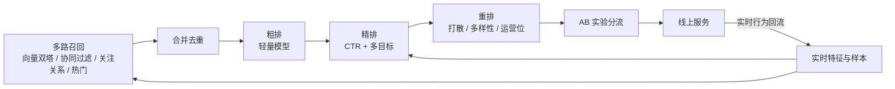
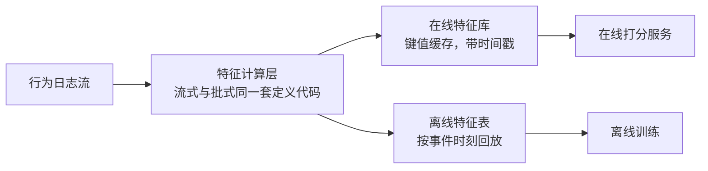

# 生产实战：推荐系统上线与迭代

> **一句话理解**：课本里的推荐系统是一个模型，生产里的推荐系统是一条"埋点→样本→多路召回→排序→AB 实验→监控"的流水线和一支持续运营的团队——模型只占两成工作量；而决定这条流水线生死的，是四件课本不写的事：冷启动体系、AB 实验的可信度、特征的一致性、指标打架时的仲裁。

[⬆️ 返回总目录](../../../README.md) · [⬆️ 返回本篇](../README.md) · [⬅️ 返回本章目录](./README.md)

| 属性 | 说明 |
|------|------|
| 难度 | ⭐⭐ |
| 所属分支 | 推荐 |
| 前置知识 | 本章全部正文 |

---

## 🏭 一个真实项目从 0 到 1

以一个**内容社区的信息流推荐**为例（图文/短视频混排，日活百万量级，经验参考），从零搭起推荐系统。

**时间与钱花在哪**（这个项目前三个月，经验参考）：

| 事项 | 工时占比 | 说明 |
|------|---------|------|
| 埋点与数据管道 | ~40% | 返工重做是常态 |
| 基线与 AB 平台 | ~25% | 没有它们一切无法验证 |
| 召回与排序迭代 | ~20% | 课本里的"正事"只占两成 |
| 监控与值班 | ~15% | 线上事故从不提前预约 |

谁参与：算法 2~3 人、工程 3~5 人、数据 1~2 人、产品 1 人（经验参考）——推荐系统是团队运动。

分阶段拆解：

- **需求定义**：和业务方对齐北极星指标——信息流场景通常是"人均使用时长 + 次日留存"，而不是点击率（点击率只是过程指标）。同时定好护栏指标：负反馈率（不感兴趣/举报）不许涨；
- **数据**：埋点是地基。曝光、点击、停留时长、点赞、划走——每个事件都要带用户/物品/位置/时间戳。样本构造的第一课：**曝光未点击 ≠ 不喜欢**——用户可能根本没刷到，也可能三天后才产生转化（电商尤其明显），这就是**延迟反馈（Delayed Feedback）**问题，标签要等窗口期或用纠偏模型；
- **设备与算力**：训练用几张主流 GPU（双塔与 CTR 模型都不大，百万级样本单卡也能跑，经验参考）；在线服务吃 CPU 和内存——物品向量索引和特征缓存全部驻留内存，检索服务延迟 P99 要压在几十毫秒；
- **算法选型**：分三步走，别上来就深度模型——
  1. **基线**：热门榜 + ItemCF（第 2 页的协同过滤）就能吃下个性化的大头流量，一周可上线，此后所有模型都跟它比；
  2. **召回**：双塔 + 多路并行——向量召回、协同过滤、关注关系、热门，各路设配额再合并去重（单路召回挂了系统不挂）；
  3. **排序**：LR 起步（吃统计交叉特征，可解释），再演进到自动交叉的深度 CTR 模型 + 多目标融合；
- **训练炼丹**：样本按天滚动拼接，训练流水线每日定时跑；特征要严格"按时间切分"，杜绝特征穿越（用未来信息 predicting 过去，离线虚高线上翻车）；
- **评估**：离线看 AUC / Recall@K，但一切以 AB 说话——见下面"AB 实验平台"；
- **部署**：召回索引（向量库）与模型服务分离部署，物品向量每日全量重算 + 增量更新；精排模型走定时刷新的在线推理服务，先金丝雀小流量再全量；
- **监控与迭代**：盯三张仪表盘——效率（点击率/时长）、体验（负反馈/多样性）、生态（内容覆盖度、新创作者存活率）。点击率突然漂移先查是不是埋点/版本问题，再查数据分布漂移，模型腐化通常排第三。重训节奏参考：样本日更、双塔向量日级全量 + 小时级增量、精排周级重训（经验参考）。

🧾 展开看：一条精排训练样本长什么样

时间 2026-09-24 21:03:14，用户 u123 的信息流第 3 位曝光了视频 v4567：

- **标签**：label = 1（u123 点击了 v4567）；
- **用户特征**：性别男、年龄段 18-24、近 7 天点击类目分布 {体育: 12, 数码: 4, 美食: 0}；
- **物品特征**：类目 = 体育、时长 = 42 秒、近 1 小时 CTR = 5.2%；
- **上下文特征**：晚高峰、iOS、信息流第 3 位（位置也要进特征，供位置偏差建模用）；
- **交叉统计特征**：u123 近 7 天在"体育"类目点击数 = 12、u123 对该作者的完播率 = 0.6。

数亿条这样的日志，就是精排模型的全部课本——所谓"推荐系统"，一半是在优雅地处理这些日志。

**埋点事件速查表**（数据阶段的地基，缺一样后面就少一样）：

| 事件 | 关键字段 | 支撑什么 |
|------|---------|---------|
| 曝光（impression） | 用户 / 物品 / 位置 / 请求 ID / 时间戳 | 样本分母、位置偏差分析 |
| 点击（click） | 同上 + 触发位置 | CTR 样本 |
| 停留 / 完播（dwell / play） | 时长、进度 | 时长目标 |
| 点赞 / 评论 / 分享 | 互动类型、内容 | 互动目标 |
| 划走 / 不感兴趣（skip） | 位置 | 负反馈信号 |

一行曝光日志若没记"位置"，后面所有位置偏差纠偏都无从谈起——**埋点是为半年后的自己埋的**。

### 冷启动策略体系：新物品与新用户的两套预案

冷启动不是"一个 trick"，是一套**分流 + 兜底 + 退出机制**的小系统（第 2 页讲了三类冷启动的定义，这里讲工程怎么做）：

| 对象 | 问题 | 预案体系 |
|------|------|---------|
| 新用户 | 零行为，双塔/MF 向量都学不出 | **注册信息**（年龄/地域/设备映射到人群均值向量）→ **热门兜底**（人人爱看的内容犯错成本最低）→ **快速反馈**（头 20 次点击内每 3~5 次刷新就重算偏好，尽快切个性化，经验参考） |
| 新内容 | 零交互，进不了协同过滤与向量索引 | **内容特征先给向量**（标题/封面/类目过编码器，双塔的物品塔天然支持）→ **流量探索扶持池**（保底曝光量 + ε-greedy/汤普森采样式探索配比，见第 1 页 EE）→ **退出机制**（攒够 N 次曝光或 CTR 达标即毕业进正式分发；长期不达标则降权） |

三条工程实感（经验参考）：

1. **扶持池的量是预算不是福利**：每个新物品保底 500~2000 次曝光，是拿全站的短期效率换生态的新陈代谢——量要精算（少了不够统计显著，多了拖累大盘）；
2. **新用户前几次刷新决定留存**：快速反馈链路（分钟级行为回流）对次日留存的贡献，常常大于精排模型本身的迭代——这是"特征实时性 > 模型复杂度"的经典案例；
3. **冷启动的止损位**：新物品扶持周期（如 48 小时，经验参考）内 CTR 显著低于大盘的，果断降权——探索也要止损，否则扶持池变成垃圾内容的避难所。

📋 展开一个真实的迭代故事

上线三个月后的一次迭代：新版精排把点击率拉高了 4%（AB 显著），但人均时长跌了 2%，负反馈涨了。排查发现：模型学会了奖励"高点击、快划走"的标题党内容——点击信号强、时长信号弱，多目标融合里时长的指数太小。修复分三步：把时长目标从二分类改成分位数加权、负反馈进损失、标题党识别特征上线。两周后：点击率保住 3% 涨幅，时长回到持平，负反馈回落。

教训：**单一指标的胜利经常是陷阱，AB 看一篮子指标才作数**。

### AB 实验平台：一切以 AB 说话

推荐系统的"更准"只能靠在线实验证明：按用户 ID 哈希分流（典型 5% 实验 / 5% 对照 / 90% 基线，经验参考），跑够统计显著所需的最小样本量再下结论。三件事定生死：

- **分流正交**：同时多个实验互不污染（分层实验框架）；
- **护栏指标**：任何实验不许恶化负反馈率、崩溃率、留存——护栏破了，点击涨再多也回滚；
- **别偷看**：中途看到显著就收工是自欺欺人，显著性要按预先设定的周期检验。

**网络效应污染：分流失效的隐蔽陷阱。** 按"用户"分流的前提是**用户之间互不影响**（SUTVA 假设，Stable Unit Treatment Value Assumption）。推荐业务里这个前提经常破产：

| 场景 | 污染机理 | 症状 |
|------|---------|------|
| 社交推荐 | 实验组的分享内容会流到对照组的信息流里 | 实验组的效果"漏"给对照组，差异被低估 |
| 内容池共享 | 实验组模型猛推某内容，改变了它在全站的统计特征（CTR/热度），对照组的模型也读这个特征 | 对照组间接被实验改了 |
| 创作者行为 | 实验组的高分成创作者发了更多内容，全站供给变化 | 两组都变，实验效应混入供给效应 |
| 市场类（打车/电商大促） | 实验组多抢单/多补贴，直接抬高了对照组的成交环境 | 经典的供需网络效应 |

> 👉 **人话**：AB 像给两块地施不同的肥——如果地里的蜜蜂会跨着采蜜、花粉互相串，"哪块肥好"就量不准了。推荐系统的"花粉"就是内容、特征统计和创作者行为，它们天然跨组流动。

**诊断与补救**（工业常见做法，经验参考）：看对照组指标是否随实验组同步漂移（同步漂移=疑似污染）；把分流单元升级（按地区/城市/社交簇分簇，簇内互相影响、簇间近似独立）；必要时做"关停实验"（对照组临时切回基线，看两组差距是否突然拉大）。拿不准时，宁可承认"这个实验测不了"，也不要交出一个被污染还带显著性星号的结果。

实验报表的三层指标（缺一层都会误判）：

| 层 | 指标举例 | 作用 |
|----|---------|------|
| 北极星 | 人均时长 / 留存 / GMV | 证明"真的更好" |
| 过程 | CTR、消费深度、召回多样性 | 解释"为什么更好 / 更差" |
| 护栏 | 负反馈率、崩溃率、服务延迟 | 一票否决线 |

### 特征平台：离线/在线一致性的架构直觉

特征是推荐系统里最值钱也最容易悄悄坏掉的资产。同一个特征（比如"物品近 1 小时 CTR"），**离线训练时一个值、在线服务时另一个值**，模型就在两个世界各说各话——这是"离线 AUC 虚高"的第一大来源（第二是特征穿越，第 3 页详述）。

架构直觉一句话：**让训练和服务从同一口锅里舀汤**。

三个一致性抓手（工业通行，经验参考）：

1. **一份定义两处运行**：特征逻辑只写一次（同一份代码/配置），流式引擎跑在线版、批处理引擎跑离线版——严禁"离线用 SQL 手写一遍、在线用 Java 再写一遍"，两处实现的口径漂移是无声的慢性毒药；
2. **在线写日志、离线读日志**：在线打分时用到的特征值**原样落盘**（feature log），离线拼样本时不用"重算"而是"回放"当时的确切值——重算永远算不回"当时那一刻"的缓存状态；
3. **时间戳对齐**：每个特征值带生成时间，样本拼接按请求时刻取值（point-in-time join），从根上杜绝特征穿越。

> 👉 **人话**：不落盘"当时用了什么"，事后无论怎么重算都对不上账。在线把"喂给模型的每口饭"都记账，离线才拼得出和线上同一个味道的样本。

### 指标打架的仲裁：长期价值与短期护栏怎么共存

AB 报表里最常见的场面：CTR +3%、时长 −1%、留存持平、负反馈 +0.2 个点——**上还是不上？**没有唯一答案，但有成熟的仲裁机制：

1. **先看护栏**：负反馈/崩溃/留存任一越线，直接回滚——护栏是"一票否决"，不进入权衡环节；
2. **北极星优先于过程指标**：过程指标（CTR、深度）只解释"为什么"，不决定"要不要"——决策权在时长/留存/GMV 这一层；
3. **短长期折算**：短期掉、长期涨的实验（如降低标题党权重，首周 CTR 跌、一个月留存升）要有**长期 holdout**——留 1% 用户长期不切新策略，专门量长期效应（工业标配，经验参考）；
4. **价值函数显式化**：把指标折算成一个分数（如 时长 × 留存系数 − 负反馈 × 惩罚系数），权重由业务方签字背书——把"吵架"变成"调参数"，且每次仲裁留下记录，口径可追溯；
5. **仲裁也是实验**：价值函数的权重改动本身要过 AB，防止"拍脑袋的价值观"伪装成科学决策。

> 👉 **人话**：指标打架不是技术问题，是价值观问题——机制的作用是把价值观**显式地写下来、可追溯地执行**，而不是每次都靠嗓门大的人现场辩论。

## 🧭 场景选型表

| 场景 | 推荐 | 理由 | 不推荐 |
|------|------|------|--------|
| 小规模（万级物品、日活几万） | ItemCF + 热门榜 + LR 排序 | 交互数据撑不起深度模型，简单方案一周上线、可解释 | 一上来就双塔 + 深度精排 |
| 中等规模（百万物品、日活几十万~百万） | 双塔召回 + GBDT/DeepFM 排序 | 数据量刚够喂深度模型，收益明显 | 手工 ItemCF（更新慢、长尾差） |
| 大规模（亿级物品、日活千万+） | 全套漏斗 + 实时特征 + 多目标 | 延迟和规模逼出分层架构与实时链路 | 单一模型一把梭 |
| 强实时场景（新闻 / 热点 / 直播） | 实时召回 + 实时特征链路 | 热点等不了天级更新，分钟级回流的收益巨大 | 纯 T+1 批处理 |

## 🧰 真实工具链

| 环节 | 常用工具 | 一句话点评 |
|------|----------|-----------|
| 向量检索 | FAISS / HNSW 类引擎 | 开源标配，亿级索引要配分片与内存规划 |
| 特征与缓存 | Redis | 在线特征读取的命门，超时就是事故 |
| 实时特征/样本 | Flink | 行为流式回流，实时样本拼接 |
| 离线样本拼接 | Spark | 亿级日志按天拼样本，T+1 主力 |
| 实验跟踪 | MLflow / W&B | 离线实验记录，比 Excel 体面 |
| AB 平台 | 多为自建 | 分流、显著性检验、护栏指标——每家大厂都有一套自己的 |
| 模型训练 | PyTorch + 各家内部平台 | 离线训练标准化程度高 |

## 💣 踩坑实录

- **坑 1 · 位置偏差**：第 1 位曝光的点击率高，不代表内容好——用户就是顺手点第一个。不纠偏，模型学的是"位置"不是"偏好"。对策：训练样本按位置加权/去偏，或用随机流量小桶纠偏；
- **坑 2 · 延迟反馈**：下单、转化常发生在曝光几小时甚至几天后，急着拼样本会把"慢热正样本"错标成负样本。对策：设标签窗口期或延迟反馈纠偏建模；
- **坑 3 · 指标打架**：点击 ↑ 时长 ↓ 是最经典的组合——点击和时长奖励的是不同内容。对策：上文的仲裁机制（护栏一票否决 + 价值函数显式化），承认这是业务价值观问题而不是纯技术问题；
- **坑 4 · 探索与利用失衡**：全利用（只推模型最有把握的）→ 信息茧房、新内容饿死；全探索 → 短期指标崩。对策：小比例探索流量 + 新内容扶持池，用 ε-greedy 或汤普森采样思路控制配比；
- **坑 5 · 特征穿越与不一致**：离线拼样本时混进了"事发之后才有的数据"（如用当天的物品累计点击数预测当天的点击），或在线离线两套特征实现对不上口径——离线 AUC 虚高，上线现原形。对策：特征带生成时间戳按时刻对齐 + 在线特征落盘回放（见上文特征平台）；
- **坑 6 · AB 分流被网络效应污染**：实验组的效果通过分享内容、共享统计特征、创作者供给变化"漏"给对照组，差异被系统性低估。对策：监控对照组同步漂移，必要时升级分流单元（按城市/社交簇）。

## 🗣️ 炼丹师大实话

> "推荐系统是持续运营的活，不是训完就完的模型——上线那天工作才刚开始：今天的热门明天过气，用户口味漂移、内容池每天上新，模型三个月不重训就开始腐化。真正的护城河不是某个模型，而是埋点、样本、AB、监控这条数据闭环转得多快。而这条闭环最容易烂的接头是'特征一致性'和'AB 可信度'——它们坏了，你连'模型变好了没有'都无从知道。"

---

[⬅️ 上一页：进阶专题：大规模推荐系统](./05-进阶专题-大规模推荐系统.md) · [返回本章目录](./README.md) · [下一页：第 9 章：图神经网络 ➡️](../09-图神经网络/README.md)
