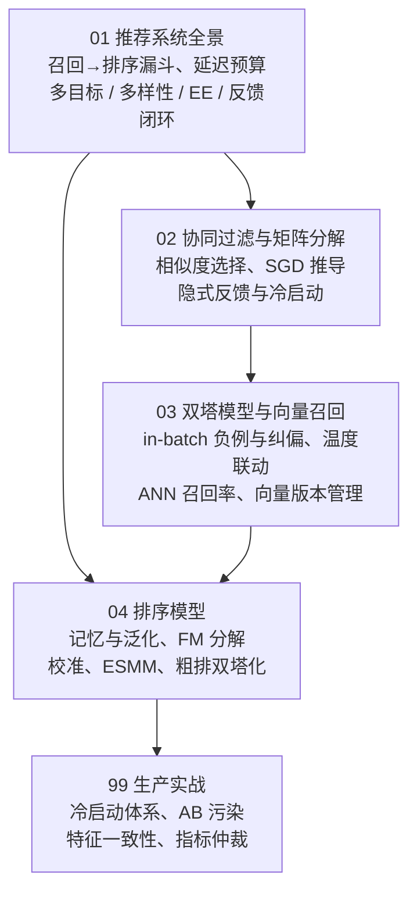
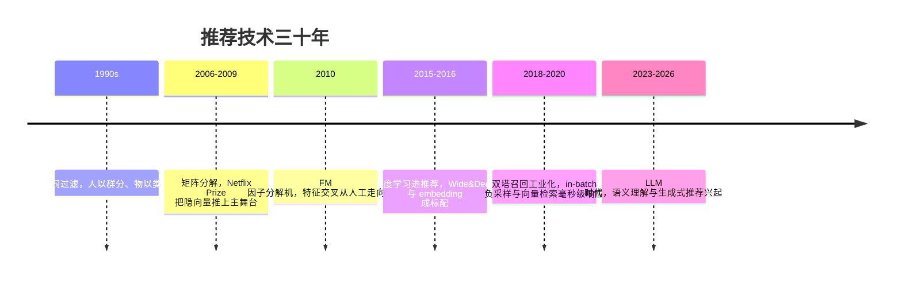

# 第 8 章：推荐系统 🛍️（匹配）

> 打开购物 App，首页堆着"猜你喜欢"；刷短视频，下一条永远"正合胃口"；看完一件商品，页面下方立刻排开"看了又看"——这些都是推荐系统（Recommender System）在干活。它要回答的问题只有一个：**在百万件物品里，此刻最该给这个用户看什么？** 本章沿工业界真实链路展开：先看清"召回→排序"的漏斗全景——不只看每层的速度与精度分工，还要看清分数之外的三件大事（多目标融合、多样性重排、探索与利用）；再从最古老的协同过滤讲到矩阵分解——那里埋着全书的一条暗线：**把用户和物品都变成向量**；接着是工业召回的灵魂"双塔模型"——深入到负采样偏差、温度与难负例的联动、ANN 召回率评估与向量版本管理；最后落到精排打分（特征交叉、校准与多目标）与真实上线。

[⬆️ 返回总目录](../../../README.md) · [⬆️ 返回本篇](../README.md)

## 🗺️ 本章知识树

## 📜 推荐技术演进

## 🧵 一条暗线：向量主线

本章是"万物皆可向量"这一思想**最大的工业落地面**：矩阵分解把用户和物品压成隐向量 → 双塔用深度网络生成更好的向量 → 向量检索从百万物品里毫秒捞出相似——与 [词向量](../07-自然语言处理与LLM/01-词向量与embedding.md) 是同一个思想在不同领域的落地。学完本章再回头看 [RAG 检索](../07-自然语言处理与LLM/06-RAG与Agent.md)与[多模态对齐](../../5-前沿与融合/12-生成模型与多模态/04-多模态模型.md)，你会发现它们与推荐召回是同一件事：各自编码成向量，再算相似。

另一条贯穿暗线是**偏差治理**：热门物品被负采样冤枉（logQ 纠偏）、未点击被误读为不喜欢（BPR 排序损失）、位置好的被当成内容好（位置去偏）、训练空间和预测空间不一致（ESMM）、反馈闭环滚成马太效应（扶持池与探索流量）——推荐系统的一半功力，花在"别让数据里的偏差骗过模型"。

## 📖 推荐阅读顺序

| 顺序 | 页面 | 难度 | 一句话说明 |
|------|------|------|-----------|
| 1 | [推荐系统全景](./01-推荐系统全景.md) | ⭐⭐ | 召回→排序漏斗、每层延迟预算；多目标融合与 Pareto 前沿、MMR 多样性重排、EE 探索、反馈闭环与马太效应 |
| 2 | [协同过滤与矩阵分解](./02-协同过滤与矩阵分解.md) | ⭐⭐⭐ | 人以群分到隐向量：相似度三选一（余弦/皮尔逊/杰卡德）、SGD 训练推导、维度 k 的欠拟合过拟合、隐式反馈与 BPR、冷启动三类 |
| 3 | [双塔模型与向量召回](./03-双塔模型与向量召回.md) | ⭐⭐⭐⭐ | 工业召回的灵魂：in-batch 负例与流行度纠偏、温度与难负例联动、ANN 召回率评估、流式更新与版本管理、兴趣漂移/特征穿越失败模式 |
| 4 | [排序模型](./04-排序模型.md) | ⭐⭐⭐ | 精排：记忆与泛化的数学直觉、FM 特征交叉分解推导、pCTR 校准（广告计费）、ESMM 样本偏差、粗排双塔化 |
| 5 | [进阶专题：大规模推荐系统](./05-进阶专题-大规模推荐系统.md) | ⭐⭐⭐⭐ | 系统视角收束：样本工程护城河（DFM→ESMM→DEFER）、多任务（MMoE/PLE 跷跷板）、序列（DIN→SIM→生成式）、实时特征流与在线学习、校准计费联动、冷启动 uplift |
| 收官 | [生产实战](./99-生产实战.md) | ⭐⭐ | 信息流推荐从 0 到 1：冷启动策略体系、AB 网络效应污染、特征平台一致性、指标打架仲裁机制 |

## 🎯 读完本章你应该能

- 画出"召回→粗排→精排→重排"漏斗，说清每层**速度与精度的分工**，并把 300 ms 延迟预算拆到每个环节；
- 手算一遍协同过滤相似度与矩阵分解的小例子，说清余弦/皮尔逊/杰卡德各适合什么数据；
- 讲清双塔为什么是工业界标配：**物品向量离线预计算 + 在线 ANN 检索**；并说出 in-batch 负例的流行度偏差怎么纠、温度为什么要和难负例联调；
- 区分召回指标 Recall@K 与排序指标 AUC 各自管哪一段，知道广告场景为什么还要看校准；
- 说出只优化点击率为什么会造成信息茧房，以及多目标融合、多样性重排、探索流量、生态护栏各自兜哪一段；
- 列举双塔/精排的典型失败模式（兴趣漂移、特征穿越、样本选择偏差）的症状与诊断方法。

## 🔗 与其他章节的关系

- **前置章节**：[第 4 章：深度学习基础](../../3-深度学习/04-深度学习基础/README.md)——双塔与排序模型都是神经网络，训练流程的底子在那里打。
- **上游章节**：[词向量与 embedding](../07-自然语言处理与LLM/01-词向量与embedding.md)——本章把"给词学向量"推广成"给用户和物品学向量"。
- **后续章节**：[第 9 章：图神经网络](../09-图神经网络/README.md)——把"用户-物品"交互放进更大的关系图，图召回是双塔的重要补充。
- **横向呼应**：[RAG 与 Agent](../07-自然语言处理与LLM/06-RAG与Agent.md)、[多模态模型](../../5-前沿与融合/12-生成模型与多模态/04-多模态模型.md)——与双塔召回同构的"万物双塔"；[第 10 章：强化学习](../10-强化学习/README.md)——EE 探索与利用的弹药库。

---

[⬅️ 上一章：第 7 章：自然语言处理与大语言模型](../07-自然语言处理与LLM/README.md) · [返回总目录](../../../README.md) · [下一章：第 9 章：图神经网络 ➡️](../09-图神经网络/README.md)
