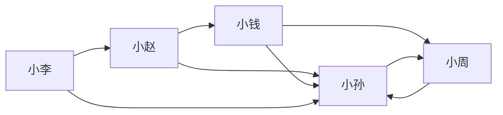
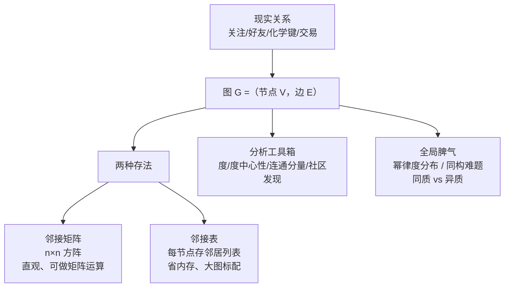

# 图数据入门

> **一句话理解**：图（Graph）= 节点（点）+ 边（关系）——它是描述"谁和谁有关系"的数学语言，社交网络、分子、路网、用户-物品交互，全都可以装进"点 + 线"这同一个模子；而真实世界的图往往"长尾、断裂、藏结构"——幂律的度分布、孤立的连通分量、连算法都分不清的双胞胎图，这些性质直接决定后面 GNN 怎么设计、什么时候灵。

[⬆️ 返回总目录](../../../README.md) · [⬆️ 返回本篇](../README.md) · [⬅️ 返回本章目录](./README.md)

| 属性 | 说明 |
|------|------|
| 难度 | ⭐⭐（进阶） |
| 所属分支 | 图 |
| 前置知识 | 无 |

---

## 📌 这一节解决什么问题

机器学习最熟悉的数据是表格：每行一个样本、每列一个特征。但很多重要信息天生不是表格，而是**关系**：

- 判断一个新注册账号是不是欺诈小号——单看它的注册时间、头像、昵称都正常；一看关系：它和 37 个已被封的账号登录过同一台设备——危险信号全在"连接"上；
- 判断一个分子有没有药性——原子（点）本身都认识，关键是原子怎么连接（化学键）；
- 猜你可能认识谁——你的好友列表（点）和他的好友列表怎么重叠（边）。

表格擅长描述"每个个体长什么样"，图擅长描述"个体之间怎么连"。本节先把图的语言学会：节点、边、度、邻接矩阵——它们是下一页图神经网络的地基。

除此之外，这一页还要提前认识真实图的四个"脾气"，因为它们决定了 GNN 的设计约束和失效边界：**度分布是长尾的**（极少数节点坐拥百万连接）；**图经常是断的**（连通分量外的孤立子图会被算法悄悄忽略）；**判断两张图是否一样"本质很难"**（图同构难题，GNN 表达能力的理论天花板就挂在这）；**"邻居相似"这条假设会破产**（欺诈网络里，恰恰是不相似的节点连在一起）。

## 🌱 通俗理解

把图想象成一场聚会：

- 每位客人是一个**节点（Node / 顶点）**；
- 谁跟谁说过话、谁关注谁，是一条**边（Edge）**——微博的关注有方向（我关注你，你不一定关注我），叫**有向图（Directed Graph）**；微信好友没方向（加了就是互相的），叫**无向图（Undirected Graph）**；
- 一个人聊过多少客人，就是他的**度（Degree）**——有向图再分**出度**（他主动关注了几人）和**入度**（几人关注他）。

聚会进行一小时后你想知道谁是核心人物：不用挨个采访，站在高处看一圈——被围在中间、和最多人连线的那位就是。**看结构，不看个体**——这正是图数据的精髓。

真实世界还有四个"聚会真相"值得记住：**大多数客人是壁花，极少数人是社牛**（幂律：连接数的分布是长尾的，社牛一个人聊过全场）；**聚会会散成几个互不搭理的小圈子**（连通分量：圈子之间没有任何搭话的桥梁）；**两场人数相同、热闹程度相同的聚会，可能是完全不同的两场**（图同构：换掉名字之后还能不能认出是同一张关系网，这事居然很难）；**物以类聚不一定成立**——有些圈子恰恰是"猎人和猎物"凑成的（异质性：邻居之间可能刻意保持不同）。

## 📋 举个例子

一个 5 人关注网络（箭头 = "关注"，有向图）：



把它写成**邻接矩阵（Adjacency Matrix）**——行 = 关注者，列 = 被关注者，第 $i$ 行第 $j$ 列为 1 表示"行的人关注了列的人"：

| 关注 ↓ / 被关注 → | 小赵 | 小钱 | 小孙 | 小李 | 小周 |
|------|------|------|------|------|------|
| 小赵 | 0 | 1 | 1 | 0 | 0 |
| 小钱 | 0 | 0 | 1 | 0 | 1 |
| 小孙 | 0 | 0 | 0 | 0 | 1 |
| 小李 | 1 | 0 | 1 | 0 | 0 |
| 小周 | 0 | 1 | 1 | 0 | 0 |

逐行数 1 的个数得**出度**，逐列数得**入度**：

| 人 | 出度（关注了谁） | 入度（被谁关注） | 总度 | 解读 |
|------|------|------|------|------|
| 小孙 | 1（小周） | **4**（赵/钱/李/周） | **5** | 除了自己人人关注——**中心人物** |
| 小赵 | 2（钱、孙） | 1（李） | 3 | 活跃的普通用户 |
| 小钱 | 2（孙、周） | 1（赵） | 3 | 普通用户 |
| 小周 | 1（孙） | 2（钱、孙） | 3 | 普通用户 |
| 小李 | 2（孙、赵） | **0** | 2 | 只关注别人、没人关注他 |

**谁最像中心人物？小孙。** 总度 5 最高，入度 4 断层领先——"被多少人关注"（影响力）和"关注多少人"（活跃度）在图里是两个独立的信号，这正是表格数据表达不出来的结构信息。

**再看一个"极端与失败"的变体**：假如小王也注册了账号但还没关注任何人（孤点，度 = 0），或者两个互相关注的情侣账号和主网络没有任何交集（孤立子图）——这两类节点放进整套分析会怎样？度中心性给小王打 0 分（合理但没信息），而情侣子图内部两人互为"全网最中心"（在子图里算中心性会高估自己）——这正是后面"连通分量"要单独处理的原因。

<details>
<summary>📊 展开完整算例：用度中心性给"中心人物"排序</summary>

度中心性（Degree Centrality）把度归一化到 0~1 附近，方便不同大小的图互相比较：

$$
C_D(v) = \frac{d(v)}{n-1}
$$

> 👉 **人话**：n 个人的圈子里理论上最多连 n−1 个人，你实际连了几个，占比多少——占比越高越"中心"。

按总度计算（n = 5，除以 4）：

| 排名 | 人 | 总度 | 度中心性 $C_D$ |
|------|------|------|------|
| 1 | 小孙 | 5 | 1.25 |
| 2 | 小赵 / 小钱 / 小周 | 3 | 0.75 |
| 5 | 小李 | 2 | 0.50 |

两个细节：

1. 有向图的总度可以超过 n−1（因为出入度可以叠加），所以 1.25 > 1 不奇怪；若只看影响力，可用入度中心性：小孙 4/4 = 1.0，断层第一；
2. 度中心性只看"连了多少"，不看"连的人重不重要"——如果关注了小孙的人本身很热门，小孙实际影响力更大。这种"重要节点带飞"的思路，就是搜索时代大名鼎鼎的 PageRank，与度中心性同属一族。

</details>

## 🧠 核心原理

### 整体流程：从关系到矩阵



### 逐步拆解

**① 邻接矩阵几乎全是 0（稀疏性）。** 上面 5 人矩阵 25 个格子只有 8 个 1。放到真实社交网络：1 万用户的矩阵有 $10^8$ 个格子，每人平均关注 100 人，非零格子只占约 1%；网络越大，矩阵越空——**万人社交矩阵几乎全 0**。所以大图的存储都用邻接表（每个节点只存自己的邻居清单），稠密矩阵只用于教学和矩阵推导。

**② 图数据的三个特点**（也是 CNN/RNN 为难的地方）：

1. **无固定顺序**：把 5 个节点重新编号、邻接矩阵行列同步换序，图还是同一个图——神经网络却会把"换编号"当成新输入；
2. **邻域可变长**：小孙有 4 个邻居、小李 0 个——不像句子长度不一尚可补齐，节点邻居数量差异是结构本身；
3. **结构本身携带信息**：朋友的数量、朋友的朋友是否互识，都在暗示节点性质（朋友多的人大概率活跃、团伙成员之间连边密集）。

**③ 度分布与幂律：真实图的"贫富悬殊"。** 把"每个节点有几个度"画成直方图，表格数据的直觉是钟形（正态：大多数人处在平均值附近）；真实社交图的度分布却是**幂律（Power Law）**——绝大多数节点度极小（壁花），极少数节点度极大（社牛/大 V），分布拖出一条长长的尾巴：

$$
P(\text{度} = d) \propto d^{-\gamma}, \quad \gamma \approx 2 \sim 3
$$

> 👉 **人话**：十万粉丝的大 V 万里挑一，十个好友的普通人一抓一把——"连接数"的分布不是人人差不多的钟形，而是"多数人很少、少数人极多"的秃头长尾。

**机理一句话：富者愈富（Preferential Attachment，优先连接）**——新节点加入网络时，更倾向于连接已经很有名的节点（新人关注博主，当然挑粉丝多的关注），于是"已有连接越多，获得新连接越快"，雪球滚成幂律。这不是谁的阴谋，是"按热度连边"这个简单规则的必然统计后果。

幂律对算法的三个直接后果：

| 后果 | 原因 | 应对 |
|------|------|------|
| "平均度"失去代表性 | 均值被头部严重拉高，绝大多数节点远低于均值 | 描述图用中位数/分位数，别用平均 |
| 邻居采样必须防热点 | 采样路径一旦撞上大 V，邻居列表百万条直接爆炸 | 邻居数封顶、按度加权采样（下一页 GraphSAGE） |
| 均值聚合被头部淹没 | 平均所有邻居 = 大 V 的特征重复出现亿万次 | 度归一化（GCN 的 $\tilde{D}^{-1/2}$ 正是干这个） |

**④ 连通分量（Connected Component）：图经常是断的。** 连通分量 = 子图内任意两点有路径相连、且与子图外没有任何边。真实大图几乎从不是一整块：千万用户的社交图里，除了占 90%+ 的主分量，往往还漂着大量两三人互关的小孤岛、以及完全没边的孤点。

**为什么孤立子图要单独处理**：

1. **跨分量的节点之间没有信息通路**——消息传递（下一页）在分量边界处"断流"，主分量的模式对小分量毫无帮助，混在一起训练等于用主分量的规律去套小分量的数据；
2. **子图内的"中心性"会自我高估**——上文情侣子图的例子：两人在自己分量里是彼此的全部世界；
3. **工业管道的具体处理**：先跑连通分量算法把图切块；主分量正常训练；小分量（低于阈值）通常**单独打标走规则**或直接跳过；孤点（度 = 0）靠节点自身特征兜底——它们的数量往往不少（新注册用户全是孤点），跳过等于放弃一整块业务。

**⑤ 图同构难题：为什么"判断两张图是否一样"本质很难。** 把一张图的节点重新编号（换名字），如果通过换名能把图 A 变成图 B，就称 A 和 B **同构（Isomorphism）**——直觉上"就是同一张图"。但判断任意两张图是否同构，目前**没有已知的多项式时间算法**，也未被证明一定无解（NP 中既未证难也未证易的"悬案"）。

为什么这么难？因为**编号方案有 n! 种**，暴力逐一比对的代价随节点数阶乘级爆炸（20 个节点就有 $2.4 \times 10^{18}$ 种编号方案）。而图又不给你任何"锚点"——没有第一个节点、没有固定顺序，所有节点生而平等。

**Weisfeiler-Lehman 测试（WL 测试）**是同构问题的"低保"判定法，直觉出奇地简单——**反复"报数对暗号"**：

1. 初始：所有节点拿到同一个标签（比如都是 1）；
2. 每轮：每个节点收集邻居的标签集合，把自己当前的标签和这个集合拼在一起，作为新标签（哈希去重：相同拼法拿到相同新标签）；
3. 重复 n 轮，比较两张图的"标签直方图"——分布不同则**一定不同构**；分布相同则**大概率同构**（存在极少数反例骗过测试，如正则图）。

> 👉 **人话**：让每个节点反复"匿名报数"——第一轮报"我有几个邻居"，第二轮报"我邻居们都报了什么"。几轮之后，结构位置相同的节点会拿到相同的暗号、结构不同的节点暗号分岔。两张图的暗号分布对不上，就一定不是同一张图。**WL 测试就是"以邻域结构为指纹"的识别程序。**

<details>
<summary>📊 展开完整算例：在 5 人关注图上跑两轮 WL"报数"</summary>

拿本节开头的 5 人小图（转成无向便于演示），每轮"自己当前标签 + 邻居标签集合"拼在一起换新标签（用哈希值示意）：

| 节点 | 邻居（无向） | 第 0 轮 | 第 1 轮拼法 | 第 1 轮新标签 | 第 2 轮拼法 | 第 2 轮新标签 |
|------|------|------|------|------|------|------|
| 小赵 | 钱、孙、李 | 1 | 1 + {1,1,1} | A | A + {A,B,C} | X |
| 小钱 | 赵、孙、周 | 1 | 1 + {1,1,1} | A | A + {X,B,D} | Y |
| 小孙 | 赵、钱、周、李 | 1 | 1 + {1,1,1,1} | B | B + {X,Y,D,C} | Z |
| 小李 | 赵、孙 | 1 | 1 + {1,1} | C | C + {X,Z} | W |
| 小周 | 钱、孙 | 1 | 1 + {1,1} | C | C + {Y,Z} | W |

三个观察：

1. **第 1 轮就把度数分了出来**：小孙（4 个邻居）拿到 B，赵/钱（3 个邻居）同为 A，李/周（2 个邻居）同为 C——"报数"本质是从度开始的逐轮细化；
2. **第 2 轮开始区分"邻居是谁"**：小赵和小钱第 1 轮同为 A，但小赵的邻居是 {A,B,C}、小钱的邻居是 {A,B,D}（小孙第 1 轮是 B，周是 D 不同于李的 C）……细小的结构差异在第二轮暴露，标签 X/Y 分岔；
3. **小李和小周始终保持同标签**：他们在这张图里的"结构角色"确实对称（都连着"一个 3 度点 + 孙"的等价邻域）——WL 分不开他们不是失误，是他们在这层结构指纹下**真的没有区别**。想再区分，得靠节点自身特征（GNN 的输入特征恰好补这个位）或更强的测试。

这个算例同时演示了 GNN 的宿命：消息传递式 GNN 的每层恰好对应 WL 的一轮——**WL 都分不开的节点（小李 vs 小周），GNN 学出的向量也几乎相同**。

</details>

这为什么是 GNN 的理论锚点（Xu 等人 2019 的经典结论）：**消息传递式 GNN 的表达能力上界就是 WL 测试**——GNN 每层"聚合邻居、更新自己"与 WL 每轮"收集邻居标签、换新标签"一一对应；WL 分不开的节点，消息传递 GNN 也分不开（会把它们编码成几乎相同的向量）。所以当你的任务需要区分 WL 都分不出的双胞胎结构时，再深的 GNN 也无能为力——这不是调参能救的，是架构的天花板。

**⑥ 同质性与异质性："邻居相似"什么时候破产。** 同质性（Homophily）：相连的节点倾向于相似（物以类聚——同好互关、论文引用同类论文）。GNN 的一切设计都押注在这条假设上：**聚合邻居之所以有用，前提是邻居的特征对自己有参考价值**。

但有一大类图是**异质的（Heterophily）**——相连的节点刻意不相似：

| 图 | 相连的节点 | 为什么不相似 |
|----|-----------|-------------|
| 欺诈网络 | 欺诈者 ↔ 受害者 / 欺诈者 ↔ 正常共享设备 | 骗子的连接对象就是目标猎物和被寄生者 |
| 二部图 | 用户 ↔ 物品、学生 ↔ 课程 | 两侧本来就是不同类型的实体 |
| 网 | 路由器 ↔ 路由器、蛋白抑制关系 | 连接表达"交互/对抗"而非"相似" |
| 食物链 | 捕食者 ↔ 猎物 | 连接表达"吃与被吃" |

**失效机理**：在异质图上做"平均邻居"式聚合，等于**把自己的向量往"和我不一样的人"堆里推**——欺诈者的表示被受害者的特征稀释，反而更像好人。症状：GNN 在欺诈检测上的表现不如纯特征模型（不用图反而更准），或加入图特征后效果负增长。

**诊断与补救**：先量同质率（相连节点对中标签相同的比例——社交引用图常见 0.7+，欺诈图可能 < 0.3，经验参考）；同质率低的图上，改用对异质友好的聚合（如 H2GCN 类"区分自身与邻居、少做平滑"的设计），或干脆回到"图当特征来源、不当聚合对象"（邻居统计量 + GBDT，见[生产实战](./99-生产实战.md)）。

**⑦ 图上的三大任务**（一句话版）：

| 任务 | 一句话 | 例子 |
|------|------|------|
| 节点分类（Node Classification） | 判断**某个点**是什么 | 判断用户兴趣标签、账号是否欺诈 |
| 链接预测（Link Prediction） | 猜**两点之间**会不会有边 | "猜你可能认识谁"——正是推荐的近亲（[第 8 章](../08-推荐系统/README.md)） |
| 图分类（Graph Classification） | 判断**整张图**是什么 | 判断一个分子有无药性、一段代码图有无漏洞 |

### 📐 数学深潜：握手定理——Σdeg = 2|E| 的双计数证明

**严格陈述。** 对任意无向图 $G=(V,E)$（无自环、无重边），全体节点的度数之和恒等于边数的两倍：

$$
\sum_{v \in V} \deg(v) = 2\,|E|
$$

> 👉 **人话**：一条边是一次握手，必然占用两只手——"所有人用掉的手"当然等于"握手次数 × 2"。这是图论的第一条守恒律，也是一切图数据管道的第一道对账校验。

<details>
<summary>🧮 完整推导：双计数——同一个集合数两遍</summary>

**第 0 步：搭台子。** 定义"点边对"集合 $P=\{(v,e)\mid v\in V,\ e\in E,\ v\ \text{是}\ e\ \text{的端点}\}$。策略：把 $|P|$ 用两种方式算出来，两个答案必须相等。

**第 1 步：按节点数。** 固定节点 $v$：与 $v$ 关联的边恰有 $\deg(v)$ 条（度的定义），所以 $v$ 贡献 $\deg(v)$ 个点边对：

$$
|P| = \sum_{v \in V} \deg(v)
$$

> 👉 **人话**：站在每个人身边数"他握过几只手"，再全场合计。

**第 2 步：按边数。** 固定边 $e=\{u,w\}$：它恰有 2 个端点（无自环保证 $u \neq w$，无重边保证不会把同一条边数两遍），所以每条边恰贡献 2 个点边对：

$$
|P| = \sum_{e \in E} 2 = 2|E|
$$

> 👉 **人话**：站在每条边旁边——一条边，两只手，贡献恒为 2。

**第 3 步：合拢。** 两步数的是同一个 $|P|$，故 $\sum_v \deg(v) = 2|E|$。证毕。

**推论一：奇度节点必有偶数个。** 右边 $2|E|$ 是偶数，左边也必须是偶数。设奇度节点有 $k$ 个：偶度节点贡献偶数、奇度节点贡献奇数，故 $\sum\deg \equiv k \pmod 2$；偶数 $\equiv k$ 迫使 $k$ 为偶数。

> 👉 **人话**：聚会里"握过奇数次手的人"永远是偶数个——奇数配不平，这条推论正是定理俗名"握手定理"的出处。

**推论二：平均度换算。** $\bar d = \frac{1}{|V|}\sum\deg = \frac{2|E|}{|V|}$。顺手验算上文动手代码：BA 图 $n=2000, m=2$ 时 $|E| = m(n-m) \approx 4000$，平均度 $\approx 2|E|/n \approx 4 = 2m$——"优先连接每次带来 $m$ 条新边"在守恒律下的必然读数。

**有向图版本。** 每条有向边恰有 1 个尾（贡献 1 出度）和 1 个头（贡献 1 入度），同样的双计数得 $\sum_v\deg^+(v)=\sum_v\deg^-(v)=|E|$——出度账与入度账分别守恒。

**用本节 5 人图验算。** 无向化去重后 7 条边（赵-钱、赵-孙、钱-孙、钱-周、孙-周、孙-李、李-赵）：度数 赵 3、钱 3、孙 4、李 2、周 2，合计 14 = 2×7 ✓；有向版本：出度和 2+2+1+2+1 = 8，入度和 1+1+4+0+2 = 8，都恰等于有向边数 8 ✓。

</details>

**几何解释：每条边贡献两个度。** 把贡献逐条显式列出（无向化 5 人图）：

```text
边          贡献
(赵,钱) →  赵 +1 │ 钱 +1
(赵,孙) →  赵 +1 │ 孙 +1
(钱,孙) →  钱 +1 │ 孙 +1
(钱,周) →  钱 +1 │ 周 +1
(孙,周) →  孙 +1 │ 周 +1
(孙,李) →  孙 +1 │ 李 +1
(李,赵) →  李 +1 │ 赵 +1
──────────────────────────
按列纵向合计：Σdeg = 14 = 2 × 7 = 2|E|
（每一行恒好贡献 2——定理的全部内容）
```

**概率解释：朋友悖论——为什么"你的朋友平均比你受欢迎"。** 随机摸一条边、再随机站到某一端，站中节点 $v$ 的概率不是均匀的，而是正比于 $\deg(v)$：

$$
P(\text{站中 } v) = \frac{\deg(v)}{2|E|},\qquad \mathbb{E}[\text{该端点的度}] = \sum_v \deg(v)\cdot\frac{\deg(v)}{2|E|} = \frac{\sum_v \deg(v)^2}{2|E|}
$$

> 👉 **人话**：按"边的端点"抽样等于按度数加权——朋友越多的人越容易被抽中。再由方差非负（$\mathbb{E}[X^2]\ge(\mathbb{E}[X])^2$），这个加权平均不低于普通平均度。上文幂律一节"大 V 拉高一切平均"的反直觉现象，数学生根就在这两行。

**反例与边界。**

1. **自环的记账约定**：惯例上自环给节点贡献 2 个度（和自己握手也用两只手）；若数据管道把自环记 1 个度，等式立刻对不上账——这正是炼丹小灶"查自环与重复边"那道工序的数学出处；
2. **重边**：两条平行边各贡献各的；清洗时去重了边而度没跟着改，同样破账；
3. **有向图别混账**：总度、出度、入度是三本账，各自的守恒式不同，混用必错；
4. **守恒律不识结构**：$\sum\deg = 2|E|$ 只管总量、不管分布——两张度数和相同的图可以一张幂律一张均匀（上文 ③），性质天差地别。

> 👉 **一句人话**：每条边必然贡献两个度，度数总和永远是边数的两倍——一行双计数，既是管道对账的第一道校验，也是"朋友比你受欢迎"的全部数学。

## 💻 动手试试

```python
# 先安装：pip install networkx numpy matplotlib
import networkx as nx
import numpy as np

names = ["小赵", "小钱", "小孙", "小李", "小周"]
edges = [("小赵", "小钱"), ("小赵", "小孙"), ("小钱", "小孙"), ("小钱", "小周"),
         ("小孙", "小周"), ("小周", "小孙"), ("小李", "小孙"), ("小李", "小赵")]

G = nx.DiGraph()
G.add_nodes_from(names)     # 先加节点，保证邻接矩阵行列顺序稳定
G.add_edges_from(edges)     # 有向边：A→B 表示 A 关注 B

A = nx.to_numpy_array(G, nodelist=names).astype(int)   # 邻接矩阵
print("邻接矩阵（行 = 关注者，列 = 被关注者）：")
print("        " + "  ".join(names))
for name, row in zip(names, A):
    print(f"{name}: " + "  ".join(map(str, row)))

for name in names:
    print(f"{name}: 出度={G.out_degree(name)}, 入度={G.in_degree(name)}, 总度={G.degree(name)}")

cent = nx.degree_centrality(G)      # 度中心性：总度 / (n-1)
for name, c in sorted(cent.items(), key=lambda x: -x[1]):
    print(f"{name}: 度中心性 = {c:.2f}")
# 预期输出：小孙总度 5、入度 4、度中心性 1.25，三项全部第一——和正文手算一致

# ---- 连通分量：图经常是断的 ----
G_und = G.to_undirected()                      # 连通性按无向算（有信息的"提到"也算相连）
comps = list(nx.connected_components(G_und))   # 切出所有连通分量
print(f"\n连通分量数 = {len(comps)}，各分量 = {[sorted(c) for c in comps]}")
# 预期输出：连通分量数 = 1——这张小图是连成一块的

# ---- 幂律与 WL 测试的最小演示 ----
# 幂律：用优先连接模型生成一张"富者愈富"的图，看度分布长尾
BA = nx.barabasi_albert_graph(n=2000, m=2)     # 每个新节点连 2 条边，偏好连"已经热门"的节点
degs = np.array([d for _, d in BA.degree()])
print(f"\nBA 图度分布：均值={degs.mean():.1f}（被头部拉高），中位数={np.median(degs):.0f}，"
      f"最大度={degs.max()}（大 V），前 1% 节点拿走 "
      f"{degs[np.argsort(degs)[-20:]].sum() / degs.sum():.0%} 的连接")
# 预期输出：中位数通常只有 2~3，但最大度上百度，前 1% 节点拿走约 15%~25% 的连接——幂律长尾

# WL 测试一轮："我 + 我邻居的标签"拼成新标签，结构相同 → 新标签相同
def wl_one_round(graph):
    """一轮 WL：返回每个节点的新标签（当前标签 + 邻居标签多重集合的哈希）"""
    labels = {v: 1 for v in graph.nodes()}                      # 初始：人人都是 1
    return {v: hash((labels[v], tuple(sorted(labels[u] for u in graph.neighbors(v)))))
            for v in graph.nodes()}
print("\nWL 一轮后标签数 =", len(set(wl_one_round(BA).values())),
      "——初始只有 1 种标签，一轮报数后按'邻域结构'分化出多种")
# 🧪 实验建议（改什么参数，看什么变化）：
# 1) BA 图的 m 从 2 改成 1：度分布更陡——每个新人只连 1 条边时，"抱大 V 大腿"效应更集中；
# 2) 给原图加一个孤立节点 G.add_node("小王")：连通分量数变 2，且小王的任何"邻居分析"都是空集
#    ——这就是工业管道要先切块、孤点单独兜底的原因；
# 3) wl_one_round 多包几轮循环：标签种类数先增后稳——稳住时结构指纹就算好了，
#    这也正是 GNN"层数 = WL 轮数"的对应关系。
```

## 🔥 炼丹小灶

> 🔥 **炼丹小灶**：拿到一张真实图，先做四件事——
> - 配方：看**度分布**（幂律长尾？中位数还是均值？）、数**连通分量**（图断成几块、孤点多少）、量**同质率**（邻居标签一致的比例，决定图方法能不能用）、查**自环与重复边**（要不要清洗）；
> - 玄学：真实数据构图永远比想象脏——同一实体多种 ID 对不上，是图项目第一杀手（见[生产实战](./99-生产实战.md)）；同质率低于 0.3（经验参考）先别急着上"平均邻居"式 GNN，先试图特征 + GBDT；
> - ⚠️ 以上是经验参考值，不是圣旨；换数据集请重新炼。

## 🔗 在知识树中的位置

- **上游**：[推荐系统全景](../08-推荐系统/01-推荐系统全景.md)——用户-物品交互就是一张二部图，是最常见的图数据之一；
- **下游**：[GNN 核心模型](./02-GNN核心模型.md)——在图上做表征学习的主力；
- **横向对比**：与[聚类与降维](../../2-经典机器学习/03-机器学习/06-聚类与降维.md)都在"利用数据结构"，但聚类看"点的远近"，图看"点怎么连"。

## 🎓 深度视角

**三个真实取舍**：

1. **幂律不是"脏数据"，是图的第一性**——它同时决定了三件事：存储（邻接表而非矩阵）、采样（邻居封顶与防热点）、聚合（度归一化）。反过来读也成立：一条"平均度 50"的社交图里，中位数节点的邻居数可能只有个位数（经验参考）——**大多数节点的行为由长尾的"壁花"决定，而大多数计算量由头部"社牛"决定**，描述与优化要分两头下注，任何单一统计量都只讲一半真话。
2. **WL 上界在实践里比理论叙事"暖和"**：上界定理的前提是**只有结构、没有特征**——WL 分不开的节点若输入特征不同，GNN 一眼就能分开（第一层特征就进了表示）。真正撞墙的组合是"无特征图 + 需要细粒度纯拓扑区分"（典型：分子环结构的精确计数、规则网格上的游戏局面）。判断自己是否撞墙，先问任务依赖的是特征还是纯拓扑，再谈换架构。
3. **同质/异质不是图的固有属性，而是"边语义 × 标签定义"的联合属性**：同一张交易图，按"是否欺诈者"打标签是异质的（欺诈者连受害者），按"是否同一团伙"打标签就变成同质的（团伙内部连边密集）。所以"这张图适不适合 GNN"这个问法本身不成立——正确的问法是"**我的标签，在这张图的边语义下，同质率是多少**"。换标签定义等于换了一张"语义图"。

**高级深问与答**：

<details>
<summary>深问 1：图同构是"NP 中间悬案"，这对工程师到底意味着什么？</summary>

意味着**所有"精确图匹配"的需求都要绕道走**。既然既没有多项式算法、又没证明 NP-hard，工业界的标准姿势是两级流水线：先用 **WL 哈希**（把多轮报数的标签集合哈希成固定长度的"结构指纹"）做海量粗筛——指纹不同必不同构，一秒能比百万对；再对漏进候选集的少量图对跑精确算法兜底。所以图数据库的"精确子图匹配"查询慢，是复杂性的结构病，不是实现差——设计系统时就应该把它放到离线批处理里，而不是指望在线加速。

</details>

<details>
<summary>深问 2：为什么正则图能永远骗过 WL 测试？这和 GNN 的失效怎么对应？</summary>

正则图（所有节点度数相同）里，初始标签全同、每轮收集的邻居标签多重集也全同——标签永远不分化，1-WL 输出"无法区分"。消息传递 GNN 在无特征的正则图上同理：每层聚合的是"同度、同质、同标签"的邻居集合，所有节点的表示每层都相同——**GNN 分不开的图家族与 1-WL 分不开的图家族是同一个家族**。这不是巧合，正是上界定理的内容：把 WL 的"标签"换成"可微的向量"、把"哈希去重"换成"神经网络聚合"，判别能力的边界纹丝不动。想分清这类图，只有两条路：加特征（打破对称）或上高阶方法（见[专题页](./03-进阶专题-GNN深水区.md)表达力理论一节）。

</details>

<details>
<summary>深问 3：连通分量切出来的小孤岛，真的只能丢弃吗？</summary>

丢弃是最粗暴的一档。完整的分层处理是：主分量正常训练 GNN；**小分量不进训练集、但进推理**——用"度分布 + 规模 + 边类型构成"给它们聚类，找到主分量里最像的"代表子图"，借用主分量的模型出分（赌的是"小圈子的局部结构模式与主图同类"）；孤点（度 = 0）走纯特征模型兜底。另外别急着当噪声：小分量经常自成业务含义——新注册用户互关群、爬虫集群、测试账号岛，单独统计它们的规模时序本身就是风控/增长团队的信号源。

</details>

## 🔬 SOTA 演进（2023–2026）

按本页主题（图数据与图分析的地基），只记一条规模化最猛的谱系：

| 方向 | 一句话定位 |
|------|-----------|
| **图机器学习在药物/材料领域的规模化应用** | 分子图与晶体图是"天然图结构 + 标注昂贵"的行业，图方法（虚拟筛选、性质预测）已嵌入"生成—过滤—排序"的工业研发闭环，成为图 ML 渗透最快的垂直领域；其 3D 等变网络主力发动机见[核心模型页](./02-GNN核心模型.md)的 SOTA 一句话 |

> 👉 **人话**：别处还在争论"图方法值不值得上"，药物与材料领域已经用脚投票——因为它们的原料本来就是图（原子=点、化学键=边），不上图方法反而要先把图拆成表格、自废武功。

## ❓ 开放问题

1. **"图相似"没有共识度量**：编辑距离精确但难算（同构难题的亲戚）、WL 距离只反映局部结构、谱距离对扰动敏感——图检索、图聚类这些下游任务的"地基指标"至今悬而未决，实践中各家自定近似，结果互不可比。
2. **真实图是"流"不是"照片"**：静态快照分析（按天切块重算）与连续时间建模（边带时间戳的动力学）之间没有理论指引，选择基本跟着工程成本走——这条裂缝的展开见[专题页](./03-进阶专题-GNN深水区.md)时序图一节。
3. **同质率本身的定义是分裂的**：边级（相连对中同标签比例）、节点级（邻居标签多数占比）、类感知（每类分别算）多种定义并存，同一张图不同定义能给相反结论——"先量同质率再选型"的前提，是先说清你用的是哪把尺子。

## ⚠️ 常见误区

- **误区一**：图 = 图片/统计图表 → 本书的图是 Graph（点线结构），不是 image 也不是 chart；词频高发区，读论文先看清语境；
- **误区二**：有向图无向图随便选 → 关注、转账、引用有方向，混用会把"单方面关注"错算成"互相关注"，下游分析全歪；
- **误区三**：大图用邻接矩阵存 → 百万节点的稠密矩阵要 $10^{12}$ 个格子，内存直接爆；工程上一律邻接表或稀疏矩阵；
- **误区四**：描述一张图用"平均度"就够了 → 幂律图里均值被大 V 严重拉高，绝大多数节点远低于均值——用中位数和分位数，并单独看头部占比；
- **误区五**：所有图都"物以类聚" → 欺诈网络、二部图、捕食关系天然异质——相连节点刻意不相似，"平均邻居"式聚合在异质图上会把节点表示往"不像自己"的方向推。

## 📝 小结与自测

**要点回顾**

- 图 = 节点 + 边；有向图分出度（主动连接）与入度（被连接）；
- 邻接矩阵是图的算盘，但真实大图稀疏（99% 是 0），存储用邻接表；
- 图数据三特点：无固定顺序、邻域可变长、结构本身携带信息；
- 真实图的度分布多呈幂律（富者愈富：新节点偏好连接热门节点）——平均度失去代表性、采样防热点、聚合要度归一化；
- 图经常是断的：跨连通分量没有信息通路，主分量单独训练、小分量与孤点单独兜底；
- 图同构判定本质很难（编号方案 n! 种），WL 测试用"反复报数对暗号"给出低保判定，且是消息传递式 GNN 表达能力的理论上界；
- 同质性假设（邻居相似）在欺诈网络、二部图上破产——先量同质率再决定用不用图方法；
- 三大任务：节点分类（这个点是什么）、链接预测（两点会不会连）、图分类（整张图是什么）。

**自测一下**（点击展开答案）

<details>
<summary>问题 1：为什么说"打乱节点编号，图不变"会让普通神经网络头疼？</summary>

神经网络的输入维度是有固定含义的（第 1 维永远是第 1 个特征）。图换了编号，同一个节点的输入位置就变了，网络等于看到一个全新的样本；但图的结构（谁连谁）其实没变。模型必须对节点顺序"不敏感"，这是设计 GNN 的硬约束。

</details>

<details>
<summary>问题 2：入度和出度各衡量什么？小李小孙对比说明什么？</summary>

出度衡量"主动连接别人的活跃度"，入度衡量"被别人连接的影响力"。小李出度 2、入度 0——热情关注别人但没人理；小孙入度 4——几乎人人关注他，是信息扩散的关键节点。两个指标交叉，才能定位一个人在网络中的角色。

</details>

<details>
<summary>问题 3：幂律度分布是怎么产生的？它给算法带来哪三个麻烦？</summary>

机理是优先连接（富者愈富）：新节点加入时更倾向连接已经热门的节点，连接越多获得新连接越快，雪球滚出长尾分布。三个麻烦：均值被头部拉高失去代表性（改用中位数）；采样路径撞上大 V 会邻居爆炸（邻居数封顶、按度加权）；均值聚合被头部节点淹没（度归一化降权）。

</details>

<details>
<summary>问题 4：WL 测试和 GNN 的表达能力是什么关系？</summary>

消息传递式 GNN 的每层"聚合邻居、更新自己"与 WL 测试每轮"收集邻居标签、生成新标签"一一对应——经典理论结论（Xu 等 2019）指出这类 GNN 的判别能力上界就是 WL 测试：WL 分不开的两个节点，消息传递 GNN 也分不开（向量会几乎相同）。如果任务恰恰需要区分 WL 无法分辨的双胞胎结构，换更深的 GNN 也没救，要么换架构（比消息传递更强的模型），要么承认这是任务的天花板。

</details>

<details>
<summary>问题 5：欺诈网络为什么是异质图？在上面用普通 GNN 会发生什么？</summary>

欺诈者的连边对象是受害者和被寄生的正常资源（共享设备/地址），"相连"表达的是猎捕与寄生关系而非相似关系——邻居刻意不相似。普通 GNN 做"平均邻居"聚合，等于把欺诈者的表示往受害者/正常用户的特征堆里推，欺诈信号被稀释，效果可能不如不用图。补救：先量同质率确认，再选对异质友好的聚合设计，或退回"图特征 + GBDT"路线。

</details>

## 📚 延伸阅读

- 工具：NetworkX 官方文档——Python 图分析入门首选，https://networkx.org/documentation/
- 课程：Stanford CS224W Machine Learning with Graphs——图机器学习最著名的公开课
- 论文：How Powerful are Graph Neural Networks?（2019）——WL 测试与 GNN 表达能力关系的理论锚点，https://arxiv.org/abs/1810.00826
- 论文：Collective Dynamics of 'Small-World' Networks（Watts & Strogatz, 1998）与 Linked（Barabási 科普书）——幂律与富者愈富的最佳入门叙事

---

[⬅️ 上一页：第 9 章：图神经网络](./README.md) · [返回本章目录](./README.md) · [下一页：GNN 核心模型 ➡️](./02-GNN核心模型.md)
