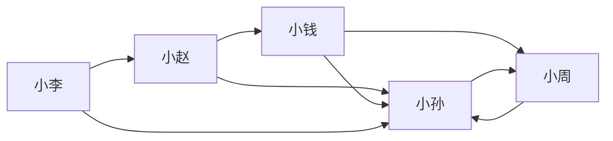
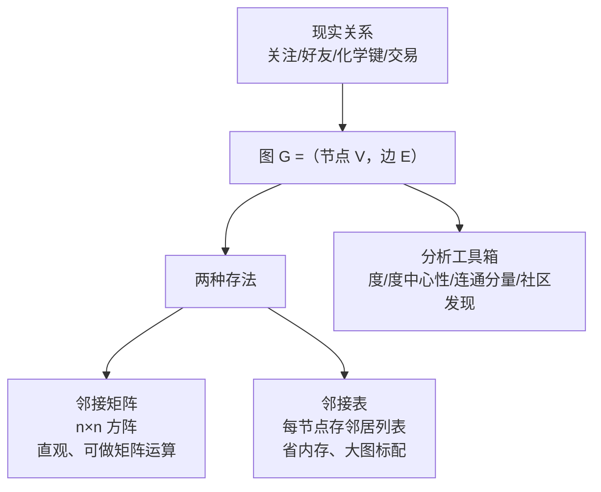

# 图数据入门

> **一句话理解**：图（Graph）= 节点（点）+ 边（关系）——它是描述"谁和谁有关系"的数学语言，社交网络、分子、路网、用户-物品交互，全都可以装进"点 + 线"这同一个模子。

[⬆️ 返回总目录](../../../README.md) · [⬆️ 返回本篇](../README.md) · [⬅️ 返回本章目录](./README.md)

| 属性 | 说明 |
|------|------|
| 难度 | ⭐⭐（进阶） |
| 所属分支 | 图 |
| 前置知识 | 无 |

---

## 📌 这一节解决什么问题

机器学习最熟悉的数据是表格：每行一个样本、每列一个特征。但很多重要信息天生不是表格，而是**关系**：

- 判断一个新注册账号是不是欺诈小号——单看它的注册时间、头像、昵称都正常；一看关系：它和 37 个已被封的账号登录过同一台设备——危险信号全在"连接"上；
- 判断一个分子有没有药性——原子（点）本身都认识，关键是原子怎么连接（化学键）；
- 猜你可能认识谁——你的好友列表（点）和他的好友列表怎么重叠（边）。

表格擅长描述"每个个体长什么样"，图擅长描述"个体之间怎么连"。本节先把图的语言学会：节点、边、度、邻接矩阵——它们是下一页图神经网络的地基。

## 🌱 通俗理解

把图想象成一场聚会：

- 每位客人是一个**节点（Node / 顶点）**；
- 谁跟谁说过话、谁关注谁，是一条**边（Edge）**——微博的关注有方向（我关注你，你不一定关注我），叫**有向图**；微信好友没方向（加了就是互相的），叫**无向图**；
- 一个人聊过多少客人，就是他的**度（Degree）**——有向图再分**出度**（他主动关注了几人）和**入度**（几人关注他）。

聚会进行一小时后你想知道谁是核心人物：不用挨个采访，站在高处看一圈——被围在中间、和最多人连线的那位就是。**看结构，不看个体**——这正是图数据的精髓。

## 📋 举个例子

一个 5 人关注网络（箭头 = "关注"，有向图）：



把它写成**邻接矩阵（Adjacency Matrix）**——行 = 关注者，列 = 被关注者，第 $i$ 行第 $j$ 列为 1 表示"行的人关注了列的人"：

| 关注 ↓ / 被关注 → | 小赵 | 小钱 | 小孙 | 小李 | 小周 |
|------|------|------|------|------|------|
| 小赵 | 0 | 1 | 1 | 0 | 0 |
| 小钱 | 0 | 0 | 1 | 0 | 1 |
| 小孙 | 0 | 0 | 0 | 0 | 1 |
| 小李 | 1 | 0 | 1 | 0 | 0 |
| 小周 | 0 | 1 | 1 | 0 | 0 |

逐行数 1 的个数得**出度**，逐列数得**入度**：

| 人 | 出度（关注了谁） | 入度（被谁关注） | 总度 | 解读 |
|------|------|------|------|------|
| 小孙 | 1（小周） | **4**（赵/钱/李/周） | **5** | 除了自己人人关注——**中心人物** |
| 小赵 | 2（钱、孙） | 1（李） | 3 | 活跃的普通用户 |
| 小钱 | 2（孙、周） | 1（赵） | 3 | 普通用户 |
| 小周 | 1（孙） | 2（钱、孙） | 3 | 普通用户 |
| 小李 | 2（孙、赵） | **0** | 2 | 只关注别人、没人关注他 |

**谁最像中心人物？小孙。** 总度 5 最高，入度 4 断层领先——"被多少人关注"（影响力）和"关注多少人"（活跃度）在图里是两个独立的信号，这正是表格数据表达不出来的结构信息。

<details>
<summary>📊 展开完整算例：用度中心性给"中心人物"排序</summary>

度中心性（Degree Centrality）把度归一化到 0~1 附近，方便不同大小的图互相比较：

$$
C_D(v) = \frac{d(v)}{n-1}
$$

> 👉 **人话**：n 个人的圈子里理论上最多连 n−1 个人，你实际连了几个，占比多少——占比越高越"中心"。

按总度计算（n = 5，除以 4）：

| 排名 | 人 | 总度 | 度中心性 $C_D$ |
|------|------|------|------|
| 1 | 小孙 | 5 | 1.25 |
| 2 | 小赵 / 小钱 / 小周 | 3 | 0.75 |
| 5 | 小李 | 2 | 0.50 |

两个细节：

1. 有向图的总度可以超过 n−1（因为出入度可以叠加），所以 1.25 > 1 不奇怪；若只看影响力，可用入度中心性：小孙 4/4 = 1.0，断层第一；
2. 度中心性只看"连了多少"，不看"连的人重不重要"——如果关注了小孙的人本身很热门，小孙实际影响力更大。这种"重要节点带飞"的思路，就是搜索时代大名鼎鼎的 PageRank，与度中心性同属一族。

</details>

## 🧠 核心原理

### 整体流程：从关系到矩阵



### 逐步拆解

**① 邻接矩阵几乎全是 0（稀疏性）。** 上面 5 人矩阵 25 个格子只有 8 个 1。放到真实社交网络：1 万用户的矩阵有 $10^8$ 个格子，每人平均关注 100 人，非零格子只占约 1%；网络越大，矩阵越空——**万人社交矩阵几乎全 0**。所以大图的存储都用邻接表（每个节点只存自己的邻居清单），稠密矩阵只用于教学和矩阵推导。

**② 图数据的三个特点**（也是 CNN/RNN 为难的地方）：

1. **无固定顺序**：把 5 个节点重新编号、邻接矩阵行列同步换序，图还是同一个图——神经网络却会把"换编号"当成新输入；
2. **邻域可变长**：小孙有 4 个邻居、小李 0 个——不像句子长度不一尚可补齐，节点邻居数量差异是结构本身；
3. **结构本身携带信息**：朋友的数量、朋友的朋友是否互识，都在暗示节点性质（朋友多的人大概率活跃、团伙成员之间连边密集）。

**③ 图上的三大任务**（一句话版）：

| 任务 | 一句话 | 例子 |
|------|------|------|
| 节点分类（Node Classification） | 判断**某个点**是什么 | 判断用户兴趣标签、账号是否欺诈 |
| 链接预测（Link Prediction） | 猜**两点之间**会不会有边 | "猜你可能认识谁"——正是推荐的近亲（[第 8 章](../08-推荐系统/README.md)） |
| 图分类（Graph Classification） | 判断**整张图**是什么 | 判断一个分子有无药性、一段代码图有无漏洞 |

## 💻 动手试试

```python
# 先安装：pip install networkx numpy
import networkx as nx

names = ["小赵", "小钱", "小孙", "小李", "小周"]
edges = [("小赵", "小钱"), ("小赵", "小孙"), ("小钱", "小孙"), ("小钱", "小周"),
         ("小孙", "小周"), ("小周", "小孙"), ("小李", "小孙"), ("小李", "小赵")]

G = nx.DiGraph()
G.add_nodes_from(names)     # 先加节点，保证邻接矩阵行列顺序稳定
G.add_edges_from(edges)     # 有向边：A→B 表示 A 关注 B

A = nx.to_numpy_array(G, nodelist=names).astype(int)   # 邻接矩阵
print("邻接矩阵（行 = 关注者，列 = 被关注者）：")
print("        " + "  ".join(names))
for name, row in zip(names, A):
    print(f"{name}: " + "  ".join(map(str, row)))

for name in names:
    print(f"{name}: 出度={G.out_degree(name)}, 入度={G.in_degree(name)}, 总度={G.degree(name)}")

cent = nx.degree_centrality(G)      # 度中心性：总度 / (n-1)
for name, c in sorted(cent.items(), key=lambda x: -x[1]):
    print(f"{name}: 度中心性 = {c:.2f}")
# 预期输出：小孙总度 5、入度 4、度中心性 1.25，三项全部第一——和正文手算一致
```

## 🔥 炼丹小灶

> 🔥 **炼丹小灶**：拿到一张真实图，先做三件事——
> - 配方：看**度分布**（社交图通常长尾/幂律：极少数节点度极大）、数**连通分量**（图断成几块）、查**自环与重复边**（要不要清洗）；
> - 玄学：真实数据构图永远比想象脏——同一实体多种 ID 对不上，是图项目第一杀手（见[生产实战](./99-生产实战.md)）；
> - ⚠️ 以上是经验参考值，不是圣旨；换数据集请重新炼。

## 🔗 在知识树中的位置

- **上游**：[推荐系统全景](../08-推荐系统/01-推荐系统全景.md)——用户-物品交互就是一张二部图，是最常见的图数据之一；
- **下游**：[GNN 核心模型](./02-GNN核心模型.md)——在图上做表征学习的主力；
- **横向对比**：与[聚类与降维](../../2-经典机器学习/03-机器学习/06-聚类与降维.md)都在"利用数据结构"，但聚类看"点的远近"，图看"点怎么连"。

## ⚠️ 常见误区

- **误区一**：图 = 图片/统计图表 → 本书的图是 Graph（点线结构），不是 image 也不是 chart；词频高发区，读论文先看清语境；
- **误区二**：有向图无向图随便选 → 关注、转账、引用有方向，混用会把"单方面关注"错算成"互相关注"，下游分析全歪；
- **误区三**：大图用邻接矩阵存 → 百万节点的稠密矩阵要 $10^{12}$ 个格子，内存直接爆；工程上一律邻接表或稀疏矩阵。

## 📝 小结与自测

**要点回顾**

- 图 = 节点 + 边；有向图分出度（主动连接）与入度（被连接）；
- 邻接矩阵是图的算盘，但真实大图稀疏（99% 是 0），存储用邻接表；
- 图数据三特点：无固定顺序、邻域可变长、结构本身携带信息；
- 三大任务：节点分类（这个点是什么）、链接预测（两点会不会连）、图分类（整张图是什么）。

**自测一下**（点击展开答案）

<details>
<summary>问题 1：为什么说"打乱节点编号，图不变"会让普通神经网络头疼？</summary>

神经网络的输入维度是有固定含义的（第 1 维永远是第 1 个特征）。图换了编号，同一个节点的输入位置就变了，网络等于看到一个全新的样本；但图的结构（谁连谁）其实没变。模型必须对节点顺序"不敏感"，这是设计 GNN 的硬约束。

</details>

<details>
<summary>问题 2：入度和出度各衡量什么？小李小孙对比说明什么？</summary>

出度衡量"主动连接别人的活跃度"，入度衡量"被别人连接的影响力"。小李出度 2、入度 0——热情关注别人但没人理；小孙入度 4——几乎人人关注他，是信息扩散的关键节点。两个指标交叉，才能定位一个人在网络中的角色。

</details>

## 📚 延伸阅读

- 工具：NetworkX 官方文档——Python 图分析入门首选，https://networkx.org/documentation/
- 课程：Stanford CS224W Machine Learning with Graphs——图机器学习最著名的公开课
- 博客：Visualizing Graphs 教程（NetworkX + matplotlib 入门画图）

---

[⬅️ 上一页：第 9 章：图神经网络](./README.md) · [返回本章目录](./README.md) · [下一页：GNN 核心模型 ➡️](./02-GNN核心模型.md)
