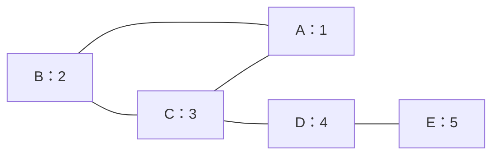
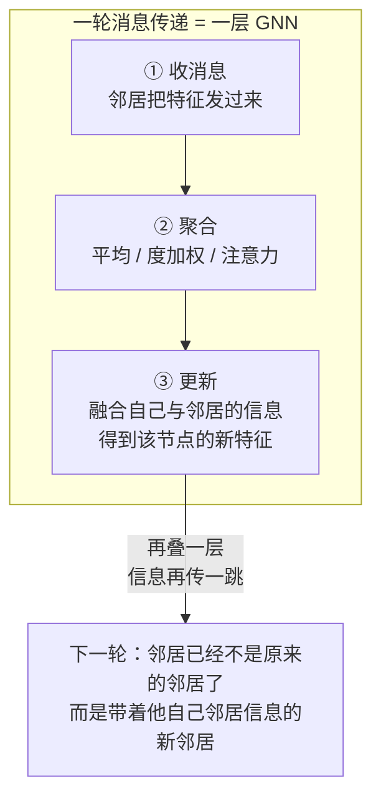

# GNN 核心模型

> **一句话理解**：图神经网络（GNN）的发动机只有一个动作——**消息传递（Message Passing）**：每个节点收集邻居的特征、聚合成一条消息、用它更新自己；重复几轮后，每个节点的向量就"泡透"了周围几跳的结构信息。

[⬆️ 返回总目录](../../../README.md) · [⬆️ 返回本篇](../README.md) · [⬅️ 返回本章目录](./README.md)

| 属性 | 说明 |
|------|------|
| 难度 | ⭐⭐⭐⭐（高阶） |
| 所属分支 | 图 |
| 前置知识 | [图数据入门](./01-图数据入门.md)；[Transformer 与注意力机制](../07-自然语言处理与LLM/02-Transformer与注意力机制.md)（读懂 GAT 时需要） |

---

## 📌 这一节解决什么问题

想在图上做机器学习，先要回答：**每个节点的"特征向量"从哪来？**

上一节说过，图没有固定顺序、邻域长度可变，CNN 的固定窗口和 RNN 的序列展开都套不上。老办法是**手工设计图特征**：每个节点的度、共同好友数、所在社区编号……能用，但手工列表永远写不全——"朋友的朋友的聚类系数"这种高阶结构，人工枚举到天荒地老。

图神经网络换了一条路：把"参考邻居"本身做成**可学习的神经网络层**——不指定要提取什么结构特征，只规定"邻居信息如何流动、如何聚合"，让梯度下降自己学出每个节点最好的向量。于是，[第 8 章](../08-推荐系统/README.md)里"用户向量、物品向量"的故事在图上重演：这次学出来的向量，天生携带关系结构。

## 🌱 通俗理解

两种生活图景，正好对应消息传递的两面：

- **朋友圈互相影响**：你每月的观点，总会被常来往朋友的观点"平均"掉一些——朋友的品味、立场慢慢渗进你的判断。泡得越久，你和圈子越像；而你的朋友也在被他的圈子影响——**影响是逐轮扩散的**；
- **部门例会逐级汇总**：组员把情况汇报给组长（第一轮聚合），组长带着"组的共识"参加部门会（第二轮聚合），部门经理再汇总给公司（第三轮）。**层级数 = 信息向上传几跳**——两层 GNN，意味着"朋友的朋友"也开始影响你。

每一轮消息传递就是三步：**收**（邻居把特征发过来）→ **聚**（平均/加权平均/注意力）→ **新**（融合成自己的新特征）。所有 GNN 模型的区别，几乎只在"聚"这一步怎么做。

## 📋 举个例子

一张 5 节点的小图（无向），每个节点初始带一个数值特征（想象成"兴趣值"）：



邻居关系：A 的邻居是 B、C；B 的邻居是 A、C；C 的邻居是 A、B、D；D 的邻居是 C、E；E 的邻居只有 D。

**手推一轮消息传递**（聚合方式取最简单的"邻居平均"，先不含自己）：

| 节点 | 初始值 | 邻居及取值 | 新值 = 邻居平均 |
|------|------|------|------|
| A | 1 | B(2)、C(3) | (2+3)/2 = **2.5** |
| B | 2 | A(1)、C(3) | (1+3)/2 = **2.0** |
| C | 3 | A(1)、B(2)、D(4) | (1+2+4)/3 ≈ **2.33** |
| D | 4 | C(3)、E(5) | (3+5)/2 = **4.0** |
| E | 5 | D(4) | 4/1 = **4.0** |

看两个细节：

1. **信息流了一跳**：E 的"5"还碰不到 B（隔了 D、C 两跳），但已经传到了 D；A 原来是 1，被邻居拉到 2.5——它不再是"孤立的 1"，而是"住在 2 和 3 之间的那个点"；
2. **邻居少的节点个性强**：E 只有一个邻居 D，新值完全由 D 决定（度=1 的节点几乎没有"投票权"），这也解释了后面为什么冷启动节点（没邻居）是图模型的软肋。

<details>
<summary>📊 展开完整算例：第二轮消息传递与"过平滑"苗头</summary>

对第一轮的结果再做一次"邻居平均"：

| 节点 | 第 1 轮值 | 邻居的第 1 轮值 | 第 2 轮新值 |
|------|------|------|------|
| A | 2.5 | B(2.0)、C(2.33) | (2.0+2.33)/2 ≈ **2.17** |
| B | 2.0 | A(2.5)、C(2.33) | (2.5+2.33)/2 ≈ **2.42** |
| C | 2.33 | A(2.5)、B(2.0)、D(4.0) | (2.5+2.0+4.0)/3 ≈ **2.83** |
| D | 4.0 | C(2.33)、E(4.0) | (2.33+4.0)/2 ≈ **3.17** |
| E | 4.0 | D(4.0) | **4.0** |

对比三轮的数值范围（最大值 − 最小值）：

| | 初始 | 第 1 轮 | 第 2 轮 |
|------|------|------|------|
| 数值范围 | 5 − 1 = **4** | 4.0 − 2.0 = **2.0** | 4.0 − 2.17 ≈ **1.83** |

节点间的差异一轮比一轮小——大家的向量正在趋同。真实 GNN 里每层还带可学习的变换和激活，不会这么快"糊成一片"，但堆到五六层以上，所有节点的向量会高度相似，分不出谁是谁——这就是**过平滑（Over-smoothing）**，也是 GNN 通常只叠 2~3 层的根本原因。

</details>

## 🧠 核心原理

### 整体流程：消息传递



### 逐步拆解

**① 一层的数学骨架。** 对节点 $v$，第 $k$ 层到第 $k{+}1$ 层：

$$
h_v^{(k+1)} = \mathrm{UPDATE}\Big(h_v^{(k)},\ \mathrm{AGG}\big(\{\, h_u^{(k)} : u \in \mathcal{N}(v) \,\}\big)\Big)
$$

> 👉 **人话**：我的新特征 = 我现在的特征 + 邻居们特征的一个汇总。UPDATE 负责融合，AGG 负责汇总（平均？加权？让注意力学？）——不同 AGG/UPDATE 设计，长出了不同流派的 GNN。

**② 层数 = 信息传播几跳。** 叠两层，"朋友的朋友"的特征就能流到你这里（第一层把朋友的信息聚到朋友那里，第二层再从朋友流到你）。社交网络的"六度分隔"直觉在这里失效于计算成本而非图论——理论上想看六跳就叠六层，但过平滑会先毁掉一切，所以实践中 **2~3 层是主流**，看更远的邻居靠"多采样一层邻居"而不是"多叠一层网络"。

**③ 三大模型一句话定位。**

| 模型 | AGG 怎么做 | 一句话定位 |
|------|-----------|-----------|
| GCN（Graph Convolutional Network） | 邻居加权平均（按双方度归一） | "邻居加权平均"的规范版，图里的 ResNet——简单、快、首选基线 |
| GAT（Graph Attention Network） | 注意力给重要邻居更高权重 | 邻居不平等：谁的话该多听，注意力自己学（思想同 [Transformer 的注意力](../07-自然语言处理与LLM/02-Transformer与注意力机制.md)，但只在邻居上算，不是全图） |
| GraphSAGE | 采样固定数量邻居再聚合 | 面向巨图：每次只采样几个邻居，训练和推理都能扩展到亿级节点 |

以 GCN 的一层为例（矩阵形式，$\tilde A$ 是加了自环的邻接矩阵，$\tilde D$ 是对应度矩阵）：

$$
H^{(l+1)} = \sigma\big(\tilde{D}^{-1/2}\, \tilde{A}\, \tilde{D}^{-1/2}\, H^{(l)} W^{(l)}\big)
$$

> 👉 **人话**：每个节点的新特征 = 自己和邻居的特征做"度归一化的平均"，再过一个可学习的变换 $W$ 和激活 $\sigma$。$\tilde{D}^{-1/2}$ 那两坨就是在给热门节点降权——朋友太多的节点，每句话的分量就轻一点，别让它一个淹没全场。

GAT 的关键则是把"固定权重"换成学出来的注意力权重：

$$
\alpha_{v,u} = \frac{\exp\big(\text{score}(h_v, h_u)\big)}{\sum_{w \in \mathcal{N}(v)} \exp\big(\text{score}(h_v, h_w)\big)}
$$

> 👉 **人话**：给每个邻居打一个"发言分"，softmax 归一成权重——重要的邻居多说，无关的邻居少说，权重完全从数据里学。

**④ GNN 都用在哪。** 推荐召回（把用户-物品交互图喂给 GNN，学出的向量与[双塔召回](../08-推荐系统/03-双塔模型与向量召回.md)互补——双塔快、图看得远）、药物发现（分子是天然的图，图分类筛选候选分子）、知识图谱（补全实体间缺失的关系=链接预测）、风控团伙识别（欺诈者共享设备/地址形成的密集子图，详见[生产实战](./99-生产实战.md)）。

## 💻 动手试试

```python
# 先安装：pip install torch torch_geometric
# 用 PyTorch Geometric（PyG）在经典数据集 Cora（2708 篇论文引用图，7 类主题）上做节点分类
import torch
import torch.nn.functional as F
from torch_geometric.datasets import Planetoid
from torch_geometric.nn import GCNConv

dataset = Planetoid(root="./data/Cora", name="Cora")   # 首次运行会自动下载数据集
data = dataset[0]                                      # 一张图：x 是节点特征，edge_index 是边，y 是标签

class GCN(torch.nn.Module):
    def __init__(self):
        super().__init__()
        self.conv1 = GCNConv(dataset.num_features, 16)  # 第 1 层：1433 维 -> 16 维
        self.conv2 = GCNConv(16, dataset.num_classes)   # 第 2 层：16 维 -> 7 类
    def forward(self, data):
        x, edge_index = data.x, data.edge_index
        x = F.relu(self.conv1(x, edge_index))           # 第 1 轮消息传递
        x = self.conv2(x, edge_index)                   # 第 2 轮消息传递
        return x                                        # 每个节点输出 7 类的得分

device = torch.device("cuda" if torch.cuda.is_available() else "cpu")
model, data = GCN().to(device), data.to(device)
optimizer = torch.optim.Adam(model.parameters(), lr=0.01, weight_decay=5e-4)

for epoch in range(200):                               # 半监督：只用 train_mask 标记的 140 个节点算损失
    optimizer.zero_grad()
    loss = F.nll_loss(model(data)[data.train_mask], data.y[data.train_mask])
    loss.backward()
    optimizer.step()

model.eval()
pred = model(data).argmax(dim=1)                       # 对全部 2708 个节点预测（含没标签的）
acc = (pred[data.test_mask] == data.y[data.test_mask]).float().mean()
print(f"测试集准确率: {acc:.4f}")
# 预期输出：测试集准确率约 0.80~0.81——只用 140 个带标签节点，
# 靠"消息传递借用邻居标签的信息"，就能给全图 2708 篇论文分对八成
```

## 🔥 炼丹小灶

> 🔥 **炼丹小灶**：GNN 节点分类的起点配方——
> - 配方：2~3 层 GCN，隐藏维 16~64，dropout 0.5，Adam lr 0.01、weight_decay 5e-4，训 100~300 轮早停；
> - 玄学：效果差先加自环/度归一化检查数据，再换 GAT，最后才加层——**加深不如加宽，加宽不如采好邻居**；过平滑的信号是验证集与训练集一起躺平；
> - ⚠️ 以上是经验参考值，不是圣旨；换数据集请重新炼。

## 🖱️ 动手玩

> 🎮 **本库实验场**：[注意力热力图](../../../playground/attention.html)——GAT 的"给重要邻居更高权重"与 Transformer 注意力同源，拖动看权重分布怎么变。
> 🕹️ **延伸玩一玩**：[Transformer Explainer](https://poloclub.github.io/transformer-explainer/)——直观看到注意力权重如何决定"听谁的多、听谁的少"。

## 🔗 在知识树中的位置

- **上游**：[图数据入门](./01-图数据入门.md)——节点/边/邻接矩阵是消息传递的原材料；[Transformer 与注意力机制](../07-自然语言处理与LLM/02-Transformer与注意力机制.md)——GAT 的注意力思想来源；
- **下游**：[生产实战](./99-生产实战.md)——风控与推荐中的图方案落地；
- **横向对比**：CNN 在规则网格（图像像素）上滑动窗口聚合，GNN 在任意图上沿边聚合——"聚合局部邻域"同款直觉，作用域从"固定窗口"换成"可变邻居"。

## ⚠️ 常见误区

- **误区一**：GNN 层数越多看得越远、效果越好 → 层数多确实看得远，但过平滑让所有节点向量趋同、区分度崩塌；主流用法是 2~3 层 + 邻居采样，不是深挖层数；
- **误区二**：GAT 的注意力 = Transformer 的注意力 → 思想同源，范围不同：Transformer 对序列里**所有**位置算注意力，GAT 只对**该节点的邻居**算——图的结构先验限制了注意力范围；
- **误区三**：上图就得用 GNN → 很多生产问题用手工图特征（度、共同好友数）+ GBDT 就够了，GNN 是"数据量大、结构复杂时"的重武器（见下一页）。

## 📝 小结与自测

**要点回顾**

- GNN 的发动机是消息传递：收邻居消息 → 聚合 → 更新自己；一轮 = 一层 = 信息传播一跳；
- 聚合方式定流派：GCN 度归一加权平均、GAT 注意力学权重、GraphSAGE 采样邻居扩展到巨图；
- 层数通常 2~3 层：层数太多 → 过平滑，节点向量趋同；
- 应用集中在"结构即信息"的场景：推荐召回、药物发现、知识图谱、风控团伙。

**自测一下**（点击展开答案）

<details>
<summary>问题 1：两层 GNN 之后，节点 A 的特征里"含"哪些节点的信息？</summary>

含 A 自己、A 的邻居（1 跳）、以及邻居的邻居（2 跳）的信息。第一层先把 1 跳邻居的特征聚到各邻居节点里，第二层邻居再把"已被其邻居影响过"的特征传给 A——所以 2 跳信息以"稀释过的形式"到达 A。这正是"层数 = 传播跳数"的含义。

</details>

<details>
<summary>问题 2：为什么 GNN 不像 CNN 那样堆几十层？</summary>

CNN 有残差连接等工具对抗退化，而 GNN 每层都在做"邻居平均"式的平滑——层数越多，节点向量越趋同（过平滑），最终所有节点分不出彼此，分类精度崩塌。所以 GNN 用"浅层 + 邻居采样"或"残差/跳跃连接"来看更远的结构，而不是一味堆深。

</details>

## 📚 延伸阅读

- 论文：Semi-Supervised Classification with Graph Convolutional Networks（GCN, 2017），https://arxiv.org/abs/1609.02907
- 论文：Graph Attention Networks（GAT, 2018），https://arxiv.org/abs/1710.10903
- 论文：Inductive Representation Learning on Large Graphs（GraphSAGE, 2017），https://arxiv.org/abs/1706.02216
- 工具：PyTorch Geometric 官方文档——GNN 实现首选框架，https://pyg.org/

---

[⬅️ 上一页：图数据入门](./01-图数据入门.md) · [返回本章目录](./README.md) · [下一页：生产实战 ➡️](./99-生产实战.md)
